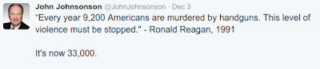
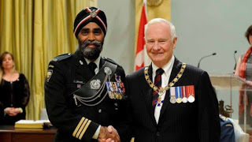
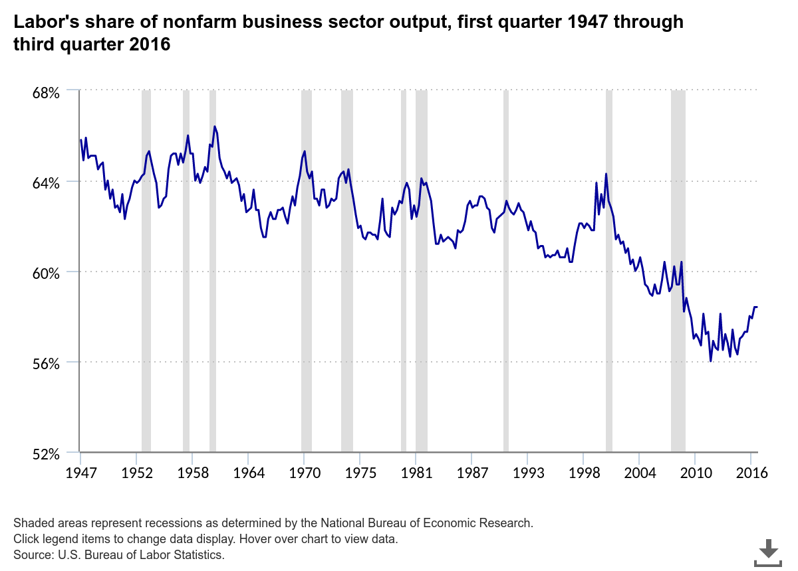
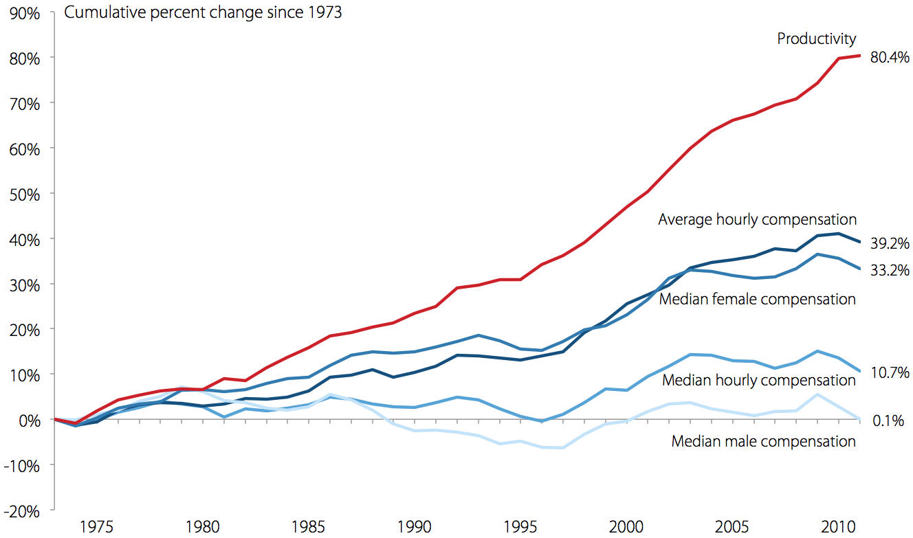

# Week 48

A more focused study, however, is needed to truly understand that the
Star Wars films are actually the story of the radicalization of Luke
Skywalker. From introducing him to us in A New Hope (as a simple farm
boy gazing into the Tatooine sunset), to his eventual transformation
into the radicalized insurgent of Return of the Jedi (as one who sets
his own father’s corpse on fire and celebrates the successful bombing
of the Death Star), each film in the original trilogy is another step
in Luke’s descent into terrorism.

Hah

The article turned everthing upside down: Luke is not a hero, but a
religious fundemantalist bent on jihad. The empire and Vader were
actually the good guys... Weird.. and complete non-sense - but it's
funny.

---

Link

Realists agree that power is what drives international politics, but
they disagree about exactly when and where it should be unleashed or
husbanded [..] Realism is an attitude, not a doctrine.

Even as an attitude it is misguided

---

Bruce B. de Mesquita

The set of disputes also allows us to examine how the outcomes of
disputes affect the ability of leaders to retain office. The members
of the winning coalition and selectorate care about how their state
fares in international politics, both for material and policy
concerns. Militarized disputes are the most signal international
events a nation and its leader face, so we expect that the outcomes of
disputes should have a large effect on the ability of leaders to hold
office. Even if the enemy cannot remove a leader, her failure to best
that enemy may lead her own winning coalition to abandon her in favor
of a new leader. We draw attention to this claim as we explore the
question suggested by the title of this chapter: Is the enemy outside
more dangerous than the enemy within? Are leaders more worried about
being overthrown by another state or by their own supporters? This
question returns us to a central problem in the theory of
international relations. Realists (e.g., Waltz 1979) claim that the
external threat to a state’s existence is so great that its leaders
must always attend to the external security of the state. We and
others (e.g., Lamborn 1991) contend that leaders see international
politics through a lens of domestic politics. How a state fares in
international politics is important for a leader, but she perceives
success through the eyes of her winning coalition (BBM, The Logic of
Political Survival).

I'll go with the guy who knows math

According to BBM, leaders do not act for 'national interests' or
'balance of power' - they make choices to satisfy / grow / keep their
winning coalition.

---

Research 

A large body of research identified, and then sought to explain, the
tendency for democracies to win wars. The effect is large—democracies
win almost all the wars they start and about two-thirds of the wars in
which they are targets of aggression [..]

While both democracies and non-democracies have an obvious interest in
victory, democracies are better able to make war
collectively. Autocracies, with the small winning coalitions
highlighted by the literature, tend to seek private benefits from
fighting. A thirst for private goods means that autocracies optimize
at a smaller coalition size to avoid diluting the spoils of
war. Democracies, in contrast, already supply public goods to large
domestic winning coalitions. They therefore gravitate toward war aims
that are less adversely affected by the number of allies or
participants. [..]

Interesting

This is the kind of research I'd like to see more of. A suggestion to
IR practitioners: learn statistics, math (and follow BBM!). Otherwise
it's all bunch of hand waving, and words.

---

NYT

Researchers at the Massachusetts Institute of Technology, New York
University and the University of Toronto reported a new type of “one
shot” machine learning on Thursday in the journal Science, in which a
computer vision program outperformed a group of humans in identifying
handwritten characters based on a single example.

The program is capable of quickly learning the characters in a range
of languages and generalizing from what it has learned. The authors
suggest this capability is similar to the way humans learn and
understand concepts.

The new approach, known as Bayesian Program Learning, or B.P.L., is
different from current machine learning technologies known as deep
neural networks.

Nice

---

The aftermath of the Paris terrorist attacks has now devolved into a
dark and dishonest debate about how we should respond: let’s ban
encryption, even though there’s no evidence the terrorists used it to
carry out their crime, and let’s ban Syrian refugees, even though the
attackers were neither.

It’s hard to overstate how disgusting it has been to watch, as
proven-false rumors continue to be the basis for the entire political
response, and technology ignorance and full-on xenophobia now dominate
the discussion.

The entire encryption subject became a shiny scapegoat while the truth
slowly trickled in: as of Tuesday, it was clear that American and/or
French intelligence agencies had seven of the eight identified
attackers on their radar prior to the attacks. The attackers used
Facebook to communicate. The one phone found on the scene showed the
terrorists had coordinated over unencrypted SMS text messages – just
about the easiest form of communication to wiretap that exists
today. (The supposed ringleader even did an interview in Isis’s
English magazine in February bragging that he was already in Europe
ready to attack.)

As an unnamed government official quoted by the Washington Post’s
Brian Fung said, if surveillance laws are expanded the media will be
partly to blame: “It seems like the media was just led around by the
nose by law enforcement. [They are] taking advantage of a crisis where
encryption hasn’t proven to have a role. It’s leading us in a less
safe direction at a time when the world needs systems that are more
secure.”

As dishonest as the “debate” over encryption has been, the dark
descension of the Republican party into outright racism and cynically
playing off the irrational fears of the public over the Syrian refugee
crisis has been worse. We now know the attackers weren’t Syrian and
weren’t even refugees. It was a cruel rumor or hoax that one was
thought to have come through Europe with a Syrian passport system, but
that was cleared up days ago. But in the world of Republican
primaries, who cares about facts?

Virtually every Republican candidate has disavowed welcoming any
refugees to the US, and they are now competing over who is more in
favor of banning those who are fleeing the very terrorists that they
claim to be so against.

It doesn’t matter that the US has a robust screening system that has
seen over 750,000 refugees come to the United States without incident
– the Republican-led House has now voted to grind the already
intensive screening process to a virtual halt [..]

Sad but true

---

Link

Senior members of the US intelligence community, still smarting from
the loss of the bulk data collection of phone records in the Freedom
Act this summer, are taking advantage of events in Paris to renew
arguments over surveillance.

In New York on Wednesday, the director of the FBI, James Comey,
complained that too much of the internet had gone dark. Intelligence
and law enforcement agencies both needed faster and better access to
communications data, he said.

The stripped down argument is that if you have access to everything,
it is easier to keep everyone secure. When there are attacks such as
those in Paris, the agencies say they quickly need to search back
through data to see who suspects had been talking to, helping to
identify the networks and prevent potential other attacks.

The problem with this, as with almost every terrorist incident since
9/11, is that the French intelligence agencies already knew at least
three of the attackers.

Abelhamid Abaaoud was known as an accomplice of two jihadis killed in
Belgium in January. The police had a file on Omar Ismaïl Mostefai even
before he travelled to Syria in 2013, while Sami Amimour had been
detained in 2012 on suspected terrorist links.

In other words, the failure of the French intelligence agencies is not
that they did not have enough data – but that they did not act on what
they had.

Yep

If someone merits surveillance, they have been around terror networks,
have been in and out of jail a few times, and especially for
dual-citizens they can be stripped of citizenship, and be dropped on
their country of origin preferably out of a plane with a parachute, or
somewhere else where they cannot do any more damage. Hell, I'd drop
them on one of those man-made Chinese islands and let them enjoy the
grand hospitality of the Chinese government. 

I believe some in security services have and odd obsession with
"catching the guy on the act". Like wanting to say "freeze! hands up!"
right before guy is about the press a button to blow some shit
up. It's already to late by then. These suckers need to be taken care
of before that point.

---

Official

But still, would it not help to have all information, on everyone, all the time?

Naaah

You just want to pass around pictures of naked people at the office and have a gas at their expense. Pervert.

---

You said here self-driving car technology is not ready [..]

That's not what I said

I said self-driving car tech does not drive like a human, but AFAIK
even at its current state, it drives better than a human. Self-driving
car tech  solved the problem differently (utilizing accurate Lidar
based distance data for objects, instead of going through vision),
creating a specialized software for the task much like a chess playing
program. This is far from human-like AI, but it is usable.

Side note: AI, even at this specialized / single-purpose state can
displace workers though, that much is certain. I've argued before that
it should, and that we should speed up this process as much as
possible, creating massive unemployment in the process, hastening the
onset of the 3rd Wave.

---

HuffPost

Among all of the AI issues debated by researchers [all big shots, Yann
LeCun, Andrew Ng, Gary Marcus], the one that received almost universal
agreement was the detrimental impact AI could have on the job
market. Erik Brynjolfsson, [..] explained that we're in the midst of
incredible technological advances, which could be highly beneficial,
but our skills, organizations and institutions aren't keeping
up. Because of the huge gap in pace, business as usual won't work.

Ng quickly became one of the strongest advocates for tackling the
economics issue. "I think the biggest challenge is the challenge of
unemployment," he said.

In fact, the issue of unemployment is one that is already starting to
appear, even with the very narrow AI that exists today. Around the
world, low- and middle-skilled workers are getting displaced by robots
or software, and that trend is expected to increase at rapid rates
[..]

The possibility of a basic income [..] were both brought up as
possible solutions. However, solutions like these will only work if
political leaders begin to take the initiative [..]

Go for B.I., K.I.S.S.

---

News

Finland is [..] conducting a pilot project [on basic income] with a
[..] fraction of the Finnish population participating, according to
Olli Kangas [..]. Kangas and his research team have been tasked by the
Finnish government with presenting proposals for testing [it
out..]. If the trial is a success, they could go all in, but that
could be years off. Nonetheless, Finland is on the verge of conducting
the most methodologically rigorous and comprehensive test of basic
income to date. And that alone is a big deal.

Yey

---

Question

If there was no peace agreement after the end of the Cold War, how did
countries manage?

It was called "globalization"

.. which was actually a by-word for Pax-Americana. Noone sat around
the table to hammer out the new division of power among nations after
the Cold War, USA's hegemony was subtituted for an agreement between
nations. This left Russia in an odd position, "am I the WWII victor,
or the Cold War loser?", the UN arrangement pointed to the former,
post-[Cold-]war status pointed to the latter. Everyone else, fearing
an agreement of some sort would come at some point, started to
"prepare" for this eventuality.

And now,  US wants to pull out of certain regions (i.e. Middle East)
then this creates a double-weird situation, no agreement + no
hegemony.

---

Zlkhlkhlkjkjlk Brzezinski

[From his book Strategic Vision] Historically, Russia considers itself
to be too powerful to be satisfied with being merely a normal European
state and yet has been too weak to permanently dominate Europe. It is
noteworthy in this connection that its greatest military
triumphs—notably, Alexander’s victorious entry into Paris in 1815 and
Stalin’s celebratory dinner in Potsdam in mid-1945—were more the
byproducts of the folly of Russia’s enemies than the consequence of
enduringly successful Russian statesmanship. Had Napoleon not attacked
Russia in 1812, it is doubtful that Russian troops would have marched
into Paris in 1815. For within less than five decades of Alexander’s
triumph, Russia was defeated in the Crimean War by an Anglo-French
expeditionary force deployed from afar by sea. Five decades later in
1905, it was crushed in the Far East by the Japanese army and navy. In
World War I,  Russia was decisively defeated by a Germany that was
fighting a prolonged two-front war. Stalin’s victory in the middle of
the twentieth century, precipitated by Hitler’s folly, gained Russia
political control over Eastern Europe and extended into the very heart
of Europe. But within five decades of that triumph both the
Soviet-controlled bloc of Communist states as well as the historic
Russian empire itself disintegrated due to exhaustion resulting from
the Cold War with America.

Nonetheless, the contemporary postimperial Russia—because of the
wealth of its sparsely populated but vast territory rich in natural
resources—is destined to play a significant role on the world
arena. Yet historically, as a major international player, Russia has
not displayed the diplomatic finesse of Great Britain, or the
commercial acumen of the democratically appealing America, or the
patient self-control of the historically self-confident China. It has
failed to pursue consistently a state policy that prudently exploits
its natural resources, extraordinary space, and impressive social
talent to rise steadily while development. Rather, Russia has tended
to engage in bursts of triumphant and rather messianic self-assertion
followed by plunges into lethargic morass.

Moreover, though Russia’s territorial size automatically defines it as
a great power, the socioeconomic condition of its people is
detrimental to Russia’s global standing. Widespread global awareness
of Russia’s social liabilities and relatively modest standard of
living discredits its international aspirations. Its grave demographic
crisis—a negative population growth marked by high death rates—is a
testimonial to social failure, with the relatively short life span of
its males being the consequence of widespread alcoholism and its
resulting demoralization. At the same time, the growing uncertainties
regarding rising Islamic unrest along its new southern borders and
Russia’s barely hidden anxieties regarding its increasingly powerful
and densely populated Chinese neighbor, situated next to Russia’s
empty east, collide with Moscow’s great power hubris.

[..] Russia’s social performance ratings—despite the fact that it
ranks overall number one in territory, number nine in population, and
number two in the number of its nuclear weapons—are actually somewhat
worse and can be considered at best only middling in a worldwide
comparison. In the area of longevity and population growth, Russia’s
numbers are disturbingly low. Cumulatively, Russia’s and Turkey’s
ratings dramatize the dialectical reality that both are simultaneously
in some respects advanced industrial countries and yet still somewhat
underdeveloped societies, with Russia specifically handicapped by its
nondemocratic and corruption-ridden political system. The comparisons
with other countries ranked immediately above or below Turkey and
Russia respectively are especially telling. Russia’s demographic
crisis, political corruption, outdated and resource-driven economic
model, and social retardation pose especially serious obstacles to a
genuine fulfillment of the understandable ambitions of its talented
but often misruled people [..B]oth nations would benefit greatly from
a genuinely transformative relationship with a Europe that is able to
reach out confidently to the East because of its ongoing links to
America.

Moreover, the persisting disregard specifically in Russia for the rule
of law is perhaps its greatest impediment to a philosophical embrace
with the West. Without an institutionalized supremacy of law, the
adoption of a Western-type democracy in Russia has so far been no more
than a superficial imitation. That reality encourages and perpetuates
corruption as well as the abuse of civil rights, a tradition deeply
embedded in the historically prolonged subordination of Russian
society to the state.

Complicating matters further, the current geopolitical orientation of
Russia’s foreign policy elite [..] is quite conflicted and in some
respects escapist. At this time [..] full-fledged membership in the
Atlantic community through eventual membership in its economic as well
as political and security institutions is not yet Russia’s explicit
and dominant aspiration. In fact, there exist within Russia’s
political and business elites multiple interpretations of Russia’s
appropriate global role. Many wealthy Russian businessmen (especially
in St. Petersburg and Moscow) would like Russia to be a modern,
European-type society because of the resulting economic
advantages. Meanwhile, many in the political elite desire Russia to be
the dominant European power in a Europe detached from America, or even
to be a world power on par with America. And still other Russians toy
with the seemingly captivating notions of “Eurasianism,” of Slavic
Union, or even of an anti-Western alliance with the Chinese.

The “Eurasianists,” mesmerized by the sheer geographic size of Russia,
see it as a mighty Eurasian power, neither strictly European nor
Asian, and destined to play a coequal role with America and
China. They fail to realize that with their trans-Eurasian space
largely empty and still underdeveloped, such a strategy is an
illusion. A variant of this notion, the idea of a Russo-Chinese
alliance presumably directed against America, also represents an
escape from reality. The fact of the matter, painful for many Russians
to acknowledge, is that in such a Russo-Chinese alliance—assuming that
the Chinese would want it—Russia would be the junior partner, with
potentially negative territorial consequences eventually for Russia
itself.[..]

Finally Moscow’s relationship with the West is still burdened by
Russia’s ambiguous relationship with its Stalinist past. Unlike
Germany, which has repudiated in toto the Nazi chapter of its history,
Russia has both officially denounced and yet still respects the
individuals most directly responsible for some of history’s most
bloody crimes. Lenin’s embalmed remains continue to be honored in a
mausoleum that overlooks the Red Square in Moscow and Stalin’s ashes
are installed in the nearby Kremlin wall. (Anything similar for Hitler
in Berlin would surely discredit Germany’s democratic credentials.) An
unresolved ambiguity thus persists, reflected in the absence of a
clear-cut indictment of Lenin’s and Stalin’s regimes in officially
approved history schoolbooks. Official unwillingness to fully confront
head-on the ugly Soviet past, epitomized in Putin’s own equivocations
on this subject and his nostalgia for Soviet grandeur, has obstructed
Russia’s progress toward democracy while burdening Russia’s relations
with its most immediate Western neighbors.

Therefore, a Russia left to its own devices, and not deliberately
drawn into a larger democratically transformative framework, could
again become a source of tension and occasionally even a security
threat to some of its neighbors. Lacking leadership with the strength
and the will to modernize, increasingly aware of its relative social
retardation (with only Moscow and St. Petersburg regions matching the
West’s standards of living), still uneasy regarding China’s growing
global power, resentful of America’s continuing worldwide preeminence,
proud of its vast and resource-rich territory, anxious over the
depopulation of its far east and its general demographic crisis, and
alert to the growing cultural and religious alienation of its Muslim
population, Russia remains unable to define for itself a stable role
that strikes a realistic balance between its ambitions and its actual
potential.

Interesting

---

Ban-ki Moon

Excellencies:

When historians look back on this day, they will say that global
cooperation to secure a future safe from climate change took a
dramatic new turn here in Paris.

Today, we can look into the eyes of our children and grandchildren,
and we can finally, after so many years of discussion and delay, tell
them that we have joined hands to bequeath a more habitable world to
them and to future generations.

We have an agreement. It is a good agreement. You should all be proud.

Now we must stay united -- and bring the same spirit to the crucial
test of implementation.

That work starts tomorrow.

For today, congratulations again on a job well done.

Let us work together, with renewed commitment, to make this a better world for all.

Thank you.

Merci.

Congrats

---

Nick Brown

Daniel Kahneman's warning of a looming train wreck in social
psychology took another step closer towards realisation today with the
publication of this opinion piece [..] entitled "Your iPhone Is
Ruining Your Posture — and Your Mood" [in the New York Times].

[In it], Professor Amy Cuddy of Harvard Business School reports on
"preliminary research" [..] that she performed with her colleague,
Maarten Bos.  Basically, they gave some students some Apple gadgets to
play with, ranging in size from an iPhone up to a full-size desktop
computer.  The experiment gave the participants some filler tasks, and
then left, telling them that he would be back in five minutes to
debrief them, but that they could also come and get him at his desk. 
He then didn't come back after five minutes as announced, but instead
waited ten minutes.  The main outcome variable was whether the
participants came to get him, and how long people they waited before
doing so, as a function of the size of the device that they had.  It
turned out that, the smaller the device, the longer they waited [..]

It's hard to know where to begin with this.  There are other plausible
explanations, starting with the fact that a lot of people don't have
an iPhone and might well enjoy playing with one compared to their
Android phone, whereas a desktop computer is still just a desktop
computer, even if it is a Mac.  And the effect size was pretty large:
the partial eta-squared of the headline result is .177, which should
be compared to Cohen's (1988) description of a partial eta-squared of
.14 as a "large" effect.  Oh, and there were 75 participants in four
conditions, making a princely 19 per cell.  In other words, all the
usual suspect things about priming studies.

But what I find really annoying here is that we've gone straight from
"preliminary research" to the New York Times without any of those
awkward little academic niceties such as "peer review".  The article,
in "working paper" form (1,000 words) is here; check out the date (May
2013) and ask yourself why this is suddenly front-page news when,
after 30 months, the authors don't seem to have had time to write a
proper article and send it to a journal, although one of them did have
time to write 845 words for an editorial in the New York Times.  But
perhaps those 845 words didn't all have to be written from scratch,
because — oh my, surprise surprise — Professor Cuddy is "the author of
the forthcoming book 'Presence: Bringing Your Boldest Self to Your
Biggest Challenges.'"  Anyone care to take a guess as to whether this
research will appear in that book, and whether its status as an
unreviewed working paper will be prominently flagged up?

If this is the future — writing up your study pro forma and getting it
into what is arguably the world's leading newspaper, complete with
cute message that will appeal to anyone who thinks that everybody else
uses their smartphone too much — then maybe we should just bring on
the train wreck now.

Darn

Not that the peer review process is the bestest filter around; but
there is something wrong with this half-baked research getting out
there.

---

NYT

The [self-driving] cars now being tested by Google, BMW, Ford and
others all see by way of a particular kind of scanning system called
lidar (a portmanteau of ‘‘light’’ and ‘‘radar’’). A lidar scanner
sends out tiny bursts of illumination invisible to the human eye,
almost a million every second, that bounce off every building, object
and person in the area. This undetectable machine-­flicker is
‘‘capturing’’ extremely detailed, millimeter-­scale measurements of
the surrounding environment, far more accurate than anything
achievable by the human eye.

Yes

The excerpt above accentuates the point that  self-driving cars are
not yet driving like humans; their AI solves a simpler problem, by
relying on more accurate sensor data that contains, within it,
accurate distance information.  Obviously self-driving car tech is
still an incredible achivement, but there is a long way to go to
replicate humans.

Humans can drive simply by using their eyes as sensors, even one eye
because we are able to perform tasks that are known as "structure from
motion" in the vision literature (or visual SLAM, or 3D
reconstruction, or monocular vision, etc). I look at a building,
extract "interesting points" from this image, take a step, look again,
extract the same features, they would have shifted in my 2D vision, my
eye. Extrapolating from my step, the 2D dislocation, I can roughly
compute a 3D model of the environment. More images would increase the
accuracy.

This is not an easy task.  In fact nearly half of a human's cortex
activity is dedicated to vision (Felleman, D. J. and van Essen,
D. C. (1991). Distributed hierarchical processing in the primate
cerebral cortex. Cerebral Cortex, I : 1-47.). SfM  is an active area
of research (mathematicians - jump in!), and an area of interest for
me personally (I like doing more with less, human-like 3D
reconstruction from one bloddy camera, it's beyond cool IMO).

Note: there have been self-driving cars that are based on pure vision,
and vision is being used in current state-of-art self-driving cars to
complement Lidar. But there is no human-like pure vision driven system
out there ready for commercial use.

---

News

Would-be presidential nominee and full-on American bigot “The Donald”
has gotten so out of hand with his derision toward women,
African-Americans, Mexicans, the press, the disabled, and now calling
for a ban on all Muslims, that Anonymous is starting to take some of
its focus off Daesh (formerly known as the Islamic State) and focusing
it right here on our very own terrorist-in-the-making, Donald Trump.

---

David Keirsey

Because of their utilitarian character, [MBTI] Artisans will strike
off down roads that others might consider impossible, tackling
problems, making deals, clearing hurdles, knocking down barriers-doing
whatever it takes (authorized or unauthorized) to bull their way
through to a successful outcome. One prominent State Department
negotiator has exhibited all of these SP traits in his roller-coaster
career:

He has yelled at Foreign Ministers and cursed at a President. He has
negotiated agreements of immense consequence on the fly, making them
up as he goes along ... betting on himself and the deal in hand at two
o'clock in the morning. He has politely negotiated with killers and,
by his own account, at least one psychopath .... He has shamelessly
and effectively exploited the media .. .in order to promote American
policy aims and to intimidate those who stood in his way.

No high-flown speculation for the Artisan, no deep meaning or
introspection. Leave to others the protocol, the scientific inquiry,
the inward search. SPs focus on what actually happens in the real
world, on what works, on what pays off, and not on whose toes get
stepped on, what principles are involved, or why things happen
(Keirsey, Please Understand Me II).

Yes

Trump, an ESTP, shows all of the traits above. This might all be okay
in their little world, or in more tactical scenarios, but is this sort
of behavior fitting for a President? Bush was another ESTP let's not
forget (and he shares another trait with "The Trump" that I might
touch on later). Dubya was less of a loud mouth, but he did f**k it
all up in a rather STP kinda way.

---

Puten

Your excellency Mr. President, your excellency Mr. Secretary General,
distinguished heads of state and government, ladies and gentlemen, the
70th anniversary of the United Nations is a good occasion to both take
stock of history and talk about our common future.

In 1945, the countries that defeated Nazism joined their efforts to
lay solid foundations for the postwar world order.

But I remind you that the key decisions on the principles guiding the
cooperation among states, as well as on the establishment of the
United Nations, were made in our country, in Yalta, at the meeting of
the anti-Hitler coalition leaders.

The Yalta system was actually born in travail. It was won at the cost
of tens of millions of lives and two world wars.

This swept through the planet in the 20th century.

Let us be fair. It helped humanity through turbulent, at times
dramatic, events of the last seven decades. It saved the world from
large-scale upheavals.

The United Nations is unique in its legitimacy, representation and
universality. It is true that lately the U.N. has been widely
criticized for supposedly not being efficient enough, and for the fact
that the decision-making on fundamental issues stalls due to
insurmountable differences, first of all, among the members of the
Security Council.

However, I'd like to point out there have always been differences in
the U.N. throughout all these 70 years of existence. The veto right
has always been exercised by the United States, the United Kingdom,
France, China, the Soviet Union and Russia later, alike. It is
absolutely natural for so diverse and representative an organization.

When the U.N. was established, its founders did not in the least think
that there would always be unanimity. The mission of the organization
is to seek and reach compromises, and its strength comes from taking
different views and opinions into consideration. Decisions debated
within the U.N. are either taken as resolutions or not. As diplomats
say, they either pass or do not pass.

Whatever actions any state might take bypassing this procedure are
illegitimate.

Blah blah

So much talk on WWII - but the war he should be concerned about is the
last one, the Cold War, after which the world did not get a new world
order. The Cold War, remember...? The one Soviets lost? He is all
about the security council that was established after WWII because
Russia has a vote there. But some emerging countries and Germany do
not, so the council misrepresents the current world structure. Puten
pines for the last time his country was a victor, a time when his
country was treated as a great power. He wants the thing before the
thing.

---

#thegipper

---

\#goodtimes

---

Canada's New Minister of Defence

It's not the guy on the right, it's the guy on the left. So Star Trek. 

---

\#animals

I have to admit - very cute.

https://youtu.be/2hh9lWK-iwc

Another one, a monkey sees a magic trick and he starts to
laugh. Incredible.

https://youtu.be/FIxYCDbRGJc

---

New Yorker: "Americans who are opposed to being shot, a constituency
that has historically failed to find representation in Washington, are
making a new effort to make its controversial ideas heard in the
nation’s capital.“When you bring up the idea of not wanting to be shot
with members of Congress, there’s always been pushback,” Carol Foyler,
founder of the lobbying group Americans Opposed to Being Shot,
said. “Their reaction has been, basically, ‘Not being shot: who’s
going to support something like that?’”Foyler, however, believes that
the right to not be shot, much like women’s right to vote, the right
to same-sex marriage, and other rights that were deemed controversial
in their day, may be an idea whose time has finally come"

---

---

