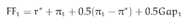
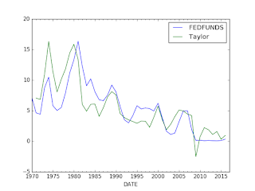

# Week 12

Comment

Some criticize the FED, but it has lots of technical capabilities, and
they have their formulas [..]

Yeah, but they don't always use their formulas

There is the so-called Taylor Rule that calculates an optimal level
for the FED funds rate  (the rate everyone watches like a hawk). The
formula is,



which is a simple relationship between inflation, an ideal rate, and
GDP. Ideal rate r* is assumed to be 2.0, \pi_t is current inflation,
\pi* is target inflation, Gap_t is the difference between real and
potential GDP. We get the data from FRED,

https://research.stlouisfed.org/fred2/

[Data](taylorfred.csv)

Using the following code, and some info from here;

```python
import pandas as pd
df = pd.read_csv('taylorfred.csv', parse_dates=True,\
                  index_col=0,comment='#')
df = df.resample('AS');longrun = 2.0
df['GDPC1'] = df.GDPC1.interpolate(method='spline',order=1)
df['Gap'] =  100. * (df.GDPC1/df.GDPPOT-1)
df['Curr'] = df.PCEPI.pct_change()*100.
df['Taylor'] = longrun + df.Curr + 0.5*(df.Curr - longrun) + 0.5*df.Gap

df[['FEDFUNDS','Taylor']].plot()
```

we can calculate the optimal rate. FEDFUNDS is what the FED has done instead.



The graphs are somewhat close, but they diverge at certain points. For
example during the 80s (Volcker years) the FF rate was much higher
than necessary. In the early 2000s, TR prescribes higher rate, but FF
was much lower. Lower-than-necessary rates was one of the main causes
of the subprime crisis, as everyone knows. 2009 is weird, here TR says
"go negative" - and this is precisely the time when "unconventional
monetary programs" were started such as QE. For 2016, formula says FF
should be higher, and Yellen is desparetely trying to go there, but
the market gyrations of Jan-Feb after small-ish hikes scared everyone,
so they seem to have slowed down.

Wouldn't it be great to replace the FED with this 7 lines of code?
Hah!

They do more than rate hikes sure, but half of what they do is
fiddling with this thing- maybe they would have more time other
things, I don't know, like regulation, etc. Fly-fishing, maybe?

---

Tech Insider

Artificial intelligence is poised to automate lots of service
jobs. The White House has estimated there's an 83% chance that someone
making less than $20 will eventually lose their job to a
computer. That means gigs like customer service rep could soon be
extinct. But it's not just low-paying positions that will get
replaced. AI also could cause high earning (like top 5% of American
salaries) jobs to disappear. Fast.

That's the theme of New York Times reporter Nathaniel Popper's new
feature, The Robots Are Coming for Wall Street. The piece is framed
around Daniel Nadler, the founder of Kensho, an analytics company
that's transforming finance. By 2026, Nadler thinks somewhere between
33% and 50% of finance employees will lose their jobs to automation
software [..]

More automation is a great thing

---

It happens to be one of the most immutable rules of business. Soft
culture matters as much as hard numbers. And if your company’s culture
is to mean anything, you have to hang—publicly—those in your midst who
would destroy it. It’s a grim image, we know. But the fact is,
creating a healthy, high-integrity organizational culture is not
puppies and rainbows. And yet, for some reason, too many leaders think
a company’s values can be relegated to a five-minute conversation
between HR and a new employee. Or they think culture is about picking
which words—do we “honor” our customers or “respect” them?—to engrave
on a plaque in the lobby. What nonsense.

An organization’s culture is not about words at all. It’s about
behavior—and consequences. It’s about every single individual who
manages people knowing that his or her key role is that of chief
values officer, with Sarbanes-Oxley-like enforcement powers to
match. It’s about knowing that at every performance review, employees
are evaluated for both their numbers and their values…

Right

---

Question

But Welch's comments above contradict another post where a CEO created
metrics that defined his company's goals? [this post]

That's different

In that case the CEO created a metric that defined what was important
for him; it was a way of communicating his priorities to the
company. He did not impose any metrics on anyone, judge people by some
cookie cutter criteria. BTW; letting people "define" their own number
won't work either - employees will feel limited by them, plus in
today's fast-paced work environment, agility, adaptability is more
important than "school work-like" measurements - noone can know what a
projects will require exactly 3 months ahead, let alone 6 months or a
year. Wealthfront CEO's approach is good - he defines a hard goal
(number based), but his approach is also soft; nothing is mandatory,
there is no straigt-jacket, but people can slowly congregate around
those aims, through osmosis, and possibly through enforcing the
culture.

Republican

[Paraphrasing] We will delay, block the [new nominee Garner's] Supreme
Court confirmation process [..]

Hah

And you wonder how a random jackass is wreaking havoc on your
party... If you do not respect the system that you are in, approach
everything from a zero-sum-game mentality, by definition you create
dysfunction, then naturally end up being identified with that
dysfunction. Then you can't complain someone like Donald Chump rides
on a wave of distrust of the "system"; a distrust that the players
themselves created.

---

Jürgen Schmidhuber

[answering the question 'in your eyes, what is the ideal division of
work between humans and computers?']  Humans should do zero percent of
the hard and boring work, computers the rest.

Yes

---

Question

On the Apple-vs-FBI issue which side are you on?

Apple

---

News

Apple’s fight with the FBI is one of the most important stories in
tech today, as its outcome will have major implications for consumer
privacy and safety. But while the FBI is essentially asking Apple to
build a backdoor into iOS to unlock the iPhone 5c used by one of the
San Bernardino shooters, other spy agencies are claiming they’re
actually in favor of strong encryption.

The NSA is one of them and it has repeatedly claimed that strong
encryption is required in today’s tech landscape.

Damn..

Not even NSA is on FBI's side? That is something. 

---

Question

Can you trade futures contracts on things other than commodities? 

Yes

There are futures on currencies, even stock indices. 

---

Question

Do futures contracts always result in delivery? 

No

For the  commodity case, whoever ends up with the contract the last
does not have to take delivery - both sides can do "cash settlement"
paying each other the difference between the buyer's margin and the
contract price.

Only 1% of contracts result in delivery. But that does not mean
delivery does not take place elsewhere. Boeing can buy a contract on
jet fuel, lock a price, then cash settle at the end, but it turns
around buys the jet fuel from a local / known / familiar producer. So
my conclusion is commodity contracts, their amount, their volume, are
always proportional to real commodity trading going on that the
contract is based on. 

Twitter


---

More of the over-the-counter banker-to-municipality non-sense, this
time from Britain. The graph here says it all. Damn shame..

"LOBO.. We are writing in response to coverage of Lender Option,
Borrower option (LOBO) loans sold to local authorities and housing
associations – exposed by Channel 4 Dispatches and recently covered by
the Evening Standard, The Independent and Financial Times (9-12
March), where banks are reported to have made up-front trading profits
of £1.5 billion. [..]

A string of municipal swaps and derivatives mis-selling legal cases
across Italy, France, Germany, Portugal and Belgium are testament to
the fact that local authorities were not in a position to safely use
complex products like derivatives, and could not be accurately
described as “sophisticated” investors with full understanding of
derivatives risks.

Banks pitched highly complex, opaque and risky products such as
‘inverse floaters’ and ‘range LOBOs’ which were inappropriate for the
needs of local authorities. In the case of Newham council, this has
had a significant adverse financial impact on its position.[..]

Unlike professional investors such as hedge funds, local authorities
did not understand the inherent risks with LOBO loans, being reliant
upon external treasury management advisers (TMAs) – who received
undeclared income streams in the form of commissions from brokers when
councils borrowed from banks"

---

\#Noah

[[-]](https://youtu.be/79TRDRPGx34)

---
