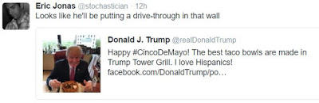
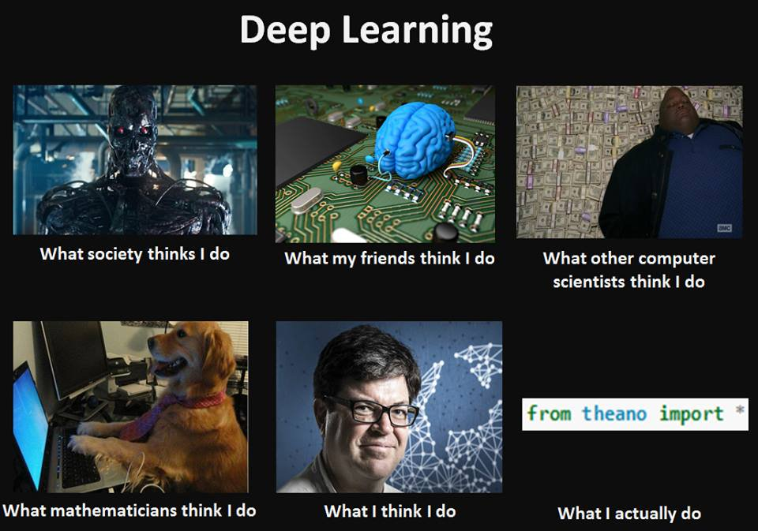
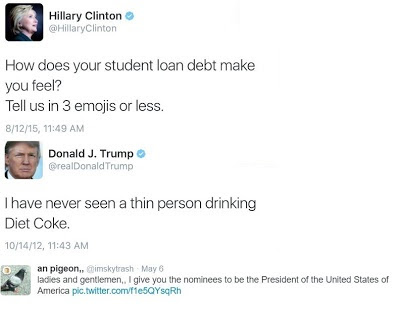

# Week 20

Question

Who is your favorite evil twin?

Garth Knight

Hands down.. He had the evil twin car, the friggin cane... Evil Twin perfection.

---

The Guardian

The 25 best-paid hedge fund managers pocketed $13bn in 2015, and most
of the big winners relied on programs, not contacts, for their big
wins.

Nice

Yep - multitude of styles,  different markets... Currency market,
futures market, both of which are larger than the equity market. There
are trend-followers, value investors, macro investors, and now
algorithmic traders who utilize all of these concepts in an
algorithmic fashion.

---

Do what you are good at [I am guessing he is being contrarian against
the advice "do what you are passionate about"]

Depends

Every personality is different; can we drop these one-size-fits-all
adages pah-lease? This (successful) actor making the comment is shaped
by two attributes, Less Perfect, and I Am CRM; the former gives the
native great expressive power, but must abstain from seeking
perfection. The latter's weakness is always trying to be right, these
people need to move away from constantly trying to be right and listen
to others (and not listen to their gut, approach things through
theoretical foundations, etc. etc). So a combination of these would
push this actor to work with others, express himself, etc. This
person, then, is at an optimal place given his profile attributes, one
could say this is what he likes to do. Passion, as in "that burning
desire on a subject matter that pushes a person do whatever", might
not be there for him, but he is still doing what likes to do.

Kevin Costner, on the other hand, said once that he so wanted to be
involved in movies that "he could even be a garbage man, but the
garbage he picked up had to be movie garbage". Costner's profile
carries hints of expressive power as well, but for this type the
native feels a need to express. His profile gives him passion, or
liking a subject and his job in a way that is compatible with his
profile.

In general I would not shoot down passion too early, in whichever form
it might manifest itself. It will get you through a lot of setbacks,
hardships while creating.  That's what the 3W economy expects us to do
right - be creative, create stuff, in tech, in human relations, in
art?

---

Comment

So listening or not listening to your gut also depends on a person's
profile

Exactly

Just like we can't give one-liner advices on "be selfish", or "don't
be selfish", or any other jackass adages you might think of, we cannot
tell people to listen or not to listen to their gut either. Some
people absolutely should not.

---

Report

Before the [basic income] pilot program [in Namibia], 42 percent of
children in the village were malnourished. Now the proportion of
malnourished children has dropped significantly, to 10 percent.

The village school reported higher attendance rates and that the
children were better fed and more attentive. Police statistics showed
a 36.5 percent drop in crime since the introduction of the
grants. Poverty rates declined from 86 percent to 68 percent (97
percent to 43 percent when controlled for migration). Unemployment
dropped as well, from 60 percent to 45 percent, and there was a 29
percent increase in average earned income, excluding the basic income
grant. These results indicate that basic income grants can not only
alleviate poverty in purely economic terms, but may also jolt the poor
out of the poverty cycle, helping them find work, start their own
businesses, and attend school.

Nice

---

Comment

If you want to set off and develop some new thing, you don't need
millions of dollars of capitalization. You need enough pizza and Diet
Coke to stick in your refigrator, a cheap PC to work on and the
dedication to go through with it.

Right

Comment

[Adding on the comment above] Harder truth: If you want to develop
some new thing, you need the privilege of enough wealth to live
without income.

Right Also

---

News

Who's downloading pirated papers? Everyone

Yep

---

News

Woman takes #2 on her boss' desk after winning the lottery

Ouch

---

News

Kim Jong-un bans all weddings, funerals and freedom of movement in North Korea

TARFU

This guy finally lost it - I profiled him and he is on the negative in all aspects, an indication things in this country will go from bad to worse, from TARFU to FUBAR. The Chinese will have to invade, one way or another, and put this guy out of his misery.

---

This [bad] treatment of moneylenders is unjust but not new. For
millennia they have been the primary scapegoats for practically every
economic problem. They have been derided by philosophers and condemned
to hell by religious authorities; their property has been confiscated
to compensate their “victims”; they have been humiliated, framed,
jailed, and butchered. From Jewish pogroms where the main purpose was
to destroy the records of debt, to the vilification of the House of
Rothschild, to the jailing of American financiers—moneylenders have
been targets of philosophers, theologians, journalists, economists,
playwrights, legislators, and the masses [..]

Today, anti-globalization demonstrators carry signs that read “abolish
usury” or “abolish interest.” Although these protestors are typically
leftists—opponents of capitalism and anything associated with it—their
contempt for moneylending is shared by others, including radical
Christians and Muslims who regard charging interest on loans as a
violation of God’s law and thus as immoral.

Moneylending has been and is condemned by practically everyone. But
what exactly is being condemned here? What is moneylending or usury?
And what are its consequences? [..]

The borrower is able to use money that he would otherwise not be able
to use, in exchange for paying the lender an agreed-upon premium in
addition to the principal amount of the loan. Not only do both
interested parties benefit from such an exchange; countless people who
are not involved in the trade often benefit too—by means of access to
the goods and services made possible by the exchange.

[Loaning] enables levels of life-serving commerce and industry that
otherwise would be impossible. Consider a few historical
examples. Moneylenders funded grain shipments in ancient Athens and
the first trade between the Christians in Europe and the Saracens of
the East. They backed the new merchants of Italy and, later, of
Holland and England. They supported Spain’s exploration of the New
World, and funded gold and silver mining operations. They made
possible the successful colonization of America. They fueled the
Industrial Revolution, supplying the necessary capital to the new
entrepreneurs in England, the United States, and Europe. And, in the
late 20th century, moneylenders provided billions of dollars to
finance the computer, telecommunications, and biotechnology
industries.

By taking risks and investing their capital in what they thought would
make them the most money, moneylenders and other financiers made
possible whole industries—such as those of steel, railroads,
automobiles, air travel, air conditioning, and medical
devices. Without capital, often provided through usury, such
life-enhancing industries would not exist—and homeownership would be
impossible to all but the wealthiest people.

Moneylending is the lifeblood of industrial-technological
society. When the practice and its practitioners are condemned, they
are condemned for furthering and enhancing man’s life on earth.

True

It's interesting that we cheer enterpreneurs as individuals who take
risks to create a business, but we usually forget about people who
loaned them money that made their business possible, who took a risk
on them. 

One of the main differences between Protestants and the Catholic
Church revolved around the issue of debt interest - Calvinist made it
[legal](http://www.bbc.co.uk/religion/0/23448808), and my guess is
Protestans owe much of their success and world-wide expansion to this
new reinterpretation - because without pricing of risk, you have no
loan, without loan, no business, no expansion.

---

Question 

But many religions ban interest charged on loans, including Islam.

Incorrect

Islam bans usury which means "excessive interest", not interest of any
kind. There are even seperate words for this in Arabic, interest
is fa'eda, usury is reba. 

---

[Paraphrasing] Poor people on food stamp programs should not eat steak.

Ummmm-Yeah

This comment was totally not cool - but that's besides the point.

The real point is no government official should be in a position to
micromanage these things. High bonuses for non-deserving CEO's suck,
but gov should not intrude in that. If there are too many highly-paid
executives, tax their ass. If poor people need help, give the money to
them. But don't micromanage payrolls, or micromanage whether people
eat steak, bread, or beaten eggs.

---

Comment

All traders, speculators are gamblers.

Not True

Traders gamble with the market the way sailors gamble with the wind. They don't.

(At least good ones do not). Sailboats are able to move in the
direction they want no matter which way the wind blows - in some cases
they might go faster, sometimes slower, but they don't go
backward. Sailboats can do this by using the proper design for their
sail. Hell, with some sail designs, a sailboat can move into the wind,
while the wind is blowing from the opposite direction! Same approach
is true while preparing a portfolio, picking a winning strategy; it's
all about engineering, and the approach is no different than any other
branch of engineering. Gambling? The game of poker was beaten by a
game-theoretic approach recently. This is mathematics all the way.

---

Comment

But this is still not as important as curing cancer.

YES IT IS

---

Straddle Bus

[[-]](https://youtu.be/eLfWqiIYgtA)

---

\#quesedilla \#chicana

---

That's awesome news right there. Go EU!

Open Access Rules!

"In what European science chief Carlos Moedas calls a "life-changing"
move, European Union member states today agreed on an ambitious new
open access (OA) target. All scientific papers should be freely
available by 2020, the Competitiveness Council—a gathering of
ministers of science, innovation, trade, and industry—concluded after
a 2-day meeting in Brussels[..]

The OA goal is part of a broader set of recommendations in support of
Open Science, a concept which also includes improved storage of and
access to research data. The Dutch government, which currently holds
the rotating E.U. presidency, had lobbied hard for Europe-wide support
for Open Science, as had Carlos Moedas, the European Commissioner for
Research and Innovation"

---

The resemblance is uncanny. That orange orangutan looks just like
him. The New Rule [segment](https://youtu.be/WB4sGX0R5ak?t=78).

\#maher

---

A little geek for Friday.  (For non-techies, in the last box he just
made a reference to a ready-made package). 

---

#coke

---
