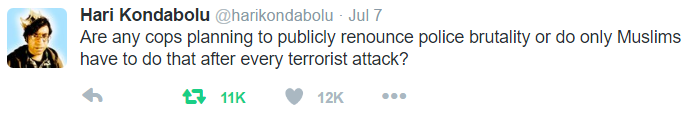
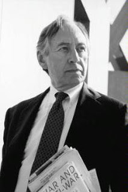

# Week 28

"Choose Wisely: Organic or Green?.. [A report] shows that milk and
dairy production is a major source of greenhouse gas emissions
(GHGs). A litre of organic milk requires 80 per cent more land than
conventional milk to produce, has 20 per cent greater global warming
potential, releases 60 per cent more nutrients to water sources, and
contributes 70 per cent more to acid rain [..].

Organic potatoes use less energy in terms of fertiliser production,
but need more fossil fuel for ploughing. A hectare of conventionally
farmed land produces 2.5 times more potatoes than an organic one [..].

Food scares are always good news for the organic food industry. The
Soil Association and other organic farming trade groups say
conventional food must be unhealthy because farmers use
pesticides. Actually, organic farmers also use pesticides. The
difference is that "organic" pesticides are so dangerous that they
have been "grandfathered" with current regulations and do not have to
pass stringent modern safety tests [..].

The proponents of organic food – particularly celebrities, such as
Gwyneth Paltrow, who have jumped on the organic bandwagon – say there
is a "cocktail effect" of pesticides. Some point to an "epidemic of
cancer". In fact, there is no epidemic of cancer. When
age-standardised, cancer rates are falling dramatically and have been
doing so for 50 years [..].

Hohenheim University [research states]: "[There are no] clear
conclusions about the quality of organic food can be reached using the
results of present literature and research results." What research
there is does not support the claims made for organic food [..]"

---

Bad Boys, Bad Boys, Whatcha Gonna Do?

Great segment from PBS - Policing the Police

http://www.pbs.org/wgbh/frontline/film/policing-the-police/

And.. whenever I hear bad news about police matters, [this
song](https://youtu.be/GazE8PAL-DE?t=23) always plays in my
head.. From the 90s reality TV show COPS. Interesting show to watch,
but I wonder if it helped or hindered the discussion on policing. Did
the public ponder what was being shown, or simply laugh at it, at this
spectacle of an human affair?

---

Trump picks Pence as running mate.

Hah

So the initial combo is T.P.?... Seriously. 

---

Comment

On police shootings, we need to side with cops. 

That's not the point

This is.

---

Question 

In Turkey politicians were subject to so many military coups. Should
they not fight back? 

Sure

But if politicians step outside the law, and into "state of emergency"
territory, then what's the difference between them and a military
junta? Even before the coup attempt Turkland president kept on
meddling in "his" party's politics, a clear violation of the
constitution (he is supposed to be impartial). At the same time people
are jailed for "insulting" the president invoking a special article in
the law that outlaws it. 

So the law is used sometimes, not the other times... This type of
utilitarian, short-termist attitude to law at the very top creates
chaos. It has been creating chaos for a very long time now. This needs
to stop.

---

Tom Friedman 

Anyone who has been following Turkey closely knows that Erdogan has
been mounting a silent, drip-by-drip coup of his own against Turkish
democracy for years — jailing reporters, hounding rivals with giant
tax bills, reviving an internal war against Turkish Kurds to stoke
nationalist passions [..]

Yep

That last act right there was another utilitarian, ends-justify-the-means action. 

---

News

Academics are banned from leaving the country in Turkey

....

Question

But what do we make of whistle-blowers then? Aren't they breaking laws?

The higher the office, the higher the need to follow the law

Law can be wrong, immoral - if regular participants see need for
change, and whistle-blowing is the only action, it is done. But there
are costs for that - and we can only applaud such people for taking
those risks to cause change at legislative / bureaucratic level.

As one gets higher in office, government, the necessity to follow the
law becomes more paramount, because wanton law-breaking at that level
unhinges everything else - it'll set precedent, can invite backlash,
and God knows what else.  

---

TV Character

[from the show *The Last Ship*, after a group of sailors are
kidnapped, blindfolded, and moved somewhere else, one of them goes]
you can estimate where you are in the world by using the sun.

Yes you can

This is fascinating "survival math". How can I tell where I am without
GPS? It might come in handy you know.. 

Latitude can be calculated using the sun. Longitude, through a
clock. First latitude.  The sun will fall at a certain angle  e on the
world depending on where we are depending on the equator. That's easy,
either through shadows or through an inclinometer app on a smartphone
(or sextant!) we can measure it. The only kicker is the season - earth
tilts depending on it (well, seasons are the result of that tilt, but
anyway), this "declination" can be approximated with,


where N is the n'th day of the year. Final formula \theta = 90 - e +
d (for northern hemisphere).

Longitude, can be calculated trough ... tadaaa .. time zones! A clock
is set to London time, we look at the local time - easiest local time
lookup is when the sun is highest, noon, 12:00. The difference of
that, and the London time is calculated, and each minute means 1/4
degrees in longitude. Presto!

It is January 10, Sun's angle is at 30 degrees. 

```
def decl(month, day):
    n = (month-1)*30. + day 
    return -23.44 * np.cos( np.radians(360/365. * (n+10.)) )

print decl(1,10)
e = 30; d = decl(1,10)
print  90 - e + d
```

Result is 38 in latitude. At noon I look at the clock I have with me,
it says 5:06 in London. 

```
print ((5*60)+6) * 0.25
```

```
76.5 
```

The final coordinates are 38 N, 76.5 W. 

---

Which City? 

Using a [CSV](world_cities.csv) of major cities in the world, 

```python
import pandas as pd
import math
def distance(lat1, long1, lat2, long2):
    degrees_to_radians = math.pi/180.0
    phi1 = (90.0 - lat1)*degrees_to_radians
    phi2 = (90.0 - lat2)*degrees_to_radians
    theta1 = long1*degrees_to_radians
    theta2 = long2*degrees_to_radians
    cos = (math.sin(phi1)*math.sin(phi2)*math.cos(theta1 - theta2) + \
          math.cos(phi1)*math.cos(phi2)) 
    arc = math.acos( cos )
    return arc
    
def find_city(lat,lon):
    dist = df.apply(lambda x: distance(lat,lon,x['lat'],x['lng']), axis=1)
    return dist.argmin()

df = pd.read_csv('world_cities.csv',index_col=['city','country','province'])
print find_city(38.0, -76.5)
```

Result

`('St. Charles', 'United States of America', 'Maryland')`

Sheeeeeet

The code, with the necessary libraries, an inclinometer, the data file
can be packed in a small device; an Arduino or Rasberry Pi based
device IMO; and it would tell the geo location, the closest city
automagically.


https://www.youtube.com/watch?v=ircLt-qvl3M

https://en.wikipedia.org/wiki/Position_of_the_Sun

---

Book (1421)

https://www.amazon.co.uk/1421-Year-China-Discovered-World/dp/0553815229

On 8 March 1421, the largest fleet the world had ever seen set sail
from China [..] The Chinese [..] reached America seventy years before
Columbus, and Australia three hundred and fifty years before Cook...

Unlikely

Even if they did, it doesn't mean anything if ships are unaware of
their location. You can sorta blunder into a location, but if it's not
mapped properly, they can't come back to it, and can't trade with that
location. And none of that that was possible until longitude was
cracked which was way past Galileo's time, well into Newton's. There
is a lot of this non-sense coming from "emerging countries" to rewrite
their past, in order to create some bullshit nationalist narrative. 

The West had to innovate on exploration, for trading purposes, and on
clocks so they could be used for longitude calculation. A lot of
people died, were lost, perished in the sea until that happened. The
British crown actually created a prize (some say it is the first
modern scientific grant), for a portable clock that would not go bad
in a voyage, and could be used for longitude. Fella named John
Harrison invented one, then a flurry of innovation followed around
clocks that would put today's Silicon Valley to shame. Fascinating
story (more can be found in the aptly named book Longitude).

---

Here is just a sampling of the products, apps and services that have
come across my radar in the last few weeks:

A service that sends a valet on a scooter to you, wherever you are, to
park your car.

A service that will pack your suitcase — virtually [..]

[T]he bulk of the above list targets a very specific (and tiny!) slice
of the population. As one colleague in tech explained it to me
recently, for most people working on such projects, the goal is
basically to provide for themselves everything that their mothers no
longer do [..].

When everything is characterized as “world-changing,” is anything?

True

Services above are all luxury. Some people find all of the above
"great tech", and they'll pooh-pooh finance - something that is 10
times more essential to people's lives.

---

Anonymous

Say something nice about the Iraq War and W. Bush.

Okay.. I'll Try

9/11 attack was a Sunni driven attack, so in order to provide some
balance to the region, the neo-cons, in their great wisdom, aimed to
re-integrate Iran back into the world. They knew if they "liberated"
Iraq a Shite majority country ruled by a Sunni, next door neighbour
Iran would be emboldened which is exactly what happened. Iran played
some power games in the area too of course, which only sped up their
reintegration. Bama administration did not have to pursue this
integration, but they did, and that's where we are now. There is no
need to flog Tony Blair endlessly, he simply wanted Britain to play a
larger role in the world, and followed W to Iraq.

The only issue with that argument is "was it worth it?". Worse
neo-cons fooled Dubya into pursuing this action (the goal was Iran,
they told him WMD), the man came up looking like a jackass in the end,
a major chink in the armor of the presidency. An entire institution
has been tainted because of this. After trillions spent, hundreds of
thousands dead - was it worth it?

Note: The part on Blair stands though; there's no need to flog the man
endlessly.

---

News

Dallas Mayor [..] dropped an extremely uncomfortable reality check:
Open Carry, the movement pushed with near-fanatical obsession by Texas
Republicans, not only did nothing to help stop the mass shooting of
police officers in Dallas, but it actually made the situation far
worse. Open Carry had an opportunity to justify its existence – and it
failed on every conceivable level.

For Rawlings, examining the aftermath of the shooting made it clear
that having dozens of scared civilians clinging to assault-style
weapons during a mass shooting was a recipe for disaster. The “good
guys with guns” didn’t suddenly become action heroes bravely stopping
a heavily-armed lunatic. They acted like any of us would: When the
shooting started, they scattered in every direction in terror of their
lives. Only unlike others, these fleeing victims were strapped with
weapons that sowed confusion. Any of them could have been a shooter
attempting to blend in [..]

Yep

---

Question

Who will Trump pick as his VP?

Some suggestions

Here is a
[list](http://www.destinationhollywood.com/movies/starwars/feature_guide_badguys.shtml). It
is even sorted from best to worst. #1 is great of course, but you
could go with Veers or even Haako as exotic picks.

---

The Justice Department is formally closing the case against Hillary
Clinton's private email server with no charges, U.S. Attorney General
Loretta Lynch announced Wednesday evening.

Good to hear

I was beginning to think: "I am sick of hearing about this shit".

Some Republicans 

[.. a]ttack FBI over decision on Hillary Clinton emails

Oh Yeah?

---

News

The GOP bill would bar many gun sales to terror suspects, but only if
federal prosecutors could prove within three days that a terrorist act
was afoot. The government would have to cover legal costs for people
for whom it unsuccessfully tried to deny firearms.

That is the stupidest idea I've ever heard

Reps, couldn't you offer some working solutions for this gun issue,
instead of worrying about bunch of emails?

---

#wellsaid



---

Rest In Piece

Alvin Toffler - 1928-2016



---

\#23Ways

[[-]](https://youtu.be/U_VaNhI4CLoa)

---

