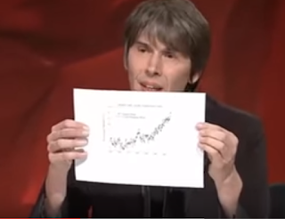
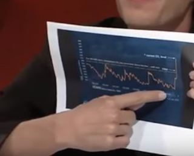
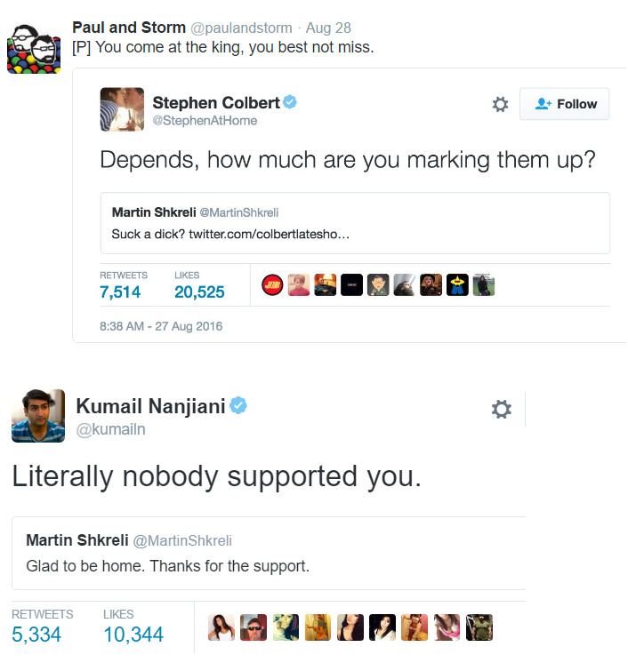

# Week 32

---

Physicist Brian Cox debating with a climate change denier showing two
graphs. The first is global temperature levels, for last 100 years,

The second graph is CO2 emissions (part per million) - watch the
insane peak at the far right.

---

What Would It Take To Power The United States With Solar Energy?

[[-]](https://youtu.be/v2IVTM0N2SE)

---

The trendy knock on Hillary Clinton [..] is the accusation that she’s
just not honest. Her opponents keep insisting that she can’t be
trusted, that she’s not telling the truth, and that there is therefore
no telling what she might do while in office. But whenever fact
checkers look at what Clinton and her opponents are saying during this
election cycle, she rates out as the most honest of the bunch [..].

It turns out Donald Trump’s statements have only rated out as being
fully “True” a mere 3% of the time. In fact he rates out as “False” or
“Pants on Fire” an astounding 61% of the time [..] The factual bottom
line is that Hillary Clinton is the most honest candidate in the 2016
election [..] In contrast, Donald Trump rates out as nearly a
pathological liar [..]

---

\#theorangerevolution

---

\#shkreli

---

A brick road laying machine..

\#now \#thatscool

---

