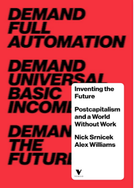
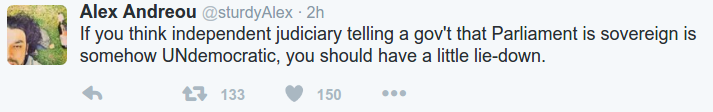

# Week 48

Christmas markets are as much a part of German national life as the 14
July festivities are French (in Nice nearly 100 people died in a
similar attack). That makes Monday’s attack seem like an unmistakable
act of terror, apparently motivated by jihadism.

It may well turn out to be someone who had come to the country as an
asylum seeker. But Merkel’s appeal at that subdued press conference
was for the country to distinguish between terrorists and refugees,
and to keep faith with her version of what it is to be German. “We
will find strength for the life we want to live in Germany – free,
united and open.”

In one sense, everything the chancellor said was intensely
political. She faces elections next September, and her fate is a
preoccupation for all of Europe. Yet there is a difference between
conveying a potent political message and politicking; and not so much
as a zephyr of politicking appeared to ruffle the trademark Merkel
demeanour – reassuringly impassive as a dumpling, as always.

There was no overt concession to those colleagues who fear that her
refugee policy, the subject of so much criticism on the right, is
likely to eat savagely into her – and their – majority. Nothing
explicitly betrayed the challenge she will face from her partners in
government, the Bavarian Christian Social Union (CSU), who are ramping
up the pressure on her. There was certainly no nod in the direction of
the far right’s charge that the casualties of Monday night’s attack
were “Merkel’s dead”.

Merkel has established herself as the best and strongest voice of the
values of a liberal Europe, and her steadfastness under pressure – at
least her rhetorical steadfastness, for her policies have been
modified to accommodate some of her critics’ concerns – is a beacon in
a continent that is increasingly inward turning, nativist and afraid.

---

Yes, Indirectly

Through representatives in Congress or the Executive.

Not through monkey referandums.

"If most voters are uninformed, [should they] make decisions about the
public’s welfare?"

---

Question

Are people better at deciding on people than issues?

Yes

There is especially some magic in the many choosing the many (campaign
funding reform can improve the situation even better). Things can go
awry in many choosing one, but still, you have to take the bad with
the good, it works out in the long run.

---

Bill Clinton

[From My Life] Then we came to [a small town called] Center Point [..]
a little place of fewer than two hundred people. The black notebook
said the man to see was Bo Reece, a longtime supporter who lived in
the best house in town. In the days before television ads, there was a
Bo Reece in most little Arkansas towns. A couple of weeks before the
election, people would ask, “Who’s Bo for?” His choice would be made
known and would get about two- thirds of the vote, sometimes more.

Thought Leader, Old School

This is pre-Internet, but the dynamic has not changed. People nowadays
find thought leaders through much more varied media, but they still
find them. We like to outsource. We outsource mechanical tasks to
mechanical tools, detailed, bean-counting computation to calculators,
then computers. It's no concidence we outsource political thought to
others.

This dynamic should not be poo-pooed. The town folk chose Bo, they
must have seen some qualities in him. If Bo stopped exhibiting these
qualities, he would cease to be their guy.

Fast-forward to today, is there chaff among today's thought leaders
that are seemingly more varied? Sure. But they all comment based using
the same backdrop, and they are not aliens. There aren't that many
obnoxiously different conclusions you can arrive given the existing
system on major issues.

Like this guy, Glenn Beck. This man used to do all kinds of conspiracy
theories, talking non-sense on random stuff, and be bitch-slapped by
Jon Stewart every other week because of them. Look at him
now. Improvement?

---

Question

Any advice to movie makers?

Please stop blowing up parliament buildings by perps in Guy Fawkes masks

Lobby.

---

Trump picks climate sceptic Pruitt for environment chief

Not Good

---

CBS News

People who got their election news on Facebook might have been looking
at more fake stories than real ones. Buzzfeed News concluded [..]

Sore Losers

A lot of news outlets are probably pissed to be losing so much revenue
to Facebook. That is actually understandable, in a way. I don't
believe fake news on FB is a big problem.

---

TechCrunch

[L]ast night Mark Zuckerberg published a response to accusations that
“fake news” on Facebook influenced the outcome of the U.S. election,
and helped Donald Trump to win.

The CEO claimed that at least 99% of news content on Facebook was
“authentic.” Zuckerberg wrote:

“Of all the content on Facebook, more than 99% of what people see is
authentic. Only a very small amount is fake news and hoaxes. The
hoaxes that do exist are not limited to one partisan view, or even to
politics. Overall, this makes it extremely unlikely hoaxes changed the
outcome of this election in one direction or the other.”

That's Probably Correct

---

HuffPost

Italy’s political troubles have deep economic roots. Much of the
media, and the analysts on which it relies, have provided a misleading
narrative on the current political problems in Italy, following
Sunday’s “no” vote on a referendum on constitutional changes. It has
been lumped together with Trump, Brexit, the upsurge of extreme
right-wing, anti-European or racist political parties and “populism,”
― which in much of the media seems to be code for demagogic
politicians persuading ignorant masses to vote for stupid
things. “Stupid things” here is defined as whatever the establishment
media doesn’t like.

Right

---

[Trying to argue against climate change] We get a lot of things wrong
in the scientific community

Yes, but _you_ are not part of the scientific community

Meyers made the point well.

---

Question

But scientists can take so many extreme (interesting!) positions.

They can

But scientists are driven by publish-ability of their ideas - you
don't get published by repeating what the other guy says. These
people's entire being is centered to live on the fringes, to push the
frontier, to find what is new. They'll know the core really well,
otherwise you cannot make the jump to the next best thing, but the
core is not interesting to them. That is a different need from the
needs of the policy maker. Policy makers cannot go around and throw
out random ideas just because it sounds interesting, and/or "might
lead to something".

I guess some also like to flirt with academese because it gives them
some sort of imbecilic legitimacy - Gellner said it best -
"[nation-states are based on a] a pyramid at whose base there are
primary schools, staffed by teachers trained at secondary schools,
staffed by university-trained teachers, led by the products of
advanced graduate schools. Such a pyramid provides the criterion for
the minimum size for a viable political unit ".

And everyone wants to imagine they are at the top of that pyramid, don't they?

---

News

Millions Mourn As Rocker/Activist Ted Nugent, Age 68, Found Alive

Ha Ha

---

Cory Doctorow

For decades Hollywood has treated computers as magic boxes from which
endless plot points could be conjured, in denial of all common
sense. TV and movies depicted data centers accessible only through
undersea intake valves, cryptography that can be cracked through a
universal key, and e-mails whose text arrives one letter at a time,
all in caps. “Hollywood hacker bullshit,” as a character named Romero
says in an early episode of Mr. Robot, now in its second season on the
USA Network. “I’ve been in this game 27 years. Not once have I come
across an animated singing virus.”[..]

It’s about time. The persistence until now of what the geeks call
“Hollywood OS,” in which computers do impossible things just to make
the plot go, hasn’t just resulted in bad movies. It’s confused people
about what computers can and can’t do. It’s made us afraid of the
wrong things. It’s led lawmakers to create a terrible law that’s done
tangible harm.

Great

There are all kinds of misunderstanding on technical matters. Also on
what and how scientists do what they do.

Holywood /  TV Land keeps going back and forth between
the Rainman model - the autistic savant that can compute but is
anti-social, or hand-waving generalist, the "idea guy" who can't do
anything on his own. There is something missing in both of these
representations.

Scientists use mathematics to outsource their thinking. Math is hard
but it's a language, you learn it, you use it. The optimal way to use
it is through derivation, not memorization. Know the core, derive the
rest. Know enough of these derivations, concepts, you can combine that
at the right moment and produce something as though it came from
memorization / raw computation. Scientists also focus intensely on
details, but on the details of general concepts. There some
bean-counting thinking, but you can't escape it all. Some is
necessary.

---

Samsung Voice Recognition App

"You have to be connected to the Internet to use this app".

Seriously

The average smartphone today is at least 30,000 times faster than the
one  used on the Apollo mission which put a man to the moon. You are
telling me you cannot code this thing to recognize simple voice
commands?

Smartphones are about mobility, and mobility is about intermittent
connections, not constant connections. Big IT companies may want to be
part of the loop inside that user-app-service cycle, but that doesn't
mean the coded up abomination (app) will necessarily have a good
design. A smartphone needs to do most of its work, as much as
possible, without connectivity.

BTW, the mapping app I mentioned here, I ended up coding it. Now I
have an Android app that shows me where I am; with detailed streets
etc. Swipe left, right, up, down you get maps in other directions. All
city's maps, in PNG images, are in one zip file. It only took 20 MB to
store them. No f***ing cloud connectivity needed.

---

Question

But isn't cloud computing useful / necessary?

Depends

For hosting, even providing corporate services over the Internet, it's
fine. I am talking about consumer facing mobile applications which
have little need for transmitting data. Rule #1 for IT development:
put processing as close to data as possible.

---

The Atlantic

Are Democrats Wasting Their Time Taking On the Electoral College?

Yes They Are 

---

Question

Does the US Congress in have enough say in governance?

It Does

The Congress is extremely powerful in US. The founders designed it
that way and with good reason. There is less chance of getting it
wrong through the many choosing the many than the many choosing
one. The singular person, the executive can go insane, then what?
Congress can override President's veto (happened once even to Obama),
if things get really bad, President can be impeached.

Here is an interesting tidbit: some say JFK felt compelled to do
something during the Cuban missile crisis, because if he didn't he was
afraid he'd be impeached. Hah! I believe the whole thing was botched
up from the beginning, with the placement of missiles in Turkland,
etc. but.. anyway. The story shows how impeachment always looms large
in a President's mind.. that's good. It's good they feel the fear of
God a little.

---

Question

How about fake news on Facebook?

I'd Worry About This Guy More


That's Rupert Murdoch, and the paper he is holding is his. The
headline reads: "Abu's Been Sleeping In My Bed".

24/7 mass-media seems to want to "generate" news these days when it
can't find enough of it. This causes all sort of problems, I believe
the dilution of parliament's power is directly connected to these
fuckers looking for something new and shiny, central characters all
the time, and turning the information flow into a popularity
contest. Trump plays them well, always feeding them something to buzz
over, but the entire process is screwed.

---

Question

How do you get your news?

With a little script

Here. That tiny program collects headlines from major sources,
produces a clickable list of headlines, ~20 pages worth. You only need
a few seconds of connection, and I have a file I can
view offline. Done and done.

```python
import feedparser, sys, codecs
import re, requests, random, os
import re, time, os
from bs4 import BeautifulSoup 

def strip_html(input):
    return BeautifulSoup(input, "lxml").text

def getnews(outfile):
    feeds = [
        ("Reuters (Top News)",'http://feeds.reuters.com/reuters/topNews',-1),
        ("Reuters (World)",'http://feeds.reuters.com/reuters/worldNews',-1),
        ("Reuters (Business)", "http://feeds.reuters.com/reuters/businessNews",-1),
        ('BBC','http://newsrss.bbc.co.uk/rss/newsonline_world_edition/front_page/rss.xml',20),
        ("Independent, The", "http://www.independent.co.uk/news/world/rss", 10),
        ("Bloomberg", "https://twitrss.me/twitter_user_to_rss/?user=business",15),
        ("The Atlantic", "http://www.theatlantic.com/feed/all/",10),
        ("Deusche Welle (World)", "http://rss.dw.de/rdf/rss-en-all", 15),
        ("The Guardian","http://www.theguardian.com/world/rss",10),
        ("Deusche Welle (Europe)", "http://rss.dw.de/rdf/rss-en-eu", 15)
    ]

    fout = open(outfile, "w")
    fout.write('''
    <html>
    <head>
    <link rel="stylesheet" type="text/css" href="/static/main.css" media="screen" />
    <meta name="viewport" content="width=device-width, initial-scale=1.0"/>
    </head>
    <body>
    ''')
               
    for name,url,lim in feeds:
        fout.write("<h3>" + name + "</h3>\n")
        d = feedparser.parse(url)
        for i,post in enumerate(d.entries):
            try:
                if lim > 0 and i==int(lim): break
                link = post.link; title = post.title
                summary = strip_html(post.summary)
                fout.write("<a href='%s'>%s</a><br/><br/>\n" % (link, title))
                fout.write("%s<br/><br/>\n" % (summary))
            except Exception as e:
                pass
    fout.close()

if __name__ == "__main__":
    dir = os.environ['TMPDIR'] + "/news.html"
    print (dir)
    getnews(dir)

```

---

Police union demands Amazon to remove 'Bulletproof Black Lives Matter'
shirt.

Hell..

That's one shirt that needs to be bullet-proof doesn't it?

---

Question

What is this "data science" I keep hearing about?

It is Probabilistic IT

IT concerns itself with automating reporting, decision making, but its
actions are deterministic. I move $100 from account A to account B,
$100 gets deducted from A, added to B. Maybe there is a rule that says
"if the amount is > blah do blah" - all these are predetermined.

With Probabilistic IT there is also reporting, decision making, but
reporting, actions are probabilistic. A typical report could be "give
me the clusters of customers", let's say 10 customer clusters are
"discovered" and reported. Certain outlier customer could end up in
one or another depending on algorithmic approach (hence the word
probabilistic) but in any case, this is a report, we are trying to
automate what an excellent marketing manager would come up with if
s/he had 10 eyes and 10 brains to sift through all the data.

I believe in the future this Probabilistic IT will come to encompass
all of IT and what is known today as IT will be "core IT". There is
already a lot of skillset overlap between the two - both require a
knowledge around how to handle a lot of data, interacting with
databases, gazillion languages.

SO data scientists should not be treated as "scientists" - they are IT
professionals, engineers.

---

Link

[T]he core issue in the [Israel / Palestenian] conflict has always
been the refusal by the Palestinians and their supporters to recognize
Israel’s legitimacy and negotiate in good faith a lasting peace
deal. That was true in 1947-8 [..]

Incorrect

To be fair, the 1947 "good deal" is a myth.

But hey, the reality on the ground today is that Palestanians lost,
and now the better way forward is, IMHO, one-state solution that
treats all citizens equally. This is true whether it is in Turkey (for
Kurds) or in Malaysia for bumiputera (which they managed well), or
non-nationalists (or simply people who aren't inbred conservatives) in
Poland. Whoever is in power needs to be accommodative. You can't get
to the top job dragging all the petty grievances with you.

---

Comment

He is a baby-boomer that's why he is rebellious (said a person about
someone else born in 1948)

He is not

Baby boomer generation is assumed to be between 1946-1964. But if one
looks at the psych profiles closely, the real time window for those
different attitudes is between 1951 and 1958. There are exceptions of
course, the block is not entirely contiguous -  Angela Merkel has it,
Vlad Pute doesn't. A quick note: this character attribute is not about
being "weird", it is about having an "earthy idealism" - knowing what
will work, what can be, what is possible, what is not etc.

Ppl born in the larger window should not fret: they would have grown
up / spent their lives around these change makers, and soaked all that
up through osmosis.

Also there is another attribute that is close to the baby-boomer one,
but shows up more randomly - this is the one Alvin Toffler had for
example.

---

Comment

How do you know so much about the profiles of people?

That's right..

I. D. D. Q. D. mothaf--ka. Better believe it.

(Juz kidding...)

---

\#santa

[[-]](http://www.sunnyskyz.com/happy-videos/5369/This-Hilarious-Job-Interview-With-Jesus-Explains-How-Santa-Claus-Got-His-Job#WGYxW8Xk1SgESeEh.15)

---

This could be a good reading for lefties - there is some nice gems in there. 

\#srnicek \#book



---

\#engage


---

Hilarious

\#bee

https://youtu.be/wuSDfVRGI54

---

Geoengineering

[[-]](https://vimeo.com/194855994)

---

And another; some bashing is overboard but it's funny..

\#conan

https://youtu.be/rh_4U65hp88

---

\#norepresentation \#withinterruption \#brexit



---

