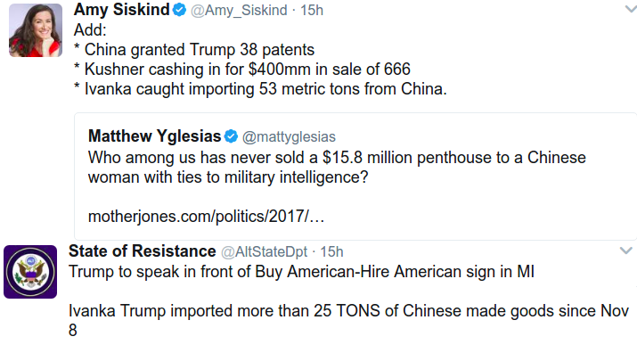
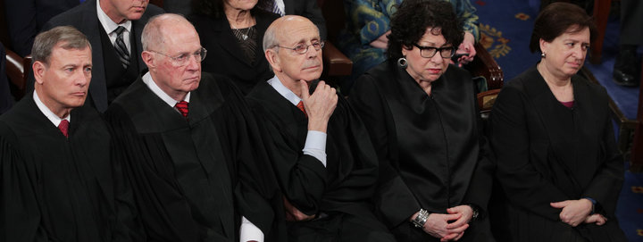
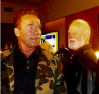
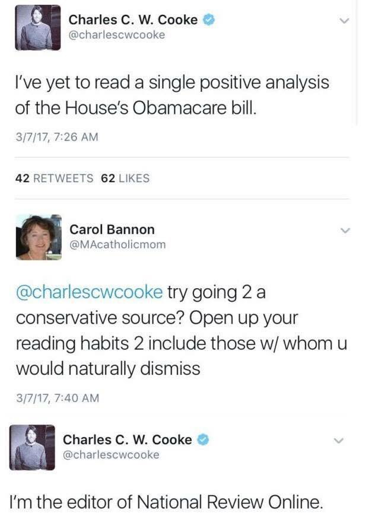
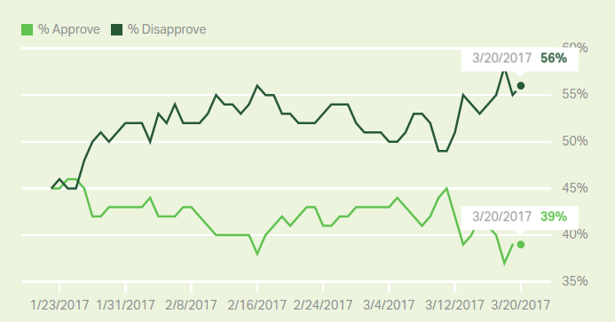
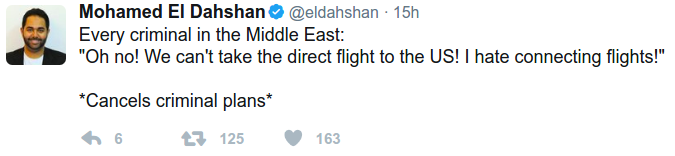
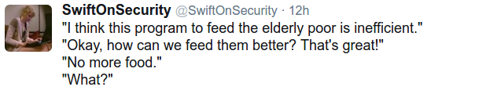

# Week 12

---

Wringing out Water on the ISS

[[-]](https://youtu.be/o8TssbmY-GM)

---

News

Le Pen has has said she believes a debate on climate change is
required as she dramatically changes her stance on the issue.

Smart move

Her party already has too many extreme positions - respecting climate
change consensus will "take the edge off" a little bit. U can't get to
and hold on to power by being extremely divisive on everything. Trump
can take note.

And let's be honest, climate change is not at the top of rightist's
"most wanted" list, alt- or not. This is something they can compromise
on. Each side has their ordering of their issues, from "definitely
want" to "can live with" to "no way", e.g. for the left, if they had
to choose between protecting Roe vs Wade decision, and pushing gun
control, they would choose the former, I am guessing.

---

Question

Is there a bubble in the US stock market? If yes, when will it pop? 

Not in near future

(But ask me again in a few months).

Here's the [doc](../../2017/03/bubble_nb.html) for calculation and
derivation of the reduced form of formula. [geek] For the reduced form
(no log oscillations) you start with the logistic equation, but relax
the carrying capacity, let it grow along with p(t). Rearrange for a
singularity, then the path to singularity is in finite-time. The end
of that time is when bubble goes pop. Sornette adds log oscillations
to better capture the behavior near the end, similar to oscillations
before a material breaks. There is another derivation that uses
stochastic calculus, suggesting something about order / chaos
(below). Fascinating stuff. [/geek].

Here is another Sornette gem: near the pop-time, it is not chaos that
reigns, it is absolutely the opposite. As the bubble pop comes close,
everyone starts acting similarly. At the apex, all actors act as if
controlled from a single center, following a single command: SELL.

(I could do a whole song and dance now about the parallels of this and
authoritarian regimes, but I won't)

---

Comment

Things are really bad right now.

Rejoice

You could have been born in [this decade](https://youtu.be/EmCkG-3oQAs?t=52).

---

A [..] problem is that the uniquely American plethora of private
insurance companies drives a squandering of resources. Legions of
staff manage independent computer systems. Each insurance company
devotes an enormous number of personnel to responding to emerging
regulations from a variety of disparate governmental programs. The
expense of this redundancy is considered “overhead” and passed along
to the consumer. The intent behind those regulations could instead be
implemented once, in a single system servicing the entire country [..]

A single-payer model would eliminate the inefficiencies of
fragmentation by converting public programs such as Medicare,
Medicaid, and CHIP into a single administratively efficient financing
system. Streamlined billing under single payer would save physicians
vast amounts in overhead.

In addition to reduced billing expenses, physicians would also enjoy a
meaningful drop in their malpractice premiums. Roughly half of all
malpractice awards are for present and future medical costs, so if
malpractice settlements no longer need to include them, premiums would
fall dramatically.

[Also the u]se bulk [of] purchasing [could be used ] to negotiate
lower costs. We spend more but use less of most services than other
member nations of the [OECD]. In other words, our prices are much
higher. As health care economist Uwe Reinhardt noted, "prices for
identical products or services in the U.S. tend to be, on average,
twice or more than the prices of the same products and services paid
in other countries…. Prices are high here because the payment side of
the health system is so fragmented that few payers have sufficient
market power to bargain for lower prices from an increasingly
consolidated supply side."

Right

---

Question

But I believe everything is suitable for free market. You said some
services like policing should be out, but I think policing would
benefit from a free market approach, I'd like to see that.

Not unless,

.. it is year 2043 and you are in a movie called Robocop. Remember the
movie's plot line? A corporation takes over the policing in Detroit,
and robocop was a cost cutting measure. So the story is about the role
of capitalism in public services (not about "a robot" who is "a cop",
the same way Jaws is not about "a shark" - it is about the
relationship between a father and his son).

---

Question

Is the job of the presidency the same as being as a CEO?

Yes

It is like being a CEO, but it's like being a CEO to a family firm
whose family is not yours.

So now Trump is not the CEO of The Trump Org, he is the CEO of, say,
Walmart. The board is composed entirely of family members, in this
example, the Waltons. Half the board hates you, the other half wants
your job, there are a few good supporters, most are lukewarm, the
shareholders have a small voice, they mostly care about what they can
get.

I guess it's clear who is who in this analogy.

---

Question

How does the executive take positions?

Stay away from "definitely-against" positions

The executive cannot withhold support for an issue based on the
support s/he is getting from the public / thought leaders. It can't be
like "be a supporter of mine, criticize less, I will give you X". It
don't work like that. Systemically speaking the man-at-the-center is
already an abomination (but a necessary evil, that's why US founders
allowed it, but took great care limiting it),  people interact with
this position in very disconnected fashion.

Here's how they do it: they look to see if any of their
"definitely-against" positions are trampled on. If it is, they go to
war. Simple as that. They don't tune, mix and match their laundry list
of issues and gauge their "support level" based on these priorities,
"hoping" they get thrown a bone if they remain in whatever position,
etc..

So the burden is on the executive: the executive needs to judge what
he can live with, offer concessions on those from day 1, veering away
from everyone's negatives, at the same time trying to get what they
want.

Also if there is uncertainty and too much horse-trading on basic
issues, everyone around the man-in-the-middle will act to "tame" the
executive. This is a potential headache area for MTBI SP Presidents.

If there is a need for a big policy shift, executive tries to convince
others to forge a coalition, like Reagan did for his strategic shift
on the Soviets. Arguing for the reverse in only a few years is a
hard-sell. If convincing is not possible, you don't do it.

---

---

Dude hacked Alexa and made a talking skull \#singularity

[[-]](https://youtu.be/3Nss_2_rwdE)

---

The expressions are absolutely brilliant.. 

---

Ha ha.. That's my teacher's teacher in the picture right there with
"the Ahnuld". Small world eh?

---

---

Not good mon. T needs to make friends fast - with these abysmal numbers whole lota House and Senate Reps can haul ass and desert him.

To make friends, u offer concessions, to anyone, to your side,  to the other side. Climate issues need to be embraced wholeheartedly (Ivanka is already a supporter, no?), this is something Fuckbart needs to and can live with. If Fuckbart protests, go to their readers and poll them. Ask them to prioritize issues, and see what comes up at the top. I guarantee climate change denial will not be one of them.

Reps do not care about the wall, or bans either. They are causing a major distraction, and making the White House look inept.

"Following through on promises" is being mumbled a lot - this has something to do with T's psych profile; The Vagabond is said to lack an inner stability, they act as if living out of a suitcase, being uncommitted and lacking follow-through. But there are various levels of follow-through here - usually the problem is a person going to the mechanic for engine trouble and forgetting to pick up the fucking car. I don't think that kind of follow-through is  what 70 year old person with certain degree of business and family success really needs to work on. But people always have a degree of self-doubt on their areas of development, so Bannon is hitting that shit, on purpose, to make Trump wobbly - that's his way in. Follow-through? T didn't know much about healthcare, immigration, or other nuances of governmet. How the bloddy hell are you gonna follow-through on things you knew nothing about?

---

---

---

