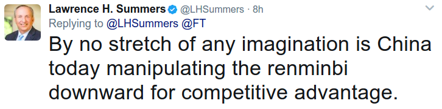

# Week 16

---

Some comedy..

Zach Gassdnfadsfaffasfkis Between the Ferns, with N. Portman. The chewbacca joke was funny.

https://youtu.be/jOVq_UL48o0

S. Meyers does A. Sorkin sketch. Sorkin was the writer of the The
American President, and and of course The West Wing. This reminded me
a quote by Sorkin, he said once that he doesn't try to make his
characters be smart, he just makes them sound smart. It shows too, bcz
I can tell a lot of what these ppl say on screen is utter
bullshit. But it sounds good - a reflection of politics these days
maybe?

https://youtu.be/BzlQTeUzC4s

As part of his "Mexican outreach" Conan got himself a role on a
Mexican soap opera. It's awesome.

https://youtu.be/KA4V3nHwRR4

---

U.K. Prime Minister Theresa May might need to revise her thinking that
an election victory will strengthen her hand in the Brexit talks.

It turns out European governments are already toughening up their
negotiating plan. Diplomats revised EU Donald Tusk’s draft guidelines
to include harder language on safeguarding citizens’ rights, Britain’s
potential financial dues, trade and security, Bloomberg’s Ian Wishart
reports.

Sad, but..

I empathize with creating a maximum win-win deal for UK post-Brexit,
but if EU is a club, people in it must be better off than when they
are out. Plus the UK-EU relationship so far probably contained some
favorable concessions in it for the British that were disadvantageous
for the EU, so the concept of win-win is always related to some
strategic necessity. 

---

Comment

US must be careful with North Korea

NK must be careful with US

Japan is a US ally in the region. NK keep lobbing grenades -missiles-
over their heads. US cannot look like a chump. Put these together -
where do we arrive?

Do we want a nuclear Korea, a nuclear Japan? No. The arrangement so
far is US provides security for Japan, and Japan forks off some cash
once in a while to cover military cost  (Japan paid for the first Iraq
War for example). NK leadership is highly erratic and don't come
across as a credible state. Do these guys think this is a game? How
disconnected from reality do you have to be to mess with a power 20
times your size?

---

News

ISIS attack in France reported close to election day

Riiiighhhttt

"ISIS attacks". Close to election day... Yeah.

---

It's funny.. \#trump \#dinosar

[[-]](https://drive.google.com/uc?export=view&id=1gbQwFTgtKVvSJwsHE5axmZTnc-jgmMRu)

---

Yes - in fact afaik on 2015 Congress voted to give China more rights
at the IMF as quid-pro-quo on their acting nice on the currency
manipulation front. It'd be hasty to act on some offense that doesn't
even exist. U don't want to get into a "fucka me? fucka you" kind of
situation prematurely.

---

Man forcibly removed from overbooked United flight. It's rough.

https://youtu.be/cfB28wQs8uQ

---

