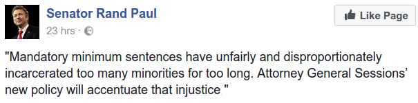

# Week 20

Interesting. IIUC productivity growth has not slowed, the top dogs
innovate madly, the "lower" tier companies is where the slowdown
occured. Paper says policy is at fault. 

"The Best vs. The Rest.. In this paper, we aim to bring the debate on
the global productivity slowdown – which has largely been conducted
from a macroeconomic perspective – to a more micro-level. We show that
a particularly striking feature of the productivity slowdown is not so
much a lower productivity growth at the global frontier, but rather
rising labour productivity at the global frontier coupled with an
increasing labour productivity divergence between the global frontier
and laggard (non-frontier) firms. This productivity divergence remains
after controlling for differences in capital deepening and mark-up
behaviour, suggesting that divergence in measured multi-factor
productivity (MFP) may in fact reflect technological divergence in a
broad sense. This divergence could plausibly reflect the potential for
structural changes in the global economy – namely digitalisation,
globalisation and the rising importance of tacit knowledge – to fuel
rapid productivity gains at the global frontier. Yet, aggregate MFP
performance was significantly weaker in industries where MFP
divergence was more pronounced, suggesting that the divergence
observed is not solely driven by frontier firms pushing the boundary
outward. We contend that increasing MFP divergence – and the global
productivity slowdown more generally – could reflect a slowdown in the
diffusion process. This could be a reflection of increasing costs for
laggard firms of moving from an economy based on production to one
based on ideas. But it could also be symptomatic of rising entry
barriers and a decline in the contestability of markets. We find the
rise in MFP divergence to be much more extreme in sectors where
pro-competitive product market reforms were least extensive,
suggesting that policy weaknesses may be stifling diffusion in OECD
economies"

---

I think [Bill Gates] went seriously astray in a recent interview when
he proposed, without apparent irony, a tax on robots to cushion worker
dislocation and limit inequality. The Microsoft co-founder is right
about the gravity of the problem and need for action, but he is
profoundly misguided in his proposed solution — and in ways that point
up problems with the current public debate.

Hah

A robot tax is like taxing companies for using Microsoft Word because
MS Word potentially displacing jobs of secretaries.. What kind of
convoluted logic is this? I think Gates is truly scared ppl will come
for his money one day, in the context of a redistributive scheme.

---

Author

People are seriously deluded if think they can have healthcare without
subsidies or individual mandates.

True

And out of these two choices, subsidization is far better. You can't
force people to have insurance. Governments provide insurance, even to
f**ing tourists visiting a country briefly (for basic care), lifting
the burden from businesses, individuals (who are becoming small
businesses themselves), so not only is everyone insured for life,
government can now better negotiate with drug / care providers with
its immense purchasing power. Even after Obamacare US is still
spending an inordinate amount on healthcare. Individual mandates are
stupid, countries doing it must drop it ASAP. Follow Canada,
Australia. Insurance companies can bitch and moan, but governments are
responsible for the welfare of their citizens, not the welfare of
insurance companies.

Another reason for SPH is that people's expectations from insurance
does not neatly fit into free-market philosophy. Health is not like
buying ketchup. This reminds me a This American Life episode: An
interviewee said "With pets, I think we're used to the idea that
they're going to die at some point. We all have that stop treatment
level. And that alone will probably keep spending from getting too out
of hand. But if my wife gets in a car accident, or my kids, my stop
treatment level? It doesn't exist. I want that insurance company to
meet me at the hospital loading dock with a truck full of money. ".

---

Tim Bray

[On why he doesn't believe in Blockchain technology that powers
Bitcoin]  I’m an old guy: I’ve seen wave af­ter wave of
landscape-shifting tech­nol­o­gy sweep through the IT space:
Per­son­al com­put­er­s, Unix, C, the In­ter­net and We­b, Java, REST,
mo­bile, pub­lic cloud. And with­out ex­cep­tion, I ob­served that
they were ini­tia­ly load­ed in the back door by geek­s, with­out
ask­ing per­mis­sion, be­cause they got shit done and helped peo­ple
with their job­s.

That’s not hap­pen­ing with blockchain. Not in the slight­est. Which
is why I don’t be­lieve in it.

A welcome if conservative slant

I guess the issue is that what bitcoin and blockchain is trying to do
is so huge - that's why IMO the Web comparison is unfair. With the net
the geeks could make immediate difference with some "soft" stuff, the
infrastructure (the protocols, the backbone, standards) was already
there. A better comparison in this area would be between blockchain
and the internet itself.

This Bray comment reminded me an earlier comment of his many years
ago, on cloud services, when he said (paraphrasing) "that people make
a big deal out of creating virtual machines (with no additional
software, only simple OS, u have to install more on top) on the Net,
but the real action would be cloud companies offering additional
software / framework services on top of hardware". What is the
difference? With the latter, say, software for generating web pages is
decided for you (by Google, Amazon), developer writes his components
against this framework, simplifying deployment / scaling of code.

So this was a nice little contrarian / conservative comment at the
time, apparently Bray's "schtick". However, fast forward to today,
while it is true a lot of ppl use these prepackaged solutions, Amazon,
the oldest player in cloud services still makes its mint through the
"bare naked machine" service. There is more freedom there that
programmers, IT professionals like.

---

---

Very cool.. Totally psyched for France. 

---
