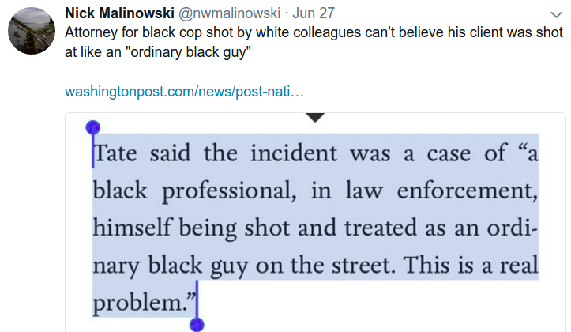
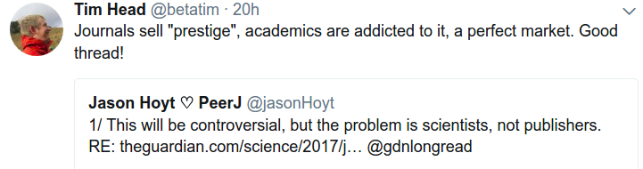

# Week 24

---

Kaleefornia

"If health care is a right—and it is—the only honest response to the
current crisis is the single-payer “Medicare For All” reform that
would bring the United States in line with humane and responsible
countries worldwide. [..] The movement for single payer is for real,
and it’s winning in California.

The state Senate voted 23 to 14 on Thursday in favor of SB 562, a
single-payer proposal that would guarantee universal health care to
all Californians. “What we did today was really approve the concept of
a single-payer system in California,” declared state Senator Ricardo
Lara, a key advocate for the bill, following the vote.[..]

“We’ve shown that healthcare is not only a humanitarian imperative for
the nation, it is politically feasible, and it is even the fiscally
responsible step to take.” [said another official...]

That’s true. According to a review of a new NNU-sponsored study by the
Political Economy Research Institute at the University of
Massachusetts Amherst: “SB 562 would produce substantial savings for
households in healthcare costs as a share of their income, and
California businesses, which would also see reduced payroll costs for
health care expenditures.”"

---

This would be hilarious, if it wasn't so tragic

---

Interesting angle

---

The tweetstorm is here. This was in response to the Guardian article
blaming publishers for the obscene amount of money made by (wasted on)
them. Tweetstorm says the problem is, as with all substance abuse,
drug situations, with the demand. Makes sense.

[Link](https://twitter.com/jasonHoyt/status/879624241817296896)

---

Question

You shared this article on employee's fluctuating incomes. Should we
bar employers / regulate them so they cannot dynamically allocate
work?

No

My position is, still, freedom for businesses, and direct help to
people if there are insecurities caused by the dynamic nature of the
economy.

---

Question

Are income tax credits a good idea?

No

People will game that system. Plus the assistance is not as simple
(less bureucratic) as it can be.

Why is infrastructure good? For example a road? There are no
if-then-else rules for a road. "If your wheel size is blah, after 4:00
PM, in a rainy day, do not drive here". A road is a f--king
road. Everyone can drive on it. It is simple, it applies to all --
that's why it helps the economy.

---

Favorite Dave Letterman Top 10?

Top 10 Things That Sound Creepy When Said by John Malkovich 

[Link](https://youtu.be/Da7MzBrX0_c?t=27)

---

