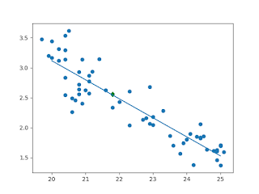

# Week 28

According to argument [here](../../2019/11/americas-secret-war-friedman.html),
after 9/11 United States was getting kicked out of SA, so it not
only needed a new base that'd be strategic enough to project
power into Middle East and beyond, they also needed to
force Saudis (and Pakistani) cooperation (SA was encircled by US
after the invasion "oddly enough"), at the same time also demonstrate
power -especially important- unilateral power to the Muslim
world. Hence Iraq.

There are great gems in this book, how the anti-Soviet Afghani
mujaheddin was Jimmy Carter's idea, how, before the second Iraq War
and Saudis were being pressured into cooperation, they tried to
deflect and change the subject, so they triggered a whole
Israel-Palestine peace process, Tom Friedman from NYT got suckered
in.. What a beautiful kabuki. I believe the main thrust of the book is
correct; which brings forth a terrible verdict against media - they
don't know anything about anything. Government lies, and the ppl the
public relies on to follow them are usually powerless and clueless to
cover it. Sad! 

(The press is essential of course for times when gov does slip up, and
gov is more alert because press is there. They are also needed as a
channel for leaks which are signs of disagreement within
administrations.. Etc etc.)

---

News

Daniel Dae Kim and Grace Park [are] leaving CBS's resilient hit
"Hawaii Five-0," [..] As Kim himself confirmed in a Facebook post to
his fans, the duo left because their request to be paid the same as
their white co-stars, Alex O'Loughlin and Scott Caan, was
rejected. The gap in what they were asking for and what CBS was
willing to offer was tiny — reportedly a difference of as little as
$5,000 per episode,

Ultimately, the refusal to pay Kim and Park on matching terms with
O'Loughlin and Caan was CBS's formal declaration that they were
determined to protect a disparity that has been a sore point since the
show's premiere: The assertion that O'Loughlin and Caan are "Hawaii
Five-0" "stars," and Kim and Park are merely "co-leads."[..]

It's hard to avoid concluding that this is a direct reflection of
Hollywood's continuing legacy as a system where white actors and male
actors are seen as more valuable than nonwhite and female ones, simply
by accident of melanin and genitalia.

Inequality?

I happened to be binging on this show when this news broke, so let me
add my $0.02.

The show content is very well balanced on the ethnic front. No issues
there. The inequality problem might not be where ppl think it's at -
 O'Loughlin plays the team lead, so he is the most central character,
it makes sense to pay him little more, even symbolically.

Caan is the resident goombah in the show,  he is doing his "neurotic
Italian" thing, he is from New Jersey, the fish-out-the-water aspect
is hilarious, there is all this surf-and-turf, and Danny (his
character) is like "I am dyin' oveeeer heereee". U get the idea.

But Caan is also the only one in the cast who played in major movies,
with major stars, such as 60 Seconds, Ocean's Eleven, etc. There is a
hierarchy among actors - movies are at the top, TV at the bottom.  Yes
one could argue "well these days TV is like movies". Right.. but you
know what else is like movies? Movies. So unless there were changes in
the writing that the Kim and Park did not like, I believe the issue is
overblown, there is another hierarchy in play besides the ethnic
thing. Park was in Battlestar Galactica, Kim was in  Lost, but these
shows, while very well done at "movie quality" they still are not
movies. That's how they see it.

Oh, Caan is also gumba royalty (his father is James Caan
of Godfather fame).

Note: I am a fan of both Park and Kim (I also have many Jewish
friends). I watch a lot of scifi, and spotted Park in Andromeda, and
Stargate (the tv show), both great performances. Saw Kim in one Star
Trek Voyager episode, one of the rare ones I like. 

---

Comedy is about timing

It's also about wording

I watched Drew Carrey do a joke once (remember Carrey? [This
guy](38-31.png)). Here is how it goes. Guy meets girl in a bar. They
hit it off, and they go to her place. But before they start, guy says
"I have to tell you something, I have a fetish". Girl says "ooOOOooo,
kinky" and she disappears to her back room. She comes back minutes
later dressed all in leather. She says "let's do it honey". Guy says:
"What are you talking about? While you were inside, I shit in your
purse, I fucked the dog - I am done".

Here is the equally interesting part: Carrey says he tried to make
that joke PG-13, like using another word instead of the F-word, he
tried "I did the dog", "I boinged the dog", screw, eff, hump,
... Nothing works. It has to be *fucked* the dog. Only then the joke
is funny.

Why is that? I don't know. Carrey doesn't know it either.

---

News

Buzz Aldrin makes "faces" during Trump speech and "Internet goes wild"

Pfff

Guy is like 100 years old, I think he's gone senile, that is a
likelier explanation. Plz no more "Trump got slammed by __some leader
facial move, or celeb snark put down__". Citizens: U want shit done,
go out on streets. Otherwise, let's say, it's unlikely US citizens
will ever get universal health coverage. Forget these ticks, zingers.

---

Question

Isn't building infrastructure enough?

People are infrastructure

For second-wave industrial age infrastructure is roads and
bridges. For post-modern, post-industrial age, individual's peace of
mind is infrastructure. Ergo universal health coverage. We want people
"trystorming", trying a lot of ideas, failing fast until they get it
right, "hit digital gold". They can only do these things if they are
not worrying about trivial nonsense. Knowledge economy moves too fast,
so some aspects of life need to be simplified to compensate.

---

Jobs, the nerd Jesus \#burr

[[-]](https://www.youtube.com/watch?v=E3s-qZsjK8I)

---

If a country does not have full labor participation, then should we
limit hours worked so everyone gets a fair chance, as in France? They
have 35 hour work-week limitation.

No

(Nearly) full freedom for businesses, direct help to people - that
should be the approach. By help I mean direct help, not this indirect
bitchy little bitch help that amounts to nothing.

French 35 hour work week failed to increase employment. The economy is
too complex for anyone to place such restrictions and expect a result.

---

Question

If government involvement in healthcare can be helpful, should a
country follow the British model where gov runs hospitals?

No

They drew the line between public and private in the wrong place. I am
tired of hearing the Brit PM reporting how long or short the "waiting
times", "waiting lines" are at hospitals at every PMQ (PMQ is Prime
Minister's Questions, that rowdy parliament thing where Brits grill
their PM every week).

Gov-funded health insurance is enough -  this is the area with the
most non-market demands placed on it, solve it, you solve
healthcare. Buying insurance is not like buying ketchup. I can pick
and choose different ketchup, but at the end of the day the choice
won't matter much, it's just ketchup.

---

NYT

When it comes to health care coverage, House Speaker Paul Ryan says,
“We’re going to have a free market, and you buy what you want to buy,”
[..] But this is often impossible. And what Republicans, and many
Democrats, forget to stress, is that in a totally free market health
care system, you must be willing to let some patients die.

As an emergency medicine physician in a busy urban hospital, I have
patients brought to me unconscious several times a day. [..] Most
dismaying for me as a physician is that after all of my attempts to
apply my compassion and training to save their lives, all three of
these patients told me some variant of: “Thanks for what you’re doing,
but I would rather that you hadn’t.” Even the man with the brain
bleed, who certainly would have died without our immediate
intervention, expressed dismay. [.. H]e told me that while he did not
have health insurance, he did have life insurance. He said he would
rather have died and his family gotten that money than have lived and
burdened them with the several-hundred-thousand-dollar bill, and
likely bankruptcy, he was now stuck with.

Tragic

.. and completely fixable, with available tools of today. Yes individual mandate is a stupid idea and Obamacare is an overengineered piece of shit, but you need to go forward from there, not backward.

---

Question

I am British and I am at a loss after Brexit.. What should I do?

**Close your eyes and think of England**

---

Economist

One of the economy’s biggest mysteries is this: The labor market is
the strongest it has been in a decade, yet wages are rising barely
faster than inflation. For some reason, the booming job market and
ultralow unemployment rate, which fell to 4.4 percent in April,
haven’t led employers to raise pay in a meaningful way. That flies in
the face of a basic assumption of how the economy works: A tight labor
market is expected to lead to pay increases [..]

No mystery

This person is using the wrong unemployment number, his model tells
him for that incorrect unemployment there has to be more wage growth,
that's why he is mystified. If we use the real unemployment, i.e. the
number that is opposite of employment, the model's fine. We take prime
age labor participation rate and literally subtract that from 100%,
that's unemployment. Then with help from [this
post](https://www.economy.com/dismal/analysis/datapoints/296127/There-Is-No-US-Wage-Growth-Mystery/),
and using data from [FRED](https://fred.stlouisfed.org/), we fit a linear model between unemployment
and wage growth,

```python
import pandas as pd, datetime
from pandas_datareader import data
import statsmodels.formula.api as smf

start=datetime.datetime(1970, 1, 1)
end=datetime.datetime(2017, 1, 1)
cols = ['ECIWAG','LNS12300060','UNRATE']
df = data.DataReader(cols, 'fred', start, end)
df = df.dropna()
df['ECIWAG2'] = df.shift(4).ECIWAG
df['wagegrowth'] = (df.ECIWAG-df.ECIWAG2) / df.ECIWAG2 * 100.
df['unemp_real'] = 100. - df.LNS12300060

results = smf.ols('wagegrowth ~ unemp_real', data=df).fit()
print results.rsquared_adj, results.params.unemp_real
plt.scatter(df.unemp_real, df.wagegrowth)
plt.plot(df.tail(1).unemp_real, df.tail(1).wagegrowth, 'gd')
xx = np.linspace(20,25,100)
yy = results.params.Intercept+results.params.unemp_real*xx
plt.plot(xx,yy)
```

The fit is good. [geek] For the naive model using UNRATE the fit
reports R^2 0.61, the model above reports 0.81 which is clearly
superior. [/geek].

How about the larger question, is annual wage growth of 2.5% any good?
Maybe. Model says in order to get to annual 4.0%, (real) unemployment
needs to fall by 5% which is huge. Graph,



---

Walter Isaacson

[Einstein intervenes in a public protest at Reichstag, 1918] Years
later, when Adolf Hitler and his Nazis were in power, Einstein would
ruefully look back on that day in Berlin. “Do you still remember the
occasion some 25 years ago when we went together to the Reichstag
building, convinced that we could turn the people there into honest
democrats?” he wrote Born. “How naïve we were for men of forty.”

Hah

Larger forces play themselves out. It's not possible to change history
with a few great speeches, symbolic moves even if those speeches were
given by Einstein. Not that the small cannot change things -they can
if they are part of a larger dynamic :) so act on them- but the
overall result might not always turn out exactly how everyone wants.

And usually the largest force in play is geography.

---

G. Friedman

[See](../../2017/07/the-next-decade-friedman.html)

Interesting

---

[Tim Harford, FT](https://www.ft.com/content/398df8c0-67b1-11e7-8526-7b38dcaef614)

If we are to take the best advantage of a true gig economy, we need to
prepare for more radical change. Governments have been content to use
corporations as delivery mechanisms for benefits that include
pensions, parental leave, sick leave, holidays and sometimes
healthcare — not to mention the minimum wage. [..]

We will need governments to provide essential benefits, perhaps
minimalist, perhaps generous, to all citizens. Above that safety net,
we need portable benefits — mentioned warmly but briefly by Mr Taylor
— so that even a 10-minute gig helps to fill a pension pot or earn
time towards a holiday. Traditional corporate jobs have been socially
useful, but if you push any model too far from reality, it will snap.

Yes

Let me add, even before the spread of the gig economy everywhere
(today's situation), the existing system already started to show signs
of major fail, so it is in our interest to make the switch sooner
rather than later.

---

Question

What is so modern about government provided healthcare?

Everything about it

Gov-funded healthcare programs, with their centralized, concentrated,
synchronized slant, are truly in the realm of second wave. A
third-wave, post-modern system could have a person's mobile phone to
sell personal "life bonds" on a blockchain the moment person gets
sick, the bonds would have maturity of, say, 20+ years (buyers weigh
his probability of staying alive), system would offer high return so
it is attractive to buyers and gets him the money he needs for care
while the system simultaneously short-sells the care provider company
stocks the patient did not choose, at the same time electronically
bartering Starbucks coffee cash + social net like money for care
money. Do little bi'ness, get little Remy, little Henny, little
Crissy, know wha Im sayin'? But now we are in the realm of scifi - we
simply do not have all of this yet.

--

Isaac Asimov

The most exciting phrase to hear in science, the one that heralds new
discoveries, is not 'Eureka!' but 'That's funny..."

The Great Asimov

---

Documentary 

The compass was the greatest invention for naval navigation.

It was not

This documentary tries to paint China as some big-time discoverer
nation (compass was discovered there). If China was so great at the
seas, then why did they not discover / populate Australia? It's right
under their nose. Right? Wouldn't it be great having that major piece
of land instead of getting stuck with a billion people on your current
land?

Large-scale oceanic navigation requires a global measure. At the very
least the sun for the latitude through something like the sextant, and
a clock for longitude. Clock based navigation did not take off until
the beginning of Renaissance.

---

Dave Sobel

[From Longitude] [T]he sea captains of [old] relied on “dead
reckoning” to gauge their distance east or west of home port. The
captain would throw a log overboard and observe how quickly the ship
receded from this temporary guidepost. He noted the crude speedometer
reading in his ship’s logbook, along with the direction of travel,
which he took from the stars or a compass, and the length of time on a
particular course, counted with a sandglass or a pocket
watch. Factoring in the effects of ocean currents, fickle winds, and
errors in judgment, he then determined his longitude. He routinely
missed his mark, of course—searching in vain for the island where he
had hoped to find fresh water, or even the continent that was his
destination. Too often, the technique of dead reckoning marked him for
a dead man.

Exactly

---

