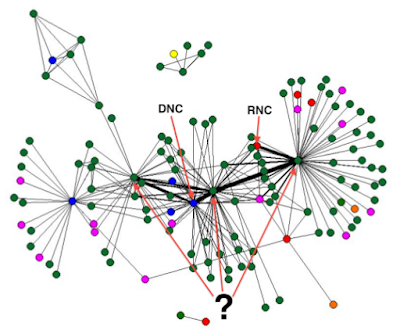
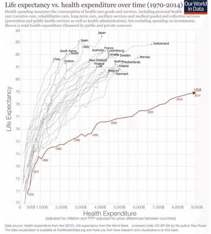

# Week 32

---

Hidalgo debunks many other theories of development theories -
institutional quality, human capital (in terms of years spent in
education) are not as important as ECI. Globalization is not a
cure-all. Your country might be one one piece in a sophisticated
pipeline, so you are "globalized", but that doesn't give you any
leg-up in anything. I am not talking single country / company to
produce a car from scratch - I am saying a country must have, in
different companies / regions, all pieces that can combine to a car
because that means this country has a level of productive know-how,
tacit knowledge that can produce high-margin products. Especially the
products highest in product complexity list list needs to exist in a
country, one company, or many. But same country.

It all comes down to what a fresh-out-of-college (or college dropout)
budding enterpreneur needs. If you were such a person, had an idea on,
say, a new car battery, would you be better off being in proximity to
defense contractors, solar panel, drone makers, or rice farmers, and
bottlers of Coca Cola?

USA is in good shape in this sense. Sure there are income
inequalities, no universal healthcare, but these problems are
technically easy to fix.

Tacit knowledge is key. As someone who worked / works on transfering
massive knowledge to others I can attest to this. We know more than we
can tell. There is a certain .. way an expert approaches problems, the
way you expect certain issues, others not, when you get gung-ho, when
not, the order you expect things to occur, how much relevant info you
hold in your head vs. when you look things up, how we use tools, when
we drop them, or develop them from scratch - these are things that are
incredibly hard to teach,  because I guess they are intricately coded,
in a complex graph form in our heads or something -any attempt to
textualize it means introducing a certain flattening, and this
knowledge is not that. It ain't flat.

Tacit knowledge can only be transferred while working side-by-side,
this is another (perhaps bigger) reason why local networks are
critical.

---

Here is another [paper](../../2020/07/austerity.html) that says
"moreover, it seems that trade openness and population growth do not
have a statistically significant impact on growth"

---

I replicated Hidalgo's research [here](../../2017/08/hidalgo-code.html), data,
Python code included. The jujitsi move is excellent. Economists, take note. All I
hear from them is "if this goes up, that comes down, this comes down
the other thing goes up". Angle of the dangle is inversely
proportional to the heat of the meat. [Eheheheh](https://youtu.be/F3NtIgunIc4?t=52).
Seriously. More physicist in economics! Economists apparently have physics envy, so if
there are more physicist in economics, they are already physicist,
they won't have any envy.

---

Hidalgo is a statistical physicist, who wrote *Why Information
Grows*. He uses a country's diversity / uniqueness of exported
products as a stand-in for the knowledge networks present in that
country, then uses a modeling jujutsu to find the economic complexity
index (ECI) of a country. In summary, comparative advantage is false;
what matters is the diversity of products, the exact opposite of
comparative advantage style specialization on products. Because
diversity allows the invention of more products, a country gets
richer.

---

Wrong. Hidalgo's [analysis](../../2017/08/economic-complexity-hidalgo.html) says
both countries should produce (in varying amount of course) product
X and Y, because IMO only then can a third inventor, seeing and
making use of a richer manufacturing base producing X and Y
can come up with product Z.

"The idea of comparative advantage says country A should specialize on
product X, country B on product Y. They trade with eachother and both
would be better for it"

---

News

Extreme heatwaves that kill even healthy people within hours will
strike parts of the Indian subcontinent unless global carbon emissions
are cut sharply and soon, according to new research. [..] The new
analysis assesses the impact of climate change on the deadly
combination of heat and humidity, measured as the “wet bulb”
temperature (WBT). Once this reaches 35C, the human body cannot cool
itself by sweating and even fit people sitting in the shade will die
within six hours.

Sounds bad

---

Lee Atwater

[Campaign Operative for the Reagan Campaign, shortly after Reagan's
first election, talking to an author] you're going to hear a lot in
the days to come about the Reagan revolution. Don't believe a word of
it. If we Republicans are lucky, by dint of heroic effort we may push
the system 5 degrees in one direction to compensate for the 5 degrees
that President Carter pushed it in the other direction.

Wrong

What really happened was Carter tried to change 5 degrees, and failed,
Reagan pushed 180 degrees, and succeeded. According to this excerpt,
changes made by Reagan were both necessary and unavoidable. Carter
could go into that direction but he was probably, institutionally, not
able to do so. A Democrat President could not have made them. A sad
result of this is Democrats were bulldozed over, both electorally and
more importantly, ideologically. They still did not recover from the
Reagan Revolution. Changes during 80s were about unshackling the
enterpreneual energy [great] but since "the other side" had no hand in
these changes, their ideological chops atropied, they became pansy-ass
pencil-dick small-time modifiers, merely trying to change some little
stuff around the edges, always trying to work through the existing
structures. 80s gave companies more power, so pansy-ass modifiers try
to introduce their changes through companies, like healthcare through
employers, trying to force the insurance companies to do this little
different that little different. It is unfathomable to them to pull
out health insurance outside the market structure.

---

Comment

But Democrats had memorable politicians since the 80s, like Clinton.

He was a Southern Conservative 

.. or a Conservative Democrat. Here's an excerpt from All Too Human,
by George Stepehanappololooopoololololuluuluoulpoopoololoous "Most
liberals [he means left] understood that Clinton wasn't really one of
us. But it felt good to get lost in the partisan reverie [..] It felt
good, again, to think about winning."

---

News

Relations between the United States and China have reached “a pivot
point”, Rex Tillerson has warned, calling for efforts to avoid “open
conflict” between the world’s two largest economies.

Right

---

G. Friedman

[From The Next 100 Years] Having achieved the unprecedented feat of
dominating all of the world's oceans, the United States obviously
wanted to continue to hold them. The simplest way to do this was to
prevent other nations from building navies, and this could be done by
making certain that no one was motivated to build navies—or had the
resources to do so. One strategy, “the carrot,” is to make sure that
everyone has access to the sea without needing to build a navy. The
other strategy, “the stick,” is to tie down potential enemies in
land-based confrontations so that they are forced to exhaust their
military dollars on troops and tanks, with little left over for
navies.

The United States emerged from the Cold War with both an ongoing
interest and a fixed strategy. The ongoing interest was preventing any
Eurasian power from becoming sufficiently secure to divert resources
to navy building. Since there was no longer a single threat of
Eurasian hegemony, the United States focused on the emergence of
secondary, regional hegemons who might develop enough regional
security to allow them to begin probing out to sea. The United States
therefore worked to create a continually shifting series of alliances
designed to tie down any potential regional hegemon.

Budding regional powers watch out

If a country wants to have a huge oceanic naval presence, they need to
be ready to be disrupted by US. The Friedman strategy is such a power
is disrupted an tied down by land wars [so they cannot divert enough
resources to naval power]. It is not China's rising economy that
worries the US, it is its activities in the South China sea and ship
building.

For the Chinese IMO it does not make sense to antagonize the
US. Unless you are loaded for bear, u best tread carefully. Like,
Chinks are investing in submarine technology thinking that'll give
them a leg-up with a possible carrier encounter, but are they sure,
like 100% sure, US is not ready for that? A career never moves alone
BTW, there is a career group -- with destroyers, subs of its own,
etc. If the outcome of a war were to hinge on that, could the Chinese
be absolutely sure they have a good solution? 

---

G. Friedman

It is important to understand that Mexican immigration is
fundamentally different from immigration from distant countries such
as China and Poland. In those cases, people are breaking their tie
with a homeland that is thousands of miles away. Some degree of
assimilation is inevitable, because the alternatives are isolation or
a life within a culturally segregated community. Although immigrants
have frightened Americans ever since the Scots-Irish arrived to
unsettle the merchants and gentry of eighteenth-century America, there
is a fundamentally geopolitical reason not to compare Mexican
immigration with those precedents.

Not only is Mexico adjacent to the United States, but in many cases the land the migrants are moving into is land that once belonged to Mexico. When Mexicans move northward, they are not necessarily breaking ties with their homeland. Indeed, within the borderland, which can extend hundreds of miles into both countries, the movement north can require minimal cultural adjustment. When Mexicans move to distant cities, they react as traditional immigrants have done and assimilate. Within the borderland, they have the option of retaining their language and their national identity, distinct from whatever legal identity they adopt. This state of affairs can create serious tension between the legal border and the cultural border.

Right

---

Link

As the air warms, some of that heat is absorbed by the ocean, which in
turn raises the temperature of the sea’s upper layers.

Harvey benefitted from unusually toasty waters in the Gulf of
Mexico. As the storm roared toward Houston last week, sea-surface
waters near Texas rose to between 2.7 and 7.2 degrees Fahrenheit above
average. These waters were some of the hottest spots of ocean surface
in the world. The tropical storm, feeding off this unusual warmth, was
able to progress from a tropical depression to a category-four
hurricane in roughly 48 hours.

“This is the main fuel for the storm,” says Kevin Trenberth, a senior
scientist at the U.S. National Center for Atmospheric
Research. “Although these storms occur naturally, the storm is apt to
be more intense, maybe a bit bigger, longer-lasting, and with much
heavier rainfalls [because of that ocean heat].”

Deny That

---

News

Google has fired a computer engineer who caused a storm in Silicon
Valley by asserting that the gender gap among technology workers was
down to biological differences between men and women.

Google did the right thing

A company is no place to stir that kind of shit up. You can have your
"discussions" outside, start a blog like mine, vent, go to the woods,
scream it out, learn karate, do karate chops on wood blocks. Who
cares? Don't do it at a company. From a CEO / management's perspective
it is already hard enough to get all employees rowing in the same
direction, keep them generally happy, motivated, satisfied with their
work, offer growing opportunities, and turn a profit at the same
time. There is no time or space for such philosophical
meanderings. But this guy probably knew this would happen, wanted to
make a point anyway, and made it, and was fired. He accomplished his
goal.

Now on diversity: it is generally good a company's internal make-up
reflects the broader population, in US that would be 50% women, 15%
black, Latino, etc. It is good companies striving to get there. How to
get there? An approach, and according to affirmative action (law), a
company gently prefers the minority candidate over another, at the
door, if they have equal skill sets.

But once inside, I add, you don't talk about gender, race. You don't
think about gender, race. Inside, it is the diversity club. What is
the first rule of diversity club? You don't talk about the diversity
club. Simple. If, say, women are huddled in classrooms in companies to
help them specifically to improve some of their skills, not
okay. Making people aware of their difference, even if sometimes in
positive ways, not okay. There is research that shows, while taking
tests, some kids are made aware of their minority status, their score
went down. Internally companies stay color-blind, gender-blind, purely
merit based. If there are two employees equally unfit for a company,
one of them woman the other man, both get fired. Affirmative action is
only to fight against the discrimination at the door, the rest is up
to the person, company stays neutral.

After all that, and the internal percentages are still off due to the
availability of qualified diverse candidates or other causes, that is
sad and not a company's problem. The larger social system needs
fixing.

---

Question

But does affirmative action work?

It does

The Clinton WH did a review on that, with the intention of removing
it, but they decided against it because they found out it
worked. Details are in the book All Too Human by George
Stephanapopolopopolopoluoplpuoplupoplupououllpulpulpouplpuopuous. Unless
there is new research that shows otherwise, I am going to stick with
that.

---

Comment

You just made reference to someone's long Greek last name and made him
aware of his difference, if this person saw it it may hurt his
feelings.

I am a blogger

I can say whatever funk I want. I am not in public office, write for a
wide-circulation newspaper, a politician, an offical outlet, or a
reader's coworker. People in such position may not be able to say the
things I do.

---

WaPo

Democrats are moving left — and that won't necessarily hurt them in
2018 [..T]heir Better Deal, which is being amended week to week, has
largely built on the left-wing platform that emerged from the 2016
convention. Democrats now endorse a $15 minimum wage; they back $1
trillion in deficit-financed infrastructure spending.

Not good enough

All of that is an example of "legislation-through-corporation" -- this
is what the "old new left" used to do. Democrats were brain-fucked by
Reagan, with a butt-plug so they became paralyzed neck-down. They were
lying on the floor, comotose, u know, with the occosional
twitching.. So they lost their ability to think outside their
predefined boundaries now,  their "solutions" are always these little
bitchy methods of getting companies to do this-or-that
different. Getting companies to pay __x__ amount of money, giving
companies money so they create economic activity, making companies to
give time-off for whatever reasons. In the case of health insurance
however the solution does not lie with the companies, insurance needs
to be taken away from companies.

P. Krugman

Harry Truman tried to create a national health insurance system. Public opinion was initially on his side: Jill Quadagno's book "One Nation, Uninsured" tells us that in 1945, 75 percent of Americans favored national health insurance. If Truman had succeeded, universal coverage for everyone, not just the elderly, would today be an accepted part of the social contract.

But Truman failed. Special interests, especially the American Medical Association and Southern politicians who feared that national insurance would lead to racially integrated hospitals, triumphed.

Sixty years later, the patchwork system that evolved in the absence of national health insurance is unraveling. The cost of health care is exploding, the number of uninsured is growing, and corporations that still provide employee coverage are groaning under the strain.

So the time will soon be ripe for another try at universal coverage. Public opinion is already favorable: a 2003 Pew poll found that 72 percent of Americans favored government-guaranteed health insurance for all.

But special interests will, once again, stand in the way. And the big debate among would-be reformers is how to deal with those interests, especially the insurance companies. These companies played a secondary role in Truman's failure but have since become a seemingly invincible lobby.

Right you are paduwan

Question

Do you think if Trump would sign a Medicare-for-all bill if it came to him?

I think he would

WaPo

Single-payer alternative [is] favored by the majority of House Democrats.

Good Good

at

August 09, 2017

The White House 

Trump 'condemns' white supremacists, KKK, neo-Nazi and all extremist
groups

Shoulda Condemned Faster 

This
[jackass](https://twitter.com/DrDavidDuke/status/896431991821926401)
cannot be pandered to. Dude totally had plastic surgery done BTW,
really supreme. He regularly hurls insults [at the Jews](https://twitter.com/DrDavidDuke/status/896647887488262144) too. WH should
watch out for this fucker - can even be a government plant.

J. Rickards, Currency Wars 

One of the best measures of the rent seeking relationship between
elites and citizens in a stagnant economy is the Gini coefficient, a
measure of income inequality; a higher coefficient means greater
income inequality. In 2006, shortly before the recent recession began,
the coefficient for the United States reached an all-time high of 47,
which contrasts sharply with the all-time low of 38.6, recorded in
1968 after two decades of stable gold- backed money. The Gini
coefficient trended lower in 2007 but was near the all-time high again
by 2009 and trending higher. The Gini coefficient for the United
States is now approaching that of Mexico, which is a classic
oligarchic society characterized by gross income inequality and
concentration of wealth in elite hands.

Another measure of elite rent seeking is the ratio of amounts earned
by the top 20 percent of Americans compared to amounts earned by those
living below the poverty line. This ratio went from a low of 7.7 to 1
in 1968 to a high of 14.5 to 1 in 2010. These trends in both the Gini
coefficient and the wealth-to-poverty income ratio in the United
States are consistent with Tainter’s findings on civilizations nearing
collapse. When society offers its masses negative returns on inputs,
those masses opt out of society, which is ultimately destabilizing for
masses and elites.

Right

Author, Social Network Analysis for Startups

We entered this fray in 2006, bringing with us a large-scale social
network study of campaign finance and its influence on electoral
outcome. In this section, we’ll give an overview of this study, and
delve into the methods used to derive the results [..]

Every node on this chart is a political organization or political
action committee (PAC) actively involved in the 2000 congressional and
presidential elections. Red and blue nodes, respectively, are
Republican and Democratic committees (national and state), green nodes
are single-issue groups, purple nodes are industry associations, and
yellow are non-profit organizations. The links between PACs are
determined by where their money is spent—if PAC-A and PAC-B route
donations to the same candidates, they become linked—and the more they
have in common, the stronger this link becomes. The strongest links
are shown with thicker lines on the diagram [..]

This study was based on data released by the Federal Election
Commission, pursuant to the McCain-Finegold Campaign Finance Act (The
Citizens United decision by the Supreme Court has seriously undermined
our ability to study these sort of interactions in the future; much of
the data has become unavailable in 2010). The data is based on forms
that PACs are required to file every time they make a campaign
contribution to a candidate. [..]

[T]he single-issue PACs dominate [..] On the right is the Republican
cluster, led by the Republican National Committee (RNC), and on the
left is the Democratic cluster and the Democratic National Committee
(DNC). However, right next to the “official players,” connected to
them with thickest link are three PACs that seem to wield a
significant amount of power in the network. Can anyone guess what they
are?

The nodes on the left and right of the strong-link triads are, in
turn, NARAL (National Abortion and Reproductive Rights Action League),
and the National Right to Life PAC—representing the two sides of the
abortion issue, which, in 2000 as well as now, is one of the most
divisive issues in American politics.

In the middle is the AFL-CIO Political Action Committee, representing
America’s largest labor union and, by proxy, over 11 million
voters. The union vote historically tended to be Democratic, but
Republicans needed to win key industrial states such as Ohio and
Michigan in order to gain control of Congress and elect a Republican
president— and that meant peeling union vote away from its traditional
constituency. This required a “fulcrum issue”: an issue that was
divisive enough to make union members break with their party
affiliation—and abortion was it.

Interesting

I see Sanders making some moves in this area. It can pay off.

Blogger

When I read today’s news about OpenAI’s DotA 2 [an action game, u can
play 1-on-1 or team against team] bot beating human players at The
International, an eSports tournament with a prize pool of over $24M, I
was jumping with excitement [..T]he OpenAI news came as such a
shock. How can this be true? Have there been recent breakthroughs that
I wasn’t aware of? As I started looking more into what exactly the
DotA 2 bot was doing, how it was trained, and what game environment it
was in, I came to the conclusion that it’s an impressive achievement,
but not the AI breakthrough the press would like you to believe it
is. That’s what this post is about. I would like to offer a sober
explanation of what’s actually new. There is a real danger of
overhyping Artificial Intelligence progress [..]

Let me start out by saying that none of the hype or incorrect
assumptions is the fault of OpenAI researchers. OpenAI has
traditionally been very straightforward and explicit about the
limitations of their research contributions. I am sure it will be the
same in this case. OpenAI has not yet published technical details of
their solution, so it is easy to jump to wrong conclusions for people
not in the field [..]

Let’s start out by looking at how difficult the problem that the DotA
2 bot is solving actually is. How does it compare to something like
AlphaGo?

1v1 is not comparable to 5v5. In a typical game of DotA 2, a team of 5
plays against another team of 5 players. These games require
high-level strategy, team communication and coordination, and
typically take around 45 minutes. 1v1 games are much more
restricted. Two players basically move down a single lane and try to
kill each other. It’s typically over in a few minutes. Beating an
opponent in 1v1 requires mechanical skill and short-term tactics, but
none of the things, like long term planning or coordination, that are
challenging for current AI techniques. In fact, the number of useful
actions you can take is less than in a game of Go. The effective state
space (the player’s idea of what’s currently going on in the game), if
represented in a smart way, should be smaller than in Go as well.

Bots have access to more information: The OpenAI bot was (most likely)
built on top of the game’s bot API, giving it access to all kinds of
information humans do not have access to. Even if OpenAI researchers
restricted access to certain kinds of information, the bot still has
access to more exact information than humans.

Well..

There is also [this](https://twitter.com/mark_riedl/status/896553407548358656).

Genuine advances in this field are exciting, and welcome. But watch out for the hype.

---

The only country without universal health care in that picture is US.

Recent news: WH thinking of withholding payment to insurance
companies? This makes me think: gov paying to insurance companies?
Man.. for a country who prides itself for aligning itself with the
free market, US sure gets itself into some stupid shit. Case in
point: Scott Walker’s $3 billion fraud. If gov will pay business to do
all that, why don't they just pay people to dig holes and fill them
up? (That's a Keynes quote BTW, I can do all that, drop that
reference, Waahaa!). Similar thing happened before 2008 crisis. We
want people to own houses. Fine. But gov then gets into weird
relationships with the debt markets (through F. Mae, F. Mac), creating
obscene incentives, contributing to a financial blow-up.

There are few things going on here in general: US gov keeps wanting to
provide services through companies, both burdens and empowers them
unnecessarily at the same time. Why such power / responsibility for
corporations? Maybe the reason is that US corporation's past is mired
in slave-owning. The relationship between employer and employee is
that of a owner and slave. Not too long ago slave owning was a serious
part of business in US at least in the South. So this repugnant
culture could have seeped into people's psyche. Maybe government kind
of likes to control people through this modern-day slave ownership.

Second problem is US Democrats are shameful bunch of piss-pot, bitchy
little push-overs, helpless imbeciles who have all but lost the
ability to spend an iota of brain power to combat inequality. The left
in other parts of the West are much stronger, it is thanks to them
these countries had universal healthcare. In US when  basic income
legislation was introduced, it was by a Republican (Nixon). When
Democrats prepare legislation, as in Obamacare it becomes an exercise
of legislative fiddling around the edges, trying to find different
ways to work through corporations which increases their burden and
their power. The Democratic Party should be the one thinking of
alternative (actually well-known, but anyway) solutions. If they can't
do that, why do they even exist? Don't push forward another suave
shiny brother with a big smile, promising change.. Change yourself.

---

---

Drug Drones Defeat Trump's Wall

[[-]](https://youtu.be/dJYLx9cRfCI)

---

\#BothSides

[[-]](https://youtu.be/LEeCMclnasU)

---
