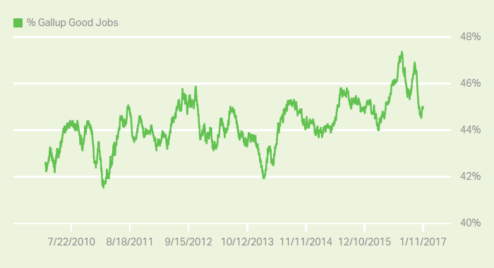
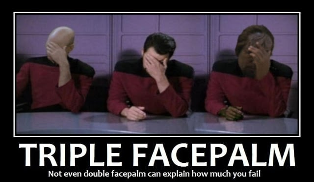

# Week 4

Maurice Wilkins, who died on Tuesday aged 87, played a key role in
discovering the double helix structure of DNA, the molecule that
carries genetic information. He shared the Nobel Prize awarded for the
momentous discovery with Francis Crick and James Watson.

Although Watson and Crick became far better known than the intensely
private and self-effacing Wilkins, the Cambridge pair were, in
essence, theoreticians. Their conclusion that DNA had twin molecular
chains intertwined, published in 1952, relied on the experimental
results obtained at King's College London by Wilkins and his colleague
Rosalind Franklin.

No

Crick & Watson most likely "borrowed" ideas from Linus Pauling - his
name comes up in the "real inventor" gossip, not Wilkins'. Admittedy
one day they were visiting Pauling who was also researching DNA, and
some DNA X-Ray results suggesting double-helix structure were on his
desk. Pauling was suspecting this structure, but Crick & Watson did
some more snooping, then jumped in and published a paper using these
specific words, upstaging Pauling. 

---

FT

We are five days into a dramatically different eating regime, and
several hours into a session of being bombarded with information that
runs counter to the received wisdom about diet that we have been given
all our lives.

The regime itself is relatively simple. It can be simplified as a week
of “healing the gut” by eliminating sugar, dairy, wheat, caffeine and
alcohol from our diets and eating more fermented food such as
sauerkraut, followed by a long-term change in eating habits to cut out
sugar and refined carbohydrates such as white rice, breakfast cereal
and pasta.

This is Montignac's Method

There is nothing new about it. 

It's a good system tho. 

---

Kotlikoff & Burns

[From The Coming Generational Storm book, 2005] According to The
Treasury Papers, Medicare has a 43.6 trillion dollars unfunded
liability! 10 This is over four-fifths of the $51 trillion fiscal
gap. 11 The reason the Medicare liability is roughly six times larger
than Social Security’s is not due to major differences in the present
values of their projected future benefit payments. Medicare’s
projected benefits are larger than those of Social Security, but by
only one-fifth. The big difference is that the 12.4 percent Social
Security payroll tax is much larger than the 2.9 percent Medicare
tax. In the Treasury Papers’ fiscal gap accounting, Medicare is
allocated none of the general revenue finance used to finance a good
chunk of its benefits.

Yep

As of today the unfunded liabilities of US are roughly around 100
trillion dollars. IMO this is why a switch to universal basic income
will be necessary for US at some point; instead of politicians writing
themselves IOU's, sweeping things under the carpet, gov at some point
will have cancel all of its programs, and start UBI, redistributing
today's tax income for today's citizens, not tomorrow's imaginery
income for a population whose make-up we cannot be sure of, but at
worst case can be tilted heavily towards the old. The
K. I. S. S. principle will win the day.

---

News

Republicans in Congress want to repeal Obamacare.

Good..

.. if they replace it with something working, such as single-payer
healthcare. If it works in Canada, Australia, it should be good enough
for the United States of America. I have a feeling US did not go this
route, because low-skilled immigration issue is entangled here
somehow.. If that is the case, then the priority should be clear --
given the choice between low-skilled immigration and healthcare (that
is not an abomination) like Obamacare, then the choice should be for
functioning health-care.

---

Comment

But Obamacare tried to work within the existing the system, balancing
everyone's needs.

Hmmm...

Then why did Aetna pull out? Oh, and they announced this in 2016 smack
in the middle of the presidential race, saying a big
fffuuuuuuuuuuuccccccckkkk yoooouuuuuu to the administration. Imagine
the conditions that caused them to do that. Companies do not prefer to
get in public spats with the government. If they do, you can be sure
they are hurting badly.

This is the final criticism on Obamacare - it became the Byzantian
piece of work that it became because, reportedly, it tried to remain
in the existing system.. but participants in the existing system are
not happy. So mission not accomplished.

---

Comment

US owes nearly 20 trillion in debt.

What is the maturity?

Debt maturing (paid back) in 1 years is not the same as debt maturing
in 10. Plus US debt is paid back in US dollars, US could simply
inflate that away. Say with 7% inflation US would have to pay back
only half the debt in 10 years. "The magic of compounding" works in
the other direction too, you see, let's call it the black magic of
reverse compounding (inflation).

Now, there is bunch of hoopla around Trump's plans for deficit
spending which will surely cause inflation. If central bank wants to
"tame" inflation and raises rates, then it will be back to 80s under
Volcker, the king dollar. But if you wanted to generate inflation
higher than usual, u'd need FED not be as gung-ho as
Volcker. Then.. maybe Trump would want to appoint someone unlike
Volcker after Yellen.. But is the debt issue that much of a big deal
to start changing things around at this scale?

Let's try to think other reasons.. The new admin wants to f..k the
Chinese who are holding 1 trillion US debt (not sure of the
maturity). But with long maturity they would not be f..ked fast
enough, it'd be a nice and slow grind, plus Japanese hold nearly as
much debt as the Chinese - who are a solid US ally (I guess that is
why the press does not make a big deal about them holding debt).

There was some talk around debt restructuring, etc.. But candidates
say a lot of things on the campaign trail. Whatz brother T gonna do?
Let's wait and see.

---

Question

But if someone is holding your debt, don't they have you over the
barrel?

No

Debt issuers have many advantages, especially a country like US who
can find buyers for its debt easily. See the article. If someone owns
%5 of your debt, they don't own 5% of you.

---

Question

Trump wants to degrade Chinese power in exporting.

It can happen

It happened to the Japanese. IMO the rise of the Chinese was
encouraged by US to counterbalance the Japanese. In fact one of the
better explanations I heard about Japanese being in constant crisis of
late is that they did not adapt to the world where China became the
major exporter. Let's remember the 80s - they were the rising star,
ppl were in a tizzy on Japanese buying up US assets, right? Remember
the book / movie Rising Sun?

If the \#1 economy in the world wants a country to become #2, that
country will become #2.

---

Question

How did the US help China and Japan?

Know-how transfer, educating next generation of scientists

I heard a research scientist in US says once that "these Chinese are
smart, they send PhD students targeted for specific areas, then they
go back and invent stuff". But none of that can happen if US did not
have an open-door policy for their scientists. Same was true for Japan
previously. "But Japan made breakthrough advances in quality
engineering, they followed Edwards Deming's teaching well". Right, but
the US government sent him there. For that specific purpose.

Obviously both China and Japan made use of the opportunities, and
became great economies, and China is on route to become a major
innovator. All great stuff.

---

Question

What latest tech did you like recently?

A tea cup

I was sitting at a cafe and they brought tea in this cup

The cup has two layers with air in between, so tea is sort-of floating
in air (looks great!), and the outside layer remains cold. No burnt
fingers, no tiny holder on the side either so to I dont have to do
frickin surgical strike just to hold the shit momentarily.  Awesome
tech.

---

But I am most troubled by what the President-elect did with Carrier to
hold on to an extra 700 jobs in Indiana [..] I have always thought of
American capitalism as dominantly rule and law based.  Courts enforce
contracts and property rights in ways that are largely independent of
just who it is who is before them.  Taxes are calculable on the basis
of an arithmetic algorithm.  Companies and governments buy from the
cheapest bidder.   Regulation follows previously promulgated rules. In
the economic arena, the state’s monopoly on the use of force is used
to enforce contract and property rights and to enforce previously
promulgated laws.

Even though we know of instances of corruption, abuse of power,
favoritism and selective enforcement, we take this rules-based system
for granted.  But looking around the world today or back through
American history, this model is hardly a norm.  Many market economies
operate what might be called ad hoc or deals-based capitalism:
 Economic actors assume that they have to protect their property and
do their own contract enforcement.  Tax collectors use discretion in
assessing taxes.  Companies and governments buy from their friends
rather than seek low cost bids.  Regulators abuse their power. The
state’s monopoly on the use of force is used to enrich and satisfy the
desires of those who control the apparatus of the state.

This is the world of New York City under Tammany Hall, of Suharto’s
Indonesia, and of Putin’s Russia.

Reliance on rules and law has enormous advantages.  It greatly
increases predictability and reduces uncertainty.  It reduces
expenditures on both guarding property and seeking to appropriate
property.

Right

I believe some people have problem understanding scale; only
incentives can create beneficial results at scale, one-one-one
cajoling with single person at the center will have a hard time
causing change, at scale. I remember one developing-world politician
(a true imbecile) say once about unemployment "if every employer in
the country hired one more person, there would be no more
unemployment". This is true, in the sense that if everyone gave me a
cent, I'd be a millionaire. Would people do it? Of course not. But why
not? Because there is no incentive to do it.

I can't even categorize these people's approach as economics at
macro. This is a sort of .... "bleeding-heart micro". They imagine a
situation that is ideal, then divide that final goal into pieces, and
that is what everyone needs to do. If everyone at the micro level did
this little piece, we'd be fine. But.. if everyone did their piece in
Communism, that ideology would have worked too.. It didn't because
people won't perform their little pieces if it does not fit their
(human) nature.

---

Article

[Paraphrasing] Obama saved General Motors because he really wanted to
save [their experimental electric car] Bolt.

Yeah well..

Saving the auto industry was a mistake. There are many ways US gov
could have saved that one vehicle, spawn it off to a seperate company,
etc. The money that saved GM  could have gone to a dynamic start-up
instead of a slow-moving colossus. 

---

The first time the sugar industry felt compelled to “knock down
reports that sugar is fattening,” as this newspaper put it, it was
1956. [..]  The industry responded with a national advertising
campaign based on what it believed to be solid science. The ads
explained that there was no such thing as a “fattening food”: “All
foods supply calories and there is no difference between the calories
that come from sugar or steak or grapefruit or ice cream.”

More than 60 years later, the sugar industry is still making the same
argument, or at least paying researchers to do it for them. The stakes
have changed, however, with a near tripling of the prevalence of
obesity in the intervening decades and what the Centers for Disease
Control and Prevention figures reveal to be an almost unimaginable 655
percent increase in the percentage of Americans with diabetes
diagnoses. When it comes to weight gain, the sugar industry and
purveyors of sugary beverages still insist, a calorie is a calorie,
regardless of its source, so guidelines that single out sugar as a
dietary evil are not evidence-based.

Damn

Good catch NYT. So there is heartbeat in that carcass after all.. :)

Juust kidding!

---

FT

“[Soros’s] connections, especially in the political realm, provided
him with information that was not generally known” before he made a
fortune by shorting sterling in 1992.

Incorrect

First, the Sterling bet was mostly Druckenmiller, and the basis of it all was watching "the macro", governments, central banks, so forth - see Mallaby's More Money Than God.

There is one instance  where Soros heard the German central banker Schlesinger at a central bankers’ gathering in Basel where he "declared publicly that he could make no guarantees about the future course of interest rates", Soros approaches him to double-check if he meant what he said, and he did. That comment indicated to him the Italian lira would be weak, so Soros and Druckenmiller add the lira to the basket of currencies to be shorted. But this is all connecting the dots.. noone comes to Soros and whispers in his ear "buy this at this time, sell this other thing". He used information available to everyone.

But not all participants in the markets are traders.

Let's take this case: Consider Company Z on March 1, 2009, which due
to unforeseen circumstances must now find $10 million for an
expenditure that will occur on June 1, 2009. It expects to generate
revenue over time, so expects to be able to repay this amount on
September 1, 2009. They can normally borrow funds for 3 months from
its local bank at a rate of 3 month Libor plus 100 basis points. But
then the effective interest rate would remain unknown until June
1. What does the company do? Company Z can  sell 10 Eurodollar future
contracts (for total notional principal of $10 million) that expire on
June 1, 2009.

Get all of that? So by short-selling futures on Eurodollars, company
guarantees the rate it will get in the future is the same as
today. Shorting ED is in a way speculating on the interest rate
(LIBOR). If the rate went up in 3 months, Z would have "made" money
(ED "price" is calculated 100-rate, 93 means %7), but it would be
borrowing for its expenditure at that LIBOR, any gains offset the
higher rate on June, so Z is back to March 1 - exactly what they were
aiming for.

In this case the company, or its CFO did not enter the market to make
(or lose) money. They simply wanted to put a certain number in their
books for a future expenditure. Something they could know from today.

The needs of such people, that CFO are not nothing. A huge portion of
finance is there to serve them, so the CFO can sit in front of his CEO
and say "yes Mr./Mrs. CEO, that expenditure is planned for, and ___ is
the rate we will be borrowing at".

He can't just say "pfff.. hey man, who knows whatz the rate gonna
be.. but don't you worrry about a thaaang, it'll all be fine". If he
said that, the CEO wouldn't simply fire that CFO, he'd probably throw
him out the window. Businesses try to base themselves on
predictability as much as possible.

Note: Eurodollar futures are based on a $1 million face-value, 3-month
maturity Eurodollar time deposit. Eurodollars are time deposits
denominated in U.S. dollars and held at banks outside the United
States. A time deposit is simply an interest-yielding bank deposit
with a specified date of maturity.  At the end of November 2016 total
ED contracts outstanding stood at $12.84 trillion.

---

FT

“My stomach is killing me,” I complained. The pain was a mild burning
that came and went when I moved, and the area felt tender when
pressed. [..] “Well, the good news is your symptoms don’t seem
worrying on a medical level and can be managed at home. This sounds
like dyspepsia to me. Dyspepsia is doctor-speak for indigestion,” came
the response. “You should try to avoid irritants such as spicy foods,
black coffee/tea or anti-inflammatories. If the problem does not
settle or becomes recurrent, talk to a GP.”

The diagnosis, unremarkable though it seems, did not come from any
human medical professional — it was delivered to me on my smartphone
by Babylon, an artificially intelligent medical adviser with whom I
had been exchanging messages via an app.

Exciting new developments

AI should be able to replace most doctor visits in the near future.

---

Researcher

[geek] It was discouraging throughout the 1970’s that the work done on
[automatic differentation, a technique whereby one can compute the
derivative of any mathematical software function, programmatically
...] were ignored and even disparaged. Presentations at conferences
were met with disinterest or disbelief. One reason advanced for this
was the wide-spread conviction that if a function was represented by a
formula, then a formula for its derivative was necessary before its
derivative could be evaluated. Furthermore, the differentiation of a
function defined only by an algorithm and not by a formula seemed
beyond comprehension. A few simple examples could be incorporated into
elementary calculus courses to combat these fallacies [..] An informal
survey of numerical analysis and other textbooks reveals that most
recommend against the use of derivatives, in particular regarding
Newton’s method and Taylor series solution of differential
equations. The reason advanced is the complexity of obtaining the
“required” formulas for derivatives and Taylor coefficients by
hand.[/geek]

Yes

Computers changed everything. The curriculum needs to be updated to
reflect that. Also see this. Deep Learning makes heavy use of AD.

---

Gallup defines a good job as 30+ hours per week for an employer who
provides a regular paycheck. [.. and] is calculated as a percentage of
the total population.

---

---

I don't know enough millenials to judge if this is true but it is interesting.

[[-]](https://youtu.be/5MC2X-LRbkE)

---

Ha ha.. The federal thing is all nice and good, but now Buttfuckee,
South Carolina is deciding immigration policy for Orange County,
California. That cannot stand. Elected reps are there to balance out
the local with federal, the long with the short term. If they cannot
do their job, either they go or their electors do.

"Acknowledging that the legal and political obstacles are formidable,
the proponent of a state ballot measure to sever California’s ties
with the United States and form its own nation has been cleared to
start collecting signatures.

If passed by voters, the measure, “California Nationhood. Initiative
Constitutional Amendment and Statue,” would remove language from the
state constitution describing California as “an inseparable part of
the United States of America” and require the governor to request
admission for California to the United Nations"

---
