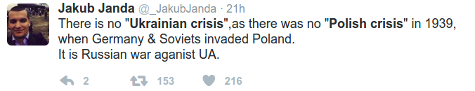

# Week 8

Federally funded healthcare might sound like a handout, but if
financiers, defunct automakers got their handouts, people should as
well. 

"58% favor replacing the ACA with federally funded healthcare system
[..] Presented with three separate scenarios for the future of the
Affordable Care Act (ACA), 58% of U.S. adults favor the idea of
replacing the law with a federally funded healthcare system that
provides insurance for all Americans. At the same time, Americans are
split on the idea of maintaining the ACA as it is, with 48% in favor
and 49% opposed. The slight majority, 51%, favor repealing the act"

---

[Scottish] independence case is 'more credible' after Brexit

True

---

Foxconn CEO

[From his open letter to Donald Trump] When Apple told me to start
making iPhones in Brazil to get around import tariffs, I made it
happen [..] I just exported pre-fabricated iPhones for the locals to
slot together -- kind of like Lego -- but it got the job done. And by
job, I mean kept Apple's and Brazil's leaders happy.

Ha Ha 

---

News

Japan is putting together a package it says could generate 700,000
U.S. jobs and help create a $450-billion market, to present to
U.S. President Donald Trump next week, government sources familiar
with the plans said.

Sounds too good to be true

They could be shit jobs like ones described by Foxconn CEO above (FC
is the Apple iPhone manufacturer in China).

---

News

House Republican leaders on Thursday presented their rank-and-file
members with the outlines of their plan to replace the Affordable Care
Act, leaning heavily on tax credits to finance individual insurance
purchases

Tax Credit - No Good

There are restrictions on who can qualify for tax credits, having a
job or a business (therefore paying taxes) is one.  Health insurance
help must be direct, with no strings attached. See Canada, Australia -
they have single-payer healthcare.

IMO providing healthcare for all is like infrastructure spending. Why
is infrastructure spending good? It is good (if spent on right
infrastructure) because it is given to ALL citizens. Here, I built a
road and I AM GIVING IT TO YOU. You can't build a road that only a few
can travel on. There are no roads for black people, for Asian people,
for the poor, for the whites, or for the elderly. Once you build a
road, everyone benefits. It is this aspect of infrastructure that
helps the economy.

In a post-industrial, fast-moving, third-wave economy, free healthcare
is that direct help. In the new age taking care of people's basic
needs is of paramount importance, because the economy is too dynamic,
uncertainties too high, the stresses caused by immense transitions
need to be taken care of. Someone could be between jobs -- during that
time, no healthcare, no tax credit.

A lot of citizens need help on these basic issues. Millions still have
no insurance. 50 million people are on food stamps in America. People
need to be out on the streets demanding this shit, but instead you see
protests on "women issues" -- which only trigger anti-abortion
reaction from the other side, there is bunch of useless rhetoric, and
all of a sudden the discussion is back in the "familiar"
territory. This might please some of the darker and shadier corners of
the US government, but it is not what people need. Not by a long shot.

---

News

What is happening in Germany is the kind of Trump bump perhaps never
foreseen by his supporters - a boost not for the German nationalists
viewed as Trump’s natural allies but for his fiercest critics in the
centre left. The Social Democrats (SPD) have bounced back under the
charismatic Martin Schulz, the former head of the European Parliament
who took over as party chairman last month and is now staging a
surprisingly strong bid to unseat Chancellor Angela Merkel.

In a country that stands as a painful example of the disastrous
effects of radical nationalism, Schulz is building a campaign in part
around bold attacks on Trump.

Now I know this guy is a player

Apparently he stopped short of using the "N-word". But what he is
doing is tactically sound. He is attacking hard, but since Merkel is
the sitting chancellor she can't "go there" - at least not in the
intensity that an opposition candidate can. So he discovered an
advantage and is pressing for it. Tactics aside - both candidates are
strong - the outcome is a win-win for Germany. 

---

Prof. Kender

(Computer Vision lecturer,  Columbia U, Lecture 8).

Today we will look at optical illusions. Let's look at the pictures below.

It looks normal, but when we rotate both pictures 180 degrees,

It turns out the picture in the right is different from the one in the
left, but our eyes could not catch it. The right picture was created
by simply rotating the eyes and mouth of Mrs. Thatcher and flipping
them [sorry Mrs. Thatcher! Academics love to bang on Reagan and
Thatcher]. 

Why did I show this? [There is a book about] perception by Irvin
Rock. He is a painter, he put out a book about optical illusions
because, u know, painters were worried about it. Actually the main
impulse to understand what makes people to screw up was astronomy -
[astronomers] could not tell all the time if they were seeing the
right things, right? How do u know our eyes or the camera is not
fooling you?

So the reason why people study optical illusions is to see what are
the failures of the heuristics of the human visual system in trying to
deal with two dimensions and get back to three. The concern with
illusions is that they should not happen if we were perfect
machines. But the ultimate worm in the ultimate apple is that once you
lose the 3rd dimension you never get it back. So you are guessing like
crazy. You are guessing in the hardware in the eye, you are guessing
in the software in the brain - but you are guessing. And sometimes you
guess wrong. 

Nice

One of my scientific interests is machine vision - recovering 3D info
from successive 2D images.  I believe a key piece in this area is
projecting 3D shapes into 2D, then checking what happens in successive
images. Following Kender, since we constantly make shit up in our
heads, we can use and mimic that for computation. There is a plane
there, a rock here, then we move somewhere else, we get confirmation
for this hypothesis. If a rock was far away from me, it should have
not have shifted to such degree when I took one step. In a larger
sense the brain probably works like that in other areas too, in this
hypothesis - check - confirm / reject mode. Crazy people are probably
crazy because they  make shit up (like everyone else), but lost the
ability to confirm their hypothesis'. 

Kender also talked about the famous painting-with-eyes-following-you
optical illusion. This T-Rex model is built on that principle (the end
of vid shows the trick). 

I believe there is a lot to learn from our inefficiencies, because our
inefficiencies are probably optimal in some sense, optimal because
they were enough to keep us alive, hence the ability stayed with us
through evolution. 

---

Harvard Health Blog

[T]he impetus for reorganizing the entire healthcare system has to do
with the regrettable state of healthcare in the United
States. Currently, the healthcare finance structure is made of an
impressively complicated network of multiple payers, involving both
private and government health insurance options. Despite spending more
on healthcare than comparable countries, the U.S. has the lowest life
expectancy and performs poorly on a variety of health outcomes. Thus,
our complex network of insurance plans is wasteful — in large part due
to high administrative costs and lack of price control.[..]

Inequity is another major problem. The United States remains the only
developed country without universal healthcare. The Affordable Care
Act has made important gains toward improving and expanding health
insurance coverage. However, it was never designed to provide
universal healthcare and 30 million Americans remain uninsured.

In a single payer healthcare system, rather than multiple competing
health insurance companies, a single public or quasi-public agency
takes responsibility for financing healthcare for all residents. That
is, everyone has health insurance under a one health insurance plan,
and has access to necessary services — including doctors, hospitals,
long-term care, prescription drugs, dentists and vision care. However,
individuals may still choose where they receive care. It’s a lot like
Medicare, hence the U.S. single payer nickname “Medicare-for-all.”

Proponents advocate that a single payer system would address several
problems in the U.S. system. Universal health coverage would be a
major step towards equality, especially for uninsured and underinsured
Americans. Overall expenses and wasteful spending could be better
controlled through cost control and lower administrative costs, as
evidenced in other countries. Furthermore, a single payer system has
more incentive to direct healthcare spending toward public health
measures. For example, targeting funding towards childhood obesity
prevention programs in elementary schools and daycares reduces the
rates and complications of obesity more effectively and at lower costs
than paying for doctor visits to recommend healthier diets and
increased physical activity.[..]

[T]he major obstacles to adopting Medicare-for-all are political,
rather than actual practical problems within the single payer
structure. Stakeholders who stand to lose — such as health insurers,
organized medicine, and pharmaceutical companies — represent a
powerful opposition lobby. Public opinion needs to be redirected to
focus on how the net benefits of a single payer system outweigh the
tradeoffs discussed above. [..]

If the major barrier to implementing single payer healthcare in the
U.S. is a matter of politics, the pathway forward will require
mobilizing public support. A recent poll suggests 58% of Americans
support Medicare-for-all. Interestingly, whereas a majority of
physicians support transitioning to single payer, they are less likely
to believe their colleagues share this opinion. This raises an
interesting question of whether the “conventional wisdom” that it is
too difficult to reorganize the healthcare insurance system
overshadows actual public opinion.

Right

Single-payer system is the way to go.

---

Question

But then we are taking health insurance outside of market mechanism!

Yes

Not everything is suited for markets. Policing for example, is a
service that is completely outside of market forces. Services that
need to be out should be out, and -this is important- with clear
delineation between what's in and what's out. Half-assed, half-in
half-out systems are worse than opening the wrong services to market
competition.

---

Comment

Republicans use the term "Obamacare" in a denigrating way, to hit Obama

Bam himself was fine with the word

See video.

https://youtu.be/Rif8UgfCl1w?t=120

---

The gun issue is about deciding between a) whether people have the
right to protect themselves or b) the availability of guns (too many).

Not exactly 

The gun debate is about deciding which kinds of deaths are more
acceptable than others.

For the sake of argument, let's say in one scenario gun sales are
restricted, so X number of people die "because they had no protection
while they were the target of a crime". Then let's say, in another
scenario, there are little restrictions (as today) so there are Y
number of deaths because more regular ppl, without any criminal
background, have the means to kill others in a blitz of rampage, or
themselves, like a little child at home with a parent's gun.

Let's say these two numbers are equal. X = Y.

Which scenario is more acceptable?

What I argue is that, X deaths, meaning deaths that are caused by gun
restrictions are, must be more acceptable. Because in that scenario,
there is accountability. There is crime, someone dies at the hands of
a criminal, then police, city mayor, the governor, etc are all
responsible. You press these people for change. In the other case,
who? We can't go to the insane / lone-wolf person who shot up bunch of
ppl and ask him to be "more responsible next time". The deed is
done. He killed tens, dozens already. Actually this accountability
imbalance is the main reason why right-wing Reps keep asking for more
guns, because their way has gone so far off the path accountability
that they need to argue more and more citizens protect themselves
(even little kids at school), they cannot point anyone who can take
any meaningful action. But their way is a dead end. They can't hold
anyone accountable, but someone needs to be.

Now about to the numbers: I said "let's assume X=Y". But we all know
that Y > X. Actually Y >> X (Y is much greater than X). The legal
availability of guns almost ensures that it seeps through the
population and creates a situation where anyone can get hold of a
gun. I went to Florida once, and I saw tourist attractions where you
could go to a gun-range and shoot a f--ing Uzi. Most likely licensed
to be sure, and the gun range was most likely operated by a licensed
person, but now this weapon is in the society, a nosy child, a thief,
disgruntled employee, can get it. An AR-15 can be purchased legally in
many states. Still. See post, post.

On X: is there a direct correlation between having a gun and
protecting oneself effectively? See here.

---

Comment

But Republicans don't want government to do anything.

Well, that is a larger issue isn't it?

Gov needs to do something. Provide for basic safety, basic
regulation. I am all for small government, but some say "gov should
not touch my food". No - regulate the goddamn food. I don't want frog,
dog, or donkey meat in my burger.

---

Question

I really like the tea cup u talk about here. What is the brand?

Keo

Link. They also sell the tea itself. Mmmmmm.. Earl-gray tea with
bergamotte arooomaaaa.. 

---

---

I Like It Ahh-Lawt

"A federal appeals court ruled on Tuesday that a Maryland ban on
assault-style rifles and large-capacity magazines isn’t subject to the
Constitution’s right to keep and bear arms.

The full U.S. Court of Appeals for the 4th Circuit in Richmond,
Virginia, reconsidered a divided ruling issued last year that found
citizens have a “fundamental right” to own these weapons, and that
laws restricting the right deserve the toughest level of
constitutional scrutiny.

Writing for a nine-judge majority, U.S. Circuit Judge Robert King said
that weapons such as M-16s and the kind that “are most useful in
military service” aren’t protected by the Second Amendment as
interpreted by the Supreme Court in the landmark District of Columbia
v. Heller decision [..] “Put simply,” King wrote, “we have no power to
extend Second Amendment protection to the weapons of war that the
Heller decision explicitly excluded from such coverage.”"

---

