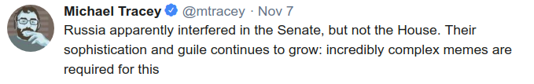
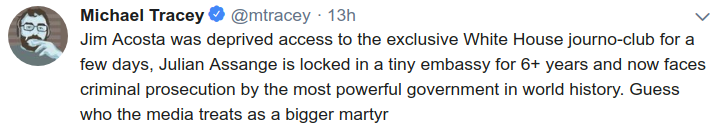

# Week 44

Is the universe inherently random because quantum mechanics says so

It says no such thing

The Copenhagen interpretation of QM makes that claim. Most Quantum
Mechanics popularizes we see and hear on media follow the Copenhagen
or the Many-World interpretation of QM. This interpretation is not the
only one. All the weird results we hear originate from these two
interpretations.

Why so many follow CQM then? Copenhagen QM allowed researchers to
compute very easily, it also came first, and beyond that, the
researchers really did not ask many questions. There is a certain
lazyness if you ask me the way scientists avoid the deeper questions
in this field. But they have been chasing their tail in so many other
fields as well; as in String Theory.

Einstein was always uncomfortable with Copenhagen QM and he encouraged
research on PWT.  He nagged at Niels Bohr for decades, he bugged him
with thought experiments, Bohr answered, until his death apparently, a
piece of formula found on his study's blackboard after is death was
another Einstein question. He could be regularly heard in the hallways
of this university mumbling "Einstein! Einstein!" after another
curveball question.

Although CQM did not originate in US, I believe it became a
quitessential American phenomenon. Because 1) it lets one compute,
something Americans like, action-oriented, you are "doing it" so forth
2) beyond computation there is bunch of mystery where you can go "woah
duudeeee, the universe is so vast... So mysterious.. I'm blown away by
it... "

Needless to say we need to get out of this mode of thinking. Mystery
does not have to be confusing, and bullshit.

---

Comment

Despite vast increases in the time and money spent on research,
progress is barely keeping pace with the past.

Partly true

The pace of inventions and developments is fantastic. But to the
extent that they slowed down in areas, delusional thinking in
big-think concepts like QM and String Theory are weighing everybody
down.

---

Legislation

Let's build an energy efficient smart-grid

Useless

You don't need smart grid bcz there is a way to store and transport
clean energy in huge amounts, with high energy density. Ammonia or
hydrogen both fit the bill. I'd look at what EU and Japan are  doing. 

---

News

Scientists have created a molecule that can store solar energy for 18 years

Great

---

EFF

When corporations get to decide how to balance their profits against
public safety, you get things like @verizon throttling firefighters
during an emergency.

Yikes

---

Wired

Lots of wind along with very dry vegetation turned the Northern
California wildfire into a high-speed menace that tore through
Paradise and Buttle County

Sad

.. and the climate inaction in US is completely the fault of centrist Democrats. 

---

CNBC

The government policy that is inflating the money supply is the
Chinese currency peg. China is a magnet for foreign capital, bringing
in far more in exports and investment than it pays out. Normally, this
would result in the value of foreign currencies depreciating relative
to the local currency. But in order to maintain its fixed exchange
rate, China's central banks buys all those extra dollars and euros,
replacing them with renminbi. This means that the government is
constantly expanding the money supply. And as long as that keeps
happening, China will keep on experiencing elevated inflation.

Right

Current scheme (huge foreign reserves) is inflationary for China. No
matter at what level one keeps the local currency, you are never in
control of your money supply because intense influx of foreign capital
(exports, investments) has to be converted to local currency, at some
level, and that can be inflationary.

---

Sean Carroll

The state of the "quantum disagreement" in the phyics community is an
embarrassment.

The understatement of the year

They asked physicist their favorite interpretation of QM and the video
shows the results. Even the CQM people are at 42%. Forty two. This is
the mainstream! Caroll himself follows the Many-Worlds interpretation
(at 18%). So for them Schrodinger's cat would not be dead and alive,
but the dead cat and the alive cat would be....wait for it.. in
different universes. Pffffff..fffff yeah man.. it blows my mind....

Let's clarify it with an example..

So the evil Shatner in one universe would have the dead cat. The good
Shatner would have the alive cat.

Or the other way around..

---

NYT

Mr. Trump’s critics should continue fighting fiercely against his
attempts — on Twitter and off — to undermine the rule of law, to rig
the system in favor of himself and his cronies and to take down not
only the Constitution but also quite possibly, if he gets the chance,
the Ptolemaic model, Newton’s Law [..]

Ptolemaic model was already wrong  

.. and Copernicus took care of that.

---

Snowden

You can despise Wikileaks and everything it stands for. You can think
Assange is an evil spirit reanimated by Putin himself. But you cannot
support the prosecution of a publisher for publishing without
narrowing the basic rights every newspaper relies on.

Yes

---

Ironically non-presence of stricter gun laws is the fault of the
Democrats.

When they chose to change focus from economic issues to soft-social
ones, they pushed Republicans to become more radical on issues that
previously could be agreed upon. Reagan was pro-gun control.  Nixon
founded the EPA. Now both these issues are a no-man's-land for
Republicans. Why? Why is sexual, abstinence, and other taboo-ish
topics come to forefront in US politics whose political discourse has
been exemplary for decades, starting with its founding. The new
landscape is one where politicians like Rick "Scrotum" can get up and
say "if you allow gay marriage, you're gonna marry your dog one
day". There is no shortage of extremism on stupid issues. 100%
agreement on primary economic issues.

So before blaming this, that or any other thing, centrist Democrats
need to see the blood is on your hands.

"The former US marine Ian Long entered a country and western bar in
Thousand Oaks on Wednesday night and killed 12 people, including a
sheriff’s deputy. More than two dozen were wounded [..].

Susan Orfanos, whose 27-year-old son, Telemachus Orfanos, a navy
veteran, died on Wednesday night  [said] "I want those bastards in
Congress … They need to pass gun control so no one else has a child
that doesn’t come home,” she said, raising her voice to speak through
gritted teeth and tears outside her home in the California suburb 40
miles north-west of Los Angeles"

---

\#russia \#russia \#russia

---

\#martyr

---
