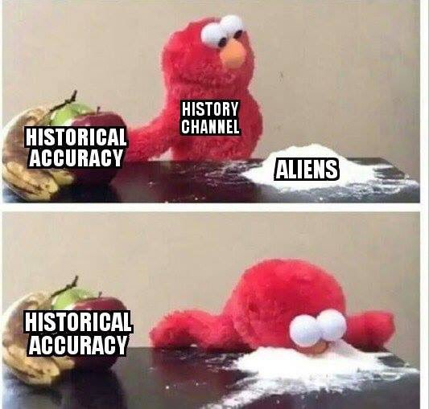

No superhero makes Europeans laugh more than Batman. There's something abt that character..  I guess too over the top. Iron Man is fine. Not Batman.

---
 
@ChartNotes

"With the first FED cut we get a spike in equities(Yay! Stimulus) , then after about the 3rd cut people realize why they are cutting(recession) and the market tanks...Everytime." 

        ~ Raoul Pal

---

Dubai's massive solar energy site. Energy storage method: molten salt -

[Link](https://www.forbes.com/sites/johnparnell/2018/12/31/dubai-makes-progress-in-pursuit-of-round-the-clock-solar-power/)

---

Really? Interesting.

"Millennials, who are not only the largest generation now in the labor force, but also the most supportive of unions, at 68 percent." The Atlantic

---

25/1 "Australia's heatwave has moved to Melbourne, where the city
braced for its hottest day since Black Saturday in 2009. Temperatures
in Melbourne reached 44 C on Friday"

---

With RBF reduction / interpolation I can represent the terrain of 20k
km^2 with 5 MB model. Whole earth = less than half a gig. Thatz some
useful math. U can store model on phone and work offline. Boom

---

Disco S02E04 - not too shabby. Feels more Trek each ep. Fantastic #1

Less of that Klingon shite plz too and I think Disco is slowly phasing that stuff out. Hopefully we saw the last of that in E03, whatever that frckin storyline was, human/K dude joined Section 31, and it's done?

These scenes look like a Kiss concert  man, where all band members in need of a Heimlich maneuver. Garg garg... gaaarrrggg!

---

@NickSzabo4

Gold has severe flaws. Physical locality makes it less secure and far more transactionally local, and thus more vulnerable to politics and less sound, than we can now achieve with Bitcoin, with good key management and taking advantage of its trust-minimized global settlement.

---

"Treasuries cannot have ledgers, like companies, showing profits and
losses, as their aim is not to make a profit. Because if the treasury
is turning a profit, the people must be taking a loss" -economist

---

Elcogen has solid oxide fuel cell tech. No rare earth metals used (no platinum), they work with ceramic at high temparature which does the job. FC's work in either direction, give elec, H2 comes out, give H2 elec comes out. Done deal.

---

The country's mainstream affairs are turning into an episode of Suits. The arm twisting, blackmail..

---

@JWilliamsFstmed
 Feb 7
More
I love how Millennials are Ghosting Banks

Millennials are the largest generation in the US.

77 percent feel the traditional financial system is “designed to favor the rich and powerful.” 

75 percent worry about the global financial system being hacked.

Bitcoin has no fav's.

---

@WhiteRabbitBTC

Wells Fargo, the 4th biggest bank in the United States has effectively been offline all day today.  No bank access at all.  CNN, MSNBC, Fox News all have zero articles about this on their home pages.

---

@KMS_Meltzy

DEEP LEARNING CANNOT BE APPLIED TO EVERY BIOLOGICAL PROBLEM 

Thank you for coming to my ted talk

---

A common theme in science fiction is that in the future, mankind has learned from its wars and has a unified world government.

Alternative: mankind has learned that centralization is fragile and now has 10,000 sovereign but cooperative states, like Switzerland writ large.

---

NYT added major # of subscribers past year, making loads of $$$ there. I see TYT is pushing for it too.

For publishers it is a "surer" revenue stream. In the coming month u know your earnings. Pretty cool.

---

@michaelxylo

"I definitely believe this. @Tesla did not disclose the extreme range
reduction you get in cold weather. On most trips in my model 3 I get
50% less range than the car estimates. (This has been in 10-40F degree
weather)."

"Study shows electric cars lose 41% of range in ‘icy temperature’,
Tesla disputes the claim"

[Link](https://electrek.co/2019/02/07/study-electric-cars-lose-range-temperature-tesla-disputes/)

---

Noteworthy. I am warming to the idea as the default mode for content distribution. Eyeballs on ads are too flaky, here now gone tomorrow. Sub rel is longer term.

"[Paraphrasing] some great businesses were built on the subscription model" I think McColl. said this

---

Putin doesn't give a flying fock about you. He's probably happy (as
most fossil fuel ppl are) the West's energies are wasted on fool's
missions, like BEVs.

This guy... 

"Musk: Putin wants to assasinate me".

---

@intellenergy

"Year-long trial with fuel cell powered scooters by the Met Police has
come to close, moving fuel cell engineering company @intellenergy a
step closer to the deployment of its products for the automotive
market #zeroemission #fuelcells #hydrogen http://ow.ly/atg030nC4vI "

---

ROFL. Rush rockin it with robes. Kinda scifi. I dig it

---

"No big country trades with the EU on WTO terms alone"

---

@DSAArchaeology

"Someone get Bad Archaeology Magazine on FB a Gold Medal for making this meme!"

---

Hm. RBF'd that bih m..t..kaaa.. (that was very high pitched, w lots of
attitude).

This interpolation used 600 pts. Not bad. The hill in prev photo is
the little guy closest to viewer. It's very hilly here.

![](elev3.jpg

---

No you cant create a cabal member, secret society, ___insert weirdness__ out of Tusk. He is a knuckle head from the streets of Warsaw. He said what he said bcz he is truly pissed at Brits and Brexiteers.

What is infuriating for the EU is the curr arrangement was best for UK. Now they are asked to give some imaginative 'better' when they can't do the old best anymore.

---

Powercell is a BUY.

I'd wait until 4 Eur tho.

---

R u kidding me? I get data in degree blocks based on integer part of
lat, lon, the mountain I want is in 31.99999 and I have 32-33 ?

---

Dude WTF

@DEFCONWSALERTS

"Within the past 24 hours, France, Russia, & the US have all conducted test launches of unarmed nuclear missiles.

France:  1 missile launch from a warplane

Russia: 1 ICBM Yars from Plesetsk Cosmodrome

US: 1 Minuteman III from Vandenberg AFB"

---

@librarythingtim

Will someone explain to me what Patreon spent $107m on—and it's not enough? Literally, how does their simple service cost that much to make and run? Okay, I'm cheap as hell in how I run mine, but seems off by an order of magnitude to what I'd consider sufficient for the job.

---

No need for "smart grid" that is supposedly based on "DC energy" and will reroute energy to where it is needed. This is 90s style old-skool Al Gore environmentalism. There is already an energy carrier based on molecules, with xport infrastructure to take it where it's needed.

---

Hypersolar is a BUY

---

Yeeaa.. I'm gonna RBF, Gaussian bump ur ass m..f..ka. Just wait.

---

Yes I dislike TFG too. And like the Orville.

<blockquote class="twitter-tweet" data-lang="en">
We’ll take it!<a href="https://t.co/9qv6gWuFxT">https://t.co/9qv6gWuFxT</a>
&mdash; Seth MacFarlane (@SethMacFarlane) <a href="https://twitter.com/SethMacFarlane/status/1092273154607722497?ref_src=twsrc%5Etfw">February 4, 2019</a></blockquote>

---

Downsample to 3%, data for 1 huge grid becomes 2 MB. Sheeeeet

---

If u have continous func, u can get elevation data at any
resolution. This is key for flattest path algo.

Next, next step; seeing if heat flow PDE can be used to find
path. Higher elev can be seen less thermal conductvity, start pos is
heat source, target is sink 

---

Imma fit Gaussian bumps on elevation data w RBF to have smooth, continous funcs as mountains. 

However 100m corresponds to 0.001 change on lat/lon. A box (20,30),(21,31) has 1 mil pts. Solution: downsample. Dude did it, reports good results on the fit.

---

TV guy said "Martin Luther Coon"? What a jackass..

I have a funny story with that word. First time I heard it was during
OJ trials. There was an OJ joke for everything. This one goes "one day
OJ comes to the courtroom, in a Hawaii shirt, summer outfit. His
lawyer asks him 'what is going on OJ? Why r u dressed like this?'

OJ says 'I thought you said we was going to Cancun'. Lawyer says 'no,
I said you are going to the can, coon'". Joke was triggered bcz we
were going to Cancun.

Guy who told us the joke was racially .. everything, except black,
hence the joke I guess.

Funnier thing is the same guy ran someone over with his car, while
drunk, killing him, and went to the slammer himself for 10 years for
manslaughter :| How's that 4 a story?

---

<blockquote class="twitter-tweet" data-lang="en">
A brilliant illustration of how much public space we&#39;ve surrendered to cars <a href="https://t.co/N5jV7T9AvK">pic.twitter.com/N5jV7T9AvK</a>
&mdash; Farbod Saraf (@farbodsaraf) <a href="https://twitter.com/farbodsaraf/status/1091875190542348288?ref_src=twsrc%5Etfw">February 3, 2019</a></blockquote>

---

I bet she'll pay for it too

'Nancy Pelosi will be begging for a wall' - Trump

---

Too funny

"Funding for Tesla’s China factory not secured"murat k. added,

---

Networked termostat. Stupidest f--ing thing ever.

@slavin_fpo

"Why am I awakened by a freezing house in 14 degree weather? Furnace is working. Vents are well maintained. 

Oh, I see why. 

The goddamn @ecobee server for the networked thermostat is down. And what could go wrong, in depending on the internet to keep the child warm?"

---

