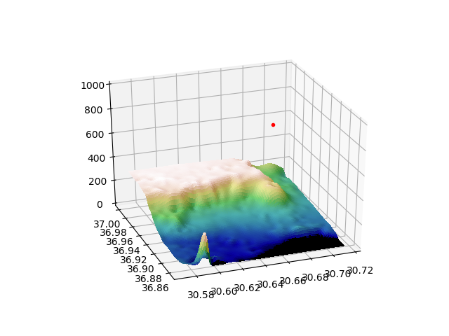
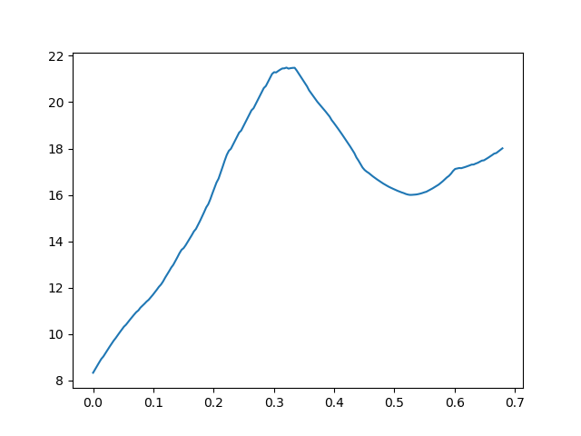
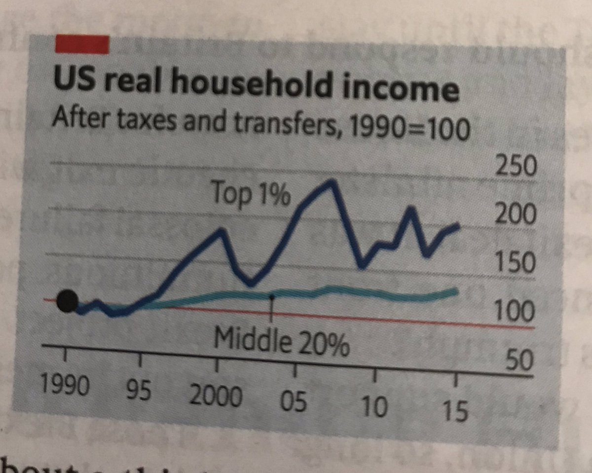

@ChaseMit

"Bohemian Rhapsody literally just got an Academy Award for sound
editing for putting Queen songs in a Queen movie"

---
 
@Austen

Wow, New York State budget director is not pulling punches 

[on losing Amazon's business]

[Link](https://www.governor.ny.gov/news/open-letter-new-york-state-budget-director-robert-mujica-regarding-amazon)

---

Actually EU is not abt breaking up nations, "superceding" them. If that were the case they would happily take in pieces of a broken up Spain. But they did not like Catalonian independence, and rebuffed its "seperatist" leader.

That makes sense bcz otherwise states would have no incentive to join. The EU is shockingly abt keeping things the way they are.

---

TR, Russia betting on gold standard is a guarantee that it will never happen. Others will rather back a scheme based on free-range chickens (hey, it's rare) than gold.

---

More towards west there is a "Mount Olympus". This is the _third_ one I've been near BTW.. 1 in Greece, 1 in Cyprus, now here... 

Could someone work thru the legends to find the real MO? Thanks.

---

My current hood.. mountains further here

---

Garry Kasparov: We need better humans, not less technology

[Link](https://www.verdict.co.uk/garry-kasparov-humans-technology/amp/?__twitter_impression=true

---

Terrain model smooths over it. But the sample data used is 4% collected from a dense grid. In an integer lat/lon block that means 4 pts per sq kilometer. It does great with mountains, valleys, etc. That ditch.. very hard.

---

Yeah...  there is no way interpolation could catch that ditch. I stood near it, it was like a grand canyon down there; but essentially it is <10 meters deep. Goog Elev raw data gets it

---

Guaranteed Job, if ever enacted, will be ripe for fraud. The way ppl run circles around that thing will blow your mind.

---

UBI sounds like the icing on the cake, as _a_ way to help. I think ppl will soon realize it is the _only_ way for our current predicament.

---

@theonevortex

Another New Survey Suggests Millennials Trust #Bitcoin Over the Stock Market

---

I have not paid much attn to female plight, bcz I saw freaky tigger
ho's growing up (even stupider than the males, if that's possible), so
perhaps not triggering symphat. I was always cognizent of inequalities
however, the #s were clear & was a proponent of "rebalance" when possib.

---

"Crash-test dummies based on the ‘average’ male are just one example
of design that forgets about women – and puts lives at risk" 

---

@karpathy

web browsing in 2019: page takes 5 seconds to load a pound of JavaScript. Video ad loads, autoplays and offsets your article. You click away popup asking you to sign up, click away the banner telling you about cookies, just to discover the story is cropped at 2 paragraphs anyway

---

>110 Bil $.. (Berkshire). At that level of fin play, you also have liquidity worries.. Such massive buy and sells.. who would take the other side of those bets?

The currency market has liquidity (much better than "stocks") but Buffy is not into that apparently.

---

@skwp Feb 21 More Building on @BtcpayServer is surreal. In a day I
 have a functional site accepting payments from anywhere in the world
 directly to my wallet. Neither I as a merchant nor they as the
 customers have given any personal info or had to log in to
 anything. This is a revolution.

---

@KeithMcCullough

Every Friday now, into the market close, Trump talks about the deal to keep stocks up for @CNBC

---

@shravanvasishth

During registration for an op,eration the nurse refuses to take a
physical copy of my doctor's letter, preferring to scan it in. She
says "we are trying to go paperless". Then I see the surgeon, and he
asks, "where is the doctor's letter?" I hand him the physical copy.

---

I dont try too hard to be a "generalist specialist". The shit finds
me. At an Aegean resort listening to FM radio, stumble upon a
Christian station (in TR yes). It talks abt how Bible mentions "do not
fear" dozens of times. This is funny cuz tigga nat anthem starts with
dat ..

.. same sentence. The author of the anthem was devout Muslim. Then I
be connectin, connectin them dots..

This is how I roll..

---

When the state plans well, it is fantastic. See how Japan, Germany
plans for hydrogen where Tiggerland, US are mired in carbon
mess. There is some action in US to be sure, but I'd like to see
more. Louder. Bang on those drums man.. just bang on that shit.

---

Mazucatto book is not bad; the narrative forgets sometimes how we got here, from state running everything -and doing a bad job at that- to privitizing 80s and 90s. But essentially, on state being a driver for innovation, funding, setting direction, it is right.

---

The Atlantic saz the think-tank behind GND gets inspiration from
"Vaclav Smil ... Brad DeLong, ... Carlota Perez... and Mariana
Mazzucato, an economist so mainstream that the Financial Times
recently profiled her love of swimming".

---

Apocalypse. There is an app for that.

<blockquote class="twitter-tweet" data-lang="en">
撮った風景を無重力空間にしてみた。 Turn the cityscape into zero-gravity space. <a href="https://twitter.com/hashtag/AR?src=hash&amp;ref_src=twsrc%5Etfw">#AR</a> <a href="https://twitter.com/hashtag/ArgumentedReality?src=hash&amp;ref_src=twsrc%5Etfw">#ArgumentedReality</a> <a href="https://twitter.com/hashtag/MaskRCNN?src=hash&amp;ref_src=twsrc%5Etfw">#MaskRCNN</a> <a href="https://t.co/QqUVoFPhXt">pic.twitter.com/QqUVoFPhXt</a>
&mdash; TakahiroPolyHorikawa (@thorikawa) <a href="https://twitter.com/thorikawa/status/1098505603998146561?ref_src=twsrc%5Etfw">February 21, 2019</a></blockquote>

---

<blockquote class="twitter-tweet" data-lang="en">
This man speaks blasphemy.  It’s been almost ten years since I first typed some green letters onto a black terminal, and I still feel like Neo every time I open it up. <a href="https://t.co/MiDbbV8ANb">https://t.co/MiDbbV8ANb</a>
&mdash; Sam Finlayson (@IAmSamFin) <a href="https://twitter.com/IAmSamFin/status/1098801541232898053?ref_src=twsrc%5Etfw">February 22, 2019</a></blockquote>

---

IMO it is irresponsible to get on TV and keep harping abt a potential / at least a few yrs away crisis and keep recommending $ and bond exits. People might apply that advice soon, on a wrong timeline, not that this "cacerolada" crowd provides that sometimes, if ever.

@EconguyRosie

"The Philly Fed survey was the icing on the cake for the bond-bull view. The special question showed that firms expect consumer inflation of 2.3% for the coming year and 2.5% for the next decade – both are down sharply from 3% last November!"

---

I'd rather have "sparsity" so you wouldnt need manners.

@WhitneyCummings

"I know reboots are hot right now but what if we brought back manners"

---

Lizzie for the tizzie

---

That angers goldcucks, sorry goldbugs 

@bendavenport

"Gold can’t match bitcoin on absolute scarcity, transportability, seizure resistance or inability to counterfeit, and is not a direct competitor."

---

Biden is a loose lipped jackass on a good day. But if he adapts M4A and _if_ he runs and wins, chooses Yang as VP, well.. we shall see.

---

Bregman was out 4 blood it seems. Tucker doesnt deserve that. B was getting his 5 seconds on a con channel, he should have made use of it. 

.. which maybe, he did.

---

<blockquote class="twitter-tweet" data-lang="en">
<a href="https://t.co/X8POdktflu">pic.twitter.com/X8POdktflu</a>
&mdash; The Human Experience (@thehumanxp) <a href="https://twitter.com/thehumanxp/status/1098246309692215297?ref_src=twsrc%5Etfw">February 20, 2019</a></blockquote>

---

I'd pay extra not to deal w cashiers, waiters, "baristas". I'm sure they'd be fine with that too. Let's automate the shit out of everything, and destroy ALL jobs.

---

Ashitaba heh? The magic plant.

---

Finally some resignations from the UK cons. This party does not deserve to be united, and it certainly does not deserve to be in power.

---

The missing link was technology.

"It was shown by Abramovitz (1956) and Solow (1956) that conventional measures of capital and labour inputs could not account for 90 per cent of economic growth in an advanced industrialized country such as the US. " -Mazzucato

---

Statistician Wald was asked where to put armor on plates that looked like that after combat. Answer is not where the bullet holes are, but where they arent. Data is biased. The ones that got the bullet to "empty" areas never came home.

<blockquote class="twitter-tweet" data-lang="en">
anti-vaxxers arguing that their grandparents never got vaccinated and survived just fine: <a href="https://t.co/ckjwBMj2DF">pic.twitter.com/ckjwBMj2DF</a>
&mdash; Seva (@SevaUT) <a href="https://twitter.com/SevaUT/status/1097880873368801287?ref_src=twsrc%5Etfw">February 19, 2019</a></blockquote>

---

Nice. This is no electrolysis BTW. No electricity is ran through the water. U simply shine the light on the thing, and starts generating hydrogen. Much closer to how nature generates energy perhaps, e.g. plants.

[Link](https://twitter.com/WarWithTheDinos/status/1097955473804926978)

"A Process to Produce Hydrogen from Water Using Sunlight Reaches 16.2% Efficiency, on Its Way to Meeting DOE Target "

---

I always thought sticthing w needle and thread was kinda stupid. Took long enough.

[Link](https://twitter.com/IntEngineering/status/1097618689401053184)

"This device stitches you up without the need of stitches via http://zipstitch.us "

---

@DavidReevesATL

Got txt from @Tesla thanking me for being early adopter- asked if I wanted to upgrade. Waiting on part for 3 mo. to repair factory defect on my X. SC says no way to notify me when part is avail. “Call back every few wks.” Do I want to upgrade?! Ha! No thx. I’m done. @elonmusk

---

Ep 2, u kinda hear Prez talk in the backgr. Not much role in this season 4 him u think.. but it is Steven Culp. Now I know there is major drama around the Prez. U dont hire Steven f--ing Culp for no drama.

I know of too many scifi actors.

---

"Huntin's no fun when the game comes to you" -- The Last Ship. Great show.

---

#gotOutOfDodge

---

@rcwhalen

It costs more to own a home than to rent one in every U.S. state |

[Link](https://www.housingwire.com/articles/48210-it-costs-more-to-own-a-home-than-to-rent-one-in-every-us-state)

 Ditto. Send your thank you notes to Ben and Janet c/o
@federalreserve #LGD

---

As well as one shot answers, I need one-shot, text/csv based plain answers. There was talk of "semantic web" once. The need is basically data queries. e.g. "GPS coordinates (sample pts from borders) of closest national park". No need for the pretty picture. Just the raw data.

---

@jamesvlahos

"When AIs become oracles, it changes everything. Exclusive first excerpt from Talk to Me!

[Link](https://www.wired.com/story/amazon-alexa-search-for-the-one-perfect-answer/?mbid=social_twitter_onsiteshare)

via @WIRED @williamtp @anthonylydgate @nxthompson @pardesoteric"

"Amazon Alexa and the Search for the One Perfect Answer"

---

@nktpnd

My latest exclusive for @thedailybeast: 2 US intelligence agencies have reviewed Russia's January press conference on the SSC-8 (the INF-busting missile) and determined it was largely misdirection. Nothing relevant to the actual missile was shown.

[Link](https://t.co/XHhVGxgr50)

---

Next up: I am the real king of soul and the original singer of r-e-s-p-e-c-t.

@100trillionUSD

"Hall Finney, Bitcoin Pioneer & Cryptographic Legend, died in 2014 .. 2015 Craig Wright appears as Satoshi Nakamoto"

---

Yang is giving a New Hampshire family 1K/mon per person? Slick move... NH is a key primary state no? 

I can see the town hall moment. "Will it work they ask? It is already working here in NH. Ask Bob and Jane (sitting in the audience)"

---

Is this place a dump or what? Feels like an outpost, rather than a city #lefkosa #gettingOutOfDodge

---

@elerianm

"This simple chart — from @TheEconomist magazine — helps explain the growing US political debate on #taxing the #rich.  And it’s a debate that will get louder in the run up to 2020 #elections.   #economy #income #taxes"

---

\#brexitexit 

