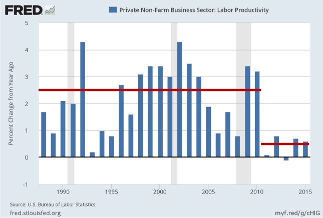

Wow.. A lot of female Trek fans dislike Disco STD too; So Woke stuff doesn't work on them.. it doesn't work on the guys.. Who is this shit really made for? It's like, losing audience is considered an accomplishment these days?

---

This is pussyxploitation. Just like blaxploitation movies of 70s.. 

[Link](../../2011/12/blaxploitation.html)

"Part Devil, Part Legend, All Man!!"

It's crass stuff and probably even worse than its older
counterpart. At least they tried to appeal to some. STD... is
weird. All agenda, top to bottom.

---

It helps not seeing life as a movie. The *big* event, reward, harps
play, spotlight turns on. This guy Kudlow said that too "everything in
my life led to this (after joining WH)" asshole had a heart attack few
weeks later. Not a movie.

[Link](https://twitter.com/jenheemstra/status/1124723833007681536)

---

Russiagate was bunch of hot air but I disagree with some peeps who got it right; it worked. A little. Some less dumb leftists fanned the flames 4 that reason, acting completely in a utilitarian fashion. 

It's an ugly business. Little too hacky 4 me tho.

---

Legendre transform.. show your secrets to meeeeee

---

@mathematicsprof

"Some people never get the honors they deserve in their lifetime. Johann Radon, who introduced the Radon Transform, which later became the basis for the CT scan is such a person. --> https://bit.ly/2EWovay   Are there others who never got proper accolades in their lifetime?"

---

@jongalloway

Changing settings in Modern UI's:

1. Look for a gear icon
2. Look for a hamburger somewhere
3. Look for a ... menu
4. Click on your face
5. Read release notes: "bug fixes and performance improvements"
6. Give up

---

It doesn't matter what ppl think. They are morons (on policy they do
not experience 1st hand). They vote on people, on character. Leaders
need to lead.

"Scientists overwhelmingly agree that climate is changing because of
human activity. But public opinion in the US remains mixed. As of
2016, less than half of Americans believe that the Earth is getting
warmer due to human activity"

---

It doesn't matter what ppl think. They are morons (on policy they do not experience 1st hand). They vote on people, on character. Leaders need to lead.

By this token UNGA could decide Venezuella to be invaded (refugees >5%, the truest sign of imbecilic fuckup, a mistake for which neighbors are paying the price), Columbia, Brasil all voting yey.

---

Latest bans are over the line. The hammer needs to come down.

---

@sugabelly

The Caster Semenya controversy is honestly more about the fact that Intersex people are the legitimate third gender, and they’ve been ignored so long with so few options.

There should be an Intersex sporting category. 

It’s unfair to women to race against Caster, and to her too

---

Producivity growth. Look at how low it is recently

Sad truth is the economy does not need so many workers or farmers. 2% generate the food in US. <15% are blue collar workers. We dont need f--ing teachers. Sorry.

The reason is same amt of output is generated with less people, displaced ppl go to shit jobs (which is most of the jobs) for which the need is questionable, overall productivity goes down.

---

Every country is stuck in the wave they were born. TR invented farming, still tries to increase employment in "sheepf--ing" i.e. piss poor farmer tied to a land (and his goat). Industrial nations want full-employment in industry that pays fair "wage".

---

@philipcball

Graham: "Loop quantum gravity?"

Witten: "Those are just words. There aren't any other routes [besides string theory]."

@pascalkwanten

Replying to @philipcball

I think Edward Witten is too narrow minded with his tunnel vision on string/M-theory as the(!) only way. Not one (new) testable prediction has been made by string theory. (Besides the microscopic explanation of BH entropy and many math conjectures). The era Edward Witten is over.

---

@EconguyRosie

Manufacturing diffusion index down. Incomes down. Workweek down. Household survey employment down. Full-time jobs down. Participation rate down. This was not a strong report beyond the headline.

---

If I cant hook up a cheap H2 / clean fuel canister to a scooter / light travel device and have it go for > 50 km in less than 10 yrs I will be a very unhappy man. I stress the word VERY. If we are alive by then.

---

Bremmer trying to defend belt and road "(parap) some countries in LatAm and EU dont object to South China see islands anymore bcz they get $$ from Ch". That's bcz America's view is the only 1 that matters. Others' non-objection is cheap. I think CH is the 1 losing here.

---

"Have smaller farms so there more farmers". This is the stupidest idea
I've ever heard.

The one thing my dad (an agricultural engineer, talked abt here

[Link](https://muratk3n.github.io/thirdwave/en/2011/08/living-in-factory.html)

keeps saying for 30 yrs is changing TR land inherit laws so land is
not divided (i.e. smaller)

Bcz there are incredible efficiencies in big lands, industrialized
farming that way.

Dingbat populists and the left fall in this trap all he the time;
aiming full employment. Once they aim for it, guess what, they get
it. But efficiency is lost. Every1 hates work, become cynical

Growth falters, wages suck (bcz ppl _really_ are not needed in this
economy), no inflation, no savings, just big ugly bubbles in places
ppl now cannot touch - the stock market and real estate.

---

@peteronyisi1

"I must admit to a certain unease when particle physics schools spend more time on machine learning than on how detectors work"

---

I also see sabotage on key fossil fuel infrastructure.. It  might get pretty bad.murat k. added,

@billmckibben

"We're getting close to the moment for all-ages climate striking. Keep your eyes peeled, and thanks to the youth for being out front!"

---

@H2Bjorn

“We know battery math about as good as anyone in the world,” Milton said.  

“The battery costs have gone up 25% to 30%. They’re not coming down. The more people who jump in, the more expensive it gets.” 

“It’s not one silver bullet,”

---

In case of bankruptcy bond holders are served first. Equity holders nearly dead last. 

It still pays to pick good companies for bonds of course, bond investors can lose too, if the collapse is big enough.

"Why buy debt when you can buy equities?"

---

<blockquote class="twitter-tweet" data-lang="en">
Thing is, you cant even physically fit 120 cars at a servicestation. Anyway, great to see UK MPs getting it. Kämpa <a href="https://twitter.com/IsabellaLovin?ref_src=twsrc%5Etfw">@IsabellaLovin</a> <a href="https://twitter.com/IbrahimBaylan_?ref_src=twsrc%5Etfw">@IbrahimBaylan_</a> <a href="https://twitter.com/svanteaxelsson?ref_src=twsrc%5Etfw">@svanteaxelsson</a> ! <a href="https://t.co/8Bg9g12roa">https://t.co/8Bg9g12roa</a>
&mdash; William Blomstrand (@william_sw) <a href="https://twitter.com/william_sw/status/1124013466883432448?ref_src=twsrc%5Etfw">May 2, 2019</a></blockquote>

---

Some1 organizes a coup in Venezuella (other than my own country) and Maduro goes - dont care. Live by the sword (nondemocracy) die by the sword (coup). No need to outrage over "oh no Maduro cant go!".

---

Zombies Time of the Season keyb solo, not bad..

[Link](https://www.youtube.com/watch?v=qzpPy9hJYA8&feature=youtu.be&t=159)

Almost as good as

[Link](https://www.youtube.com/watch?v=LCnebZnysmI&feature=youtu.be&t=238)

\#music

---

Fahrvergnugen

@ANativeAngeleno

"Daimler conducted an environmental check on the Mercedes-Benz GLC
F-CELL, in which the environmental effects of the car are examined
over the entire lifecycle. More at http://ow.ly/fL0E50rsoFA .
#driveH2 #fuelcell #hydrogen"

---

Finding water, organic matter, o2, etc in space does not surprise me. That stuff mostly came from space to Earth anyway. We are all aliens.

---

You know nothing abt the countries you speak about. This ain't a theoretic exercise. These ppl live in hell with some 10% having fled the country already #venezuella

---

A coup is the same thing as the absence of democracy, left. Why do you care if it happens?

---

@zerohedge

"Dear chair Powell: how do thousands of zombie companies and cashflow negative disrupters which exist only thanks to ultra low interest rates and constantly cut prices to gain market share, impact inflation?"

---

"This is “office hours” for a CS class at Cornell. Demand & supply of CS educators here totally out of wack. I assume many schools are facing the same problems with the sudden uptick of interest in the CS major."

[Link](https://twitter.com/juliankoh/status/1123334738608099328)

@pkedrosky

"If only there were other ways of learning computer science than via
professors and lecture theaters."

---

Uwww terrible "Joe Biden took his son Hunter on official trip to China – ten days before communist regime's bank signed deal with private equity firm Biden jnr runs with John Kerry's son"

China: here, have a BILLION dollars. Let our govs be on the up and up, okay? Gr8. Nice to do business with you. 

Money be FLOWIN up in this m..f..ka.

Bernie is well positioned for an attack from this direction. And Trump, pfff, he'll light him up like a Christmas tree.

---

I feel bad for brother Bama. Everybody's having a feast but he is not eatin? I guess they figured post Prez he can cash in with books and such..

---

Yeah open season on this guy. He needs to be limpin to that convention, if he ever gets that far #biden

---

I read somewhere there isnt enough Lithium in the world for the amount
of storage needed for a Li-on battery oriented solution. This
so-called approach is already DOA.

---

Using Stokes Thm (essentially an integral) to compute which time
series frontruns the other? Sheeeet. Imma drink that math like fine
wine foo.

---

Foundation series in the works. TV land, dont f..k this up for me.

[Link](https://m.imdb.com/title/tt0804484/?ref_=fn_al_tt_0)

Finally for once I can smirk when ppl who didnt read the books on a series ask a question.

---

[Link](https://twitter.com/robertghrist/status/1123401220687896577)

why learn differential forms & stokes' theorem?  besides the usual
applications in physics, there are some lovely novel applications in
data science...  it's time for the grand finale from the calculus BLUE
project...  1/15

---

@stucchio

At @getsimpl we're almost done porting all our data processing from Spark to @dask_dev. Our daily parsing runs twice as fast, in spite of the #dask version doing extra work. 

Don't understimate the cost of java -> pyspark serialization/IPC.

---

<blockquote class="twitter-tweet" data-lang="en">
I remember this as if it was yesterday. It was the beginning of Bosch realisation of the future of electrification. <a href="https://t.co/NCuWFz0Jl8">https://t.co/NCuWFz0Jl8</a>
&mdash; William Blomstrand (@william_sw) <a href="https://twitter.com/william_sw/status/1123337492680384514?ref_src=twsrc%5Etfw">April 30, 2019</a></blockquote>

---

There is no democracy in Venezuella. If that's your jam, all bets are off. You go, I dont care.

Morsi is elected, great. Does not act democratically, toppled, I dont care. New guy, fine. Building democracy, has elections? Great. If not, toppled, you guessed it, dont care.

---

@zerohedge

“I do not recall a society that printed its currency at a rate faster than the productive power of its economy and not encounter a rapturous inflation which ended in tears” - Harley Bassman, inventor of MOVE

---

All landfills (for garbage) need  to have a methanol production facility. I would give that tech freely to any country who needs it, India, China..?

---

@InternetHippo

"REPUBS: 18 people should own this country, everyone else can eat shit and die

DEMS (staring at dry erase board): What should our message be"

---

Wut? I heard this from a politico didnt believe at 1st. He said more polling is needed for detail. But if true.. damn.

"Trump's job approval among Latinos and Hispanics has risen to 50 percent, according to a PBS/NPR poll."

It's almost as if citizen Latinos dont want other illegal Lationos. 

That self reliance, land of oppo shit is all fine, but he take one look at his white citizen brother on opis and thinking that m..f..ka is me or my offspring after a few gens.

Then they gon wipe him out wit more open borders while he goes bankrupt from catching a cold. Yeah it kinda makes sense actually.

---

Yea that T. Pool guy is kinda annoying. But he was the right guy to grill Dorsey. Good choice.

---

@stochastician

Salesforce really is the Emacs of CRMs. Impossibly old, incredibly configurable, has its own embedded scripting language, all sorts of apps written on top of it (ServiceCloud is GNUs! ) and power users can play it like a piano but new users can’t figure out how to save a file.

---

"The largest auto-parts supplier in The World, Robert Bosch, is placing a bet on the future of #H2 #fuelcells used for mobility."

---

Aaah Feynman does some stuff with the ammonia molecule in Lecs Vol 3 (calculates the Hamiltonian).

---

"Bosch abandoned #battery cell production and now invests in production of #fuelcells - interesting strategic move"

[Link](https://www.bosch-presse.de/pressportal/de/en/bosch-to-cooperate-in-large-scale-production-of-fuel-cells-for-trucks-and-cars-188480.html)

---

It takes leadership to start those grassroot campaigns doesn't it? ;)

---

Single-use plastic: ban. No questions asked.

Farting cows: no more cows, cow meat. Synthetic meat, gobble gobble meat, etc.

Nuclear, fossil fuel: slowly unplug.

Kill the grid. Pipes not wires.

Planes, buses switch to H2 immediately.

---

I wonder if High Horse types gravitate toward half-assed dimwit
solutions bcz deep down they want to exercise their "regal muscle" and
want to see how many they can lead even into a stupid solution (the
type is a king who cannot be).

---

Hear hear goldcuck ... (Kyle Bass on gold)

[Link](https://www.youtube.com/watch?v=IZP7FIu_O2I&feature=youtu.be&t=1316)

---

Interesting. "Did you know that anything created by American federal government employees can’t be copyrighted? - EFF"

---

Some sneer at Silicon Valley "solutionism". I like their spirit and the solutions when they work. But some are in the vain of "well there is inequality so .. Im gonna build a robotic arm to .. with AI .. on the blockchain.. [blah]". This is the "solutionism" ppl dont like.

---

Ja aber hallo arschloch. Falsche technologie.

"Audi hat Produktionsprobleme beim e-tron"

Keine Fahrvergnugen fur dich

---

Physicist have all the tricks #math

Weinstein is right; these are some of the smartest ppl in the world, who in their free time invented molecular chemistry.

---

Booorrriiiiing

[Link](https://muratk3n.github.io/thirdwave/en/2018/12/linc-bi.html)

Rep. Eric Swalwell: "I pledge to lead our country with a team of rivals"

[Link](https://twitter.com/thehill/status/1117616280473874437)

---

Learned something from Endgame. If you want to solve time travel, you calculate the eigenvectors of a Mobius strip 

---

This is Barbara Streisand-ish platitudism. "Why are there two parties can't they get along and agree?" No bitch. Haven't the Clinton era taught you anything?

[Link](https://twitter.com/LukewSavage/status/1122297767324307456)

@GeorgeTakei

"Will you join me in pledging not to speak negatively about any of our candidates? We don’t know who the nominee will be, but they need to be as strong as they can be going into the election against Trump."

---

"Most of us don’t know what a geometric modeling kernel or solid modeling kernel is, but every CAD or design application uses one to create shapes. It’s the underlying infrastructure that allows someone to do the math of CAD design"

[Link](https://twitter.com/chr1sa/status/1122219434301485057)

---

I appreciate the intent but the tweets by the Mrs are too much like
the messaging of the Just Say No campaign by Nancy Reagan.

Wouldnt it be better to go after corps who pay zero tax, and not give
them a tax cut which they would use to buy back their stock anyway?

---
