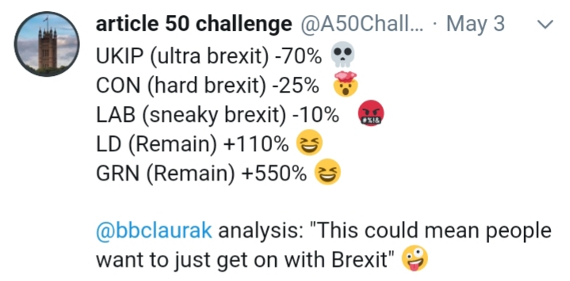

# Week 20

[Post](https://chinadialogueocean.net/8170-china-uniquely-placed-to-green-shipping/#.XOQkavaAzzs.twitter)

Liquefied natural gas for instance, while great at reducing air
pollution, has little to no benefit in reducing greenhouse gas
emissions once methane slippage is taken into account. [..] Methane
slippage is the process of unburnt methane escaping from all parts of
the industrial process, from upstream production, to storage, to the
internal combustion engine. While oil and shipping companies are
making efforts to minimise methane slippage, even very small
single-digit percentage leaks can erode the greenhouse gas benefits of
switching from oil to gas, because methane is 84 times more potent
than CO2 in its warming effects, in the first two decades after its
release.

Bad

LNG is the cleanest fossil fuel out there, but that is also hampered
with problems at large scale for common use. I don't think there is
space for anything other than H2 in all steps of the energy processs,
except maybe in the beginning, where fossil is reformed into H2. Other
than that, and considering tooling, infrastructure issues, a form of
clean H2 carrier in all steps is necessary.

[Post](https://chinadialogueocean.net/8170-china-uniquely-placed-to-green-shipping/#.XOQkavaAzzs.twitter)

In Belgium, the 120-year-old container shipping company CMB is
trialling fuel cells on one of its container ships, and later this
year the port of Antwerp is opening a hydrogen refuelling station for
ships.

The speed of this announcement surprised many in the industry who
thought hydrogen in the maritime sector was years away from
commercialisation. Meanwhile, engine manufacturers view shipping
decarbonisation as a “gold rush”. MAN Energy Solutions, one of the
world’s largest engine manufacturers, announced in December it had
successfully developed the technology to use cryogenically cooled
hydrogen as an onboard ship fuel – a major breakthrough.

[Riversimple](https://twitter.com/riversimple/status/1130862811691802624)

[video]

UK is such an innovative place. Too bad the country has been hampered
with the recent political events lately (100% elite failure).

[News](https://www.railwaygazette.com/news/traction-rolling-stock/single-view/view/worlds-largest-fleet-of-fuel-cell-trains-ordered.html)

GERMANY: Following a European tender, the Fahma rolling stock
subsidiary of Rhein-Main transport authority RMV has awarded Alstom a
contract to supply and support a fleet of 27 fuel cell
multiple-units. The contract worth around €500 million

[News](https://www.udel.edu/udaily/2019/may/arpa-e-project-shimshon-gottesfeld-yushan-yan/)

A team of engineers at UD is among the 40 awardees of the ARPA-E
OPEN2018, and has been awarded $1,979,998 in funding to build a fuel
cell system fabricated with inexpensive catalysts and structural
materials. [..] So called hydroxide exchange membrane fuel cells
[..need CO2-free air..] and a cost-effective way to generate a
CO2-free air stream [..] to address this challenge, the UD team is
developing a simple and cost effective cell serving as
“electrochemical pump,” capable of removing carbon dioxide from a
stream of ambient air.

Nice

So the FC will both use clean energy, built from inexpensive materials
*and* clean the environment while it is being used.

[News](https://www.proactiveinvestors.co.uk/companies/news/220572/afc-energy-reports-success-in-proof-of-concept-trial-using-ammonia-as-feedstock-220572.html)

AFC wants to replace off-grid stationary diesel gensets with hydrogen
fuel cell generators, and the use of cracked ammonia solves the
problem of how to get hydrogen to remote locations

I am a big fan of ammonia

Once that first decision is made right, the rest it easier; we have a
fuel based on the first element, simple, with immense energy. Then we
consider storage, transportation options, of which there are many.

On the other hand, the first decision is faulty, as in the case of
BEVs with their environment polluting lithium-ion-cobalt solution, now
there are bunch of other harder problems. I hear BEVevenglists started
to grow a liking for nuclear power recently, IMO because their
second-rate solution requires huge amounts of readily available online
power, all the time. To them even nuclear starts looking attractive.

[David Connoly](https://twitter.com/davconnolly/status/1129685070825054208)

IMF found that the "fossil fuel industry got a whopping $5.2 trillion
in subsidies in 2017. This amounts to 6.4 percent of the global gross
domestic product" Crazy!

It is crazy

[Article](https://www.wired.com/story/energy-observer-renewable-energy-voyage/amp)

Victorien Erussard, an experienced ocean racer from the city of
Saint-Malo in the north of France, was halfway through a dash across
the Atlantic when he lost all power. Sails kept the boat moving, but
Erussard relied on an engine and generator to keep the electronics
running. He temporarily lost his autopilot and his navigation systems,
jeopardizing his chances of winning the 2013 Transat Jaques Vabre
race.

Never again, he thought. “I came up with the idea to create a ship
that uses different sources of energy,” he says. The plan was
bolstered by the pollution-happy cargo ships he saw while crossing the
oceans. "These are a threat to humanity because they use heavy fuel
oil."

Five years on, that idea has taken physical form in the Energy
Observer, a catamaran that runs on renewables. In a mission
reminiscent of the Solar Impulse 2, the solar-powered plane that
Bertrand Picard and André Borschberg flew around the world a few years
back, Erussard and teammate Jérôme Delafosse are planning to sail
around the planet, without using any fossil fuel. Instead, they'll
make the fuel they need from sea water, the wind, and the sun.

Want

The boat looks so scifi. Fantastic design. To reemphasize, this boat,
the Energy Observer, does not need external refueling. It generates
its own fuel (from sun, stored as H2). This is reality. Right
now. Other needs; for water, it could be distilled, food, make from
air, or fish. One could live on this thing for a very long time.

[Post](https://twitter.com/GasNaturally/status/1125736725928644608)

Gas grid is much more cost-effective than an electricity grid: for the
same investment a gas pipe can transport 10-20 times more energy than
an electricity cable.

That's the other thing..

Since molecules are much more efficient energy carriers (and be
converted into electricity easily through FCs), why have a seperate
electric grid at all? There could be pipes going to everywhere. All
these electric cable lines could be a collosal waste. #killTheGrid

---

[Link](https://twitter.com/ErikSolheim/status/1130108372488007683)

Schools in Mexico City were closed this week due to a heavy cloud
of smog blanketing the city. Parks closed. People wearing
masks. Asthmatics suffering. Time to beat air pollution!

---

"No one is more hated than he who speaks the truth." - Plato

---

Annexing Area C leaves Pals in patchy shit areas. Why cant they have a contiguous piece of West Bank? #newdeal

Sharing Jerusalem is good. But the rest is a tough sell. 

I am still 4  a single state solution with pol elligibility restrictions (no Pals for  high office, SC)

---

<blockquote class="twitter-tweet" data-lang="en">
Comedians like Samantha Bee get mainstream credibility by attacking Bernie Sanders. “She’s against Republicans but at least she’s even handed because she hates Bernie Sanders like the rest of us.” It’s so bold as a comedian to protect the status quo. Congrats!
&mdash; Cenk Uygur (@cenkuygur) <a href="https://twitter.com/cenkuygur/status/1129049279941754880?ref_src=twsrc%5Etfw">May 16, 2019</a></blockquote>

---

I just remembered the great 90s movie The American President (starring
M. Douglas) was all abt gun control. Like, the movie sold it like the
most important issue ever, enough to hinge an entire movie around
it. "I am sending 455 to the floor". "Oh honey f--k me".

Courtesies of Aaron Sorkin of course. The king of polishing 90s,
centrist, corporate Dem turd and make it shiny, technical, "smart",
"Trek-like".

TAP is the origin of the West Wing BTW. More turd, spread among eps
now, and many seasons.

Oh yeah and the great speech at the end "I'll go door by door and
collect all the guns". Yeah good luck with that.

(Repurchase is better. Plus if u talk abt left issues more u wld solve
guns easier).

Clearly the 90s were a gran'ol time.

---

<blockquote class="twitter-tweet" data-lang="en">
The world&#39;s first 3D-printed village is set to rise in an undisclosed location in South America <a href="https://t.co/q7GTIzk6tM">https://t.co/q7GTIzk6tM</a> via <a href="https://twitter.com/tictoc?ref_src=twsrc%5Etfw">@TicToc</a> <a href="https://t.co/auNUid19N8">pic.twitter.com/auNUid19N8</a>
&mdash; Bloomberg (@business) <a href="https://twitter.com/business/status/1129960713945010176?ref_src=twsrc%5Etfw">May 19, 2019</a></blockquote>

---

It aint that bad. Given a choice btw Biden and Trump progs can
consider staying home. We need to stamp on centrism like stamping on
cockroach. They are nothing but bad news.

[Link](https://twitter.com/LukewSavage/status/1129805272103493637)

---

Cutting Iranian oil exports in this way is escalation. The requests heaped on them for a return to normal dont seem like stuff Iranians will go for; that's why I keep thinking, is US itching for war? Or bluffing really well? Squeezing China thru their oil imports?

---

Of course Trump is partly to blame #abortion But the pol climate is still littered with fucking centrists, on the Dem side (Biden is frontrunner hello), the other side still need to distinguish themselves through hot button issues.

---

https://www.youtube.com/watch?v=QytfYyHmxtc&feature=youtu.be&t=576

737 MAX - the documentary

---

<blockquote class="twitter-tweet" data-lang="en">
<a href="https://t.co/GK7Zk5JU3v">https://t.co/GK7Zk5JU3v</a>
&mdash; Sebastian Thrun (@SebastianThrun) <a href="https://twitter.com/SebastianThrun/status/1129626404285427712?ref_src=twsrc%5Etfw">May 18, 2019</a></blockquote>

---

This might be a good time to mention an old post,

[Link](https://muratk3n.github.io/thirdwave/en/2017/03/cursed.html)

Then see picture

[Link](https://encrypted-tbn0.gstatic.com/images?q=tbn%3AANd9GcSG05wit77TFPsGOZPPpeRaxR8NN74AnI_Indm2R4Ury1FLFCTn)

---

Godot game engine - completely free completely open source - https://youtu.be/IPCv6F-IgXU?t=75 … - tuber said exactly what I was thinking - this is the Linux of game engines. 
Its hd footprint is small. Getting crazy updates, improvements.

[Link](https://www.youtube.com/watch?v=IPCv6F-IgXU&feature=youtu.be&t=75)

---

M4A with UBI would not be opt-in, they are both offered, seperately. But a program such as food stamps would be opt-in IMO. A lot of this common sense, UBI is given so you could buy everyday items, like food. Healthcare is a different beast.

---

U wanna end up like Venus? V had a runaway greenhouse effect; CO2 led to more CO2, eventually their oceans boiled away. Now there is nothing left. 

"But a little greenhouse effect can be nice, Earth heats up a little"

---

Winter Soldier

[Link](https://twitter.com/ChemistryNews/status/1129382327597977602)

"Darpa wants to genetically engineer soldiers’ skin bacteria to protect them from mosquitoes"

---

Yeah I have no problem with that. Then time becomes a by-product. 

As long as u dont have dead cats, alive cats multiple universes with me with a goatee and wearing leather pants we're a-ok. 

"Loop Quantum Grav drops time from its equations"

---

<blockquote class="twitter-tweet" data-lang="en">
<a href="https://twitter.com/hashtag/FSRPolicyWorkshop?src=hash&amp;ref_src=twsrc%5Etfw">#FSRPolicyWorkshop</a> Sector Coupling 2.0  2 to 3 years ago, green H2 was kind of a dream for 2050 horizon  This morning, we hear industry thinking making it competitive around 2030  What a great leap forward!
&mdash; Jean-Michel Glachant (@JMGlachant) <a href="https://twitter.com/JMGlachant/status/1129305316036882432?ref_src=twsrc%5Etfw">May 17, 2019</a></blockquote>

---

No bans. No censoring. You fight trolls through the same filter mechanism; on the message consumer. 

"Twitter, Facebook qustion: If you handle all filtering on the client based on user chosen filter packages, how do platforms fight fake accounts, trolls?"

---

WTF is raining down on these people?

<blockquote class="twitter-tweet" data-lang="en">
The French Insurer <a href="https://twitter.com/AXA?ref_src=twsrc%5Etfw">@AXA</a> has partially divested from the Israeli arms company Elbit Systems.<a href="https://twitter.com/SumOfUs?ref_src=twsrc%5Etfw">@SumOfUs</a> and <a href="https://twitter.com/hashtag/BDS?src=hash&amp;ref_src=twsrc%5Etfw">#BDS</a> groups call on AXA to fully divest from Elbit, and to end all its investments in Israeli banks that finance Israel’s settlements.   News report: <a href="https://t.co/uXdxwdkeJ0">https://t.co/uXdxwdkeJ0</a> <a href="https://t.co/0wfRXgbo6b">pic.twitter.com/0wfRXgbo6b</a>
&mdash; BDS movement (@BDSmovement) <a href="https://twitter.com/BDSmovement/status/1129281654059687936?ref_src=twsrc%5Etfw">May 17, 2019</a></blockquote>

---

Someone in the reply shared this

TEN LESSONS I WISH I HAD LEARNED BEFORE I STARTED TEACHING
DIFFERENTIAL EQUATIONS

"'Never in my life have I heard of anyone solving a first order differential equation by finding an integrating factor.' -- Gian-Carlo Rota"

[Link](https://web.williams.edu/Mathematics/lg5/Rota.pdf)

---

The cosmos wants me to write paid content code from scratch. Why do ready-made solutions suck so bad?

---

Heroku got some s..t going on kno wha Im sayin?

---

I have a knack 4 being at the right place for historical shit. Now I am at the place where the big party will be when f--head goes down.

---

"After all these years I’m still not sure if MCMC is a good idea or not"

[Link](https://twitter.com/stochastician/status/1129043807692087300)

---

Meghan Mc, bitch is worse than her father. How's that possible? Arent u supposed to improve with each generation?

---

@BernieSanders

"Millennials aren't struggling because they're lazy or wasting their money on avocados. They face unprecedented economic challenges due to decades of policies to help corporations and the top 1% while leaving working people behind."

---

Wut? Rare to hear neg coverage of this tech.

Ideal and simplest approach is of course clean fuel based renewable storage, distribution, generation. 

"CCS/CCU is the #Theranos of energy, a fake tech that increases air poll death & mining of fossils" @mzjacobson

---

Billions lost its spark.

---

"A fan walks up to Pierce Brosnan, shakes his hand then tells him 'this is the closest my hand will ever get to Halle Berry's ass'". Hahaha

---

The 120k number is oddly reassuring because it suggests the Iran conplan being discussed and leaked is old.

[Link](https://twitter.com/aaronstein1/status/1128241759446867968)

---

Funny u say that, I was thinking the same thing today bcz it is exactly like the Betamax situation. 

"Hugo Spowers, @riversimple tells the #FTCar Summit Electric vs Hydrogen is not a Betamax situation" - FT

---

"An international team of researchers [..] has discovered a new
material made from manganese hydride that [..can..] be used to make
molecular sieves within fuel tanks—which store the hydrogen [..] The
material, called KMH-1 would enable [better] tanks"

[Link](https://m.phys.org/news/2019-05-material-potential-hydrogen-powered-vehicle.html)

---
 
@sreekyshooter

"Lmao @ the people who named their kids Daenerys or Khaleesi. What a bunch of absolute fools. If only they were as wise as me, father to a beautiful baby girl named Detective Pikachu"

---
 
@mathematicsprof

Whenever I see a tv movie and they have equations on a blackboard, I quickly scan them. I once saw a movie about a genius investor on Wall Street and a blackboard had Euler's characteristic V - E + F on it.  I was starting to think, what does that person know I don't know.

---

Sman and industrialization 

[Link](https://www.youtube.com/watch?v=IFUNh1Ba3Xg&feature=youtu.be)

---

Gina Shakespeare. Damn.

---

@jeffspolitics

"My brother in laws wife recently went to the hospital for an emergency. They did a CT Scan and charged her $3500

Her insurance through work has a $4000 deductible. 

Anyone who tells you Americans want to keep their insurance is straight up lying. #MedicareForAll"

---

<blockquote class="twitter-tweet" data-lang="en">
But socialists are the naive, impractical ones <a href="https://t.co/ZmjGaVVQ4J">https://t.co/ZmjGaVVQ4J</a>
&mdash; Luke Savage (@LukewSavage) <a href="https://twitter.com/LukewSavage/status/1128334951127113728?ref_src=twsrc%5Etfw">May 14, 2019</a></blockquote>

---

<blockquote class="twitter-tweet" data-lang="en">
The &#39;electrify everything&#39; crowd within <a href="https://twitter.com/hashtag/energytwitter?src=hash&amp;ref_src=twsrc%5Etfw">#energytwitter</a> loves German policy but is completely silent on Germany&#39;s push (now 60) to 100 hydrogen stations by 2020. Never a retweet on their policy for sector coupling (gas + grid) and <a href="https://twitter.com/hashtag/powertogas?src=hash&amp;ref_src=twsrc%5Etfw">#powertogas</a> to scale wind and decarbonize industry <a href="https://t.co/cwIZq0avHq">https://t.co/cwIZq0avHq</a>
&mdash; Garry Golden (@garrygolden) <a href="https://twitter.com/garrygolden/status/1128303239190011904?ref_src=twsrc%5Etfw">May 14, 2019</a></blockquote>

---

Bootyjudge and Shapiro feel like two milenials similar somehow, 1 on the left 1 on the right, but similar. During their formative yrs, 90s, one would soak up the Clintonite West-Wing spinster cool, the other unfettered free-tradism. They dont seem to have woken up ..

.. to the repercussions of that era tho. I wonder why. Is it bcz they were particularly smart, groking the era but locking it in, or particularly dumb for not checking historical context and the after-effects. Shapiro's free-tradism looks especially sad.

---

Free trader goldcuck is like "oh no no, don't touch anything".  This ain't free, and it ain't trade. This is also abt multinational corps exploiting workers in another country through an opressive state that isnt their own. 

U count ur gold bullions dude. #china

---

"Changing of the current trade scheme is not in China's interest". Of course it isn't. Which country doesnt want free-range access to every tech secret within their borders? That is what forced tech xfer policy does. 

US turned a blind eye to it bcz they wanted China to prosper.

(Prosper as in counterbalance Russia, wink-wink)

---

[snippet from Navarro book on Chinese dollar sterilization]

Nothing abt the Chinese - US relationship is natural. It was brought to this position for strategic reasons. If strategy changes, this relationship changes. Who decides? The duly frickin elected official of the US obviously.

---

Science of AI falling behind

"All my grad students are fitting shit [paraphrasing]" she says. Sad.

[Link](https://www.youtube.com/watch?v=4QBvSVYotVc&feature=youtu.be&t=1897)

---

<blockquote class="twitter-tweet" data-lang="en">
Nice job by the <a href="https://twitter.com/CNBC?ref_src=twsrc%5Etfw">@CNBC</a> crew plowing poor Mom &amp; Pops into <a href="https://twitter.com/search?q=%24UBER&amp;src=ctag&amp;ref_src=twsrc%5Etfw">$UBER</a> and <a href="https://twitter.com/search?q=%24LYFT&amp;src=ctag&amp;ref_src=twsrc%5Etfw">$LYFT</a> <a href="https://t.co/INQqqp3P7T">pic.twitter.com/INQqqp3P7T</a>
&mdash; Keith McCullough (@KeithMcCullough) <a href="https://twitter.com/KeithMcCullough/status/1127932836445659136?ref_src=twsrc%5Etfw">May 13, 2019</a></blockquote>

---

@e_d_andersen

"Some say people gets the politician they deserve. Not sure anybody deserve Farage.Erling Andersen added,"

---

Maybe it is unfair to label GoT, Star Wars fails completely due to SJW. Maybe they r the result of them distancing themselves from their creator' vision. SW is not Lucas' anymore, bad GoTs were done wout book material. 

I say this bcz same thing happened to the Terminator.

The new movs were made wout Cameron. He hates them and they do suck. 

The suck materialized differently tho, post 2016 it was SJW. It could have been something else.

---

Blair is talking abt "the tally" for Remain side having to go up (he is hoping) for EU parlm. elections. He seems to count cons on Brexit pile tho. There is now a Brexit Party, all pro Brexiters would have gone there. The remaining cons cannot automatically be considered Brexiter

---

Fine for me! 

"According to Reuters calculations, Bosch would only need a tenth of the platinum used in current fuel cell vehicles" @H2Bjorn

---

"[W]e’d like to understand the dynamics of a pendulum. Why a pendulum? In part, because the dynamics of a majority of our multi-link robotics manipulators are simply the dynamics of a large number of coupled pendula" - Tedrake, Robotics Lecture

Multi-link manipulators: as in the legs for Asimo's walking. I am glad they use hard-core math, not monkey Reinf Learning code, if something went wrong which one would you rather debug? A black box with bunch of "weights", or the math with a model.

---

Sage the Gemini - Now & Later #music

---

Hey that was pretty good Nixon

[Link](https://www.youtube.com/watch?v=4-rj1gVl6vs&feature=youtu.be&t=1420)

---

Much was made by Gingrich's temper tantrum during the 95 budget debacle. To many the event sounded petty, deplaning from a different door, not fit 4 their position, being a cry baby etc. But the thing was final drop IMO on a series of events. He was not consulted on a budget deal

"We got this all covered, now all that is left for you others (Reps) to show up and vote yey to what we say". Centrists dont realize this drives others insane and they do all they can to undermine you.

---

The percentages shown are from the recent UK local elections, gains /
losses, for each party. What net acronym should I use here? LMAO?
ROFL?

"Get on with it" is a common phrase heard among the Brexiter
citizens. "Ok, we voted and now you do your job" kinda
statement. Except, such citizens need to understand, UK officials
*didn't* do their job by framing a question too much for your dumbass
to handle. This is a perfect example of an idiom seemingly suggesting
a course of action, but the action is shit. "Get on with it" - what
the fuck does that even mean?  Byzantine rules, regulations, gazillion
different interests pullling to all different directions. You cant
just "get on with it". If they could they would have by now.

---

What Greed has Done: Chris Hedges

[[-]](https://youtu.be/6w-DVGWVhIw?t=75)

---

