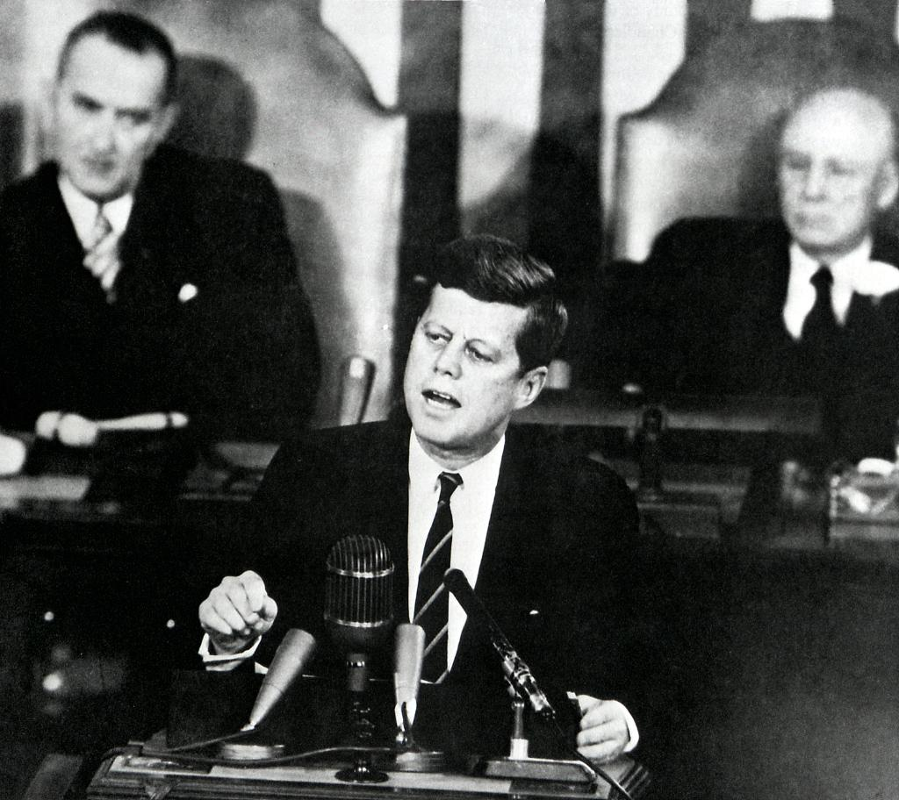

# Week 24

<blockquote class="twitter-tweet">
Teslas being replaced by <a href="https://twitter.com/hashtag/Hydrogen?src=hash&amp;ref_src=twsrc%5Etfw">#Hydrogen</a> Cars as Eco-Conscious Hollywood Obsession. To capture the VIP market, major brands are offering loaners and free fuel along with their latest luxury models <a href="https://t.co/0uXbP9yxMS">https://t.co/0uXbP9yxMS</a> <a href="https://t.co/G3yAO2LkJX">pic.twitter.com/G3yAO2LkJX</a>
&mdash; Hydro Kevin (@hydrokevin) <a href="https://twitter.com/hydrokevin/status/1139633933400674304?ref_src=twsrc%5Etfw">June 14, 2019</a></blockquote> 

---

@MatsWLundberg

"If vehicle penetration increases up to 20 million vehicles in the base case scenario, a battery charging infrastructure would cost around € 51 billion, making it more expensive than hydrogen infrastructure, which comes in at around € 40 billion"

[Link](https://www.fz-juelich.de/iek/iek-3/EN/Forschung/_Process-and-System-Analysis/News/InfrastructureAnalysis/article.html)

---

Tigga is still flailing here talkin bout military service and such going apeshit on the prospects of losing Istanbul mayoral election (again).

<blockquote class="twitter-tweet">
Moody&#39;s cut <a href="https://twitter.com/hashtag/Turkey?src=hash&amp;ref_src=twsrc%5Etfw">#Turkey</a>&#39;s credit rating deeper into &quot;junk&quot; territory as &#39;the risk of a balance of payments crisis continues to rise and with it the risk of a govt default.&#39; The B1 rating balances these risks against the still-moderate levels of govt indebtedness. <a href="https://t.co/1dtsSjHZap">pic.twitter.com/1dtsSjHZap</a>
&mdash; Holger Zschaepitz (@Schuldensuehner) <a href="https://twitter.com/Schuldensuehner/status/1139645713942491139?ref_src=twsrc%5Etfw">June 14, 2019</a></blockquote> 

---

<blockquote class="twitter-tweet">
My cousin in England told her colleagues she wanted a Mariah Carey birthday cake. They misunderstood, and is the cake they made her instead. It’s Marie Curie, looking very festive. <a href="https://t.co/LMHJnMATqD">pic.twitter.com/LMHJnMATqD</a>
&mdash; Harriet Alida Lye (@harrietalida) <a href="https://twitter.com/harrietalida/status/1139628389009170433?ref_src=twsrc%5Etfw">June 14, 2019</a></blockquote> 

---

LA feels like a "village"; I hate the place already.

Village is an agrarian concept, closely knit gathering, which
basically means everyone's finger is up someone else's ass. Jesus, his
teaching, is left, against the "village" and Rome.

Gov (left) help to people will decrease connections, will make us more
human, that is a spread out populace with intermitten
connectivity. People who like to have sex with goat and sheep can
still do that of course, but I am thinking they will be in the
minority, as the culture is repugnant and revolting. Catholicism,
Ottoman Caliphate as cultures are all extensions of this which need to
be culturally cleansed.

Australians apparently still are somewhat nomadic and human.

@hexsteph

"Being in LA is like having to completely relearn basic social interaction. Australians are known for being laid back but I would say we are also quite reserved. I can't handle so many conversations with strangers. In the lift, in a queue, in a shop - people just keen to chat 24/7

Makes me feel like a cynical dickhead by comparison but also: I didn't sign up for a full-on interview every time I get into a lift & lost in thought when I'm never going to see that person again. I feel like I have to be mentally more agile to manage"

---

[CNET](https://www.cnet.com/how-to/2020-democratic-primary-debate-candidates-start-time-how-to-watch-live/)

They did the kid table thing again..

Centrists must have been scared Warren would steal Biden votes more than Bernie votes. 

Beto is in the kid's table, Bootyjudge made it through apparently.

---

Tweeting for free.. Suckers.

---

Politico says Tories in the long-term are over. They will split the same way old Liberals did in the beginning of the 20th century.

---

F..head is so discredited. Some announcement of his comes up on radio, ppl in the pub transit start to laugh. He sounds .. muted too. 

---

Making H2 production green will have immediate econ effects. We already produce hydrogen for ammonia, that is, for fertilizer production. 55% of hydrogen is for that. Make that green a humangous product becomes green. Than we use that green process for cars, heating, all sorts of energy.

---

That's crazy. Really?

"US Military Drops a Bomb Every 12 Minutes, and No One Is Talking About It"

[Link](https://www.truthdig.com/articles/trumps-military-drops-a-bomb-every-12-minutes-and-no-one-is-talking-about-it/)

---

@michaelxylo

"I definitely believe this. @Tesla did not disclose the extreme range
reduction you get in cold weather. On most trips in my model 3 I get
50% less range than the car estimates. (This has been in 10-40F degree
weather)."

"Study shows electric cars lose 41% of range in ‘icy temperature’,
Tesla disputes the claim"

[Fanboy Site Electrek](https://electrek.co/2019/02/07/study-electric-cars-lose-range-temperature-tesla-disputes/)

---

It feels like this mall is built around the Apple store in it. The store is huge and smack in the middle #zorlu

---

<blockquote class="twitter-tweet" data-lang="en">
<a href="https://t.co/X8POdktflu">pic.twitter.com/X8POdktflu</a>
&mdash; The Human Experience (@thehumanxp) <a href="https://twitter.com/thehumanxp/status/1098246309692215297?ref_src=twsrc%5Etfw">February 20, 2019</a></blockquote>

---

<blockquote class="twitter-tweet">
Momentum currently behind hydrogen is unprecedented, with more and more policies, projects and plans by governments &amp; companies. But there are challenges: costs need to fall; infrastructure needs to be developed; cleaner hydrogen is needed; and regulatory barriers persist <a href="https://t.co/ZwW9mwZ1lq">pic.twitter.com/ZwW9mwZ1lq</a>
&mdash; Fatih Birol (@IEABirol) <a href="https://twitter.com/IEABirol/status/1139439740078313472?ref_src=twsrc%5Etfw">June 14, 2019</a></blockquote> 

---

[Link](https://slate.com/technology/2019/01/5g-mobile-wireless-network-hype-consumers-fcc.html)

"Telecom Companies Are Seriously Overhyping 5G Networks

The marketing gimmicks would be hilarious if they didn’t come with
potentially major consequences."

---

"EFF: Studies Keep Showing That the Best Way to Stop Piracy Is to Offer
Cheaper, Better Alternatives"

---

"Apple should release a competitor to Slack and call it iRC"

---

@shravanvasishth

"MIT Open Courseware long preceded the MOOC boom, and having done some
MOOC courses on Coursera etc., I must say the MIT model is far
superior. It doesn't compromise (45 min or longer lectures recorded),
and it is much closer to a real classroom experience."

---

Yes go for the smaller target, the narrow. Not the broad, the
"general". How did people ever think they can get there by "fitting
some shit" using basically a glorified regression routine? Phsycist
have all the math in the world and they _still_ did not get to the
Shangri-La. Are these people insane?

“Artificial Narrow Intelligence”, that is where the great achievements
are says Kevin Françoisse (@kfrancoi), CEO of @Sagacify

---

"Give a man a gun, and he can rob a bank. Give a man a bank, and he can rob the world" 

---

So if you want employment, kill the BEV experiment. It's an abomination.

"Hyundai, one of the companies backing hydrogen power as an alternative to battery technology, says switching to hydrogen also prevents the destruction of component jobs that would be lost by moving to electric cars. http://ow.ly/gtjR30o4YOL   #driveH2 @CaFCP"

---

Warren does a lot of fishing in the minutea; but there can be some
goodies there. I was reviewing old tweets saw one from March
"Elizabeth Warren Calls for a National Right-to-Repair Law for
Tractors". Right to repair is a big deal and extends even to
iPhones. The tractor thing would help her in Iowa.

---

Bernie speech on Economic Bill of Rights; very good. Bernie can seem
like an outsider sometimes, but that really is not his fault. He seems
like an outsider NOW bcz of the centrists plague. In the speech he
basically said "I am Roosevelt" tying himself to the party through
him. And it is right, during FDR days, he would seem like a regular
Democrat.

The Bill of Rights part is to reclaim the box of goodies which other
candidates claim they'll dole out once in power. He turned the volume
up, and took all the goodies back. And tied it into a coherent
whole. The "are you truly free" part was awesome.

---

Blacklist, Supernatural still going strong. Great writing, and one has
James Spader in it! Arguably 1 of the best actors in his gen, along
with Downey and both were in an Avengers mov, Spader was the voice of
Ultron.

---

@briebriejoy

"If you get really sick, you can't work. But if you lose your job you
lose your insurance.

What kind of sense does that make?"

---

Yea that sucks. A chink in your armor.

But it is smart politics in the context of what she is trying to do. 

[Link](https://theintercept.com/2014/08/28/elizabeth-warren-speaks-israelgaza-sounds-like-netanyahu/)

"Elizabeth Warren Finally Speaks on Israel/Gaza, Sounds Like Netanyahu"

---

From Tooze book Crashed.

Now I know why I keep seeing this guy (Rajan) at honco meetings. He
became India CB head later but it always seemed like he was treated as
a prominent voice on econ issues. This must be why.

"Every year in August the elite of the central banking and monetary
economics world gathers at a resort in Jackson Hole, Wyoming. In
August 2005 the theme of the conference was not the crisis brewing in
the US housing market but a celebration in honor of the outgoing Fed
chairman, Alan Greenspan. Most of the presentations were appropriately
upbeat. But one rang an off note. It was given by Raghuram G. Rajan,
an Indian by birth but a fully paid-up member of the American
economics elite, professor at the Chicago Booth business school and
chief economist at the IMF. His paper bore the heretical title “Has
Financial Development Made the World Riskier?”57 Rajan worried that
the dramatic expansion of modern financial intermediation was building
up a dangerous new appetite for risk. At Greenspan’s farewell party,
the message was not welcome. Rajan was slapped down by Larry
Summers. Wielding his full authority as former Treasury secretary,
Summers introduced himself as “someone who has learned a great deal
about this subject from Alan Greenspan . . . and . . . who finds the
basic, slightly Luddite premise of this paper to be largely
misguided.”58 To highlight risks in a complex, modern financial
system, as Rajan was tactlessly doing, was to invite “restriction” and
other “misguided policy impulses.” It would be like giving up air
travel for fear of crashes."

---

<blockquote class="twitter-tweet">
Wan Gang, China’s father of electric cars, thinks hydrogen is the future <a href="https://t.co/UPNeuadjVW">https://t.co/UPNeuadjVW</a> via <a href="https://twitter.com/SCMPNews?ref_src=twsrc%5Etfw">@scmpnews</a>
&mdash; At War With The Dinosaurs (@WarWithTheDinos) <a href="https://twitter.com/WarWithTheDinos/status/1139023675901059082?ref_src=twsrc%5Etfw">June 13, 2019</a></blockquote> 

---

[Link](https://twitter.com/LukewSavage/status/1138879111752011777)

Sanders argues we need to rethink the meaning freedom: "Are you truly
free when you spend half your income on housing? Are you truly free
when you are 70 years old and lack a pension to retire?"

"Are you truly free if you are forced to work 60 or 80 hours a week
because you can't find a job that pays a living wage? Are you truly
free if you are a new mother forced to go back to work immediately
after the birth of your child because you don't have paid family
leave?"

---

Are you a punk bitch?

---

Forbes 

"The growing use of lithium batteries to store energy has exposed one
of the dirtier sides of transitioning to a low carbon economy. To
create these batteries, there is a need for a range of rare earth
metals that require heavy mining and manufacturing that emit
significant emissions. Furthermore, major components such as lithium,
nickel, and cobalt exist in a finite amount that is unlikely to meet
the current and future demands for battery units"

☹☹

---

"Ditch the tribalism and go for mosaic of propulsion solutions"

[Link](https://www.driving.co.uk/news/features/hyundai-hydrogen-must-part-future/)

Yea that's fine bcz "ditch tribalism" talk at gov level right now
helps H2. In an even playing field we'll bust a cap on their ass.

The real headline though is "PLUG-IN ELECTRIC CARS ARE ‘QUICK FIX’ BUT
HYDROGEN MUST BE PART OF FUTURE"

---

<blockquote class="twitter-tweet">
Hydrogen isn&#39;t the fuel of the future. It&#39;s already here <a href="https://t.co/Caucvazplo">https://t.co/Caucvazplo</a> <a href="https://t.co/UEWJ1J4T9G">pic.twitter.com/UEWJ1J4T9G</a>
&mdash; World Economic Forum (@Davos) <a href="https://twitter.com/Davos/status/1138476116472225794?ref_src=twsrc%5Etfw">June 11, 2019</a></blockquote> 

I hate to retweet frickin Davos. But they got this one right.

---

[Link](https://mobile.twitter.com/MkBlyth/status/1138479409927720960)

"Long ago I was captivated by a seductively intuitive idea, one many of my wealthy friends still subscribe to: that both poverty and rising inequality are largely consequences of America’s failing education system. Fix that, I believed, and we could cure much of what ails America.

What I’ve realized, decades late, is that educationism is tragically misguided. American workers are struggling in large part because they are underpaid—and they are underpaid because 40 years of trickle-down policies have rigged the economy in favor of wealthy people like me"

Bulls eye. Hanauer is a billionaire, constantly talks about redistribution. 

---

[Link](https://arstechnica.com/tech-policy/2018/08/verizon-throttled-fire-departments-unlimited-data-during-calif-wildfire/)

"Verizon throttled fire department’s “unlimited” data during Calif. wildfire"

Uwwww 

---

[Link](https://mobile.twitter.com/garrygolden/status/1138465581240389634)

H2 combustion engine? Why not? I was actually curious why that did not catch on first rather then fuel cells that go from H2 to electric.
 
---

<blockquote class="twitter-tweet">
Clearly, <a href="https://twitter.com/federalreserve?ref_src=twsrc%5Etfw">@federalreserve</a> must work harder at creating more inflation!!! <a href="https://t.co/d0nkkTLoHf">https://t.co/d0nkkTLoHf</a>
&mdash; Mark B. Spiegel (@markbspiegel) <a href="https://twitter.com/markbspiegel/status/1138467758704869377?ref_src=twsrc%5Etfw">June 11, 2019</a></blockquote> 

---

"Amazon found an extremely efficient way to build certain kind of
retailer and just keep cranking the handle"

Specifics r important; I dont think the advent of Prime was due to
turning that one crank.

[Link](https://www.vox.com/recode/2019/5/3/18511544/amazon-prime-oral-history-jeff-bezos-one-day-shipping)

---

[Link](https://twitter.com/PhysicsToday/status/1138533810860167168)

"Historically, physicists have played a major role in developing
diagnostic and treatment tools for cancer. Now they're increasingly
delving into understanding the disease"

Fantastic, little less vodoo, little more science. Can't they get into
more of the other branches? Like, everything (especially economics).

---

Camp fire / stove in a stupid can! Mad skillz.

[Video](https://youtu.be/deCzUOZyII8?t=170)

---

Peter Douche moves to left? It's a new world indeed. 

<blockquote class="twitter-tweet">
WHY I&#39;M MOVING LEFT  After 20 years in politics, both as an anti-Bush/Cheney activist and as a Dem strategist, I see that the centrist, bipartisan, incrementalist, GOP-lite approach is a disaster. We&#39;ve tried it and lost ground, now it&#39;s time for unapologetic progressivism.
&mdash; Peter Daou (@peterdaou) <a href="https://twitter.com/peterdaou/status/1138569634184073218?ref_src=twsrc%5Etfw">June 11, 2019</a></blockquote> 

---

<blockquote class="twitter-tweet" data-lang="en">
A bit rambling, but if you want to see inside the head of an Obama appointee (ex-FCC chair) neoliberal Democrat about what the hell happened and where we are now, try this: <a href="https://t.co/fwz8MLpZGc">https://t.co/fwz8MLpZGc</a>  Warning: Contains Spoilers :-)
&mdash; Mark Blyth (@MkBlyth) <a href="https://twitter.com/MkBlyth/status/1138611546085625856?ref_src=twsrc%5Etfw">June 12, 2019</a></blockquote>

---

[Link](http://www.donga.com/en/article/all/20190612/1758513/1/Hydrogen-economy-two-years-behind-Japan)

"Hydrogen economy, two years behind Japan

It has been confirmed that Japan is working to establish a “hydrogen
economy alliance” with the U.S. and European Union"

Article also says there is fierce competition to be the leader on
hydrogen between Korea and Japan. Wow.

---

<blockquote class="twitter-tweet" data-lang="en">
teenager: do you remember the 1900s?  me *taking a drag on a cigarette*: it was the summer of 1997. we were cloning sheep. Lauryn Hill ruled the airwaves. I remember how the air smelled of the sea.
&mdash; the library haunter 🦉🎄❄ (@SketchesbyBoze) <a href="https://twitter.com/SketchesbyBoze/status/1138093480801124352?ref_src=twsrc%5Etfw">June 10, 2019</a></blockquote>

---

Yep

<iframe width="300" height="360" src="https://www.youtube.com/embed/T6QKqFPRZSA" frameborder="0" allow="accelerometer; autoplay; encrypted-media; gyroscope; picture-in-picture" allowfullscreen></iframe>

---

Kurtzman, who effed up Star Trek Discovery is on his way out? Sheeshh.

How did things get to this point? First time I heard someone prominent
commenting on STD was Ronald Moore, he was saying that Fuller (who was
thought to be showrunner then) would do a great Trek, have no fear,
fans.

Then after of bunch of chaos, Jar Jar Abrahams, SJW, Cali beta cuck
stuff everything went haywire. Now even the future of the Picard show
is in doubt. Unbelievable.

---

Hi-hi ha ha

What the hell is this poster about? Too funny man.. 

From https://youtu.be/xEWby7DhMcQ?t=151

---

[Link](https://mobile.twitter.com/pmddomingos/status/1138646526228672512)

True

---

It boggles the mind...

<blockquote class="twitter-tweet">
Hey <a href="https://twitter.com/hashtag/energytwitter?src=hash&amp;ref_src=twsrc%5Etfw">#energytwitter</a> are any of you guys getting the weird nuclear advertisements on <a href="https://twitter.com/Spotify?ref_src=twsrc%5Etfw">@Spotify</a> ?   They&#39;re only slightly less weird than the <a href="https://twitter.com/APIenergy?ref_src=twsrc%5Etfw">@APIenergy</a> adds suggesting that lawnmowers can only run on gasoline. <a href="https://twitter.com/kahlinsmith?ref_src=twsrc%5Etfw">@kahlinsmith</a>
&mdash; Skylar Drennen (@SkylarDrennen) <a href="https://twitter.com/SkylarDrennen/status/1138862763437187072?ref_src=twsrc%5Etfw">June 12, 2019</a></blockquote> 

---

Oh yea. Follow this uncouth c...r into Brexit next thing you lose is
your healthcare. Great job leaders of UK for putting ordinary people
into this position.

[Link](https://youtu.be/_HDFegpX5gI?t=385)

---

[facepalm]

"Startling study finds US fertilizer industry emits 100 times more methane than estimated"

[https://newatlas.com/fertilizer-methane-emissions-100-times-higher/60029/](https://newatlas.com/fertilizer-methane-emissions-100-times-higher/60029/)

---

Ted Cruz is High Horse. But he mostly seems to have the negative parts
in check.

---

Exactly. Bcz elections are about incumbents, not new
challengers. Trump ran on 'not Obama' (the pro-white biz kinda
originated out from that, sadly, just like Obama's 'not Bush'
triggered dumb hick stuff) and won on that.

"Hillary ran on 'not Trump' she lost"

---

It's crazy how un-Obama DJT turned himself into. From the birther
stuff to him being his polar opposite in all things did the trick. If
Obama had a higher popularity that stuff wouldnt have worked. But it
did.
    
---

Dubya, Clinton, DJT: All I Am CRM. This type is overrepresented among
the media types, politicians. I guess not-listening in confused times
can be / seem decisive, and if they listen, the game gets even better.

---

W00t

<blockquote class="twitter-tweet">
Metacon Signs MoU with TruckMaint OÜ to to Jointly Develop Hydrogen Related Businesses in Baltic States--<a href="https://twitter.com/Metaconab?ref_src=twsrc%5Etfw">@Metaconab</a> <a href="https://twitter.com/hashtag/hydrogen?src=hash&amp;ref_src=twsrc%5Etfw">#hydrogen</a> <a href="https://twitter.com/hashtag/hydrognnow?src=hash&amp;ref_src=twsrc%5Etfw">#hydrognnow</a> <a href="https://t.co/mpLKLcBYMM">https://t.co/mpLKLcBYMM</a> <a href="https://t.co/rzWEMvzelv">pic.twitter.com/rzWEMvzelv</a>
&mdash; FuelCellsWorks (@fuelcellsworks) <a href="https://twitter.com/fuelcellsworks/status/1138050545011372033?ref_src=twsrc%5Etfw">June 10, 2019</a></blockquote> 
    
---

Also see 

"Electrons aren't actually waves" 

[Youtube](https://youtu.be/XV46ALr3OMg)

"There is a difference between saying 'an electron is a wave' and 'electron acts like a wave'". Physicist say the latter.

---

I cant share this enough

<blockquote class="twitter-tweet">
If Twitter really wanted to up engagement, they&#39;d replace the ❤️ with this gif. <a href="https://t.co/0DaKOxA7W0">pic.twitter.com/0DaKOxA7W0</a>
&mdash; Startup L. Jackson (@StartupLJackson) <a href="https://twitter.com/StartupLJackson/status/681986259909095424?ref_src=twsrc%5Etfw">December 29, 2015</a></blockquote> 
    
---
    
If we are to believe "certain countries" want to create a Eurasian
super state that could rival the United States, they would _have_ to
have a form of reliable energy, and that could be H2.

Fossil can be controlled, and through it the world. But if fossil is
gone, energy creation becomes distributed, that's a whole different
game.

---

@chr1sa "Chinese kids are, contrary to grind stereotypes, awesome
creative makers. UK kids are not. Wonder where US kids would land..."

Children are more of a blank slate than grown-ups. It is more likely
the culture will beat that creativity out of them. That is the real
problem.
    
---
    
Yo! US is planning CAATSA sanctions on TR if they buy Russkie arms? 

CAATSA = The Countering America's Adversaries Through Sanctions Act, a
federal law that imposed sanctions on Iran, North Korea, and Russia.

Rough deal. Fine for me. I want US-TR partnership.

---

<blockquote class="twitter-tweet">
Addendum to Tweet #15: The owner deleted his tweet/video right after I linked to it. No worries, here&#39;s a copy of his video.  Owners who actively &quot;protect&quot; <a href="https://twitter.com/hashtag/Tesla?src=hash&amp;ref_src=twsrc%5Etfw">#Tesla</a> are endangering the public, turning from a bystander into a participant in the <a href="https://twitter.com/hashtag/Autopilot?src=hash&amp;ref_src=twsrc%5Etfw">#Autopilot</a> danger. <a href="https://twitter.com/search?q=%24TSLAQ&amp;src=ctag&amp;ref_src=twsrc%5Etfw">$TSLAQ</a> <a href="https://twitter.com/search?q=%24TSLA&amp;src=ctag&amp;ref_src=twsrc%5Etfw">$TSLA</a> 18/17 <a href="https://t.co/QI33BQSgiT">pic.twitter.com/QI33BQSgiT</a>
&mdash; Coke Comedy (@ComedyCoke) <a href="https://twitter.com/ComedyCoke/status/1138064923638943750?ref_src=twsrc%5Etfw">June 10, 2019</a></blockquote> 

---

[Link](https://mobile.twitter.com/ChristinaMcMc/status/1138355371901444097)

Ha ha..

---

Industrial left wants not as much the manufacturing jobs that
disappeared but the political culture that went away with it. Asking
ppl to unionize can help workers but also provides a body for the
politician to interface with.

To which I say, the only union you will ever need in the 21st century
is the Government of the United States of America. It can protect ur
rights, get u more money, give u representation.

---

[Link](https://mobile.twitter.com/dmichie66/status/1137524319561478144)

@dmichie66

Question for #EnergyTwitter: Does current electrolyzer technology require purified water? i.e. Seawater would need to be desalinated and purified first?

I'd take a look at what these guys are doing. 

https://www.wired.com/story/energy-observer-renewable-energy-voyage/amp

---

[Bernie](https://twitter.com/SenSanders/status/1134495274766950401)

"The 2008 Wall Street bailout was never meant to help ordinary
people. It only emboldened Wall Street’s greed, recklessness and
fraud. Bonuses went up, no one went to jail. That’s why I voted
against it. It’s time to break up the big banks once and for all"

"Distressingly, misogyny emerged again in 2008 when the most powerful
woman regulator, Sheila Bair, chairwoman of the FDIC, was sidelined by
a new boys’ club of Summers, Tim Geithner, and Ben Bernanke. Bair’s
dead-on advice to close insolvent banks was scientific. Instead the
boys’ club bailed out bank cronies at taxpayer expense. Born in 1998,
and Bair in 2008, both correctly analyzed response functions to
financial crises. Summers demolished them with bias and bad advice
both times"

I dont know abt misogyny, but Summers et al definitely sidelined her.

This is from Road to Ruin book. Rickards is a goldcuck, sorry,
goldbug, but he has the occasional good analysis and the expose.

---

Biden climate proposal does not go far enough.  It's very hard to cut
methane leakage with "better regulation". Propo still sounds like a
middle ground.

---

Ha ha.. I'm lovin it

<blockquote class="twitter-tweet">
No fucking way...again?!<a href="https://t.co/ydeH5rz3Zd">https://t.co/ydeH5rz3Zd</a>
&mdash; Walker Bragman (@WalkerBragman) <a href="https://twitter.com/WalkerBragman/status/1136118291251060736?ref_src=twsrc%5Etfw">June 5, 2019</a></blockquote> 

---
    
So true.. 20% of greenhouse gas emissions come 
from food production.

<blockquote class="twitter-tweet">
Arctic15. Introducing the natural protein revolution. On stage Pasi Vainikka ―CEO, Solar Foods. <a href="https://twitter.com/Solar_Foods?ref_src=twsrc%5Etfw">@Solar_Foods</a> <a href="https://twitter.com/esabicfinland?ref_src=twsrc%5Etfw">@esabicfinland</a> <a href="https://twitter.com/hashtag/ActionMatters?src=hash&amp;ref_src=twsrc%5Etfw">#ActionMatters</a> <a href="https://twitter.com/BusinessFinland?ref_src=twsrc%5Etfw">@BusinessFinland</a> <a href="https://t.co/L4BGhQxHPR">pic.twitter.com/L4BGhQxHPR</a>
&mdash; Pauli Noronen (@pnoronen) <a href="https://twitter.com/pnoronen/status/1136224396375461889?ref_src=twsrc%5Etfw">June 5, 2019</a></blockquote> 

---
    
Wut? U can't say Nazi on YouTube videos anymore?
When the hell did that happen?

---

Dem centrists make sure to "involve" progs mostly / only through the
non-white route, preferably on pro-immig issues (against Trump); They
think they will muddy the waters enough so the social justice issues
will be unheard. Another divide-and-rule method.

---

♩ ♪ Switching the Benzo for the Enzo

♩ ♪ Back to the Benzo when the ends low

---
♩ ♪ Switching my old bih for my new bih

♩ ♪ 'Cause my new bih something like a nympho

---

[After the most recent socmed bans] Latest bans are over the line. The
hammer needs to come down.

1st amendment should apply to Twitter, Facebook, etc. in a way that
cant be overriden by their terms of service. Regulation needs to make
sure that happens. TOS is basically an arbitrary set of rules put
forth by a corporation that you immediately click Yes on to get free
stuff

---

The client filters I talk abt can be used on centralized platforms
too. So Twitter filters nothing, bans noone. But any user would be
able to install a filter package that can filter out "unwanted"
content determined by that package.

There could be maintainers for those filters. I could install NoDem
filter with PG13 additions, maintained by.. Michael Steele? Eeey whats
up baby?.. Another package cod be UnCon filter by Rachel Maddow?

---

So platforms simply become conduits, no filtering on the server
side. Recommendations, ads.. that's another topic. But bans need to be
fixed 1st.

---

The latest bans are so blatantly stupid that it makes me think if
Dorsey and DJT cooked it up during that meeting to force some
changes. James Woods? U know DJT retweets him all the time. But then
FB is part of it. So odd..

Woods is just a regular asshole (it's true, so remember the characters
he plays in movies, he is exactly like that, but in real life), and on
the right. That's no crime.

---

On BBC Top Gear!

<blockquote class="twitter-tweet">
The Rasa &quot;...accelerates perkily when the fuel-cell electricity is compounded by a jolt from the capacitors...It steers very nicely too...you’re intimately connected to the road.&quot;   When <a href="https://twitter.com/BBC_TopGear?ref_src=twsrc%5Etfw">@BBC_TopGear</a> took the Rasa for a spin 👉🏽 <a href="https://t.co/tUG8Uf4i3C">https://t.co/tUG8Uf4i3C</a>
&mdash; riversimple (@riversimple) <a href="https://twitter.com/riversimple/status/1137744505233465346?ref_src=twsrc%5Etfw">June 9, 2019</a></blockquote> 

---

The Last Ship season 1 could have been extended across three
seasons. They tore through the early story, it was so much fun. The
limitations made this show, and they were most severe in the
beginning.

--- 
    
Oh man.. this is just so horrible. 

https://www.wired.com/story/electric-buses-havent-taken-over-world/

There is exactly zero reasons to go on the BEV route; if you haven't
completely lost your mind.
    
---

Good info on physics jobs but also studying the subject in general
    
[Link](https://mobile.twitter.com/lpfeed/status/1137896454977150978)

---    
   
<blockquote class="twitter-tweet">
you know how its annoying when your cell phone is on 20% battery and the next minute it&#39;s dead?  now imagine that, but with a car (and a $100k car nonetheless)<a href="https://twitter.com/hashtag/teslaqualityissues?src=hash&amp;ref_src=twsrc%5Etfw">#teslaqualityissues</a><a href="https://twitter.com/hashtag/teslabatteryissues?src=hash&amp;ref_src=twsrc%5Etfw">#teslabatteryissues</a><a href="https://twitter.com/search?q=%24tsla&amp;src=ctag&amp;ref_src=twsrc%5Etfw">$tsla</a> <a href="https://twitter.com/search?q=%24tslaq&amp;src=ctag&amp;ref_src=twsrc%5Etfw">$tslaq</a> <a href="https://t.co/NwjrO2Lcbc">pic.twitter.com/NwjrO2Lcbc</a>
&mdash; elmerFUDD (@PlugInFUD) <a href="https://twitter.com/PlugInFUD/status/1137884282960207872?ref_src=twsrc%5Etfw">June 10, 2019</a></blockquote> 

---

Larry Elder: follow instructions if u dont want to get shot by a cop.

https://youtu.be/IFqVNPwsLNo?t=1686

Not everybody's 10-past-10, square brother like you. There is such a
thing called white privelege. You can talk all kinds of shit and the
cop wont do anything to you.
    
---
    
Watching Yang on Rubin. Econ theory says when econ conditions change
(a business closes) retraining should occur, people switch to new
jobs. And during the industrial era you could switch from lifting
concrete to lifting sacks of metal. How can we ask people to switch
from truck driving to being a programmer today?

---

[Link](https://twitter.com/billmckibben/status/1136811836203053056)

"Good story by @LFFriedman with a lousy headline by some copy desk
guy. The real story here is that @MikeBloomberg , who's been fighting
coal for years, has now decided to attack natural gas too, which is a
very good idea."

That is good; but word is he is still "open to nuclear" which I cannot
support. I'd rather support natgas with CCS into H2 than nuclear in
any shape or form.

---

[JFK](https://twitter.com/NASA/status/1132311515141431296)

.. this nation should commit itself to achieving the goal, before
this decade is out, of landing a man on the Moon…

Ask not where to pahk the cah. Ask where to pahk the cah in Hahvahd Yahd.

---

Comment

Single-payer, public option (during 2009) did not pass because of
Senator Lieberman (D). His vote was necessary to have a
filibuster-proof majority

Well

That's no excuse for not campaigning, strategizing for SP, but, on
Lieberman, of course he doesn't want happy, healthy Americans. He
wants unhappy Americans who sign-up to military and die and kill for
his country. And by "his" country I mean Israel, not United
States. Lieberman is an Israeli citizen. I bet u didn't know that.

---

News

China says U.S. demand on its state-owned enterprises is 'invasion' on
economic sovereignty.

True

You can't dictate what is public what is private. Of course forced
tech transfers and many other aspects of Chi-US econ relationship
would not be suitable for US either, depending on the strategy.

---

[Comment](https://twitter.com/shockproofbeats/status/1132778062003757057)

Am I mad or have the Brexit Party merely taken UKIP's vote share plus
maybe an extra 5-10% from Tories? i.e. gains dwarfed by Lib Dem/Green
pro-remain surges. Why are Farage's Malibu Stacy-with-a-new-hat
shenanigans being talked about like they're a political earthquake?

You are not mad

---

[Trump](https://www.youtube.com/watch?v=sQJDkruDlKI&feature=youtu.be&t=445)

[On gas vs electric]

Interesting

Electrifiers ran amok. It is a disease.

Also right on increased complexity. In a software project, a good
architect constantly tries to fight complexity (especially important
in software because it is very easy to increase complexity as the
initial cost of just typings some stuff is incredibly low) , and say
no. A recent example is Boeing with its MAX debacle, unnecessarily
increased
complexity. [Here](https://lwn.net/2000/0914/a/lt-debugger.php3) is
Linus Torvalds' comment on a question, some programmers were trying to
include a so-called kernel debugger in the Linux code (a tool that
helps trace bugs, hence the name) when he lost it.

Let's not forget Linux is the largest software code base humanity ever
created, when the previous software management guru Fred Brooks in his
*The Mythical Man-Month* said such a scale for a software project was
impossible to reach (he was talking about a possible Star Wars project
code base which the Linux project surpassed in terms of LOC many times
over). And it was all done through loosely connected (this was key
IMO) programmers through text-based version management tools.

[Comment](https://www.thedrive.com/tech/28284/never-mind-the-battery-vs-fuel-cell-holy-war-geely-makes-buses-for-all-warring-factions)

"A battery-electric 40 ton truck with 500km range needs 8 tons of
battery. That’s ridiculous" says Toyota’s FCV-boss Katsuhiko Hirose.

Yeah

8 ton battery on a 40 ton truck with 500 km range. These people are
truly some kind of geniuses aren't they?

---

[Article](https://www.history.com/news/how-did-the-gold-standard-contribute-to-the-great-depression)

A number of complex factors helped to create the conditions necessary
for the Great Depression, and adherence to the gold standard was just
one of those factors. A slowing economy combined with the stock market
crash of 1929 and a subsequent wave of bank failures in 1930 and 1931
led to crippling levels of deflation. Soon, the frightened public
began hoarding gold. European countries began to abandon the gold
standard.

The United States and other countries on the gold standard couldn’t
increase their money supplies to stimulate the economy. Great Britain
became the first to drop off the gold standard in 1931. Other
countries soon followed.

Gold is Old

There are some liberterians who are still high on the fumes of this
thing, they are best to abandon their dream. Keynes was right to call
gold "a barbaraous relic". There has been no successful gold-pegged
currencies in history. All trials ended badly; gold is deflationary.
Graeber showed armies make money what it is; king orders x to be
mined, gives x to soldiers, takes tax in x. All of a sudden the public
is stepping over eachother to sell their produce to those soldiers to
earn x. Money is created. It has always been so (now it is US military
over oil).

Surely with fiat an unwanted side-effect could be the reverse of
deflation, inflation, but that falls under the rubric of a political
decision. Democratically elected official will pay the price for that
inflation if it becomes excessive. My point is just to avoid the "bad"
inflation we cannot tie the hands of economic governance.

---

Question

There are some liberterians among conservatives, aren't they better kind
of conservatives?

No

Because they are generally anti-war and pro-freedom they might come
across as preferable. But make no mistake, these people are just
deluded as the next con. A lot of their shtick comes from 1st wave
land-based sheepfucker that we call the peasant. If we remember agro
empires rose on the tax collected from them, using their sons as
soldiers. This is where a lot of the knee-jerk reactions of the
libertard comes from; he doesn't want to be taxed, he surely doesn't
want to lose a son. He also doesn't want his money to lose value
(hence gold, something "trustworty", in his mind, that he can bury,
hide on his land).

What happens to the greater society?  Libertard, wedded to his land,
his sheep, does not care. I heard one say once, about policing,
security issues "well I have a private security / guard on my land"
and the stupid son of a bitch truly thought that comment got him off
the hook. But here is where he makes his first logical
mistake. Because "his land" such as it is, depends on a larger
apparatus that he does not *want* to care about. But if a mob gathered
outside his land and wanted to take it, there is little his $10/hour
rent-a-cop could do. So libertard depends on the societal apparatus to
not only keep the mob at bay, but keep them *not* unhappy enough so
they would not think of coming for his estate.

---

[News](https://www.reuters.com/article/us-usa-hydrogen-aircraft/hydrogen-powered-flying-vehicle-touted-as-southern-california-traffic-tonic-idUSKCN1T0078)

A mockup of the futuristic aircraft, dubbed “Skai” by its inventors, was put on exhibit for investors, the news media and other invited guests outside the BMW Group’s Designworks studio in Newbury Park, a suburb north of Los Angeles.[..]

Powered by six hydrogen fuel cell batteries - one for each rotor engine - the aircraft are designed for a range of 300 miles but are envisioned mainly for short urban hops or flights between nearby cities.

Fantastic

---

Question

Why did Elizabeth Warren shun Fox News when many other Democrats did
town halls?

Warren didnt shun FN for the reasons she says (I dont want to support
their extremism). She shunned them because she is making a play for
the centrist Democrats. It can work.  She is also revealing policy
after policy, which ppl dont understand shit about, but it reinforces
an image of her as someone taking care of citizens.

Why the move for centrists? Let's not forget, we are not at national
elections yet. First, a candidate needs the Dem nomination. Looking at
Biden's numbers we can see there is a sizeable centrist chunk. Warren
is combative with DJT for this reason (pro impeachement, no FN, etc).

Also previously, that whole native American genetic testing "debacle"
worked for Warren. She was ridiculed by Trump, but that's a good
thing, it made her more of a nemesis, the un-Trump. She engineered it
for that reason. DJT was also ridiculed by Bam, remember?

This is how the pro-anti, for-against mechanism works. People have
vague notions about candidates, standing out in any way helps, any
emotional memory people can remember you by is good, in terms of
politicking of course.

---

Comment

But ..this and that issue... polls at [blah] percent, we should do it.

Politics / Policy

Political judgement is different than optimal policy judgement. In 2003
public support for the Iraq War was over 70 percent.

People don't know shit. Leaders need to lead. Voters are better at
judging character than judging policy (that they don't experience
first-hand).

---

Comment

By this time during 2008 election cycle, Hillary Clinton was the
frontrunner. She lost to Obama

Right

JUNIOR SENATOR Clinton was the frontrunner. But during 2016 cycle,
SECRETARY Clinton was the frontrunner, and remained so until the
end. Similarly with Dubya during his first run, or Al Gore. Now we
have VP Biden.

Things can turn out differently of course; Just saying, this line of
thinking is not too solid.

[Comment](https://twitter.com/Sustainable2050/status/1136570561247756288)

Two reasons why CCS (carbon capture and storage) on industrial
hydrogen production is much more affordable than on fossil power
plants: 1. Hydrogen production from natural gas, e.g. by steam methane
reforming, results in a pure CO2 stream, while power plants produce a
mixture.

Right

[Sputnik News](https://sputniknews.com/analysis/201906081075738684-oil-economic-forum/)

Once you have got hydrogen, you have a phenomenal energy vector [..]
And if you can replace natural gas and only lose say 15% of the
heating value inefficiencies that is a pretty good deal because you
can make the hydrogen with 100% carbon capture. Now, if you want to
charge a battery in 10 minutes for a domestic car, you need hundreds
of kilowatts of power, hundreds, you need thick cables, you need a lot
of… and that infrastructure doesn't exist.

True

IMO the best point in the fossil cycle to go clean is in the
beginning. Once hydrocarbon is "reformed" in to H2, all the way down
the line the energy can remain clean. No risk of methane leaks, no
risk of carbon.  Generating H2 this way is a win-win for all, both for
fossil fuel companies and the public.

---

A. Tooze, *Crashed*

Whereas Russia had reacted to its humiliation in the 1990s by
accumulating a substantial currency reserve, the East European states
had no such defense. For them security lay in integration with the
West, or at least so they imagined. With the Fed having used swap
lines to stabilize a core group of economies in which American
interests were undeniable, one might have expected the ECB to extend
similar support to the East European neighbors of the eurozone.

Membership in the EU and NATO was supposed to have promoted Eastern
Europe from their inferior status in the global pecking
order. Ex-members of the Warsaw Pact and former Soviet republics had
eagerly refashioned themselves as exponents of Donald Rumsfeld’s new
Europe. They now found their prospects for growth shattered and their
governments thrown back to where their post-Communist careers had
begun, as lesser sovereigns, and more or less resentful supplicants
for international financial assistance. The IMF was their last
resort

Interesting

The book contends countries like Hungary were humiliated with the
absence of financial help at the time of need. Need I remind ppl
Orban's comeback year is 2010, 2 yrs after global fin crisis (which
the book also says really needs to be treated as one crisis instead of
a EU part and a US part).

---

Tooze, *Crashed* 

"In Beijing’s view, it was reckless American deficits that had driven
the global imbalances. Now, instead of retrenching, Britain and
America were talking about even more spending. With a week to go to
the G20, on March 23 the Chinese central bank chairman, Zhou
Xiaochuan, surprised the world by launching his own call for a new
Bretton Woods. The Chinese had been at the original meeting in 1944
and they knew their economic history. As far as Zhou was concerned, it
was time to revisit the fundamental decisions made in 1944. It was
thanks to America’s overweening power at the end of World War II that
the dollar had been established as the global reserve currency. Ever
since, America had been free to spend at will while accumulating huge
deficits. To ensure true stability, as John Maynard Keynes had argued
for the British delegation in 1944, the world needed a global monetary
unit independent of any national currency. The obvious candidate, Zhou
suggested, was the IMF’s unit of accounting and credit, the Special
Drawing Rights (SDR)."

Keynes' idea was bancor, not SDR

SDR is gold backed, controlled by IMF which is a terrible, terrible
idea. Word is CH is buying lots of gold to prepare for an SDR
future. That future might not come to pass and you might get stuck
with that gold. Watch out.

Deficits, and surplusses are not anybody's "fault"; we cannot
"implore" countries to act nice, we need to design a system that will
nudge actors in the optimal direction. 

---

A. Tooze, *Crashed*

Despite the decision endorsed by the president on March 15, Geithner
never agreed with restructuring Citigroup. No one had ever unraveled a
bank of Citigroup’s complexity. It was not clear that the Treasury had
the resources and legal authority to carry it through. A protracted
restructuring would spook ​the markets. In the words of a later
postmortem compiled by one of Obama’s closest advisers, the Treasury
“slow walked” the Citigroup proposal. Though this delaying action
bordered on insubordination, Obama showed little inclination to impose
his will [..]

In the spring of 2009, rather than going over to the offensive, Obama
and Geithner positioned themselves as the last line of defense for
America’s financial system. It was their self-appointed mission to
calm “the mob.” Of course, playing the good cop is a tried-and-tested
negotiating tactic. But it is usually combined with stiff
demands. Someone has to play bad cop. What was remarkable in 2009 was
how little the Obama administration asked in return for the protection
it offered. To the amazement of the hardened Wall Street deal makers,
the only item on the table on March 27 was voluntary restraint on
compensation. That was even less than Paulson had asked for six months
earlier when he foisted TARP on them. In truth, if there were
pitchforks being wielded by anyone in the spring of 2009, it was not
by the Left against the banks but by the right-wing populists. With
the lavish attention of Fox News and subsidies from friendly
oligarchs, they were organizing themselves in the Tea Party
movement. The target of their anger was not Wall Street but the
liberals in the White House. The uncomfortable truth was that the
Obamians lacked pitchforks of their own. Reviled by the Right and
suspected by the Left of being in the pocket of Wall Street, as
Geithner himself admitted, the administration would find itself in
political “no-man’s land.

Haha

So Bam gave the go-ahead and Geithner totally ignored him. Duh!

---

G. Friedman

On [24/6], U.S. national security adviser John Bolton will meet with
his Israeli and Russian counterparts in Jerusalem [.. Russia] is
allied with Iran, but that alliance has made Iran dependent, not
equal. Russia is the only major power not hostile to Iran, but that’s
already changing in Syria. If Russia turns on Tehran, it would
intensify Iran’s isolation and array forces against Iran that it could
not resist.

In exchange for joining a powerful anti-Iran coalition, Russia will
look to the U.S. – which can deliver its interests. Moscow will want
an end to economic sanctions, a guarantee of U.S. neutrality on
Ukraine, and likely a withdrawal of U.S. forces from Poland and
Romania. While Russia may have interests in the Middle East, it’s
these burning issues that it really cares about, and it is here that
Russia will try to gain leverage. For the U.S., sanctions are not
critical – neither Crimea nor eastern Ukraine are major issues – and
while it doesn’t trust Russia enough to withdraw from Poland and
Romania, Russia can probably live with that. Israel, for its part,
would be happy with anything that massively weakens Iran.

The talks may well stick to far more trivial issues than this, and
there will be no grand bargain on the table. Yet, senior security
officials from these three countries are not meeting in Jerusalem to
make some pious declaration. It seems they’ll be there to do business"

Hmmm

What is cooking up there?

---

[Tim Maudlin](https://youtu.be/hC3ckLqsL5M?t=52)

[Paraphrasing] Quantum mechanics isn't really a theory; it doesn't
specify a physical ontology, as in "tell me what exists in the
physical world, etc."  Copenhagen QM just computes some stuff, and
pulls out random explanations out of its ass to justify its
computational method.

He is right

---

[Tim Maudlin](https://youtu.be/hC3ckLqsL5M?t=688)

Schrodinger's cat is a thought experiment to point out the sillyness
of Copenhagen QM. Schrodinger was trying to point out a flaw.

Somehow it became a QM "teaching" tool

SC is not cooked up to give you a sexy, scifi talking point that u
impress your friends with at a party. But somehow SC is now part of an
accepted reality that is Cop QM.

I guess people will do anything to be "mystified" with stuff.

---

[Tim Maudlin](https://youtu.be/hC3ckLqsL5M?t=743)

[How did we get here? Paraphrasing] Early on, Bohr's "magnetic
personality" played a role, he mystified the field, said that "you
can't understand QM and shouldnt be able to". Later bcz of the
Americans, who like to "compute stuff", the attitude was just "shut up
and compute".

True

US culturally likes action, "doing it"; that could have been a factor
too, they were culturally more susceptible to this stuff than the
rest.

Now we understand what Feynman meant when he said "if you think you
understand QM you really don't". The brilliant educator that he was,
he was trying to point out the state of QM as it was then.

Why did Feynman follow suit with the rest? IMO he joined the field at
a young age when Cop QM was accelerating. Then he contributed to the
"computation" himself (Feynman diagrams are exactly that, a way to
calculate) earning him the Nobel prize, so in many ways, he was badly
placed to make a new path.

---

TM

All we have [in Cop QM] is a very effective method to make predictions.

So Cop QM is the Deep Shit of physics?

Effective predictions, no explanations. Right on.

---

Frederic Bastiat

When goods don't cross borders, armies will

Bastiat was a moron

Libertard, goldcucks love this guy tho. "When goods dont cross..?"
Guess who was Germany's biggest trading partner before the world wars?
It starts with F, ends with rance.

Unfettered trade is not a win-win for all. Comparative advantage is
false. Only a 1st year student of classical macro would believe this
nonsense. Through [recent research](../../2017/08/economic-complexity-hidalgo.html)
(thanks to physicists barging into economics) we know that what matters is
diversity of products each country produces, not some empty notion of
"trade". "France should specialize on wine, UK on fish and chips". No;
they should both dabble in wine making and fish and chips, in varying
amounts sure, but the know-how for both products needs to exist in
each country. That is how everyone wins.

---

Question

Why is the Davos label "Fourth Industrial Revolution" a bad name?

Think of agricultural era

When agriculture was industrialized we didn't call it "the Second
Agricultural Revolution". Agro was simply made better but as a way to
arrange social interactions, it lost its importance. We were in a new
age, the Second Wave.

---

[Reza Aslan](https://youtu.be/1Gcdo_9TW9M?t=213)

Jesus preached a reversal in the social order

Right

---

Question

Why was the left associated with anti-religious feeling for so long?

They chose their enemy

In war the greatest luxury has to be choosing your enemy yourself. The
so-called "conservatives" probably honed in on Marx (whose mental
faculties were subpar to say the least) because of his anti-religious
writings. He would be an enemy easier to fight.

---

Question

What sources are best to learn about the teachings of Jesus, Mohammad
[not necessarily the same thing as Christianity or peasant Islam]?

It is hard

For Mohammad, it takes a lot of trawling through his recorded sayings
Hadith, cross checking everything. For Jesus I would look at Gospe of
Thomas. My favorite part is "when you make the two one, and when you
make the outside like the inside, and above like below; when you make
the male and the female as one, then you will enter the kingdom of
God".

---

Question

Do you feel rebellious?

Not really

Sometimes, but I am mostly baffled why people cannot reach the
simplest conclusions indicated by numbers, economics, history. Let's
take religion; A figure who befriended thieves, all kinds of unruly
characters is somehow the symbol of moralistic piousness, and the
mafia-state of the time had nothing to do with his murder?

Is this what Gurdjieff meant when he said 'everyone seems asleep'?

---

Question

Affirmative action works. But what happens when it is applied a black
applicant vs. an Asian applicant? With equal qualifications, should
the black student be preferred?

Yes

The legislation was intended for black students; because they need to
battle more discrimination to get there, so the admission process
needs to take that into account and apply reverse-discrimination in
order to achieve the intended effect.

In society the Asians have the exact opposite "problem" in a way, a
form of positive discrimination on one specific area, "oh look at that
Asian kid, he must be smart (US vernacular reserves the word 'smart'
mostly for 'book-smart' as in person cranking through homework
problems). For 1st, 2nd generation immigrants there are other cultural
factors which could also be unfair on the Asian, Indian kids, maybe
they don't want to be this certain way, the "smart" kid, pushed
towards a particular direction. British comedian Sanjeev Bhaskar tells
a story where he is informing his father that he wanted to be an actor
when his father interrupts him and says "son, you mispronounce the
word..  It's pronounced as _doctor_". The man wasn't joking, he
wouldn't even hear the words, like it didn't register.

---

Question

How far has the integration in United States come? 

Depends

The society isn't color blind, non-discriminate, equal in most
places. During college I remember a white femal friend telling us
about her black roommate saying "she watches black shows all the
time", in a near whispering fashion, as if sharing some surprising
information. She didn't have black friends before college, not many
did. Of course her roommate watched black shows, why wouldn't she?

In US high schools it is a known fact that black students cluster, of
course so do goths, white jocks, geeks, etc, ... The surprising place
is Holywood, the liberal, "equality, diversity bastion" of America,
where recently the lead actor Boseman, while talking about his
experiences during filming of *Black Panther* said, during an
interview "it was black people everywhere, it was so awesome!". So he
was happy being only with black people; This is coming from a guy with
some history in TV, movies, scifi and his first name isn't Tyron,
Tabitha, or Momembe.

This shouldn't be taken as Asians, black, Latinos cluster *all the
time*. There are always interactivity, but it just ain't the
Federation. Not yet.

---

Photo

Ha ha.. is that Nancy with JFK? 

Better watch out.. he'd nail you on the spot if alone in the same room
with him. He did that to this one girl u know. Basically rape. But
hey, little rape here, little hair smelling there.. just a regular
day for a Catholic.

---

Question

What is the biggest con in the world?

Biggest con in the world is the fake news around the death of Jesus
and the coopting of his legacy. Reality: He died because of the
"landed interests" i.e. Rome.

I want to make this point very clear: Italians killed Jesus.

The empire killed him, and by extension the empire's descendent the
Catholic Church. The schism was, and always is, between static,
village-minded landowners (and their many empires) and adaptable, free
wheeling foragers. If not in actuality, in spirit.

What happened after his death...? So when Jesus was killed the
establishment started the dance: he died, but he didn't actually die,
he wasn't killed by us, killed by these other people (for which we'll
take revenge for later, there'll be a guy with a funny mustache, don't
worry, whose soldiers will make the exact same hand gesture as our
soldiers -Ave Ceasar, Heil Hitler-, there'll be a price to pay). They
continue the dance, he died, he didn't die, BUT he was a God, a deity
(but he is dead?), for which you need a way to worship to, **which
we'll provide to you**. The clerical class is born. Pre-Abrahamic
bone-worshipping child sacrificing villager makes a comeback, now
creating a worshipping seance towards a figure whose teachings were
exactly the opposite . Mission accomplished.

This is the biggest con in the world with the most far reaching
consequences. It was genius.

---

Question

Should the CC continue to exist?

Better safe than sorry

I know the new gumba they got in there is trying to fix some stuff,
but, just to be on the safe side, I think everyone's goal should be
**to degrade and ultimately destroy** the Catholic Church. By extension
all related Rome-like cultures need to be "degraded" as well.

---

How are marital relations effected by agrarian era?

When land became important it's inheritence became a huge issue, and
by extension, knowing who your biological children are. The piousness
around marriage, sex become prevalent here. Moralism is not due to the
teachings of prophets, who were, in their time, political
revolutionaries (left) fighting entrenced intrests.

I repeat, piousness predate the prophets.

But there is more: On the one hand there is the moralistic
piousness. On the other, the landowners, now flush with cash who are
hoarding wealth (because they can, wealth is based on land which can
grow), they are also, at least the big ones, hoarding wives, because
again, they can. You can see that "I'am entitled to this" attitude in
sexual matters, like with JFK. Or other Catholics, or many others from
"that part" of the world, culturally speaking.

Look at how Trump, whose thinking is marred by the paisan he grew up
with, being a serial cheater on his wives, including this last
one. Same thing. The current wife, of course, being a good Catholic
forgave him.

The funny anectode here is that Mohammed actually tried *reducing* the
number of wives men could marry to, trying to sneak in some sense,
saying "you know it's really much better to be with one".  But like
with many other things, "peasant propaganda" won the day. We are
living in the world created by them.

---

Question

How was sexual relations pre-agro?

Normal

There were couples, men and women paid some attention to their child -
why not? I hunt for fish, I hunt for one more and give it to this kid
who kinda looks like me. People did have relations with other partners
sometimes, but noone made a big deal out of it.

I don't want to sugar coat it, men and women were not the *same* in
all aspects of life, but the inequality between sexes was much less
pronounced than during the agricultural era. During agro, 1st wave,
there were also other weirdness (everything about these people is
bunch of weirdo nonsense), sometimes in place of the male landowner
you can end up with female landowner boss, the *hanımağa* as it is
called in gobble-gobble (where all this shit started) which is just as
repugnant as the male version.

---

Question

Is entertainment a 1st wave thing?

Mostly

From anthropologist Ian Morris [1]: "Hunter-gatherer bands had had
broad geographical horizons but narrow social ones: the landscape
changed but the faces did not. The early farmer’s world was just the
opposite. You might pass your whole life within a day’s walk of the
village where you were born, but what a place it was—full of shrines
where the gods revealed themselves, festivals and feasts to delight
the senses, and gossipy, nosy neighbors"

Offering art in an enclosed space, you don't leave it, it comes to
you, everything you need in that one cramped place... Sounds a lot
like today, where people shun the environment, nature, but are
entertained by some stupid box in your own room.

But the subconcious is rebeling against this: why is Fortnite the most
popular game today? What do you do in Fortnite? You are outside,
running around, seeking shelter, fighting, trying to survive right?
Isn't that pre-agro forager life?

---

Question

What defines normal?

Good question

Most of our sense of normal is still defined by our hunter-gatherer
days, because we've been that way the longest. The teachings of
prophets (philosophers / politicians) reflect this, and reliable texts
that survive reveal an abhorrence for a particular way of life. Rumi,
a famous Islamic cleric, said "spend a day in a village you won't
recover for a month". He was like "there is some f..d up shit going on
in there, u know wha Im sayin?  It creeps me the f..k
out... Damn!". Well he didn't say that exactly but he meant it.

A lot of comedy is based on the "normal" person from outside village
looking in and telling on what's going on inside. When a comedian
makes fun of people having relations with dogs, having quirks, they
are making fun of the village. How else could you get fat if it wasn't
for a surplus generation of food that's only possible in the agro
area?  Hence the fat jokes. Obsession with sex; again only possible in
an enclosed space where you have no other worries than fuckin.

And [here](https://soundcloud.com/user-388476833/steven-strogatz-how-lies-in-mathematics-reveal-the-truth#t=7:35) is your moment of Zen...

References

[1] [WTWRFN](https://www.amazon.com/Why-West-Rules-Now-Patterns/dp/0312611692)

---

Bancor requires no anchor; There are a certain group of econs out
there who have an odd infatuation with gold (Keynes despised it,
called it a barbaric relic). The yellow metal is nothing special. We
*imbue* moneyness on things ourselves, from the beginning of ancient
times (money is created by armies. King deploys soldiers to get slaves
to dig x out of the ground, gives x to the soldiers as minted money,
and taxes ordinary people in x [2]).

Bancor discourages both creditors and debtors, PLUS adjusts the
exchange rate depending on the status of countries, whether on the
plus side, or the minus side of the ledger. In essence what should
have happened through "floating" currency exchanges, happens through
bancor.

---

[Bancor](../../2019/06/bancor.html)

---
