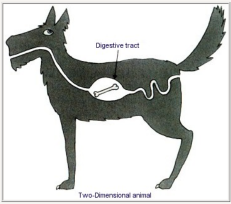
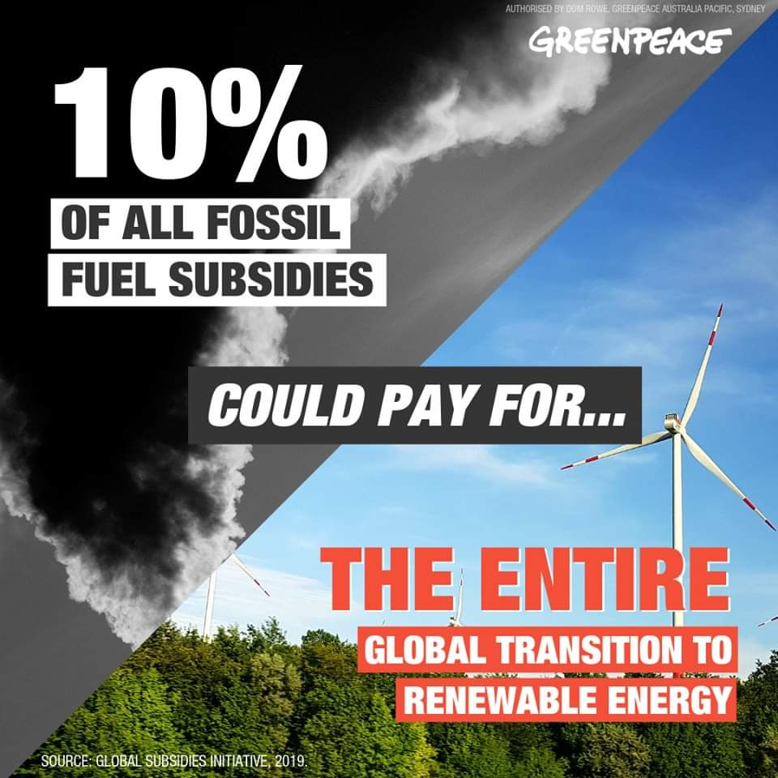

# Week 33

If HK's special status (with US) is revoked CH is in deep doodoo says
Bass. 

A massacre would be terrible.

---

Snazzy

---

It sounds like this could be a major voting block, no?

"An estimated 20 million Americans live in mobile homes"

---

Get ready being Blair style poodle. Chlorine chicken, four eyed fish,
all coming your way boy!

Partnering with US is not a bad thing; but in such an alternative-less
way UK has to do it.. not good.

"@OleRyborg

UK must accept US food standards in trade deal, says US farm chief. 
US producers use chlorine wash on chickens and use hormone in beef. Both illegal in the EU."

[Link](https://twitter.com/OleRyborg/status/1161902140446715905)

---

Fuckin Fukishima, this guy.. He actually reflected a common
misconception of 90s, even in science. Statecraft is done. Physics was
done. "We just need to figure out this little thing here and there.."
It happens all the time, Kelvin said the same thing during
1800s. "Physics is done.. except a few dark clouds in the
horizon". Those clouds turned out the starting of major changes (now
there is dark energy, matter -just a little fudge here and there, no
biggie-).

---

.. and when they look at the encylopedia item "who contributed to the
cratering of Iraq" they will see your name next to it.

How's that End of History coming along?

"@FukuyamaFrancis

When future historians ask 'who lost Hong Kong' they will be able to
point to DJT."

---

"@jlounsbury59

Don't forget that the year started with the 10-year around 3.2% with
many expecting it to go to 3.5% (or even 4%) in 2019."

---

"@paulg

I was talking to the CEO of a startup whose customers are local governments.

Me: What features do people in local government want most? What excites them?

CEO: Going home at 5"

---

Pump and dump rant

[Link](https://mobile.twitter.com/profgalloway/status/1161744881137725443)

---

<blockquote class="twitter-tweet">
Posit: Google structured the company so that everyone would feel like they were still at university - and then they got student politics.
&mdash; Benedict Evans (@benedictevans) <a href="https://twitter.com/benedictevans/status/1161695236843700225?ref_src=twsrc%5Etfw">August 14, 2019</a></blockquote> 

---

<blockquote class="twitter-tweet">
roast me daddy
&mdash; Internet of Shit (@internetofshit) <a href="https://twitter.com/internetofshit/status/1161743261746257921?ref_src=twsrc%5Etfw">August 14, 2019</a></blockquote> 

---

Doing stuff. Handling things... haaandling everything. Crass.

---

<blockquote class="twitter-tweet">
I can’t wait to complain about my brick house being bricked in the future, POETRY
&mdash; Internet of Shit (@internetofshit) <a href="https://twitter.com/internetofshit/status/1161729806167355393?ref_src=twsrc%5Etfw">August 14, 2019</a></blockquote> 

---

<blockquote class="twitter-tweet">
The future of ovens: burning your house down because it turned itself back on <a href="https://t.co/hxSYXp2eQ4">https://t.co/hxSYXp2eQ4</a>
&mdash; Internet of Shit (@internetofshit) <a href="https://twitter.com/internetofshit/status/1161738080719712256?ref_src=twsrc%5Etfw">August 14, 2019</a></blockquote> 

---

Dude transcribed 'bella donna' as 'black Madonna" in this song. Totally wrong.

[Video](https://www.youtube.com/watch?v=BRwOaJYOtlU)

♫♬ Carolina, bella donna, she get it from her mamma

♫♬ Sex designer, lights your mind up

♫♫ Sip it, then roll the dime up

♫♬ Gentlemen crooks, snazzy, hip, and flashy with looks

♫♬ Crooked City's walkin witty, you ain't makin' like us

---

Good.. 

I also got a vibe from DJT he is gently pushing UK towards the EU?

"Pelosi warns U.S.-UK trade pact won't pass Congress if Good Friday
deal is undermined"

---

Boy that 10 yr yield went down like a rock

---

Old McGyver says he doesn't like the new one. "They kill people left
and right" saz he. Another militarized show. 

---

It was shown empirically representative democracies are
[better](https://muratk3n.github.io/thirdwave/en/2016/11/democracy.html)
than non-democracy regimes.

Issues, ppl (mostly) don't know shit about, but choosing ppl they are
not bad at, and also, what truly matters is leaders' fear of losing an
election which pushes them in a benev direction.

BdM found democracies not only are richer, but also fight better;
because for fear of losing an election, democracies must mobilize
fast, in bigger numbers, which increases their chances of
victory. Non-democracy regimes could hide their losses, the real
situation, perhaps allowing a wrong direction to persist longer than
necessary. 

Democ can work anywhere - in China, Russia.. Middle East needs it
badly, esp Jordan (there are a lot grumblings from this country -so
says the [grapevine](https://www.youtube.com/watch?v=jPnZZTVp_2A)-)

---

Training quadcopter with ReinfL. So sad. 

[Link](https://www.linkedin.com/pulse/using-openai-gym-ros-ricardo-tellez)

---

"By 2050 \#hydrogen could meet 18% of the world’s final energy
demands, provide 30 million jobs around the world, prevent 6 Gt of CO2
\#emissions emissions, and create a $2.5 trillion market for hydrogen
and \#fuelcell cell equipment"

[Link](https://twitter.com/HexagonASA/status/1161602050200952832)

---

<blockquote class="twitter-tweet">
I’m thinking <a href="https://twitter.com/ChrisCuomo?ref_src=twsrc%5Etfw">@ChrisCuomo</a> might throw some hands at a Fredo spouting Muthafukkah that couldn’t bust a grape in a food fight... if he wasn’t hiding behind a Secret Service detail!
&mdash; Samuel L. Jackson (@SamuelLJackson) <a href="https://twitter.com/SamuelLJackson/status/1161360512283602944?ref_src=twsrc%5Etfw">August 13, 2019</a></blockquote> 

---

Aahh Riksbank.. Some bad smells coming outa there.. BTW the economics
Nobel prize is called Riksbank prize in economic sciences in honour of
Alfred Nobel. It was abbreviated to Nobel Prize later. Alfred Nobel
was a chemist, engineer, inventor, who liked blowing shit up (he
invented the dynamite). There is no way he would have authorized
giving money to economics which wasn't even considered a proper
science then. Some would argue of course, it still isn't one now.

"@adam_tooze

How Sweden’s Riksbank pionneered negative rates and why its governor
now needs bodyguards."

[Link](https://twitter.com/adam_tooze/status/1161593537672241157)

---

Clarkson doesn't dislike electric cars monkey boy. He dislikes __battery__ electric cars.

---

Corporate media.. the root of many ills

[Link](https://youtu.be/tECJawoMcRY?t=727)

---

This plane can fly 500 miles on guess what.

[Link](https://mobile.twitter.com/FastCompany/status/1161500863002742787)

[The Verge](https://www.theverge.com/2019/8/14/20804257/zeroavia-hydrogen-airplane-electric-flight)

---

"@dataandpolitics

Two data science things I am genuinely surprised about:

1) How few data scientists know the difference between inference and prediction

2) The general low knowledge about research design

3) Little knowledge about causality

4) Very low knowledge about statistics"

---

"Despite being heavily involved in developing electric vehicle
technology, automotive giant Continental has suggested that hydrogen
will be the long-term solution to replace internal combustion engines"

[Link](https://m.independent.ie/life/motoring/car-news/forget-going-battery-electric-says-continental-the-real-future-is-in-the-hydrogen-revolution-38401463.html?__twitter_impression=true)

---

<blockquote class="twitter-tweet">
CPU and sensor speeds grow faster than wireless network speeds.  At the consumer, it’s cheaper to add a CPU than pay for 100x the bandwidth.
&mdash; John Hayes (@ghosthayes) <a href="https://twitter.com/ghosthayes/status/1161492982174015488?ref_src=twsrc%5Etfw">August 14, 2019</a></blockquote> 

---

If particle psy has been frozen since 1973, I dont have to seek math
books later than that either (phy = math). A book even from 1973 would
be enough. Bryson & Ho is 1975; the math is just fine. They had
everything.

---

Restaurants close for lunch in France? :-o

---

---

Rough

[Link](https://mobile.twitter.com/Birdyword/status/1161299001414578177)

\#hongkong

---

Some can ignore the parts of that explanation. It should be up to
them. But as a rule every disussion of divergence needs to explain
where it comes from.

Otherwise you'll end up with another generation of scientists running
around circles, talking out of their ass, drowning in shallow water.

"But, not everyone needs an explanation where a thing come from to be
able to use it"

---

The intuitive description of what xyz does is embedded in where it
comes from. Derive it, it'll become clear. Extra intuition doesn't
hurt, but the origin matters most. 

"But I intuitively describe what xyz does"

---

Noone is immune to "teach xyz as a tool to do abc" sickness in ed;
Don't just drop the concept in front of students saying it does
"blah". Say divergence. Derive it. See *Mathematical Tools for Physics*
pg 290, Nearing.

---

Sure - but this was self-reliance in a world of game, wide open nature
(all is public space, no ownership of land); This was the 0th Wave,
the thing before everything else. The longest we've been anything,
we've been that.

Hunting could be hard, but also can be done in spurts. This is how we
are wired, for sprints, not marathons (marathon is for sheep lovers,
peasants, back-breaking routine work).

1st, 2nd waves took that land, divided up the society into little
chunks, food production, material production, schools, prisons, now
you created a completely different environment where you actually
cannot be self-reliant. Some ppl will fall through the cracks no
matter what you do, and they will not be happy.

You could say "evolution would naturally select behaviours optimal for
each age", I am usually a sucker for that kind of argument, but each
of these eras are shorter and stupider than the last. Agro era 12K
years, industrial era 300. Then there'll be space soon (the 4th Wave),
so... this is bunch of non-sense. Let's rearrange stuff for
non-scarcity, mobility, availability of wide public services and land,
this will handle most problems.

"But if left is based on pre-agro forager, that's all abt
self-reliance!"

---

The right keeps framing inequality issues around "I worked hard and
earned that money", looking at only at one slice of the system, the
"earning" (the culture code for money in US is PROOF). Before u ended
up with that money, there were crediting policy who got you, or your
employer that credit, ed level (now heavily tied to parent's ed
status) who preferred one person over another for that job, taxes that
took less than it should have so u ended up with that dough. If all
parts of the system were hunky-dory, then you could allow that last
slice of the system, "earning the money" be as it is. But it isn't.

It's like the healthcare debate; if drug makers, insurers were
benevolent, u'd spend less. But they are not benevolent. So gov needs
to bash their skull to get to Walhalla. U use the unideal to fix the
unequal to reach optimal.

Another thing they miss is you are not helping "others", you are
helping yourself. Do we want sick people all over the place getting
others sick, bringing the morale down? Or showing up with pitchforks
at your house? 

---

Yeah they totally made that shit up

<blockquote class="twitter-tweet">
There was no original barter economy, which was then surpassed by the use of money fostering <a href="https://twitter.com/hashtag/capitalism?src=hash&amp;ref_src=twsrc%5Etfw">#capitalism</a> -- that’s a myth started by <a href="https://twitter.com/hashtag/AdamSmith?src=hash&amp;ref_src=twsrc%5Etfw">#AdamSmith</a> and spread by mainstream <a href="https://twitter.com/hashtag/economics?src=hash&amp;ref_src=twsrc%5Etfw">#economics</a> <a href="https://twitter.com/Dfruccio?ref_src=twsrc%5Etfw">@DFRuccio</a> <a href="https://t.co/D5HIn05erP">https://t.co/D5HIn05erP</a>
&mdash; Economic Sociology &amp; Political Economy (@EconSociology) <a href="https://twitter.com/EconSociology/status/1156352318453035008?ref_src=twsrc%5Etfw">July 30, 2019</a></blockquote> 

---

Wasn't this why Obama got slapped down by Kissinger, with "[parap]
contemplating complexity is not the same thing as solving it".

This must be a key tenet of centrism. You "contemplate" stuff, then
not do anything.

---

Multi-millionaire, multi-billionaires keep blessing the rest with
their "inequality contemplation". On the solutions, they are like
"uhhh, education". Please save your empty thinkification to yourself.

---

I saw TSLAQ vision tech lead explain their transitioning into NN
once. "Slowly, we make this part NN, then this part NN, eventually all
be NN". So it's like mowing your lawn is it? "I do this piece, then
this piece, then it is all done"? The tech in your hand is not as good
as even a lawnmower. It is shoddy, half-cooked, in-progress
tech. Putting people's lives at risk with it is delusional at best,
criminal at worst.

No wonder Zach Lipton says "there's noone there who knows what they are
doing"

---

Vision isn't "solved". Throwing monkey ML, "AI" at the solution won't
work, as now you become training data's bitch. R-CNN, YOLO are
fantastic innovations; but they are only part of the picture.

--- 

Vision, "AI"

[Link](https://mobile.twitter.com/chr1sa/status/1161038121888174080)

---

<blockquote class="twitter-tweet">
I take it back, the internet of things is good <a href="https://t.co/iaVPuoJhFS">https://t.co/iaVPuoJhFS</a>
&mdash; devon maloney (@dynamofire) <a href="https://twitter.com/dynamofire/status/1161082761605632000?ref_src=twsrc%5Etfw">August 13, 2019</a></blockquote> 

---

Glad to be using Python for everything. I wrote a small piece of elisp
the other day and realized I hadn't done that for like 10 yrs.

[Link](https://www.techrepublic.com/article/python-is-eating-the-world-how-one-developers-side-project-became-the-hottest-programming-language-on-the-planet/)

---

It has to be tough being POTUS. Stuff going haywire all the
time. "Allies not cooperating, I have flashpoints everywhere, I got
Macron crawling up my ass, Russia gone nutz, SK-Japan probs"... You
could complain all day long if you wanted to.

---

I bet FN and Reps are worked up abt *The Hunt* not bcz deplorables are
hunted by the "elite". It's bcz of the comeuppance part when
deplorables shoot back and kill the 1 percenters.

---

11 day jam! 

<blockquote class="twitter-tweet">
The worst traffic jam in history? Was it the blockage on China’s Naitonal Highway 110 in Aug/Sep 2010 when coal trucks overloaded the highway system -&gt; 120 km, 11 day jam with cars moving 1 km per day and sleeping drivers paralyzing movement. <a href="https://t.co/qpSwhHyy5y">https://t.co/qpSwhHyy5y</a> <a href="https://t.co/T6XS1hV0dW">pic.twitter.com/T6XS1hV0dW</a>
&mdash; Adam Tooze (@adam_tooze) <a href="https://twitter.com/adam_tooze/status/1160989327549063168?ref_src=twsrc%5Etfw">August 12, 2019</a></blockquote> 

---

"Pilbara project grows to 15GW"

[Link](https://reneweconomy.com.au/pilbara-green-hydrogen-project-grows-to-15gw-wind-and-solar-97972/)

---

Antenna in plural sounds funny. Antenae. An-teh-nee. 

---

"@GeraldKutney

Busy weekend with climate deniers. Their tweets show desperation: sources becoming even more trashier, and comments are becoming even more nasty or nonsensical. "

---

Orville; as good as TNG. I get the exact same kick out of it as I did
with TNG. The cultural stuff is brilliant.

---

Dirac married *special* relativity with Cop QM, not general relativity.

---
Standard Model (the final state of phy) is a huge ship, it could be
entertaining in there... You could remain in it and walk around in its
corridors for decades. But that is not what drives some; they want
more clarification, elegance in the model. 

Plus there is that nagging issue of dark matter, dark energy, and
bazillion constants in the SM. U need to derive them, fool. 

---

Sometimes I wonder if ppl are aware of what is going on even in their
own fields.

---

Apparently the gauge route, leading up to SU(5) did not pan out
either. No unification.

\#thetroublewithphysics \#smolin

---

NRA is powerful in the way AIPAC is powerful. I am sure there are some
pols how got their ass kicked by AIPAC money, or their campaign
tactics. You ask them, "well, they are so good, they kicked my
ass". But what gives AIPAC its power is the establishment bias towards
Israel, the grand politicking which supports this country. The body
politick decided on that first, the rest is just a reflection. If the
grand policy changes then all of a sudden AIPAC won't be so powerful.

S/he who wants to cause change, needs to hit at the root, not at the tip.

---

Fine, but I am warning you; I know Italian karate.

How is Italian karate? It's simple actually; there is only one move.

[Vid](https://youtu.be/n-ENUWAxzc0)

"I am mad at you"

--

"What I believe is failing is not so much a particular theory but a
style of doing science that was well suited to the problems we faced
in the middle part of the twentieth century but is ill suited to the
kinds of fundamental problems we face now. The standard model of
particle physics was the triumph of a particular way of doing science
that came to dominate physics in the 1940s. This style is pragmatic
and hard-nosed and favors virtuosity in calculating over reflection on
hard conceptual problems. This is profoundly different from the way
that Albert Einstein, Niels Bohr, Werner Heisenberg, Erwin
Schrodinger, and the other early-twentieth-century evolutionaries did
science. Their work arose from deep thought on the most basic
questions surrounding space, time, and matter, and they saw what they
did as part of a broader philosophical tradition, in which they were
at home.

In the approach to particle physics developed and taught by Richard
Feynman, Freeman Dyson, and others, reflection on foundational
problems had no place in research. This freed them from the debates
over the meaning of quantum physics that their elders were embroiled
in and led to thirty years of dramatic progress. This is as it should
be: Different styles of research are needed to solve different kinds
of problems. Working out the applications of established frameworks
requires very different kinds of thinking — and thinkers — than
inventing those frameworks in the first place.

However, as I will argue in detail in the pages to come, the lesson of
the last thirty years is that the problems we're up against today
cannot be solved by this pragmatic way of doing science".

-- Smolin

---

Are you effin __kidding__ me? This is Brian Greene, an ST
motherfucker.

"Even today, more than three decades after its initial articulation,
most string practitioners believe we still don't have a comprehensive
answer to the rudimentary question, What is string theory?"

---

If a lot of smart ppl tried and failed, that's your sign to move
on. Three-body problem was like that centuries ago. Newton tried to
solve it, Euler tried solve it, Poincare tried solve it - all
failed. This problem gave Newton a headache. Can u imagine how hard a
problem has to be to give Isaac F---ing Newton a headache? That was
the 3BP.

It turned out 3BP had no solution ("analytic" solution that is, with
one clean formula).

Like I said, let's take the hint.

---

Well it's been 30 yrs for SUSY. Where's the evidence?

"But it also took ~25yrs for Maxwell's E&M theories to be tested".

---

Bell's Theorem says particles can talk faster than light. But in the
ensemble model space has no meaning, so instantenous com. is possible;
it's just another hop in the graph. It is because in the emergent
space some thing become "far" that we are shocked at the comm at a
"long distance".

There is no spooky action "at a distance", cuz there is no distance
(behind the curtain).

---

We could definitely use more wind. Cools weather, neutralizes f--ing birds.

---

If Dems occupied the left, reducing pressure on monkey issues to be
divisive like guns and abortion, u would see a lot of centrists going
from Dems to Reps (no big deal, their numbers are limited) and
discussions inside Dems would be much higher quality. Left ppl are
thinking now 'why do I constantly have to listen to some jackass who
wants me to be "reasonable" and this and that'. Just to make space for
this asshole where he doesnt belong, that's why.

I am telling you, this is it - the silver bullet.

---

Abortion doesn't have anything to do with religion per se. There are
Christian, Islam branches, major sects that allow it, some going back
and forth on the issue at various times. The question is why is the
practice strictly forbidden in Catholicism? 

Because the Roman army needs soldiers, that's why. You need the
numbers that's how you further the interests of the mafia. Organized
religion in service of organized crime.

---

It's also very likely Dem establishment carefully made sure it was
non-white progressives that joined its ranks recently, not whites, bcz
they wanted the opposition to Trump be in racial terms, that to take
center stage along with immigration they were hoping (it worked),
instead of economics, and left. The hired dogs in the media smelled
this too, and give them huge media time mostly from that angle. There
are some good ppl among these progs, but sadly they are being used.

This is how it's like to fight entrenched interests. You think you
win, but then u see u didn't. 

---

Boot-Edge-Edge doing some sneaky shite...? Dem centrist plan: flood
the primary with candidates, make sure voting goes to second round
where superdelegates can vote and they will vote for a centrist there.

\#dore

[Vid](https://youtu.be/c6E5zXiZsdE?t=88)

---

Did SUSY theories got stuck bcz they got lost in the elegance of their
equations?

By itself looking for elegance isn't bad. Elegance in math modeling
parlor just means as simple as possible, concise, a certain economy in
equations. The real problem is if your starting point is wrong, u can
get elegance all along the way while modeling and still end up in a
ditch bcz of starting point was wrong, and overall view of things were
deficient. I could elegantly model shadows, with all its weirdnesses,
find countless math tricks to get over the "multiplying shadow
problem", "bent shadow problem" and if someone asks, say "shut up and
compute!".

The real problem is using elegance as the *only* yardstick on judging
a result.

---

Brutal 

[Vid](https://youtu.be/aknbxPj6JGI)

\#theview

---

There are a lot of ways to store energy. Some lift up bunch of water,
so if u let it fall from that height it would give you energy. Some
compress air (decomp gives energy back). All fine methods but I'd
rather have a fuel I can transport around and potentially have an
element that carries energy even in its inert form.

---

\#epstein C'mon, how can u pull DJT into this? I distinctly remember
seeing a vid where DJT talks to a reporter abt Ep and says "he prefers
his women on the *younger* side". Gently telling on the guy.. I'd
sooner suspect Bill C connection, or Ep's own blackmail op backfiring
on him than anything else.

---

"BP pushed for Arctic drilling rights after Trump's election"

---

I am not talking about gold as an investment, lost person. I am
talking about the gold standard, as in, a gold backed currency. The
latter is unworkable. In a narrow sense, for right now, in the little
sandbox they created for you that is the fin system, go buy your gold,
marry it, have children with it - who cares?

---

SUSY model is an extension of the standard model, a hodge podge
concoction that computes well, but cannot unify all forces of the
universe. That's why realists say the rot is deeper, with the Cop QM.

"For much of the last 25 years, a huge question hanging over the field
of fundamental physics has been that of what judgement results from
the LHC would provide about supersymmetry, which underpins the most
popular speculative ideas in the subject. "

[Link](http://www.math.columbia.edu/~woit/wordpress/?p=11138)

---

Haha! Physicist looking for help from "AI" to fix their theories.. Now
you really reached the end of your rope my friend.

“On string theory, etc., I've been wondering about the possibility
that an AI may actually be able to 'learn' a particular model and
calculate its consequences even of this was too hard for any human
mathematician. If it came up with numbers for the physical constants
that agreed (or that disagreed) with the real world, would we then be
happy to accept its verdict on the theory? I think the answer is
probably 'yes' -- but it's not as clear-cut as in the case of (say)
the 4-colour theorem -- in that latter case the program used is
transparent, whereas in the case of AI (even existing cases like Alpha
Go Zero) tor programmer doesn't understand what the computer does.”

[Link](https://blogs.scientificamerican.com/cross-check/the-twilight-of-sciences-high-priests/)

---

"Leaks threaten safety — and success — of America’s top natural gas
exporter. A federal investigation at Cheniere’s flagship facility in
Louisiana raises red flags for a surging industry"

[Link](https://publicintegrity.org/environment/leaks-threaten-safety-and-success-of-americas-top-natural-gas-exporter/?fbclid=IwAR3SwK1MrP4biNAbORV5nv-WDCIuzsOHylSxg6TUivg7SqSds0pzZ5HNhCM)

---

Hawking said 2D life would be impossible, imagine a 2D animal,

The food it ate would go through it dividing it into two.

But could't a 2D "cell" could take another cell inside, temporarily
breaking its outside shell, than close, eating it? Bon apetit? It
could work.

Hawking pushed his share of bull in his time BTW, like String Theory.

---

Nutz! [thumbs up]

"Connecticut has supercharged development of a 20-MW fuel cell
microgrid — part of a $1 billion data center project in New Britain —
with a 10-year, $55.2 million sales and use tax exemption...

EIP Investments intends to build a microgrid spanning 45,000
square-feet on the site of a shuttered Stanley Black & Decker
manufacturing plant in the project’s $100 million first phase of
development. That would make it the largest indoor fuel-cell system in
the world, according to EIP."

[Link](https://microgridknowledge.com/fuel-cell-microgrid-data-center-connecticut/)

---

MMT is a mistake following another mistake. We can have healthy growth
wout all this junk.

<blockquote class="twitter-tweet">
<a href="https://twitter.com/scientificecon?ref_src=twsrc%5Etfw">@scientificecon</a> proves that when NATIONAL CREDIT is guided towards productive use, high, stable and non-inflationary economic growth can be achieved&quot;<a href="https://t.co/IFsgqIJlVl">https://t.co/IFsgqIJlVl</a>
&mdash; Raymond Aitken (@raymondaitken) <a href="https://twitter.com/raymondaitken/status/1159614927679696901?ref_src=twsrc%5Etfw">August 8, 2019</a></blockquote> 

---

"@Vivantive

\#Nuclear energy isn't worth it - we don't have to be creating
radioactive waste for our energy needs; cheaper, safter options are
readily available:"

---

Release of poisonous gas during fire? 

"Arizona commissioner cites 'unacceptable risks' from lithium-ion
batteries for large-scale projects"

[Link](https://www.utilitydive.com/news/arizona-commissioner-cites-unacceptable-risks-from-lithium-ion-batteries/560300/)

---

Underwater farming
 
[Link](https://www.instagram.com/p/B028s-ggYGx/)

---

<blockquote class="twitter-tweet">
[BREAKING NEWS ] They did it! After almost 6000 km from St. Petersburg <a href="https://twitter.com/hashtag/EnergyObserver?src=hash&amp;ref_src=twsrc%5Etfw">#EnergyObserver</a> arrived this morning in <a href="https://twitter.com/hashtag/Longyearbyen?src=hash&amp;ref_src=twsrc%5Etfw">#Longyearbyen</a>, capital of the <a href="https://twitter.com/hashtag/Svalbard?src=hash&amp;ref_src=twsrc%5Etfw">#Svalbard</a>, powered only by <a href="https://twitter.com/hashtag/ENR?src=hash&amp;ref_src=twsrc%5Etfw">#ENR</a> and hydrogen. A world first! <a href="https://t.co/131fIymU8j">https://t.co/131fIymU8j</a>
&mdash; ENERGY OBSERVER (@energy_observer) <a href="https://twitter.com/energy_observer/status/1160124969835216898?ref_src=twsrc%5Etfw">August 10, 2019</a></blockquote> 

---

---

318 kg. Nice.

"NEWS FLASH: Our #Anaheim, Calif. hydrogen station set a new record
this week!"

---

Why is solar energy / panels more efficient in space? Sunlight goes to
panels direct, no atmosphere to go through, plus 24hr exposure to the
sun. Claim is solar in space is 5 times more efficient. Increase panel
space, it'd be massive energy generation.

But then again, some say the sunshine we get is already enough:

[Link](https://www.canberratimes.com.au/story/6317858/nature-holds-key-to-limitless-renewable-fuel-supplies-anu-scientists/)

---

"[F]ully half of all the fossil fuels ever burned throughout all of
history have been burned since 1990.

Which means that if you are 29 years old, you’ve been alive when half
of all the fossil fuels ever burned throughout all of human history
have been burned. Half! In just 29 years!"

---

Finally [something](https://twitter.com/zei_nabq/status/1159777132924559361) cogent from Varoufuckis

---

Hariri book has two parts; one is about foragers, farmers, good
stuff. Then he talks about "stories" but nationalism and modernity are
not mainstays of what is, and will be, only fleeting constructs like a
the build-up of a fart. Eventually u fart and it will go away.

Stories are mostly abt culture codes and second wave. Any thinker
worth his salt needs to go beyond them.

Also for better anthrolopoly I would read Ian Morris. Hariri really is
poor man's Ian Morris.

---

Schuuumaaah is probably anti-China bcz "China likes Iran, Iran is bad
for Israel, so bad, bad China".

"The scumbag" is on the same wavelength probably for the same reason.

They probably also want an in into the Trump-land, somehow.

---

I wouldnt go googly-eyed on QED. Also incomplete.

[Link](http://physicsdetective.com/the-hole-in-the-heart-of-quantum-electrodynamics/)

---

Why do SJW types want to modify existing franchises? Cant they create
their own characters from scratch? As the so-called "bro-heroes" were
created once? 

---

Haha.. SJW Dr. Who in trouble? Rumor is director created a female
Dalek (major villain) in a weird shape, bad for merch sales.

[Vid](https://youtu.be/ySVxs7bRjh8?t=111)

---

What a shit show

[Vid](https://youtu.be/afN9RVKhogY?t=226)

\#starwars

So all u need to be is SJW, in a world of beta-cuck and the force is
automagically with you?

There are two routes to female empowerment: one is through being
*hanımağa*, the female royal, she-boss. The other is through
adaptable, struggling, nomadic, __human__ female with grit, the core
of what we are.

Meaning; replacing the pope with a female pope is not advancement. U
need to *degrade and ultimately destroy* the Catholic Church, and all
the associated cultures. The Vatican, Caliphatism, kleptomania,
beastiality - all needs to go.

---

But he gave great quotes... 

"As president, Kennedy swiftly reversed Eisenhower’s course. McNamara
rehabilitated NSC-68 and embarked on a massive buildup of conventional
land, sea, and air forces in order to “prevent the steady erosion of
the Free World through limited wars,” as Kennedy put it in a 1961
message to Congress. The promise of “limited” wars would soon be
fulfilled by the two of the biggest disasters in the history of
American foreign policy: the Bay of Pigs invasion and the Vietnam War"

---

<blockquote class="twitter-tweet">
New research shows 43% of UK adults don&#39;t pay income tax.   Do those who pay it deserve more say in how tax- funded public services are run?   That&#39;s what <a href="https://twitter.com/Emmabarnett?ref_src=twsrc%5Etfw">@EmmaBarnett</a> is asking <a href="https://t.co/CTLzpXv7Pa">pic.twitter.com/CTLzpXv7Pa</a>
&mdash; BBC Radio 5 Live (@bbc5live) <a href="https://twitter.com/bbc5live/status/1159030771530657792?ref_src=twsrc%5Etfw">August 7, 2019</a></blockquote> 

---

All IR issues seem to be at a hightened state. There were China
worries before, same w Iran, NK, oil.. All these issues now have their
volume turned up.

---

Russkies be slippin

---

Score! \o/ \o/ \o/ \o/

"U.S. Senate Passes $1 Billion in Alternative Fuel Infrastructure,
Including \#Hydrogen, EV and Natural Gas"

[Link](https://fuelcellsworks.com/news/u-s-senate-passes-1-billion-in-alternative-fuel-infrastructure-including-hydrogen-ev-and-natural-gas)

---

There is also this

"Israeli Start-Up Develops Biodegradable Plastic"

[Video](https://www.youtube.com/watch?v=kLyAvA5b7C8)

---

Turning plastic into hydrogen? Incredible if true. 

Actually I had a feeling this could be possible; plastic is based on
petroleum. Fossil can be reformed into H2. This process is essentially
a roundabout way of getting H2 out of petroleum [video below].

---

"@adam_tooze

Driven by worries both about global tension and late phase of
business-cycle $102bn flowed into ultra-safe money market funds
globally last week "

---

Inflation is a sign of wage levels; if ppl had money they'd spend, at
certain point you'd see inflation starting to creep up. The fact that
US has persistently low inflation means ppl dont have money. For big
ticket items (house, college) there are forms of structured
debt. Regular consumption is different. How many cars can a
billionaire buy? One? How many could 1000 millionaires buy? One
thousand? Probably? Less concentrated wealth is socially better. 1000
ppl have cars instead of 1.

---

1% here, 1% there. Truth of the matter is US is living in a
persistently low inflation environment. Potential sources of inflation:

1) Exports more than imports 

2) Bank lending (credit creates new money)

3) Wages 

4) Gov printing (spending more than it gets in taxes)

\#1 does not apply to US. \#4, no, bcz of US dom, its debt is snapped
up. \#2 money goes into servicing existing debt, speculation, creating
bubbles there. That leaves \#3, but because of technology and
outsourcing, wages are not growing. Result: no inflation.

US is a creditor's paradise, $ denominated debt does not lose its
value.  Debtors can borrow at low rates, then they get sucked in an
never-ending Ponzi scheme.

---

<blockquote class="twitter-tweet">
A team at the <a href="https://twitter.com/UDelaware?ref_src=twsrc%5Etfw">@UDelaware</a> has demonstrated a direct ammonia fuel cell (DAFC) prototype for transport with a peak power density of 135 mW cm-2 at 80 ˚C (HEM) <a href="https://t.co/vHDrn9Eu5k">https://t.co/vHDrn9Eu5k</a>. <a href="https://t.co/jElUM8ysOV">pic.twitter.com/jElUM8ysOV</a>
— IEA Hydrogen (@IEA_Hydrogen) <a href="https://twitter.com/IEA_Hydrogen/status/1159573770111213568?ref_src=twsrc%5Etfw">August 8, 2019</a></blockquote> 

---

<blockquote class="twitter-tweet">
<a href="https://twitter.com/hashtag/Japan?src=hash&amp;ref_src=twsrc%5Etfw">#Japan</a> and <a href="https://twitter.com/hashtag/Australia?src=hash&amp;ref_src=twsrc%5Etfw">#Australia</a> join forces to launch $350 million sustainable energy trade project to convert coal to <a href="https://twitter.com/hashtag/hydrogen?src=hash&amp;ref_src=twsrc%5Etfw">#hydrogen</a>, and ship it in liquefied form between the two nations <a href="https://t.co/R7cdqmX1cu">https://t.co/R7cdqmX1cu</a> 🇦🇺🇯🇵🛳️ <a href="https://t.co/C1dFe9AsLV">pic.twitter.com/C1dFe9AsLV</a>
&mdash; CHFCA (@PoweringNow) <a href="https://twitter.com/PoweringNow/status/1159219779435036672?ref_src=twsrc%5Etfw">August 7, 2019</a></blockquote> 

---

Farming dangerous 4 the planet. 

I'd have no problem eating some synthetic goop as main diet as long as
it is nutritious enough.

[Vid](https://www.youtube.com/watch?v=c2PpqvxqayY)

---

