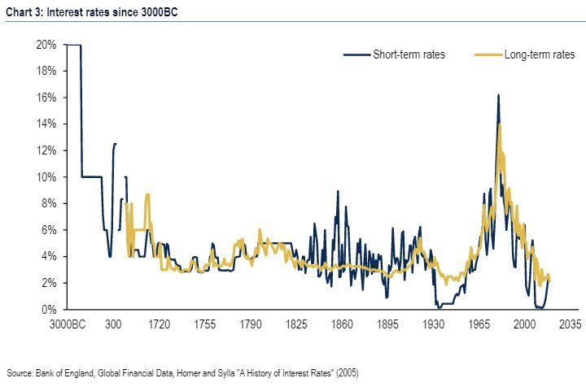

# Week 37

<blockquote class="twitter-tweet">
“Timber!” <a href="https://t.co/D9bzs5tplU">https://t.co/D9bzs5tplU</a>
&mdash; Renegade Inc. (@Renegade_Inc) <a href="https://twitter.com/Renegade_Inc/status/1171990287444586498?ref_src=twsrc%5Etfw">September 12, 2019</a></blockquote> 

---

“It’s estimated that the Deepwater Horizon oil spill resulted in the
loss of more than 10 million user-days of beach fishing and boating
activities... If you Drill, you spill.”

[Link](https://twitter.com/WarWithTheDinos/status/1171927010043674625)

---

<blockquote class="twitter-tweet">
<a href="https://twitter.com/hashtag/BREAKING?src=hash&amp;ref_src=twsrc%5Etfw">#BREAKING</a>:  10,000 Russian bots turn out to see Bernie Sanders speak in Denver: <a href="https://t.co/kPsTEQlWXN">https://t.co/kPsTEQlWXN</a>
&mdash; MSDNC (@MSDNCNews) <a href="https://twitter.com/MSDNCNews/status/1171249384534761474?ref_src=twsrc%5Etfw">September 10, 2019</a></blockquote> 

---

"Deep learning excels at learning statistical correlations, but lacks
robust ways of understanding how the meanings of sentences relate to
their parts. Reading isn’t just about statistics, it’s about
synthesizing knowledge.

At TED, in early 2018, the futurist and inventor Ray Kurzweil,
currently a director of engineering at Google, announced his latest
project, 'Google Talk to Books,' which claimed to use natural language
understanding to 'provide an entirely new way to explore books.'
Quartz dutifully hyped it as 'Google’s astounding new search tool
[that] will answer any question by reading thousands of books.'

If such a tool actually existed and worked robustly, it would be
amazing. But so far it doesn’t"

[Wired](https://www.wired.com/story/adaptation-if-computers-are-so-smart-how-come-they-cant-read/)

---

<blockquote class="twitter-tweet">
“What Draghi must deliver”  No bull market without central bank intervention. <a href="https://t.co/PNmr9ffgrV">https://t.co/PNmr9ffgrV</a>
&mdash; Sven Henrich (@NorthmanTrader) <a href="https://twitter.com/NorthmanTrader/status/1171774304452841474?ref_src=twsrc%5Etfw">September 11, 2019</a></blockquote> 

---

Twitter.. What's going on over there? It seems centrists took a big
dump in the place, and their CEO is powerless to do anything,
essentially a figurehead.

"@dancohen3000

Twitter just suspended the accounts of the biggest media outlets in
Cuba and has given no reason. This is the equivalent of silencing CNN,
Fox, WaPo and NPR’s accounts, but Cuba is a target of the empire so
these arbitrary suspensions don’t generate outrage"

---

<blockquote class="twitter-tweet">
Not just the Irish. I have a former colleague who has dual Polish and British nationality and she&#39;ll have more freedoms post Brexit than my angry relative who wants to leave - while simultaneously wishing to retire to a holiday home in Spain
&mdash; Otto English (@Otto_English) <a href="https://twitter.com/Otto_English/status/1171893361588023296?ref_src=twsrc%5Etfw">September 11, 2019</a></blockquote> 

---

@NorthmanTrader

$SPX is less than 1% from all time human history highs and therefore in dire need of central bank intervention.

---

The comments are so good

[Link](https://mobile.twitter.com/Mr_Nohmer/status/1171623630351978498)

---

"@Todd_Spence

Someone [combined](https://twitter.com/Todd_Spence/status/1171598282444853249) John Bolton with Michael Bolton and I can’t unsee it"

---

"@NorthmanTrader

Make the top 1% much greater: Trump Again Mulls Capital Gains Tax Cuts"

---

In an earlier share from \#appelbaum book "by the 1970s the two [Rep]
camps had found a sufficient patch of common ground: social
conservatives who feared for their moral values and economic
conservatives who feared for their property values both felt
profoundly threatened by the expansion of government".

So an artificially created fear of gov is used as a glue between two
faction of Reps. A side-effect could lead to the gun issue, bcz "fear
gov, buy guns", "fear gov, oppose backgr checks, licensing bcz gov's
gonna git you".

Centrist Dems are culprit \#1 for cuckoo Reps, item above could be
\#2, perhaps related to \#1.

---

Herbie Hancock - One Finger Snap \#music

[Link](https://www.youtube.com/watch?v=udCbtl7YEf4)

---

Licensing considered better for the gun issue

[Video](https://youtu.be/ENw2y0ek1Jg?t=209)

---

Haha.. that's good. Is there any chance of reviving that?

"Did you know in 2010, @nntaleb tried to sue the [Sweden CB Riksbank]
because the prize winners theories contributed to the
#2008FinancialCrash?"

[Link](https://twitter.com/themintmag/status/1171810829508993025)

---

THE KING

<blockquote class="twitter-tweet">
Creator of the term, <a href="https://twitter.com/hashtag/QuantitativeEasing?src=hash&amp;ref_src=twsrc%5Etfw">#QuantitativeEasing</a>, <a href="https://twitter.com/scientificecon?ref_src=twsrc%5Etfw">@scientificecon</a> has a long resume of <a href="https://twitter.com/hashtag/neweconomicthinking?src=hash&amp;ref_src=twsrc%5Etfw">#neweconomicthinking</a>. He cowrote the book <a href="https://twitter.com/hashtag/WhereDoesMoneyComeFrom?src=hash&amp;ref_src=twsrc%5Etfw">#WhereDoesMoneyComeFrom</a> &amp; studied interest rates vs. <a href="https://twitter.com/hashtag/GDPGrowth?src=hash&amp;ref_src=twsrc%5Etfw">#GDPGrowth</a>. Should he win the <a href="https://twitter.com/hashtag/NotTheNobel?src=hash&amp;ref_src=twsrc%5Etfw">#NotTheNobel</a>? Tell us why or why not here: <a href="https://t.co/bWV3LeCMmS">https://t.co/bWV3LeCMmS</a>
&mdash; The Mint (@themintmag) <a href="https://twitter.com/themintmag/status/1171760245070319617?ref_src=twsrc%5Etfw">September 11, 2019</a></blockquote> 

---

And you had the queen sign that thing.. This is what I am talking abt
with delegitimation effect. End this charade NOW!

"Brexit in chaos after court rules PM's suspension of parliament was
unlawful"

---

"@VAruffo

... First utility scale #greenhydrogen project in the #MiddleEast just
broke the ground"

[Link](https://mobile.twitter.com/VAruffo/status/1171343556910428160)

---

\#UBI is also about rewarding non-paid social work, like fathers and
mothers. Making every mother a government worker would be hard.

---

"@ra

It is f[@#$] wild that @Twitter's business model involves pushing
racist anti-BDS zionist propaganda and calling it an "ad""

---

"@davidallengreen

The Scottish court decision shows that Johnson and Cummings cannot
even abuse the UK constitution competently. The absence of a witness
statement as to true motive for prorogation was telling. A political
decision, clumsily executed by those not as clever as they think they
are"

---

"Mr. Mosley, it has been reported that you used the n-word in the writers’ room"

"[Mosley] replied, 'I am the N-word in the writers’ room.'"

Too funny. And not. \#SJW

No wonder Star Trek Disco, or STD is ground-zero for lots of this
non-sense.  BTW the actor who "told on" Kevin Spacey is from this
shit-show (literally, a show that is shit). I was watching a Spacey
mov the other day, and wondered, was that accusation made-up?

[Link](https://www.hollywoodreporter.com/live-feed/walter-mosley-quits-star-trek-discovery-using-n-word-writers-room-1237489)

---

Janko Nilovic - Drug Song \#music

Wah-wah 👍

[Link](https://www.youtube.com/watch?v=ScNgrQ1EXr0)

---

"@MerrynSW

[T]he idea that you might Vote Leave but Get Remain doesn't seem so
silly any more does it?"

[Link](https://mobile.twitter.com/MerrynSW/status/1171733119243882496)

---

"China Is Throwing Open Its Market Door. Be Wary: The country is
heading for fiscal and current-account deficits amid an escalating
trade war. No wonder it wants more overseas cash"

[Link](https://www.bloomberg.com/amp/opinion/articles/2019-09-10/china-scrapping-qfii-quotas-hints-at-desperation-for-money?__twitter_impression=true)

---

<blockquote class="twitter-tweet">
<a href="https://twitter.com/hashtag/Hyundai?src=hash&amp;ref_src=twsrc%5Etfw">#Hyundai</a> packed 2️⃣ <a href="https://twitter.com/hashtag/Nexo?src=hash&amp;ref_src=twsrc%5Etfw">#Nexo</a> <a href="https://twitter.com/hashtag/hydrogen?src=hash&amp;ref_src=twsrc%5Etfw">#hydrogen</a> fuel cells into this generator to recharge electric racing cars 🏎 👏🏻 <a href="https://t.co/CtOIR1cN7z">https://t.co/CtOIR1cN7z</a>
&mdash; Dominique Lecocq 🌏 (@Lecocq_dom) <a href="https://twitter.com/Lecocq_dom/status/1171746212724318208?ref_src=twsrc%5Etfw">September 11, 2019</a></blockquote> 

---

Did he just [pull a Trump](https://twitter.com/AmbJohnBolton/status/1171455806069305346) on Trump?

---

Mustache gone

---

West Bank is 5 times as large as Hong Kong, but has 1/3 of HK
population. Earth is large.

---

<blockquote class="twitter-tweet">
This gives me hope... Michael Heseltine... &quot;They had to go fast, and they had to confuse the issue, they can&#39;t go fast and they have failed to confuse the issue&quot;.<a href="https://twitter.com/SkyNews?ref_src=twsrc%5Etfw">@SkyNews</a> <a href="https://twitter.com/adamboultonSKY?ref_src=twsrc%5Etfw">@adamboultonSKY</a> <a href="https://t.co/g0ZWEDb1AQ">pic.twitter.com/g0ZWEDb1AQ</a>
&mdash; Jude #FBPE (@jude5456) <a href="https://twitter.com/jude5456/status/1171358551295614976?ref_src=twsrc%5Etfw">September 10, 2019</a></blockquote> 

---

"Years of expansionary fiscal and monetary policies have left the
world economy overburdened with debt. In the next downturn, much of
that debt will become unserviceable. This should be dealt with now.

For many years, the macroeconomic policies of the major, advanced
countries have been forcing their economies down a dangerous
path. Economic downturns were met with fiscal expansion. Similarly,
monetary policies were eased to induce more private sector borrowing
and more spending. From the perspective of each moment, these policies
seemed eminently sensible. However, in the recoveries that followed,
fiscal and monetary policies were never tightened in an equally
vigorous way.

Looking at the global economy today, there are ample grounds for
concern. Growth has been slowing in most of the major regions, and
profit expectations are declining. Corporate leverage has been rising,
as have worries about the quality of corporate liabilities. In many
markets, equity prices and the prices of high-risk liabilities seem
elevated. In some areas, the price of houses and commercial properties
are at record levels, as indeed are associated debt levels...

[O]ur economies would benefit greatly from more voluntary debt
restructuring by creditors, and the sooner the better. Orderly
solutions are better than disorderly solutions, and half a loaf is
better than no loaf. Moreover, there is a political advantage in
forcing those who have made imprudent loans to pay a price for it. It
would take the sting out of the populist cry that the elite always get
off, while ordinary citizens suffer" -- William White (former CB head
of Canada)

[Link](https://themarket.ch/meinung/william-r-white-are-we-prepared-for-the-next-financial-crisis-ld.213)

---

"In the last three years alone, HSBC has poured £43bn into fossil fuels,"

[Link](https://www.thecanary.co/global/world-analysis/2019/04/12/protesters-disrupt-hsbc-meeting-to-demand-that-the-bank-stops-fuelling-war-and-climate-crisis/)

---

Dialectic considered unsuitable as a systemic approach for science.
[Popper](https://www.vordenker.de/ggphilosophy/popper_what-is-dialectic.pdf)
wrote about it who is famous for defining the modern philosophy of
science.

Sure Marx used dialectic but let's not forget Marx "had issues" in the
realm of hard-sciences. You don't "synthesize" for the new thing, you
smash one theory (falsify), and build another (falsiable) theory in
its place. You might pick up some pieces of the broken model here and
there, but you don't usually combine "the finished theory 1" with
"finished theory 2" and come up with "better finished theory number
3".

---

H2 is already cost-competitive.

"Our analysis shows that current hydrogen production costs range from
US$2.6 to US$12.3 kg−1 and can be significantly reduced through
flexible operation if dynamic tariffs are used. Hydrogen production
costs for the 81 utility rates in 20 states are already less than
US$4.0 kg−1 and competitive with the fuel cost of gasoline
vehicles. Thus, under the right conditions, hydrogen fuel is already
cost competitive in the US energy sector and has several interesting
possible roles to play in future energy and transportation systems"

[Link](https://www.sciencedirect.com/science/article/abs/pii/S2542435119303228?via%3Dihub)

---

"HyperSolar, Inc. (HYSR), the developer of a breakthrough technology to
produce renewable hydrogen using sunlight and water, today announced
that development of its Gen 1 hydrogen generation system has
progressed to the point at which it can move from the lab to
manufacturing engineering before full commercial production of the
hydrogen panels. This will lead the way to the Company’s first
pilot-scale solar-hydrogen farm"

[Link](https://finance.yahoo.com/news/hypersolar-prepares-hydrogen-generation-technology-093000192.html?soc_src=social-sh&soc_trk=tw)

---

"@jasonhickel

Lithium mining for electric cars is already generating an ecological
crisis in the Andes, burning through water tables, draining lakes,
destroying ecosystems"

[Link](https://mobile.twitter.com/jasonhickel/status/1165891200408260610)

---

"@marcfriedrich7

We are back in 1999: cash burn rate. \#wework Remember this is the
last stage of the very late boom cycle. Prepare for the impact"

[Link](https://mobile.twitter.com/marcfriedrich7/status/1171388164142968832)

---

\#DHL \#H2

"Like many others, Deutsche Post DHL Group believes that H2-based fuel
cell vehicles are the best option in the [long-distance] case. That is
why it has ordered its subsidiary StreetScooter to build about 100
Work L vans with a hydrogen power plant by 2020."

[Link](https://www.fleeteurope.com/en/last-mile/germany/features/streetscooter-builds-fuel-cell-vans-dhl-and-innogy)

---

<blockquote class="twitter-tweet">
With the unveiling of the <a href="https://twitter.com/hashtag/BMWi?src=hash&amp;ref_src=twsrc%5Etfw">#BMWi</a> Hydrogen NEXT at the IAA Cars 2019 show, we&#39;re demonstrating our ability to move beyond battery-based electrification to the deployment of hydrogen-powered fuel cell technology. <a href="https://twitter.com/hashtag/BMWi?src=hash&amp;ref_src=twsrc%5Etfw">#BMWi</a> <a href="https://twitter.com/hashtag/HydrogenNEXT?src=hash&amp;ref_src=twsrc%5Etfw">#HydrogenNEXT</a> <a href="https://twitter.com/hashtag/BMWIAA?src=hash&amp;ref_src=twsrc%5Etfw">#BMWIAA</a> <a href="https://t.co/A8YbHNhehH">pic.twitter.com/A8YbHNhehH</a>
&mdash; BMW Group (@BMWGroup) <a href="https://twitter.com/BMWGroup/status/1171322590515945472?ref_src=twsrc%5Etfw">September 10, 2019</a></blockquote> 

---

Interesting: Julius Ceasar dabbled in banking before he became
genocider-in-chief.

---

Dude's last name is Iceman in Kraut. 

---

Eisman (of *The Big Short* fame) on rates.

[Video](https://youtu.be/5Nr8DjP7L44?t=125)

---
	
\#rates

---

This guy is a financier, fine; but are you adding so much more value
than, say, a parent, who works for free?

"New generation wants to earn money without [a job]"

---

Debt Deflation (by Keen, doc has math on government spending too). 

[Link](http://keenomics.s3.amazonaws.com/debtdeflation_media/papers/keen_cce.PDF)

Michael Hudson

[Video](https://youtu.be/mH8FWrbzxEs)

MH mentions Jesus' first sermon being about debt jubilee (writing off
debts). This connects with the theory that monotheist religions are
left.

Time idx 27:56, he says he was tasked with firing Greenspan while at a
bank. Haha.

Hudson crossed paths with some strange characters, he has great
stories.

---

Yes. NN architectures have been around for a long time, we made
computational advances recently and some new structural improvs. The
nature of these advances are almost identical. We made no headway on
the nature of the universe and no headway on the nature of
intelligence, but we can compute some stuff. We COULD have made
advances, that just wasn't apparently in the cards. 

We need to be aware of where we stand, so instead of embracing this
staticity, starting to like the lull we can know when and where we can
start digging.

"Is the application of Cop QM to different fields akin to recent
developments in neural nets?"

---

Hey that Carroll article wasn't half-bad. The points he makes are
verbatim to Smolin's. Thankfully he doesn't go into his own little pet
theory, alternative QM, which is a boondoggle.

"Even Physicists Don’t Understand Quantum Mechanics... Our best
attempts to understand fundamental physics have reached something of
an impasse, stymied by a paucity of surprising new experimental
results. Scientists discovered the Higgs boson in 2012, but that had
been predicted in 1964. Gravitational waves were triumphantly observed
in 2015, but they had been predicted a hundred years before. It’s hard
to make progress when the data just keep confirming the theories we
have, rather than pointing toward new ones"

[Link](https://www.nytimes.com/2019/09/07/opinion/sunday/quantum-physics.html)

---

Interesting.. now picking winners and losers are we? 

Hammer time?

"@scot_work

$TWTR is now muting $TSLAQ accounts"

---

"@amlivemon

An oncoming 2008 style global recession needs a trigger(who knows) to
ruin the global financial system suffering dollar shortages. China
being decoupled from the US & its asymmetric defense against US
actions failing means they will suffer near systemic collapse"

---

"@lisaabramowicz1

Global debt is up nearly 50% since before the financial crisis. This
is weighing on growth and will make it harder to ever have much higher
interest rates"

---

I can't see what use they'd have for them. IMO early humans had a very
practical existence, embedded in nature, with already lots of stimuli
to keep them busy / entertained, with main goal being to stay
alive. But a villager is surrounded by objects of his creation, in
many ways creates his own entertainment (as well as his food) but then
becomes trapped by these creations. Ancestral relationships get weird
(directly tied to land and survival), you worship weird shit because
you are constanly surrounded by objects and being told stories about
them.  This disease still persists today.

But the subconcious is in open rebellion towards the static existence,
a lot of game shows, movies revolve around being in nature, surviving. 

"Why wouldn't the hunter-gatherer become a pagan, worship stuff?"

---

Actually paganism comes *after* hunter-gathering, and smack in the
middle of settled / village life. This is what these f-kers did.. in
their little villages, worship bones, weird objects, and sacrifice
children while they were tending to their "crops". Religions arrived
to save them from their pitiful existence. We can argue the origins of
these religions, but noone can argue they were an advancement compared
to what these sheeplovers practiced beforehand.

Now some encyclopedic info from
[Wikipedia](https://en.wikipedia.org/wiki/Paganism): "Paganism is a
term first used in the fourth century by early Christians for people
in the Roman Empire .. Ritual sacrifice was an integral part of
ancient Graeco-Roman religion and was regarded as an indication of
whether a person was pagan or Christian .. Paganism was originally a
pejorative and derogatory term .. implying its inferiority. Paganism
has broadly connoted the 'religion of the peasantry'"

"People living before settled life must be pagans. Sounds barbaric". 

---

Ow! Ow! Major burn.

"But flying requires an incredible amount of energy, and presently,
batteries are too heavy and too expensive to achieve liftoff. The
technology that allows Tesla to squeeze 300 miles of range out of a
Model 3 or Chevy to get 200 miles out of the Bolt isn’t enough to
power more than a two-seater aircraft with a flight range limited to
only a few miles."

[Link](https://www.theverge.com/2019/8/14/20804257/zeroavia-hydrogen-airplane-electric-flight)

---

"@trevornoren

Debt owed by governments, businesses and households around the globe
is up nearly 50% since before the financial crisis to $246.6 trillion
at the beginning of March"

---

In a way yes. He would have been a certifier in [my
system](https://muratk3n.github.io/thirdwave/en/2018/09/public-education.html),
volunteering time at nearby school for kids learning physics from
frickin FEYNMAN (videos). 

I am sure he is a good enough teacher and passionate abt it, but we
can't scale his passion. Systemic vs. one-shot, "heroic" solution -
systemic wins everytime.

"My Lyft driver was the kindest and smartest man who was a former
Boeing aerospace engineer who decided to become a high school physics
teacher. He drives at night so he has enough money to get by and teach
our kids physics. We have it backwards"

[Link](https://mobile.twitter.com/villi/status/1170197802007158784)

---

"@binalkp91

Me tuning hyperparameters"

[Link](https://mobile.twitter.com/binalkp91/status/1170466028544880640)

---

[True](https://muratk3n.github.io/thirdwave/en/2018/10/the-case-against-patents.html). 

"@benedictevans

Reminder: IBM claims to have received more patents than any other US
company every year for the last 26 years, and yet I don’t think anyone
believes IBM is really an innovation leader within tech"

---

Yes back in the day for a while, Biden was known was for his anti-Iraq
War stance. But it [turns out](https://youtu.be/yTXA9vck7sg?t=36) his
ducks weren't exactly in order on the issue. He dropped the ball when
it mattered most.

---

Adafruit 9-DOF Absolute Orientation

Yes turning accel data into abs orientation is hard.

[Link](https://www.adafruit.com/product/2472)

Python on a little board. Has acc, grav, magneto, even IR comm. 

[Link](https://www.adafruit.com/product/3333)

\#curcuit \#electronics

---

Naah I think they got it all right son.

"At the recent climate town hall for the Democratic presidential
candidates, both Elizabeth Warren and Bernie Sanders displayed an
excellent command of the facts, and better still a serious
appreciation of the extreme urgency of the subject — particularly in
contrast to their rival Joe Biden, who was rambling and unclear (when
he wasn't literally bleeding from the eyes). Either Sanders or Warren
would be head and shoulders above any previous president on climate,
Barack Obama very much included.

But both have committed a serious policy error. They both disavowed
the use of nuclear power, and worse, said existing nuclear power
plants should be gradually dismantled"

[Link](https://theweek.com/articles-amp/862988/what-bernie-sanders-elizabeth-warren-wrong-about-nuclear-power?__twitter_impression=true)

---

<blockquote class="twitter-tweet">
&quot;Infrastructure will not be a problem&quot;<a href="https://t.co/3Z74iemwFx">https://t.co/3Z74iemwFx</a>
&mdash; Carl Koinberg Henrikson (@CarlKoinberg) <a href="https://twitter.com/CarlKoinberg/status/1170754118488662016?ref_src=twsrc%5Etfw">September 8, 2019</a></blockquote> 

---

"Warm ocean temperatures are one of the key factors that strengthen
hurricane development when overall conditions are conducive for their
formation and growth.

Hurricanes require high humidity, relatively constant winds at
different altitudes, and can occur when surface ocean temperatures
exceed about 79°F (26°C). The rising of warm, moist air from the ocean
helps to power the storm.

Two other factors may also be contributing to the rising intensities
of hurricanes. First, warm air holds more water vapor than cold
air—and the rising air temperatures since the 1970s have caused the
atmospheric water vapor content to rise as well. This increased
moisture provides additional fuel for hurricanes".

[Link](https://www.ucsusa.org/global-warming/science-and-impacts/impacts/hurricanes-and-climate-change.html)

---

"Don't worry about people stealing an idea. If it's original, you will
have to ram it down their throats" -- Aiken

---

Khan on TV. The key point is "everyone learning at their own
pace". Which means teachers presenting to the whole class idea is now
defunct. The recorded lecture content presents the lecture, not the
teacher.

I'd say at higher grades, do away with teachers completely. Student
takes the self-guided course, only at the end (whenever that is,
completely up to the student) student asks to be graded on pass/fail
[basis](https://muratk3n.github.io/thirdwave/en/2011/02/grading.html). Then
a certifier can be involved (who knows the same content
herself). Simple. Everyone wins, less "teacher" time required, and every
student gets quality. School in poor neighborhood or rich neighborhood
all get the same content.

[Link](https://www.youtube.com/watch?v=WJ_DXqPPAKg)

---

Unemployment (reverse of labor force p.) is at about 37%, never went
back to the lows it was at in 2001.

Wage acceleration present, yes (since 2011). But then where is
inflation? My guess is ppl, comps are paying down debt. Weak PMI
confirms this. People are up to their necks in debt.

[Link](../../../2021/01/stats.html#unemp)

---

I missed all that hoopla on hurricane path, sharpie whatnot. I can
completely shut it all off, no problem.

---

That's Abaco Bahamas, after Dorian.

<blockquote class="twitter-tweet">
What’s happening to Abaco is one of the most terrifying things I’ve ever seen. The only thing more terrifying, is that there will be more Abacos with climate change.
&mdash; IM🍑HIM (@ziyatong) <a href="https://twitter.com/ziyatong/status/1170708602711105541?ref_src=twsrc%5Etfw">September 8, 2019</a></blockquote> 

---

"@tictoc

Amazon wants to launch 3,236 communications satellites in a bid to
offer internet service from low orbits"

---

"In other news, the UK government and its various security services are
trying to draw as little attention as possible to the fact that the
guy who carried out the Manchester Arena Bombing was one of the mercs
the Cameron government sent to murder Gaddafi"

[Link](https://mobile.twitter.com/flying_rodent/status/1170313508413739008)

---

"Disclosures show Exxon Mobil is funding a centrist Democratic think tank"

[Link](https://mobile.twitter.com/theintercept/status/1170662809522384896)

---

This is nice but worthless in terms of AGI. Imitation learning. 

Tech is still enough to displace workers, just not enough for other
avenues.

Which should say something about the kind of work most are engaged in.

"This paper reports unprecedented success on the Grade 8 New York
Regents Science Exam, where for the first time a system scores more
than 90% on the exam's non-diagram, multiple choice (NDMC) questions"

[Link](https://arxiv.org/abs/1909.01958)

---

"A description of Brexiteer Jacob Rees-Mogg by Sir Nicholas Soames
[Churchill's grandson] MP: An “absolute fraud” who is “a living
example of what a moderately cut double-breasted suit and a decent tie
can do with an ultra-posh voice and a bit of ginger stuck up his
arse”"

[Link](https://mobile.twitter.com/premnsikka/status/1170643962912288769)

---

Debt Deflation

[Link](https://youtu.be/3S6dQn6k_UA?t=155)

---

"British politics today is what results from the collision of an
unstoppable force, an immovable object and a clown car.

The unstoppable force is the dominant faction of Britain’s
Conservative Party, which insists on not just an exit from the
European Union, but the most catastrophic exit possible. It’s a plan
for national self-defenestration. The immovable object is reality –
the reality that a no-deal Brexit will play havoc with the economy and
hurt real people; the reality that a majority of Parliament and the
people will not back it; the reality that the Brexit-at-any-cost crowd
can’t press the detonator without majority approval.

And the clown car is Mr. Johnson"

[Link](https://www.theglobeandmail.com/amp/opinion/editorials/article-how-bad-is-boris-johnson-we-cant-even-find-the-words/?__twitter_impression=true)

---

<blockquote class="twitter-tweet">
Poverty is, in my view, a death sentence. The poorest older Americans die at twice the rate as the richest.   We must end our country’s obscene inequality and ensure basic economic security for all—or we will condemn an entire generation to early death. <a href="https://t.co/h6D1lzC8ES">https://t.co/h6D1lzC8ES</a>
&mdash; Bernie Sanders (@SenSanders) <a href="https://twitter.com/SenSanders/status/1171046736099446784?ref_src=twsrc%5Etfw">September 9, 2019</a></blockquote> 

---

"@paulmcleary

43 confirmed dead, 70,000 homeless from Dorian"

---

Comfort!

[Link](https://mobile.twitter.com/kantahara/status/1170334503392464896)

---

"The global investment community needs to stop asking central banks to
address issues for which they are neither suited professionally or
politically. The Dudley rant illustrates the collective madness."

[Link](https://mobile.twitter.com/Hedgeye/status/1169622143983869952)

---

\#tslaq \#batteries

[Link](https://mobile.twitter.com/zomgapocalypse/status/1170087789733568512)

---

There might be some truth to streotypical millenial's wanting to
"magically learn stuff, really fast". Things should not be this hard
to teach. We are all failing on ed.

---

First of all, in its current form, it can't.

Second, discovering known physics from data (usually created from
simulations made possible thanks to the known physics of that data) is
not interesting. Physics is not about fitting a model to an
overabundance of data - the regular case with Deep Shit approaches. In
the bleeding edge of phy there are only a few data points. Modeler
will derive and derive and arrive to a result for which maybe a few
data points are available. The check against that should be decisive,
so the theory must be falsifiable. But if it is, that is enough. An
overabundance of data is not necessary. What's needed is imagination,
a good hunch and mad math skillz.

"AI can discover physics from data, even make new advances"

---

Prefering regulation was a mistake. That's one demerit badge to Nader.

"In 1960, the top four firms had brewed 27 percent of the beer; by
1980, the top four firms brewed 67 percent. And economists pointed out
the price of beer had steadily declined.

Consumer advocates like Ralph Nader increasingly took the existence of
large corporations for granted; rather than trying to break companies
apart, they sought to strengthen federal regulation.

The rise of the Japanese economy also began to shift public
debate. Japan treated industrial conglomerates as a source of
strength, not a threat to society and the state. American corporations
argued consolidation was necessary to compete, and some politicians
began to sound sympathetic notes." \#appelbaum

---

One merit badge for Nader.

"Nader [in 65] argued accident victims were hurt not by the initial
crash but by the “second collision” with the interiors of their own
vehicles. Accidents were inevitable, but injuries could be prevented —
and car companies were hardly trying...

Nader’s attack on the car companies was an attack on the primacy of
markets. He was rejecting the idea that unhappy consumers should
simply buy other products. In the idealized world of economic models,
consumer choice was a sufficient mechanism to force improvements in
the safety of automobiles. In a nation with three big automakers,
where driving had long passed from luxury to necessity for most
people, Nader recognized the need to find another way of forcing
companies to make safer products. He recognized the need for
regulation".  \#appelbaum

----

"Throughout this period, American policy makers showed little interest
in the views of economists. When in 1920 the government had the novel
idea of calling an economist to testify in an antitrust case against
U.S. Steel, the Supreme Court mocked the man's 'philosophical
deductions' as an inferior grade of evidence...

Meanwhile, the government continued to treat size itself as
un-American. A dominant company might provide the best service at the
lowest price, but economic efficiency was not the goal of public
policy. In 1962, the Supreme Court ruled unanimously that the Brown
Shoe Company could not buy the G. R. Kinney Company because the deal
would let the combined company sell shoes at lower prices, and that
would place its smaller competitors at a disadvantage" \#appelbaum

---

"Meanwhile, the optimists insisted that we must have faith and follow
where the theory led. String theory appeared to do so much that was
required of a unified theory that the rest of the story would surely
reveal itself in time.

In the last several years, however, there has been a complete 
turnaround in how many string theorists think. The long-held hopes for
a unique theory have receded, and many of them now believe that
string theory should be understood as a vast landscape of 
possible theories, each of which governs a different region of a multiple
universe.

What led to this reversal in expectations? Paradoxically, it was a
confrontation with the data. But these were not the data we'd hoped
for — they were data that most of us had never expected.

A good theory should surprise us; it means that whoever invented it
was doing their job. But when an observation surprises us, theorists
worry. No observation in the last thirty years has been more upsetting
than the discovery of the dark energy in 1998" -- Smolin

---

<blockquote class="twitter-tweet">
I&#39;m gonna say something controversial. Democrats who don&#39;t support Medicare for All are willing to allow people to be killed for profit. They know some people will die as a result of allowing private insurers to stay. We all know it.
&mdash; Joshua 4 Congress (@Joshua4Congress) <a href="https://twitter.com/Joshua4Congress/status/1169833690563670022?ref_src=twsrc%5Etfw">September 6, 2019</a></blockquote> 

---

Yeah; I dont think [so](https://mobile.twitter.com/Jkylebass/status/1169902333066498049).

"China says new digital currency will be similar to Facebook's Libra"

---

"John Major, a former Conservative prime minister who supported the
court challenge against suspending parliament, said Brexit was a
deceit that would undermine the United Kingdom’s standing and could
even split it asunder"

---

[Link](https://youtu.be/0Rl9Cxc7uZA?t=7)

\#rushhour

---

DOOO YOUUUU SPEAKAAAA ENGLISH?

"Bystroshodyashchiesya metody resheniya lineynoy zadachi bystrodeystviya"

---

"@RealSaidov

Unpopular Opinion: 

3rd generation protocols such as @avalabsofficial , @CardanoStiftung
and @Algorand will make \#BTC and \#ETH look like cute little
experiments."

---

<blockquote class="twitter-tweet">
We&#39;re buying New Zealand&#39;s first hydrogen fuel cell bus – and it will be built right here in New Zealand. Our partners <a href="https://twitter.com/AucklandsPort?ref_src=twsrc%5Etfw">@AucklandsPort</a> are building a hydrogen production and refuelling facility their Waitematā port, another first for Auckland. <a href="https://t.co/ZxXgp4ShJG">https://t.co/ZxXgp4ShJG</a> <a href="https://t.co/fbG3HEpnXi">pic.twitter.com/fbG3HEpnXi</a>
&mdash; Auckland Transport (@AklTransport) <a href="https://twitter.com/AklTransport/status/1169804751233413120?ref_src=twsrc%5Etfw">September 6, 2019</a></blockquote> 

---

Good question. I guess bcz it was more recent and it took place in the
largest econ America it had more presence in culture.

But, like I said before, slavery was prevalent in world history. China
had slavery. In 2000 BC, nearly 5% of the population [in
China](https://en.wikipedia.org/wiki/Slavery_in_China) was a slave.

"If slavery is agro-related, practiced by many countries, why do we
always hear about black slavery in America?"

---

I hear some "graviton" talk in scifi shows.. Gentle reminder that the
graviton theory as a whole never worked (see Smolin).

---

<blockquote class="twitter-tweet">
In order to avoid the Miss/Ms./Mrs. nonsense, I’ve decided to buy a boat until I finish my doctorate. Please refer to me as Captain Brauer from now on
&mdash; Kaley Brauer (@kaleybrauer) <a href="https://twitter.com/kaleybrauer/status/1169650958713917448?ref_src=twsrc%5Etfw">September 5, 2019</a></blockquote> 

---

Weird. I dig it. 

"Tetris and roguelike/lite dungeon exploration".

[Link](https://twitter.com/SquareAnon/status/1169006963868524551)

---

Reveal.js based HTML presentations look really good. I could probably
generate these things from markdown. Time to throw out old PDF based
presentation system.

---

MJJJ MJJJJJ JJJJ MJJJJJ AJJJJ AHJJJJJ... Sputnik-ass
mot..f..ka.

---

Russkie sci ppl got some game on purely mathematical approaches, like
doing little more math to avoid some computation. Maybe as a result of
not having invented computers back in the day? Cool tho.

---

"In reinforcement learning the objective is to maximize reward, and in
control theory objective is to minimize cost"

---

"Chinese demand threatens to wipe out Kenya’s donkeys"

[Link](https://www.chinadialogue.net/article/show/single/en/11500-Chinese-demand-threatens-to-wipe-out-Kenya-s-donkeys)

---

"Corbyn better than no-deal Brexit, say investment banks as
anti-capitalist Labour wins unlikely new City fans"

[Link](https://www.telegraph.co.uk/business/2019/09/03/corbyn-better-no-deal-brexit-say-investment-banks-anti-capitalist)

---

