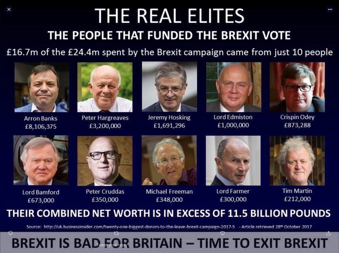

# Week 38

<blockquote class="twitter-tweet"><p lang="en" dir="ltr">So Green hydrogen, together with wind and solar, has the possibility to replace ALL oil/petrol/diesel, natural gas, coal, nuclear and most of batteries. Did I miss anything?</p>&mdash; William Blomstrand (@william_sw) <a href="https://twitter.com/william_sw/status/1174433503422963720?ref_src=twsrc%5Etfw">September 18, 2019</a></blockquote> <script async src="https://platform.twitter.com/widgets.js" charset="utf-8"></script>

---

<blockquote class="twitter-tweet"><p lang="en" dir="ltr">Hmm. But Joe Biden keeps telling me it&#39;s Medicare For All that&#39;s going to make me give up my beloved health insurer. <a href="https://t.co/wBccSyjtXF">https://t.co/wBccSyjtXF</a></p>&mdash; corey robin (@CoreyRobin) <a href="https://twitter.com/CoreyRobin/status/1174128447590948866?ref_src=twsrc%5Etfw">September 18, 2019</a></blockquote> <script async src="https://platform.twitter.com/widgets.js" charset="utf-8"></script>

---

@Waste2T

Just over 5 kilos of hydrogen deliver a 300+ mile range for a full-sized car, about twice the output of an equivalent amount of #petrol.

---

<blockquote class="twitter-tweet"><p lang="en" dir="ltr">There are only three hard problems in computer science: printers, Bluetooth and projectors. <br><br>(Vertical centering in HTML had been downgraded to “difficult, but theoretically possible”)</p>&mdash; Rakhim (@freetonik) <a href="https://twitter.com/freetonik/status/1174309911070744576?ref_src=twsrc%5Etfw">September 18, 2019</a></blockquote> <script async src="https://platform.twitter.com/widgets.js" charset="utf-8"></script>

---

More replies to the post below;

"@Karlmarxhd

When I started learning about Canadian politics, I leaned
liberal. Then I've learned about Tommy Douglas and started leaning
towards the NDP.

As soon as I ran into the #COMER issue and found out that the NDP is
the only party who had monetary reform in their platform, my support
pretty much cemented.  Then, Bernie happened and I became a socialist.

@cdchambs

Raised religious center-right in Idaho. Didn't realize I was a
conservative until college in Washington. Changing my politics and
faith were intertwined: hated Sarah Palin and wondered if my
disagreement with her politics meant I couldn't be a Christian
anymore. /1 profs at my Christian college modeled how progressive
politics and compassion-based faith could fuel each other. I was
sold. So grateful for the transformation.

@josephenderson

Three events: 1) 2000 “election,” 2) Iraq War, 3) 2008 crash

@PhelanSnow

Grew up with Christian conservative grandparents but saw the effects
of conservative policies on my heavily impoverished mother. Soon as I
could vote, I did, and it sure as hell wasn't for conservatives.

@CindyMumz

Ultra right-wing mom had us listen to Nazi recorded messages. A
preteen, I somehow thought they made sense. The turning point was I
moved to progressive Columbia Md and got exposed to a more diverse
crowd, progressive views. Briefly moved to Bible Belt 🤮 which sealed
the deal."

<blockquote class="twitter-tweet"><p lang="en" dir="ltr">raised by a conservative repub fam. religious right hypocrisy turned me in to kind of a college &quot;libertarian&quot;. Iraq made me loathe Bush/GOP (obv Ds v much to blame here too). tea party &amp; feckless Obama pushed me ever leftward. 2016 (HRC &amp; Trump) made me want to Burn It All Down</p>&mdash; New Wet Face in Hell (@WmBankston) <a href="https://twitter.com/WmBankston/status/1174107281488797696?ref_src=twsrc%5Etfw">September 17, 2019</a></blockquote> <script async src="https://platform.twitter.com/widgets.js" charset="utf-8"></script>

---

Press 1 for Spiderman, 2 for Yoda. And press 3 for Jar Jar universe

Hi there [name], thanks for pressing 3. Story begins..Spiderman is
pregnant he doesn't know why, Yoda is bitten by radioactive spider, he
becames Hulk, they are both depressed for not being PC in their life
choices. They also badly want to play a sidekick to a female, or
better, bisexual transgender character. Have a nice sleep.

"@lucyleid

Today I learned Disney has a bedtime hotline you can call where you
can speak to a Disney character (including Yoda and Spiderman) and
they'll tell your kid to go to sleep. If that's not vertical
integration I don't know what is"

---

Mars cannot be terraformed. 

[Link](https://youtu.be/FshtPsOTCP4?t=198)

---

Tesla In Sweden Goes Up In Flames After Passenger Seat Catches Fire

[Link](https://mobile.twitter.com/zerohedge/status/1173964829339586560)

---

Lachlan Patterson. Good stuff.

[Link](https://youtu.be/uSh5voSUhrs)

---

Dem candidates could tout H2 plants; in terms of labor they would be
equal to a refinery IMO. 

"The Philadelphia Energy Solutions refinery, the largest and oldest on
the U.S. East Coast, closed its doors in August after a massive fire,
idling more than 1,000 employees including some 650 union workers" --
Reuters

---

<blockquote class="twitter-tweet"><p lang="en" dir="ltr">This is huge and a clear signal that many other larger institutions, both public and private, will follow. As California goes, so goes the rest of the nation. <a href="https://t.co/9Sx9a2GzdB">https://t.co/9Sx9a2GzdB</a></p>&mdash; At War With The Dinosaurs (@WarWithTheDinos) <a href="https://twitter.com/WarWithTheDinos/status/1174015803106025473?ref_src=twsrc%5Etfw">September 17, 2019</a></blockquote> <script async src="https://platform.twitter.com/widgets.js" charset="utf-8"></script>

---

<blockquote class="twitter-tweet"><p lang="en" dir="ltr">Just found out that LaTeX has a package (&quot;typewriter&quot;) to create documents that look like they were written on an old typewriter! :) <a href="https://t.co/4qUgic1Xlw">pic.twitter.com/4qUgic1Xlw</a></p>&mdash; Luis Batalha 🇵🇹🇺🇸 (@luismbat) <a href="https://twitter.com/luismbat/status/1173913461736259584?ref_src=twsrc%5Etfw">September 17, 2019</a></blockquote> <script async src="https://platform.twitter.com/widgets.js" charset="utf-8"></script>

---

[Sippin Bordeaux out in Bordeaux](https://youtu.be/kpxBgrJFPOA?t=42)

---

SR's value on itw own is useful too; positive, the greater the
better. People usually seek values close to 1.0. If, per unit
volatility (risk), the average return is close to 1.0, that would be a
preferable asset.

---

Man speaka the truth. Here is a SR demo on one piece of a recent
slowdown.

Sharpe Ratio calculates asset (stock, bond) returns in volatility
(risk) terms. I could hold bonds at certain volatility and earn, hold
stock at higher volatility and earn. At higher risk you'd expect
better return, but how do you compare? For SR we divide both returns
by vol so we can compare apples to apples.

(IEF is 7-10 year treasury bond ETF)


```python
import pandas_datareader.data as web
import datetime
start_d=datetime.datetime(2008, 1, 1)
end_d=datetime.datetime(2012, 1, 1)
df1 = web.DataReader("SPY", 'yahoo', start_d, end_d)
df2 = web.DataReader("IEF", 'yahoo', start_d, end_d)
```

```python
def sharpe(series):
   dailyret = series.pct_change()
   excessRet=dailyret-0.04/252
   return np.sqrt(252)*np.mean(excessRet)/np.std(excessRet)

print (sharpe(df1['Adj Close']))
print (sharpe(df2['Adj Close']))
```

```text
-0.04718375613093339
0.5100019269309122
```

---

Chan is an experienced quantitative trader. Listen to the man.

"@chanep

In recession, stocks' Sharpe=-0.21, bonds' Sharpe=+1.33. In expansion,
stocks' Sharpe=+0.84, bonds' Sharpe=+1.5. Can anyone explain to me
again why we should buy stocks?"

---

<blockquote class="twitter-tweet"><p lang="en" dir="ltr">I think a big part of the solution to this problem is to acknowledge that most of what we do as a community is not science. <a href="https://t.co/BvAzSeaPpd">https://t.co/BvAzSeaPpd</a></p>&mdash; Misha Denil (@notmisha) <a href="https://twitter.com/notmisha/status/1173698510279102466?ref_src=twsrc%5Etfw">September 16, 2019</a></blockquote> <script async src="https://platform.twitter.com/widgets.js" charset="utf-8"></script>

---

"A Lunar Space Elevator Is Actually Feasible & Inexpensive, Scientists Find...

The concept of a moon elevator isn’t new...But the Columbia study
differs from previous proposal in an important way: instead of
building the elevator from the Earth’s surface (which is impossible
with today’s technology), it would be anchored on the moon and stretch
some 200,000 miles toward Earth until hitting the geostationary orbit
height (about 22,236 miles above sea level), at which objects move
around Earth in lockstep with the planet’s own rotation.

Dangling the space elevator at this height would eliminate the need to
place a large counterweight near Earth’s orbit to balance out the
planet’s massive gravitational pull if the elevator were to be built
from ground up"

[Link](https://observer.com/2019/09/moon-space-elevator-lunar-exploration-columbia-study/amp)

---

The message is two-fold; lawmakers, officials - act like it. Voters -
don't change. You are already great at what you do, deciding on
people. 

---


True. BSG was colored a lot by 9/11, the Iraq War. 

---

There is a huge empty hole where a big-tent scifi show should be; It
was Trek, SGate, then nothing.. BSG, show'em how it's done.

---

\#BSG

<blockquote class="twitter-tweet"><p lang="en" dir="ltr">Good to know 👍🏻😉 Excited to see what you come up with. 🚀</p>&mdash; Katee Sackhoff (@kateesackhoff) <a href="https://twitter.com/kateesackhoff/status/1174164332080271361?ref_src=twsrc%5Etfw">September 18, 2019</a></blockquote> <script async src="https://platform.twitter.com/widgets.js" charset="utf-8"></script>

---

[So say we all](https://www.hollywoodreporter.com/live-feed/battlestar-galactica-reboot-sam-esmail-works-at-nbcus-streamer-1239018)

\#BSG

---

<blockquote class="twitter-tweet"><p lang="en" dir="ltr">Well, he is incredible in the sense that he&#39;s not credible.</p>&mdash; Phil (@Philmoorhouse76) <a href="https://twitter.com/Philmoorhouse76/status/1173935616100392960?ref_src=twsrc%5Etfw">September 17, 2019</a></blockquote> <script async src="https://platform.twitter.com/widgets.js" charset="utf-8"></script>

---

Hah. The first Uhura actress from Trek OS wanted to quit the show (the
role was a glorified space secretary) but MLK convinced her to
stay. It was the days of civil right protests and he thought her
presence was a positive message for the movement. Turns out MLK was a
huge Trekkie 🖖

---

"@fuelcellsworks

Enapter .. New manufacturing process reduces costs by 20 percent and
increases production capacity eightfold for more affordable hydrogen
generation"

[Link](http://bit.ly/2koHGlM)

---

He said "a Republic if you can keep it", not "after we ran a
focus-group we determined a Republic is requested by most and you can
also later decide, with another focus-group, about what you can do
with it".

---

"Ew molecules so dirty...icky. Why can't I put my Macbook Pro batteries
on a car?". Fucktard.

---

So out of all the ways planets can rotate around their sun, they
mostly end up on the same plane with other planets, essentially on a
2D flat structure. Nice huh?

---

Most planet systems are coplanar, so 1st you get on nearest planet
system's plane. Then maybe the galaxy manual says right-hand rule on
starboard facing first planet's rotation.. is up? :D

I am a problem solver.

<blockquote class="twitter-tweet"><p lang="en" dir="ltr">I love sci-fi movies, but who gets to decide which way is up in space? <a href="https://t.co/Y7Z27cz4m8">pic.twitter.com/Y7Z27cz4m8</a></p>&mdash; Mark Sellors 🐠 (@sellorm) <a href="https://twitter.com/sellorm/status/1173730724937129984?ref_src=twsrc%5Etfw">September 16, 2019</a></blockquote> <script async src="https://platform.twitter.com/widgets.js" charset="utf-8"></script>

---

<blockquote class="twitter-tweet"><p lang="en" dir="ltr">We’re no longer the “tech” industry. We’re the “spying” industry, now. <a href="https://t.co/c7ljfhu3qI">https://t.co/c7ljfhu3qI</a></p>&mdash; Matthew Lyon (@mattly) <a href="https://twitter.com/mattly/status/1173629230191542272?ref_src=twsrc%5Etfw">September 16, 2019</a></blockquote> <script async src="https://platform.twitter.com/widgets.js" charset="utf-8"></script>

---

<blockquote class="twitter-tweet"><p lang="en" dir="ltr">A woman from Wenzhou gets nose job, can no longer sign into online accounts, arrive at work, check into hotels and board trains. <a href="https://t.co/MgAfayvmvb">https://t.co/MgAfayvmvb</a></p>&mdash; Mark Bergen (@mhbergen) <a href="https://twitter.com/mhbergen/status/1173671477377261569?ref_src=twsrc%5Etfw">September 16, 2019</a></blockquote> <script async src="https://platform.twitter.com/widgets.js" charset="utf-8"></script>

---

Still tho, nothing can beat [this movie](../../2012/10/president-by-day-vampire-hunter-by-night.html)

---

10 out of 10. 

"Nail biting". "A rollercoaster". 

[Link](https://mobile.twitter.com/chainbear/status/1173502976482250752)

---

How about the country name Niger? This is a real country in
Africa. But one more g and we are in censor category.. I think we are
better off striking this country from maps altogether to avoid any
unwanted offense.

---

NIGGARDLY

---

Really? You can't say "niggardly" anymore either?

---

Referandums need to be outlawed

"Its a pity that before the referendum nobody in the UK was strong enough to say.. 'This is a lie. You tried to win votes with lies" \#Brexit

[Link](https://mobile.twitter.com/Doozy_45/status/1173603706081878016)

---

"Former JP Morgan trader pleads guilty to manipulating US metals markets for years"

---

I like the accent

<blockquote class="twitter-tweet"><p lang="en" dir="ltr"><a href="https://twitter.com/hashtag/IAA2019?src=hash&amp;ref_src=twsrc%5Etfw">#IAA2019</a> Thanks to our unique model of both experimental and numerical tools, we are able to evaluate immediately the impacts on the <a href="https://twitter.com/hashtag/fuelcell?src=hash&amp;ref_src=twsrc%5Etfw">#fuelcell</a> system if we change a component. A key tool for us to reduce time to market for our consumers. <a href="https://twitter.com/hashtag/hydrogen?src=hash&amp;ref_src=twsrc%5Etfw">#hydrogen</a> <a href="https://twitter.com/hashtag/zeroemission?src=hash&amp;ref_src=twsrc%5Etfw">#zeroemission</a> <a href="https://t.co/c5b322cD8V">pic.twitter.com/c5b322cD8V</a></p>&mdash; Symbio (@SymbioFCell) <a href="https://twitter.com/SymbioFCell/status/1173623761473609728?ref_src=twsrc%5Etfw">September 16, 2019</a></blockquote> <script async src="https://platform.twitter.com/widgets.js" charset="utf-8"></script>

---



---

Determining direction, seeing all the angles takes the most time, and
feels like non-work; the grind is always preferable, but not always
possible.

---

It's true; Dirac delta function is like an imaginary number, $x^2=-1$
cannot be satisfied by any real number. And no ordinary func can be
non-zero except at one point.

---

But.. but.. countercyclical, if private doesn't spend, then, aggregate
demand, or something..?

<blockquote class="twitter-tweet"><p lang="en" dir="ltr">🇨🇳 It doesn&#39;t seem like stimulus efforts are helping. Could Q3 GDP be the weakest &quot;ever&quot;? <a href="https://t.co/KUhoaz9jjm">pic.twitter.com/KUhoaz9jjm</a></p>&mdash; Mikael Sarwe (@MikaelSarwe) <a href="https://twitter.com/MikaelSarwe/status/1173483968542445568?ref_src=twsrc%5Etfw">September 16, 2019</a></blockquote> <script async src="https://platform.twitter.com/widgets.js" charset="utf-8"></script>

---

Brutal.

Voit writes a blog called *Not Even Wrong*; the name is a dig into
String Theory, because a theory must be falsifiable, you can't twist
and bend with every experiment ("well it could say that too"), you
have to take a stand and either be right or wrong, but ST is none of
these things. The theory is "not even wrong", because it doesn't say
anything.

"[On Sean Carroll] Using your public platform to tell people that the
way to understand quantum mechanics is that the world splits depending
on what you decide to do is simply [What the
Bleep?](https://www.math.columbia.edu/~woit/wordpress/?p=83) level
stupidity. Those in the physics and science communication communities
who care about the public understanding of quantum mechanics should
think hard about what they can do to deal with this situation. They
may however come to the same conclusion I’ve just reached: best to
ignore him, which I’ll try to do from now on" -- Voit

[Link](http://www.math.columbia.edu/~woit/wordpress/?p=11277)

---

Mostly unknown piece of history: Paulson allowed Lehman Brothers to go
bankrupt to show the Congress what would happen if they didnt play
ball.

---
  
"@GenCar001

Massive $$ exodus from HK & China now flooding into Syd & Melb getting
out at ANY cost while they can with HKD still pegged USD OK against
AUD/NZD. Let's see if Aust Govt FIRB loosens investor controls? They
will pay ANYTHING maybe even for defective unit blocks.."

[Link](https://mobile.twitter.com/GenCar001/status/1173117051835052032)

---

On a different note, all attacks on fossil infrastructure are
awesome. I'd love to see some *Independence Day* level shit done to
these effers.

---

"Irish teenager wins global science award for removing microplastics
from water"

[Link](https://www.thejournal.ie/irish-student-science-award-microplastics-4745270-Jul2019/%3famp=1)

---

When I was in America there were books in stores (there were
bookstores!) with titles like *Maestro*, talking about the genius of
Greenspan. It feels like a lifetime ago.

---

<blockquote class="twitter-tweet"><p lang="en" dir="ltr">&quot;Once the industry scales up, renewable <a href="https://twitter.com/hashtag/hydrogen?src=hash&amp;ref_src=twsrc%5Etfw">#hydrogen</a> could be produced from <a href="https://twitter.com/hashtag/wind?src=hash&amp;ref_src=twsrc%5Etfw">#wind</a> or <a href="https://twitter.com/hashtag/solar?src=hash&amp;ref_src=twsrc%5Etfw">#solar</a> power for the same price as natural gas in most of Europe and Asia&quot;<a href="https://t.co/G3Fzh94GN4">https://t.co/G3Fzh94GN4</a></p>&mdash; Stéphane Jéhanno (@stejeh) <a href="https://twitter.com/stejeh/status/1173214874249375744?ref_src=twsrc%5Etfw">September 15, 2019</a></blockquote> <script async src="https://platform.twitter.com/widgets.js" charset="utf-8"></script>

---

GF says Iran did it. 

[Link](https://geopoliticalfutures.com/the-geopolitics-of-irans-refinery-attack/)

---

<blockquote class="twitter-tweet"><p lang="en" dir="ltr">Every country can make their own circular green fuel from sun and water. Green hydrogen- problem solved. <a href="https://twitter.com/hashtag/OOTT?src=hash&amp;ref_src=twsrc%5Etfw">#OOTT</a> <a href="https://t.co/KjMcSPXyIi">https://t.co/KjMcSPXyIi</a></p>&mdash; William Blomstrand (@william_sw) <a href="https://twitter.com/william_sw/status/1173202094289031168?ref_src=twsrc%5Etfw">September 15, 2019</a></blockquote> <script async src="https://platform.twitter.com/widgets.js" charset="utf-8"></script>

---

In finance you can make a billion [with a single
decision](https://twitter.com/RaoulGMI/status/1139692973711511559) -
this should not be possible. Not only does it create inequality, it
also creates unwanted risk in the system.

---

I'll let you in a secret: there is always socialism. The question is
whether it is socialism for the rich, or socialism for the poor. If
1.8 trillion dollars are transferred from middle class to upper class
annually through taxing, and other schemes, clearly the existing
scheme is socialism for the rich.

"But we dont want socialism for people, giving them free stuff"

---

<blockquote class="twitter-tweet"><p lang="en" dir="ltr">Carl Sagan explains how the ancient Greeks knew the Earth was round and calculated its circumference over 2,000 years ago. <a href="https://t.co/3AjV9hC6hi">pic.twitter.com/3AjV9hC6hi</a></p>&mdash; Wonder of Science (@wonderofscience) <a href="https://twitter.com/wonderofscience/status/1171426852340207617?ref_src=twsrc%5Etfw">September 10, 2019</a></blockquote> <script async src="https://platform.twitter.com/widgets.js" charset="utf-8"></script>

---

A reminder: Obama was a proponent of battery electric cars.

---

<blockquote class="twitter-tweet"><p lang="en" dir="ltr">Shameful that <a href="https://twitter.com/hashtag/FuckoffScotland?src=hash&amp;ref_src=twsrc%5Etfw">#FuckoffScotland</a> is trending in England. My question to Scotland is, if you do decide to fuck off, can I please come with you?</p>&mdash; Liam O&#39;Reilly (@Liamoreilly2) <a href="https://twitter.com/Liamoreilly2/status/1172516640703094785?ref_src=twsrc%5Etfw">September 13, 2019</a></blockquote> <script async src="https://platform.twitter.com/widgets.js" charset="utf-8"></script>

---

<blockquote class="twitter-tweet"><p lang="en" dir="ltr">Curious about the future of globalization? <a href="https://twitter.com/rodrikdani?ref_src=twsrc%5Etfw">@rodrikdani</a> is too. He has studied the impacts of <a href="https://twitter.com/hashtag/TariffReductions?src=hash&amp;ref_src=twsrc%5Etfw">#TariffReductions</a> and <a href="https://twitter.com/hashtag/FinancialLiberalization?src=hash&amp;ref_src=twsrc%5Etfw">#FinancialLiberalization</a> on dev countries, written a number of books and is a professor at <a href="https://twitter.com/Harvard?ref_src=twsrc%5Etfw">@Harvard</a>. Is he the next <a href="https://twitter.com/hashtag/NotTheNobel?src=hash&amp;ref_src=twsrc%5Etfw">#NotTheNobel</a> winner?<a href="https://t.co/w87ZyAVUdQ">https://t.co/w87ZyAVUdQ</a></p>&mdash; The Mint (@themintmag) <a href="https://twitter.com/themintmag/status/1172860246508879872?ref_src=twsrc%5Etfw">September 14, 2019</a></blockquote> <script async src="https://platform.twitter.com/widgets.js" charset="utf-8"></script>

---

Fred Koch was a Nazi? He even hired a Nazi nanny for Charles and David. Too funny.

Libertards.

---

"@JuergenH12

We had a newtec bubble, we had a subprime bubble and now we have a
debt bubble. We hear the mantra this is different. Yes it is, this
bubble is the biggest we ever had. The Martians will hear the Boom
when it bursts"

---

"The neoliberal revolution that has been underway since the mid-1970s
fundamentally reoriented American governance toward the interests of
capital. While the distance between government and the so-called
private sector was never that great, all pretense that government
served the broader public interest was cast aside in favor of
state-corporatism. This wasn’t simply a matter of privatizing the
public realm— it overlaid a capitalist rationale on all public
undertakings.

This re-conceptualization of the public purpose turned state functions
into profit making opportunities for private interests. Defense of the
realm became producing, selling and deploying arms for profit. Public
education, already variably and poorly funded, was redefined using
bogus metrics to be bled dry by private corporations. American health
care, the most expensive in the world with close to the worst health
outcomes, now funds a parasite class of multi-millionaire health
insurance executives...

Whether the result of naivete, ideological blinders, ignorance of
history or cynical calculation, for four-plus decades the view has
been that the public interest is best served by private interests. And
while political spectacle has been concentrated in and around the
presidency, neoliberal ideology and practice have been instantiated at
every level of government. While this facilitates capital-friendly
policies, it creates a near impenetrable barrier to challenging rule
by capital.

As plausible as accidental history is in many realms, this isn’t the
case with the instantiation of neoliberal state-corporatism. From the
think tanks funded by rich capitalist ideologues in the 1960s and
1970s, neoliberalism has been programmatically embedded into every
nook and cranny of American governance. Engineered so that nothing
short of wholesale insurrection can dislodge it, this is exactly what
the resulting maldistribution and social dysfunction are now making
inevitable.

With the background problems of environmental crisis, unhinged
militarism and political economy that long ago ran off the rails, the
upcoming presidential election offers the potential to be significant
for the first time in decades. With Bernie Sanders in the running, the
choice is no longer just between figureheads who front for capital and
the oligarchs, but between said figureheads and a fundamental
realignment of political priorities back toward the public interest.

This is to grant a lot to Mr. Sanders and the broader context of
American politics. Partly as a result of the pre-neoliberal age in
which he spent his early years and partly through a moral compass
centered on the public interest, Mr. Sanders alone amongst modern
presidential candidates is capable of expanding the idea of the public
interest to include the large swath of the U.S.— and importantly,
outside of it, whose economic fortunes were cast asunder through
neoliberal reforms and plunder"

[Link](https://www.counterpunch.org/2019/09/13/bernie-sanders-and-the-realignment-of-the-american-left/)

---

Technion Researchers improve[d] efficiency of [electrolysis based]
hydrogen production from ~75% using current methods to 98.7%

[Link](http://bit.ly/2UVa3bN)

---

"More manufacturing would be nice, but it won’t create many jobs. The
best way to improve the lives of American workers it is to improve the
terms of the jobs that they actually hold: raising [or complementing]
the salaries of restaurant workers barely able to feed their families;
providing paid leave for child-care providers who cannot care for
their own children; securing benefits [for healthcare M4A] for
warehouse workers who lack insurance because they are employed as
contractors"

[Link](https://www.nytimes.com/2019/08/29/opinion/democrats-2020-jobs-benefits.html)

---

The absurdity of grades, with a great example.

\#khanacademy

[Link](https://youtu.be/-MTRxRO5SRA?t=210)

---

"Much like the Fed, as some would say, Jim Cramer has a dual mandate:
to entertain and to pump up the markets. He is certainly excellent as
an entertainer. But this morning on CNBC’s 'Squawk Box' he let bleed
through just how concerned he is about the stock market that is
teetering at the top to such an extent that a single, messy, overhyped
company going public will 'screw up' the entire market"

[Link](https://wolfstreet.com/2019/09/13/wework-ipo-the-straw-that-breaks-the-stock-markets-back-valuation-plunged-by-up-to-79/)

---

<blockquote class="twitter-tweet"><p lang="en" dir="ltr">I asked someone to change to document to PDF and they’ve emailed me back a word document and changed the file name to pdf. How’s your Friday going?</p>&mdash; #CALI (@hashtagcali_) <a href="https://twitter.com/hashtagcali_/status/1172463124269715456?ref_src=twsrc%5Etfw">September 13, 2019</a></blockquote> <script async src="https://platform.twitter.com/widgets.js" charset="utf-8"></script>

---

A new report from the World Economic Forum’s Global Future Council on
Energy seeks to assess the signs of whether there will be a gradual or
a rapid “energy transition.”  In other words, will global economies
switch from fossil fuels to renewable energies slowly or all at once?
... However, the report omits a crucial piece of technological
development from its forecast: batteries.

The few times batteries are mentioned, they are generally referred to
as “storage,” because batteries are essentially just storage
containers for electricity or power. The report draws conclusion like,
'Even as penetration [of renewable power] rises, technologies such as
storage and demand response are likely to make higher levels of
penetration cheaper'. This is serious flaw with the conclusions and
forecasts because we do not yet have that technology to make better
and cheaper batteries, and we don’t know when or if we will.

[Link](https://www.forbes.com/sites/ellenrwald/2019/09/13/before-we-talk-about-green-energy-lets-talk-about-batteries/#5b4ce6246c9d)

---

<blockquote class="twitter-tweet"><p lang="en" dir="ltr">&quot;We&#39;re killing it on the economy&quot; <a href="https://t.co/RhHxAPOtmP">https://t.co/RhHxAPOtmP</a></p>&mdash; Sven Henrich (@NorthmanTrader) <a href="https://twitter.com/NorthmanTrader/status/1172543106648104960?ref_src=twsrc%5Etfw">September 13, 2019</a></blockquote> <script async src="https://platform.twitter.com/widgets.js" charset="utf-8"></script>

---

Already making a movie on that college admission scandal..? Michael
Shanks (of TV Stargate fame) is in it. Who plays Felicity Hoffman?
That actress from *Desparate Housewives* could totally play her.. Oh
wait, that was F. Hoffman. 😐

[Link](https://www.hollywoodreporter.com/amp/live-feed/penelope-ann-miller-mia-kirshner-star-lifetime-college-scandal-movie-1230840?__twitter_impression=true)

---

<blockquote class="twitter-tweet"><p lang="en" dir="ltr">If the size of the debt/deficit doesn’t matter then why do we bother collecting taxes in the first place?<br>🤔<br><br>If you make crazy claims I can ask crazy questions. 😎</p>&mdash; Sven Henrich (@NorthmanTrader) <a href="https://twitter.com/NorthmanTrader/status/1172545490220662784?ref_src=twsrc%5Etfw">September 13, 2019</a></blockquote> <script async src="https://platform.twitter.com/widgets.js" charset="utf-8"></script>

---

"Boeing used its political connections to monopolize the American
aerospace industry and corrupt its regulators. In the 1990s, Boeing
and McDonnell Douglas merged, leaving America with just one major
producer of civilian aircraft. Before this merger, when there was a
competitive market, Boeing was a wonderful company. As journalist
Jerry Useem put it just 20 years ago, 'Boeing has always been less a
business than an association of engineers devoted to building amazing
flying machines'"

[Link](https://amp.theguardian.com/commentisfree/2019/sep/11/boeing-capitalism-deregulation?__twitter_impression=true)

---

<blockquote class="twitter-tweet"><p lang="en" dir="ltr">It is not a great idea to destroy banks&#39; profitability with negative rates when their assets are 3x bigger than your GDP.<br><br>Just sayin&#39; <a href="https://t.co/RcxuOaU57d">pic.twitter.com/RcxuOaU57d</a></p>&mdash; Daniel Lacalle (@dlacalle_IA) <a href="https://twitter.com/dlacalle_IA/status/1172478942655197187?ref_src=twsrc%5Etfw">September 13, 2019</a></blockquote> <script async src="https://platform.twitter.com/widgets.js" charset="utf-8"></script>

---

This all comes form a moronic need to fight orange Hitler. You don't
have to do _anything_. In its own pace things were improving
already. But that's not the real problem is it? The real problem is
the top 20%, corporatists / centrists Democrats need these issues to
reaffirm their political status which does not care about economics
anymore, and this sorry excuse of "social policy" is all they have
left. Said approach not only does not work, it triggers an adverse
reaction on the other side.

---

Upcoming TV series: *Dune: The Sisterhood* 😂😂😂😂

Dude why don't you name them all like that. *CIS: The Sisterhood*. Or
*NCIS: Cuck*. 

---

"@vboykis

Having two kids is not unlike having two servers for redundancy,
except instead of failing over, each one of them wakes up the very
millisecond the other one falls asleep"

---

Yes, fracking truly accelerated under Bama's watch. US *did* chose
between env and econ, and chose wrong.

"@APIenergy

Obama: 'The development of natural gas will create jobs and power
trucks and factories that are cleaner and cheaper, proving that we
don’t have to choose between our environment and our economy'"

---

<blockquote class="twitter-tweet"><p lang="en" dir="ltr">“If you had 30 of those in the North Sea you could totally replace the natural gas requirement for the whole country, and be totally self-sufficient with hydrogen,” - Totally!<a href="https://t.co/YwPIH1OAM3">https://t.co/YwPIH1OAM3</a></p>&mdash; William Blomstrand (@william_sw) <a href="https://twitter.com/william_sw/status/1172486203796533249?ref_src=twsrc%5Etfw">September 13, 2019</a></blockquote> <script async src="https://platform.twitter.com/widgets.js" charset="utf-8"></script>

---

From Appelbaum earlier: "A dominant company might provide the best
service at the lowest price, but economic efficiency was not the goal
of public policy. In 1962, the Supreme Court ruled unanimously that
the Brown Shoe Company could not buy the G. R. Kinney Company because
the deal would let the combined company sell shoes at lower prices,
and that would place its smaller competitors at a disadvantage”".

The ruling is still about economic efficiency actually; the difference
is on what timeframe... If we let competition die for "better
service", we might get somewhat of an efficiency immediately, but
would lose long term efficiency later. After the competition is wiped
out, there'll be less innovation, and the dominant company might even
raise prices because they are not threatened by others anymore.

---

Things will get heated of course, stop whining. Julian Jorge landed a
good one \#demdebate

---

The debate was almost unwatchable except Bernie and few others. Yang
keeps producing ideas.

\#demdebate

---

"@ClimateBen

Aviation is essentially a fossil fuel industry: It 'guzzles an
eye-watering 5m barrels of oil every day'"

---

Caliphate Islam is paganized Islam. The caliph, the pope, centralized
religions - all the same shit. These places need "culture cleansing".

---

Catholicism is paganized faux-Christianity

"Prior to the time of [Roman emperor] Constantine's "conversion,"
Christians were persecuted not so much for their profession of faith
in Christ, but because they would not include pagan deities in their
faith as well. Then, with Constantine's emphasis on making his
new-found Christianity palatable to the heathen in the Empire, the
"Christianization" of these pagan deities was facilitated. For
example, pagan rituals and idols gradually took on Christian meanings
and names and were incorporated into "Christian" worship (e.g.,
"saints" replaced the cult of pagan gods in both worship and as
patrons of cities; mother/son statues were renamed Mary and Jesus;
etc.), and pagan holidays were reclassified as Christian holy days
(e.g., the Roman Lupercalia and the feast of purification of Isis
became the Feast of the Nativity; the Saturnalia celebrations were
replaced by Christmas celebrations; an ancient festival of the dead
was replaced by All Souls Day, rededicated to Christian heroes [now
Halloween]; etc.). A transition had occurred – instead of being
persecuted for failure to worship pagan deities, Christians who did
not agree with the particular orthodoxy backed by the Emperor were now
persecuted in the name of Christ! "Christianized" Rome had become the
legitimate successor of pagan Rome! This is the sad origin of the
Roman Catholic Church as it compromised from the very beginning

[Link](http://www.eaec.org/cults/romancatholic.htm)


---

"ECB governors representing the top European economies defied Mario
Draghi’s ultimately successful bid to restart quantitative easing,
according to officials with knowledge of the matter.

>The unprecedented revolt took place during a fractious meeting where
 Bank of France Governor Francois Villeroy de Galhau joined more
 traditional hawks including his Dutch colleague Klaas Knot and
 Bundesbank President Jens Weidmann in pressing against an immediate
 resumption of bond purchases, the people said. They spoke on
 condition of anonymity, because such discussions are confidential.

>Those three governors alone represent roughly half of the euro region
 as measured by economic output and population. Other dissenters
 included, but weren’t limited, to their colleagues from Austria and
 Estonia, as well as members on the ECB’s Executive Board including
 Sabine Lautenschlaeger and the markets chief, Benoit Coeure, the
 officials said"

[Link](https://www.zerohedge.com/geopolitical/did-draghi-lie-central-bankers-europes-biggest-economies-dissented-over-qe)

---


