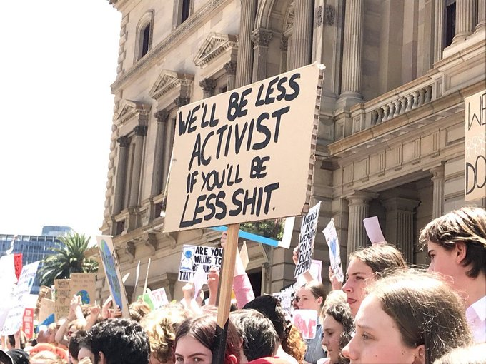

# Week 39

That's true. Incentives, rules define outcome. Dems allowed private interests have free reign, and when these ppl do what they do, some complain. 
Do not "implore" ppl for the right behaviour. Want different outcomes? Change the game.

"@Renegade_Inc

Big Pharma CEO: ‘We’re in Business of Shareholder Profit, Not Helping The Sick’"

---

"@scientificecon

Third senior German official resigns from ECB"

---

Everything H2 related is blue colored these days; I like it. It is
becoming a brand thing almost, looks fly

---

I bet Laura goes to bed with two shotguns, and uses an ammo crate as pillow. 

---

Haha.. that's the brother. It's funny. 

"@CurtisIngraham1

'Bully commentary born of anger: Fox News host Laura Ingraham mocks
16-year-old girl with autism...'

Any apologies given by my sister are empty.  I should know"

[Link](https://twitter.com/CurtisIngraham1/status/1176652358417186816)

---

"@JoSamps92

Over the next decade, fuel cell electric buses will be deployed as the
zero emissions solution for the toughest transit applications in every
bus type and for every climate and terrain any day of the year, says
new bus road map by @CaFCP. \#hydrogen"

---

Sceneario: establ. hits DJT with Ukraine, but that's a double-edged
sword that cuts Biden too, two birds with one stone. Trigger crisis
(slowdown is already a sure thing), Trump loses. Warren or someone
else other than Biden wins.

I dont think "they" want Biden (guy is senile). MSM hasn't caught on
yet.

---

"@scientificecon

.. Normally the central bank ensures there is no such spike in
[overnight] rates, which is entirely within their powers. Hence we can
only conclude the Fed purposely created this scare, possibly to
trigger the next financial crisis. Hopefully not yet"

[Link](https://mobile.twitter.com/scientificecon/status/1175488755534323718)

---

<blockquote class="twitter-tweet">
WeGone <a href="https://t.co/VegI69pgnP">https://t.co/VegI69pgnP</a>
&mdash; TeslaCharts (@TESLAcharts) <a href="https://twitter.com/TESLAcharts/status/1176545186714914816?ref_src=twsrc%5Etfw">September 24, 2019</a></blockquote> 

---

<blockquote class="twitter-tweet">
From a $100B IB valuation to layoffs, in three months! I don’t recall that happening in 2000-02. <a href="https://twitter.com/search?q=%24WE&amp;src=ctag&amp;ref_src=twsrc%5Etfw">$WE</a> <a href="https://t.co/qHhLqOzK6k">https://t.co/qHhLqOzK6k</a>
&mdash; Diogenes (@WallStCynic) <a href="https://twitter.com/WallStCynic/status/1176538620636913665?ref_src=twsrc%5Etfw">September 24, 2019</a></blockquote> 

---

"@mtracey

Trump reportedly plans to release both the whistleblower complaint and
the phone call transcript, but Democrats decided to let the
impeachment train out of the station before getting basic details
about the conduct they're alleging is impeachable. Smart"

---

None of that is Deep Shit BTW.

"First, Atlas the robot backflipped. Then, it could do parkour. Now,
this @BostonDynamics machine can do a gymnastic routine"

[Link](https://mobile.twitter.com/WIRED/status/1176497063116324865)

---

[Awesome](https://www.bloomberg.com/amp/news/articles/2019-08-02/germany-turns-to-hydrogen-in-quest-for-clean-energy-economy)

💦⚡👨‍🔬💎

---

Rogue Prorogue 👍

---

Automatic differentiation (autograd) of numerical integral (trapz)
which has elements of symbolic math (sympy) in it. Who got dat fu!

---

Habla Jorge

---

<blockquote class="twitter-tweet">
Billionaires should not exist. <a href="https://t.co/hgR6CeFvLa">https://t.co/hgR6CeFvLa</a>
&mdash; Bernie Sanders (@BernieSanders) <a href="https://twitter.com/BernieSanders/status/1176481898685710337?ref_src=twsrc%5Etfw">September 24, 2019</a></blockquote> 

---

Numerical computation is a vast field, I have to remind myself that
from time to time. Let's not forget computers were built to solve
equations first, not to simply shuffle data around (which is what 90%
of Silicon Valley does today -yes, most are not involved in computer
science even, just IT-).

---

<blockquote class="twitter-tweet">
Why as a country do we continue to bicker and fight over something which is very obviously not possible?
&mdash; Jeremy Clarkson (@JeremyClarkson) <a href="https://twitter.com/JeremyClarkson/status/1176762554435145728?ref_src=twsrc%5Etfw">September 25, 2019</a></blockquote> 

---

\#brexit 

<blockquote class="twitter-tweet">
Prisons are full of people who ‘disagree’ with judges.
&mdash; James O&#39;Brien (@mrjamesob) <a href="https://twitter.com/mrjamesob/status/1176750576975175680?ref_src=twsrc%5Etfw">September 25, 2019</a></blockquote> 

---

<blockquote class="twitter-tweet">
The gletcher on Mont Blanc might be collapsing. It was really unfair of Greta Thunberg to be that emotional. <a href="https://t.co/abUuO39hYy">https://t.co/abUuO39hYy</a>
&mdash; Erling Andersen (@e_d_andersen) <a href="https://twitter.com/e_d_andersen/status/1176725760322785280?ref_src=twsrc%5Etfw">September 25, 2019</a></blockquote> 

---

"The United States led more than 30 countries on Tuesday in condemning
what it called China’s “horrific campaign of repression” against
Muslims in the western region of Xinjiang at an event on the sidelines
of the annual U.N. General Assembly" -Reuters

---

"@mrjamesob

If you voted for Brexit because you believed that 'our' judges and
'our' parliament had somehow surrendered power to 'Brussels', you
deserve a full explanation of today's events from the people who
misled you. You won't get one because they hold you in complete
contempt"

---

<blockquote class="twitter-tweet">
South Australia unveils plans for 100% renewable hydrogen economy <a href="https://t.co/2UAiZdTODi">https://t.co/2UAiZdTODi</a>
&mdash; Chris Belyk (@ChrisBelyk) <a href="https://twitter.com/ChrisBelyk/status/1176555762728001538?ref_src=twsrc%5Etfw">September 24, 2019</a></blockquote> 

---

Tough. Saw RS on MSM the other day was laying some smackdown.

"@Jkylebass

Sen. Rick Scott: Americans must stop buying Chinese products - and
Congress should force online retailers to disclose the origin of the
wares they sell. Force Amazon to denote items made in china so we can
boycott ⁦"

---

"@jeiting

'Leaving SF' is the new 'moving to SF'"

---

[Investigate Bidens](https://youtu.be/YBB56IJ39PY?t=48)

---

Impeachment? This will cause more trash on Biden to come out. 

---

As far as I know, the motherfucker's tip-top

[With higher pitched voice near the end, with little attitude, like
wha?, and getting higher in volume in the finish.. Little standoffish
not too terse. Okay - Im done]

---

This👌close to finishing the trajectory optimization. Line integrals
over scalar field with poly parametrized curve restricted on both ends
being optimized over can do the trick. 

---

<blockquote class="twitter-tweet">
Why I’m bullish on electrolysis. A thread:  Depending on the regional gas price, producing H2 through electrolysis can be between 1.5 to 2.5 x as expensive as SMR with CCS, and up to 3x unabated SMR. I wanted to find out where the tipping point for green H2 lies. 1/12 <a href="https://t.co/uaNpF14R9H">pic.twitter.com/uaNpF14R9H</a>
&mdash; Gniewomir Flis (@gnievchenko) <a href="https://twitter.com/gnievchenko/status/1176451011600441344?ref_src=twsrc%5Etfw">September 24, 2019</a></blockquote> 

---

I know an engineer who told me before they sent their products to
China for sale they would wipe serial numbers off chips with *sandpaper*
for fear of their tech being stolen. Sandpaper.

---

Article says "disruption".

"Cummins' acquisition of Hydrogenics indicates the diesel market
leader could own the next engine tech, too"

[Link](https://www.industryweek.com/technology-and-iiot/engine-maker-acquisition-could-fuel-hydrogen-disruption)

---

<blockquote class="twitter-tweet">
We are excited to announce that Hexagon has been granted approval for its ultra-high-pressure <a href="https://twitter.com/hashtag/hydrogen?src=hash&amp;ref_src=twsrc%5Etfw">#hydrogen</a> ground storage tanks by the California Occupational Safety and Health Standards Board (CalOSHA) <a href="https://t.co/PAGfkwtXYT">https://t.co/PAGfkwtXYT</a> <a href="https://t.co/PlbxEF3iuu">pic.twitter.com/PlbxEF3iuu</a>
&mdash; Hexagon Composites (@HexagonASA) <a href="https://twitter.com/HexagonASA/status/1176509878891876353?ref_src=twsrc%5Etfw">September 24, 2019</a></blockquote> 

---

<blockquote class="twitter-tweet">
At least one big relief in the Brexit saga: the rule of law in the UK is alive &amp; kicking. Parliaments should never be silenced in a real democracy.  I never want to hear Boris Johnson or any other Brexiteer say again that the European Union is undemocratic.
&mdash; Guy Verhofstadt (@guyverhofstadt) <a href="https://twitter.com/guyverhofstadt/status/1176441621962985474?ref_src=twsrc%5Etfw">September 24, 2019</a></blockquote> 

---

BJ is a *Control Freak*, and this is what the world around does to
them when they are messing up. I feel like his pro-Brexitness has
something to do with his own issues around control too. CF phsychology
is that of a monk who lived in a convent all his life, then all of a
sudden *gets out*. They controlled all their emo, lived with
*discipline*, now they are out in a world of lots of choice. Their
path is to deal with that, cant go back to convent, cant control, wont
like being controlled, etc.

The problem is EU is not your fucking convent BJ. Whatever odd feels u
associate with this org are unfounded.

"@JimMFelton

Came to power, lost his majority live on TV, fired his hero's
grandson, set the record of losing his first five votes in Parliament
(breaking the previous record of four set by Boris Johnson earlier
that same evening), lied to the Queen, broke the law. We're in month
two."

---

*Terry Jones' Barbarians*. Highly recommended.

---

"@PeterStefanovi2

The UK's highest court has ruled that Boris Johnson broke the law when
he advised the Queen to suspend parliament in a bombshell unanimous
judgement

The court ruled that it was 'unlawful, void & of no effect'. The
absolute state of this PM. He shames our country"

---

Libraries `sympy`, `autograd`.. killer toolz. Methinks ur better of
patching together your own optimizer with `autograd` + `scipy` BFGS than
relying on a complete black box with one call.

---

Much happens in a week!

---

Budget surplus - great. Dont touch the irate. I'd raise it to 4% to
bust the zombies even. Slowdown is part of the cycle. I'd speed up the
recovery instead of remaining in zombie-land for decades like Japan.

"Australia’s central bank chief Philip Lowe faces another year of
shouldering the burden of economic stimulus as the government
prioritizes a budget surplus over turning around the weakest expansion
in a decade"

[Link](https://www.bloomberg.com/news/articles/2019-09-23/rba-s-lowe-faces-lonely-rate-cut-route-as-fiscal-road-blocked)

---

<blockquote class="twitter-tweet">
Pretty much the same today. Volvo and Traton (Scania and Man) getting hammered. Green tech strong. <a href="https://t.co/M6L0ePoYed">https://t.co/M6L0ePoYed</a>
&mdash; William Blomstrand (@william_sw) <a href="https://twitter.com/william_sw/status/1176421915864522753?ref_src=twsrc%5Etfw">September 24, 2019</a></blockquote> 

---

Gillis is pretty good actually. That ghost joke is hilarious. People
dont understand, everyone gets it from comedians, including themselves.

---

"@CraigMurrayOrg

I just watched the BBC News at Ten followed by Newsnight, in some
amazement. It consisted almost entirely of the BBC presenters scoffing
at Labour policies and effectively warning me over and over again not
to vote Labour"

---

Guess what those ships will be running on 😉 💦⚡👨‍🔬💎

<blockquote class="twitter-tweet">
The <a href="https://twitter.com/hashtag/gettingtozerocoalition?src=hash&amp;ref_src=twsrc%5Etfw">#gettingtozerocoalition</a> is presented to media ⁩ ⁦<a href="https://twitter.com/UNClimateSummit?ref_src=twsrc%5Etfw">@UNClimateSummit</a>⁩ with ⁦<a href="https://twitter.com/ToftSoren?ref_src=twsrc%5Etfw">@ToftSoren</a>⁩ ⁦<a href="https://twitter.com/Maersk?ref_src=twsrc%5Etfw">@Maersk</a>⁩ and ⁦<a href="https://twitter.com/jacquesvdmeiren?ref_src=twsrc%5Etfw">@jacquesvdmeiren</a>⁩ ⁦<a href="https://twitter.com/PortofAntwerp?ref_src=twsrc%5Etfw">@PortofAntwerp</a>⁩ introducing goal to have zero emission ships on high seas in 2030. <a href="https://twitter.com/hashtag/IAPH?src=hash&amp;ref_src=twsrc%5Etfw">#IAPH</a> is proud to support the initiative <a href="https://t.co/t0JLSKU2NP">pic.twitter.com/t0JLSKU2NP</a>
&mdash; Patrick Verhoeven (@PJHVerhoeven) <a href="https://twitter.com/PJHVerhoeven/status/1176157390904934400?ref_src=twsrc%5Etfw">September 23, 2019</a></blockquote> 

---

"@AndrewBarnas

Apparently in Finland when you receive your PhD, they award you with a
top hat and a sword.

I assume when I finish my PhD in America I will be given a Big Mac and
an AR-15?"

---

"@garrygolden

[Reuters Explainer](https://reut.rs/3086uET): Why Asia's biggest
economies back hydrogen EVs. I'll add: OEMs see less risk in supply
chains and cheaper cost+mass per kW when you integrate fuelcell with
battery; Nations see cheaper scaled out infrastructure vs
extending/balancing grid"

---

<blockquote class="twitter-tweet">
Toyota will roll out 100 <a href="https://twitter.com/hashtag/fuelcell?src=hash&amp;ref_src=twsrc%5Etfw">#fuelcell</a> electric buses for the <a href="https://twitter.com/hashtag/Tokyo2020?src=hash&amp;ref_src=twsrc%5Etfw">#Tokyo2020</a> Olympics, a stepping stone to the more than 1,000 buses they have planned in partnership with Beiqi Foton Motor Co for the 2022 Beijing Olympics. <a href="https://t.co/OzThUNR2qI">https://t.co/OzThUNR2qI</a><a href="https://twitter.com/hashtag/transit?src=hash&amp;ref_src=twsrc%5Etfw">#transit</a> <a href="https://twitter.com/hashtag/TheOtherElectricBus?src=hash&amp;ref_src=twsrc%5Etfw">#TheOtherElectricBus</a> <a href="https://twitter.com/CaFCP?ref_src=twsrc%5Etfw">@CaFCP</a>
&mdash; Keith Malone (@ANativeAngeleno) <a href="https://twitter.com/ANativeAngeleno/status/1175459688940548096?ref_src=twsrc%5Etfw">September 21, 2019</a></blockquote> 

---

"@Philmoorhouse76

This is shaping up to be a much less boring week than I'd
imagined. Boris Johnson caught giving public money to one of his
mistresses, Labour may actually be able to adopt the Brexit position
that the supporters want, and the Supreme Court may be slapping down
the government"

---

Tired: single-focus explanations on mathematical concepts. They keep
talking about the line integral as "work done"; LI (over scalar
fields) can be shown as area over surface [under curve](https://math.libretexts.org/@api/deki/files/21/Line_integral_of_scalar_field.gif).

---

---

The good news is the Left finally showed up in the Democratic race. I
remember Bill Bradley who challenged Al Gore "from the left" ('00
primary) - that mot..f..ka used to parrot literature written for him
by Pharmaceutical Research and Manufacturers of America, a lobbying
group for big pharma. This was "left" of its time.

---

<blockquote class="twitter-tweet">
2of2- &quot;also includes a goal to increase the number of hydrogen <a href="https://twitter.com/hashtag/fuelingstations?src=hash&amp;ref_src=twsrc%5Etfw">#fuelingstations</a> to 10,000 in 10 years.&quot;<a href="https://t.co/BX98yumUUK">https://t.co/BX98yumUUK</a>
&mdash; Hydrogen is the battery (@BatteryH2) <a href="https://twitter.com/BatteryH2/status/1175906901856608256?ref_src=twsrc%5Etfw">September 22, 2019</a></blockquote> 

---

"A late-cycle surge in ‘leveraged loans’ has echoes of financial
engineering before the Lehman crisis and could lead to a cascade of
fire sales if conditions suddenly tighten, the world’s top financial
watchdog has warned.

[BIS] said the high-risk loans have climbed to $1.4 trillion and are
increasingly being sliced and diced much like subprime mortgage debt
before 2007"

[Link](https://www.telegraph.co.uk/business/2019/09/22/bis-warns-lehman-era-excesses-building-global-debt-markets/amp/)

---

<blockquote class="twitter-tweet">
Joe Biden has obviously engaged in systemic influence peddling on behalf of his family. This kind of profiteering is what enables authoritarians like Trump. It signals to voters everyone is corrupt. <a href="https://t.co/YYDu6GZ2zK">https://t.co/YYDu6GZ2zK</a>
&mdash; Matt Stoller (@matthewstoller) <a href="https://twitter.com/matthewstoller/status/1175501812943769600?ref_src=twsrc%5Etfw">September 21, 2019</a></blockquote> 

---

"@Halsrethink

Hate to rain on the popular 'economy is stronger than ever' parade,
but industrial decline is well under way, and wider recession is only
months away if you believe majority of corporate CFOs who are now
planning spending cuts"

---

<blockquote class="twitter-tweet">
You can’t understand Brexit   Until you realise the EU is about to stop tax avoiding billionaires using tax havens  They want Brexit at any cost
&mdash; Martin Davies 🔶 #RevokeArticle50 (@martindvz) <a href="https://twitter.com/martindvz/status/1175435893508902913?ref_src=twsrc%5Etfw">September 21, 2019</a></blockquote> 

---

"@Renegade_Inc

Once you pop you just can't stop: Former Head Of Plunge Protection
Team Says Fed Has To Buy More Debt"

---

Please do not project your small, personalized existence to the whole
of humanity. Improving on listening is your shit. The general rule:
people who know something abt the issue listen to eachother. In
broader soc, parliament / exec, see the grievance, debate, make law.

IaC: "We need to listen to every indiv on everything before making
decisions"

---

20 C! 

---

FDP Chair Christian Lindner (Germany): "The one-sided focus on battery
drives ... can cost many thousands of jobs in the country"

---

538.. Nate Silver..  I beat his ass in 2016 - I was at a wedding
talking to Californians they were like "538 saz Hill wins bla bla", I
saz my mod indicates DJ has better chance. After elec they're like
"daam.. that wuz good". I said "sheeee-iiit".

---

<blockquote class="twitter-tweet">
🇬🇧Only 2 weeks to go before <a href="https://twitter.com/hashtag/London?src=hash&amp;ref_src=twsrc%5Etfw">#London</a> the last stop of our Northern <a href="https://twitter.com/hashtag/Europe?src=hash&amp;ref_src=twsrc%5Etfw">#Europe</a> tour! A unique opportunity to discover our vessel and our <a href="https://twitter.com/hashtag/Odyssey?src=hash&amp;ref_src=twsrc%5Etfw">#Odyssey</a> for the <a href="https://twitter.com/hashtag/future?src=hash&amp;ref_src=twsrc%5Etfw">#future</a>, through the warm waters of <a href="https://twitter.com/hashtag/Mediterranean?src=hash&amp;ref_src=twsrc%5Etfw">#Mediterranean</a> to the icy shores of <a href="https://twitter.com/hashtag/Svalbard?src=hash&amp;ref_src=twsrc%5Etfw">#Svalbard</a>! More info <a href="https://t.co/suij6sg30G">https://t.co/suij6sg30G</a> <a href="https://twitter.com/hashtag/thisislondon?src=hash&amp;ref_src=twsrc%5Etfw">#thisislondon</a> <a href="https://t.co/j8LClXliEx">pic.twitter.com/j8LClXliEx</a>
&mdash; ENERGY OBSERVER (@energy_observer) <a href="https://twitter.com/energy_observer/status/1175318748649181185?ref_src=twsrc%5Etfw">September 21, 2019</a></blockquote> 

---

<blockquote class="twitter-tweet">
US grid accounts for 33% of GHG emissions. A purist renewables-electron strategy falls short. We need clean molecules for industrial+transportation. Hydrogen (blue, green) drives deeper decarbonization. Path is via fuel cells which launch electrochemical age. Not just solar folks <a href="https://t.co/xtVOimK7MB">https://t.co/xtVOimK7MB</a>
&mdash; Garry Golden (@garrygolden) <a href="https://twitter.com/garrygolden/status/1175143764337315848?ref_src=twsrc%5Etfw">September 20, 2019</a></blockquote> 

---

She used the magic word: "Israel".

"Why did Dem centrists coalesce around Warren?"

---

Delaware people say "water" all weird. Listen closely.. it sounds like waahtaah!. 

---

<blockquote class="twitter-tweet">
A lesser-known (but extremely useful) integration trick <a href="https://t.co/20Qgs8QeNk">pic.twitter.com/20Qgs8QeNk</a>
&mdash; 〈 Berger | Dillon 〉 (@InertialObservr) <a href="https://twitter.com/InertialObservr/status/1164976471959429121?ref_src=twsrc%5Etfw">August 23, 2019</a></blockquote> 

---

Concidentally (!) one of the countries who will suffer
[most](https://www.usatoday.com/story/news/world/2018/07/24/pakistan-one-worlds-leading-victims-global-warming/809509002/)
from it.

"@AmmarRashidT

Huge crowds at the Islamabad \#ClimateMarch. There is suddenly a
climate movement in Pakistan. \#ClimateActionNow"

[Link](https://twitter.com/AmmarRashidT/status/1175012282679668736E)

---

Lands of Rome in constant trouble - Italy, Tiggerstan, Greece,
Egypt.. the birthplaces of "civilization". Add CH to the list, because
they also had "civilization" (basically agro, around which bunch of
slavery, plunder, and mafia happens)

"Why Spain is having yet another election" -- Vox

[Link](https://www.vox.com/world/2019/9/18/20871075/spain-elections-pedro-sanchez-psoe-podemos)

---

Distributional Financial Accounts (FED)

Useful data on wealth distribution

[Link](https://fred.stlouisfed.org/release?rid=453)

---

<blockquote class="twitter-tweet">
I&#39;m old enough to remember when Goldman Sachs got a $10 billion bailout <a href="https://t.co/A9mHM8A0AW">https://t.co/A9mHM8A0AW</a>
&mdash; Kate Aronoff (@KateAronoff) <a href="https://twitter.com/KateAronoff/status/1173640704368795653?ref_src=twsrc%5Etfw">September 16, 2019</a></blockquote> 

---

"[New] study provides a new theoretical result that low interest rates
encourage market concentration by raising industry leaders’ incentive
to gain a strategic advantage over followers, and this effect
strengthens as the interest rate approaches zero."

[Link](https://scholar.princeton.edu/sites/default/files/ernestliu/files/lms20190111.pdf)

---

<blockquote class="twitter-tweet">
Platinum-Graphene Fuel Cell Catalysts Show Superior Stability Over Bulk Platinum--Films of platinum only two atoms thick supported by graphene could enable <a href="https://twitter.com/hashtag/fuelcell?src=hash&amp;ref_src=twsrc%5Etfw">#fuelcell</a> catalysts with unprecedented catalytic activity and longevity--<a href="https://t.co/gpFMEkMYk7">https://t.co/gpFMEkMYk7</a> <a href="https://twitter.com/GeorgiaTech?ref_src=twsrc%5Etfw">@GeorgiaTech</a> <a href="https://twitter.com/hashtag/fuelcells?src=hash&amp;ref_src=twsrc%5Etfw">#fuelcells</a> <a href="https://t.co/T8ogJq0jzN">pic.twitter.com/T8ogJq0jzN</a>
&mdash; FuelCellsWorks (@fuelcellsworks) <a href="https://twitter.com/fuelcellsworks/status/1175033934415093760?ref_src=twsrc%5Etfw">September 20, 2019</a></blockquote> 

---

Sure, I know a lot of them actually.. my good friend from college, a
Greek guy, is this type. Whenever he goes to a beach, he finds the
nearest small hill, and does a dive from that hilltop into the
sea. It's a thing he always does, now he has his kids do it with
him. So this is in some ways JDINM positive; not overthinking
something, just doing it.

"Can u share some *Just do It Nike Man* tidbits?"

---

More *I Am CRMs*? There are so many... Kamala, Stallone, Bezos,
Strogatz, the scientist from IDW, Blyth, Trev Noah, the columnist from
NYT what's his name, Paul "Fuckin" Krugman, Al Gore...

---

Taking medical advice from doctor, or legal advice form lawyer is not
a form of "hierarchy". It is utilizing someone else's knowledge, like
reading a book. Ideally these are automated of course, but until then,
and with society broken up into such "guilds", it is what it is.

---

HAMMER TIME

<blockquote class="twitter-tweet">
After spending almost 4 years growing a following, <a href="https://twitter.com/TeamYouTube?ref_src=twsrc%5Etfw">@TeamYouTube</a> is taking away my verification. This is absurd. <a href="https://t.co/qJHhJkmJz2">pic.twitter.com/qJHhJkmJz2</a>
&mdash; David Doel (@daviddoel) <a href="https://twitter.com/daviddoel/status/1174753819709886464?ref_src=twsrc%5Etfw">September 19, 2019</a></blockquote> 

---

\#UK \#brexit

---

I am getting a T-shirt that says "Demystifier".

---

<blockquote class="twitter-tweet">
I want to be in the meeting where this idea was proposed <a href="https://t.co/Bf5KpQF716">pic.twitter.com/Bf5KpQF716</a>
&mdash; Tariq Rauf (@tariqrauf) <a href="https://twitter.com/tariqrauf/status/1174403429810212866?ref_src=twsrc%5Etfw">September 18, 2019</a></blockquote> 

---

"@passthebeano

'Truck hauling Teslas catches fire on I-80. The truck’s cargo of
electric vehicles was fully engulfed in flames'"

[Link](https://twitter.com/passthebeano/status/1176902555755958272)

---

<blockquote class="twitter-tweet">
With <a href="https://twitter.com/InsideEVs?ref_src=twsrc%5Etfw">@InsideEVs</a> and <a href="https://twitter.com/cleantechnica?ref_src=twsrc%5Etfw">@cleantechnica</a> dropping a new fluff article every 3 hours it appears Q3 may be worse than some are expecting... this pump fest is insane. <a href="https://twitter.com/search?q=%24TSLA&amp;src=ctag&amp;ref_src=twsrc%5Etfw">$TSLA</a> <a href="https://twitter.com/search?q=%24TSLAQ&amp;src=ctag&amp;ref_src=twsrc%5Etfw">$TSLAQ</a>
&mdash; Structured Debt Rick the Fifth (@MusksFUDetector) <a href="https://twitter.com/MusksFUDetector/status/1174680028862472192?ref_src=twsrc%5Etfw">September 19, 2019</a></blockquote> 

---

I'd believe it. 

"@JulietMEvans

'Mr Juncker told his college of commissioners in Strasbourg on Tuesday
that the Luxembourg lunch was the first time that “Boris Johnson
understood the meaning of the single market'"

[Link](https://twitter.com/JulietMEvans/status/1174604587665362944)

---

"Miners Find Out the Hard Way Why Cobalt Is Called the Goblin"

[Link](https://www.bloomberg.com/amp/news/articles/2019-08-07/miners-find-out-the-hard-way-why-cobalt-is-called-the-goblin)

---

The $2.5 trillion reason we can’t rely on batteries to clean up the grid

[Link](https://www.technologyreview.com/s/611683/the-25-trillion-reason-we-cant-rely-on-batteries-to-clean-up-the-grid/amp/)

---

Most in media are followers. They talk about things only when it's
"safe" to do so. 

---

Continental is fourth in the global auto parts market.

This is [number one](https://www.bosch-presse.de/pressportal/de/en/bosch-to-cooperate-in-large-scale-production-of-fuel-cells-for-trucks-and-cars-188480.html).

"Forget going battery electric, says Continental, the real future is
in the hydrogen revolution"

---

<blockquote class="twitter-tweet">
&quot;Renewable hydrogen costs may fall to as low as $1.40 a kilogram by 2030 from the current range of $2.50 to $6.80, BNEF said in the report.&quot;<a href="https://twitter.com/hashtag/Sacramento?src=hash&amp;ref_src=twsrc%5Etfw">#Sacramento</a> <a href="https://twitter.com/hashtag/California?src=hash&amp;ref_src=twsrc%5Etfw">#California</a> <a href="https://twitter.com/Lindeplc?ref_src=twsrc%5Etfw">@Lindeplc</a> Feb. 2018 <a href="https://t.co/q3rnlwhipr">https://t.co/q3rnlwhipr</a> <a href="https://t.co/4ZrOB4E8tP">pic.twitter.com/4ZrOB4E8tP</a>
&mdash; Hydrogen is the battery (@BatteryH2) <a href="https://twitter.com/BatteryH2/status/1173238579457228803?ref_src=twsrc%5Etfw">September 15, 2019</a></blockquote> 

---

<blockquote class="twitter-tweet">
Johnson’s quickly discovering Brexit will ruin him just like his predecessors. Fully trapped, he can’t accept May’s deal, can’t accept no-deal, and only deal he could accept will finish him for good.  It would take a heart of stone not to laugh.  My latest <a href="https://t.co/DlMSqGHHQz">https://t.co/DlMSqGHHQz</a>
&mdash; Jonathan Lis (@jonlis1) <a href="https://twitter.com/jonlis1/status/1174621169728851970?ref_src=twsrc%5Etfw">September 19, 2019</a></blockquote> 

---

Mid-cycle? Says who? US is in late cycle, not mid-cycle.

---

<blockquote class="twitter-tweet">
&quot;STOCKS&quot; (reminder): Russell 2000 is down -10% from where you could have chased it at the peak of the US Cycle last year <a href="https://t.co/wyw9rbprB1">pic.twitter.com/wyw9rbprB1</a>
&mdash; Keith McCullough (@KeithMcCullough) <a href="https://twitter.com/KeithMcCullough/status/1174611469876506624?ref_src=twsrc%5Etfw">September 19, 2019</a></blockquote> 

---

"@wendi_c_thomas

IDK who needs to hear this, but poverty-wage workers cannot budget
their way to economic stability. Offering financial literacy workshops
when what they need is a living wage is insulting and immoral"

---

