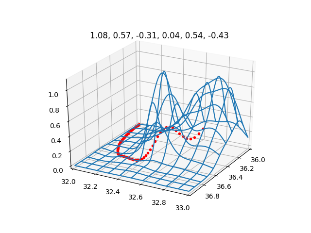
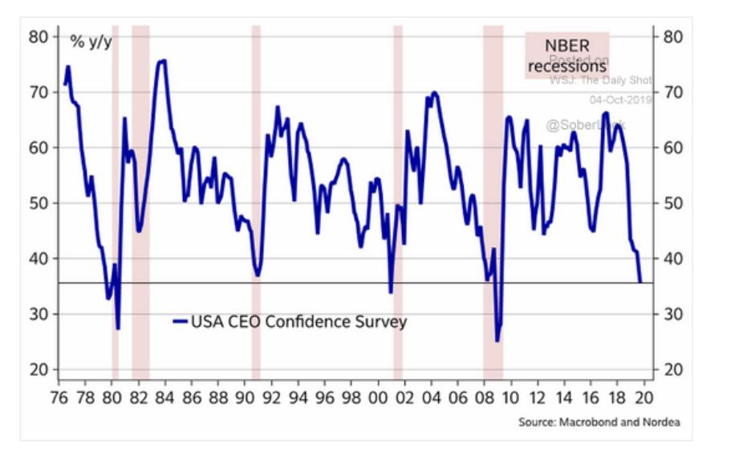
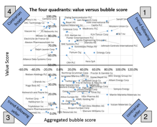
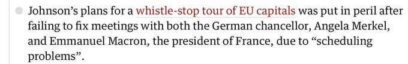
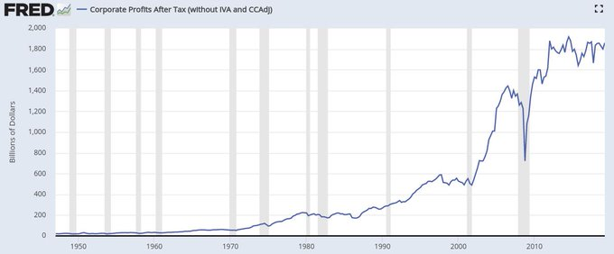

# Week 41

<blockquote class="twitter-tweet">
End of empire stuff: Chef Tom Kerridge says £32.50 fish and chips &#39;easily justifiable&#39; <a href="https://t.co/5V0K24PKHQ">https://t.co/5V0K24PKHQ</a> - need the mark up for the rent eh chef?
&mdash; Renegade Inc. (@Renegade_Inc) <a href="https://twitter.com/Renegade_Inc/status/1182036857351217158?ref_src=twsrc%5Etfw">October 9, 2019</a></blockquote> 

---

♪♬ Bitch tiggaaa

♪♬ Bitch tigggaa

♪♬ Too eager, meager

♪♬ Bitch tigggaa

♪♬ Bruh got his AK, joins the PKK

♪♬ He watchin' can't do nuttin

♪♬ Bitch tigggaa

---

MathJax my friend.. that LaTeX 2 HTML thing really doesn't work
well. Especially on mobile formulas come out all weird.

---

Nothing against the lone tuber (or beating off) - some lone tubers are good.

---

Much better than the lone tuber screaming his head off between bouts of beating off.

---

Great to have a solidly progressive and professional looking show
which heavy hitters can come to as guests, with pro players \#hillrising.

---

<blockquote class="twitter-tweet">
The Hydrogen Economy Is Within Grasp And Progressive Energy Companies Know It <a href="https://twitter.com/hashtag/hydrogen?src=hash&amp;ref_src=twsrc%5Etfw">#hydrogen</a> <a href="https://twitter.com/hashtag/greenhydrogen?src=hash&amp;ref_src=twsrc%5Etfw">#greenhydrogen</a> <a href="https://t.co/Q0QnVBPphZ">https://t.co/Q0QnVBPphZ</a>
&mdash; Gilman Industries (@GilmanHydrogen) <a href="https://twitter.com/GilmanHydrogen/status/1181997463009452034?ref_src=twsrc%5Etfw">October 9, 2019</a></blockquote> 

---

<blockquote class="twitter-tweet">
Uber, but for electricity.
&mdash; Semil (@semil) <a href="https://twitter.com/semil/status/1181822709573017601?ref_src=twsrc%5Etfw">October 9, 2019</a></blockquote> 

---

These tweets started to look like knowledge dumps. Whatever I can
think of I dump here. I hope it's not too much.

---

Seeing even some Dem centrists are now alarmed by the situation.

---

This is what you get when gov clears the path, encourages "biz by any
means" in a "preferred" country.

"@Noahpinion

HOLY SHIT there are a lot of American companies doing pro-China censorship!!!"

[Link](https://mobile.twitter.com/Noahpinion/status/1181974464516374528)

---

"@Noahpinion

Basketball fans are being kicked out of games for pro-Hong Kong signs IN AMERICA"

---

<blockquote class="twitter-tweet">
What do you get when you combine: drone ➕ boat ➕ all-terrain vehicle ➕ submarine? The revolutionary concept called Shapeshifter. This <a href="https://twitter.com/NASAJPL?ref_src=twsrc%5Etfw">@NASAJPL</a> concept for a flying amphibious robot could be used to explore the treacherous terrains of distant worlds. 📖<a href="https://t.co/qW6kxd9Xzt">https://t.co/qW6kxd9Xzt</a> <a href="https://t.co/6iQ9ipG90Z">pic.twitter.com/6iQ9ipG90Z</a>
&mdash; NASA360 (@NASA360) <a href="https://twitter.com/NASA360/status/1176881545333764096?ref_src=twsrc%5Etfw">September 25, 2019</a></blockquote> 

---

Actually *Control Freak* might like being controlled because that
would mean they'd be losing control. I'd have BJ tied up and spanked
he'd make bunch of concessions.

---

Watch out for the trolls. They are as active China's [50 Cent Army](https://www.voanews.com/east-asia-pacific/who-are-chinese-trolls-50-cent-army)

<blockquote class="twitter-tweet">
making so many friends. <a href="https://t.co/HjFRIVusng">https://t.co/HjFRIVusng</a>
&mdash; paul mcleary (@paulmcleary) <a href="https://twitter.com/paulmcleary/status/1181986365921255425?ref_src=twsrc%5Etfw">October 9, 2019</a></blockquote> 

---

This guy has a death wish.

---

F--head, what have you done?

---

<blockquote class="twitter-tweet">
Pray for our Kurdish allies who have been shamelessly abandoned by the Trump Administration. This move ensures the reemergence of ISIS.
&mdash; Lindsey Graham (@LindseyGrahamSC) <a href="https://twitter.com/LindseyGrahamSC/status/1181941868206133248?ref_src=twsrc%5Etfw">October 9, 2019</a></blockquote> 

---

<blockquote class="twitter-tweet">
Siemens is backing a mega green power project in Australia that will produce renewable hydrogen for potential export <a href="https://t.co/AbLc4trvOk">https://t.co/AbLc4trvOk</a>
&mdash; Bloomberg (@business) <a href="https://twitter.com/business/status/1181439724482912261?ref_src=twsrc%5Etfw">October 8, 2019</a></blockquote> 

---

"@william_sw

It’s no longer a matter of if or when but rather how fast. Siemens 5
GW push in Australia means other players need to move as well to not
get left behind. Happy Hydrogen day!"

---

Nope, yoghurt was not invented by the tigga as thought by some dumb
nats (who also think they are "Central Asian"). It is Middle Eastern
(agro, farm animals, milk leads to yoghurt -also a little sheep
fucking, invading your near neighbors etc-). Greeks eat lots of
yoghurt too, and call it "Greek Yoghurt".

---

Interesting take on China. Sounds like a static culture to which
change comes to, rather than the other way around.

[Link](https://youtu.be/_DjB4J1fvrg?t=19)

---

The wording sounds like Bernie's. 

"Warren released a plan on Wednesday that would focus the resources of
the federal government on 'environmental justice'"

[Link](https://www.bloomberg.com/amp/news/articles/2019-10-09/warren-unveils-environmental-justice-plan-for-poor-communities)

---

Quinnipac, Monmouth, Economist (kinda) do say that, yes.

"Warren, a senator from Massachusetts, and Joe Biden are statistically
tied for first place in polls of the Democratic presidential race,
with about 26% support" -- Bloomberg

---

Yes the contrast is clear; in US the oil industry produced an
innovator like JDR, in many other places it fueled tyrannical regimes
with zero innovation like in [fill in the blanks]. Sad.

---

Actually that stuff, plus pipelines etc came later. JDR was primarily
a refiner. He built an enourmous expertise around engineering,
processing, and basically managing a tech company. He is also AFAIK
the only person who made more money after retirement than before
retirement because when he built the biz, oil was for heating, lamps.
Then cars came to the scene, the profits of his businesses (and the
value of the stocks he still held after retirement)
exploded (see the bio *Titan*).

Fingers crossed for the next JDR in hydrogen. I hope that person
becomes so successful the business eventually gets broken up!

"Rockefeller made so much money from oil drilling!"

---

Since it is set to replace fossil fuels I wouldnt be surprised. Oil
and gas drilling alone is 2 trillion $ business. 

<blockquote class="twitter-tweet">
Big turnout for the European Commission’s hydrogen conference. Some predict hydrogen power is set to become a multi trillion dollar industry. <a href="https://t.co/sBTljyXPW5">pic.twitter.com/sBTljyXPW5</a>
&mdash; justin stares (@EUmaritimewatch) <a href="https://twitter.com/EUmaritimewatch/status/1181913715693834240?ref_src=twsrc%5Etfw">October 9, 2019</a></blockquote> 

---

"The unnamed person at the center of this story sure didn’t sound like
a whistleblower. Our intelligence community wouldn’t wipe its ass with
a real whistleblower.

Americans who’ve blown the whistle over serious offenses by the
federal government either spend the rest of their lives overseas, like
Edward Snowden, end up in jail, like Chelsea Manning, get arrested and
ruined financially, like former NSA official Thomas Drake, have their
homes raided by FBI like disabled NSA vet William Binney, or get
charged with espionage like ex-CIA exposer-of-torture John
Kiriakou. It’s an insult to all of these people, and the suffering
they’ve weathered, to frame the ballcarrier in the Beltway’s latest
partisan power contest as a whistleblower" -- Taibbi

[Link](https://www.rollingstone.com/politics/political-commentary/whistleblower-ukraine-trump-impeach-cia-spying-895529/amp/?__twitter_impression=true)

---

😆😆😆😆

"If Trump were president of a different country, we would bomb it" -- Maher

---

So ppl who trade options use a volatility assumption for their
pricing, whose average (once reverse-engineered from the price) can be
used as an indication of future volatility. 

---

HEye uses implied vol (reverse engineered from options) as predictor
for future vol, no? There is some good math here, Black-Scholes,
reverse-engineer with little root-finding.. whazzuuuup!

And this is [vol usage](https://youtu.be/CBCenp7_j_M?t=896) for bear /
bull decision.

"@KeithMcCullough

Implied Volatility on $SPY has gone from a -45% DISCOUNT (vs. 30-day
realized) 1-month ago to a +36% PREMIUM this morning

That's what happens when you enter a 4th straight down week for
"stocks" from their SEP @CNBC Now FOMO Futures highs"

---

Now [that's](https://i.pinimg.com/originals/19/ed/c7/19edc78b4d79695e13c6201a6860b72a.gif) a cop show...

---

I want to see more boring people, innovating quietly. Gov can lead the
way, funding, de-patenting. Much of that energy is stll alive today,
USG can still fund some cool stuff, and spur innovation. We only need
to shut the cacerolada that is around the fake center-of-gravity,
celebrity.

---

They could use their solar panels to store energy in their bitch batteries for emergencies, but hey, I'll take using public resources over innovating any day of the week (the battery thing probably isn't cost effective anyway). 

"@PBRStreetGang7

Tesla factory unlikely to lose power
*even if most of Fremont does*
because of agreement with PG&E

[Link](https://twitter.com/PBRStreetGang7/status/1181783935413436416)

---

"@shravanvasishth

Sweet irony of paper arguing that Word is superior to LaTeX: A
correction notice: "This article was republished on March 30, 2015, to
correct the sizing and placement of the figures." To which I say:
'[!htbp]'"

[Link](https://twitter.com/shravanvasishth/status/1181815014912614400)

---

[rolls eyes]

"bad math jokes

@funnymaths

what do you call it when someone steals n dollars from your bank
account, and then immediately deposits n dollars back in?

the identity theft"

---

So a combo of internal politics (losing local elecs) and wanting to
displace Kurds near the border (cuz they are all "terrorists") are the
reason for the incursion. Here's the
[about-face](https://www.foreignaffairs.com/articles/turkey/2019-10-09/turkeys-endgame-syria)
done around nationalism.

"Northeastern Syria is not a no-man’s land. A March 1 Washington
Institute for Near East Policy article says, 'According to
[geographer] Fabrice Balanche, around 850,000 people currently reside
in the proposed 20-mile-deep zone bounded by the Euphrates River on
the west and the Tigris River on the east. They include 650,000 Kurds
(76%), 180,000 Sunni Arabs (21%), 10,000 Turkmens (1%), and 10,000
Christians (1%).'"

[Link](https://www.al-monitor.com/pulse/originals/2019/09/turkey-syria-united-states-erdogan-plans-for-east-euphrates.html)

---

😶

<blockquote class="twitter-tweet">
If Turkey moves into northern Syria, sanctions from hell – by Congress – will follow.   Wide, deep, and devastating sanctions.
&mdash; Lindsey Graham (@LindseyGrahamSC) <a href="https://twitter.com/LindseyGrahamSC/status/1181610139092226049?ref_src=twsrc%5Etfw">October 8, 2019</a></blockquote> 

---

"Orlando utility to launch $9 million hydrogen system and more than
double solar energy"

[Link](https://www.orlandosentinel.com/news/os-ne-orlando-utility-hydrogen-solar-20191007-jajdl3upuneorakhz4imd624pe-story.html)

---

<blockquote class="twitter-tweet">
They were consulted. And then blindsided as POTUS went rogue. These two things aren’t mutually exclusive. They chatted before the call. Agreed on talking points. And then Trump ignored those talking points. And backtracking (with heavy spin) begins. <a href="https://t.co/UsGnTa3oAH">https://t.co/UsGnTa3oAH</a>
&mdash; Aaron Stein (@aaronstein1) <a href="https://twitter.com/aaronstein1/status/1181648833366888451?ref_src=twsrc%5Etfw">October 8, 2019</a></blockquote> 

---

J. Farnes proposed negative mass could explain dark energy, but (-)
mass means (-) cosmo constant say PBS ST and leads to other things
that do not make sense.

[Link](https://youtu.be/miGddxrvmDU?t=482)

---

<blockquote class="twitter-tweet">
Happy National Hydrogen Day!!!<a href="https://twitter.com/hashtag/HydrogenNow?src=hash&amp;ref_src=twsrc%5Etfw">#HydrogenNow</a> <a href="https://t.co/wuOeblqtkJ">pic.twitter.com/wuOeblqtkJ</a>
&mdash; FuelCellPartnership (@CaFCP) <a href="https://twitter.com/CaFCP/status/1181577689024458754?ref_src=twsrc%5Etfw">October 8, 2019</a></blockquote> 

---

"@Birdyword

Western companies who find themselves in trouble in China have a
playbook: apologise profusely, try make amends, and pray.

The NBA is discovering that playbook is out of date, and they risk the
wrath of their existing US base in prostrating themselves"

[Link](https://twitter.com/Birdyword/status/1181521503063404544)

---

Ooowwww

"The 2019 Physics Nobel Prizes were announced this morning ... I do
want to point out that this announcement means .. that John Horgan has
won his 2002 bet with Michio Kaku, with $2000 going to the Nature
Conservancy. The winning prediction from Horgan was:

>By 2020, no one will have won a Nobel Prize for work on superstring
 theory, membrane theory, or some other unified theory describing all
 the forces of nature"

[Link](https://www.math.columbia.edu/~woit/wordpress/?p=11295)

---

The model is similar to Abramovitz model (the one I use), [this paper](http://www.forecastingprinciples.com/files/13KeysbyArmstrong&Cuzan.pdf)
says the success of both are equal.

---

Another prez prediction model from Lichtmann. "Forget the polls,
forget the pundits, forget conventional political analysis". 

[Link](https://youtu.be/CBPcacIvdIY?t=28)

---

"When campaigning for a second term in office .. Nixon announced that
'the rate of increase of inflation was decreasing', which has been
noted as 'the first time a sitting president used the third derivative
to advance his case for reelection'"

[Link](https://en.wikipedia.org/wiki/Third_derivative)

---

@j_bertolotti

\#PhysicsFactlet (179)

The rate of change of position is velocity.

The rate of change of velocity is acceleration.

The rate of change of acceleration is jerk.

The rate of change of jerk is jounce.

The rate of change of jounce is crackle.

The rate of change of crackle is pop.

---

Commeee to Butthead

---

This was long time in coming. Cons could not maintain their
schizophrenic state any longer, made a (bad) choice, and need to pay
the price. I remember well into the '14,'15, Cameron talking with both
sides of mouth, one day saying I'll talk tough to EU, blah blah, next
day chiding his party for "keep banging on about the EU". Who could
hold two such differing views at party level? Can't chew gum and
sing La Bamba at the same time...

---

"@JolyonMaugham

For their electoral prospects, does Boris Johnson secretly need the Government to be 'forced' to remain in the EU? And does Jeremy Corbyn secretly need it to be 'forced' to leave with No Deal? 

Some of the conduct of each is otherwise inexplicable."

---

Yes, an entire generation of Dems have been decimated by centrism.

"But what abt that NY mayor, a solid left guy, and at the right
age?". Ideologically he is great, but he also started late. Look at
his record, previous big stint was at Hillary's campaign. That's
wasted time in a man's career. Instead of putting effort for selling
M4A to the public, he was involved with war-room politics, being near
ppl digging up sex tapes, trying how not to offend Goldman Sachs. 

---

"But is it science? Theoretical physicists who say the multiverse
exists set a dangerous precedent: science based on zero empirical
evidence"

[Link](https://aeon.co/essays/post-empirical-science-is-an-oxymoron-and-it-is-dangerous)

---

I said this before and I say it again; if shit hits the fan, everyone
will gang up on the Chinese. I'd watch out if I were them.

---

<blockquote class="twitter-tweet">
I would allocate my capital like <a href="https://twitter.com/search?q=%24ARKK&amp;src=ctag&amp;ref_src=twsrc%5Etfw">$ARKK</a> <a href="https://t.co/kVGjLkvv7w">https://t.co/kVGjLkvv7w</a> <a href="https://t.co/xC1aLDMevw">pic.twitter.com/xC1aLDMevw</a>
&mdash; Pivotal Capital (@Pivotal_Capital) <a href="https://twitter.com/Pivotal_Capital/status/1181244227860287489?ref_src=twsrc%5Etfw">October 7, 2019</a></blockquote> 

---

2013 bitch!

---

I remembered  a Chavez [post](https://muratk3n.github.io/thirdwave/en/2013/03/narsisist-leninist.html) of mine.

---

Dried yoghurt? Very cool. There is an entire subculture around drying stuff.

Imma use this for calcium. 

[Link](https://www.organikzamani.com/kes-nedir-nasil-yapilir-yogurt-kurusu-faydalari)

---

<blockquote class="twitter-tweet">
1. What do monopolies have to do with China and the NBA? Plenty. Historically, there are important analogies bn how China uses its economic power and how Germany did prior to WWII. I have a chapter in my upcoming book called &quot;Trustbusters against Hitler.&quot; <a href="https://t.co/fxvSJKJMgY">https://t.co/fxvSJKJMgY</a>
&mdash; Matt Stoller (@matthewstoller) <a href="https://twitter.com/matthewstoller/status/1181201528964730886?ref_src=twsrc%5Etfw">October 7, 2019</a></blockquote> 

---

Log-barrier method for constraints.. Some fine ass shit. Optimization
ppl got some moves..

---

"@ElliotElinor

Peter Oborne: 'I have attended every single Conservative Party conference since 1992. This one is the only one where I’ve felt scared.' If Peter Oborne is scared, all of us should be"

---

Oh yeah... start random, one-step on autograd computed gradient over RBF hills, and we have a near optimal path.

---

Blue Steel baby! That season 15 is looking like it will be biblical. 

---

That shit will kill you. See [De Vany](https://muratk3n.github.io/thirdwave/en/2010/04/devany.html)

---

Don't run marathons.. Some of the unhappiest people are marathon
runners. Look at Hussein Bolt - that is the happiest man on the
planet. Look at the marathon runner, from Bawston Marathon. He's got
the shit kicked out of him, he is hating life at this moment. This is
all pain no gain.

---

Bloody hell; I now commented on Brexit through 3 different countries
that I lived at. I just remembered about something I wrote while I was
sitting at a SBUX Kudamm - 2 yrs ago?

---

"@RealJack

Biden's son

Pelosi's son

Romney's son

Kerry’s son

All are on the board of directors for energy companies doing business in Ukraine...

Coincidence?

No"

---

HOOOOOLLLYYY SHEEEEIIITT

"Pelosi may soon be facing similar allegations to Joe Biden. A recent report suggested Pelosi’s son Paul may have used her position to benefit financially"

---

"@RushDoshi

By publicly punishing the Houston Rockets, the PRC may have scored an
own goal.

They’ve raised public awareness of the myriad ways the PRC effectively
censors the speech of US citizens.

People didn’t really know that was happening. Now they do, and they
don’t seem to like it"

---

"@ClayTravis

This NBA-Hong Kong-China mess is fascinating. The NBA is super woke
when it comes to things like made up US transgender bathroom disputes,
but bent the knee to China when Daryl Morey came out in support of
democracy & upset communists. Shows you how hypocritical the league
is"

---

"@Hedgeye

If we put a pencil to it and added everything in, I imagine [healthcare] is more than 20% of GDP. It’s eating the economy. The nation that implemented the Marshall Plan and built the Hoover Dam is now fixated on its UTIs"

[Link](https://mobile.twitter.com/Hedgeye/status/1178695065360912384)

---

"@HoweGeneration

Think China is an economic juggernaut? Not when it comes to human
capital. China is way behind other "middle-income" nations on the
verge of breaking into high-income status"

[Link](https://mobile.twitter.com/HoweGeneration/status/1180175989525143552)

---

US CEO Confidence Survey

---

"@business

Norway’s massive wealth fund got the go-ahead to sell nearly $6
billion in oil and gas stocks"

[Link](https://mobile.twitter.com/business/status/1180896178759700483)

---

<blockquote class="twitter-tweet">
Joe Biden is finished.<a href="https://twitter.com/hashtag/DropOutJoe?src=hash&amp;ref_src=twsrc%5Etfw">#DropOutJoe</a> <a href="https://t.co/Qo1q1ETFII">https://t.co/Qo1q1ETFII</a>
&mdash; Pat the Berner🌹 (@PatTheBerner) <a href="https://twitter.com/PatTheBerner/status/1180895437827362816?ref_src=twsrc%5Etfw">October 6, 2019</a></blockquote> 

---

<blockquote class="twitter-tweet">
//“This entire movement started off because of a law Hong Kong people didn’t agree with, and now Mrs. Lam is using an even harsher law to answer to those disagreements in society,” //<a href="https://t.co/CqlgkxaOWt">https://t.co/CqlgkxaOWt</a>
&mdash; Joshua Wong 黃之鋒 (@joshuawongcf) <a href="https://twitter.com/joshuawongcf/status/1180691103126712320?ref_src=twsrc%5Etfw">October 6, 2019</a></blockquote> 

---

<blockquote class="twitter-tweet">
Protesters in Mong Kok appear to have made a catapult with bamboo scaffolding in order to launch bricks. Vid: Facebook. <a href="https://twitter.com/hashtag/hongkong?src=hash&amp;ref_src=twsrc%5Etfw">#hongkong</a> <a href="https://twitter.com/hashtag/hongkongprotests?src=hash&amp;ref_src=twsrc%5Etfw">#hongkongprotests</a> <a href="https://twitter.com/hashtag/antiELAB?src=hash&amp;ref_src=twsrc%5Etfw">#antiELAB</a> <a href="https://twitter.com/hashtag/china?src=hash&amp;ref_src=twsrc%5Etfw">#china</a> <a href="https://t.co/VlnG1Su3PE">pic.twitter.com/VlnG1Su3PE</a>
&mdash; Hong Kong Free Press (@HongKongFP) <a href="https://twitter.com/HongKongFP/status/1180842014239158272?ref_src=twsrc%5Etfw">October 6, 2019</a></blockquote> 

---

<blockquote class="twitter-tweet">
Designer Bacteria Could Fuel the Future with Cheap Hydrogen-Macquarie biologists have made breakthrough by creating genetically-engineered sugar-loving bacteria that produces on-demand, <a href="https://twitter.com/hashtag/ZeroEmission?src=hash&amp;ref_src=twsrc%5Etfw">#ZeroEmission</a> emission <a href="https://twitter.com/hashtag/hydrogen?src=hash&amp;ref_src=twsrc%5Etfw">#hydrogen</a> faster than anyone else-<a href="https://t.co/DErH4BsouP">https://t.co/DErH4BsouP</a> <a href="https://twitter.com/hashtag/HydrogenNow?src=hash&amp;ref_src=twsrc%5Etfw">#HydrogenNow</a> <a href="https://t.co/KIgWm1LOoM">pic.twitter.com/KIgWm1LOoM</a>
&mdash; FuelCellsWorks (@fuelcellsworks) <a href="https://twitter.com/fuelcellsworks/status/1180856123055857664?ref_src=twsrc%5Etfw">October 6, 2019</a></blockquote> 

---

"Ceres Power doubles sales for fourth year running ... Here we take a
closer look at Ceres Power PLC (LON:CWR), which is commercialising a
revolutionary fuel cell technology"

[Link](https://www.proactiveinvestors.com/companies/amp/news/220152)

---

😆😆😆

"@flaplette

my $5000 oscilloscope can't connect to the network because a wifi-enabled lightbulb stole its fixed IP address.

the future is fucking stupid"

---

The log-oscillations of DS math are inspired by materials before
breaking point, akin to when a person lifts and holds something near
their max strength, before they run out of stamina and drop the object
the muscles do these mini-shakes, IMO they are similar to these
log-oscillations.

---

Sornette upped his game on bubble prediction. Now he computes a bubble
score, and combines it with the valution of a stock, he creates four
quadrants, bottom right for example is for stocks that are overvalued
and have a bubble formed. A contrarian seller can use that signal.

This style of bubble detection is slightly more advanced than "Black
Swans" which in a way simply means "shit happens". Pretty crude
observation which, shockingly, was unknown to many traders.

Talked abt Didier's approach here before
([link](../2017/week12.html#sornette), [link](../../2015/10/didier-sornette.html)). 

DS's observatory publishes a report every month, the graph above comes
is from 2019 October [PDF](https://ethz.ch/content/dam/ethz/special-interest/mtec/chair-of-entrepreneurial-risks-dam/documents/FCO/FCO-Cockpit-October_2019.pdf)

---

<blockquote class="twitter-tweet">
Hydrogen has the power to change the future of <a href="https://twitter.com/hashtag/mobility?src=hash&amp;ref_src=twsrc%5Etfw">#mobility</a>! But how do <a href="https://twitter.com/hashtag/hydrogen?src=hash&amp;ref_src=twsrc%5Etfw">#hydrogen</a> powered fuel cell-electric drive systems work and what are their benefits? Find out in our deep dive video! <a href="https://t.co/IScZm3SIiY">https://t.co/IScZm3SIiY</a>
&mdash; BoschGlobal (@BoschGlobal) <a href="https://twitter.com/BoschGlobal/status/1180393435259375617?ref_src=twsrc%5Etfw">October 5, 2019</a></blockquote> 

---

Or 1 can simply buy *whey* protein (sold in powder form) which is
fittingly extracted from the cheese making process. 1 might notice the
compound tastes strangely like the meal replacement powders, like
XLS. So these powders probably just use whey. 

[Link](https://www.wheyforliving.com/faq/)

---

Meat has all 9 (hence our obsession with it), but these 9 aminos are
not exclusive to meat. Cheese has them too.

Still to animaly? If 1 is careful, a combo of beans, almonds, berries,
apple, nuts, cacao can do the trick, in nature this would be
"gathering" part of hunting-gathering.

"There are 23 proteinogenic (protein building) amino acids in total
... Of the proteinogenic amino acids, 9 are essential .. Essential
amino acids are not produced naturally by the body, so they have to be
obtained from the foods we eat"

[Link](https://bareblends.com.au/blog/the-9-essential-amino-acids-what-are-they-and-why-do-we-need-them)

---

<blockquote class="twitter-tweet">
Earlier in the year, but now there’s no turning back for the disillusioned youth in HK. Their chinese”social credit scores”will be forever ruined by dystopian xi’s system. carrie’s attacks through her “police” on innocent civilians have unified those persecuted. <a href="https://twitter.com/hashtag/HKpoliceTERROR?src=hash&amp;ref_src=twsrc%5Etfw">#HKpoliceTERROR</a>
&mdash; Kyle Bass (@Jkylebass) <a href="https://twitter.com/Jkylebass/status/1180074629324558336?ref_src=twsrc%5Etfw">October 4, 2019</a></blockquote> 

---

<blockquote class="twitter-tweet">
Maybe put it this way then. FRB argues Deposits--&gt;Reserves--&gt; Loans. Real world is Loans--&gt;Deposits--&gt;Reserves.
&mdash; Steve Keen (@ProfSteveKeen) <a href="https://twitter.com/ProfSteveKeen/status/1180489367745437696?ref_src=twsrc%5Etfw">October 5, 2019</a></blockquote> 

---

Great article \#unicorns \#galloway

[Link](https://www.profgalloway.com/mdma)

---

"@WarWithTheDinos

Hawaii spends 3.5 billion dollars importing petroleum when they could
be splitting water with wind & solar and storing it, running the grid
and fueling their vehicles with \#hydrogen & \#fuelcells; its energy
security & energy independence"

[Link](https://mobile.twitter.com/WarWithTheDinos/status/1180501142255652865)

---

"@profgalloway

Overvalued unicorns:

— Pinterest

— Snap

— Twitter

— Peloton

— Slack

— DoorDash

— Lime

— Palantir

— Uber

— Compass

Will lose 80% or disappear:

— Tesla

— WeWork

— Robinhood

— Lyft

— OYO"

[Link](https://twitter.com/profgalloway/status/1180197139101696013)

---

<blockquote class="twitter-tweet">
Air Liquide Joins H2Haul, the European Long-Distance Haulage Project--The objective of H2Haul is to make <a href="https://twitter.com/hashtag/hydrogen?src=hash&amp;ref_src=twsrc%5Etfw">#hydrogen</a> a driver of the energy transition in the long-distance heavy-duty vehicle industry--<a href="https://t.co/wFFtcm1UWZ">https://t.co/wFFtcm1UWZ</a> <a href="https://twitter.com/hashtag/HydrogenNow?src=hash&amp;ref_src=twsrc%5Etfw">#HydrogenNow</a> <a href="https://twitter.com/airliquidegroup?ref_src=twsrc%5Etfw">@airliquidegroup</a> <a href="https://twitter.com/hashtag/lowcarbon?src=hash&amp;ref_src=twsrc%5Etfw">#lowcarbon</a> <a href="https://twitter.com/hashtag/ZeroEmission?src=hash&amp;ref_src=twsrc%5Etfw">#ZeroEmission</a> <a href="https://t.co/gZmqI6hfxy">pic.twitter.com/gZmqI6hfxy</a>
&mdash; FuelCellsWorks (@fuelcellsworks) <a href="https://twitter.com/fuelcellsworks/status/1180479361243324419?ref_src=twsrc%5Etfw">October 5, 2019</a></blockquote> 

---

Dude where is my drone?

"Ashton Kutcher

@aplusk

Just sending out a morning shout to the men and woman of the intelligence community that keep us safe and protect our country. \#gratitude \#ty"

[Link](https://mobile.twitter.com/aplusk/status/1021409519098769408)

---

It’s crazy how many former spooks have been hired at corporate news
outlets like CNN & MSNBC as “analysts”. After spending their careers
serving the national security state, they get to shape the news under
the guise of expertise. It’s like state TV

[Link](https://mobile.twitter.com/RaniaKhalek/status/1180066601275547650)

---

<blockquote class="twitter-tweet">
China has built 421,000 electric buses to date, all with various severity of battery degradation. Could be an interesting market for retrofitting fuel cells. <a href="https://t.co/3cCb9S7vgy">https://t.co/3cCb9S7vgy</a>
&mdash; William Blomstrand (@william_sw) <a href="https://twitter.com/william_sw/status/1180387572364824576?ref_src=twsrc%5Etfw">October 5, 2019</a></blockquote> 

---

Good comment on irates. I would in fact raise it to 4% everywhere with below <2%. 

[Link](https://youtu.be/n9rhTp-Mirg?t=285)

---

Clinton admits "welfare reform" was a flock up.

[Link](https://youtu.be/Y9lfuqqNA_g?t=639)

---

Another cash program that works... evidence keeps piling up

[Link](https://youtu.be/5i45h76ioHY?t=446)

---

LOVE IT

---

What's the point of Mars again? It cannot be terraformed so you have
to live in closed encampments, just like on the Moon. Why travel for
frickin months to get the same experience? Pointless. We need to focus
on planets, or "planetary bodies" that have a future.

If Mars is "done", i.e. flagpole, footprints on the ground kinda deal,
I'd close that chapter, and shift the focus to Titan.

---

<blockquote class="twitter-tweet">
A NASA instrument on India&#39;s Chandrayaan-1 lunar mission directly observed solid water ice deep in shadowed craters at the Moon&#39;s north and south poles. This ice could provide water for future lunar settlements more cheaply than shipping water from Earth <a href="https://twitter.com/hashtag/WorldSpaceWeek?src=hash&amp;ref_src=twsrc%5Etfw">#WorldSpaceWeek</a> 📸: <a href="https://twitter.com/NASA?ref_src=twsrc%5Etfw">@NASA</a> <a href="https://t.co/0Agka8bPuv">pic.twitter.com/0Agka8bPuv</a>
&mdash; Australian Space Agency (@AusSpaceAgency) <a href="https://twitter.com/AusSpaceAgency/status/1180328009489883137?ref_src=twsrc%5Etfw">October 5, 2019</a></blockquote> 

---

"@canberratimes

Why Canberra is jumping on board the hydrogen bus"

[Link](https://mobile.twitter.com/canberratimes/status/1180350653136195595)

---

<blockquote class="twitter-tweet">
Fraunhofer led project - hot forming technique to mass produce fuel cell bipolar plates for electric automobiles and aircraft <a href="https://t.co/ZYukuIE3QD">https://t.co/ZYukuIE3QD</a> <a href="https://twitter.com/hashtag/energytwitter?src=hash&amp;ref_src=twsrc%5Etfw">#energytwitter</a> reminder that &#39;electric&#39; refers to the motor, not the battery. OEMs set on scaling Hydrogen FCEVs
&mdash; Garry Golden (@garrygolden) <a href="https://twitter.com/garrygolden/status/1180186816609181697?ref_src=twsrc%5Etfw">October 4, 2019</a></blockquote> 

---

"@Peters_Glen

Current climate policies & emission pledges lead to an *increase* in
global GHG emissions.

The world is nowhere near on track to be anywhere remotely consistent
with 1.5°C or 2°C in the next 10 years..."

[Link](https://twitter.com/peters_glen/status/1180012676082208768)

---

Another anti-endorsement?

"@ibrahimpols

Billionaire Home Depot co-founder Bernie Marcus: “Don’t bring up
Bernie Sanders... He’s the enemy of every entrepreneur that’s every
gonna be born in this country.”

[Link](https://mobile.twitter.com/ibrahimpols/status/1179796329628876800)

---

<blockquote class="twitter-tweet">
I am Ukrainian gas expert now. Give me $50,000/month.
&mdash; Ukrainian Gas Expert Poso🇺🇦 (@JackPosobiec) <a href="https://twitter.com/JackPosobiec/status/1180196028013780993?ref_src=twsrc%5Etfw">October 4, 2019</a></blockquote> 

---

"That money is trapped. This is a constant refrain whispered by
corporate leaders in high places. According to well-placed finance
experts, companies such as Chevron, Exxon, Sony, and BMW have billions
of dollars in earnings in China. But they can’t repatriate their
money. China refuses to let it leave the country, because it needs
those dollars. Numerous investment community sources have told me
that, as far as they know, China has not allowed the significant
repatriation of any Western investor funds since 2015" -- Spalding, *Stealth War*

---

Yep - many foreign companies cannot take their money out of China in
dollars, they are basically held hostage.

---

Playing monkey games with the law, procedure, everything with the
distant hope something will come of it.. It is sad to watch #brexiters

---

\#outdoors No need to rain-proof everything, rain-proof pants, jacket,
etc. Somewhat rain-proof jacket is good-enough. For true rain
protection, that'll cover everything,
[pancho](https://www.decathlon.com.tr/arpenaz-10l-panco-id_8084715.html)
is best. Then any kind of clothing is covered when it rains. They are
foldable, fits into almost any bag once folded.

Obviously the bag needs its own rain protection.

---

---

I think my generation and younger suffer from over-scifi. Space
adventuring was made too easy for us - on screen. Moon landing?
Pffff. So black and white, dude. Now that I appreciate the challenges
and am impressed probes were sent to so many places. Even Soviets sent
more than one to Venus!  A lot of them got busted up by the hostile
env but they sent some data.

---

There are rivers on Titan made up of methane. Methane!

---

The gipper was consistent - he did not like big _anything_, including
the government (the government grew of course, even during his time,
but I don't think this was a dynamic [anyone could
fight](https://muratk3n.github.io/thirdwave/en/2011/03/integrators.html)).

---

Yes Reagan broke up AT&T, and there were baby bells. And apparently
the break-up was their
[idea](https://en.wikipedia.org/wiki/Breakup_of_the_Bell_System) (to
avoid worse punishment)
 
>This vertical integration [with Western Electric] led AT&T to have almost total control over communication technology in the country, which led to the antitrust case, United States v. AT&T. The plaintiff in the court complaint asked the court to order AT&T to divest ownership of Western Electric. Feeling that it was about to lose the suit, AT&T proposed an alternative: its breakup

---

This is a crazy graph. After 2000, profits sky-rocketed. The entire
corp profit time-series looks exponential = like a bubble.

2008 was a brief return to normalcy, but then they upped the laughing
gas again.

---

'Tis a cock

---

"@ftenergy

Linde invests in UK hydrogen machine manufacturer"

[Link](https://twitter.com/ftenergy/status/1179786099725606912)

---

"@BestForBritain

Cute little grenade lobbed by Varadkar, on the possibility of the UK
reversing its decision to exit the EU: 'All the polls since Mr Johnson
became PM suggest that's what the British people actually want, but
their political system is not able to give them that choice'"

---

Tosca - Work Song

[Link](https://youtu.be/U-g620UMG0o?t=35)

---

"@caitoz

Wealth Identity Politics: Billionaires Acting Like A Persecuted Minority Is Peak Capitalism

'If you go back to 1933, with different words, this is what Hitler was
saying in Germany' Langone has said of the rising pushback against
wealth inequality"

[Link](https://twitter.com/caitoz/status/1179585469144653824)

---

There was a time when CIA organized a coup in Ukraine just to f--k
with Putin's mind. Now they are getting bitch trolled, or
troll-propogating.

How low have they fallen. 

"@Renegade_Inc

CNN quoting sarcasm as fact... conditions normal...

'When asked about concerns that Russia might interfere in the 2020 US
elections, Russian President Vladimir Putin replied: "I'll tell you a
secret: Yes, we'll definitely do it," he said. "Just don't tell
anyone," he added, in a stage whisper - CNN'"

---
