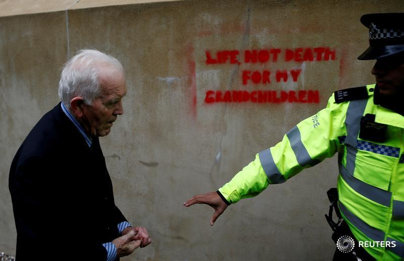

# Week 42

<blockquote class="twitter-tweet">
Turns out, without actual evidence, a media propaganda blitz isn&#39;t enough to impeach a sitting president. <a href="https://t.co/3xb30mTYTv">https://t.co/3xb30mTYTv</a>
&mdash; Sharmine Narwani (@snarwani) <a href="https://twitter.com/snarwani/status/1184577908284755968?ref_src=twsrc%5Etfw">October 16, 2019</a></blockquote> 

---

<blockquote class="twitter-tweet">
Isn’t Italy bankrupt? <a href="https://t.co/zCbsvvyvaN">https://t.co/zCbsvvyvaN</a>
&mdash; Stacy Herbert (@stacyherbert) <a href="https://twitter.com/stacyherbert/status/1184532904174637056?ref_src=twsrc%5Etfw">October 16, 2019</a></blockquote> 

---

Haha he is being carried away like a flour sack.

"@NAJ562

Full respect to @GeorgeMonbiot who has just been arrested in Trafalgar
Square whilst peacefully discussing the \#ClimateEmergency we are
facing"

[Link](https://twitter.com/NAJ562/status/1184505469404090368)

---

“When injustice becomes law. Resistance becomes duty.” - Thomas
Jefferson ✊✊✊

---

@airliquidegroup

The 1st \#hydrogen station has been opened in Zhejiang Province, in
\#China ... thanks to a strong collaboration between Air Liquide and
@SinopecNews. Air Liquide Houpu has designed the station and Air
Liquide will provide the hydrogen to supply 25 public buses🚌 per day.

---

Good for you. I despise Oracle, and their closed source software.

"Migration Complete – Amazon’s Consumer Business Just Turned off its
Final Oracle Database"

[Link](https://mobile.twitter.com/jeffawilke/status/1184131254691618817)

---

<blockquote class="twitter-tweet">
PhD students looking at their to-do list. <a href="https://t.co/Zm3UR6fA0o">pic.twitter.com/Zm3UR6fA0o</a>
&mdash; ᴅᴀɴɪ ʙᴇᴄᴋ ❼ (@_DaniBeck) <a href="https://twitter.com/_DaniBeck/status/1184383841894653953?ref_src=twsrc%5Etfw">October 16, 2019</a></blockquote> 

---

"@AlistairBarrie

So, correct me if I’m wrong, but the news seems to be that Johnson may
have secured a slightly worse deal than May, and in their desperation
for ANY Brexit, a combination of hypocritical zealots and nervous
Labour MPs may well pass it. Have I missed anything?"

---

Manufacturers can save 90% cost via hydrogen-powered technology

[Link](https://guardian.ng/business-services/manufacturers-can-save-90-cost-via-hydrogen-powered-technology/amp/)

---

"@DavidLammy

Whether Boris Johnson gets a deal or not, it does not change the
simple fact that every form of Brexit is terrible for Britain"

---

Not a good answer... 

Sinking by the minute...

"@bennyjohnson

This is not a joke —

CNN:

“Biden, you said if you're president no one in your family will work for foreign companies. If it'll be inappropriate when you're president, why was it appropriate when you were VP?”

BIDEN: 

'Impeach Donald Trump.'"

---

<blockquote class="twitter-tweet">
&quot;Until recent years electrolysis made no sense because coal and gas have dominated the US energy profile. The advent of low cost renewable energy has changed the game entirely.&quot;  Even Cleantechnica understands now.......<a href="https://t.co/QwdpuMspcR">https://t.co/QwdpuMspcR</a>
&mdash; Bjørn Eng (@H2Bjorn) <a href="https://twitter.com/H2Bjorn/status/1184429014968127490?ref_src=twsrc%5Etfw">October 16, 2019</a></blockquote> 

---

I remember a Newsweek article yrs ago, it was about a Lindsay Lohan
arrest, and the title was: "Like, Busted".

What happened to these publications. I dont seek them anymore, not
sure of their fate.

---

Ironically their presence is also killing democracy outside China,
on stateside, at their home turf.

Plus the reason they were in China to begin with was precisely because
of the non-presence of democracy, making use of that cheap slave labor
that could only be controlled through an autocratic state.

"Gen. Spalding (paraph) 'businessman, billionaires go to China, then
tell us democracy is dead, look at China'" ...

---

Booker keeps opening his eyes reaaally wide. Like reaaaly wide. Dude
it's too over-the-top... "Could you put more of yourself into the
role?" (Isn't that what they say in Holywood?)

\#demdebate

---

"Democratic presidential hopefuls denounced President Donald Trump's
decision to pull U.S. troops back from northern Syria, saying in an
Ohio debate he had endangered America's longtime Kurdish allies" -- Reuters

\#demdebate

---

Most of the line-up slams TR.

\#demdebate

---

It's sad to see many of the young generation of Dems so brainfukked by
the post-80s, ultra-capitalist, ultra-globalist, Clinton
agenda. Criticizing M4A..? Don't you have better things to do?

\#demdebate

---

"You got the Iraq War done". Boom! 👊 💥 

\#demdebate \#bernie 

---

"1 percenter" attack on Warren? "Gillum will be the VP pick, no more
hope for me!". "Might as well attack!"

Or endorse someone else 😉

\#demdebate

---

Warren held her ground. Bernie did excellent.

\#demdebate

---

Some genuine talk on UBI. Grand.

\#demdebate

---

Biden is subdued, not as much fire and brimstone anymore. Some others
came to his defense, but it won't matter.

\#demdebate

---

Bernie is full energy. Did this man really have an heart attack?

\#demdebate

---

<blockquote class="twitter-tweet">
Saying that war is the only way to create peaceful societies is exactly saying that war is peace. We really have gone full Orwell.<a href="https://t.co/WF5Gaq5Ah1">https://t.co/WF5Gaq5Ah1</a>
&mdash; Alex (Sasha) Krainer (@NakedHedgie) <a href="https://twitter.com/NakedHedgie/status/1183993264334082050?ref_src=twsrc%5Etfw">October 15, 2019</a></blockquote> 

---

Haha.. even CH says stop. That's funny. 

"@hasavrat

China’s foreign ministry urged Turkey on Tuesday to stop military
action in Syria"

---

<blockquote class="twitter-tweet">
I am consistently long and short the stock and have been for a couple of years. One of the best stock in the market if you know the rules. 1) It&#39;s going to zero, but not in the time frame one expects 2) Don&#39;t use options 3) Anything E.Lon says is a lie. <a href="https://t.co/RIRbpSpJ7G">https://t.co/RIRbpSpJ7G</a>
&mdash; Jin SEO (@JTSEO9) <a href="https://twitter.com/JTSEO9/status/1183784976778694656?ref_src=twsrc%5Etfw">October 14, 2019</a></blockquote> 

---

There is no conspiracy - the tech is faulty. Your guy is not all that
he is cracked up to be. Find better role models.

<blockquote class="twitter-tweet">
The cult is ringing the dinner bell.... <a href="https://twitter.com/search?q=%24TSLA&amp;src=ctag&amp;ref_src=twsrc%5Etfw">$TSLA</a><a href="https://t.co/RX8SgCFPLa">https://t.co/RX8SgCFPLa</a>
&mdash; JC Oviedo (@JCOviedo6) <a href="https://twitter.com/JCOviedo6/status/1183810666064482305?ref_src=twsrc%5Etfw">October 14, 2019</a></blockquote> 

---

"@Lecocq_dom

Behind the scenes, \#hydrogen fuel tech is growing up fast. More than
$180m is being invested in Australian hydrogen infrastructure — all
part of a global movement to push this safe, zero emission fuel into
the mainstream "

[Link](https://stockhead.com.au/energy/behind-the-scenes-hydrogen-fuel-tech-is-growing-up-fast/)

---

<blockquote class="twitter-tweet">
A vortex ring is the phenomenon where a quantity of a fluid in a toroid shape, travels through a fluid, while spinning like a circular bracelet that is being rolled off of a person’s arm. And it can also interact with objects [source of the gif: <a href="https://t.co/KgHalvZ6Hd">https://t.co/KgHalvZ6Hd</a>] <a href="https://t.co/9ZwN5hWABy">pic.twitter.com/9ZwN5hWABy</a>
&mdash; Massimo (@Rainmaker1973) <a href="https://twitter.com/Rainmaker1973/status/1183445924414144513?ref_src=twsrc%5Etfw">October 13, 2019</a></blockquote> 

---

More codes useful for presidential campaigns - the culture code for
hospital is PROCESSING PLANT - so campaigns which paint someone else's
health plan more with bad experiences with hospitals can benefit. U
get shoved in there, being processed.. these networks etc.. that can
work.

Code 4 presidency - MOSES. POTUS is someone who leads ppl to the
promised land. A good candidate needs to be seen as a man on a
mission, moving somewhere and asking others to follow him.

Code US gives itself - HOPE. That's why 1992 Clinton campaign was
brilliant - "I still believe in a place called 'hope'". This word
might have been polluted bcz of Bama who also used it and failed at
delivering it recently (as did Clinton before), but there might be
other ways to reference it.

---

[geek]The map-reduce method of big-data is very American. First data is
broken up (let loose) then the keys are aggregated at other nodes
(contained)[/geek].

The main tug-of-war in US is between containing (prohibition) and
allowing, letting it loose. This is at cultural brain level which is
at lower -stronger- level to analytical thinking. When they conflct,
culture wins.

---

Message discipline - I talked abt it
[here](https://muratk3n.github.io/thirdwave/en/2018/05/q-65.html)
briefly; the Clinton 92 campaign, also W campaign, was one of the best
users of this. From George Stephapapopolapopolaolpololoolous in *All
too Human*,

>But for all of our high-tech toys, the most useful item in the War
Room [during the '92 campaign] was a low-tech template — a
hand-lettered white board that James [Carville] stuck on a pillar in
the middle of the room. It said:

>*Change vs. More of the Same*

>*The economy, stupid*

>*Don't forget health care*

>I thought of it as a campaign haiku — an entire election manifesto
condensed to nineteen syllables. James drilled it into our heads, and
every speech, every event, every attack, and every response had to
reflect one of these three commandments.

---

Why did Hillary lose? She looks like a petite, small lady; Americans
(in fact many other voters) like tall-ish, lanky politicians -
i.e. Protestan looking. Stocky, butt-close-to-the-ground peasant types
don't do so good. You have to look nomadic. Even subconciously ppl
seek that.

In terms of general-demenaor, can't be too stiff, too brittle... U
need to come across like some stuff can just slide off you, in a
backslapping, guys-guy kinda way. You have to be somewhat of an oaf,
bonehead - but not much. This is true even for women, maybe for them
we can call it tomboy-ishness. If we are to compare women, Warren does
this better than Hillary. The folksy can-opening, drinking video in
the beginning of campaign is a guys-gal move. Even for women voter
that is more preferable than brittle, static, Catholic-like, "the
punisher" *hanımağa*.

It makes sense how a little touch of oaf is attractive for the
die-hard followers, volunteers as well; they need to be comfortable
their head won't get bit off at the slightest wrong move. So a little
oaf makes better followers.

Elected Presidents are mostly like this; Trump is an oaf. Even Obama
was somewhat of an oaf.  Dubya 10-out-10 - in his case it bordered on
dumbass, but it didn't matter. People still preferred him over Gore -
the textbook definition of stiff. One *Silicon Valley* episode had the
best joke on him, one character said Gore came across like a
"narcoleptic plantation owner".

---

"@Petercampbell1

About that Chinese electric vehicle boom..."

[Link](https://twitter.com/Petercampbell1/status/1183667918665633792)

---

Equinor ASA is a Norwegian multinational energy company.

<blockquote class="twitter-tweet">
“They solve Equinor&#39;s big problem: Old oil platforms can become green hydrogen plants powered by wind power” - Clever 🇳🇴 <a href="https://t.co/RI2e3N9Mmt">https://t.co/RI2e3N9Mmt</a>
&mdash; William Blomstrand (@william_sw) <a href="https://twitter.com/william_sw/status/1183635130541363200?ref_src=twsrc%5Etfw">October 14, 2019</a></blockquote> 

---

Idea: news orgs can send comedians to follow political events on the
ground, and report back. Someone like Dennis Miller. "How was the mood
there at that Biden rally Dennis?". "I don't know John, I see a lot of
people, but it's like Marlon Brando's brunch over here, he ate all the
food, and these people are left to starve, walking around like
zombies, the energy is very low at this event".

---

<blockquote class="twitter-tweet">
china’s small banks have no bid as the world knows they are all insolvent collections of terrible loans to unprofitable businesses. The entire chinese banking system is insolvent (even worse than the US and Europe during the GFC). <a href="https://twitter.com/hashtag/worthless?src=hash&amp;ref_src=twsrc%5Etfw">#worthless</a> <a href="https://twitter.com/hashtag/china?src=hash&amp;ref_src=twsrc%5Etfw">#china</a> <a href="https://t.co/en7z22kD7t">https://t.co/en7z22kD7t</a>
&mdash; 😷Kyle Bass😷 (@Jkylebass) <a href="https://twitter.com/Jkylebass/status/1183621362449076226?ref_src=twsrc%5Etfw">October 14, 2019</a></blockquote> 

---

"The Syrian Democratic Forces officially confirm they are
letting Assad's troops into their territory in a bid to stop the
Turkish onslaught"

---

<blockquote class="twitter-tweet">
Trump Assures Kurds There Will One Day Be Very Nice Tree Planted In D.C. Commemorating Their Deaths <a href="https://t.co/8kbxkqvMIV">https://t.co/8kbxkqvMIV</a> <a href="https://t.co/3LqYxta4xb">pic.twitter.com/3LqYxta4xb</a>
&mdash; The Onion (@TheOnion) <a href="https://twitter.com/TheOnion/status/1183398788758736898?ref_src=twsrc%5Etfw">October 13, 2019</a></blockquote> 

---

"400 yrs ago on the planet Earth workers who felt their livelihood
threathened by automation flung their wooden shoes called 'sabot' into
the machines to stop them. Hence the word 'sabotage'". -- Trek,
*The Undiscovered Country*

---

Guy on cncbc "this is not *Art of the Deal* but the *Art of the
Divorce* (referring to US-CH interaction lately)"

---

<blockquote class="twitter-tweet">
My former employer CollegeHumor did this. In order to beat YouTube, Facebook faked incredible viewership numbers, so CH pivoted to FB. So did Funny or Die, many others. The result: A once-thriving online comedy industry was decimated. A $40m fine is laughable; shut Facebook down. <a href="https://t.co/iYejU0EGqp">https://t.co/iYejU0EGqp</a>
&mdash; Adam Conover (@adamconover) <a href="https://twitter.com/adamconover/status/1183209875859333120?ref_src=twsrc%5Etfw">October 13, 2019</a></blockquote> 

---

The face recog feature is nice, it'd be great to have it wout going
full-blown *1984*.

"Amazon has 10 no cashier stores in US.

Bingobox has 300 no employee stores in China"

[Link](https://youtu.be/CaELQS5kTso?t=1420)

---

Ooww but why is there inflation in Venezuella?

[This](https://youtu.be/9qdO2pFoGgw?t=537) is why.

[More](https://youtu.be/9qdO2pFoGgw?t=781) on Chavez, switch to authoritarianism.

---

Math and crime, randomness. Good stuff on terr. network analysis. I
remember the show *Numb3rs*.

[Link](https://youtu.be/-cXBgHgX5UE)

---

Hah.. CNN whistleblower. Nice.

---

Cycle more important than trade deal

[Link](https://youtu.be/8LZg0YxrPkU)

---

Deal phase 1 any good ?

[Link](https://youtu.be/Zop5NRxt3Rw?t=66)

---

Is Ellen really trying to fight montages of her with Abu Graib
pictures in the background using copyright claims? Unbelievable...

---

<blockquote class="twitter-tweet">
They were right about Bush the Second and paid the price for it only to have Liberals turn to Bush apologia. You truly hate to see it. <a href="https://t.co/IbAmHknsT2">https://t.co/IbAmHknsT2</a>
&mdash; #LibraSeasonIsInEffect (@prisonculture) <a href="https://twitter.com/prisonculture/status/1183265843767054337?ref_src=twsrc%5Etfw">October 13, 2019</a></blockquote> 

---

"@terronk

It’s hard to tell with Russians whether their daddy issues are about
their actual fathers or just their country"

---

"@TheRickWilson

The United States of Blackwater."

---

Ah interior point methods.. they are the barrier methods after all.
They are the 1984 replacement for simplex I'd heard much about even
for LPs. Fascinating area.

---

From UK climate protests.. Fantastic.

"@Renegade_Inc

Iconic shot..."

---

<blockquote class="twitter-tweet">
Robot chefs. Coming soon to every casino on the Strip. <a href="https://t.co/ItPp6AsGRp">pic.twitter.com/ItPp6AsGRp</a>
&mdash; Las Vegas Locally 🌴 (@LasVegasLocally) <a href="https://twitter.com/LasVegasLocally/status/1182710828715298816?ref_src=twsrc%5Etfw">October 11, 2019</a></blockquote> 

---

<blockquote class="twitter-tweet">
The unions of the 1970s fought so hard to preserve these jobs. And those in the &quot;dark satanic mills&quot; of textiles. And those in the coal mines.   Hard to remember today how bad those days were on the lives of the workers and their families. <a href="https://t.co/MZSObwLpbt">https://t.co/MZSObwLpbt</a>
&mdash; Chris Anderson (@chr1sa) <a href="https://twitter.com/chr1sa/status/1183139286964531201?ref_src=twsrc%5Etfw">October 12, 2019</a></blockquote> 

---

Direct correlation with food culture and agrarian empire in your past,
obviously. With the empire gone, u enjoy the food. 

---

I shouldn't be surprised; During another pol crisis / onslaught these
ppl were discussing whether to have a gourmet scrambled egg dish "with
onions or without onions". Huge discussion. This *is* Rome. The
transition to post-empire, food-style-fashion economy (as in Italy)
should have happened already, wholesale, but partly the country is
stil old Rome, looking for genocide, expansion, etc. Timescale on that
part needs to be sped up - or its culture removed.

---

Right before I viewed that vid YTube pushed a kitchen utensil video to
my screen with a happy-do-gooder voice; I am like "are u f--ing
kidding me". There are casualties right next door and and the adspace
is like whatev.

---

"Trump gives his administration broad powers to put sanctions on Turkey"

[Link](https://www.youtube.com/watch?v=c37cm8SoXF8)

---

<blockquote class="twitter-tweet">
Germany: 9 out of 10 Companies in the Renewable Energy Industry want <a href="https://twitter.com/hashtag/Hydrogen?src=hash&amp;ref_src=twsrc%5Etfw">#Hydrogen</a> to be Developed Further--Renewable Energies Hamburg Cluster Agency Survey held among about its 200 member companies--<a href="https://t.co/6X4Asq6ftJ">https://t.co/6X4Asq6ftJ</a> <a href="https://twitter.com/hashtag/HydrogenNow?src=hash&amp;ref_src=twsrc%5Etfw">#HydrogenNow</a> <a href="https://twitter.com/hashtag/fuelcell?src=hash&amp;ref_src=twsrc%5Etfw">#fuelcell</a> <a href="https://twitter.com/hashtag/decarbonise?src=hash&amp;ref_src=twsrc%5Etfw">#decarbonise</a> <a href="https://t.co/dCR2kCnjF2">pic.twitter.com/dCR2kCnjF2</a>
&mdash; FuelCellsWorks (@fuelcellsworks) <a href="https://twitter.com/fuelcellsworks/status/1183019007173115904?ref_src=twsrc%5Etfw">October 12, 2019</a></blockquote> 

---

<blockquote class="twitter-tweet">
We have the right to protect our border by invading another country. Sound. <a href="https://t.co/oKzTAMFtBG">https://t.co/oKzTAMFtBG</a>
&mdash; Karl Sharro (@KarlreMarks) <a href="https://twitter.com/KarlreMarks/status/1182947908729085952?ref_src=twsrc%5Etfw">October 12, 2019</a></blockquote> 

---

Metin4020

Current operational picture below proves Ankara not implementing US-set war plan.

\#syria

[Link](https://mobile.twitter.com/Metin4020/status/1182957826936844290)

---

We are ending wars! 

"U.S. to deploy large number of forces to Saudi Arabia" - Reuters

---

No you cannot understand this you second, third generation "foreign"
dumbass who thinks they are still "Polish", or "Italian" even tho they
are 100% American. Your thing has to do with latching onto a
minority-as-ornament feeling, post Michael Jackson "represent"
culture, that is as farsical as your assumed foreign identity. Go
gently fuck yourself. The kids table is over there.

---

Believe me the last thing the world needs is these dimwits "coming
back to the world scene" in the traditional sense.

---

Kemal tried to change this feeling, so ppl identified with the most
recent state, its advance, not the loss of petty old rulers. Sadly
after the TR fascist coup of 1980, combined with the "Green Belt"
strategy of US all that shit came back. Most of these Pol Pot type
punks you see walking around today are the products of that era.

---

Tigger nationalism, much like mainland Chink nationalism, rests on a
general feeling of "coming back to the world scene". The "back" part
is due to the agrarian genocidal past related to mafia-king-sultan who
needs to project fear to keep his farm-land united, which does not
exist anymore due to [insert event here]. Opium War, World War 1,
whatever. These ppl held on and nursed their pain throughout the
years, all the way up to now, whether justified or not. This pain
somehow flied under the radar, mostly unseen. The loss is actually 
understandable, in case of Ottomans, the naval empires putting and end
to their dominance, or from another angle, second wave beating first
wave, just like the agrarian South in US losing to industrial
North. But the nurse-pain-come-back-in-1st-wave-terms feeling lingers,
creating unnecessary tension. 

---

"The brain doesn't talk to the muscles, it talks to the spinal cord"

---

<blockquote class="twitter-tweet">
<a href="https://t.co/ImL3L9o10J">https://t.co/ImL3L9o10J</a> <a href="https://t.co/y2nmu0m8rN">https://t.co/y2nmu0m8rN</a>
&mdash; Graham Cooley (@GrahamCooley4) <a href="https://twitter.com/GrahamCooley4/status/1182723820312059904?ref_src=twsrc%5Etfw">October 11, 2019</a></blockquote> 

---

I had so much fun with Brexit and I could follow hrs of related
coverage. But... I started to get tired of it. Too bad. It was my
go-to popcorn politics topic. 😣

---

How long animals live:

🐭 1

🐸 5

🦘 6

🐔 10

🐶 13

🐯 15

🐮 20

🐍 30

🐊 50

🐘 50

🐢 100

🐋 200

Quahog 507

Immortal jelly fish ♾

---

<blockquote class="twitter-tweet">
The fire now raging on both sides of Tampa Ave just south of Sesnon. <a href="https://twitter.com/hashtag/firefight?src=hash&amp;ref_src=twsrc%5Etfw">#firefight</a> <a href="https://twitter.com/hashtag/Saddleridge?src=hash&amp;ref_src=twsrc%5Etfw">#Saddleridge</a> <a href="https://twitter.com/hashtag/saddleridgefire?src=hash&amp;ref_src=twsrc%5Etfw">#saddleridgefire</a> <a href="https://t.co/vlFEVDJLvq">pic.twitter.com/vlFEVDJLvq</a>
&mdash; Leanne Suter (@abc7leanne) <a href="https://twitter.com/abc7leanne/status/1182623181544157186?ref_src=twsrc%5Etfw">October 11, 2019</a></blockquote> 

---

"GenCell has introduced the GenCell G5 back-up power solution as a
highly reliable, noise and emission-free electrochemical generator
that can be safely placed indoors or outdoors, on rooftops and in
urban or remote cell sites..."

[Link](https://insidetowers.com/cell-tower-news-long-duration-all-weather-back-up-power-solution-for-telecom-towers)

---

<blockquote class="twitter-tweet">
Further evidence that the entire &quot;electric car&quot; industry is a vast scam. We are being sold an uneconomic impractical illusion.<a href="https://t.co/gtXZTsZBDC">https://t.co/gtXZTsZBDC</a>
&mdash; David Vance (@DVATW) <a href="https://twitter.com/DVATW/status/1182398982871552006?ref_src=twsrc%5Etfw">October 10, 2019</a></blockquote> 

---

<blockquote class="twitter-tweet">
Toyota to Unveil Next-Generation “Mirai Concept” at 2019 Tokyo Motor Show’s “Future Expo”--Improvements in <a href="https://twitter.com/hashtag/fuelcell?src=hash&amp;ref_src=twsrc%5Etfw">#fuelcell</a> technology offer up to thirty percent greater range, plus improved acceleration and performance--<a href="https://t.co/r1gKxkoLms">https://t.co/r1gKxkoLms</a> <a href="https://twitter.com/ToyotaMotorCorp?ref_src=twsrc%5Etfw">@ToyotaMotorCorp</a> <a href="https://twitter.com/hashtag/hydrogen?src=hash&amp;ref_src=twsrc%5Etfw">#hydrogen</a> <a href="https://twitter.com/hashtag/HydrogenNow?src=hash&amp;ref_src=twsrc%5Etfw">#HydrogenNow</a> <a href="https://t.co/BmrDXoFtMa">pic.twitter.com/BmrDXoFtMa</a>
&mdash; FuelCellsWorks (@fuelcellsworks) <a href="https://twitter.com/fuelcellsworks/status/1182392649447292929?ref_src=twsrc%5Etfw">October 10, 2019</a></blockquote> 

---

"@Femi_Sorry

Jesus Christ!

"I know what I voted for"

and

"Nobody knows what's going to happen"

...Are two INCOMPATIBLE STATEMENTS!!!"

\#brexit

---

<blockquote class="twitter-tweet">
Toyota&#39;s zero-emission fuel cell electric vehicle (<a href="https://twitter.com/hashtag/FCEV?src=hash&amp;ref_src=twsrc%5Etfw">#FCEV</a>) technology has reached new heights. Ladies and gents the 2nd generation <a href="https://twitter.com/hashtag/Mirai?src=hash&amp;ref_src=twsrc%5Etfw">#Mirai</a> has arrived <a href="https://twitter.com/hashtag/hydrogen?src=hash&amp;ref_src=twsrc%5Etfw">#hydrogen</a> <a href="https://twitter.com/hashtag/Toyota?src=hash&amp;ref_src=twsrc%5Etfw">#Toyota</a> <a href="https://t.co/wkJGcBE1oa">https://t.co/wkJGcBE1oa</a> <a href="https://t.co/KfZlTqeweC">pic.twitter.com/KfZlTqeweC</a>
&mdash; Toyota Europe (@toyota_europe) <a href="https://twitter.com/toyota_europe/status/1182537070646124544?ref_src=twsrc%5Etfw">October 11, 2019</a></blockquote> 

---

"@caitoz

Let's just get this shit over with and give Bezos total control of the universe right now.

'@techreview Amazon is on the brink of becoming one of America’s largest defense contractors. Here’s how it got there, and how it plans to expand into the global business of law enforcement and security'"

[Link](https://twitter.com/caitoz/status/1182390470908903424)

---

<blockquote class="twitter-tweet">
Toyota unveils revamped hydrogen sedan to take on Tesla <a href="https://t.co/vFnu6SwoWF">https://t.co/vFnu6SwoWF</a> <a href="https://t.co/tNioL8XrRl">pic.twitter.com/tNioL8XrRl</a>
&mdash; Reuters Top News (@Reuters) <a href="https://twitter.com/Reuters/status/1182482563270692865?ref_src=twsrc%5Etfw">October 11, 2019</a></blockquote> 

---

"The European Union imposed tariffs as high as 66.4% on steel road
wheels from China"

---

"18,000 miles of sailing and 25 countries later, Energy Observer is
moored in \#London for its 47th stopover! Emotions, pride and
inspiration"

[Link](https://twitter.com/energy_observer/status/1182211158981394433)

---

"Cost of Green Hydrogen in the Gulf

To produce 1 kg of hydrogen requires 50kWh of electricity and since solar energy could cost 3 $ct/kWh in the Gulf, the energy cost to produce hydrogen is 1.5 $/kg. An electrolyser costs approximately $600,000 per MW but is projected to cost $400,000 in a few years from now. Assuming 8,000 annual full load hours, a 1MW electrolyser coupled to a solar system would produce 160,000 kg of H2 per year. Assuming a 10-year life and linear depreciation, this would add 0.25 $/kg to the cost of the hydrogen. The overall cost of green hydrogen made from sunshine and water in the Gulf could be as low as 1.75 $/kg"

[Link](https://revolve.media/the-new-oil-green-hydrogen-from-the-arabian-gulf/)

---

<blockquote class="twitter-tweet">
A sign of the unsustainable BEV boom subsiding. <a href="https://t.co/p6WhtZWQYu">https://t.co/p6WhtZWQYu</a>
&mdash; William Blomstrand (@william_sw) <a href="https://twitter.com/william_sw/status/1182321581378408448?ref_src=twsrc%5Etfw">October 10, 2019</a></blockquote> 

---

Bertsekas... U've gone to the dark side my friend.. Talkin bout
reinforcement learning? 👎

---

Dantzig was a great guy - but I don't like simplex. Interior methods
beat it already - I see no reason to use it, or even, teach it.

---

"One good theory is worth a thousand computer runs" -- Luenberger

---

The funny thing is why do business in China if you cannot take your dollars out of China? That's kinda strange isn't it?

---

"@thejcoop

Wow, nothing to see here except @ESPN implicitly acknowledging China's
claims to the South China Sea by using the "Nine-Dash Line" on a
graphic today"

---

<blockquote class="twitter-tweet">
Korea is getting very serious about <a href="https://twitter.com/hashtag/hydrogen?src=hash&amp;ref_src=twsrc%5Etfw">#hydrogen</a>. <a href="https://t.co/VBsqeOCq3u">https://t.co/VBsqeOCq3u</a>
&mdash; Bjørn Simonsen (@bjornsimonsen) <a href="https://twitter.com/bjornsimonsen/status/1182210625184907265?ref_src=twsrc%5Etfw">October 10, 2019</a></blockquote> 

---

Daniel Tosh, on fame, work

[Link](https://youtu.be/3Sbw0lZ9LmY?t=434)

---

