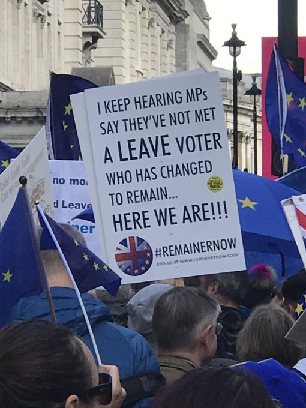
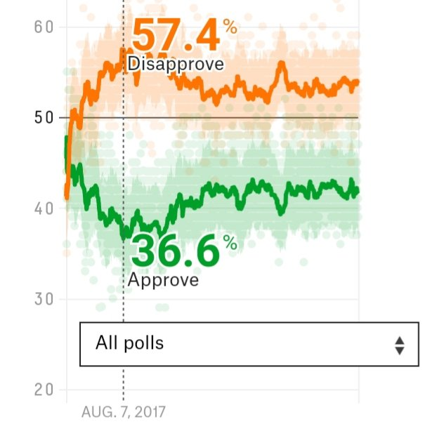

# Week 43

"@GeoffreySupran

Exxon is now misleading the public about its history of misleading the
public (and shareholders)"

[Link](https://mobile.twitter.com/GeoffreySupran/status/1186746748145934337)

---

<blockquote class="twitter-tweet">
The UK company turning waste plastic into fuel for <a href="https://twitter.com/hashtag/HydrogenNow?src=hash&amp;ref_src=twsrc%5Etfw">#HydrogenNow</a> cars <a href="https://twitter.com/hashtag/FCEV?src=hash&amp;ref_src=twsrc%5Etfw">#FCEV</a>. UK company Powerhouse Energy wants to turn this plastic deluge into an opportunity by producing energy from non-recyclable plastics and other waste <a href="https://t.co/CmraQo00T1">https://t.co/CmraQo00T1</a> <a href="https://twitter.com/hashtag/HydrogenCanHelp?src=hash&amp;ref_src=twsrc%5Etfw">#HydrogenCanHelp</a>
&mdash; IEA Hydrogen (@IEA_Hydrogen) <a href="https://twitter.com/IEA_Hydrogen/status/1187057365100695552?ref_src=twsrc%5Etfw">October 23, 2019</a></blockquote> 

---

<blockquote class="twitter-tweet">
Jupiter&#39;s moon Europa has liquid water, and lots of it. Does it harbor conditions suitable for life? Our <a href="https://twitter.com/EuropaClipper?ref_src=twsrc%5Etfw">@EuropaClipper</a> 🛰️ will investigate.  Live now from <a href="https://twitter.com/hashtag/IAC2019?src=hash&amp;ref_src=twsrc%5Etfw">#IAC2019</a>, learn about this <a href="https://twitter.com/NASASolarSystem?ref_src=twsrc%5Etfw">@NASASolarSystem</a> mission from its engineers, scientists and managers: <a href="https://t.co/seQg6AVffc">https://t.co/seQg6AVffc</a> <a href="https://t.co/Rlw9spn5gh">pic.twitter.com/Rlw9spn5gh</a>
&mdash; NASA (@NASA) <a href="https://twitter.com/NASA/status/1187059228726444033?ref_src=twsrc%5Etfw">October 23, 2019</a></blockquote> 

---

I think there are too many aristocrats in the world. You are dead
weight son.

He is in his 30s isnt he? This is a strange kind of millennial.. A
bizarro millennial.

"Prince William warns that there are too many people in the world"

[Link](https://www.telegraph.co.uk/news/2017/11/02/prince-william-warns-many-people-world/amp/)

---

Complaints about China notwithstanding, in the West things might be,
not as bad, but close.

---

Guy on Twitter working for psyop team \#dore

[Link](https://youtu.be/kvCKLLMPVNw?t=133)

---

<blockquote class="twitter-tweet">
At this rate, the food everyone has been stockpiling will be out of date by the time Brexit fucking happens
&mdash; Rosie (@TheRosie) <a href="https://twitter.com/TheRosie/status/1186716687221047297?ref_src=twsrc%5Etfw">October 22, 2019</a></blockquote> 

---

On a different note, fact-checking political ads are ludicrous. Some
people are throwing up their hands in useless exasperation as if such
advertising never existed on TV.

---

AJ Downing and the Buick 6 - The Facebook Song \#music

[Link](https://youtu.be/6ka_yfx_iJg)

---

Telecom analogy is a start, but not perfect. They could break up
regionally. Here friendship graph is the key.

---

Load balancers distribute user traffic, before any major processing is
done. Major processing would be taking data, recommending friends,
etc. which are done by so-called "app servers". Load balancers are
banks of computers / switches that do basic routing before user gets
to app processing. Anti-trust can go in at this level, and do
enforcement on user sharing level.

---

[Data portability - Sen. Warner](https://youtu.be/43UQzOrM9Fk?t=24)

Is this guy serious? SocMed companies are more about relationships
than one person's data. I take my data, but I cannot take my friends
to another company. Advertising might care about that person's data,
but that person is there to be advertised to because of other users.

Then, it might be a good idea to force comps to share their entire
user graph, and the easiest way to do that would be to break them up,
same user should be able to login from FB1, FB2 and see their all
friends. Well maybe this is more of a cloning, than a break-up. Hell
distribute traffic from main domain name to either 1 or 2 to give the
second comp a headstart (e-z to implement at load-balancing or even
DNS level)... Then the third, fourth company would have an easier time
to join in.

---

<blockquote class="twitter-tweet">
Bernie Sanders pledges to end practice of prosecuting whistleblowers under the Espionage Act <a href="https://t.co/I9k2Wv2qrc">https://t.co/I9k2Wv2qrc</a>
&mdash; Ryan Grim (@ryangrim) <a href="https://twitter.com/ryangrim/status/1186737634271518720?ref_src=twsrc%5Etfw">October 22, 2019</a></blockquote> 

---

"WeWork Needed a Bailout—But Adam Neumann Still Leaves a Billionaire" -- bloomberg.com

---

<blockquote class="twitter-tweet">
But if you think of WeWork as a massive transfer of wealth from Saudi Arabia to an Israeli entrepreneur via an ethnic-Korean Japanese visionary it&#39;s really a heart-warming story of cross-cultural trade worthy of the Model UN
&mdash; Chris Anderson (@chr1sa) <a href="https://twitter.com/chr1sa/status/1186855658399752197?ref_src=twsrc%5Etfw">October 23, 2019</a></blockquote> 

---

Groupe Renault introduces \#hydrogen into its light commercial
vehicles range, completes its offer with Renault KANGOO Z.E. Hydrogen
at the end of 2019 and Renault MASTER Z.E. Hydrogen in 2020. Range
triples to over 350 km in 5-10 minutes.

[Link](https://m.marketscreener.com/RENAULT-4688/news/Renault-Groupe-Renault-introduces-hydrogen-into-its-light-commercial-vehicles-range-29432105/)

---

<blockquote class="twitter-tweet">
Kitten tube <a href="https://t.co/CKQkpFNMF0">pic.twitter.com/CKQkpFNMF0</a>
&mdash; Awwwww (@AwwwwCats) <a href="https://twitter.com/AwwwwCats/status/1186264894024404992?ref_src=twsrc%5Etfw">October 21, 2019</a></blockquote> 

---

<blockquote class="twitter-tweet">
7 years ago <a href="https://twitter.com/hashtag/hurricanesandy?src=hash&amp;ref_src=twsrc%5Etfw">#hurricanesandy</a> hit and 1 of every 4 people lost cell and internet service. <a href="https://twitter.com/goTenna?ref_src=twsrc%5Etfw">@goTenna</a> we believe <a href="https://twitter.com/hashtag/decentralized?src=hash&amp;ref_src=twsrc%5Etfw">#decentralized</a> comms networks can increase scale, resiliency, and access to connectivity. Thanks for growing the movement to create and share your own signal. <a href="https://twitter.com/hashtag/imeshyou?src=hash&amp;ref_src=twsrc%5Etfw">#imeshyou</a>. <a href="https://t.co/RCCmJtFNV2">pic.twitter.com/RCCmJtFNV2</a>
&mdash; goTenna (@goTenna) <a href="https://twitter.com/goTenna/status/1186694986781339649?ref_src=twsrc%5Etfw">October 22, 2019</a></blockquote> 

---

The so-called "New Democrats" (which really mean good-ol Republicans)
probably went overboard in their anti-Russkieness to prove to everyone
they were just like Reps.. The way a born-again Christian is more
fervent believer than a regular Christian, they lost their marbs to
prove their security state credentials through this one issue?

A Republican would have nothing to prove, so they can go hard, they
can go soft - whatever. It is a well-known fact HW Bush tried to save
/ help the Soviet state until the last moment (who needs the extra
chaos?). But did the Clintons try too hard during 90s to kick the
Russians when they were already down?

---

3D bioprinting in space. Produced meat in ISS.

[Link](https://youtu.be/v53T991g7HE?t=35)

---

"For five years, the ECB has applied negative interest rates on
commercial bank reserves, and commercial banks have paid €21.4bn to it
in deposit interest. Since it introduced negative interest rates, it
has injected some €2.7 trillion of base money into the Eurozone
economy, increasing M1, the narrower measure of the money quantity, by
61%. Almost all of it has supported the finances of Eurozone
governments.

The effect on broader money, which includes bank credit, has been to
increase M3 by 30%. Far from stimulation, this is daylight robbery
perpetrated on everyone’s liquidity and cash deposits. It is a tax on
the purchasing power of their wages.

The ECB is not alone. Since Lehman went under, the major central banks
have collectively increased their balance sheets from $7 trillion to
$19.4 trillion, an increase of 177%. Most of this monetary expansion
has been to buy government bonds, providing a money-fountain for
profligate governments. The purpose of money-printing is always to
finance government spending, not to stimulate or ease conditions for
the private sector: while some trusting souls in the system believe it
is for the latter, that amounts to just a myth."

[Link](https://www.zerohedge.com/markets/were-being-robbed-central-bank-stimulus-really-huge-redistribution-scheme)

---

"We are looking for an experienced Fuel Cell System Expert to inspire
and lead the powertrain system development in the area and in products
across the Volvo Group. A person who knows that curiosity, a drive for
results and a desire to learn is the key to business success.

In this role you will have a central part in the fuel cell system
concepts and technology strategy selections within the Powertrain
Strategic Development team. You will represent the Volvo Group in both
external, international and internal activities. The role includes
both “hands on” activities in order to support our development
projects, as well as long term energy perspectives". -- Volve Group

[Link](https://www.volvogroup.com/en-en/careers/job-listing/99183BR.html)

---

<blockquote class="twitter-tweet">
Imagine going to the hospital, getting treatment you need and never getting a bill for it or having to pay an insurance premium.  You just imagined every major country except the United States.  We are going to pass Medicare for All and make that a reality in America.
&mdash; Bernie Sanders (@BernieSanders) <a href="https://twitter.com/BernieSanders/status/1186381726387449861?ref_src=twsrc%5Etfw">October 21, 2019</a></blockquote> 

---

It's hard to overstate how well-read these people are. That m..f..ka
would have read everything that was ever written about Islam.

(Major works that is, stuff with academic value).

---

How come Hunting did not take that extra step himself...? Maybe was
being coy.

---

Attempting to "merge" relativity and QM will not work - same
reason. They tried, with these extra dimensions, curling-up, splits,
joins, whatever.. all failed. QM and GR need to be manifestations of
something different, something deeper - a completely different
abstraction. No synthesis. No dialectic.

---

Hell some could build on the latter and say maybe some pol leaders had
div intervention. Story goes Abraham Lincoln used to sit up late at
night and stare outside for hours on end, like a crazy person. Maybe
he experienced some intervention.. ?

---

'Religion as left' does not say anything about divine intervention (or
superuser access to the ancestral simulation). Some could believe
religious leaders were smart, some could say they experienced
intervention and still end up doing the same things.

---

Huntingon said "the great political ideologies of the twentieth
century ... are products of [the West]. No other civilization has
generated a significant political ideology. The West, however, has
never generated a major religion". Great observation - but can be
debunked with religion *is* in fact ideology, and specifically, left
ideology (rooted in pre-agro, pre-village, pre-sheep).

Is dialectic used to reach this concl ? No. This is no "fusing",
"synthesis" btw two disparate things, it is falsification. *Destroy*
the idea of religion as known, then go to a different abstraction, and
say these two events, political ideology and religion, are actually
manifestation of the something else - a rebellion against inequality.

---

Ex-Prez endorsements are tricky. What if he endorses someone and that
person loses? Then the Prez image takes a hit. Usually not
done.. Reagan, and after his death Nancy Reagan would just endorse
whoever won the nom. Same with others AFAIK.

"If Biden is Obama's continuation, why didnt he endorse him?"

---

On healtcare spending Warr Buffy says "healthcare spending is already
approaching 20 cents on the dollar. There is only 100 cents on the
dollar". How bout just saying **percent**? People need to do more to
communicate the situation - cuz it is dire.

---

"Vital innovation, Zuckerberg threatens, will only happen if you’re
nice enough to him and his rich friends.

As common as this argument is, it also happens not to be true. Take
the basis of Mark Zuckerberg’s fortune. The internet was developed out
of a small Pentagon network intended to allow the military to exchange
information during the Cold War. In her book The Entrepreneurial
State, economist Mariana Mazzucato shows that iPhones – the ones that
Facebook skims prolific amounts of data off of to sell to the highest
bidder – are in large part a collection of technologies created by
various state agencies, cobbled together by Apple into the same sleek
case.

Instead of leading the way to improve health outcomes, the quest for
profits in medicine has led drug companies to produce products just
different enough from those of their competitors to patent,
effectively allowing these firms collect rent from the sick" - Aronoff

[Link](https://www.theguardian.com/commentisfree/2019/oct/21/mark-zuckerberg-plea-biillionaire-class-anti-democratic)

---

<blockquote class="twitter-tweet">
This campaign has backfired spectacularly.   They tried to bully everyone to believe we&#39;d leave on the 31st, to grind us down, to accept ANY deal as better than no deal. Nah bruv.  What a waste of our taxes. <a href="https://twitter.com/hashtag/LockThemAllUp?src=hash&amp;ref_src=twsrc%5Etfw">#LockThemAllUp</a> <a href="https://t.co/DXFLtbE7DA">https://t.co/DXFLtbE7DA</a>
&mdash; EU Flag Mafia (@EUflagmafia) <a href="https://twitter.com/EUflagmafia/status/1186169994280951810?ref_src=twsrc%5Etfw">October 21, 2019</a></blockquote> 

---

Re-share. Brexiters up to no good on healthcare.

[Link](https://youtu.be/_HDFegpX5gI?t=385)

---

<blockquote class="twitter-tweet">
Boris Johnson&#39;s trade deal with Donald Trump would see our NHS sold off to US corporations. Labour won&#39;t let this happen.  Tomorrow in parliament we were due to debate Johnson&#39;s harmful plans but he’s pulled it because he doesn&#39;t want his disastrous privatisation agenda exposed.
&mdash; Jeremy Corbyn (@jeremycorbyn) <a href="https://twitter.com/jeremycorbyn/status/1186005307681640448?ref_src=twsrc%5Etfw">October 20, 2019</a></blockquote> 

---

:) \#dog \#rap

[Link](https://twitter.com/dogfather/status/1185711394420740096)

---

[Excerpt](../../2019/10/my-life-clinton.html)

The dynamic explained there still exists BTW, through media,
Internet. Does this mean ppl are even less skillful on politics than
we thought?  They dont even chose a representative, they chose a
thought leader who choses a representative? Not necessarily.. they
still chose a person to follow, who they think knows about an issue
more than they. That also takes skill.

---

<blockquote class="twitter-tweet">
US Intelligence sources estimate that up to THREE MILLION Uighurs are jailed in these camps. The communist party uses prisoner’s live bodies as organ banks. To date, Israel is the only country that’s banned organ tourism to china. We must disengage. <a href="https://twitter.com/hashtag/china?src=hash&amp;ref_src=twsrc%5Etfw">#china</a> <a href="https://twitter.com/AmbCuiTiankai?ref_src=twsrc%5Etfw">@AmbCuiTiankai</a> <a href="https://t.co/JulFl8M5k5">https://t.co/JulFl8M5k5</a>
&mdash; 😷Kyle Bass😷 (@Jkylebass) <a href="https://twitter.com/Jkylebass/status/1186135788959993857?ref_src=twsrc%5Etfw">October 21, 2019</a></blockquote> 

---

The great sin of the white-collar cognateriat = pretension... 

---

So since the crowd has no "wisdom", on the referandum they simply
reflected back the elite divison back to the elite, albeit with
somewhat of a tilt towards Brexit, because they lied better.

---

Another proof that issues are distant to people. He most likely was
regurgitating talking pts from a thought leader he follows.

This is why referandums are unnecessary. People already pick other ppl
to follow ideas of... No need to burden them any further on deciding
on the issues themselves. They have their work, specialty which I am
sure is challenging on its own, but different from government.

<blockquote class="twitter-tweet">
&quot;We must leave&quot; says my neighbour. &quot;So how will that benefit us?&quot; says I. Silence. &quot;Well, all those rules...&quot; comes the eventual response. &quot;Name one,&quot; I challenge. Silence. &quot;So how will leaving the EU benefit us?&quot; I ask again. Silence. Oh, for heaven&#39;s sake! <a href="https://twitter.com/hashtag/StopBrexit?src=hash&amp;ref_src=twsrc%5Etfw">#StopBrexit</a>
&mdash; Chris Davies MEP (@ChrisDaviesLD) <a href="https://twitter.com/ChrisDaviesLD/status/1185896255404331008?ref_src=twsrc%5Etfw">October 20, 2019</a></blockquote> 

---

<blockquote class="twitter-tweet">
Late-night hobby: Creating elaborate designs in <a href="https://twitter.com/tinkercad?ref_src=twsrc%5Etfw">@tinkercad</a>. Feels like Tony Stark every time I press the &quot;group&quot; button and see the solid and hollow objects merge into something fantastic and new. So satisfying. <a href="https://t.co/Rv5PhHpCws">pic.twitter.com/Rv5PhHpCws</a>
&mdash; Mike Senese (@msenese) <a href="https://twitter.com/msenese/status/1185991981610090496?ref_src=twsrc%5Etfw">October 20, 2019</a></blockquote> 

---

Optimization is everywhere, through so many different methods. The x
that will give Ax closest to zero? Eigenvals/vectors bitch!

Nice trick I learned from multiple view geometry back in the day.

---

<blockquote class="twitter-tweet">
I’m puzzled by Leavers claiming that Parliament (voted 2017) is somehow no longer legitimate, while the referendum (voted 2016) has perpetual and immutable significance...  Can a Leaver please explain the logic behind this position?<a href="https://twitter.com/hashtag/StopBrexit?src=hash&amp;ref_src=twsrc%5Etfw">#StopBrexit</a>
&mdash; Citoyen révocateur 🇪🇺🇬🇧🇫🇷🏴󠁧󠁢󠁷󠁬󠁳󠁿🔶 (@polnyypesets) <a href="https://twitter.com/polnyypesets/status/1185872862768447488?ref_src=twsrc%5Etfw">October 20, 2019</a></blockquote> 

---

<blockquote class="twitter-tweet">
Germany: DHL and MAN Receive Millions in Funding from BMVI for <a href="https://twitter.com/hashtag/Hydrogen?src=hash&amp;ref_src=twsrc%5Etfw">#Hydrogen</a> Fuel Cells-<a href="https://twitter.com/DeutschePostDHL?ref_src=twsrc%5Etfw">@DeutschePostDHL</a> receive 9.8M euros to procure 500 <a href="https://twitter.com/hashtag/fuelcell?src=hash&amp;ref_src=twsrc%5Etfw">#fuelcell</a> vehicles. MAN to receive 8.1M euros to develop fuel cell system for heavy-duty trucks-<a href="https://t.co/VjKtl54PCH">https://t.co/VjKtl54PCH</a> <a href="https://twitter.com/hashtag/hydrogenow?src=hash&amp;ref_src=twsrc%5Etfw">#hydrogenow</a> <a href="https://twitter.com/hashtag/decarbonise?src=hash&amp;ref_src=twsrc%5Etfw">#decarbonise</a> <a href="https://t.co/G4mWaa4y89">pic.twitter.com/G4mWaa4y89</a>
&mdash; FuelCellsWorks (@fuelcellsworks) <a href="https://twitter.com/fuelcellsworks/status/1185953952849956864?ref_src=twsrc%5Etfw">October 20, 2019</a></blockquote> 

---

New concoction

[Dried veg](https://www.biostore.com.tr/bio-store-sebze-kurusu-100-g-1735)

[Whey](https://www.decathlon.com.tr/bigjoy-big-whey-chocolate-id_8511158.html)

[Beet](https://www.supergida.com/ayhan-ercan-super-gida-kirmizi-pancar-tozu-250-g)

[Mixed nuts and dried berries other fruits](https://www.ofix.com/tadim-naturel-cig-karisik-kuruyemis-180-g)

[Dry bread](https://www.etietieti.com/eti-form-kizarmis-kepekli-ekmek-dilimleri)

---

Interesting on drones, law, tech 

[Link](https://changelog.com/podcast/366)

---

<blockquote class="twitter-tweet">
Oh hey, what a GIANT surprise!  Hey, here&#39;s a suggestion: make it all legal, then use just HALF of the $50B/year spent on the &quot;War on Drugs&quot; on anti-drug education and treatment centers. Then maybe tens of thousands of people a year won&#39;t be murdered over them! <a href="https://t.co/dBVSRJzltc">pic.twitter.com/dBVSRJzltc</a>
&mdash; Mark B. Spiegel (@markbspiegel) <a href="https://twitter.com/markbspiegel/status/1185914405122383872?ref_src=twsrc%5Etfw">October 20, 2019</a></blockquote> 

---

Augmented Lagrangian Adaptive Barrier Minimization Algorithm =
ALABAMA. An R project apparently.

---

---

That's funny with the deja-vu. But Im still waiting for the cons to
implode.

[Link](https://youtu.be/6tlrqLemJHU)

---

Right. Because the parliament passed a law saying he has to send the
letter. Otherwise he'd be jailed. I'd pay to see that!

"@Philmoorhouse76

So Johnson has told Tusk that he is sending the letter. Seems he
doesn't want to be dragged out of number 10 and thrown in the back of
a police van. Monday just got slightly less interesting"

---

Here is the essence of the MAX debate. 

Let's say a car manufacturer made all their cars to go like this

Now this pose is unstable, too easy for car to fall to either side. So
the manufacturer says "I can fix that, we'll add software detecting
when a car is about to keel over, make a tiny correction immediately,
and keep the car on two wheels".

Fine but the system is still fragile. All this work is being done to
keep a car in an odd position.

Much better to have a car on four wheels and have no correction than
on two with huge amount of correction.

"Oh but we fixed the 737 MAX software"

---

I guess the rule is whenever a Trump official says "not thinking of
stepping down", they are stepping down soon.

---

"@zerohedge

Fed’s Williams: Fiscal Policy Should Be Deployed in a Downturn

Has he seen how much debt the US is issuing in an 'upturn'?"

---

"Number of China Bond Defaults Touches Last Year’s Record" - bloomberg.com

---

<blockquote class="twitter-tweet">
ECB SAYS THERE ARE MILD SIGNS OF OVERSTRETCHED VALUATIONS IN THE EURO AREA IN SOME RISKIER SEGMENTS OF THE FINANCIAL MARKETS  does this have something to do with, oh, the QE you just launched?
&mdash; zerohedge (@zerohedge) <a href="https://twitter.com/zerohedge/status/1185194721498537986?ref_src=twsrc%5Etfw">October 18, 2019</a></blockquote> 

---

The worst DJT net approval reached was -20, check the date, says Aug
2017, during Charlotesville. Even now it is at a boring -12.

---

Vanity Fair insider trade claims, analysis... (thread)

[Link](https://mobile.twitter.com/i/status/1185166766651121664)

---

"[T]he teams at TME and CaetanoBus were able to develop the new
hydrogen fuel cell bus ..  thanks to the strong effort and technical
capability of the engineers while demonstrating the good adaptability
of Toyota’s fuel cell technology beyond the Mirai passenger car.

The stack is located on the bus’s roof and is coupled to 5 hydrogen
tanks with a total capacity of 37.5 kg, giving the bus a range of up
to 400km. It can be refuelled with hydrogen pressurised at 350 bar in
under 9 minutes, and its only emissions are water vapour"

[Link](https://newsroom.toyota.eu/caetanobus-sa-launches-first-hydrogen-bus-with-toyota-fuel-cell-technology/)

---

No - competing against Airbus is not enough. Then you get into that
"national champions" business, harmful IMO for domestic economy in the
long-term.

---

Boeing as the sole aircraft supplier in US is hampering airlines,
after that MAX debacle, there is no alternative US supplier.

Side note: Clinton admin allowed the Boeing / McDonnel Douglas merger
that created this monopoly.

[Link](https://www.irishtimes.com/business/boeing-in-giant-8bn-aircraft-merger-1.116511%3fmode=amp)

---

Eisman of *The Big Short* fame is short TSLA.

[Link](https://youtu.be/XDQYMFKbtvY?t=557)

--- 

I hear there is a certain etiquette among senators - "still a place
where u can trust an agreement on the basis of a handshake", said a
Prez once?

Maybe that's why it took a while for top three Dems to start going at
it...

---

😂😂😂😪😪😪

"ExxonMobil CEO Depressed After Realizing Earth Could End Before They
Finish Extracting All The Oil" -- theonion.com

---

<blockquote class="twitter-tweet">
I&#39;m bringing public ownership back <a href="https://t.co/WyXnNUQn2K">https://t.co/WyXnNUQn2K</a>
&mdash; Andy McDonald MP (@AndyMcDonaldMP) <a href="https://twitter.com/AndyMcDonaldMP/status/1185199502384418817?ref_src=twsrc%5Etfw">October 18, 2019</a></blockquote> 

---

"@MikeHudema

Nestle produced 1.7 million tonnes of plastics last year. That's the
weight of 10 000 blue whales and that needs to stop"

---

Shipping. KEY.

<blockquote class="twitter-tweet">
Hydrogen Will be Bunker Fuel of the Future - Ship &amp; Bunker <a href="https://t.co/0dEIH0EJzC">https://t.co/0dEIH0EJzC</a> <a href="https://twitter.com/hashtag/shipandbunker?src=hash&amp;ref_src=twsrc%5Etfw">#shipandbunker</a> <a href="https://twitter.com/hashtag/IMO2020?src=hash&amp;ref_src=twsrc%5Etfw">#IMO2020</a>
&mdash; William Blomstrand (@william_sw) <a href="https://twitter.com/william_sw/status/1185157399046426624?ref_src=twsrc%5Etfw">October 18, 2019</a></blockquote> 

---

Bitch - the food I eat daily would blow your mind. I'll give you some
food, u take a bite, and you'll fall down and **die**. There'll be
convulsions.. shake.. shake. And a final one...  then freeze -
flatline. Your eyes will be wide-open throughout, when you finally
check out, they will still be open, as if wanting to take that one
last look at that mo..f..ka that just killed you. It's that good.

"But how much better food could you have over there? Sure there are
chains, some bad some good, but you can get good gourmet stuff"...

---

No she didn't do well.

"Did good" or "bad" all depends on the objective. [Dropping that oppo
like it's
hot](https://extranewsfeed.com/drop-that-oppo-like-its-hot-75d60783c6f1)
might not be a good criteria for debate perf. Trump's goal was not an
oppo fight. It was banking on Hillary's (un)likability. All I remember
from the debates some time later now is Trump looking down, constantly
shaking his head and saying "terrible woman... terrible woman", an
underhanded way of silent comdemnation, pointing out to her
likability.

It turns out this was Kellyanne Conway's idea, in a memoir I read, DJ
is not following direction in one case, and KC chides him "I am trying
to make this about her, why don't you let me?".

So given that strategy, debates were a success for Trump.  If criteria
was to "hit a terrible man with bunch of stuff" than it'd be a success
for Hillary. But DJT was playing a different game.

"Hillary did well on all debates, yet she lost"

---

The off-seasons are bad.. so if you are an ineffective campaigner,
tried bunch of times before, that's your slot. During on-season,
they'll find that suave shiny brother with a big smile to swoop in and
take it from you.

---

Remember 2000 Rep primary, largely an empty field. After Clint
impeachment which backfired, incumb popularity was high. The Rep
line-up was McCain (who?), the black-sheep idiot-son of the Bush
family (I guess that's now Jeb), and the "Republican black" cant
remember his name. Empty field.

---

<blockquote class="twitter-tweet">
In a city struggling with homelessness, Amazon is dropping an outrageous amount of money to defeat progressive candidates fighting for working people.  The way Amazon conducts itself in its hometown is a perfect example of the out-of-control corporate greed we are going to end. <a href="https://t.co/E7xfmON3de">https://t.co/E7xfmON3de</a>
&mdash; Bernie Sanders (@BernieSanders) <a href="https://twitter.com/BernieSanders/status/1186300607377920001?ref_src=twsrc%5Etfw">October 21, 2019</a></blockquote> 

---

Yeah. So all that stuff they had him
[say](https://youtu.be/m4yVlPqeZwo?t=1399), they never use, or even
think about. These are computer science interview questions, asked,
and never heard of again - until the next interview.

---

Which other profession does software work resemble most? It's probably
more like construction than rocket science. I already talked abt 90%
of SV do not use math, or even computer science. They are usually
dealing with shuffling shit around, trying to build artificats that
are maintainable, with good enough foundation, and look good - all
these concepts resemble construction and on a visual sense, building
architecture. A project, program manager isn't a like NASA admin, he
is more like a construction foreman.

I am saying this so lawmakers, bureucracy does not treat these ppl as
if they are geniuses. They sure as shit are not.

---

Silicon Valley is like anywhere else in terms of the depth of its
politics. How much would a doctor, lawyer, etc would know? SV's pol
stance is a little Trek, a little Zen, mixed up with little
libertardism, sometimes centrism. The best politically-aware coworker
I knew could drop that spiffy *Team of Rivals* reference, but that
just means you read the *New York Times*. If that were enough there'd
be political genuises all around us already. U need take that [extra
step](../../2018/12/the-road-to-oblivion.html), if not more.

Now there is some backbone, social awereness in open-source circles -
but you won't come across to these guys in polite company.

---

"The worst-case complexity of the simplex method (the number of
arithmetic operations required to solve a general LP) is consequently
exponential in the problem dimension" -- Wright

---

Nice vid on Loop Quantum Gravity.

Background independency is key.

AFAIK Smolin has since moved on to greener pastures, apparently he
lost hope on LQG. His new theory, [the ensemble
approach](https://arxiv.org/abs/1104.2822), is also B.I. but can
reproduce QM formulas in an approximation.

[Link](https://youtu.be/L2suMPiuog4?t=86)

---

<blockquote class="twitter-tweet">
So I learned recently Gasprom is making the Nordstream gas pipeline hydrogen capable; they are quietly getting ready for the future. I wonder how it might change Canada’s pipeline dialogue if all new gas infrastructure had to be ready for any mix of methane, H2+CO, &amp; hydrogen?
&mdash; Chris Bataille (@bataille_chris) <a href="https://twitter.com/bataille_chris/status/1184824684266680323?ref_src=twsrc%5Etfw">October 17, 2019</a></blockquote> 

---

<blockquote class="twitter-tweet">
Diving the tallest building in <a href="https://twitter.com/hashtag/Europe?src=hash&amp;ref_src=twsrc%5Etfw">#Europe</a> (462m), Lakhta Center FPV Freestyle. Source: Alexander Shvedov, <a href="https://t.co/S3WbDlWcFk">https://t.co/S3WbDlWcFk</a> <a href="https://t.co/7oppAZLCSk">pic.twitter.com/7oppAZLCSk</a>
&mdash; Survols (@Survols) <a href="https://twitter.com/Survols/status/1184894107547770881?ref_src=twsrc%5Etfw">October 17, 2019</a></blockquote> 

---

We are all dead.

SEA 'BOILING' WITH METHANE STUNS SCIENTISTS IN SIBERIA.

[Link](https://nypost.com/2019/10/11/sea-boiling-with-methane-stuns-scientists-in-siberia/)

---

"'Fébus' Crowned World’s Best Bus by Busworld Europe"

[Link](https://fuelcellsworks.com/news/van-hool-hydrogen-fuel-cell-bus-febus-crowned-worlds-best-bus-by-busworld-europe/)

---

"@garrygolden

Public infrastructure for Plug-in EVs will not scale and we'll rip
them out in twenty years. Location and coordination costs. Grid
balancing costs. H2 fueling (at scale) is cheaper. 2017 Julich study
Germany. Majority of people can't plug in at home. Fueling station
model scales"

[Link](https://twitter.com/garrygolden/status/1184887375438270465)

---

<blockquote class="twitter-tweet">
You&#39;re only a pessimist if things aren&#39;t actually bad.
&mdash; Joshua Ulrich (@joshua_ulrich) <a href="https://twitter.com/joshua_ulrich/status/1184884440583028736?ref_src=twsrc%5Etfw">October 17, 2019</a></blockquote> 

---

F--in Dubya. This guy was one of the best political operators. There
was a moment after Trump mishaps 2017ish where where he could salvage
his image, he jumps in with a whole new speech complete with a new
self-deprecating joke ("I was misunderestimated"), some other
stories. . When did you pull that off? Do you have speech writers on
hand, waiting for that signal to write the next speech after being
away from pol >8 yrs?  Unbelievable.

---

Brexit is like quicksand. I can't get out.

---

<blockquote class="twitter-tweet">
Look to the future. See the details of tomorrow&#39;s driving technology. The <a href="https://twitter.com/hashtag/BMW?src=hash&amp;ref_src=twsrc%5Etfw">#BMW</a> i Hydrogen NEXT.<a href="https://twitter.com/hashtag/HydrogenNEXT?src=hash&amp;ref_src=twsrc%5Etfw">#HydrogenNEXT</a> <a href="https://t.co/lrJLUYQg94">pic.twitter.com/lrJLUYQg94</a>
&mdash; BMW (@BMW) <a href="https://twitter.com/BMW/status/1184846893567881216?ref_src=twsrc%5Etfw">October 17, 2019</a></blockquote> 

---

"Encyclopedia of Optimization". 

No kidding. It's 4600 pages.

---

<blockquote class="twitter-tweet">
No, no, ‘she’ is not my ‘preferred pronoun’ it’s just my pronoun.   If I had my actual preference then my pronoun would be ‘Her Majesty’.
&mdash; 🎃 Jordan Raskeleton 💀 (@JordanRasko) <a href="https://twitter.com/JordanRasko/status/1184644596313124864?ref_src=twsrc%5Etfw">October 17, 2019</a></blockquote> 

---

[geek]"There is less need for quasi-Newton methods bcz they did bunch of
extra stuff to avoid extra computation but computation became cheaper,
so no more need for the extra monkeying around, says Freund at MIT. I
like it"[/geek]

---

"@lisaabramowicz1

Financier: 'The whole concept of negative yields, of people paying for
the privilege of lending money, is insane behavior to me. I do not pay
to lend money. That’s not fixed-income investing, that’s fixed-loss
investing.'"

[Link](https://twitter.com/lisaabramowicz1/status/1184513879302463490)

---

