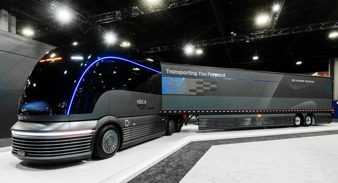
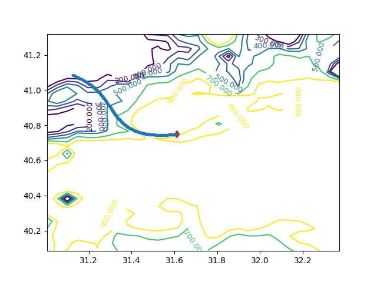

# Week 44
 
"@Femi_Sorry

Trump is now telling British voters (who he needs to support Brexit so
he can do a UK deal) that he's not after our NHS.

But he's telling his own voters (who he needs to elect him next year)
he'll make our NHS pay more for medicines"

---

I liked the old/new mov on its own... it's no T2 but watchable. Davis
is a fine lead.

---

Just watched the Herminator. It is basically a reboot sold as
continuation, and a different movie using all parts of the old, with
the same general outline. So odd.. My first thought was why not create
a new storyline with new characters, and finish the T2 storyline as
is? Fight with Skynet, humanity wins. The end.

---

"@thehill

Keystone pipeline spills over 350,000 gallons of oil in North Dakota"

[Link](http://hill.cm/arMMhv7)

---

Why Fiber is Vastly Superior to Cable and 5G

[Link](https://www.eff.org/deeplinks/2019/10/why-fiber-vastly-superior-cable-and-5g)

---

<blockquote class="twitter-tweet"><p lang="en" dir="ltr">This feature on (Amazon&#39;s) alkaline battery supply chain, environmental impact is sobering read to battery enthusiasts. <a href="https://t.co/hUQA5qDTQ3">https://t.co/hUQA5qDTQ3</a> Battery material supply chains and mfg energy loses are complicated (esp w/ lithium). Far from &#39;efficient&#39; or save the planet solution.</p>&mdash; Garry Golden (@garrygolden) <a href="https://twitter.com/garrygolden/status/1189930537558925312?ref_src=twsrc%5Etfw">October 31, 2019</a></blockquote> <script async src="https://platform.twitter.com/widgets.js" charset="utf-8"></script>

---

Rethinking the Role of Banks in Economics Education by Keen.

That software can generate running code BTW from the differential
equations those diagrams are based on. Econs, check it out.

F--in Krugman still thinks "banks lend deposits they receive from
other customers". What a douche.

[Link](https://youtu.be/3g6-hPFFS_0?t=73)

---

Supermarkets may not make money by selling bread either (low margins,
maybe), but customers would want it, and they'd buy many other things
while they are in the store. I don't pay attn to these atomic,
single-use explanations. 

"Facebook: We have no motive around pol ads, we don't make money from them"

---

Twitter bans political ads. That is their prerogative.

Allowing ads and not filtering, or no ads. 

---

I am a sucker for bios. I use them and ppl in them as filters, as
examplars for a time, a concept, a certain way of living. If you have
SocDyn gene you can build from there. I focus on dividing
characteristics the most, the attribute that creates most
contrast. Like in Jesse Ventura's bio *I Ain't Got Time to Bleed*,

>I might have gone a lot further in Hollywood if I had been willing to
move there.  At one point Arnold Schwarzenegger asked me when I was
going to move out there and become one of the boys. I said, “Well,
what about the schools?”  Arnold replied, “Don’t worry about the
schools. You put your kids in private school.”  That’s what stopped
me. I thought, “I’m not living in a place where my kids have to go to
private school.” I’m not knocking private schools, but I believe that
I owe it to my kids to let them grow up in a place where private
school isn’t required.

This was filed away in my head \>20 yrs ago. Why? It shows a hard-core
left position for someone you might not expect it from (big, brusque,
media guy), it shows clear contrast with some1 from Europe (a place
more left than US), who did not care, so on.

---

No need for anything magical as explanation.. IMO it is the law of
averages. We all know the average, conciously or subconsiously, on
many types of behaviours. Say risk taking, listening,
controlling.. Then we see ppl who are worse than average on these
things, a small fraction of the soc in large for each type, and we act
accordingly, automatically pushing ppl to where they need to be.

"U say sometimes it looks as if everyone conspires to push people in
their development path. How is that possible?"

---

Fitting. Especially thinking how Twain was in his time. Very much
deserved.

"Dave Chappelle accepted the Mark Twain Prize for American Humor, considered the highest accolade in comedy"

---

Snowden, *Permanent Record*

"The NSA described XKEYSCORE, in the documents I’d later pass on to
journalists, as its “widest-ranging” tool, used to search “nearly
everything a user does on the Internet.” The technical specs I studied
went into more detail as to how exactly this was accomplished—by
“packetizing” and “sessionizing,” or cutting up the data of a user’s
online sessions into manageable packets for analysis—but nothing could
prepare me for seeing it in action.

It was, simply put, the closest thing to science fiction I’ve ever
seen in science fact: an interface that allows you to type in pretty
much anyone’s address, telephone number, or IP address, and then
basically go through the recent history of their online activity. In
some cases you could even play back recordings of their online
sessions, so that the screen you’d be looking at was their screen,
whatever was on their desktop. You could read their emails, their
browser history, their search history, their social media postings,
everything [..]

I didn’t type the names of the agency director or the president into
XKEYSCORE, but after enough time with the system I realized I could
have. Everyone’s communications were in the system—everyone’s. I was
initially fearful that if I searched those in the uppermost echelons
of state, I’d be caught and fired, or worse. But it was surpassingly
simple to disguise a query regarding even the most prominent figure by
encoding my search terms in a machine format that looked like
gibberish to humans but would be perfectly understandable to
XKEYSCORE"

---

Kenworth, Toyota Partner on Hydrogen Fuel Cell Class 8 Trucks

[Link](https://t.co/bDELCOY2TM?amp=1)

---

<blockquote class="twitter-tweet"><p lang="en" dir="ltr">shockingly, no. <a href="https://t.co/FR1zKBtP8S">https://t.co/FR1zKBtP8S</a></p>&mdash; A Crime a Day (@CrimeADay) <a href="https://twitter.com/CrimeADay/status/1189595407992741894?ref_src=twsrc%5Etfw">October 30, 2019</a></blockquote> <script async src="https://platform.twitter.com/widgets.js" charset="utf-8"></script>

---

I wonder if Bezos will do a chameo in *Silicon Valley* now. He was
referred to so many times \#s06e01

---

John Witherspoon.. That was one crazy comedian. He made even Letterman
go once "oh c'mon, don't say that!". 

RIP.

---

Found great code for ORBIT. In Matlab though..

Guess wut imma do next 🐍🐍🐍

Tssss. That's right. Don't tread on my lang bitch.

---

When do they update that Quandl data series on earnings?

---

@DriveH2

“We are going to — by the end of the 2020s — bring #fuelcell powered
vehicles to series production,” Roger Nielsen, CEO of @Daimler Trucks
North America.

[Link](https://buff.ly/2NnRh9K)

---

Q3 GDP YOY growth 2.0%. Slowdown..

Down.. down.. down.

```
2018-10-01  2.516496
2019-01-01  2.652241
2019-04-01  2.278320
2019-07-01  2.027586
```

---

Holy hell, do u have enough bikes in that motorcade butch?

[Link](https://mobile.twitter.com/Rschooley/status/1189360977608732672)

---

Epstein thing was an op gone rogue, they thought he could be used for
a certain thing but it was realized pretty quickly the effer
ingratiated himself in too many places, right/left, up/down.. so he
was taken out of the picture.

---

<blockquote class="twitter-tweet"><p lang="en" dir="ltr">It begins...boomers will be vilified for not doing a damn thing about CO2 annihilation of the biosphere...&amp; electing “I dig fossil fuels” clown president <a href="https://t.co/0C95OsEwJX">https://t.co/0C95OsEwJX</a></p>&mdash; H2FC Future Now (@Cgnewday) <a href="https://twitter.com/Cgnewday/status/1189522963357323265?ref_src=twsrc%5Etfw">October 30, 2019</a></blockquote> <script async src="https://platform.twitter.com/widgets.js" charset="utf-8"></script>

---

Local RBF approximation for trust-region based derivative free optimization. I like it.

Method is called ORBIT: Optimization by Radial Basis Function
Interpolation in Trust-Regions.

[Link](https://www.mcs.anl.gov/~wild/papers/2008/SMWRGRCAS07.html)

---

<blockquote class="twitter-tweet"><p lang="en" dir="ltr">How many times do we have to say this?<br>We. Do. Not. Believe. You. <a href="https://t.co/1QX9E7ZzwL">https://t.co/1QX9E7ZzwL</a></p>&mdash; Nicola Sturgeon (@NicolaSturgeon) <a href="https://twitter.com/NicolaSturgeon/status/1189489137461710848?ref_src=twsrc%5Etfw">October 30, 2019</a></blockquote> <script async src="https://platform.twitter.com/widgets.js" charset="utf-8"></script>

---

I always wanted to "do" denoising. I might get my chance, through DFO
(derivative-free opt).

---

"Multi-ethnic, multi-racial workforce" is .. okay, wording-wise.

Better emphasis should be "people who are
<u>&nbsp;&nbsp;&nbsp;&nbsp;&nbsp;&nbsp;&nbsp;&nbsp;&nbsp;</u> (some
attributes noone gives a shit about) who are treated equally for
maximized equal opportunities".

---

Ha ha... technically Warren is a boomer, Bernie is not. 

---

<blockquote class="twitter-tweet"><p lang="en" dir="ltr">Say “OK Boomer” When Your Creative Director Kills Your Ideas Challenge</p>&mdash; 👻 Dongerous Draper 👻 (@dongtent) <a href="https://twitter.com/dongtent/status/1189352273031434246?ref_src=twsrc%5Etfw">October 30, 2019</a></blockquote> <script async src="https://platform.twitter.com/widgets.js" charset="utf-8"></script>

---

"‘OK Boomer’ Marks the End of Friendly Generational Relations. Now it’s war: Gen Z has finally snapped over climate change and financial inequality" 

[Link](https://twitter.com/TaylorLorenz/status/1189208570878922754)

---

<blockquote class="twitter-tweet"><p lang="en" dir="ltr">Our message to corporate elites and the billionaire class: you cannot have it all. Join our March to End Corporate Greed this Friday in Des Moines! RSVP here: <a href="https://t.co/efxlcfHmQN">https://t.co/efxlcfHmQN</a> <a href="https://t.co/wTqTWyk0Wq">pic.twitter.com/wTqTWyk0Wq</a></p>&mdash; Bernie Sanders (@BernieSanders) <a href="https://twitter.com/BernieSanders/status/1189308536318283778?ref_src=twsrc%5Etfw">October 29, 2019</a></blockquote> <script async src="https://platform.twitter.com/widgets.js" charset="utf-8"></script>

---

"Today ... brings a bumper crop of the highest quality, with new
examples from a few of the world’s most prominent theoretical
physicists. Today’s hype neatly exemplifies the two main current
genres of hype about string theory and supposed new fundamental
physics. The first is the old-school genre of string theory hype we’ve
now been seeing for 35 years: “string theory makes a testable
prediction” (no, it doesn’t). The second is the new, post-modern
variety: no actual theory, just a grandiose claim that space and time
have been replaced, although it’s unclear by what" -- Voit

[Link](https://www.math.columbia.edu/~woit/wordpress/?p=11417)


---

"@BernieSanders

It is time to begin thinking about public ownership of major utilities"

---

W00t

"@kateesackhoff

I have the most exciting news! Another Life is coming back for Season
2 on @Netflix! Can’t wait to see you all back in space❤️❤️👽🚀
\#AnotherLife @NXOnNetflix"

---

HyperSolar moves closer to building pilot plant 

[Link](https://www.renewableenergymagazine.com/miscellaneous/hypersolar-moves-closer-to-building-pilot-plant-20191029)

---

<blockquote class="twitter-tweet"><p lang="en" dir="ltr">Consider an F1 pit stop with battery charging 🐌 <a href="https://t.co/PPSF07pi0V">https://t.co/PPSF07pi0V</a></p>&mdash; William Blomstrand (@william_sw) <a href="https://twitter.com/william_sw/status/1188490806807715840?ref_src=twsrc%5Etfw">October 27, 2019</a></blockquote> <script async src="https://platform.twitter.com/widgets.js" charset="utf-8"></script>

---

Late-stage capitalism... It's not just robbing ppl blind, it is now
actively killing you.

In terms of technology: electrification needs to take a backseat, wire
based tech needs to be abandoned. Transmission of energy should be
based on renewable-gas through pipes underground.

And also, yes, this utility needs to be "municipalized". 

"PG&E admits it may have ignited wildfire in California wine country;
tens of thousands evacuate LA area"

[Link](https://www.cnbc.com/2019/10/25/california-utility-pge-admits-it-may-have-ignited-wildfire-as-tens-of-thousands-evacuate-la-area.html)

"PG&E sought approval of a plan to use tax-free state bonds to pay
victims of the blazes"

[Link](https://www.latimes.com/california/story/2019-09-12/pge-wildfires-california-utility-political-fall-bankruptcy)

"Millions of Californians Lost Power Because PG&E Refused to Spend Money to Fix Its Problems"

[Link](https://www.vice.com/en_us/article/a35y38/millions-of-californians-lost-power-because-pgande-refused-to-spend-money-to-fix-its-problems)

---

"@HydrogenFSummit

Bangladeshi scientists plan to turn waste into eco-friendly hydrogen fuel"

---

Derivative free optimization has some nice tricks.. Apparently Michael
J. D. Powell was the man in this area.

---

Wrote abt flow batteries a year ago [here](https://muratk3n.github.io/thirdwave/en/2018/07/battery-fueled-by-iron-and-water.html).
Interesting tech, using cheap materials, and works well at scale. 
Li-On tech slapped down again, labeled as dangerous for the environment, toxic., suffering
from capacity fading.

"@LoganGoldieScot

@ESS_info raises $30m in Series C. Flow batteries continue to attract
interest and venture capital. Lithium-ion remains the one to beat, but
if one of these firms does break through - this will provide an
additional option for developers"

---


<blockquote class="twitter-tweet"><p lang="en" dir="ltr">&quot;The <a href="https://twitter.com/Hyundai?ref_src=twsrc%5Etfw">@Hyundai</a> HDC-6 Neptune Is a Sweet Retro-Futuristic <a href="https://twitter.com/hashtag/FuelCell?src=hash&amp;ref_src=twsrc%5Etfw">#FuelCell</a> Semi-Truck.&quot; Check out the truck concept here: <a href="https://t.co/oPfll0HduV">https://t.co/oPfll0HduV</a> <a href="https://t.co/RYbFYDu1aQ">pic.twitter.com/RYbFYDu1aQ</a></p>&mdash; Energy Independence Now (@DriveH2) <a href="https://twitter.com/DriveH2/status/1189209034492186624?ref_src=twsrc%5Etfw">October 29, 2019</a></blockquote> <script async src="https://platform.twitter.com/widgets.js" charset="utf-8"></script>

---

"@LumijarviAleksi

Europe’s fourth largest steel producer plans to be carbon neutral in
2030 by investing in \#RenewableEnergy based #Electrification and
\#Hydrogen. \#EnergyTransition"

[Link](https://twitter.com/LumijarviAleksi/status/1189197660902903814),
[Link](https://twitter.com/ftenergy/status/1188970399553523712)

---

(Bad guy, at the end) "Go ahead kill me n..er"

(FW) "It's Mister N..er to you!"

---

Just Watched the 1975 cowboy movie *Boss Nigger*, by F. Williamson,
playing the sheriff (wrote and produced the movie, not bad for a ball
player). First wrote abt this movie
[here](https://muratk3n.github.io/thirdwave/en/2011/12/blaxploitation.html).

How much of a slur was the N-word in the movie? The deputy (also
black) locks up a man for using it in public. It was a slur, but then
everyone kept using it. Sort of like now I guess.

---

<blockquote class="twitter-tweet"><p lang="en" dir="ltr">Just in case you needed a reminder of all the LIFE you can fit into cities when you rethink streets for cars. Space for green &amp; nature that supports great urbanism, and space for PEOPLE!<br>Via <a href="https://twitter.com/watgdesigns?ref_src=twsrc%5Etfw">@watgdesigns</a> <a href="https://twitter.com/LondonNPC?ref_src=twsrc%5Etfw">@LondonNPC</a>, <a href="https://twitter.com/hashtag/NationalParkCity?src=hash&amp;ref_src=twsrc%5Etfw">#NationalParkCity</a> Fleet Street vision. <a href="https://t.co/1vtN8DoVpN">pic.twitter.com/1vtN8DoVpN</a></p>&mdash; Brent Toderian (@BrentToderian) <a href="https://twitter.com/BrentToderian/status/1189057603915005957?ref_src=twsrc%5Etfw">October 29, 2019</a></blockquote> <script async src="https://platform.twitter.com/widgets.js" charset="utf-8"></script>

---

Hyundai debuts HDC-6 NEPTUNE Concept, a hydrogen-powered Class 8 heavy duty truck



[Link](https://www.hyundainews.com/en-us/releases/2896)

---

I want to believe 😇😇😇👽👽👽 

---

E.T. existence is not unlikely. I could not disprove it easily from
[data](https://muratk3n.github.io/thirdwave/en/2015/08/ufo.html).

E.T. hiding from humans actually explains the absence of contact, the
so-called Fermi Paradox.

---

I follow Steven Greer sometimes (the UFOlogist), and about some event
he'll say "the E.T. will not allow it!". This one topic was about
nukes in space, apparently we tried to put nukes there, E.T. destroyed
it. So they don't allow nukes in space.

Now I find myself trying to figure out the politics of E.T. What would
they be for? Would they be for tax cuts? Or against tax cuts?  They
are not climate skeptics apparently (so says SG). I think there is
more mystery here than the E.T.

---

If that birth is correct, it's date would be September 11, 1973. You
read that correctly, 9/11. In fact Chileans call that day "our 9/11".

Dying in Chile.. wouldn't that be a gas?


---

It'd be better wout support for bitch BEVs but equal access is
fine. We'll kick their ass on equal ground.

<blockquote class="twitter-tweet"><p lang="en" dir="ltr">From <a href="https://twitter.com/SenSchumer?ref_src=twsrc%5Etfw">@SenSchumer</a> and <a href="https://twitter.com/nytimes?ref_src=twsrc%5Etfw">@nytimes</a>: &quot;A new proposal designed to rapidly phase out gas-powered vehicles and replace them with zero-emission, or “clean,” vehicles.&quot; Inclusion of both <a href="https://twitter.com/hashtag/BEVs?src=hash&amp;ref_src=twsrc%5Etfw">#BEVs</a> and <a href="https://twitter.com/hashtag/FCEVs?src=hash&amp;ref_src=twsrc%5Etfw">#FCEVs</a> makes this plan accessible to all! <a href="https://twitter.com/hashtag/ZEVsForAll?src=hash&amp;ref_src=twsrc%5Etfw">#ZEVsForAll</a> <a href="https://t.co/WANnUupTxG">https://t.co/WANnUupTxG</a> <a href="https://t.co/oOE48hD0jc">pic.twitter.com/oOE48hD0jc</a></p>&mdash; Energy Independence Now (@DriveH2) <a href="https://twitter.com/DriveH2/status/1188912326214377473?ref_src=twsrc%5Etfw">October 28, 2019</a></blockquote> <script async src="https://platform.twitter.com/widgets.js" charset="utf-8"></script>

---

DJT net popularity fell to -14%. Approval 40%, disproval 54% (from
438). But this one came back from -16%. 

Gallup looks bad.

The Kurdish thing might have effected things; Ukraine by itself could
be defended but two two big events may be eating into his popul. 

[538](https://projects.fivethirtyeight.com/trump-approval-ratings/)

[Gallup](https://news.gallup.com/poll/203207/trump-job-approval-weekly.aspx)

---

"@SebHenbest

In green hydrogen there is so many low hanging fruits to
get cost declines, we almost don't know where to start! says Jon Andre
Lokke from @nelhydrogen at #bnefsummit. And Jon Andre Lokke says this
so convincingly, he's silenced my inner skeptic"

[Link](https://mobile.twitter.com/SebHenbest/status/1186631355263868928)

--

\#surf

[Link](https://mobile.twitter.com/ValaAfshar/status/1188471534148567043)

---

Great. More left. Left everywhere.

We need more alternation between true left and right - instead of
going between Mush \#1, Mush \#2, etc.. True left brings healthcare if
missing, true right can deregulate if too much, it goes on.. Mush
provides no selection. It's policy positions are a mush; a little bit
of everything, which means nothing. Same shit policies with different
faces. That is exactly how we got here.

"Argentina’s Peronists swept back into power on Sunday, ousting
conservative president Mauricio Macri in an election result that
shifts Latin America’s No. 3 economy firmly back toward the left after
it was battered by economic crisis"

---

B1 bombers to Saudi Arabia? "Saudi led" war on Iran is near?

---

Halloween is a pagan celebration, not Christian.

So is Catholicism, a continuation of paganism, a Romanized version of
Christianity.

---

"@jyjault

Mitsubishi does fuel cell, or at least intends to do so in the
future. Every traditional OEM, whether they admit it or not, is
working on fuel cell programs. Some are more mature than others, but
everybody’s doing it. Even those who only swear by BEV, seemingly"

---

I read Jackie Chan's autobiography, somewhere in it he says something
like being proud of his China heritage.. But he is from
Hong-Kong. Wonder what he thinks now, because the protestors in HK
find mainland CH system as illegitimate, their old system as
better. JC owes much of his fame and success to Hong-Kong. System-wise
and culturally, Taiwan, HK are the free Chinese, and the mainland CH
are the outsiders in this picture, seen as illegitimate.

---

"@MagnusThomassen

Combustion is so last century. Electrochemical conversion is the future!"

---

Hah. Snowden is straight pilgrim from his mother's side, going back to the [Mayflower](week36.html#mayflower).
Very cool. 

---

<blockquote class="twitter-tweet"><p lang="en" dir="ltr">Life is too short to wait hours. <a href="https://twitter.com/hashtag/Hydrogen?src=hash&amp;ref_src=twsrc%5Etfw">#Hydrogen</a> <a href="https://t.co/4kogi76cNw">pic.twitter.com/4kogi76cNw</a></p>&mdash; cH2ange (@cH2ange) <a href="https://twitter.com/cH2ange/status/1188500608988393477?ref_src=twsrc%5Etfw">October 27, 2019</a></blockquote> <script async src="https://platform.twitter.com/widgets.js" charset="utf-8"></script>

---

<blockquote class="twitter-tweet"><p lang="en" dir="ltr">Professor of Combustion tech at Royal Institute of Stockholm says the fuel cell is the Joker in the game. - couldn’t agree more. <a href="https://t.co/1iRWftlFt9">https://t.co/1iRWftlFt9</a></p>&mdash; William Blomstrand (@william_sw) <a href="https://twitter.com/william_sw/status/1188443548003246080?ref_src=twsrc%5Etfw">October 27, 2019</a></blockquote> <script async src="https://platform.twitter.com/widgets.js" charset="utf-8"></script>

---

Snowden, *Permanent Record*

"On Constitution Day 2012, I picked up the document in earnest... I
read through it in its entirety, from the Articles to the
Amendments. I was surprised to be reminded that fully 50 percent of
the Bill of Rights, the document’s first ten amendments, were intended
to make the job of law enforcement harder. The Fourth, Fifth, Sixth,
Seventh, and Eighth Amendments were all deliberately, carefully
designed to create inefficiencies and hamper the government’s ability
to exercise its power and conduct surveillance...

In fact, many of the rights ... aren’t even provided for in law except
by implication. They exist in that open-ended empty space created
through the restriction of government power. For example, Americans
only have a “right” to free speech because the government is forbidden
from making any law restricting that freedom, and a “right” to a free
press because the government is forbidden from making any law to
abridge it. They only have a “right” to worship freely because the
government is forbidden from making any law respecting an
establishment of religion, and a “right” to peaceably assemble and
protest because the government is forbidden from making any law that
says they can’t" 

---

Have a feeling these "followers of Otto" have been supported by
Germany for a long time, owing to the WWI alliance back in the day?
"Pan-Otto" ideals were supported by DE then bcz they were hoping it
would destabilize the British in Asia. Hopefully this support
ends. It'll lead nowhere good. There are as many Kurds as tigger in
Germany, and their clashes can
[harm](thelocal.de/20191019/we-are-sitting-on-a-powderkeg-germanys-turks-and-kurds-in-uneasy-stand-off)
regular citizens.

---

<blockquote class="twitter-tweet"><p lang="en" dir="ltr">Iraq<br>Lebanon<br>Chile<br>Ecuador<br>Bolivia<br>Barcelona<br>Hong Kong<br>South Korea<br>Egypt<br>Algeria<br>Guinea<br>Haiti<br><br>October has witnessed anti-government protests break out across the world. <a href="https://t.co/osChGM8eu0">pic.twitter.com/osChGM8eu0</a></p>&mdash; H. Sumeri (@IraqiSecurity) <a href="https://twitter.com/IraqiSecurity/status/1188179053867683846?ref_src=twsrc%5Etfw">October 26, 2019</a></blockquote> <script async src="https://platform.twitter.com/widgets.js" charset="utf-8"></script>

---

Even if media, ppl influences didn't exist, same culture codes would
still be transmitted. They say Americans are loud. Well it's a huge
country. I bet if you calculate the distance ppl stand from eachother
on average, it'd come out to be higher than, say, Hong Kong. So ppl
speak louder to make themselves heard. It's physics.

---

Bin Laden was also "served" when time was right. He was found close to
Pakistani military barracks. "Oh but that's the best place to hide, in
plain sight". No it isn't. That's just movie bullshit.

---

Wonder if someone gave Baghdadi up to US in return for its leaving
Syria so DJT could show a win, and help quell fears in media about
Isis?

It looks very much like he was "served" when the time was right.

1 less terrorist is a good thing obviously.

---

"Senator Chuck Schumer, the top Senate Democrat, on Thursday proposed a $454 billion plan over 10 years to help shift the US away from gasoline-powered vehicles by offering cash vouchers to help Americans buy cleaner vehicles."

[Link](https://mobile.twitter.com/GrahamCooley4/status/1188137384338251777)

---

Bernie will "appoint an Attorney General who will prosecute the fossil
fuel executives who knowingly contributed to the climate crisis" 😬 👍

---

US Military Could Collapse Within 20 Years Due to Climate Change,
Report Commissioned By Pentagon Says....

The report was commissioned by General Mark Milley, Trump's new
chairman of the Joint Chiefs of Staff, making him the highest-ranking
military officer in the country

[Link](https://www.vice.com/amp/en_uk/article/mbmkz8/us-military-could-collapse-within-20-years-due-to-climate-change-report-commissioned-by-pentagon-says)

---

<blockquote class="twitter-tweet"><p lang="en" dir="ltr">The premise of capitalism is rarely stated so bluntly: let the wealthy do what they want and they&#39;ll give to charity, or try to tax them and they&#39;ll implement the Final Solution <a href="https://t.co/1EPxL1bLw8">https://t.co/1EPxL1bLw8</a></p>&mdash; David Klion🔥 (@DavidKlion) <a href="https://twitter.com/DavidKlion/status/1188119822082760706?ref_src=twsrc%5Etfw">October 26, 2019</a></blockquote> <script async src="https://platform.twitter.com/widgets.js" charset="utf-8"></script>

---

NDGT is a good educator, an entertainer even - an
"edutainer"?. Popularizing science is a good thing. Being the final
authority on everything scientific ... something else.

---

Mike Brown, @plutokiller, of CalTech is the professor who killed Pluto
BTW (hence his Twitter handle), he de-classified it from its planet
status, not de Grasse Tyson.

"@plutokiller

[S]ometimes I leave things on top of my car. they don't usually stay
there once I hit the freeway. though once I made it all the way to my
office with a mug of coffee still on my roof. parked. drank
it. morning off to a good start. today was less good"

---

"@FortuneIndia

Why Indian Oil Corporation believes hydrogen fuel cells and not
lithium-ion batteries may revolutionise electric vehicles in India"

[Link](https://mobile.twitter.com/FortuneIndia/status/1188347857712992256)

---


Warren team's fake ad on Facebook is tactical move, throwing red meat
to centrists who are the most feverish anti-Trumpers. I dont agree
with it (political ads should not be filtered), but it can be
effective for Warren. This is how playing the game looks like. It's
ugly.

Related: [Yo Bitch](https://muratk3n.github.io/thirdwave/en/2018/04/yo-bitch.html)

---

<blockquote class="twitter-tweet"><p lang="en" dir="ltr">Totally. It&#39;s like saying AM talk radio is destroying democracy <a href="https://t.co/y99ddGKqNK">https://t.co/y99ddGKqNK</a></p>&mdash; Chris Anderson (@chr1sa) <a href="https://twitter.com/chr1sa/status/1188302369584340993?ref_src=twsrc%5Etfw">October 27, 2019</a></blockquote> <script async src="https://platform.twitter.com/widgets.js" charset="utf-8"></script>

---

Half of Australia’s cars could run on hydrogen by 2040 -- thenewdaily.com.au

[Link](https://thenewdaily.com.au/money/finance-news/2019/10/25/hydrogen-cars-2040-kpmg/)

---

Great article by Zizek

[Link](http://www.independent.co.uk/voices/kurds-syria-trump-turkey-rojava-macedonia-greece-zizek-a9166206.html)

---

<blockquote class="twitter-tweet"><p lang="en" dir="ltr">Future of <a href="https://twitter.com/hashtag/Hydrogen?src=hash&amp;ref_src=twsrc%5Etfw">#Hydrogen</a>-Based Communities a Step Closer with H2City Launch-H2City is the result of a four-way collaboration between KPMG, ATCO, CSIRO, together with Australian Renewable Energy Agency (ARENA)-<a href="https://t.co/fNn9bCk69J">https://t.co/fNn9bCk69J</a> <a href="https://twitter.com/hashtag/hydrogennow?src=hash&amp;ref_src=twsrc%5Etfw">#hydrogennow</a> <a href="https://twitter.com/hashtag/fuelcells?src=hash&amp;ref_src=twsrc%5Etfw">#fuelcells</a> <a href="https://twitter.com/hashtag/decarbonise?src=hash&amp;ref_src=twsrc%5Etfw">#decarbonise</a> <a href="https://twitter.com/hashtag/zeroemissions?src=hash&amp;ref_src=twsrc%5Etfw">#zeroemissions</a> <a href="https://t.co/Vr7WblC312">pic.twitter.com/Vr7WblC312</a></p>&mdash; FuelCellsWorks (@fuelcellsworks) <a href="https://twitter.com/fuelcellsworks/status/1188071067849494528?ref_src=twsrc%5Etfw">October 26, 2019</a></blockquote> <script async src="https://platform.twitter.com/widgets.js" charset="utf-8"></script>

---

The thing abt Greta is she is old enough to have figured out some
stuff, but she still looks somewhat childish, has that fat face, round
head, etc. So it's like 'we are failing this infant'. That is the most
disturbing thing abt her.

---

"@ClimateAdam

People who want no action on climate change have always attacked the
messengers so they can avoid even engaging with the message"

[Link](https://mobile.twitter.com/ClimateAdam/status/1186898867503190017)

---

"@telesurenglish

Coca-Cola is the most polluting brand in the world"

[Link](https://mobile.twitter.com/telesurenglish/status/1187526865470312450)

---

<blockquote class="twitter-tweet"><p lang="en" dir="ltr">This Canadian fuel-cell pioneer has hung on for four decades without posting a profit. That might be about to change <a href="https://t.co/uCZDsaXhf9">https://t.co/uCZDsaXhf9</a></p>&mdash; William Blomstrand (@william_sw) <a href="https://twitter.com/william_sw/status/1187792827108986881?ref_src=twsrc%5Etfw">October 25, 2019</a></blockquote> <script async src="https://platform.twitter.com/widgets.js" charset="utf-8"></script>

---

<blockquote class="twitter-tweet"><p lang="en" dir="ltr">VIPER will help inform where we send humans on future lunar missions. We hope to harvest the water ice (H2O) and use oxygen (O) for air to breathe and hydrogen (H) &amp; oxygen to fuel future landers and rockets. I’m looking forward to this <a href="https://twitter.com/NASAMoon?ref_src=twsrc%5Etfw">@NASAMoon</a> science! <a href="https://t.co/5BaOEAfN01">https://t.co/5BaOEAfN01</a> <a href="https://t.co/45fxXhU7J7">pic.twitter.com/45fxXhU7J7</a></p>&mdash; Thomas Zurbuchen (@Dr_ThomasZ) <a href="https://twitter.com/Dr_ThomasZ/status/1187758132367429634?ref_src=twsrc%5Etfw">October 25, 2019</a></blockquote> <script async src="https://platform.twitter.com/widgets.js" charset="utf-8"></script>

---

"There is really an enormous number of problems where derivatives are
unavailable but one has imperative practical reasons for wanting to do
some optimization. It is almost a natural perversity that practical
problems today are often complex, nonlinear, and not sufficiently
explicitly defined to give reliable derivatives. Indeed, such problems
were always numerous, but, 30 years ago, when nonlinear optimization
techniques were relatively more naive than they are today, even the
most optimistic practitioners would not try to optimize such complex
problems." \#introDerivativeFreeOpt

---

"@brexit_sham

Juncker: 'I should have intervened in EU referendum...they were saying
things, some of them lying...Telling the people things which have
nothing to do with our day by day reality...but David Cameron asked me
not to...'"

---

Autograd lost its shit. COBYLA it is.



---

Almond milk is awesome.

---

General Wesley Clark: Seven Countries In Five Years

[Link](https://youtu.be/-MqVY1-ncBI)

---

<blockquote class="twitter-tweet"><p lang="en" dir="ltr">The <a href="https://twitter.com/MercedesBenz?ref_src=twsrc%5Etfw">@MercedesBenz</a> GLC F-CELL is in service with the <a href="https://twitter.com/PolizeiHamburg?ref_src=twsrc%5Etfw">@PolizeiHamburg</a>. This is the world&#39;s first F-CELL in police service. The car is a very special plug-in hybrid, as apart from <a href="https://twitter.com/hashtag/electricity?src=hash&amp;ref_src=twsrc%5Etfw">#electricity</a>, it also runs on pure <a href="https://twitter.com/hashtag/hydrogen?src=hash&amp;ref_src=twsrc%5Etfw">#hydrogen</a>.<a href="https://twitter.com/hashtag/HydrogenNow?src=hash&amp;ref_src=twsrc%5Etfw">#HydrogenNow</a> <a href="https://twitter.com/hashtag/FuelCellsNow?src=hash&amp;ref_src=twsrc%5Etfw">#FuelCellsNow</a><a href="https://t.co/phHUA9DqEG">https://t.co/phHUA9DqEG</a> <a href="https://t.co/daOkHoNsHh">pic.twitter.com/daOkHoNsHh</a></p>&mdash; Hydrogen Europe (@H2Europe) <a href="https://twitter.com/H2Europe/status/1187399094320484353?ref_src=twsrc%5Etfw">October 24, 2019</a></blockquote> <script async src="https://platform.twitter.com/widgets.js" charset="utf-8"></script>

---

Great interview \#rogan \#snowden

[Link](https://youtu.be/efs3QRr8LWw)

---

That's funny - someone created a Git repo for the US constitution and
committed changes to the repo in the same order the changes were made
to the USC.

It'd even be better if he set the date back to orig date. 

Can I make a pull-request now? :) Imagine law being made this way.

[Link](https://github.com/JesseKPhillips/USA-Constitution)

---

Some bitch ass jamming right there \#music

[Link](https://youtu.be/1U3UiZvqXcU?t=151)

---

Right, Reagan endorsed W before nomination **but**, by the time he
did, W nom was a sure thing. 

---
