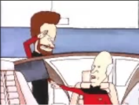
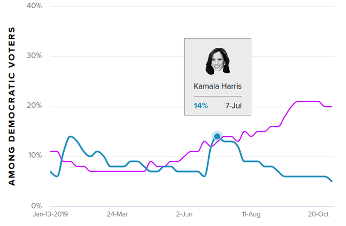

# Week 46

Boom.

"Leaked documents from the Ukrainian General Prosecutor’s office
indicate complex money transfers from foreign sources into the control
of a “slush fund” owned and operated by Devon Archer, John Kerry
Senior, John Kerry Junior, Heinz Jr, and Hunter Biden."

---

Store energy, desalinate at the same time. Crazy.

"Non-noble metal-nitride based electrocatalysts for high-performance alkaline seawater electrolysis"

[Link](https://www.nature.com/articles/s41467-019-13092-7)

---

Good time to think abt which open source software / how much to take
in a digital luggage to another planet? OS, numerical software,
compilers, for sure. How much of Github could 1 take I wonder.

---

Great idea. 

"@valleyhack Unusual one here. Went to Svalbard with the CEO of GitHub
because they've stored the world's open source software in an ice cave
for safe keeping"

---

Gigadouche

"@kerooke

When I bought my Tesla Model 3, it had 386km of range.

I've already lost 200km+ of range due to cold weather"

[Link](https://twitter.com/kerooke/status/1194350147486044160)

---

<blockquote class="twitter-tweet">
Lol, let&#39;s face it: at this point <a href="https://twitter.com/search?q=%24TSLA&amp;src=ctag&amp;ref_src=twsrc%5Etfw">$TSLA</a> is just a trading sardine on an air pocket, with only the dumbest of the dumb (that would be YOU, Baillie Gifford) thinking it&#39;s anything more than that.
&mdash; Mark B. Spiegel (@markbspiegel) <a href="https://twitter.com/markbspiegel/status/1194583824056934400?ref_src=twsrc%5Etfw">November 13, 2019</a></blockquote> 

---

Some like SNG (synthetic natural gas) which can be used like NG,
created by mixing H2 with CO2. But SNG is methane just like NG, that
is worrying, for leakage.  I stick to the position where fossil
converted into H2 at the source, then all the way down the line fuel
stays clean. This is the safest choice.

---

Excellent. They also bought a TR bus company recently, so they could
be another entry vector for our favorite green fuel into the country.

<blockquote class="twitter-tweet">
<a href="https://twitter.com/hashtag/SymbioH2?src=hash&amp;ref_src=twsrc%5Etfw">#SymbioH2</a> <a href="https://twitter.com/FlixBus_FR?ref_src=twsrc%5Etfw">@FlixBus_FR</a> may soon be operating European-made <a href="https://twitter.com/hashtag/hydrogen?src=hash&amp;ref_src=twsrc%5Etfw">#hydrogen</a> coaches.  “A hybrid system that properly combines the battery and <a href="https://twitter.com/hashtag/fuelcells?src=hash&amp;ref_src=twsrc%5Etfw">#fuelcells</a> is especially practical for heavy vehicles that cover long distances&quot;. <a href="https://t.co/s9UPg0Ioaq">https://t.co/s9UPg0Ioaq</a> via <a href="https://twitter.com/pvmagazine?ref_src=twsrc%5Etfw">@pvmagazine</a>
&mdash; Symbio (@SymbioFCell) <a href="https://twitter.com/SymbioFCell/status/1194661398263013377?ref_src=twsrc%5Etfw">November 13, 2019</a></blockquote> 

---

HySiLabs has a new H2 carrier tech, called Hydrasil. Works at room temp, a liquid, converts to H2 on demand through simple process.

<blockquote class="twitter-tweet">
<a href="https://t.co/sTxt5Ju1f8">https://t.co/sTxt5Ju1f8</a> <a href="https://twitter.com/hashtag/HydrogenFuelsSummit?src=hash&amp;ref_src=twsrc%5Etfw">#HydrogenFuelsSummit</a>
&mdash; World Hydrogen Fuels (@HydrogenFSummit) <a href="https://twitter.com/HydrogenFSummit/status/1194540024605401090?ref_src=twsrc%5Etfw">November 13, 2019</a></blockquote> 

---

<blockquote class="twitter-tweet">
The crew has begun the return to shore with System 001/B. With this system, we have confirmed the core concept of the cleanup technology design and have completed all planned trials. We will now look to the next big steps for 2020 - find out more on December 12. <a href="https://t.co/wHkjje6aeP">pic.twitter.com/wHkjje6aeP</a>
&mdash; The Ocean Cleanup (@TheOceanCleanup) <a href="https://twitter.com/TheOceanCleanup/status/1194631162938839041?ref_src=twsrc%5Etfw">November 13, 2019</a></blockquote> 

---

Quickie deal with EU after exit? Verhofstadt says it took 7 years to
make a deal with Canada... Canada! A bigger market for the EU than
UK. I bet the reason it took so long is that these deals are a form of
regulatory sync, a merger so to speak. Then the question for UK is why
try to re-merge with EU when you are already merged? Already on the
best deal ever! (outside of Euro, with bunch of eased requirements,
rebates, so on).

---

<blockquote class="twitter-tweet">
LIVE | SC asked the Centre to explore Hydrogen based fuel technology to find a solution to reduce air <a href="https://twitter.com/hashtag/pollution?src=hash&amp;ref_src=twsrc%5Etfw">#pollution</a> in North India and Delhi-NCR.  Follow for updates:<a href="https://t.co/0qMhKfrZmk">https://t.co/0qMhKfrZmk</a>
&mdash; The Quint (@TheQuint) <a href="https://twitter.com/TheQuint/status/1194507892650467329?ref_src=twsrc%5Etfw">November 13, 2019</a></blockquote> 

---

@ToryFibs

These are the most important 40 seconds of this entire General Election. Twice the BBC asked Boris Johnson if he would rule out more NHS privatisation. Twice he refused to say yes.

---

Ops talked to the wrong Remainer

[Link](https://mobile.twitter.com/mikegalsworthy/status/1194376085812760576)

---

"The Federal Aviation Administration, which approved the design of the
jet in 2017, dropped the ball on many fronts, the Joint Authorities
Technical Review found"

[Link](https://www.latimes.com/business/story/2019-10-11/regulators-were-in-the-dark-over-design-changes-on-boeing-737-max)

---

Good call. I wont fly in that f-ing thing - telling u right now.

"Boeing orders sink as customers opt to swap MAX"

[Link](https://www.reuters.com/article/us-boeing-deliveries/boeing-orders-sink-as-customers-opt-to-swap-max-idUSKBN1XM24M)

---

One of the benefits of engineering education (not CS) having taken a course
on Autocad. I might get on this 3D printing craze one day.

---

Shaq-Fu. I know a guy who knows a guy who played this game. Vintage 90s. Legendary.

---

"@mtmalinen

No. Let me clear this to you, my colleagues. 

The missing piece from our models, with relative high certainty, is
the banking sector.

If it's broken ("zombified"), the mon. policy transmission mechanism
does not work.

You're welcome. 🙂"

[Link](https://twitter.com/mtmalinen/status/1194169068040970241)

---

"@larrykim

\#MondayMotivation:  

🦄What Monday looks like. 

Expectation vs reality"

[Link](https://twitter.com/larrykim/status/1193815628953600001)

---

"@HZB_BESSY

How long does an electron stay in the BESSY II storage ring?Round and
round it goes for up to 10 hours during which it travels the
equivalent of the distance between the sun and earth about 75 times!!!"

---

Stoller, *Goliath*

"[T]he musical Hamilton .. offered a capstone to the era of the
Watergate Baby generation. The musical celebrated a telling of history
in which Alexander Hamilton, the founding father Democrats had
traditionally associated with the banker-friendly Republican Party and
a self-proclaimed elitist who created Wall Street and distrusted
democracy, had somehow become an icon of progressive thinking and
national greatness. He had become a left-wing political hero, instead
of the traditional enemy of democracy that historians—and members of
the Democratic Party—understood him as for two hundred years ... Obama
said that enjoying Hamilton was the only thing he and Republican Dick
Cheney—the former vice president—agreed on. The musical reflected an
ideological takeover, not left or right, but a joint attack on
populism".

---

DACA: If u spend ur formative years in US, like the Dreamers, you are
culturally from there. WH 'hostage taking" i.e. Dreamers for the Wall
did not work. What's the use for the intransigence on this? 

---

"The constants of our universe seem to be perfectly dialed, how come?"
and "constants are probably result of set of formulas we havent
discovered yet". The 2nd statement answers the 1st question. Since 20+
constants are a cop-out anyway, result of yet undiscovered formulas
that describes something optimal, no need to worry abt what would
happen if constant X was off by .0001. It would not be because the
not-yet discovered formula would replace it completely. Constant X is
just a placeholder, a result of our ignorence. 

---

Yes this is fine, granted they can do 100% carbon capture while
generating H2. But Im pretty sure they can.

"The Australian, Japanese and Victorian Governments alongside a
consortium of companies, will begin piloting an innovative project
that will see brown coal from the AGL Loy Yang mine converted into
hydrogen.

Through this process the hydrogen will be transported by road to a
liquefaction terminal at the Port of Hastings before being shipped to
Japan for use in fuel cell electric vehicles and power generation"

[Link](https://www.worldcoal.com/power/11112019/consortium-lays-foundation-for-a-hydrogen-industry-in-the-latrobe-valley/amp/?__twitter_impression=true)

---

"Today's Electric Car Batteries Will Be Tomorrow's E-Waste Crisis, Scientists Warn"

[Link](https://www.vice.com/en_us/article/ywajkw/todays-electric-car-batteries-will-be-tomorrows-e-waste-crisis-scientists-warn)

---

Last time I went to TR Kitchen for dinner must have been on Mar 1
2003, or the day before. I bought Mar 1 edition of NYT and the cover
had [this](https://archive.nytimes.com/www.nytimes.com/indexes/2003/03/01)

It was the parliamentary vote on allowing US mil for an attack on
Iraq. Guy with the mustache is from the center left party, the sign
says "No To War".

I remember showing the cover to the attendant while waiting to be
seated. Tigger was worried, prob on econ etc reasons, but also, for
fear of his resto being attacked or something. Who knows who the next
enemy would be then? I was happy abt the vote.

Feels like ages ago. We all got the shit kicked out of us since,
didn't we?

---

<blockquote class="twitter-tweet">
<a href="https://twitter.com/search?q=%24BLDP&amp;src=ctag&amp;ref_src=twsrc%5Etfw">$BLDP</a> (except for 1 day in 2014) just broke out to a 12yr high
&mdash; dantes trading (@dantestrading) <a href="https://twitter.com/dantestrading/status/1193912007147307008?ref_src=twsrc%5Etfw">November 11, 2019</a></blockquote> 

---

"Equilibrium thinking in economics has clearly traceable historical
roots. Chapter 1 of Eric Beinhocker’s book is a wonderful summary of
where it comes from. In short: it comes from equilibrium
thermodynamics — the study of gases, liquids, solids, under conditions
where everything is allowed to come to rest. This field developed in
the 19th century when people were interested in steam engines. In
other words, it was all about gases in boxes (steam in cylinders).

Social researchers of the 19th century were impressed by the success
of this branch of science, and also by its similarity to economics. A
gas is a macroscopic thing, characterized by macroscopic properties —
temperature, pressure, volume. But it consists of many microscopic
constituents (molecules) whose interactions collectively create the
macroscopic state. The study of macroscopic properties arising from
microscopic interactions is called statistical mechanics. That really
does sound like economics: an economy is a macroscopic thing,
characterized by macroscopic properties such as GDP and trade
balances, and those macroscopic properties arise from myriad
microscopic constituents (people) interacting with each other.

So far so good. I completely agree with the analogy at this level:
economics really is about a lot of microscopic constituents generating
macroscopic behavior. But… what was done in 19th-century
thermodynamics and statistical mechanics was based on the assumption
that things are well described as being in equilibrium. That is not
the case in economics (we have growth), and a lot of equilibrium
intuition simply doesn’t apply"

[Link](https://ergodicityeconomics.com/2017/03/02/gas-in-a-box-or-nuclear-explosion/amp)

---

<blockquote class="twitter-tweet">
AlkaMem Technology to Open New Markets for AFC Energy-<a href="https://twitter.com/AFCEnergy?ref_src=twsrc%5Etfw">@AFCEnergy</a> AlkaMemTM set to be a truly disruptive technology in field of alkaline water electrolysis with evidence supporting a sizable increase in <a href="https://twitter.com/hashtag/hydrogen?src=hash&amp;ref_src=twsrc%5Etfw">#hydrogen</a> production efficiency-<a href="https://t.co/78q7YGiBI0">https://t.co/78q7YGiBI0</a> <a href="https://twitter.com/hashtag/hydrogennow?src=hash&amp;ref_src=twsrc%5Etfw">#hydrogennow</a> <a href="https://twitter.com/hashtag/fuelcell?src=hash&amp;ref_src=twsrc%5Etfw">#fuelcell</a> <a href="https://t.co/KA7p2EDKbT">pic.twitter.com/KA7p2EDKbT</a>
&mdash; FuelCellsWorks (@fuelcellsworks) <a href="https://twitter.com/fuelcellsworks/status/1193882634679656455?ref_src=twsrc%5Etfw">November 11, 2019</a></blockquote> 

---

Storage tech for H2 always piques my interest. Grand.

"@hydrogenLOHC

It looks like water. But it is an oil storing great amounts of #hydrogen"

[Link](https://mobile.twitter.com/hydrogenLOHC/status/1193873004108898305)

---

Seinfeld is right - Bernie Mac was one of the best. Definitely top 5.

---

Number One, I order you to go take a Number Two.

---

Wright and Nocedal.. huge names in optimization

---

Michel Camilo - Repercussions \#music

[Link](https://youtu.be/5JyEqLZUock)

---

It's the culture codes, hands down. CC resides in emotional brain, and
built up while growing up, the human pshyce forms it from its
environment, subconciously checking / re-checking.. Codes have to do
with our adaptation, social skills most likely. NN is bunch of shit
lectured on in school, top-down, it has very little lasting
effect. You hear the dumbass narrative, then get out of class, and
hear your family, friends make fun of them. *That* takes precedence
and what we remember the most. 

"Between culture codes and national narrative (taught in schools)
which one is more effective?"

---

YES. Huge report: Road Map to a US #Hydrogen Economy released. Written by:

* Air Liquide
* American Honda Motor Co., Inc
* Audi
* Chevron
* Cummins Inc.
* Daimler AG: Mercedes-Benz 
* Fuel Cell GmbH/Mercedes-Benz Research & Development  North America
* Engie
* Exelon Corporation
* Microsoft
* Nel Hydrogen
* Plug Power
* Power Innovations
* Shell
* Southern California Gas Company
* Southern Company Services, Inc.
* Toyota
* Xcel Energy

[Link](https://mobile.twitter.com/MichelDoepke/status/1193621669795049473)

---

Interesting [tidbit](../../2019/11/americas-secret-war-friedman.html#france)
from G. Friedman.  France likes to stay apart from US, and want to be
seen as a leader. They saw a chance during before the Iraq War but it
backfired. The Eastern Europe freaked out abt a possible entente with
Russia and bolted. This dynamic is probably still there.

---

”Analysts believe the IMO target can only be met by introducing
zero-emissions fuels such as #hydrogen and ammonia”

<blockquote class="twitter-tweet">
Shipping industry seeks response to calls for cuts in emissions <a href="https://t.co/5CJT1k1Ol2">https://t.co/5CJT1k1Ol2</a>
&mdash; FT Energy (@ftenergy) <a href="https://twitter.com/ftenergy/status/1193483766381121538?ref_src=twsrc%5Etfw">November 10, 2019</a></blockquote> 

---

But my heritage.. my heritage.. Your heritage is apple pie, *Itchy &
Scratchy*, rap and *Top Gun*. Get used to it.

Don't let your ego write checks your body can't cash.

---

Kamala started taking a nosedive mid July-ish, and most of her votes
went to Warren (the pink line).

From [Morning Consult](https://morningconsult.com/2020-democratic-primary/).

Warren took from Kamala, we talked abt Bernie-Warren correlation [before](week36.html). 

---

Paper authors R. Jayachandran and R. Sachidhanandham. Right on.

---

Haha dude is on his soapbox I love it

"It is always irritating to me when important researchers say, or
imply, that theory is not important for methods intended to solve real
problems. I could not disagree more. A theorem should say what happens
when a method is applied to a problem when the hypotheses hold. It is
a proof of correctness for the algorithm on the class of problems
satisfying the hypotheses. It is not that the hypotheses should be
checked before the algorithm is used. I will try to make my point with
a simple example: the theory says that a square matrix is positive
definite iff the Cholesky decomposition of that matrix exists. But, we
do not check to see that the matrix is positive definite before
attempting the decomposition. If the decomposition fails, then we
know"

---

<blockquote class="twitter-tweet">
Thank you for your solidarity, you have always been my candidate for the US presidency and I hope democrats have the wisdom to nominate a candidate with your worldview. I hope American workers will make you US president. <a href="https://t.co/6qFf5DKQY5">https://t.co/6qFf5DKQY5</a>
&mdash; Lula (@LulaOficial) <a href="https://twitter.com/LulaOficial/status/1192936144759140355?ref_src=twsrc%5Etfw">November 8, 2019</a></blockquote> 

---

"@jljacobson

Buttigieg actually said (live) "my life experience" makes me more
qualified than the other candidates.

He's 38 and got 8000 votes in a small city in Indiana and could not
win a state-wide race. His record as mayor is not exactly stellar"

---

That's hilarious

"@lopp

In Iceland it is not a crime to escape from prison: the law recognizes
that inmates, like all human beings, are naturally entitled to
freedom, and thus cannot be punished for seeking it"

---

"@ProfRayWills

Unbelievable

Another radical speech by some leftie, tree-hugging hippy & her
watermelon anti-capitalist views wanting to tear down society"

[Link](https://twitter.com/ProfRayWills/status/1193343731744702464)

---

"@markcurtis30

UK media is now on a war footing. Literally stunning levels of
propaganda; anything goes to stop Corbyn. The enemy is the public, it
cannot be allowed to prevail over elite interests. UK system reveals
itself at these times – anti-democratic, authoritarian, ruthless"

---

Imagine trying to charge a UAS with bitch batteries in the middle of combat

<blockquote class="twitter-tweet">
Navy Accepts First-of-its-kind Hydrogen-Powered UAS-Six-rotor UAS “HYCOPTER” has a diameter of 7 feet, with a 5 payload, can stay in flight about 2 ½ hours. Powered by ultralight PEM <a href="https://twitter.com/hashtag/fuelcell?src=hash&amp;ref_src=twsrc%5Etfw">#fuelcell</a> fed with compressed <a href="https://twitter.com/hashtag/hydrogen?src=hash&amp;ref_src=twsrc%5Etfw">#hydrogen</a> gas-<a href="https://t.co/L3RinEa8Uw">https://t.co/L3RinEa8Uw</a> <a href="https://twitter.com/hashtag/hydrogennow?src=hash&amp;ref_src=twsrc%5Etfw">#hydrogennow</a> <a href="https://twitter.com/hashtag/decarbonise?src=hash&amp;ref_src=twsrc%5Etfw">#decarbonise</a> <a href="https://t.co/MUeBcE8ocj">pic.twitter.com/MUeBcE8ocj</a>
&mdash; FuelCellsWorks (@fuelcellsworks) <a href="https://twitter.com/fuelcellsworks/status/1193543954651918336?ref_src=twsrc%5Etfw">November 10, 2019</a></blockquote> 

---

<blockquote class="twitter-tweet">
At 6am my run buddy collapsed-heart attack. Within 8mins ambulance arrived. It&#39;s now lunch,she’s had an angioplasty,stents put in &amp; is chunnering away😊 Amazing staff. They didn’t check for insurance &amp; they won’t give her a bill 👏This is our NHS👏 Thankyou for saving my friend💕
&mdash; Sirius Head (@HighburyHead12) <a href="https://twitter.com/HighburyHead12/status/1193142852798287872?ref_src=twsrc%5Etfw">November 9, 2019</a></blockquote> 

---

"Labour is to present its most radical manifesto ever in the coming
days with plans to introduce a universal basic income and drastic
measures to tackle the climate emergency, John McDonnell has said"

[Link](https://mobile.twitter.com/simonjduffy/status/1193478295414804481)

---

"@evolvepolitics

Daily Mail: Owned by Billionaire ...

The Telegraph: Owned by Billionaires

The Times: Owned by Billionaire

The Metro: Owned by Billionaire

Evening Standard: Owned by Billionaire

Do you seriously think these billionaires have YOUR best interests at heart?"

---

I guess the upside of living somewhere with lots of snow, ice would be
no problem finding water. As long as u dont freeze ur ass off at night
(also find some food, but there'd be fish) it would be a-ok.

---

The funny thing is CH is probably copying US on a lot macro
stuff. They figured early on riding on the big trends of US makes
their jobs easier. There was a BEV trend they followed it, AI, follow
it.. . US built a spying dragnet, and so did they.

---

"Hydrogen Boride Nanosheets: A Promising Material for Hydrogen Carrier"

[Link](https://mobile.twitter.com/fuelcellsworks/status/1193221861087305729)

---

I wish a JP-SK consortium bought it and had it generate clean fuel at the source.

"The world’s largest share sale -- Saudi Aramco -- to start Nov. 17"

---

And the future is now.

<blockquote class="twitter-tweet">
A huge test for the fuel of the future.  📕 Read more: <a href="https://t.co/mbOc8jE4fh">https://t.co/mbOc8jE4fh</a> <a href="https://t.co/F8aW6FIIMp">pic.twitter.com/F8aW6FIIMp</a>
&mdash; World Economic Forum (@wef) <a href="https://twitter.com/wef/status/1193151249522348032?ref_src=twsrc%5Etfw">November 9, 2019</a></blockquote> 

---

"Turkey's Leopard 2 Tanks Are Getting Crushed in Syria"

[Link](https://news.yahoo.com/amphtml/turkeys-leopard-2-tanks-getting-110000688.html)

---

It's true - Bam could be un-American, possibly Indonesian at that
subconcious cultural level. But that's fine - in 2008 many voters
probably *wanted* someone un-American, bcz there was a string of
screw-ups until than by "Americans".

This also explains the success of Trump's birther attack on him, the
attack wasn't truly about Bam's legal birth, but an underhanded
reference his possible cultural affinity.

"If around age 7 is defining for culture, Obama might not be American
culturally"

---

Idea: UBI but only for boomers in return for leaving the workplace and
never to come back.

---

Watched the Bloom interview - there was fear in his eyes. That
explains why he jumped in at this stage, so late in the game.

---

<blockquote class="twitter-tweet">
This is, believe it or not, San Francisco&#39;s new District Attorney. In a city staggering under record drug crime and car break-ins...<a href="https://t.co/IiyuDaBWqz">https://t.co/IiyuDaBWqz</a> <a href="https://t.co/KYBRkAspmX">pic.twitter.com/KYBRkAspmX</a>
&mdash; Chris Anderson (@chr1sa) <a href="https://twitter.com/chr1sa/status/1193331665084407809?ref_src=twsrc%5Etfw">November 10, 2019</a></blockquote> 

---

Odd.. Wasn't the cause of the release the intel Bol leaked on Car
Wash, intel given to him by US?

I guess like DJT, he wouldn't like his country's deep state either,
that's motive enough.

"Brazil's Bolsonaro swipes at newly released Lula"

---

@AssaadRazzouk

"Unprecedented" fires burning in Australian bushfire crisis - more than twice number ever recorded, after Australia's hottest summer ever, worsening drought and little rainfall

---

Stoller, *Goliath*

"The high technology of the 1920s—automobiles, electric utilities,
chemicals, airplanes, radio—generated massive wealth. But this wealth
wasn’t really paid out to workers in the form of higher wages. Machine
​guns in the mines, and a legal framework biased against unions, made
sure of that... And the Mellon [the long-time ultra-cap treasury sec]
tax cuts took away the last mechanism for democratic forces to
structure the political economy; the profits of the decade did not
pass into government hands.  By 1928, the top one percent of the
population received nearly a quarter of all income. This excess income
flooded into the stock market, and into speculation. At the same time,
the Federal Reserve, created by Wilson to give the public control over
banking, was instead controlled by shortsighted private bankers who
could not or would not stop speculative bubbles. It was a dangerously
unstable system" -

---

Book claims Patman inspired, set the stage for what was to follow,
basically FDR's New Deal.

Sounds like he knew his shit - so he was a technocrat. Being technocrat
is not bad - more left technocrats are needed.

"This thirty-nine-year-old radical had an owlish face, an accountant’s
glasses, and a scrupulously polite demeanor. Yet in picking a fight
with Mellon, he put into the crosshairs the entire old order of
finance-friendly politics that had organized American politics during
most of the years since the 1870s. This conflict would set the stage
for a forty-six-year career in Congress working to constrain the money
lords.

His influence in the Democratic Party was profound. Much of
mid-century banking law bears his stamp, and he used his perch to
launch investigations against banks, foundations, and corrupt
government agencies. Sam Ealy Johnson, Lyndon Johnson’s father, told
LBJ that when he went to Washington, D.C., as a congressman, if he was
ever unsure of how to vote on a bill, he should follow Patman’s lead,
as Patman was for the people...

Patman was always fascinated with politics. As a high schooler, his
hobby was reading the Congressional Record, and he would do so even
while plowing fields. “It will stack up like cordwood if you don’t use
it right,” he said. “But you can use it right, and you’ll get an
education out of it.”34 While a teenager, he was imbibing the monetary
debates of the early 1900s, the years of Teddy Roosevelt fighting his
first major antitrust case with J. P. Morgan over Northern Securities,
the monetary collapse of 1907 leading to the founding of the Federal
Reserve, and the third presidential campaign of William Jennings
Bryan" -- Stoller, *Goliath*

---

Lula is freed 🍺

---

"Vulnerability In Ring Doorbells Left the Door Open for Hackers to Open
the Door" -- gizmodo.com

---

A lot of inno comes from a personal need.

"But the initial Unix implementation was driven by Ken Thompson’s
desire to make his ‘Space Game’ program run economically. He ported
the game to a little-used PDP-7 computer and subsequently developed a
shell and other utilities that comprised a self-supporting system
allowing users to copy, print, edit, and delete files"

---

Fast dog

[Link](https://twitter.com/12tmimi/status/1191963085109678080)

---

This device to suck trash out of the ocean 

[Link](https://twitter.com/kashthefuturist/status/1192569672647884801)

---

The biggest anti-American book many read outside US is *Shibumi*. IMO
it is an indirect criticism of a certain brand of politics and time in
US, overly pro-corp, even fascistic, cartel politics. The sort of
stuff that many thought was buried decades ago, but the post Berlin
Wall "euphoria" and the naivete of Clintons brought it back.

---

Stoller, *Goliath*

"Our world looks very different than it did in the mid-1970s, and not
just because of technological advances. There’s a sameness to
everything. In 1974, we often shopped at a local store. Today we live
in a world dominated by chain stores, not just in the U.S., and in
many cases with a sameness of experience in most major cities in the
world.

Take a look around. You probably have a phone made by one of two
companies. You likely bank at one of four giant banks, and fly on one
of four big airlines. You connect with friends with either Facebook,
WhatsApp, or Instagram, all of which are owned by one company. You get
your internet through Comcast or AT&T. Data about your thoughts goes
into a database owned by Google, what you buy into Amazon or Walmart,
and what you owe into Experian or Equifax. You live in a world
structured by concentrated corporate power.

This goes far beyond consumer brands. Our increasingly concentrated
and corrupted medical system is literally killing us. As one analyst
put it, “due to medical errors and other forms of harmful care,
contact with the American health-care system is now the third leading
cause of death in the United States.”. That’s 10 percent of all
U.S. ​deaths. This too can be traced, in part, to
monopolization. Because of a wave of mergers, 40 percent of hospital
stays occur in markets where one entity controls all hospitals, and
these hospitals, like all monopolies, no longer have a strong
incentive to deliver quality care at a reasonable price. Instead,
they sometimes over-treat, and kill, their patients"

---

Associating Johnson with Trump is a great idea for UK Labor. DJT is
seen as crass capitalist in UK, it can work in Labor's favor.

---

Dems acting like Reps messes up everything. Same goes in the other
direction. There used to be a place for "econ-con" ppl in the GOP. Now
they are uprooted, and they go over to Dems stinking up the place,
even worse, imploring ppl in the DP to be more centrist just so *they*
can fit in.

---

Medicare for Those Who Want It.. Haha.. Was that a Bootyjudge plan?

Medicare For Libertards

Medicare For Freedom

Medicare For Loaded People But Ashamed To Say So

---

Cant believe with uneven coverage, out-of-control costs, defenders of
status-quo think they are the grown-ups in the room. Maybe they worry
with private coverage being replaced by gov, they wont be able to get
that million dollar insurance to helicopter in a doctor for common
cold.

Sshhhh, but let's not talk about that stuff, we'll sell this issue
using libertard overtones, choice, "freedom", etc..

---

Rahm was formerly Chief of Staff in Bama WH, and before that Clint
advisor.

And of course he is centrist twat, against M4A. 

---

What happened to that f-ing project anyway?

Searching...

I see - Rahm did not run for 3rd term for CH mayor, for reasons
unknown (!), and the next mayor pulled the plug.

You got off easy Chicago - NY was not [so
lucky](https://www.wkbw.com/news/local-news/new-allegations-against-telsas-solarcity-deal).

---

Scumbag and the retard

[Link](https://i.ytimg.com/vi/ven04_6S3yg/maxresdefault.jpg)

---

Bitch BEV ownership creating a scene. U have to be either grossly
uninformed or a effin dit to support this shit.

"@garrygolden

Whole Foods parking lot EV charging [wars](https://eenews.net/stories/1061491825) \#energytwitter wake up
call. EV mass adoption plays out 2030-50s. We need solutions that
scale 100s millions. Plug-in EV infrastructure will not
scale. Hydrogen EVs station model does. Refueling beat recharging"

[Link](https://twitter.com/garrygolden/status/1192845809328504833)

---

Yep - pointless. Regulate them out of the market. They can convert to
H2 at the source, other than that, especially motherfrackers, should
not exist.

"@NaomiAKlein

It's almost as if some folks think that designing climate policies to appeal to Republicans is an idea that emerged fully formed from their own brilliant brains five minutes ago, and not the model that has been attempted through cap-and-trade and carbon markets for two decades"

---

Mention of the Hyundai semi trailer by *The Sun*. 👍

"@TheSun

Zero emission, zero noise, what's not to like?"

[Link](https://twitter.com/TheSun/status/1191184540301250560)

---

"@knighton_bob

Honestly my only academic goal is to become Edward Witten"

---

"One more lane will fix it "

[Link](https://twitter.com/urbanthoughts11/status/1191295205187686400)

---

<blockquote class="twitter-tweet">
The billionaire class is scared and they should be scared.
&mdash; Bernie Sanders (@BernieSanders) <a href="https://twitter.com/BernieSanders/status/1192582180075114496?ref_src=twsrc%5Etfw">November 7, 2019</a></blockquote> 

---

"@EpsilonTheory

Using stock buybacks to comp senior execs and directors is a plague.

Just went through MSFT numbers for past 3 FYs ... 61% of buyback
activity used to sterilize exercised stock options, worth 18.7 BILLION
dollars to mgmt. That's 14% of cashflow from operations"

---

"@InertialObservr

Convergence of the sequence

z, z^z , z^z^z, ..."

[Link](https://mobile.twitter.com/InertialObservr/status/1192547751789088768)

---

"@BESTmag_news @ESS_info secures 30M dollars in new funding as it
accelerates towards its 1GWh iron flow battery technology goal—
expansion requires an "extremely low capital costs to set up the
manufacturing of battery modules compared to lithium-ion" say the
firm"

---

"@stacyherbert

Las Vegas ‘bans’ homeless from sleeping on the street. If caught
violating ban, you get 1,000 dollar fine or six months prison? So
obviously it would be prison for which taxpayers would have to pay @
25,000 ... 🤔 #math"

---

"@Jkylebass

China is running a MASSIVE FISCAL DEFICIT as a % of GDP. They are
simply running out of USD. With investment flows into China being
curtailed, the US holds all of the cards in the negotiations to
“reset” our relationship [..]"

---

"@fuelcellsworks

Swisspower Working with Siemens on Developing Power-to-X Hydrogen
Systems in Switzerland"

---

"@EpsilonTheory

When was I radicalized?

When Boeing mgmt and directors pocketed 5.4 billion dollars in stock
option exercise while building a crappy plane that they’ll never be
punished for"

---

"Japan is building the world's largest #hydrogen plant in #Fukushima as
part of efforts to create a hydrogen-fueled society"

[Link](https://mobile.twitter.com/JapanGov/status/1192444078299832320)

---

<blockquote class="twitter-tweet">
San Francisco 3rd Street Hydrogen Station Opens-It is the first of three stations that will open in San Francisco. The <a href="https://twitter.com/hashtag/hydrogen?src=hash&amp;ref_src=twsrc%5Etfw">#hydrogen</a> station, developed by <a href="https://twitter.com/Shell?ref_src=twsrc%5Etfw">@Shell</a> will have a larger capacity &amp; has 2 fueling nozzles at H70 pressure-<a href="https://t.co/yPJhPLRPmR">https://t.co/yPJhPLRPmR</a> <a href="https://twitter.com/hashtag/hydrogennow?src=hash&amp;ref_src=twsrc%5Etfw">#hydrogennow</a> <a href="https://twitter.com/hashtag/fuelcell?src=hash&amp;ref_src=twsrc%5Etfw">#fuelcell</a> <a href="https://t.co/vFUa8Tu9az">pic.twitter.com/vFUa8Tu9az</a>
&mdash; FuelCellsWorks (@fuelcellsworks) <a href="https://twitter.com/fuelcellsworks/status/1192451006023512064?ref_src=twsrc%5Etfw">November 7, 2019</a></blockquote> 

---

<blockquote class="twitter-tweet">
Russia: Hydrogen Fuel Cell Tram Tested in St. Petersburg--Trial of the current prototype of the LM-68M tram equipped with hydrogen fuel cells were held on Moscow Avenue in St. Petersburg--<a href="https://t.co/qr8c9daeie">https://t.co/qr8c9daeie</a> <a href="https://twitter.com/hashtag/hydrogen?src=hash&amp;ref_src=twsrc%5Etfw">#hydrogen</a> <a href="https://twitter.com/hashtag/hydrogennow?src=hash&amp;ref_src=twsrc%5Etfw">#hydrogennow</a> <a href="https://twitter.com/hashtag/fuelcell?src=hash&amp;ref_src=twsrc%5Etfw">#fuelcell</a> <a href="https://twitter.com/hashtag/decarbonise?src=hash&amp;ref_src=twsrc%5Etfw">#decarbonise</a> <a href="https://twitter.com/hashtag/zeroemission?src=hash&amp;ref_src=twsrc%5Etfw">#zeroemission</a> <a href="https://t.co/J8k2oOwph9">pic.twitter.com/J8k2oOwph9</a>
&mdash; FuelCellsWorks (@fuelcellsworks) <a href="https://twitter.com/fuelcellsworks/status/1192447961013325824?ref_src=twsrc%5Etfw">November 7, 2019</a></blockquote> 

---

<blockquote class="twitter-tweet">
In not &quot;better than expected&quot; earnings news tonight... <a href="https://t.co/uNcWCUVSPi">pic.twitter.com/uNcWCUVSPi</a>
&mdash; Keith McCullough (@KeithMcCullough) <a href="https://twitter.com/KeithMcCullough/status/1192233835137818625?ref_src=twsrc%5Etfw">November 7, 2019</a></blockquote> 

---

