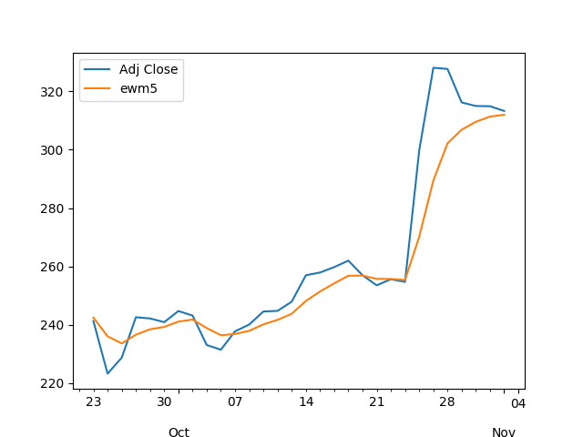

# Week 48

I. Morris says ppl actually willingly switched to agro; and there was
a certain ease abt the "security" of food retrival IMO, tho quality is
of course is questionable. I agree in the long term it was a lose-lose
situation.

"Jared Diamond’s 1999 essay about the transition to agriculture is
called, ominously, “The Worst Mistake in the History of the Human
Race.” More recently, historian Yuval Noah Harari goes so far as to
call the agricultural revolution “history’s biggest fraud.” In his
2015 bestseller, Sapiens: A Brief History of Humankind, he writes,
“The Agricultural Revolution certainly enlarged the sum total of food
at the disposal of humankind, but the extra food did not translate
into a better diet or more leisure.” Harari agrees that all that extra
food merely fueled “population explosions and pampered elites” and
that farmers typically worked longer and harder than foragers for an
inferior diet. Forced into settled communities as a last resort,
agriculturalists faced drastic increases in social inequality, much
more violence in the form of organized conflict, and self-appointed
elites who used monotheistic religion to lock in their power"
\#civilizedToDeath

---

@Discovery

Crossing Antarctica alone was only the beginning.
 
@colinobrady is trading in his skis for oars in an attempt to cross
one of the most dangerous waterways in the world.

[Link](https://twitter.com/Discovery/status/1199740249808748544)

---

<blockquote class="twitter-tweet"><p lang="en" dir="ltr">No problem, just use the slot to go through the now unredacted document that lays out what Boris Johnson will do to our NHS in order to get a trade deal with the US.</p>&mdash; Phil (@Philmoorhouse76) <a href="https://twitter.com/Philmoorhouse76/status/1199703448415068161?ref_src=twsrc%5Etfw">November 27, 2019</a></blockquote> <script async src="https://platform.twitter.com/widgets.js" charset="utf-8"></script>

---

Suman Dutta - good writing. Chemistry guy, dabbles in
optimization. 

---

Switched over to duckduckgo - good so far.

---

When will the issue of tech monopolies be addressed? What's the
timeline..? Hell, it took gov 7 _decades_ to address the comm monopoly
of AT&T.

So by around 2080 we might see some action.

---

Lowering interest rates not spurring growth.

Same story everywhere, apparently in AUS too. 

[Link](https://youtu.be/_V5E2sWHhpM?t=182)

---

Steering wheel on the right side? Like UK? \#AUS

---

Aha; butta means "throw", fuoco means "fire". So the name is not
about butt f--ing. But of course everyone interprets it that way.

---

"@IamJackBoot

Time traveler from the past: \*disgusted\* You haven't ended hunger or
war or poverty but you have a phone in your pocket with a camera?

Me: No... it has two cameras"

---

From the prestigious journal *Applied Energy* - says batteries will
never fall below $124/kwh making them useless for competing against
fossil. Making huge waves today.

"Learning only buys you so much: Practical limits on battery price reduction ... 

Conventional learning curves for manufacturing costs, used in many
battery projections, unrealistically predict battery prices will fall
below $100/kWh by 2030, pushing EVs to hit price parity with internal
combustion engine vehicles (ICEVs) in the absence of
incentives. However, in reality, essential materials jcosts set
practical lower bounds on battery prices.

Our 2-stage learning curve model projects the active material costs
and NMC-based Lithium-ion battery pack price with mineral and material
costs as the respective price floors. The improved model predicts
nickel-manganese-cobalt (NMC) battery prices will fall only to about
$124/kWh by 2030 – much cheaper than today, but still too expensive to
truly compete with ICEVs, due primarily to the high prices of cobalt,
nickel, and lithium"

[Link](https://www.sciencedirect.com/science/article/abs/pii/S0306261919301606?via%3Dihub)

---

Interesting..


---

Dude

"[Werner Herzog] was born during World War II, and when only a couple
of weeks old, the house next door got bombed"

---

"[Morales] wrote a new constitution that gave him greater
powers... And he was unwilling to acknowledge the existence of a
legitimate opposition, perpetually vilifying his adversaries as
traitors.In recent years, as Morales’s support among the Bolivian
people began to slip, his attacks on democracy became more
blatant. [H]e [.. unconstitutionally .. ] ran for a fourth term as
president. And when he seemed to fall short of the necessary majority
to win election in the first round, he engaged in what the
Organization of American States decried as a “clear manipulation” of
the vote. Among other measures, he tampered with the electronic tally
and halted the count. His attempt to steal the election cost Morales
the support of a large number of Bolivians, including many trade
unionists, indigenous people, and longtime members of his own
political party. As protesters took to the street to demand his
resignation, and police forces across the country refused to use force
to quash dissent, Morales was forced into exile in Mexico"

[THE END]

[Link](https://www.theatlantic.com/ideas/archive/2019/11/bolivias-protests-outcome/602644)

---

"@michaellebowitz

FED'S CLARIDA SAYS FED WILL CONSIDER NEW TOOLS TO EASE POLICY IF
NEEDED : SAYS NEW TOOLS TO BE REVIEWED INCLUDE SOME FED REJECTED
BEFORE, LIKE CAPPING TREASURY YIELDS

When will the market ask why is the Fed stopping QT, talking about
more QE and floating ideas like this????"

"@lee_adler

Capping yields would require massive outright purchases."

"@michaellebowitz

Got gold?"

"@RealJosephOwens

Actually, I’m think of moving into harder assets at this point. Canned
food and shotgun shells"

---

"Whenever you find yourself on the side of the majority, it is time to
pause and reflect.” - Mark Twain

---

😂😂😶

"@htsfhickey

The Federal Reserve also has its own law enforcement unit: Federal
Reserve Police. According to Wikipedia, over 1000 sworn members,
complete with Special Response Teams, Explosive Detector Dog Teams,
Hazardous Materials teams and Active Shooter/Patrol Rapid Teams"

---

@tixhonjm

China on track to increase production of hydrogen fuel-cell vehicles by 53% in 2019 - Renewable Energy World

---


Very important point. Wout "free stuff" (Linux) libertard goldcucks
would not have the "commercial stuff" (Android phones). iPhones have
similar levels of free, publicly-funded research in them. 

---

So bug fixes, new features, for many projects were flying through the
Internet over this mechanism. Apache (>50% of web servers today),
Linux (the core of all Android phones), u name it.

Text based. Code. Not rotating balls. That's how it works.

[Link](https://linuxacademy.com/blog/linux/introduction-using-diff-and-patch/)

---

A lot of open source in the early days worked through "patch
files". Say I have a file (it could be a piece of code), `originalfile`

```python
These are a few words.
One word is worth thousand pictures
```

And I made changes to the first line inside file `updatedfile` (this
an example, usually the change would be in the same file, but maybe in
a different directory)

```python
These still are just a few words.
One word is worth thousand pictures
```

Now I can use a tool called `diff` to find the differences, and put
those differences in a "patch file",

```python
! diff /tmp/originalfile /tmp/updatedfile > /tmp/patchfile.patch

! cat /tmp/patchfile.patch
```

This is the patch,

```text
2c2
< These are a few words.
---
> These still are just a few words.
```

Now I can copy and paste this into an email, to a forum, anyone can
take it, and "apply the patch" to their code base, fast forwarding
their `originalfile` to my changed version `updatedfile`,

```python
! patch /tmp/originalfile -i /tmp/patchfile.patch -o /tmp/updatedfile2
```

```text
patching file /tmp/updatedfile2 (read from /tmp/originalfile)
```

And recreate the version that I have, 

```python
! cat /tmp/updatedfile2
```

```text
These still are just a few words.
One word is worth thousand pictures
```

---


One possible civilization could be "locally-mobile" comm based (mesh
networks), mobile computing, sustance through one very basic /
ultra-nutritious food replacement power bar dropped to various places
(skelatal gov provides along with health insurance), water and H2
generated through salination / electrolysis, shelter in prefab or
large enough tents, or H2 RVs. Private land is reduced to minimum,
monetary system through non-mined ecash where debt is issued based on
repayment success.

---

"@Philmoorhouse76

Seems to be a few former Conservative MPs advising people to vote
against the Tories this year, as Brexit keeps devouring its children"

[Link](https://twitter.com/Philmoorhouse76/status/1199267512275390464)

---

Rose's Pawn Shop - Danger Behind the Wheel \#music

[Link](https://youtu.be/fT693nxWfnA)

---

Ancestor worship is an agrarian concept (see Ian Morris,
[WTWRFN](https://www.amazon.com/Why-West-Rules-Now-Patterns-ebook/dp/B003VTZSFY)). The
bad state of the so-called monotheist religions has to do with
co-optation of them by the agro-mafia-state. The Catholic Jesus is not
the same Jesus who preached to people.

---

Cat, kitty face filter

[Link](https://mobile.twitter.com/USATODAY/status/1198674896441749507)

---

"@mzjacobson

Atmospheric rises in greenhouse gases CO2, CH4, and N2O in 2018 all
greater than their annual rises in previous years"

---

<blockquote class="twitter-tweet"><p lang="en" dir="ltr">Norled&#39;s liquid hydrogen-fueled <a href="https://twitter.com/hashtag/ferry?src=hash&amp;ref_src=twsrc%5Etfw">#ferry</a> will be a game-changer for the ferry industry and beyond: <a href="https://t.co/NDgOOEgLSx">https://t.co/NDgOOEgLSx</a> <a href="https://twitter.com/hashtag/maritime?src=hash&amp;ref_src=twsrc%5Etfw">#maritime</a> <a href="https://twitter.com/hashtag/shipping?src=hash&amp;ref_src=twsrc%5Etfw">#shipping</a> <a href="https://t.co/uthuonsIsz">pic.twitter.com/uthuonsIsz</a></p>&mdash; Ballard Power (@BallardPwr) <a href="https://twitter.com/BallardPwr/status/1198990223058882560?ref_src=twsrc%5Etfw">November 25, 2019</a></blockquote> <script async src="https://platform.twitter.com/widgets.js" charset="utf-8"></script>

---

\#tslaq

"@Benshooter

I haven't blocked this many bots, cultists, and fanboys in a single
day, in a very long time. Full on astroturfing campaign right now and
a defcon 62 event for the faithful to man their battlestations"

---

"@tracyalloway

Potentially BIG news for China's credit market. A state-owned
enterprise (SOE) is proposing a 64% haircut on its dollar bonds. We've
rarely seen SOEs default on their debt"

[Link](https://twitter.com/tracyalloway/status/1198850739839234048)

---

First they ignore you, then they laugh at you.. and they don't even
fight you... Then you lose.

\#tslaq

---

Limp pump :) @TeslaCharts \#tslaq

---

Now cacerolada in Columbia

[Link](https://youtu.be/FnVNaLurhss)

---

Absolutely correct, it was leadership-by-merit, there was no constant,
pesistent hierarchy. \#civilizedToDeath

---

No wonder why *The Matrix* was such a hit back in the day. It
unknowingly hit a nerve. Current env is some 1984 level shit
\#civilizedToDeath

---

How We Are Being “Civilized To Death” w/Christopher Ryan

\#dore \#civilizedToDeath

[Link](https://youtu.be/UtrmseTvgMc)

---

Bam deported many people (read: Hispanics); makes sense, he'd want his
minority to remain as sizable in comparison to any other
minority. Hispanics are as sizable, if not bigger than blacks at this
point. That can have electoral consequences.

---

The $370 million fund will be financed from existing Clean Energy
Finance Corporation (CEFC) and Australian Renewable Energy Agency
(ARENA) allocations with the aim of transforming Australia into a
world leader in hydrogen production and exports.

[Link](https://www.australianmanufacturing.com.au/81514/new-fund-to-transform-australia-into-a-world-leader-in-hydrogen)

---

<blockquote class="twitter-tweet"><p lang="in" dir="ltr">Ok Bloomberg</p>&mdash; DRUDGE REPORT (@DRUDGE_REPORT) <a href="https://twitter.com/DRUDGE_REPORT/status/1198636301722894337?ref_src=twsrc%5Etfw">November 24, 2019</a></blockquote> <script async src="https://platform.twitter.com/widgets.js" charset="utf-8"></script>

---

Interesting. Used it on \#tslaq - a stock teeming with suckas. EWMA
does seem to point to an optimal price to stay at... Following this
logic after Oct 23rd u'd follow the up, but stay pat below 320 which
the sucka would eventually come back to, and you could make some $$ in
that process.

```python
import pandas as pd, pandas_datareader.data as web

start=datetime.datetime(2001, 1, 1)
end=datetime.datetime(2019, 11, 1)
s = web.DataReader("TSLA", 'yahoo', start, end).tail(400)
s['ewm5'] = s['Adj Close'].ewm(span=5).mean()
s[['Adj Close','ewm5']].tail(30).plot()
```



---

Henrich uses 5 EWMA (exponentially weighted MA, giving more weight to
more recent part of the time series). Algo trader R. Carver uses two
EWMA trackers at different speeds. Imma check this out.

---

"AAPL has same earnings as 2015 but stock price doubled. Why? Bcz Apple
is buying back its shares" -- Sven Henrich

---

"NEW STUDY: Planned fossil fuel production will blow past the amount of
extraction the planet can handle by 120%"

[Link](https://mobile.twitter.com/foe_us/status/1198390788268400641)

---

<blockquote class="twitter-tweet"><p lang="en" dir="ltr">Belgium considering massive <a href="https://twitter.com/hashtag/hydrogen?src=hash&amp;ref_src=twsrc%5Etfw">#hydrogen</a> imports to reduce <a href="https://twitter.com/hashtag/CO2?src=hash&amp;ref_src=twsrc%5Etfw">#CO2</a> emissions: &quot;The scale of our plans is unique&quot; <a href="https://t.co/GA4Vv5dvC7">https://t.co/GA4Vv5dvC7</a></p>&mdash; Jean-Yves Jault ジョー.ジャンイヴ (@jyjault) <a href="https://twitter.com/jyjault/status/1198366218534739970?ref_src=twsrc%5Etfw">November 23, 2019</a></blockquote> <script async src="https://platform.twitter.com/widgets.js" charset="utf-8"></script>

---

Part of news is sensationalism, sure. Talking abt things that stand
out, are interesting. Like instead of "dog bites man", it is "man
bites dog". But, "Florida man bites dog" isn't necessarily newsworthy
either. There is a certain level of shock, a certain standard we
expect of the Florida man. Anything below that is unnewsworthy.

---

Wout PG and similar open source software most of those SV startups
would have a hard-time to get off-ground, like maybe, ever.

Licences?  Pfff. Noone waits around with dicks in their hands waiting
for permission jerk off. With OSS anyone can f--k.

---

I once saw a diff file submitted by Assange to the open source DB
project Postgresql.

Open source + open society.. Similar attributes tend to cluster.

PG is a direct competitor to Oracle BTW.

---

FREE ASSANGE

"@couragefound

From 2018: Sweden tried to drop Assange extradition proceedings in
2013, CPS emails show, but UK prosecutors dissuaded Swedish
counterparts from doing so"

---

Wrote a Youtube vid downloader to my mobile tool (flask app running
locally). Give URL it extracts the audio of vid and saves it in a
dir. Simple.

---

Libertards seem to think whenever they pull out that "private
property" card, it's an automatic debate winner. It isn't.

Before the Civil War, according to the law of the land, certain
section of humanity was considered "property". Was that a proper use
of the word? Military men like this guy along with the opressed fought
an entire war to fix this.

Jagoff

---

People like Dan Sheee Shaaa think all happens through commercial
relations, happy ppl happily transacting in their little happy
libertard village. Wout the social part the free stuff boy you would
not have a proper patch on your eye. Noone is expecting u to turn left
but u need to learn to respect the presence of the other side.

---

It's been done [before](week37.html#transistorPatent);
federal government forced AT&T to share its know-how on transistors
which made the later innovation in electronics possible.

F-ing libertard. I bet he is a goldcuck too. 

"Harris, like Warren, tells her audience about using presidential
powers to to make drugs cheaper.

If they resist: 'I will snatch their patent ... '"

Responding to @daveweigel

@DanCrenshawTX

.. Patents are unequivocally protected in the US Constitution... Even
if they weren’t, it doesn’t take a genius to understand that stealing
people’s property ...

[Link](https://mobile.twitter.com/DanCrenshawTX/status/1198292802087661571)

---

"@stacyherbert

Just drove into Chapel Hill. Noticed a huge number of Bernie 2020
bumper stickers. Dems are going to have same problem as in 2016 - the
DNC will NOT allow him to win. Ever. And so you'll have same
unmotivated base in the general which will lead to four more years of
Trump"

---

<blockquote class="twitter-tweet"><p lang="en" dir="ltr">In order to reduce its dependency on <a href="https://twitter.com/hashtag/coal?src=hash&amp;ref_src=twsrc%5Etfw">#coal</a> exports and decarbonise its economy, <a href="https://twitter.com/hashtag/Australia?src=hash&amp;ref_src=twsrc%5Etfw">#Australia</a> has laid out an ambitious inspiring plan for <a href="https://twitter.com/hashtag/hydrogen?src=hash&amp;ref_src=twsrc%5Etfw">#hydrogen</a> <a href="https://twitter.com/hashtag/water?src=hash&amp;ref_src=twsrc%5Etfw">#water</a> <a href="https://twitter.com/hashtag/electrolysers?src=hash&amp;ref_src=twsrc%5Etfw">#electrolysers</a> to be build across the country, fed by renewables to facilitate the use of <a href="https://twitter.com/hashtag/fuelcells?src=hash&amp;ref_src=twsrc%5Etfw">#fuelcells</a> <a href="https://t.co/WZBVE34HoB">https://t.co/WZBVE34HoB</a> <a href="https://t.co/xI9YjgJvuY">pic.twitter.com/xI9YjgJvuY</a></p>&mdash; Fuel Cell Pilot (@FuelCellPilot) <a href="https://twitter.com/FuelCellPilot/status/1198038362021670912?ref_src=twsrc%5Etfw">November 23, 2019</a></blockquote> <script async src="https://platform.twitter.com/widgets.js" charset="utf-8"></script>

---

<blockquote class="twitter-tweet"><p lang="en" dir="ltr">&quot;If Australia can produce 400 Terrawatt-hours of hydrogen energy for export, modelling results show the average energy cost could be reduced by more than 30%.&quot;<a href="https://t.co/pl2kALofEQ">https://t.co/pl2kALofEQ</a></p>&mdash; Bjørn Eng (@H2Bjorn) <a href="https://twitter.com/H2Bjorn/status/1198279824655208449?ref_src=twsrc%5Etfw">November 23, 2019</a></blockquote> <script async src="https://platform.twitter.com/widgets.js" charset="utf-8"></script>

---

<blockquote class="twitter-tweet"><p lang="en" dir="ltr">FYI, Google is trying to kill web URLs<br><br>Google wants users to use Google search as the access point for all content on the web. They are doing this by:<br>1. Removing visible URLs in Chrome<br>2. Penalizing sites for not using Google AMP<br>3. Removing URLs from search results <a href="https://t.co/8aTVCNMGvi">pic.twitter.com/8aTVCNMGvi</a></p>&mdash; 🇺🇸 Drybones🗽ム (@drybones_5) <a href="https://twitter.com/drybones_5/status/1190694123965210625?ref_src=twsrc%5Etfw">November 2, 2019</a></blockquote> <script async src="https://platform.twitter.com/widgets.js" charset="utf-8"></script>

---

Interesting.. tho France is known for its secularism, but the other
side of that would be Catholicism which is of course deeply tied to
Roman patriarchy.

I wonder how the culture was in Gaul before the guinea got there...

"Women in France rally against domestic abuse after 116 die in acts of
violence"

[Link](https://amp.rfi.fr/en/france/20191123-women%2520in%2520paris%2520rally%2520against%2520domestic%2520abuse%2520after%2520116%2520die%2520in%2520acts%2520of%2520violence)

---

Stoller, *Goliath*

"Cheap gas and an endless real estate boom were hallmarks of the
thirty years of postwar American dominance and prosperity; both ended
in 1973–1974. There were shortages of gasoline, electricity, and even
onions, and rumors of insufficient stockpiles of everything from
mustard to vegetable oil to cat food. In November of 1973, The Tonight
Show host Johnny Carson made a joke about a toilet paper shortage,
prompting a run on toilet paper as Americans rushed to buy every roll
they could find"

---

If Computers Are So Smart, How Come They Can’t Read?

[Link](https://www.wired.com/story/adaptation-if-computers-are-so-smart-how-come-they-cant-read/)

---

"A Florida dog put a car into reverse and drove it in circles for
nearly an hour"

[Link](https://cnn.it/2QJPVJw)

---


<blockquote class="twitter-tweet"><p lang="en" dir="ltr">The most artistic protest witness video I’ve ever seen. So real it almost feels choreographed! <a href="https://twitter.com/hashtag/iran?src=hash&amp;ref_src=twsrc%5Etfw">#iran</a> <a href="https://t.co/cTz6rvcqeE">pic.twitter.com/cTz6rvcqeE</a></p>&mdash; Hossein Derakhshan (@h0d3r) <a href="https://twitter.com/h0d3r/status/1197855775311446017?ref_src=twsrc%5Etfw">November 22, 2019</a></blockquote> <script async src="https://platform.twitter.com/widgets.js" charset="utf-8"></script>

---

Translation: if the FED did not up the laughing gas, noone would be
laughing today.

"@zerohedge

Goldman: 'With S&P 500 earnings on track for roughly zero growth from
this time last year, solid returns likely would not have been possible
without central bank support'"

---

"@thehill

Trump narrowly leads Biden but trails Sanders in head-to-head 2020
matchups"

[Link](http://hill.cm/LVOLUJg)

---

"Bolsonaro is turning back the clock on Brazil, says Lula"

[Link](https://amp.theguardian.com/world/2019/nov/22/exclusive-bolsonaro-is-turning-back-the-clock-on-brazil-says-lula-da-silva)

---

Merle Haggard - Set My Chickens Free

[Link](https://www.youtube.com/watch?v=Ud5SbZ6XtTw)

---

Go Strong Woman \#southpark

[Link](https://youtu.be/URz-RYEOaig?t=27)

---

A lot of Eng names have weird TR counterparts.. "Biden" phonetically
means telling someone "you bored me to sleep (*baydın*)", in
slang. Yellen is asking someone to pass wind, as in flatulance, first
person imperative. Yellen! ff f f f.

---

Whenever I hear Farage my mind thinks of the TR word *faraş* - a
cleaning utensil, but not the broom part, the other
[part](https://productimages.hepsiburada.net/s/3/459/9606974210098.jpg),
the thing you push all the dirt into, with the broom.

Kinda like this guy, no?

---

Australia - very good. 

<iframe width="330" height="250" src="https://www.youtube.com/embed/ygLrTYCR1J8" frameborder="0" allow="accelerometer; autoplay; encrypted-media; gyroscope; picture-in-picture" allowfullscreen></iframe>

---


---

Hot shower, followed by a hot toddy.. and hot.. yiieeaaah

---

Ghost Riders in the Sky - Johnny Cash \#music

[Link](https://www.youtube.com/watch?v=Mynzbmrtp9I)

---

"@gracegcracker

Ew I’ve been 22 for a week"

[Link](https://twitter.com/gracegcracker/status/1197714516433231872)

---

<blockquote class="twitter-tweet"><p lang="en" dir="ltr">In 2018, Australia exported 70Mt of LNG, but as hydrogen is denser than LNG we only need produce 30Mt of Green Hydrohen to meet this - <a href="https://twitter.com/ScienceChiefAu?ref_src=twsrc%5Etfw">@ScienceChiefAu</a> at <a href="https://twitter.com/hashtag/WEC19Aus?src=hash&amp;ref_src=twsrc%5Etfw">#WEC19Aus</a> <a href="https://t.co/fy01C7El1F">pic.twitter.com/fy01C7El1F</a></p>&mdash; Engineers Australia (@EngAustralia) <a href="https://twitter.com/EngAustralia/status/1197639241703931905?ref_src=twsrc%5Etfw">November 21, 2019</a></blockquote> <script async src="https://platform.twitter.com/widgets.js" charset="utf-8"></script>

---

Outdoor cats.. interesting

[Link](https://mobile.twitter.com/corvidresearch/status/1197600452616966144)

---

<blockquote class="twitter-tweet"><p lang="en" dir="ltr">Hyundai’s Hydrogen Mobility Solution Wins 2020 Truck Innovation Award-Validates <a href="https://twitter.com/Hyundai_Global?ref_src=twsrc%5Etfw">@Hyundai_Global</a> pan-European initiative. Cooperation between Hyundai &amp; leading European <a href="https://twitter.com/hashtag/hydrogen?src=hash&amp;ref_src=twsrc%5Etfw">#hydrogen</a> companies to accelerate deployment of <a href="https://twitter.com/hashtag/fuelcell?src=hash&amp;ref_src=twsrc%5Etfw">#fuelcell</a> tech-<a href="https://t.co/uignrqE8BO">https://t.co/uignrqE8BO</a> <a href="https://twitter.com/hashtag/HydrogenNow?src=hash&amp;ref_src=twsrc%5Etfw">#HydrogenNow</a> <a href="https://twitter.com/hashtag/decarbonise?src=hash&amp;ref_src=twsrc%5Etfw">#decarbonise</a> <a href="https://t.co/FQgcZGIIPO">pic.twitter.com/FQgcZGIIPO</a></p>&mdash; FuelCellsWorks (@fuelcellsworks) <a href="https://twitter.com/fuelcellsworks/status/1197584581123362816?ref_src=twsrc%5Etfw">November 21, 2019</a></blockquote> <script async src="https://platform.twitter.com/widgets.js" charset="utf-8"></script>

---

<blockquote class="twitter-tweet"><p lang="en" dir="ltr">Zombie hordes: 28% of US companies with market cap &lt; $1bn earn less (EBIT) than their interest payments, way up from the period before the crisis and this is with historically low interest rates. <a href="https://twitter.com/ArborResHealth?ref_src=twsrc%5Etfw">@ArborResHealth</a> via <a href="https://twitter.com/SoberLook?ref_src=twsrc%5Etfw">@SoberLook</a> <a href="https://t.co/eI21pYXohD">pic.twitter.com/eI21pYXohD</a></p>&mdash; Adam Tooze (@adam_tooze) <a href="https://twitter.com/adam_tooze/status/1197613150536896512?ref_src=twsrc%5Etfw">November 21, 2019</a></blockquote> <script async src="https://platform.twitter.com/widgets.js" charset="utf-8"></script>

---

<blockquote class="twitter-tweet"><p lang="en" dir="ltr">Breakthrough layered solar cells w/ 24% conversion... role for solar direct to hydrogen (artificial photosynthesis) <a href="https://t.co/suyMsER161">https://t.co/suyMsER161</a> Chemical energy is our biggest lever for decarbonization. Meanwhile <a href="https://twitter.com/hashtag/energytwitter?src=hash&amp;ref_src=twsrc%5Etfw">#energytwitter</a> stalled patting itself on back for Grid PV, which is easy</p>&mdash; Garry Golden (@garrygolden) <a href="https://twitter.com/garrygolden/status/1196436914691362821?ref_src=twsrc%5Etfw">November 18, 2019</a></blockquote> <script async src="https://platform.twitter.com/widgets.js" charset="utf-8"></script>

---

"Chanos: The size of China's residential real estate mkt stunned
us. It's the biggest real estate bubble in history.

They're building 1.8 bil sq meters per year of residential. That’s 20
mil apartments. It’s about 20-25% of their GDP"

---

"@NRMorrow

'who the HELL is in my Google Doc' I think furiously, before realizing
it's me in a different tab"

---

<blockquote class="twitter-tweet"><p lang="en" dir="ltr">It’s asinine to think that we shouldn’t force Chinese companies to submit to the same audits that we require of US companies. Hank bailed out his banker buddies during the GFC and now he’s a paid propagandist for the CCP. <a href="https://twitter.com/HenryPaulson?ref_src=twsrc%5Etfw">@henrypaulson</a> <a href="https://twitter.com/PaulsonInst?ref_src=twsrc%5Etfw">@PaulsonInst</a> <a href="https://twitter.com/FareedZakaria?ref_src=twsrc%5Etfw">@FareedZakaria</a> <a href="https://twitter.com/hashtag/Chinazi?src=hash&amp;ref_src=twsrc%5Etfw">#Chinazi</a> <a href="https://t.co/bIeUrPAYpt">https://t.co/bIeUrPAYpt</a></p>&mdash; 😷Kyle Bass😷 (@Jkylebass) <a href="https://twitter.com/Jkylebass/status/1197475601982074882?ref_src=twsrc%5Etfw">November 21, 2019</a></blockquote> <script async src="https://platform.twitter.com/widgets.js" charset="utf-8"></script>

---

"In Bizarre Admission, ECB Warns Its Policies Threaten Financial Stability, Could Lead To A Crash"

[Link](https://www.zerohedge.com/markets/bizarre-admission-ecb-warns-its-policies-threaten-financial-stability-could-lead-crash)

---

<blockquote class="twitter-tweet"><p lang="en" dir="ltr">Put it in the oceans where it should live. 38,400 Gt there already - lots of room for more...</p>&mdash; Mike Kelland (@Mkelland) <a href="https://twitter.com/Mkelland/status/1197349139438342145?ref_src=twsrc%5Etfw">November 21, 2019</a></blockquote> <script async src="https://platform.twitter.com/widgets.js" charset="utf-8"></script>

---

"Bernie Sanders wants to take fossil fuel companies to criminal
court... At the fifth Democratic presidential debate, Sen. Bernie
Sanders reiterated one of his most aggressive proposals on climate
change: As president, he’d like to see fossil fuel executives
criminally prosecuted"

[Link](https://www.vox.com/2019/11/12/20959293/bernie-sanders-climate-lawsuit-exxon-juliana-sinnok)

---

<blockquote class="twitter-tweet"><p lang="en" dir="ltr">Constructive Interference <a href="https://t.co/kMKUTsEr0J">pic.twitter.com/kMKUTsEr0J</a></p>&mdash; 〈 Berger | Dillon 〉 (@InertialObservr) <a href="https://twitter.com/InertialObservr/status/1197407633734455297?ref_src=twsrc%5Etfw">November 21, 2019</a></blockquote> <script async src="https://platform.twitter.com/widgets.js" charset="utf-8"></script>

---

"@ClimateBen

Why is there no climate action?

Because governments, media and Big Business are all part of the same
mutually supportive system, and mainstream media refuse to say that
the fossil fuel industry and governments that support it are
committing crimes against nature and humanity..."

---

<blockquote class="twitter-tweet"><p lang="en" dir="ltr">We now have three steel companies trialling steel from <a href="https://twitter.com/hashtag/hydrogen?src=hash&amp;ref_src=twsrc%5Etfw">#hydrogen</a> (SSAB, ArcelorMittal and Voestalpine). So far only one on ammonia (Yara). There will be many many more joining. Eventually all. <a href="https://t.co/UznfNls2le">https://t.co/UznfNls2le</a></p>&mdash; William Blomstrand (@william_sw) <a href="https://twitter.com/william_sw/status/1197226833244127232?ref_src=twsrc%5Etfw">November 20, 2019</a></blockquote> <script async src="https://platform.twitter.com/widgets.js" charset="utf-8"></script>

---

And these ppl somehow ended up being corp sluts.

"Though mainstream economists didn’t care about Hayek’s views, he and
Simons began collaborating on the possibility of putting together the
Free Market Study. Both men were fiercely anticorporate, seeing
private corporate power as an equally dangerous form of central
planning" -- Stoller, *Goliath*

---

Stoller, *Goliath*

"Still, as exciting as the project might be in 1946, returning to a
pre–New Deal world seemed impossible. To reconstruct the system over
which Andrew Mellon reigned required an architecture with three
components.

The first component was the ability to rule an entire market through a
specific corporate monopoly, or shared control of a market through a
small set of corporations (which was known as an oligopoly rather than
a monopoly). Each monopolistic company would be a mini-government,
governing the prices, quality, labor, and supply chain of an
industrial product or service, such as aluminum, oil, steel, ships,
and magnesium. But during the New Deal, robust antitrust enforcement
kept concentration and monopolization at bay.

Each company had in turn been controlled by one of a small number of
oligarchs or banks, such as the House of Morgan, DuPont, Rockefeller,
or Mellon himself. This was done through the second component, the
connective power that turned each monopoly into a networked whole,
with mechanisms to discipline wayward corporate structures. This was
Wall Street, with tools such as holding companies, interlocking
directorates, stock watering, debt issuance, and various forms of
financial instruments. Wall Street, however, was deeply constrained by
financial rules.

The third piece was the rhetorical machinery, a set of intellectual
concepts and political institutions that would protect financial
empires from democratic influence. Money would be necessary, money to
develop and sell this ideology, not only to fund new academic
departments, but to buy politicians and lawyers, to influence voters
and newspapers, to set up institutions to persuade judges and
professors. Even more critical was rhetoric to explain the world in
ways that would organize citizens to seek not freedom from capital,
but freedom ​for capital. But this was difficult to imagine, as New
Dealers seemed to rule the centers of cultural capital, the newspapers
and academic institutions.

It was their task to imagine it nonetheless. They saw themselves as up
against the world, and they were going to conquer it. The Free Market
Study, and then the Antitrust Project, would serve as the intellectual
testing ground for the set of ideas that would eventually burst out of
the academy and generate a political and financial revolution"

---
