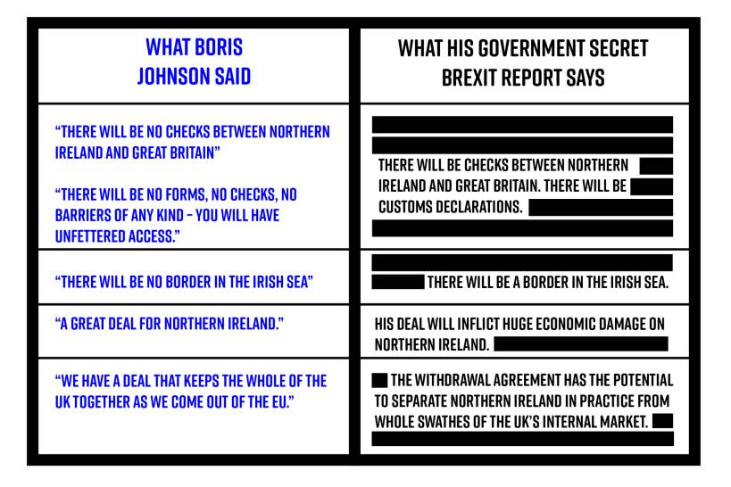

# Week 50

Burn 🔥🔥🔥

"@WKCosmo

The first rule of string cosmology club is that nobody has the
faintest idea what the rules of string cosmology club are"

---

<blockquote class="twitter-tweet">
There&#39;s another of these on the drawing board, in the Netherlands. No construction yet but I suspect the Dutch might get there ahead of L.A.<a href="https://t.co/newQlX7Awa">https://t.co/newQlX7Awa</a>
&mdash; Justin Gillis (@JustinHGillis) <a href="https://twitter.com/JustinHGillis/status/1204633692682932225?ref_src=twsrc%5Etfw">December 11, 2019</a></blockquote> 

---

Water is heavy. Anyone who packed a gear knows that. Human body is
heavy (per volume) bcz we too are mostly water. A watermellon is
reeally heavy also known for its extremely high water content (I
remember reading water hold perc better than a sponge)

---

UK elecs are short and sweet. Good.

---

"US hits Iran’s biggest airline and shipping group with sanctions" -- ft.com

---

<blockquote class="twitter-tweet">
LiDAR, redefined. Say hello to the first camera in the new Intel® RealSense™ LiDAR family, the Intel RealSense LiDAR Camera L515. Small enough to fit in the palm of your hand.<a href="https://t.co/2bbbIQGiRA">https://t.co/2bbbIQGiRA</a><a href="https://twitter.com/hashtag/depth?src=hash&amp;ref_src=twsrc%5Etfw">#depth</a> <a href="https://twitter.com/hashtag/lidar?src=hash&amp;ref_src=twsrc%5Etfw">#lidar</a> <a href="https://twitter.com/hashtag/intelrealsense?src=hash&amp;ref_src=twsrc%5Etfw">#intelrealsense</a> <a href="https://t.co/9afZaAxGBy">pic.twitter.com/9afZaAxGBy</a>
&mdash; Intel® RealSense™ (@IntelRealSense) <a href="https://twitter.com/IntelRealSense/status/1204794055038652416?ref_src=twsrc%5Etfw">December 11, 2019</a></blockquote> 

---

Some motherfuckers are aaalways trying to ice skate uphill.

"There are still those who think batteries are a viable storage solution"

---

ARTIFICIAL ISLAND! 

"Denmark is moving forward with plans to build an artificial island
tying in power from offshore wind farms of up to 10 gigawatts (GW) of
capacity, more than enough to supply all households ...

[It] .. has set aside 65 million crowns to research how the energy
coming into the hub can be stored or converted into renewable hydrogen
as all the power generated will not just be used by domestic
customers" -- Reuters

[Link](https://uk.mobile.reuters.com/article/amp/idUKKBN1YE1GE)

---

A new hydrogen city bus that uses the same fuel cell stack as the Toyota Mirai will be tested on roads in Portugal next year.

Toyota said it has delivered and integrated its first fuel cell stack
into Portuguese bus engineering and production company CaetanoBus’
H2.City Gold, which was presented at Busworld 2019 in Brussels.

[Link](https://www.h2-view.com/story/caetanobus-launches-first-hydrogen-bus-with-toyota-technology/)

---

Chris Joss - Wrong Alley Street \#music

[Link](https://www.youtube.com/watch?v=M0ymw768TCQ)

---

The Japanese are not messing around 👍👍🇯🇵

"The 8,000-tonne Hydrogen Frontier rolled down the slipway from the
Kawasaki Heavy Industries yard in Kobe on Wednesday morning, marking
the first stage in a pilot project in which hydrogen produced from
coal in Australia, liquefied at -253C, will be shipped to Japan"

<blockquote class="twitter-tweet">
Japan 🇯🇵 has launched the world’s first ocean-going liquid <a href="https://twitter.com/hashtag/hydrogen?src=hash&amp;ref_src=twsrc%5Etfw">#hydrogen</a> carrier as the energy-poor country works to build a global supply chain for <a href="https://twitter.com/hashtag/carbonfree?src=hash&amp;ref_src=twsrc%5Etfw">#carbonfree</a> fuel.<a href="https://t.co/OBId74g31i">https://t.co/OBId74g31i</a>
&mdash; Hydrogen Europe (@H2Europe) <a href="https://twitter.com/H2Europe/status/1204662496633786368?ref_src=twsrc%5Etfw">December 11, 2019</a></blockquote> 

---

When I Get Home - Jenny Kerr \#music

[Link](https://www.youtube.com/watch?v=fWhxTeLkol8)

---

"@diff_eq

'I find it unsatisfactory to 'classify' PDEs: this is possible in two
variables, but creates the false impression that there is some kind of
general and useful classification scheme available in general.' --
L. Evans"

---

Actress from SGate having trouble with
[TWTR](https://mobile.twitter.com/dhewlett/status/1204443508209340416).

---

<blockquote class="twitter-tweet">
Other once-hot things that feel like they&#39;re also in the thick of winter: blockchain, e-scooters, consumer robotics, any wearables not made by Apple, self-driving cars, IoT.   They&#39;ll probably all recover and reach their potential in some evolved form. But winter is harsh
&mdash; Chris Anderson (@chr1sa) <a href="https://twitter.com/chr1sa/status/1204441158568427520?ref_src=twsrc%5Etfw">December 10, 2019</a></blockquote> 

---

.. on **some** issues. This is key. They did not go haywire on
everything bcz on pro-corp, cartel politics they agree.

The issues they went further right have certain characteristic - stuff
that used to be secondary, easy-to-agree-on issues, like guns, now is
not. Reagan was pro-gun control (this is the guy who made money
holding a gun and shooting people on screen for entertainment
remember), but now no Rep will touch it. Or the issue have been mostly
decided and safely out of legislative harms way, like abortion. SCOTUS
dropped the hammer in 1973 and abortion became legal, hence this
"issue-non-issue" is now something u can safely jump up and down
about, "differentiating" youself, wout causing undue damage (surely u
can hem and haw and cut from this corner, that corner, but still, it
is mostly decided).

Ironically some of the issue-non-issues now became real issues because
of neglect - that's what you get for faux divisions - even tiny
problems can grow and metastasize.

"Dems acting like Reps pushed Reps further right ..."

---

Nomads. Yep.

"Muhammad, is born in a merchant family in Mecca. His clan is
prosperous and influential, but his father dies before he is born and
his mother dies when the boy is only six. Entrusted to a Bedouin
nurse, Muhammad spends much of his childhood among nomads,
accompanying the caravans on Arabia's main trade route through Mecca"

[Link](http://www.historyworld.net/wrldhis/PlainTextHistories.asp?historyid=aa55)

---

Tosca - Have Some Fun (Urbs Big City Mix) \#music

[Link](https://youtu.be/u2p1Dbgz5UQ)

---

"@zerohedge

'Fed May Need Swap Lines, QE4 to Ease Funding Woes: Credit Suisse'

This is just getting better by the day. And all so hedge funds can
keep their 10x leverage and Dimon can buyback JPM stock"

---

It is - and I was kidding. BJ is 100% English, in fact comically so,
they say every streotypical wart ppl assoc with Englanders is in this
guy.

"You said Boris J is a tigger bcz of his distant heritage. Isn't that
not a contradiction w culture code"

---

Reading too much pol inflammatory content - I was like "oh yea, what a
snowflake" - turns out there is a company called Snowflake 😶

"Snowflake CEO on taking company public ... "

---

"@diff_eq

The first thing people did with early electronic computers was
numerically solve differential equations"

---

@rafaelshimunov

Listen to that time @BernieSanders even refused 
@ChiliPeppers money, holding even them to his policy against big donors.

[Link](https://mobile.twitter.com/rafaelshimunov/status/1203566461542907906)

---

I'd look at the experience of Postmodernists - they started with the
QM Uncertainty Principle and now they are in lala land,
ultra-subjective, and worse, anti-science.

---

I wouldn't base any philosophy on Bohr; his science is basically a
lack of one (which some modern day weirdos turned into an accepted
absurdism, extreme relativism). Philosophy and hard sciences are
intertwined, and if philosophers follow these effers they'll fall off
a cliff never to come back. Watch out.

---

Yeah - this is exactly a fitting response from the founder of Quantum
Mechanics. It "works", let's not care about the deeper issues. He
probably used that horseshoe to make exactly that point, as a
gag. Let's not forget there were huge fights about QM and its lack of
ontology back in the day, and Bohr was fighting for hearts and
minds. They won, but even tho a majority of scientists have been fed
the morphine and cannot think clearly anymore, a few brains still
continue to do so.

"When a friend saw a horseshoe over the door of Bohr's country cabin,
he said in mock astonishment, 'Surely you don't believe in that old
superstition!' 'No,' said Bohr, 'but they say it works even if you
don't believe in it.'"

---

True. It can't say "how that exists", it just an algorithmic approach
that currently explains the data well. Like, by looking at the result
of division, say coming out of an "experiment", they saw (2,2) then 1,
then saw (6,3) and 2, they sort of discovered long division, bcz it
works well. It is perfectly good algorithm, and it certainly explains
a certain aspect, but are not interested in and have no idea on number
theory, sets, or functions.

Also see a theory of [shadows](../../2019/08/smolin.html).

"Quantum Mechanics works (computes) but it has no ontology"

---

Damn. Many deaths. RIP.

"Former Fed chairman Paul Volcker dies aged 92"

---

I think this guy has a problem being part of stuff. Maybe that's where
his Brexitism largely comes from. I mean at a personal level that's
fine, be a loner whatever, but at a nation-scale?

People don't understand, the EU is already a skeletal and *very*
nation centric method of having a union. When I was in Germany my
Deutsche Bank card wouldn't even work in Netherland banks. Not a
single one. What integration?- This is the least amount of
togetherness that is tolerable for Europeans that can project some
kind of power and keeps the trade going. That's it.

"@Ferretgrove

NewKip is dead, make way for New NewKip.  Farage is the most poisonous
politician never elected to Parliament, how do we keep him away from
us?"

---

These are [deep issues](https://vignette.wikia.nocookie.net/memoryalpha/images/7/7e/Data_wearing_a_beard.jpg/revision/latest?cb=20121212024612&path-prefix=en). I don't think we can do them justice here. 

---

And all this avenue of research contributed to SU(5) which led
nowhere.

IDT the holy grail is around symmetry breaking.

Any effort that revolves around this concept will be ignored by
mua. If I was handling a grant awarding process, symmetry breaking
would get no money. String Theory, no money. Multiverse, no money.

"A common example from physics is of a pencil balanced on its
point. It is symmetric, in that while it is balanced on its point, one
direction is as good as another. But it is unstable. When the pencil
falls, as it inevitably must, it will fall randomly, in one direction
or another, breaking the symmetry. Once it has fallen, it is stable,
but it no longer manifests the symmetry—although the symmetry is still
there in the underlying laws. The laws describe only the space of what
possibly may happen; the actual world governed by those laws involves
a choice of one realization from many possibilities.  This mechanism
of spontaneous symmetry breaking can happen to the symmetries between
the particles in nature. When it occurs for the symmetries that, by
the gauge principle, give rise to the forces of nature, it leads to
the differences in their properties." -- Smolin, *Trouble with
Physics*

---

Soo... if I approximate f' numerically, and use BFGS I already have
derivative-free optimization 🤔 (Hessian is already approximated). Lit
on DFO almost always exclusively talks about trust region
mthds. 

---

Haha like a fart in a lift. Nice.

"@LiamMoo70673726

10 out of 10 for the Farage predictions! The reform party😂😂😂???  Come
on you have to hand it to the slimy shishter, he's like a fart in a
lift! He just seems to linger🤢"

---

RIP 🖖

"Star Trek’s René Auberjonois Has Died At 79"

[Link](https://www.gateworld.net/news/2019/12/star-trek-actor-rene-auberjonois-has-died/amp)

---

If I came back from a deserted island after years, I could just update
that stats page and I'd know exactly where the econ was.

---

Non-Farm Payroll YoY change \# part of the
[pattern](../../2021/01/stats.html#unemp)
of the late-cycle. The sharp falls in the graph are obviously
recessions. They extended the latest block as far as they could, with
laughing gas and [cowbell](https://youtu.be/cVsQLlk-T0s?t=86). Mooooarrr... Moooaaarrrr....

---

"Each block in an account-chain also contains the account-chain’s
balance, meaning that one only has to store the latest block and not
one’s entire transaction history of blocks (let alone that of the
entire network). This lets users use Nano without having to download
transaction histories that are monstrous in size (e.g. Bitcoin’s
blockchain is ~250 gigabytes in size, as of writing).

As long as the NANO in all account-chains adds up to the NANO balance
in Nano’s genesis account-chain, which initially contained all NANO,
users can be sure that there isn’t anything suspicious going on, like
counterfeiting of NANO.

To make sure that this is the case, each Nano account-chain chooses a
Representative to vote on the validity of Nano transactions. Each
Representative’s voting weight is the sum of all account-chain NANO
balances delegated to it. Since blocks are incredibly small in size,
Representatives are able to confirm transactions near instantaneously.

Another thing to note is that since there is no race between miners to
add blocks, or groups of transactions, to the blockchain in order to
win a block reward, as with networks like Bitcoin, the Nano network
uses barely any energy to stay running"

[Link](https://support.exodus.io/article/1284-nano-coin)

---

"Today, Google has eight products with more than a billion users
apiece. It knows what you think through its much larger “database of
intentions.' It knows where you go in the physical world through its
two billion constantly roaming Android phones and its mobile ad app
and Google Maps subsidiaries. It knows where you go online through its
tracking businesses, and it has information about business ad
campaigns through its advertising technology subsidiaries. This
provides Google with a God’s-eye view of behavior. Married to this
surveillance power is the ability to organize the distribution of
information through YouTube, Google Maps, Google search, email, and
its own popular browser. As Schmidt put it, 'We know where you are. We
know where you’ve been. We can more or less know what you’re thinking
about.'

Google, Amazon, and Facebook are conglomerates who monopolize ad
markets, and have done so through a range of tactics and mergers that
were until very recently illegal. And in doing so, they have become
governing powers. Mark Zuckerberg, the CEO of Facebook, put it this
way. 'In a lot of ways,' he said, 'Facebook is more like a government
than a traditional company. We have this large community of people,
and more than other technology companies we’re really setting
policies.'" -- Stoller, *Goliath*

---

"@SShackford

Devin Nunes has long supported letting the feds secretly snoop on
Americans call records, and he has attacked those who tried to stop
it. Now he's reaping the consequences [as in now his personal comm is
out on the open, ouch]"

[Link](https://twitter.com/SShackford/status/1202641814030675968)

---

"While this predominant type of lithium extraction [as in LatAm]
requires big up-front investments of capital and expertise, the whole
process is less labor intensive than digging up coal or oil. Yet it
requires massive amounts of water in some of the driest places on
earth, with single companies using as much as 1,700 litres per
second. This drain has disrupted ecosystems around the lakes and cut
off freshwater access for indigenous communities in the so-called
lithium triangle countries of Bolivia, Argentina, and Chile"

[Link](https://newrepublic.com/amp/article/155753/climate-changes-great-lithium-problem)

---

"@DonaldM38768041

A logic professor giving a lecture said, 'A double negative makes a
positive statement, but a double positive does not make a negative.'

From the back of the class someone said in a sarcastic tone, 'yeah,
yeah'"

---

"[Near 2016] a gruesome heroin epidemic spread in rural areas,
spurred by hopelessness and corruption among pharmaceutical monopolies
... the life span of white men and women without a college education
began dropping as suicide, alcoholism, and drug addiction caused a
die-off, what policymakers began calling 'deaths of despair.' ....

At the ballot box, Americans voted for change in 2006, 2008, 2010,
2014, and 2016, veering from party to party in a desperate search for
someone to address their fears and anxieties" -- Stoller, *Goliath*

---

IBM did all that? I thought it was bunch of rabid libertards in a
garage..

"In 1980, IBM, wary of being accused of controlling the personal
computer business, signed a ​deal with Microsoft to produce an
operating system—known as DOS—for its personal computer, and
standardized its PC chips on Intel. IBM then transferred enormous
programming and technical know-how to both companies, and even
protected Intel throughout the 1980s from Japanese competition"

---

"As with Rockefeller leveraging the network of railroads to monopolize
the oil industry, entrepreneurs used the exploding personal computer
market to seize monopoly power around key bottlenecks. Spreadsheets,
word processors, and operating systems became costly software
monopolies" -- Stoller, *Goliath*

---

So the aging Ginsburg is no "bulwark" against anything, against Trump,
whatever. Maybe it is good she is on her way out, no? With the right
lens lota heroes become zeros.

"Clinton also appointed pro-monopoly judges. When Clinton appointed
Supreme Court justices, he picked Stephen Breyer and Ruth Bader
Ginsburg. Both sailed through the Senate, not because of a tradition
of bipartisanship, but because neither worried powerful business
interests. Both were adherents of the same basic monopoly-friendly
philosophy promoted by the Chicago School. And once on the bench, in
2004, both signed one of the most pro-monopoly opinions in the ​history
of the court, one authored by Antonin Scalia. “The mere possession of
monopoly power, and the concomitant charging of monopoly prices, is
not only not unlawful,” said the court, “it is an important element of
the free-market system"  -- Stoller, *Goliath*

---

"As a candidate, Clinton’s Democratic platform called for a
'Revolution of 1992', capturing the anger of the moment. But the
platform was written by Al From, and for the first time since 1880
there was no mention of antitrust or corporate power, despite a decade
with the worst financial manipulation America had seen since the
1920s. This revolution would be against government, in government,
around government.

When Clinton took office, the Democrats finally had a majority in the
House, a majority in the Senate, and the presidency. Clinton not only
entrenched Reagan’s antitrust principles into the DOJ by making them
bipartisan, but expanded the Reagan revolution more broadly. With the
end of the Cold War, Clinton took neoliberalism global"  -- Stoller, *Goliath*

---

Exactly. So cons in UK even lost that issue-non-issue to chew on (at
least US cons still have that), so what are you left with? The
European Union.

"Cameron was pro environment"

---

Hasn't it though? What is Brexit if it isn't cons gone apeshit? Sure
the right in UK were always a little off kilter, crackpot-ish, but the
latest mess tops them all.

Then if a hard-Brexit does happen, it will be Tony Blair's fault.

"You say Dems acting like Reps caused Reps to go insane. But look at
UK, Blair's Third Way did not seem to effect cons"

---

Bill Bradley. The "challenger" "from the left" against Al Gore during
99 primary.. Those were the days...

"New Democrats saw cooperation between business and government as a
compelling alternative to Reaganism, and as a means of addressing
international financial problems. Thurow had drawn from Galbraith, who
in turn had drawn directly from such Bull Moose thinkers as Walter
Lippmann.

Like Teddy Roosevelt and Galbraith, Thurow preached the abolition of
the antitrust laws. All used the same excuse for doing so. “In markets
where international trade exists or could exist, national antitrust
laws no longer make sense,” wrote Thurow. This was a direct echo of
TR’s statement, in accepting the Bull Moose nomination in 1912, that
if we “do not allow cooperation, we shall be defeated in the world’s
markets.” As Rothenberg pointed out, Bill Bradley, Gary Hart, and Paul
Tsongas made the same argument, all proposing to relax antitrust and
banking laws" -- Stoller, *Goliath*

---

"@DavidIHarrison

Leonardo da Vinci lists 40 books in his possession at age 45.

He was largely self-taught but books were v expensive & relatively
scarce - he made lists of books he wanted to get hold of.

You have the world's books & knowledge at yr fingertips to educate u"

---

Nice 👍

"Next year, Transport for London (TfL) will roll out the hydrogen
double deckers across three of its central routes, with £12m of
funding from the city mayor Sadiq Khan"

<blockquote class="twitter-tweet">
Next year, Transport for London <a href="https://twitter.com/TfL?ref_src=twsrc%5Etfw">@TfL</a> will roll out the <a href="https://twitter.com/hashtag/hydrogen?src=hash&amp;ref_src=twsrc%5Etfw">#hydrogen</a>-powered double deckers across three of its central routes – good news for passengers and those who have to breathe in the capital’s air on a daily basis 👉🏻 <a href="https://twitter.com/Independent?ref_src=twsrc%5Etfw">@Independent</a> <a href="https://t.co/OBhwitz7in">https://t.co/OBhwitz7in</a>
&mdash; Dominique Lecocq 🌏 (@Lecocq_dom) <a href="https://twitter.com/Lecocq_dom/status/1203183920864485382?ref_src=twsrc%5Etfw">December 7, 2019</a></blockquote> 

---

Barney Frank too...? The Frank of Dodd-Frank? Sad.

G. Stephanaopopololopopous got his start under Gephart. GS says that
later in his career "leftists" like him felt stabbed in the back when
Clint said "the era of big gov is over". I guess the surprising thing
was that he was surprised.

"A young operative named Al From organized the political operation of
the New Democrats. From had worked in the Carter White House. After
the Carter debacle, an old Louisiana politician, Gillis Long,
recruited From to run the House Democratic Caucus, and they put
together something called the “Committee on Party Effectiveness” to
bring fresh ideas into the party. This forum included many of the key
future leaders of the Democratic Party: Tim Wirth, Dick Gephardt, Al
Gore, Geraldine Ferraro, Martin Frost, Les Aspin, Tony Coelho, Barney
Frank, and many others" -- Stoller, *Goliath*

---

Gordon Gekko character was inspired by Milken

---

So many of these crypto Reps are intertwined. Bork, Friedman, Clinton,
Milken, Rubin... Clint was Bork's student. Rubin proteges went on
serving under Obama. Reagan appointed Bork to an appeals court,
including to later SC (failed attempt).

"Much of Wall Street got involved, directly or indirectly, with
Milken’s network. Robert Rubin, who later became the treasury
secretary under Bill Clinton, climbed the ladder at Goldman Sachs as
an arbitrageur. His protégé, Robert Freeman, accused of being part of
the Milken-influenced network of traders, eventually pleaded guilty to
insider trading" -- Stoller, *Goliath*

---

"Business goliaths restructured in the 1980s to take advantage of this
new merger wave. The leader was a young and aggressive new CEO at one
of the oldest and biggest conglomerates in America, General Electric,
the corporation that had financed much of Bork’s research. ​Jack Welch
was trained as an engineer, and had made it to the top at GE by
selling a new type of plastic. Walter Wriston was on the board of GE,
and had helped Welch become CEO.48 Welch made his mark as CEO not by
engineering products, but by financial engineering" -- Stoller, *Goliath*

---

Earth is very rare... From the large moon whose creation caused to the
tilt we needed to the moon itself which due to its size creates tides
that allowed life to flourish (in tidal pools) it all sums up to a
uniqueness that is hard to come by..

All this contributes to a feeling of weirdness for us. In all our
explorations, whereever we went we found more ppl, more life. In space
we keep looking and looking there is noone else.

[Link](https://youtu.be/8wa1l7M5gU8?t=429)

---

"Life is so short!". It isn't. There is a huge amt of time. So if u
focus and have that inclination anyone can produce an insane
amount. Literature, research, buildings whatever.

---

Peak Civilization

"A banana duct-taped to a wall sold for $120,000 at Miami's Art Basel
this week — it may be the most talked-about artwork at this year's
event"

[Link](https://mobile.twitter.com/CBSNews/status/1203026454105264128)

---

"The reason engineers continue to rely on [physical models] is because
today, in 2016, we still do not have the computers or the science to
do all the things that physical models can do. …

Hydraulic engineering gets into some of the most complicated math
there is. Allegedly when Albert Einstein’s son Hans said he wanted to
study how sediment moves underwater, Einstein asked him why he wanted
to work on something so complicated"

[Link](https://www.johndcook.com/blog/2016/07/26/physical-models/)

---

A lot of methane in that, isn't there..? Same tech could be used for
natgas?

"@fuelcellsworks

ReCarbon, Inc. Receives US$ 7 Million Funding from Doosan Group for
Turning Greenhouse Gases into #Hydrogen-Pilot plant in Daegu, South
Korea capable of producing #fuelcell grade hydrogen from landfill gas
(LFG)"

---

<blockquote class="twitter-tweet">
Peak Japanese motivational poster <a href="https://t.co/tQlUuK0La2">pic.twitter.com/tQlUuK0La2</a>
&mdash; Krish Ashok (@krishashok) <a href="https://twitter.com/krishashok/status/1199203257794433025?ref_src=twsrc%5Etfw">November 26, 2019</a></blockquote> 

---

[The New Optimists](https://newint.org/features/2019/07/01/long-read-progress-and-its-discontents)

---

Labor has the [same](https://twitter.com/HuffPostUK/status/1195107159098503171) good idea.. 

5G is the new bright shiny object tech oligapoly shakes in front of
people to distract them from the democratization of tech which is
doable due to lower prices.

Also [here](https://www.eff.org/deeplinks/2019/10/why-fiber-vastly-superior-cable-and-5g)

<blockquote class="twitter-tweet">
Bernie Sanders wants to invest $150 billion in grants for public broadband networks and break up internet service titans <a href="https://t.co/ivJAUXhSwm">https://t.co/ivJAUXhSwm</a>
&mdash; Jacob Pramuk (@jacobpramuk) <a href="https://twitter.com/jacobpramuk/status/1202935537734168576?ref_src=twsrc%5Etfw">December 6, 2019</a></blockquote> 

---

---

Fugu

---

A fork of Nano (no mining, fast txn, great) could have new money
created in ppls wallets automagically every month, or year. The ecash
becomes little inflationary, fine, money base expands, which it
should.

Obsessing over "store of value" arg is not useful..  No value lasts
forever.. 

---

<blockquote class="twitter-tweet">
Orsted is thinking about how to combine its offshore wind farms with hydrogen manufacturing plants to make heavy industry green <a href="https://t.co/VIXiHTpxcT">https://t.co/VIXiHTpxcT</a>
&mdash; Bloomberg Australia (@BloombergAU) <a href="https://twitter.com/BloombergAU/status/1202849408267755520?ref_src=twsrc%5Etfw">December 6, 2019</a></blockquote> 

---

<blockquote class="twitter-tweet">
Appears there are some issues with the new hot of the press LFP batteries. - Technical problems for the electric coach, Flixbus pilot in Germany is stopped. - <a href="https://twitter.com/hashtag/Hydrogen?src=hash&amp;ref_src=twsrc%5Etfw">#Hydrogen</a> to the rescue. <a href="https://t.co/vVbHpzXqMP">https://t.co/vVbHpzXqMP</a>
&mdash; William Blomstrand (@william_sw) <a href="https://twitter.com/william_sw/status/1202658668233338880?ref_src=twsrc%5Etfw">December 5, 2019</a></blockquote> 

---

Still a dildo - but there is hope for you yet.

<blockquote class="twitter-tweet">
I think <a href="https://twitter.com/BernieSanders?ref_src=twsrc%5Etfw">@BernieSanders</a> and <a href="https://twitter.com/ewarren?ref_src=twsrc%5Etfw">@ewarren</a> are entirely correct to advocate for universal healthcare (although I don&#39;t agree with their specific plans) and the other candidates advocating for a &quot;public option&quot; are not being ambitious enough on healthcare. We need universal healthcare.
&mdash; John Delaney (@JohnDelaney) <a href="https://twitter.com/JohnDelaney/status/1202416639930699784?ref_src=twsrc%5Etfw">December 5, 2019</a></blockquote> 

---

Zak and Chong. Ur compsci code didn't work but I could salvage enough. 👍

---

<blockquote class="twitter-tweet">
.<a href="https://twitter.com/hashtag/battery?src=hash&amp;ref_src=twsrc%5Etfw">#battery</a> <a href="https://twitter.com/hashtag/lithium?src=hash&amp;ref_src=twsrc%5Etfw">#lithium</a> requires massive amounts of water in the driest places on earth ‘~1,700 litres per second’ Disrupting ecosystems, cuts off freshwater access for indigenous communities in the countries of Bolivia, Argentina, and Chile. <a href="https://twitter.com/hashtag/unsustainable?src=hash&amp;ref_src=twsrc%5Etfw">#unsustainable</a> <a href="https://t.co/LDX1I1h9iP">https://t.co/LDX1I1h9iP</a>
&mdash; Jon Hunt (@JontheHunt) <a href="https://twitter.com/JontheHunt/status/1202486602699808769?ref_src=twsrc%5Etfw">December 5, 2019</a></blockquote> 

---

Repercussions - Michel Camilo

[Link](https://www.youtube.com/watch?v=GPKs1Bk8Q5I)

---
