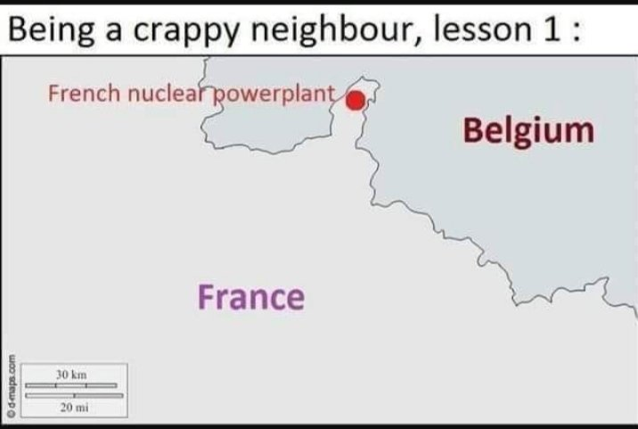
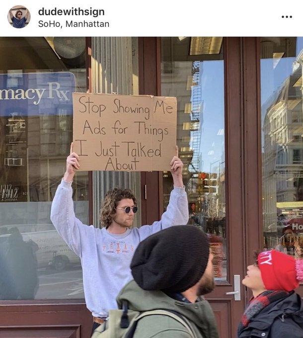

# Week 52

Saint Nicholas aka Santa Claus was from Anatolia. So he a tigger. 

Ho Ho Ho motherf..kas!!

🎅🎅🎅🎅

---


---

What a waste ... 

"Electric Vehicles – All That’s Left to do is Everything"

[Link](https://www.energycentral.com/o/esri/electric-vehicles-%E2%80%93-all-%E2%80%99s-left-do-everything)

---

<blockquote class="twitter-tweet"><p lang="en" dir="ltr">I’m going to start referring to cell phones as hand terminals. <a href="https://twitter.com/hashtag/TheExpanse?src=hash&amp;ref_src=twsrc%5Etfw">#TheExpanse</a></p>&mdash; The Moldy Filters (@TheMoldyFilters) <a href="https://twitter.com/TheMoldyFilters/status/1209603577754345474?ref_src=twsrc%5Etfw">December 24, 2019</a></blockquote> <script async src="https://platform.twitter.com/widgets.js" charset="utf-8"></script>

---

I remember the Kal-ee-fornia recall election run and the Ahnuld
campaign. He probably started out with consultants, slicing and dicing
"issues" (do this, u get 3.4%, do that u get %6, ..., add it up, we
win). I got this inkling bcz at some pt he said something abt the
"Armenian issue", and TR corporate media started shitting their pants,
this is when I heard. It's a good to issue to defend, but seriously,
WTF would Ahnuld know abt the Armenian issue. I bet some consult
weasel fakk said, "do this u get %1.5".

But I think governator later on saw this appr wouldn't work him, he
changed tack. He became ultra-pro green. Now that sells - a
Republican, very green, you stand out. It's an issue you can lead on, so
you look like a stand-up person.

Issues are not important on their own per se, especially when u r the
challenger. They need to contribute to your *character* which is.

And character needs to be part oaf + not crass + leader + relatable +
part cool. See urself as these, so ppl will see it that way too.

Be it. Know it. 

---

Authenticity, good. It will sell (not that Bernie does it 4 that
reason).

"@NickKristof

I admire the fact that @SenSanders speaks up for the Palestinians. I
suspect that this costs him votes every time he does it, and yet he
brings it up regularly. It's like his concern for the crisis in Yemen
-- no votes in it, but a sign of values and authenticity"

---

"@joshua_landis

Lebanon's bankers and the web of elite politicians who were
responsible for the economy make Madoff look like a mouse. His Ponzi
scheme grew to $65 billion. Riad Salameh, Lebanon's Central Banker
duped an entire nation for almost 3 times that & received a closet
full of honors"

---

Relational, comparative thinking = key. Some were going douche about a
moon landing hoax, I used this picture below to debunk it.


That's how ppl flew during 50s. In luxury, essentially in a metal can
hurling through air >500 miles/hr. If you can do that during 50s, u
can bet your ass u can do the moon landing during 60s.

---

Hey if it works for NASA it'll work for airplanes.

---

<blockquote class="twitter-tweet"><p lang="en" dir="ltr">Liquid hydrogen powered aircraft – the shape of things to come? - Airport World Magazine <a href="https://t.co/USrZ0TdNQE">https://t.co/USrZ0TdNQE</a> via <a href="https://twitter.com/airportworldmag?ref_src=twsrc%5Etfw">@airportworldmag</a></p>&mdash; Dmitry Chugunoff (@D_Chugunoff) <a href="https://twitter.com/D_Chugunoff/status/1209490324080517120?ref_src=twsrc%5Etfw">December 24, 2019</a></blockquote> <script async src="https://platform.twitter.com/widgets.js" charset="utf-8"></script>

---

What a mess at Boeing. Next thing u know they'll announce a battery electric airplane. Nosedive!

---

Sounds terrible.. i guess there is a reason why Saudi Arabia isnt
covered with forests, but barren deserts, and all places could turn
into Saudi Arabia bcz of global warming.

<blockquote class="twitter-tweet"><p lang="en" dir="ltr">In Australia, an entire national park burned to a cinder and Sydney now at risk. Watch this time sequence map and think - this is what climate change will do to the whole of Australia if business continues as usual.<br> <a href="https://t.co/VqtKNyoOPd">https://t.co/VqtKNyoOPd</a></p>&mdash; Prof Nick Cowern (@NickCowern) <a href="https://twitter.com/NickCowern/status/1208790593926774785?ref_src=twsrc%5Etfw">December 22, 2019</a></blockquote> <script async src="https://platform.twitter.com/widgets.js" charset="utf-8"></script>

---

Seems to work. Good shit.

[Code](convtest.py)

Positive result means non-convex. Bu neg does not rule out non-convexity
all together, watch out.

The [reference](https://www.youtube.com/watch?v=kcOodzDGV4c&t=1456s)
from Boyd's lecture as a hint for this method. 

```python
from scipy.optimize import rosen
import convtest
convtest.check_convex(rosen, gen=(5,),
                      max_iter=10000,max_inner=10,
                      random_state=0)
```

```text
not convex (diff=0.619807)
```

"@mblondel_ml

Proving that a function is convex is not always
easy. Here's a small script that I often use to get numerical evidence
that a function is convex before trying to prove it"

[Link](https://twitter.com/mblondel_ml/status/1208491731861282817)

---

How Cuomo blew NY’s high-tech success

[Link](https://t.co/TcmsXDIxve?amp=1)

---

Conspiracy Keanu


---

There is a top-level domain name .wtf. U cld have whatever.wtf. There
is internet.wtf.

---

Signed by HW. Interesting.

"[Since] 1992 Energy Policy Act, hydrogen is considered an alternate
fuel and is thus eligible for tax credits"

---

<blockquote class="twitter-tweet"><p lang="en" dir="ltr">This mind-bending timelapse with the Milky Way stabilized shows the Earth is spinning through space. <a href="https://t.co/mSEAKA8MaP">pic.twitter.com/mSEAKA8MaP</a></p>&mdash; Physics &amp; Astronomy Zone🔭 (@ZonePhysics) <a href="https://twitter.com/ZonePhysics/status/1209134019109101568?ref_src=twsrc%5Etfw">December 23, 2019</a></blockquote> <script async src="https://platform.twitter.com/widgets.js" charset="utf-8"></script>

---


This cost function will have a numerical differentiation along with
numerical integration which will again will be numerically
differentiated from outside to be optimized over. 

---

Yes. Follow the GA model -
[Related](https://muratk3n.github.io/thirdwave/en/2012/05/fabric-of-creativity.html)
~200 ppl per plant, and everyone, from designers to HR to managers are
near those plants.

"@unrocket

Unless Boeing returns to its roots as an Engineering Company, its
doomed. The new CEO is an accountant.

The first step should be to move management back to WA"

---

"@EuropaClipper

Laying the foundation. Engineers @JHUAPL prepare part
of our spacecraft’s propulsion module for shipment to @NASAJPL, where
construction will continue. Things are getting real for our mission to
Jupiter's mysterious moon: http://europa.nasa.gov"

---

"France: Symbio to Establish Europe's Largest Hydrogen Fuel Cell Plant
in Lyon"

[Link](https://fuelcellsworks.com/news/symbio-to-establish-europes-largest-hydrogen-fuel-cell-plant-in-lyon-france/)

---

"@Snowden

Your smartphone broadcasts your exact location thousands of times per
day to dozens of different companies. Each has the power to follow
individuals wherever they go, in near-real time"

[Link](https://mobile.twitter.com/Snowden/status/1209104006200676353)

---

Never shoot down single var Calculus. Line search, root finding, the
whole spiel around the descent property depends on it.

\#optimization

---



---

Section 2 of the Sherman Act of 1890. Hard core.

Sounds like vaporware is illegal.

---

A possible Nano fork which creates money in everyone's account
monthly/annually will get us the best of both worlds. It won't be
deflationary (like gold, Bitcoin), it will inflate away some wealth if
some are sitting on money for too long and it will spur spending,
create economic activity for the same reason. Also it gives money to
everyone, supplying a basic income electronically as a human right.

---

How did I come up with the interval analysis for the "dollar strong"
argument? We hear finance types say such things, dollar is strong,
then weak, etc. I dont believe a single word these f--ers say. Strong?
What does that mean? Relative to what?

Probably some historical average. Weak and strong would then be a
band, based on an interval of historical prices. How to construct such
an interval? Compute mean and standard deviation, mean - stdev, mean +
stdev gives a lower/higher band. About 68% of historical data points
fall here. 2 stdev below and above would get you 95%. If curr price is
closer to upper band, dollar is strong, close to lower, it is weak.

But dont believe me either - when someone says 68%, or 95%, how did
they come up with that? How do we derive it?

If prices are assumed to be normally distributed then we think of the
area around mean (data comes from, falls in that region), between
stdev to the left, and right. If any normal dist can be reduced to
standard normal dist N(0,1), the area is

```python
from scipy.stats.distributions import norm
np.round(norm.cdf(1)-norm.cdf(-1),2)*100
```

```text
Out[1]: 68.0
```

And

```python
np.round(norm.cdf(2)-norm.cdf(-2),2)*100
```

```text
Out[1]: 95.0
```

Now we know for sure


---

NOAA has some serious weather modeling going on. Gov and many others
use their results.

Of course its physics based not Deep Shit. Sorry - "AI".

---

The thing is SWars probably did need some young blood in terms of
directorial talent. So now maybe after all this fail the new-new blood
will form around Favreu, and.. Feige?  That'd be grand.

---

"California Governor Gavin Newsom rushed to defend wine caves, the
underground cellars where vintners can age wine in cool, dry
surroundings and host their fancy friends. Newsom happens to own a
wine cave, and he noted that the one where the Buttigieg event was
held is regularly used for Democratic Party fundraisers. Its owners,
Craig and Kathryn Hall, are longtime party donors; Kathryn was an
ambassador to Austria under President Bill Clinton. This battle might
be about money in progressive politics, but it’s also part of a much
larger war over American wealth, fought in part because of what the
internet has illuminated about the nation’s inequality" -- The Atlantic

[Link](https://www.theatlantic.com/health/archive/2019/12/why-people-hated-mayor-petes-wine-cave-fundraiser/604009/)

---

"[Contains spoilers] Nothing stays put in The Rise of
Skywalker. J. J. Abrams, the director and one of the co-writers, picks
up and ditches intriguing concepts so capriciously that viewers are
left feeling as if they’ve watched someone sneeze on all the items at
a fabulous buffet. This approach—which is “for want of a better word,
completely manic,” my colleague David Sims wrote—is a big part of the
negative critical reaction to the movie. But the wasteful use of
settings, doodads, characters, and space horses does not just exhaust
the audience. It also undermines the most essential prerogative of
Star Wars: world-building.

Lucas’s original trilogy didn’t fret all that much about having a
clever plot. The arc from A New Hope to Return of the Jedi was a
relatively clean and straightforward one about good guys struggling to
overthrow bad ones, with limited detours to explore the consequential
backstory of the main hero and main villain. Upon this sturdy spine,
Lucas and his team draped exquisite set pieces set in interesting
locations. The characters lingered in snow bases and treetop
villages. The journey was absolutely as important as the destination" -- The Atlantic

[Link](https://www.theatlantic.com/entertainment/archive/2019/12/star-wars-rise-skywalker-gives-world-building/604000)

---

"@AssaadRazzouk

Something very big happened in the Netherlands recently and it will
have a ripple effect in Courts around the world: The Netherlands’
Supreme Court upheld a ruling ordering the country’s government to
reduce greenhouse gas emissions by 25% by the end of 2020

The Dutch Supreme Court affirmed that Government's care is directed at
'keeping the country habitable and protecting and improving the
environment',

Even 'if the State itself is not the cause of all Dutch greenhouse gas
emissions',

Even 'if Dutch emissions of greenhouse gases in absolute terms,
compared to global emissions, are very low',

Even 'if the State cannot solve the emissions problem on its own',

... The State should, from its own territory, take measures to the
best of its ability that, together with the efforts of other States,
offer protection against the dangers of serious climate change.

So: The limited partial responsibility of the Dutch State in relation
to the global climate problem does not relieve the State of the duty
of care it bears: The government had explicit duties to protect its
citizens’ human rights in the face of climate change"

[Link](https://twitter.com/AssaadRazzouk/status/1208643081056276480)

---



---

"@ZLabe

The 5 warmest average January-November global temperatures have all
occurred within the last 5 years..."

---

<blockquote class="twitter-tweet"><p lang="en" dir="ltr">Thank goodness we are getting Brexit done. It will clearly help with the following: <a href="https://t.co/D2Lui6DzZS">https://t.co/D2Lui6DzZS</a></p>&mdash; Mark Blyth (@MkBlyth) <a href="https://twitter.com/MkBlyth/status/1208317852018601984?ref_src=twsrc%5Etfw">December 21, 2019</a></blockquote> <script async src="https://platform.twitter.com/widgets.js" charset="utf-8"></script>

---

Hahaha..

"Election result: 52% of votes go to pro-referendum parties"

---

"@EFF

If 2019 confirmed anything, it is that we should not trust the
microphones and cameras that large corporations sell us to put inside
and near our homes"

---

U-oh

"Trump signs $738B defense bill including sanctions targeting Russia,
Turkey"

[Link](https://www.dailysabah.com/americas/2019/12/21/trump-signs-738b-defense-bill-including-sanctions-targeting-russia-turkey)

---

I'd say 'left', but other than that bang on

"@JRehling

Franklin Graham: 'There’s a liberal element within the evangelical
movement.'

Yeah, I think that started with a man from Nazareth who said you
should help the poor and heal the sick and welcome strangers. Liberal
through and through"

---

<blockquote class="twitter-tweet"><p lang="en" dir="ltr">We’re going to cancel every penny of student debt, and we’re going to pay for it with a modest tax on Wall Street.<br><br>Wall Street doesn’t like that, but to hell with Wall Street.</p>&mdash; Bernie Sanders (@BernieSanders) <a href="https://twitter.com/BernieSanders/status/1208192862476754944?ref_src=twsrc%5Etfw">December 21, 2019</a></blockquote> <script async src="https://platform.twitter.com/widgets.js" charset="utf-8"></script>

---

<blockquote class="twitter-tweet"><p lang="en" dir="ltr">How can we afford purity tests when it takes an entire hour of legal work for Harvey Weinstein to buy just one $900 bottle of cabernet?</p>&mdash; Ryan Grim (@ryangrim) <a href="https://twitter.com/ryangrim/status/1208003258133962752?ref_src=twsrc%5Etfw">December 20, 2019</a></blockquote> <script async src="https://platform.twitter.com/widgets.js" charset="utf-8"></script>

---
 
10 yrs ago I used to watch that BBC weekly show with Gavin something
(great host) w journos discussing the week. I dont see it online, now
I watch *World This Week* on France 24 Eng. Change of times? Brits are
way too far gone to analyze the world anymore?

---

"progress"

<blockquote class="twitter-tweet"><p lang="en" dir="ltr">This is what happens when you stand in the way of progress. <a href="https://t.co/53xqK2dSWu">https://t.co/53xqK2dSWu</a></p>&mdash; Christopher Ryan (@ThatChrisRyan) <a href="https://twitter.com/ThatChrisRyan/status/1208161933783785472?ref_src=twsrc%5Etfw">December 20, 2019</a></blockquote> <script async src="https://platform.twitter.com/widgets.js" charset="utf-8"></script>

---

"Sanders Is Hot in the Polls, and Still Treated Like a Second-Tier Candidate"

[Link](https://www.vice.com/en_us/article/m7qjz4/sanders-is-hot-in-the-polls-and-still-treated-like-a-second-tier-candidate)

---

<blockquote class="twitter-tweet"><p lang="en" dir="ltr">For too long, big pharmaceutical companies have gotten away with ripping off the American people. <br><br>I’m not going to allow that to continue. <br><br>We are going to cap out of pocket expenses for prescription drugs at $200 a year.</p>&mdash; Bernie Sanders (@BernieSanders) <a href="https://twitter.com/BernieSanders/status/1207755972460109828?ref_src=twsrc%5Etfw">December 19, 2019</a></blockquote> <script async src="https://platform.twitter.com/widgets.js" charset="utf-8"></script>

---

This is odd. Two EU members (France and Italy) backing different sides
in Libyan civil war.

"In Libya, where dozens of rival militias have been fighting for
supremacy since the 2011 NATO war, the two EU members are conducting a
proxy war over control of Africa’s largest oil and gas resources.

While Italy backs the Government of National Accord (GNA) of Fayez
al-Sarraj in Tripoli, which is also supported by Germany and the UN,
France has sided with the National Army of Libya (LNA) of Field
Marshal Khalifa Haftar, who presides over its counterpart in
Tobruk. Egypt and Russia also back Haftar"

[Link](https://www.wsws.org/en/articles/2019/02/26/liby-f26.html)

---

<blockquote class="twitter-tweet"><p lang="en" dir="ltr">No. Just notice what is going on around you, the huge state subsidy for mothers who leave their children in day-orphanages while they toil as wageslaves. The erosion to nothing of parental authority. <a href="https://t.co/DUgbHctVck">https://t.co/DUgbHctVck</a></p>&mdash; Peter Hitchens (@ClarkeMicah) <a href="https://twitter.com/ClarkeMicah/status/1207775608975101954?ref_src=twsrc%5Etfw">December 19, 2019</a></blockquote> <script async src="https://platform.twitter.com/widgets.js" charset="utf-8"></script>

---

People are better at judging people than policy, but even that fails
sometimes. So ppl judge a person based on guess who's thinking?

That's right - their own. That same person's idea of themselves. 

"People will see you as u see yourself" is an old chestnut but it is
true, especially in politics. So when attacked u need to attack back,
because, "pfff of *course* there is nothing wrong with me".

This is the game - mostly about how things look. 

---

Two Star Wars fans I've seen were *disturbed* after this last
one. Like Whhhhaaaat da f%%$% was DAT? With long face, looking down
and everything. I didnt think anyone could make a movie that bad.  I
never thought I'd think fondly of the prequels. The latest shit makes
them look like masterpieces!

---

This should be an honor for you Booty. This is the most u'll get out
of this race. I'd frame that moment and tell my family and friends
about that time I got chewed out by Bernie.

\#demdebate

---

Bootyjudge was just slam dunked by his one-time hero, right?

\#demdebate

---

FTW is WTF in reverse. WTF

---


Bernie FTW

\#demdebate

---

"@MtthewRubiin

This is amazing. Please look at Peter Buttigieg's face when Bernie
says he's a competitive guy and wishes him luck on catching up with
Joe in the billionaire supporter contest. "

\#demdebate

[Link](https://twitter.com/MtthewRubiin/status/1207894298227859458)

---

Klobbamancha did some damage. And that wine cellar thing. 

\#demdebate

---

<blockquote class="twitter-tweet"><p lang="en" dir="ltr">So many more ways to make (and save) money in Macro than listening to a monkey on &quot;stocks&quot;</p>&mdash; Keith McCullough (@KeithMcCullough) <a href="https://twitter.com/KeithMcCullough/status/1207970440599265281?ref_src=twsrc%5Etfw">December 20, 2019</a></blockquote> <script async src="https://platform.twitter.com/widgets.js" charset="utf-8"></script>

---

<blockquote class="twitter-tweet"><p lang="en" dir="ltr">Ørsted, Everfuel and five partners have been awarded funding for a demonstration project in <a href="https://twitter.com/hashtag/copenhagen?src=hash&amp;ref_src=twsrc%5Etfw">#copenhagen</a> Denmark, using offshore wind power to produce renewable <a href="https://twitter.com/hashtag/hydrogen?src=hash&amp;ref_src=twsrc%5Etfw">#hydrogen</a> for <a href="https://twitter.com/hashtag/zeroemission?src=hash&amp;ref_src=twsrc%5Etfw">#zeroemission</a> road transport.<a href="https://twitter.com/hashtag/cleanhydrogen?src=hash&amp;ref_src=twsrc%5Etfw">#cleanhydrogen</a><br><br>Press release: <a href="https://t.co/NgnJ5DWa6L">https://t.co/NgnJ5DWa6L</a> <a href="https://t.co/712vQprM4x">pic.twitter.com/712vQprM4x</a></p>&mdash; Everfuel (@EverfuelEU) <a href="https://twitter.com/EverfuelEU/status/1207936294803906560?ref_src=twsrc%5Etfw">December 20, 2019</a></blockquote> <script async src="https://platform.twitter.com/widgets.js" charset="utf-8"></script>

---

<blockquote class="twitter-tweet"><p lang="en" dir="ltr">&quot;Python already replaced Excel in banking&quot; <a href="https://t.co/vQkVZMxVFh">https://t.co/vQkVZMxVFh</a></p>&mdash; Sarah Butcher (@MadameButcher) <a href="https://twitter.com/MadameButcher/status/1191375650688503809?ref_src=twsrc%5Etfw">November 4, 2019</a></blockquote> <script async src="https://platform.twitter.com/widgets.js" charset="utf-8"></script>

---

"@fshakir 

Military members have donated more to @BernieSanders’ campaign than to
Trump, Biden, and Buttigieg combined"

---

<blockquote class="twitter-tweet"><p lang="en" dir="ltr">On my way 2 meeting in <a href="https://twitter.com/hashtag/Dusseldorf?src=hash&amp;ref_src=twsrc%5Etfw">#Dusseldorf</a> about our ambitious trilateral cross-border <a href="https://twitter.com/hashtag/greenhydrogen?src=hash&amp;ref_src=twsrc%5Etfw">#greenhydrogen</a> project w/ <a href="https://twitter.com/hashtag/Germany?src=hash&amp;ref_src=twsrc%5Etfw">#Germany</a> &amp; <a href="https://twitter.com/hashtag/NRW?src=hash&amp;ref_src=twsrc%5Etfw">#NRW</a> reading about break-out of a ‘hydrogen fever’ in Germany...exciting times! <a href="https://t.co/NIUXWGQD2o">pic.twitter.com/NIUXWGQD2o</a></p>&mdash; Noe van Hulst (@noevanhulst) <a href="https://twitter.com/noevanhulst/status/1207626913918996480?ref_src=twsrc%5Etfw">December 19, 2019</a></blockquote> <script async src="https://platform.twitter.com/widgets.js" charset="utf-8"></script>

---

<blockquote class="twitter-tweet"><p lang="en" dir="ltr">The effect of cold weather on electric bus range, fuel cell wins. A study by Center for Transportation and the Environment.<a href="https://t.co/CtWmKmlJxA">https://t.co/CtWmKmlJxA</a></p>&mdash; Sustainable Bus (@BusSustainable) <a href="https://twitter.com/BusSustainable/status/1207646810141057024?ref_src=twsrc%5Etfw">December 19, 2019</a></blockquote> <script async src="https://platform.twitter.com/widgets.js" charset="utf-8"></script>

---
