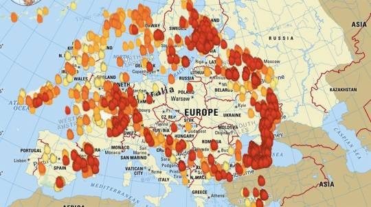
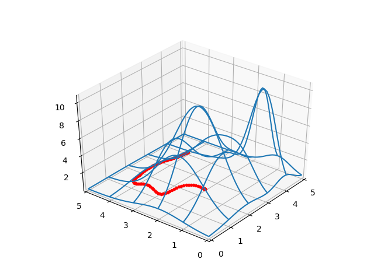
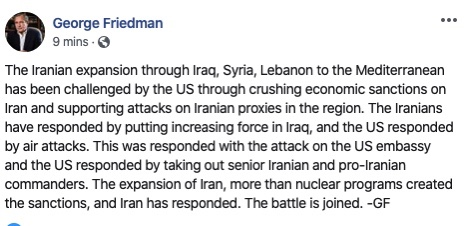

# Week 1

<blockquote class="twitter-tweet">
Toyota to Build Prototype City of the Future Powered by Hydrogen Fuel Cells--175-acre site at the base of Mt. Fuji in Japan. Called the Woven City, it will be a fully connected ecosystem powered by <a href="https://twitter.com/hashtag/hydrogen?src=hash&amp;ref_src=twsrc%5Etfw">#hydrogen</a> <a href="https://twitter.com/hashtag/fuelcells?src=hash&amp;ref_src=twsrc%5Etfw">#fuelcells</a>-<a href="https://t.co/XC5Kk6MToH">https://t.co/XC5Kk6MToH</a> <a href="https://twitter.com/hashtag/hydrogennow?src=hash&amp;ref_src=twsrc%5Etfw">#hydrogennow</a> <a href="https://twitter.com/hashtag/fuelcell?src=hash&amp;ref_src=twsrc%5Etfw">#fuelcell</a> <a href="https://twitter.com/hashtag/decarbonise?src=hash&amp;ref_src=twsrc%5Etfw">#decarbonise</a> <a href="https://t.co/3g2vLBdRJg">pic.twitter.com/3g2vLBdRJg</a>
&mdash; FuelCellsWorks (@fuelcellsworks) <a href="https://twitter.com/fuelcellsworks/status/1214537592852615175?ref_src=twsrc%5Etfw">January 7, 2020</a></blockquote> 

---

<blockquote class="twitter-tweet">
One of the most remarkable transformations in the global energy system in 2019, according to <a href="https://twitter.com/IRENA?ref_src=twsrc%5Etfw">@IRENA</a>: <a href="https://twitter.com/hashtag/Australia?src=hash&amp;ref_src=twsrc%5Etfw">#Australia</a> and <a href="https://twitter.com/hashtag/Japan?src=hash&amp;ref_src=twsrc%5Etfw">#Japan</a> expanded their support for clean <a href="https://twitter.com/hashtag/hydrogen?src=hash&amp;ref_src=twsrc%5Etfw">#hydrogen</a> as renewable costs became increasingly competitive <a href="https://t.co/shHlxQCPOM">https://t.co/shHlxQCPOM</a>
&mdash; Hydrogen Council (@HydrogenCouncil) <a href="https://twitter.com/HydrogenCouncil/status/1214554782939131905?ref_src=twsrc%5Etfw">January 7, 2020</a></blockquote> 

---

<blockquote class="twitter-tweet">
Hydrogen Refuelling Now Five Times Faster--Scientists at the Helmholtz-Zentrum Geesthacht are developing <a href="https://twitter.com/hashtag/hydrogen?src=hash&amp;ref_src=twsrc%5Etfw">#hydrogen</a> storage systems based on light metal hydrides--<a href="https://t.co/3NzR0wUz0k">https://t.co/3NzR0wUz0k</a> <a href="https://twitter.com/hashtag/hydrogennow?src=hash&amp;ref_src=twsrc%5Etfw">#hydrogennow</a> <a href="https://twitter.com/hashtag/decarbonise?src=hash&amp;ref_src=twsrc%5Etfw">#decarbonise</a> <a href="https://twitter.com/hashtag/zeroemissions?src=hash&amp;ref_src=twsrc%5Etfw">#zeroemissions</a> <a href="https://twitter.com/hashtag/fuelcell?src=hash&amp;ref_src=twsrc%5Etfw">#fuelcell</a> <a href="https://twitter.com/hashtag/fuelcells?src=hash&amp;ref_src=twsrc%5Etfw">#fuelcells</a> <a href="https://t.co/FAHejH9xBe">pic.twitter.com/FAHejH9xBe</a>
&mdash; FuelCellsWorks (@fuelcellsworks) <a href="https://twitter.com/fuelcellsworks/status/1214558490930434048?ref_src=twsrc%5Etfw">January 7, 2020</a></blockquote> 

---

<blockquote class="twitter-tweet">
😂 <a href="https://t.co/aUyjG7RkJ8">https://t.co/aUyjG7RkJ8</a>
&mdash; Ricky Gervais (@rickygervais) <a href="https://twitter.com/rickygervais/status/1214419696482697216?ref_src=twsrc%5Etfw">January 7, 2020</a></blockquote> 

---

"@enagas promotes investments of €2,250M to make Spain a \#hydrogen
exporting nation"

[Link](https://mobile.twitter.com/H2Europe/status/1214485080174989312)

---

Of course cannot find a straightforward math -> code -> demo -> output
anywhere using OSS for denoising. Wikipedia references a
`demo_tv.m`. U go to this guy's code huge chunks are missing. 

---

"For ground-breaking science u almost don't want a good
student. Because good students will overfit to bullshit"

---

"@SenSanders

The president can boast about the stock market all he wants—the
American people know it doesn't put food on the table. We need an
economy that works for the many, not just the wealthy and large
corporations"

---

🚗🚗🚗 THE HEAD OF FRICKIN BMW R&D 🚗🚗🚗

"BMW R&D Chief Klaus Froehlich:

[Y]ou cannot electrify a heavy truck with batteries, because reducing the payload from 6 tons to 7 tons is absolute nonsense. With a single recharging station, you can refuel a fleet of 100 hydrogen-powered light trucks overnight. About 200 highway refueling stations could serve thousands of heavy trucks across Europe, which means that on the infrastructure side, this is feasible"

[Link](https://europe.autonews.com/automakers/bmw-rd-chief-sees-rising-demand-diverse-multifunctional-powertrains)

---

<blockquote class="twitter-tweet">
Mind blown. <a href="https://twitter.com/trevorwardill?ref_src=twsrc%5Etfw">@trevorwardill</a> put 3D glasses on swimming cuttlefish to test for stereopsis and it WORKED. Cuttlefish have depth perception through image disparity! <a href="https://t.co/cfB381V9vc">pic.twitter.com/cfB381V9vc</a>
&mdash; Katie Thomas 🦑 (@katiethomas10) <a href="https://twitter.com/katiethomas10/status/1213909329998430211?ref_src=twsrc%5Etfw">January 5, 2020</a></blockquote> 

---

ooOoo I wonder who it is

<blockquote class="twitter-tweet">
Plug Power Receives $172M Order for Hydrogen &amp; Fuel Cell Solutions From Fortune 100 Customer-Contract for <a href="https://twitter.com/PlugPowerInc?ref_src=twsrc%5Etfw">@PlugPowerInc</a> GenDrive <a href="https://twitter.com/hashtag/fuelcell?src=hash&amp;ref_src=twsrc%5Etfw">#fuelcell</a> power, GenFuel <a href="https://twitter.com/hashtag/hydrogen?src=hash&amp;ref_src=twsrc%5Etfw">#hydrogen</a> fuel, storage &amp; dispensing infrastructure, &amp; aftermarket service &amp; support-<a href="https://t.co/cyT0szZEaO">https://t.co/cyT0szZEaO</a> <a href="https://twitter.com/hashtag/hydrogennow?src=hash&amp;ref_src=twsrc%5Etfw">#hydrogennow</a> <a href="https://t.co/cRyzXrAcTY">pic.twitter.com/cRyzXrAcTY</a>
&mdash; FuelCellsWorks (@fuelcellsworks) <a href="https://twitter.com/fuelcellsworks/status/1214183067281166336?ref_src=twsrc%5Etfw">January 6, 2020</a></blockquote> 

---

"@mikko_neuvo

I put Australian fires on a map of Europe to get a better idea of
their extent"

---

News is filled with names that are common to us... Ali's, Sait's,
Soleiman's. I know a few TR Suleyman's. Not just brown bros either,
Nordic lookin mofos. I'll be like yo whassup Suleyman, and he'll be
like "yo what'up my nigger". i know gazillion Ali's. Sait is my late
great grandfather.

---

---

Func becomes better differentiable this way, with sig instead of
max. Nowadays automatic differentiation packages can diff anything
including max, but still, a friendly, symbolic diff ready func is a
good thing.

---

Lit saz piecewise splines are implemented with `c0 + c1*max(0,u-a) +
c2*max(u-b) + ...`. U can get bunch of connected lines this way
wiggling any way you want.. a,b are knots.

So `max` is just a switch. I thinks I can smootha dat, `def s(u,b):
return (u-k)*1/(1+exp(-tau*(u-k)))`, little smooth func that flips
gentler instead of max, nam sayin'? Then `c0 + c1*s(x,a) +
c2*s(x-b) + ...`. Sheeee-iiit

Works really well. Even in parametrized form over `t`. But I cant find
uses of this anywhere.. I cant be the 1st jagoff who thought of this

(Yees I know it's sigmoid bitch, but it's not for neuratic neural
nets.. It's for optimization)

---

Most of this is in jest - Elba is great, so is Cavill. Big fan of both.

---

Haha.. that's right - there was a tussle between Samuel Jackson and
Idris Elba wasn't there, SJ was like what's "wrong with American
blacks they keep getting these foreign blacks?". For minorities the
situation wld be more pronounced of course, bcz (if) there's a certain
"black quota" in mainstream movies let's say and when u give that to a
Brit, the American black in Holywood loses

---

Beans on toast? Dude u'd have to put a gun to someone's head here to
make'm eat that shit.

---

US, Holywood has totally been invaded by these people. Sman is
gone. What's next? A British Batman? Oh I forgot the next Batman is
British.

---

Emily Blunt is Brit too? 

---

This Brit psycic is a con man, a *Leave the Child Behind* type BTW
escaping responsibility / reality with non-sense. Grow the eff up.

He also seems to be a "Tory Psycic", so I am guessing his predictions
will stop working once Tories are out of power.

---

Does he know Baba Vanga?

---

Psycic thinks he hears other mediums, or a Baba talking to him..

What you are hearing is the burrito you had for lunch coming out of
your ass. It is the sound of your own farting... "I am hearing voices
from beyond!". No - it's voices from below moth-f-ka, like, your
ass. fffff ff fffff f - "he is talking to me!". Yes he is telling u to
go to the bathroom. Hurry

---

If we can get fast payments done, there are gazillion
possibilities. Payments for artists can become extremely
efficient. Say I am listening to a song, *War*, I can send a payment
to that name, to that song, direct. That name will be placeholder, all
$$ to that name is distributed to all stakeholders behind that
name. It could be Edwin Starr, the Tempations, James Brown, or Chris
Tucker and JChan for singing it that one time in a movie - I dont
care. People can argue among themselves in courts who needs to be part
of that distribution.

---

I am liking comments in code less and less. For a expr coder they get
in the way. I think doc outside of code, even referencing particular
lines in code might be much better.

---

Call ISIS the result of Sunni frustration or due to diabolical allies,
the result is the same. The whole shabang was the outcome of an
US-Iran raproachement. 

---

Bam approach was abt cajoling Iran for a nuclear deal. Old allies
however freaked out and "out of nowhere" ISIS terror started - this is
when Soleimani was "fighting ISIS"-. Now nuke deal is gone, old allies
are new again, Iran is under pressure. Soleimani was now back fighting
US before he was killed. ISIS of course has magically disappeared.

"@washingtonpost

Iran announces it is suspending all commitments to the 2015 nuclear deal"

---

"Induction heating occurs when a high frequency alternating current is
passed through a coil. Because of this, the induced magnetic field in
the surroundings is swinging rapidly, stirring polar particles
(particles that have a distinct plus and minus pole even if they’re
electrically neutral overall) in the field. This can result even in
ripping molecules apart (dissociation) and knocking electrons out of
their orbitals (ionization). The charged remnants are ions and
electrons, forming a plasma. Because of this, the device is called an
“inductive plasma generator” or IPG...

Generating a plasma without contact, the propellant cannot damage
e.g. electrodes. This allows a near arbitrary selection of gasses as
propellant, and therefore viable in-situ resource utilization
concepts. Even space station wastes could be fed to such a thruster"

[Link](https://www.beyondnerva.com/2018/10/05/electric-propulsion-part-1-thermal-and-magnetoplasmadynamic-thrusters)

---

Yes enough with this singular effort bull. Billionaires, individuals
through "personal empowerment" are asked to solve things that are
mostly the (intended) effects of a system.

<blockquote class="twitter-tweet">
Maybe. But I think &quot;humans&quot; are embedded in systems that are beyond their control, like termites, ants, flocking birds, schooling fish, and so on. We have much less control than most of us think. <a href="https://t.co/8LwxrfeGyo">https://t.co/8LwxrfeGyo</a>
&mdash; Christopher Ryan (@ThatChrisRyan) <a href="https://twitter.com/ThatChrisRyan/status/1213701980800946177?ref_src=twsrc%5Etfw">January 5, 2020</a></blockquote> 

---

Apparently it's possible to excite propellant molecules magnetically
and push electrons out from a nozzle pushing a small rocket. By small
I mean small. Cubesats are tiny. And it only works in vacuum (in
space, getting to space from Earth not possib). Still - cool.

🚀🚀🚀🚀🚀🛰🛰🛰🛰🛰🛰

"@Aaron_M_DeVries

I ordered a small 12 volt induction heating coil. I'm going to make a
tiny low power induction thermal thruster along with the larger one.

Can see how it scales. Also a tiny thruster that can run off 2 9 volt
batteries opens up #cubesat possibility \#space \#science"

---

"@billmckibben

Since October, Australia's #bushfires have spewed as much carbon into
the air as the entire country produces from every car, home, and
factory in a typical eight months. Climate chaos feeds on itself now"

---

All the bombast aside he could be okay with a war that would
surgically remove the mullahs and keep him as the official executive
of the country.

(The unelected mullahs sit above the elected rep in their *velayet-i
fakih* system which the elected does not like at all)

"@DEFCONWSALERTS

Iranian President says that retaliation against the United States is
necessary"

---

A lot of the latest ME protests before Soleimani assasination were anti-Iran 

[Link](https://www.theatlantic.com/international/archive/2020/01/qassem-soleimani-death-missed/604396)

[Link](https://youtu.be/6vpk0A5D2v4?t=339)

We'll see if latest events cause a change in the winds. 

---

One soln for less US attack would be US leaving the region but that
does not seem to be an option.

If in, US now cares for its allies. But then once in a while u have to
show up to the barfight, throw some stools. The barowner could get
pissed. It can all end up in a duel at high noon.

---

Study: Cold Weather Has Significant Impact On Electric Bus Range

[Link](https://insideevs.com/news/390589/study-cold-weather-effects-electric-bus-range/amp/)

---

PMI [fell](../../2021/01/stats.html#pmi) *again*.
It's been down since Aug '19, sub 50. 

And wait until 19Q4 GDP comes out. Near zero will make ppl's eyes go pop 👀

---

"Portugal has found an antidote to right wing populism"

[Link](https://kontrast.at/portugal-economy-right-wing/amp/?fbclid=IwAR0tIXdPeXiSjClCLnxCfyUave5grijLOLhvwPUBmDaXzSLNPd1o0L7gp70)

---

Yes yeeees John Adams saw first baloon flight in Paris during end of
1700s, I remember this from his bio. Imagine the fascination.. It's no
small feat, a major traveling tool, offering great views, and access.

[Link](https://airandspace.si.edu/stories/editorial/presidential-writings-reveal-early-interest-ballooning)

---

Basically what happened before 07/08 crisis.

"Mortgage fraud occurs when a potential homebuyer, seller, or lender lies or omits key information that leads to a mortgage loan approval or terms that the applicant wouldn't normally qualify to receive".

---

<blockquote class="twitter-tweet">
Yesterday, 10:55a Chilean time, our six man crew on board the Ohana row boat completed the world’s first fully human-powered and unsupported crossing of Drake Passage, from Cape Horn in South America to the Antarctica Peninsula. I am deeply proud to be a part of this team. <a href="https://t.co/WA2lmrvBBL">pic.twitter.com/WA2lmrvBBL</a>
&mdash; Colin O&#39;Brady (@colinobrady) <a href="https://twitter.com/colinobrady/status/1210271656465166336?ref_src=twsrc%5Etfw">December 26, 2019</a></blockquote> 

---

FF is the band's name. FF the man obviously is the historical figure
whose assasination triggered WWI. Tragic funny

<blockquote class="twitter-tweet">
For the record, we think <a href="https://twitter.com/hashtag/WWIII?src=hash&amp;ref_src=twsrc%5Etfw">#WWIII</a> is a bad idea.
&mdash; Franz Ferdinand (@Franz_Ferdinand) <a href="https://twitter.com/Franz_Ferdinand/status/1213069912257781760?ref_src=twsrc%5Etfw">January 3, 2020</a></blockquote> 

---

🎸🎸🎸🎸🎶🎶🎵🎵🎵💦💦💦💦💥💥💥💥

<blockquote class="twitter-tweet">
<a href="https://twitter.com/hashtag/Hydrogen?src=hash&amp;ref_src=twsrc%5Etfw">#Hydrogen</a> powered <a href="https://twitter.com/hashtag/RockNRoll?src=hash&amp;ref_src=twsrc%5Etfw">#RockNRoll</a>: During <a href="https://twitter.com/U2?ref_src=twsrc%5Etfw">@U2</a>&#39;s concert at Tokyo&#39;s Saitama Super Arena, Edge&#39;s guitar, Adam&#39;s bass, &amp; the entire backline ran on <a href="https://twitter.com/hashtag/cleanhydrogen?src=hash&amp;ref_src=twsrc%5Etfw">#cleanhydrogen</a> power. <a href="https://twitter.com/hashtag/Fuelcell?src=hash&amp;ref_src=twsrc%5Etfw">#Fuelcell</a>-powered <a href="https://twitter.com/ToyotaMotorCorp?ref_src=twsrc%5Etfw">@ToyotaMotorCorp</a> <a href="https://twitter.com/hashtag/Mirai?src=hash&amp;ref_src=twsrc%5Etfw">#Mirai</a> vehicles stored the energy that delivered the power.<a href="https://t.co/XaiZWOQvRw">https://t.co/XaiZWOQvRw</a> <a href="https://t.co/iRjFOW2mYw">pic.twitter.com/iRjFOW2mYw</a>
&mdash; Hydrogen Europe (@H2Europe) <a href="https://twitter.com/H2Europe/status/1213017417691156480?ref_src=twsrc%5Etfw">January 3, 2020</a></blockquote> 

---

Good choice Riksbank Sweden. We are back to Defcon 3.

Stop funding that joke of a "Nobel Prize" we could even go down to
Defcon 1.

"Sweden Ends Its Experiment.

Negative rates are the destruction of money, an economic aberration
based on the mistakes of many central banks and some of their
economists who start from a wrong diagnosis: the idea that economic
agents do not take more credit or invest more because they choose to
save too much and therefore saving must be penalized to stimulate the
economy... it is a ludicrous idea.

Inflation and growth are not low due to excess savings, but because of
excess debt, perpetuating overcapacity with low rates and high
liquidity and zombifying the economy by subsidizing the low
productivity and highly indebted sectors ...

Sweden launched its failed negative rate plan almost five years ago
and now reverses it due to the financial risks that are created. The
most interesting thing is that it reverses the policy of negative
rates precisely because of the risk of an economic slowdown because
the evidence shows that investment and consumption decisions do not
increase with financial repression"

[Link](https://app.hedgeye.com/insights/80137-negative-rates-the-destruction-of-money-sweden-ends-its-experiment)

---

Soleimani was Iran's go-to person, whenever they needed something done
the mullahs would send in this guy. Like triggering an insurgency in
Iraq against US.

---

<blockquote class="twitter-tweet">
Just to put things into perspective: The average US worker must now work 126 hours to buy 1 share of S&amp;P 500. That&#39;s a fresh record. In the 1980s, it took less than 20 hours. (Idea via <a href="https://twitter.com/HirudoStreet?ref_src=twsrc%5Etfw">@HirudoStreet</a>) <a href="https://t.co/9M2y0g5vs4">pic.twitter.com/9M2y0g5vs4</a>
&mdash; Holger Zschaepitz (@Schuldensuehner) <a href="https://twitter.com/Schuldensuehner/status/1212729502901702657?ref_src=twsrc%5Etfw">January 2, 2020</a></blockquote> 

---

"Libyan Rebels Shoot Down Turkish Plane Moments After Ankara Approves
Sending Troops"

@zerohedge

---

<blockquote class="twitter-tweet">
China: SinoHytec Launches its New <a href="https://twitter.com/hashtag/Hydrogen?src=hash&amp;ref_src=twsrc%5Etfw">#Hydrogen</a> <a href="https://twitter.com/hashtag/FuelCell?src=hash&amp;ref_src=twsrc%5Etfw">#FuelCell</a> Engine--100% of the core components are produced with own intellectual property rights for the 1st time, the power density exceeds 500W/kg, and the cost is reduced by 30%--<a href="https://t.co/G6re1KYIFL">https://t.co/G6re1KYIFL</a> <a href="https://twitter.com/hashtag/hydrogennow?src=hash&amp;ref_src=twsrc%5Etfw">#hydrogennow</a> <a href="https://twitter.com/hashtag/decarbonise?src=hash&amp;ref_src=twsrc%5Etfw">#decarbonise</a> <a href="https://t.co/6WeQfQEanZ">pic.twitter.com/6WeQfQEanZ</a>
&mdash; FuelCellsWorks (@fuelcellsworks) <a href="https://twitter.com/fuelcellsworks/status/1212772628160811009?ref_src=twsrc%5Etfw">January 2, 2020</a></blockquote> 

---

<blockquote class="twitter-tweet">
Macauley Culkin is two years older than Pete Buttigieg
&mdash; Tyler Buchanan (@Tylerjoelb) <a href="https://twitter.com/Tylerjoelb/status/1212249696246349824?ref_src=twsrc%5Etfw">January 1, 2020</a></blockquote> 

---

Not necessarily. Digital basic income could create some new
options. DBI holders could contribute $ to a pool for instance which
can act as a lender to businesses. That credit will fuel growth,
create more services and goods, more money chasing after more
services, so-so inflation.

"If the ppl get digital income, and money base expands 4% annually
wouldnt that create a lot of inflation?"

---

"The best verdict on Game of Thrones came from one of its guest stars,
Ian McShane. With the nonchalance of an actor who spent the ’80s
making rent by playing a semimystical antiques dealer in a British
teatime drama, McShane declared that everyone needed to calm down
about George R. R. Martin’s epic saga. It was, after all, “only tits
and dragons.”The reaction from the HBO program’s more hard-core fans
was predictable outrage"

[Link](https://www.theatlantic.com/entertainment/archive/2020/01/the-witcher-is-absurd-thats-why-its-brilliant/604297/)

---

<blockquote class="twitter-tweet">
Surprised to find Lidar worked pretty well to detect the grass edges <a href="https://t.co/2N7gOCF01O">pic.twitter.com/2N7gOCF01O</a>
&mdash; SmallpixelCar (@SmallpixelCar) <a href="https://twitter.com/SmallpixelCar/status/1211389873409540096?ref_src=twsrc%5Etfw">December 29, 2019</a></blockquote> 

---

Germany's Bosch to offer lower-cost sensors for self-driving cars

[Link](https://www.reuters.com/article/us-autos-bosch-lidar/germanys-bosch-to-offer-lower-cost-sensors-for-self-driving-cars-idUSKBN1Z10EK)

---

I shouldnt make fun.. that could be somebody's girlfriend.

---

Passing through town to get to wilderness. Still near "civilization".

---

Paper published on December 6. Hot off the press.

<blockquote class="twitter-tweet">
New Way to Make Hydrogen Energy Out of Water Much More Cheaply <a href="https://t.co/jysP9WkGQS">https://t.co/jysP9WkGQS</a>
&mdash; H2FC Future Now (@Cgnewday) <a href="https://twitter.com/Cgnewday/status/1212550971437412352?ref_src=twsrc%5Etfw">January 2, 2020</a></blockquote> 

---

😆😆 Owls are awesome 🦉🦉🦉🦉

<blockquote class="twitter-tweet">
Who?
&mdash; PaulF (@ProfFrisch) <a href="https://twitter.com/ProfFrisch/status/1212577250866081793?ref_src=twsrc%5Etfw">January 2, 2020</a></blockquote> 

---

The man. The legend.

<blockquote class="twitter-tweet">
&gt;&gt;&gt; greetings = [&quot;world hello&quot;, &quot;nieuwjaar gelukkig&quot;, &quot;happy year new&quot;] &gt;&gt;&gt; for g in greetings: ... words = sorted(g.split()) ... print(&quot; &quot;.join(words).title()) ...  Hello World Gelukkig Nieuwjaar Happy New Year &gt;&gt;&gt;
&mdash; Guido van Rossum (@gvanrossum) <a href="https://twitter.com/gvanrossum/status/1212404308169261056?ref_src=twsrc%5Etfw">January 1, 2020</a></blockquote> 

---

Look at that. There is a corr btw FED balance sheet and stock market
gains. Who'd have guessed?

@zerohedge

---

Yeah nice try..  [See](https://www.downtoearth.org.in/news/science-&-technology/amp/three-body-problem-needs-real-and-not-artificial-solution-67592). "The problem is that AI works for only a finite length of time, and one doesn’t know in advance how much time it would take if a particular three-body problem hasn’t been studied before"

"A neural net solves the three-body problem 100 million times faster"

[Link](https://www.technologyreview.com/s/614597/a-neural-net-solves-the-three-body-problem-100-million-times-faster)

---

So.. new year new decade.. Should I adapt kinder gentler tone? Imagine
I m smiling more while I write this and there is a gentle harp music
in the background 😁😁😁😁♪♬♪♬

---

Some r trying to have bunch of "foreigners" around them on the
cheap. A form of half-ass Disneyland-ism, make-belief nonsense. 

---

Nope. Jay Leno is not Italian either. He is an American who grew up
with some Italian drama. 

---

Centrism is lethal on the successor; bcz ppl judge on the delivery,
once the hipster is gone, and delivery was not there, the successor is
screwed. Gordon Brown, Gore, Hillary all paid that price.

---

It'd be great if he left it at that... Then why do all the "top-up
fee" stuff, worse, the Iraq War? Dubya had not even asked him to join
(it's true TB inserted himself in there, noone was calling on Britain to do
anything).

"But Blair did some left moves while in gov, like funding the NHS"

---

Overdouche: When you are so douche it extends beyond any definition of
douche.

Redouche: When a person keeps making same douchy mistake, over and over
again.

---

<blockquote class="twitter-tweet">
What makes <a href="https://twitter.com/search?q=%24NANO&amp;src=ctag&amp;ref_src=twsrc%5Etfw">$NANO</a> unique from other cryptocurrency assets?  We explain <a href="https://twitter.com/search?q=%24NANO&amp;src=ctag&amp;ref_src=twsrc%5Etfw">$NANO</a> in two minutes. <a href="https://t.co/npl5dwTrAq">https://t.co/npl5dwTrAq</a>
&mdash; Exodus (@exodus_io) <a href="https://twitter.com/exodus_io/status/1212010613456678917?ref_src=twsrc%5Etfw">December 31, 2019</a></blockquote> 

---

After a few dead links and major searchification found the matfart
code. Guess what'll happen to it next 🐍. 

---

Other than that, you are okay Quaitieri. Good book / paper on speech
processing (with math modeling! With sine waves and shit!)

---

"See the matlab code in the companion web site". Dude - so
2010s. Where is your Github link?

---

Do not have notebook but still can author articles on Termux Samsung w
light btooth keyboard. Mobile awesomeness.

---

You can paint picture with words bitch

---

1 word is worth 1000 pictures

"@MrBoJensen

My favorite slogan is 'Nice graphics always wins", but now my second
slogan is "Nice documentation always wins'"

---

Political leanings of Chewbacca! 😀

"@ManuclearBomb

Still dying laughing at Chewbacca, integral member of two antifascist
movements and member of a species subject to slavery, being labeled
'apolitical'"

[Link](https://mobile.twitter.com/ManuclearBomb/status/1211349874056273922)

---

Hyundai Nexo HFC car emits drinkable water from its exhaust (instead
of carbon monoxide, isn't that cool?) so maybe that's the way to get
desalinated water. Seawater -> H2 -> HFC -> Water. Then u'd have to
use H2 for something but that's easy, that's why we'd have H2 fuel in
the first place. Heating, electricity generation, etc. will not only
do work, it will also create water.

---

U know what would be cool? Electrolysis on seawater (already some
successes there) and desalination at the same time.

---

Have to. Really? Especially when the work and outcome are so
disconnected.

I think subconciously they are feeling the creakiness of the current
structures. Since young age being expsed to tech a lot of the
institutions built around older tech would make least sense to them.

"Explanations like Tim’s are at the core of the millennial reputation
... failures at what’s come to be known as 'adulting,' a word invented
by millennials as a catchall for the tasks of self-sufficient
existence. Expressions of 'adulting' do often come off as privileged
astonishment at the realities of, well, life: that you have to .. "

[Link](https://www.buzzfeednews.com/amphtml/annehelenpetersen/millennials-burnout-generation-debt-work)

---

<blockquote class="twitter-tweet">
Nah, Disney
ruined it
&mdash; Alejandrina G.R. (@alejandrina_gr) <a
href="https://twitter.com/alejandrina_gr/status/1211824707277860864?ref_src=twsrc%5Etfw">December
31, 2019</a></blockquote> 

---

Only 3% of the Earth's land (excluding Antartica) is for urban / cities. 11% is farm / agro.

That still leaves a huge landmass. The world is much bigger than these
constricted urban places.

---

Cookieee

---

<blockquote class="twitter-tweet">
&quot;We grew up in the Great Depression, but we didn&#39;t know it. No one else had anything either.&quot; -- Grandma
&mdash; Joshua Ulrich (@joshua_ulrich) <a href="https://twitter.com/joshua_ulrich/status/1211755137536024577?ref_src=twsrc%5Etfw">December 30, 2019</a></blockquote> 

---

"@byuu_san

My site was flagged again. Therefore, all downloads have been removed
until this can be resolved" \#GOOG

---

Maybe Khomeini egged Saddam on scaring him abt the Shia majority in
his country. He might have wanted an Iraqi attack to unify his support
and silence internal opposition. US wld be fine as long as they sold
arms and appeared to be "doing something" after being had by
Ayetollah.

---

*Permanent Record* by @snowden was 1 of the great events of the
 year. Excellent book.

*2019-12-30 21:55:0*

---

"The left in Iran was not demanding democracy [after the fall of the
shah]". Big mistake.

---

"[paraph] Khomeini was sent to exile bcz (among other things) he had
objected to the rights of women to vote in Iran". US (Carter), France
along with others allowed this guy right back in. Such a fantastic
f--k up.

[Link](https://youtu.be/nyz1cy6VeqA?t=330)

---

"Hydrogen-powered drones have several advantages over conventionally
powered lithium ions ones, says Dr Enass Abo-Hamed of H2GoPower, and
could even point way to lower carbon air travel" -- BBC

[Link](https://www.bbc.co.uk/news/business-50839917)

---

"HYDROGEN FUEL CREATED FROM SEAWATER AND SOLAR POWER" -- Newsweek

[Link](https://www.newsweek.com/hydrogen-power-seawater-solar-1373678)

---

"Concretistically" 🙄

---

Collectively refusing to act can be powerful. 

---

"@premnsikka

French power workers selectively cut electricity to Amazon and other
companies in protest against deteriorating working conditions and loss
of pension rights"

---

<blockquote class="twitter-tweet">
Clean hydrogen, being produced from renewables, nuclear or fossil fuels with CCUS, can help to decarbonise a range of sectors, including long-haul transport, chemicals, and iron and steel - where it is proven difficult to reduce emissions.<a href="https://t.co/bmjixDs4vI">https://t.co/bmjixDs4vI</a>
&mdash; IEA (@IEA) <a href="https://twitter.com/IEA/status/1211312172577501184?ref_src=twsrc%5Etfw">December 29, 2019</a></blockquote> 

---

During the agro era the left fought through religion. During the
industrial era it fought through unions. What will it fight with
during the post-industrial era? Remains to be seen.

---

The new Finney will be an American. He will be in his 30s, his name
will be Jason, or Jake, have a beard and speak with those extended
ouou's, like "set up the neoooooode duuude". And also say "crushed it"
a lot.

---

"@\_\_apf\_\_

I want to watch a Star Wars film that's just a logistics officer
trying to wrangle 40k people onto a giant ship. Storm troopers getting
lost in the hallways. Officers complaining about the lack of enough
vegan options. Like Office Space but actually in space"

---

Bitcoiners would like to keep a mystique around "Satoshi" who is obviously Hal Finney bcz it gives a credence to their coin. But Finney wasnt all that. He did some stuff, fine, gave a start to things, which in terms of tech is already superseded. No need to bitch and moan about it.

---

"A Global Green New Deal

Right before Christmas, researchers from Stanford and Berkley,
published a 119-page report ..

The plan would require an investment of about $73T USD over the next
30 years, but the research shows that a payback period, adjusted for
new jobs and estimated savings from climate related disasters, could
be as little as 7 years...

The best thing about this plan, almost all of the technology needed to
make it happen already exists...

The net job creation from this plan would be 28.6M"

[Link](https://www.kevindstevens.com/post/a-global-green-new-deal)

---

Pufferfish, contains a toxin stronger than cyanide.

[Link](https://www.theguardian.com/science/blog/2018/jan/17/tetrodotoxin-the-poison-behind-the-japanese-pufferfish-fugu-scare)

---

Hahaha .. and environmentally sustainable or something

<blockquote class="twitter-tweet">
This plant-based alternative promises to help high schoolers stop vaping. <a href="https://t.co/x1PvmIvSAH">pic.twitter.com/x1PvmIvSAH</a>
&mdash; Zac Mabry (@ZacMabry) <a href="https://twitter.com/ZacMabry/status/1211348692881547265?ref_src=twsrc%5Etfw">December 29, 2019</a></blockquote> 

---

"@aaronstein1

[Important to think abt] the inherent limitations a non-expeditionary
military, like the [TR mil], faces in even such a limited
operation. The fact that they even choose to send TSO proxies is
revealing. It bodes poorly for the future on a number of levels"

---

Kirchner is back in Argentina. Great. She'd done her bit previously,
then the guy after her as imcumb faceplanted, now she is back (as
VP). Great. No shananigans. I support left by default as long as there
are no shananigans

---

SF is left. Sure. And Clinton is Che.

"@autistichoya

When I come across people who describe San Francisco as a
leftist/communist nightmare, I just laugh.

San Francisco is a right-wing technocratic dystopian nightmare with a
veneer of superficial progressivism not so thinly veiling far-right,
ultra-capitalist socialist darwinism"

---

---

\#UK

"@WallerOne

As I left a patient's room, he called to me, 'See you next week.' I
returned to tell him that I would not be back next week, that I was
leaving the country.  'Is it the Brexit thing?'  Yes"

---

Interesting. Weapon designers like this kind of weaknesses right? They
might get enough of an opportunity during that slowdown to shoot the HS
missile down.

Lit saz hypersonic requires better targeting, hence satellite
guidance. Is this why US now has a Space Force?

"@aaronstein1

Turning at very high speeds [for hypersonics] puts considerable stress
on metal, so Avangard reentry is — wait for it — slower than a normal
Russian ICBM"

---

@ClimateBen

Any economy causing just ONE of these would be insane:

❎ Rainforest destruction

❎ Extinction acceleration

❎ Pollinator die off

❎ Global soil depletion

❎ Coral elimination

❎ Biodiversity annihilation

❎ Ocean acidification

❎ Arctic ice melt

They're ALL happening.

---

"@MikePerryavatar

I went Libertarian in '95 because Bush Sr. left the NRA and I was
pissed about it (dumb). Voted Libertarian up to and including 2016
(guilty). Even marched with the Tea Party in 2009 in Albuquerque
(stupid). I got played like a chump and I admit it. See? That's not
very hard.

I lobby my state reps. I'm supporting marginalized groups in my area
(the homeless and the incarcerated). I'm finding everyone I can that's
pushing back against the dystopia and lending what assistance I
can. Humanity is at a crossroads and this is full-court press time"

[Link](https://twitter.com/MikePerryavatar/status/1210949217516216322)

---

"A little-noticed 2018 methane leak at an Exxon Mobil site in Ohio was
one of the worst in recent memory, outpacing the methane emissions
from the entire oil and gas industries of many countries.

That's according to a paper published Dec. 16 .. When the natural gas
well in Belmont County, Ohio, blew in February, it was a significant
local event, prompting the evacuation of about 100 residents within a
1-mile (1.6 kilometers) radius, the Times reported. But it wasn't
clear how large the leak was until researchers in the new paper,
studying data from a new European Space Agency (ESA)
methane-monitoring satellite, spotted the plume."

[Link](https://www.livescience.com/amp/giant-methane-leak-exxon-pennsylvania.html)

---

"'We had this wonderful recovery. It could have given us the
chance to take some significant resources and devote them to some of
our well-known challenges, like infrastructure or health care...none
of that happened. Instead, we squandered a major economic recovery and
didn’t use it to make things better,' said Harvard Business School
professor Michael Porter, a co-author of the study"

[Link](https://finance.yahoo.com/news/we-squandered-major-economic-recovery-harvard-professor-142245851.html)

---

<blockquote class="twitter-tweet">
Holy
shit😳😳😳😳😳😳😳😳😳 <a
href="https://t.co/SInKCnUSsS">pic.twitter.com/SInKCnUSsS</a>
&mdash;
Merle (@Merle_Mienie) <a
href="https://twitter.com/Merle_Mienie/status/1210235781496872961?ref_src=twsrc%5Etfw">December
26, 2019</a></blockquote> 

---

---

"@AmandaAnnKlein

Journalists: here it is—the definitive study of X. I spent a whole 2
months researching it.💪🏽

Academics: here it is—one way to view X. I know I’m barely scratching
the surface, forgive me, I only worked on this for 7 years. 😬"

---

"Someone" is figurative, I mean all actors in the economy combined.

2019-12-28 8:44:1

I dont think everyone understands the significance of decelaration in
economic numbers. Deceleration means someone slammed on the
brakes. You might see increases on certain numbers afterwards, but
their increase rate is slowing. The car is still gaining distance but
it is gaining that distance less and less (until full stop). Because
decel is keyed to that slamming the brakes event it is a signifier of
things to come.

---

<blockquote class="twitter-tweet">
As
president, I will shut down the Keystone and Dakota Access
pipelines. They should never have been built in the first
place.
&mdash; Bernie Sanders (@BernieSanders) <a
href="https://twitter.com/BernieSanders/status/1210734610813870082?ref_src=twsrc%5Etfw">December
28, 2019</a></blockquote> 

---

"Despite subsidies of about $10,000 per car, battery-powered electric
cars represent less than one-third of 1% of the world’s 1 billion
vehicles. The IEA estimates that with sustained political pressure and
subsidies, electric cars could account for 15% of the much larger
global fleet in 2040, but it notes that this increase in share will
reduce global CO2 emissions by just 1%.

We already spend $129 billion per year subsidizing solar and wind
energy, yet these sources meet just 1.1% of our global energy needs.

As IEA Executive Director Fatih Birol has said, 'If you think you can
save the climate with electric cars, you’re completely wrong.'"

[Link](https://www.marketwatch.com/amp/story/guid/90B2547C-25CB-11EA-8ACF-1E53DFC48893)

---

<blockquote class="twitter-tweet">
2019&#39;s undisputed Man of the Year: Jamie Dimon, for
successfully forcing the Fed to launch QE4 after sparking a repo
market crisis when JPMorgan withdrew $200BN in liquidity from repo
markets.
&mdash; zerohedge (@zerohedge) <a
href="https://twitter.com/zerohedge/status/1210565056850792448?ref_src=twsrc%5Etfw">December
27, 2019</a></blockquote> 

---

"Toshiba today announced that the company has delivered a mobile 30kW
hydrogen fuel cell system, which volume per unit power output is
reduced to 1/3 compared to the stationary fuel cell systems, to a fuel
cell ship"

---

@ANativeAngeleno

The California Energy Commission released a grant funding opportunity
of up to $115.7 million for light-duty hydrogen stations"

---

<blockquote class="twitter-tweet">
Fuel
cells are the best building blocks for <a
href="https://twitter.com/hashtag/microgrids?src=hash&amp;ref_src=twsrc%5Etfw">#microgrids</a>
-- during both normal grid operations and <a
href="https://twitter.com/hashtag/poweroutages?src=hash&amp;ref_src=twsrc%5Etfw">#poweroutages</a>,
fuel cell–powered microgrids maintain business continuity for big box
stores, data centers, hospitals, college campuses, and grocery
stores. <a
href="https://t.co/W7sMixEhBf">https://t.co/W7sMixEhBf</a>
&mdash;
Bloom Energy (@Bloom_Energy) <a
href="https://twitter.com/Bloom_Energy/status/1210274493425471488?ref_src=twsrc%5Etfw">December
26, 2019</a></blockquote> 

---

<blockquote class="twitter-tweet">
A
CHILLING LONG READ:  &quot;The most notorious was 252 million
years ago; it began when carbon warmed the 🌏 by five degrees,
accelerated when that warming triggered the release of methane in the
Arctic, and ended with 97 percent of all life Earth on dead.&quot; <a
href="https://t.co/bXLrDMveLq">https://t.co/bXLrDMveLq</a>
&mdash;
Richard D Boyle (@Richard_D_Boyle) <a
href="https://twitter.com/Richard_D_Boyle/status/1210154464205606912?ref_src=twsrc%5Etfw">December
26, 2019</a></blockquote> 

---

"@EnergyHy2

ABS (American bureau of Shipping) published its Guide for Fuel Cell
Power Systems for Marine and Offshore Applications to support the
design, evaluation, and construction of #fuelcell systems on #vessels
and offshore assets."

[Link](https://twitter.com/EnergyHy2/status/1210114104427454464)

---

<blockquote class="twitter-tweet">
We
concur! <a
href="https://t.co/FPt37NQyVN">https://t.co/FPt37NQyVN</a>
&mdash;
Hydrogen is the battery (@BatteryH2) <a
href="https://twitter.com/BatteryH2/status/1209983830485913601?ref_src=twsrc%5Etfw">December
25, 2019</a></blockquote> 

---

