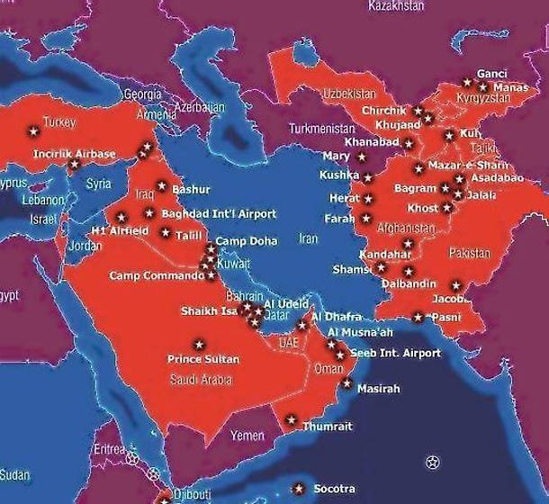

# Week 2

This guy lost it, killed himself \#SNL

[Link](https://youtu.be/2aqd5VQqSRc?t=78)

---

<blockquote class="twitter-tweet">
Amazing scenes of protest in Tehran tonight. While thousand have been on the streets in months past, Tehran tended to shy away from protests. Not now. Incompetence of regime in downing the plane is just too much. <a href="https://t.co/UFJXX7Yx6c">pic.twitter.com/UFJXX7Yx6c</a>
&mdash; Bessma Momani (@b_momani) <a href="https://twitter.com/b_momani/status/1216033477151191042?ref_src=twsrc%5Etfw">January 11, 2020</a></blockquote> 

---

How about taxes? Here is the kicker - the system can ask citizen to
__pay__ for the right to vote (a percentage of monthly $$ the system
already generates for everyone). Taxation for representation.

(Plus maybe a sales tax)

---

Digital basic income would make it easy for a digitial currency to
spread. You would use it bcz it gives money. Then it is snowball
effect, also ideology. Once enough people prefer it, say NanoX, do not
transact with a anything other than that currency, some will choose it
for ideological reasons bcz they want to be "with those folks over
there". 

---

So Steyer had some success in SC using TV?

---

<blockquote class="twitter-tweet">
Australian citizens are waging their own fight against gas and coal, even though their Government is doing less than nothing: Citizen-owned rooftop <a href="https://twitter.com/hashtag/solar?src=hash&amp;ref_src=twsrc%5Etfw">#solar</a> now generates more power in Australia than all the country’s natural-gas-fired plants<a href="https://twitter.com/hashtag/ClimateEmergency?src=hash&amp;ref_src=twsrc%5Etfw">#ClimateEmergency</a> (via <a href="https://twitter.com/NatBullard?ref_src=twsrc%5Etfw">@NatBullard</a>) <a href="https://t.co/1CvNUPDzWr">pic.twitter.com/1CvNUPDzWr</a>
&mdash; Assaad Razzouk (@AssaadRazzouk) <a href="https://twitter.com/AssaadRazzouk/status/1216170690430296064?ref_src=twsrc%5Etfw">January 12, 2020</a></blockquote> 

---

"@wolfejosh

The zeitgeist has shifted 

from FOMO [fear of missing out]...

...to 'SOBS' (shame of being suckered) "

---

---

You need to __close__, morose moth..f.ka. That's what you need to do.

\#ABC

That is the game for challengers. Incumbent needs to deliver. The
delivery will seep through pocketbook, a rough popularity measure,
opinion leaders - then pol might just get reelected, and even, have
their chosen successor take their place.

"Politician: People dont vote for me. What can I do?"

---

"Australia is ramping up investment in the nascent hydrogen energy
industry, with a $370 million fund for new projects gaining support at
Friday's meeting of state and federal ministers in Perth"

[Link](https://www.smh.com.au/politics/federal/hydrogen-stimulus-package-to-power-australian-energy-exports-20191122-p53d7c.html)

---

"Iran says military shot down Ukrainian passenger plane in error"

---

<blockquote class="twitter-tweet">
Protests continue in Tehran. Protesters are chanting many of the same slogans from <a href="https://twitter.com/hashtag/IranProtests?src=hash&amp;ref_src=twsrc%5Etfw">#IranProtests</a> of November 2019  They&#39;re chanting: &quot;The regime told us our enemy is the US. But actually, our enemy is right here&quot; [in reference to the regime itself]. <a href="https://t.co/OjoMw2PMI2">pic.twitter.com/OjoMw2PMI2</a>
&mdash; Masih Alinejad 🏳️ (@AlinejadMasih) <a href="https://twitter.com/AlinejadMasih/status/1216047712476565504?ref_src=twsrc%5Etfw">January 11, 2020</a></blockquote> 

---

"In Stunning Rebuke To Beijing, Taiwan's Pro-Independence President
Wins Landslide Re-election" -- @zerohedge

🇹🇼 👍

---

Who shares code in HTML with weird breaks in formatting..?

It feels like I am on an archeological dig for a long-dead
civilization

---

Alternating Direction Method of Multipliers. This better effin work on
total variation denoising.

---

NASA: Study Confirms Climate Models are Getting Future Warming Projections Right

[Link](https://climate.nasa.gov/news/2943/study-confirms-climate-models-are-getting-future-warming-projections-right.amp)

---

Need to close better. I'd do a research and find key applications and
hit the execs with examples from their domain when they come to visit

"[Rant from Opt Prof, about how diff it is to sell his field] The
Dean, in his office, is receiving a delegation from a prominent firm,
with the aim of promoting a partnership between the two
institutions. The goal is to pair a technical contact from the firm
with a faculty member from the university... Once, when I was younger
and more naive, I figured I might as well make the industrialist
happy.  During one of these meetings, after a couple of iterations of
'what application field do you work on?'  followed by 'this is really
the wrong question', I had decided to break the monotony and
hopelessness of the exchange by stating I work on shortest paths in
road networks.

'Ah, this is fantastic!' came the reply, 'but unfortunately we don’t
do any of that'"

\#ABC

[Link](https://mobile.twitter.com/e_d_andersen/status/1215995747558207488)

---

Who da man

<blockquote class="twitter-tweet">
.<a href="https://twitter.com/BernieSanders?ref_src=twsrc%5Etfw">@BernieSanders</a> leads the Democratic field three weeks ahead of the Iowa Caucus in the latest <a href="https://twitter.com/hashtag/IowaPoll?src=hash&amp;ref_src=twsrc%5Etfw">#IowaPoll</a>: <a href="https://t.co/2jTGxXQo1O">https://t.co/2jTGxXQo1O</a> <a href="https://t.co/dRzqrcLyJ7">pic.twitter.com/dRzqrcLyJ7</a>
&mdash; Des Moines Register (@DMRegister) <a href="https://twitter.com/DMRegister/status/1215806794410418176?ref_src=twsrc%5Etfw">January 11, 2020</a></blockquote> 

---

Yeah there's no way I'm getting into all that for one application
\#denoising. Started with a stupid regularization and now we are in
bizarro land (might come back here tho, we'll see).

---

Maybe the new Trudeau beard killed him

---

Peart as in of Rush, from Canada

---

Neil Peart died? Did not know some of his lyrics were inspired by Ayn Rand 👎

Still tho, good drummer👍.

---

Non-farm payroll deceleration
[continues](../../2021/01/stats.html#unemp),
now 1.50%,..,1.45%,1.40%. The decrease of increase \#hedgeye

---

<blockquote class="twitter-tweet">
I will do everything I can to stop a war with Iran.
&mdash; Bernie Sanders (@BernieSanders) <a href="https://twitter.com/BernieSanders/status/1215683861289558019?ref_src=twsrc%5Etfw">January 10, 2020</a></blockquote> 

---

<blockquote class="twitter-tweet">
<a href="https://twitter.com/hashtag/US?src=hash&amp;ref_src=twsrc%5Etfw">#US</a> to <a href="https://twitter.com/hashtag/Iraq?src=hash&amp;ref_src=twsrc%5Etfw">#Iraq</a>: We’re staying. <a href="https://t.co/bnliyZY9O1">pic.twitter.com/bnliyZY9O1</a>
&mdash; Matt Lee (@APDiploWriter) <a href="https://twitter.com/APDiploWriter/status/1215647086986825728?ref_src=twsrc%5Etfw">January 10, 2020</a></blockquote> 

---

<blockquote class="twitter-tweet">
 <a href="https://t.co/DouqJDRAFt">pic.twitter.com/DouqJDRAFt</a>
&mdash; BulldawgBrewer - 🚀XRP🚀 (@BullDawgBrewer) <a href="https://twitter.com/BullDawgBrewer/status/1215444342590050304?ref_src=twsrc%5Etfw">January 10, 2020</a></blockquote> 

---

"'Designed by clowns': Boeing employees ridicule 737 MAX, regulators in
internal messages" -- Reuters

---

<blockquote class="twitter-tweet">
“The ultimate result of shielding men from the effects of folly, is to fill the world with fools” Herbert Spencer
&mdash; Dylan Grice (@dylangrice) <a href="https://twitter.com/dylangrice/status/1215594810893111297?ref_src=twsrc%5Etfw">January 10, 2020</a></blockquote> 

---

"@AkshatRathi

BREAKING: BlackRock joins Climate Action 100+. The world's largest
asset manger (>$ 6 trillion) joins the largest investor initiative
lobbying to cut greenhouse gas emissions"

---

<blockquote class="twitter-tweet">
Water+Sun = Hydrogen--Technion researchers have developed the world’s first system using <a href="https://twitter.com/hashtag/solar?src=hash&amp;ref_src=twsrc%5Etfw">#solar</a> energy to split water into <a href="https://twitter.com/hashtag/hydrogen?src=hash&amp;ref_src=twsrc%5Etfw">#hydrogen</a> and oxygen at two separate sites--<a href="https://t.co/hS19de5vRe">https://t.co/hS19de5vRe</a> <a href="https://twitter.com/hashtag/hydrogennow?src=hash&amp;ref_src=twsrc%5Etfw">#hydrogennow</a> <a href="https://twitter.com/hashtag/fuelcell?src=hash&amp;ref_src=twsrc%5Etfw">#fuelcell</a> <a href="https://twitter.com/hashtag/zeroemissions?src=hash&amp;ref_src=twsrc%5Etfw">#zeroemissions</a> <a href="https://twitter.com/hashtag/decarbonise?src=hash&amp;ref_src=twsrc%5Etfw">#decarbonise</a> <a href="https://t.co/6nGxz3Z7LB">pic.twitter.com/6nGxz3Z7LB</a>
&mdash; FuelCellsWorks (@fuelcellsworks) <a href="https://twitter.com/fuelcellsworks/status/1215317757358637058?ref_src=twsrc%5Etfw">January 9, 2020</a></blockquote> 

---

<blockquote class="twitter-tweet">
What&#39;s happening in <a href="https://twitter.com/hashtag/ROS2?src=hash&amp;ref_src=twsrc%5Etfw">#ROS2</a> is a great example to the positive -- Amazon, Intel, Microsoft, Canonical, and many many others are doing work towards a project that isn&#39;t necessarily selves serving.   And it&#39;s great for business.  I hope to add <a href="https://twitter.com/ifm_USA?ref_src=twsrc%5Etfw">@ifm_USA</a> to that list in 2020.  4/4
&mdash; Sean Kelly (@theseankelly) <a href="https://twitter.com/theseankelly/status/1212891942188670976?ref_src=twsrc%5Etfw">January 3, 2020</a></blockquote> 

---

"@Tech_Scale

Green #Hydrogen has several near term applications, can grow to a $140
billion per year in revenue and support 700,000 jobs by 2030. And
that's just in the US!"

---

dynaCERT is a BUY

---

Robotics Operating System 2

[Tech Republic](https://www.techrepublic.com/google-amp/article/the-hottest-thing-in-robotics-is-an-open-source-project-youve-never-heard-of)

[Github](https://github.com/ros2)

It's open source of course not commercial, closed-source cuck

---

And.. it's like US has been getting ready for that scenario since
4ever. The red dots are all US bases surrounding Iran.

Even Afghanistan might have been a preperation for the endgame that is
Iran - an Axis of Evil country let's not forget (the others were Iraq
-done-, and North Korea).

---

During Iran-Iraq War both sides tied. So it would be reasonable to
expect that Iran War would be as hard as the Iraq War.

"Iran would be much worse (to fight against) than Iran"

---

<blockquote class="twitter-tweet">
To be broadcast on Sat 18 Jan 2020; 08:32 UK time. <a href="https://t.co/Ivym3i9W9m">https://t.co/Ivym3i9W9m</a>
&mdash; Graham Cooley (@GrahamCooley4) <a href="https://twitter.com/GrahamCooley4/status/1214844815759872000?ref_src=twsrc%5Etfw">January 8, 2020</a></blockquote> 

---

A liberterian is more like the peasant with a small patch of land than
a man in the woods. Many of the liberterian responses are rooted in
that backdrop. Rome taxed the peasant, took his sons for war,
libertard is now anti-tax and isolationist.

"Why wont they let me be so I can tend to my land?" he thinks, "the
outside" is nothing but trouble for him. This frame of ref is
defunct. You cant ever not care abt what goes on outside.

"@sghorwitz

Having seen yet another dumb meme accusing libertarians of wanting to
live alone in the woods,"

---

Great story on Dantzig (shared [here](../../2016/08/dantzig.html) before) -
he comes late to class copying down the problems on the
blackboard thinking they were homework problems, solves them, it turns
out the probs were two (then) hardest, yet unsolved problems of
statistics!

---

Ah. Markowitz was a student of Dantzig. Of course.

---

"Optimizing Optimization", nice (from a paper from proximal operators a method that allows scaling of opt)

---

"@peterdaou

Pelosi, Obama, Biden, etc. have gone after the left, as though THEY
are the bigger problem. The constant refrain among centrists is that
progressives are #TooFarLeft, which frames the most intense opposition
to Trump as overly radical.

Meanwhile, they extol 'bipartisanship...'"

---

---

Good one

@CodeWisdom

"If it doesn’t work, it doesn’t matter how fast it doesn’t work." - Mich Ravera

---

<blockquote class="twitter-tweet">
LAGARDE: CONCERTED EURO-AREA FISCAL STIMULUS WOULD HELP GROWTH  We need more debt to overcome the debt crisis
&mdash; zerohedge (@zerohedge) <a href="https://twitter.com/zerohedge/status/1214926473649414144?ref_src=twsrc%5Etfw">January 8, 2020</a></blockquote> 

---

I am really curious. Who the hell is it?

<blockquote class="twitter-tweet">
.<a href="https://twitter.com/PlugPowerInc?ref_src=twsrc%5Etfw">@PlugPowerInc</a> $172m order for its <a href="https://twitter.com/hashtag/hydrogen?src=hash&amp;ref_src=twsrc%5Etfw">#hydrogen</a> technology from Fortune 100 company. <a href="https://t.co/wQBWHruvPr">https://t.co/wQBWHruvPr</a>
&mdash; Joanna Sampson (@JoSamps92) <a href="https://twitter.com/JoSamps92/status/1214209137829187585?ref_src=twsrc%5Etfw">January 6, 2020</a></blockquote> 

---

<blockquote class="twitter-tweet">
The U.S. does not want to engage in extensive operations in the Middle East. Washington is depending on sanctions and proxies. For Iran, directly controlling or at least neutralizing Iraq is a geopolitical imperative, but Tehran could not afford another war. - GF
&mdash; George Friedman (@George_Friedman) <a href="https://twitter.com/George_Friedman/status/1214953694476853255?ref_src=twsrc%5Etfw">January 8, 2020</a></blockquote> 

---

I'd always wondered why they ended this show after S1, sometimes I thought bcz it was sorta seperatist? The browncoats are the Southerners, the Core is the Yankees and the show was kind of 
 rehashing the Civil War? But probably not... A lot of stuff like this gets made in TV land, and in the weird surveilance-capitalism times we live in today, we need shows like this.

---

Take my love ♪♬ Take my land ♪♬

Take me where I cannot stand ♪♬

I don't care, I'm still free ♪♬

You can't take the sky from me ♪♬♪♬♪♬

<blockquote class="twitter-tweet">
Go on.............<a href="https://t.co/yRmU7LCp6z">https://t.co/yRmU7LCp6z</a>
&mdash; Jewel Staite (@JewelStaite) <a href="https://twitter.com/JewelStaite/status/1214775071945834496?ref_src=twsrc%5Etfw">January 8, 2020</a></blockquote> 

---

<blockquote class="twitter-tweet">
Wow: „Production of <a href="https://twitter.com/hashtag/biogas?src=hash&amp;ref_src=twsrc%5Etfw">#biogas</a>, biomethane and “green” <a href="https://twitter.com/hashtag/hydrogen?src=hash&amp;ref_src=twsrc%5Etfw">#hydrogen</a> will have to skyrocket by at least 1,000% over the next three decades in order to reach the EU’s climate neutrality objective for 2050, an EU official has said.“ <a href="https://twitter.com/hashtag/Waserstoff?src=hash&amp;ref_src=twsrc%5Etfw">#Waserstoff</a> <a href="https://twitter.com/hashtag/Klimaziele?src=hash&amp;ref_src=twsrc%5Etfw">#Klimaziele</a> <a href="https://twitter.com/hashtag/Klima?src=hash&amp;ref_src=twsrc%5Etfw">#Klima</a> <a href="https://t.co/OYG9o6NTqg">https://t.co/OYG9o6NTqg</a>
&mdash; Michel Doepke (@MichelDoepke) <a href="https://twitter.com/MichelDoepke/status/1214583756868259840?ref_src=twsrc%5Etfw">January 7, 2020</a></blockquote> 

---

---

@H2Bjorn

Indian Railways has set in motion efforts to build a hydrogen-powered rail engine that can propel a passenger train on a suburban route by the end of 2021" via @kaffjamesnewtow

---

<blockquote class="twitter-tweet">
I worked in John Kerry&#39;s war room when &#39;swiftboating&#39; entered the political lexicon. I worked for Hillary Clinton, the prime target of the rightwing attack machine.  When I tell you <a href="https://twitter.com/hashtag/Bernie?src=hash&amp;ref_src=twsrc%5Etfw">#Bernie</a> is the strongest candidate to handle the right&#39;s smears, I know what I&#39;m talking about. <a href="https://t.co/nahJPjIEsN">https://t.co/nahJPjIEsN</a>
&mdash; Peter Daou (@peterdaou) <a href="https://twitter.com/peterdaou/status/1212790350496096256?ref_src=twsrc%5Etfw">January 2, 2020</a></blockquote> 

---
