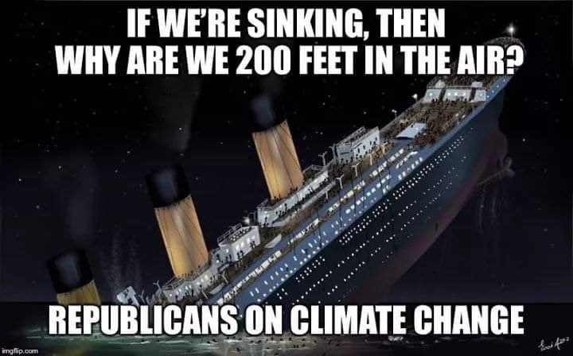
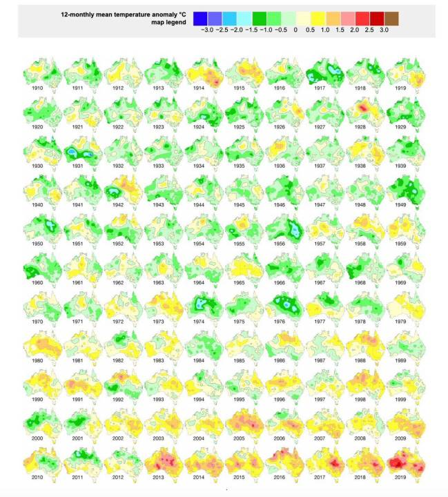
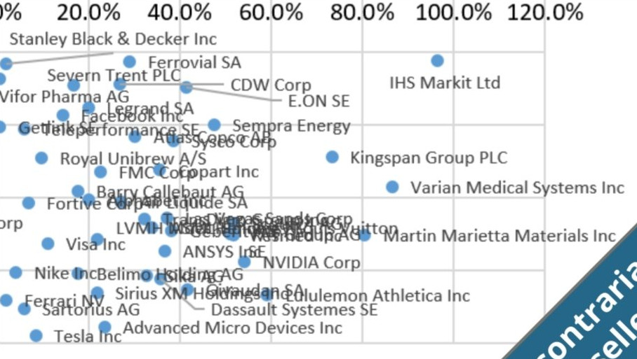

# Week 3

Told ya. With EU relationship weakening, u r p'owned by US now. Next up is
a full, hearty, nice stew of chlorinated chicken, and four-eyed fish
right out of Hudson River.

"Trump threatened UK with 25% car tariffs unless it agreed to accuse
Iran of breaking nuclear deal"

---


---

According to reports the China Phase 1 deal is a good start - for
China to normalize. It sounds like progress were made on forced tech
transfer, China opening up its finance.

---

"Honda, Isuzu power up fuel cell partnership for heavy-duty trucks" --
Reuters

---

New grand theory cannot have background dependence (omnipresent
coordinate system) at any level, including the quantum. If 1 says "but
at that scale it doesnt matter" by definition 1 is accepting that
background-dependent QM is a mere approximation. Approx is fine
obviously for computation - but at a foundational level it is not.

---

<blockquote class="twitter-tweet"><p lang="en" dir="ltr">Green <a href="https://twitter.com/hashtag/hydrogen?src=hash&amp;ref_src=twsrc%5Etfw">#hydrogen</a> is creeping up on natural gas as a competitive power generation fuel. Higher carbon prices could make it a commercial reality soon. In 2050 there will be electrolytic H2 below $1/kg! <a href="https://t.co/L4Lnv9238r">https://t.co/L4Lnv9238r</a> via <a href="https://twitter.com/business?ref_src=twsrc%5Etfw">@business</a></p>&mdash; Luca Mastropasqua, PhD (@LucaMastro89) <a href="https://twitter.com/LucaMastro89/status/1218349428047630338?ref_src=twsrc%5Etfw">January 18, 2020</a></blockquote> <script async src="https://platform.twitter.com/widgets.js" charset="utf-8"></script>

---

<blockquote class="twitter-tweet"><p lang="en" dir="ltr">No one is ever going to fly on a 737 MAX again <a href="https://twitter.com/search?q=%24BA&amp;src=ctag&amp;ref_src=twsrc%5Etfw">$BA</a></p>&mdash; Quoth the Raven (@QTRResearch) <a href="https://twitter.com/QTRResearch/status/1218247092403081216?ref_src=twsrc%5Etfw">January 17, 2020</a></blockquote> <script async src="https://platform.twitter.com/widgets.js" charset="utf-8"></script>

---

Burrito is sorta ethnic, is this MAGA diversity? 😶😶

---

Wasn't the original wording with sandwich?

---

😆😆

Crazy MAGA guy: "Go %%% cook my burrito bitch!".

Weird oddballs

[Link](https://youtu.be/l5vyDPN19ww?t=1144)

---

Before QE1 v. After QE4

[Link](https://twitter.com/KennethDredd/status/1218349625343496192)

---

"By choosing prices to aggregate output, economists make ‘productivity’
equivalent to average hourly income...  using prices to aggregate
‘output’ leads to bizarre problems... This means that any connection
between ‘productivity’ and wages is circular"

[Link](https://economicsfromthetopdown.wordpress.com/2020/01/17/debunking-the-productivity-pay-gap/amp/)

---

"@chrislhayes

Remember when Stop and Frisk was struck down and all these reactionary
voices in NYC rose in unison to say it would spell a new era of
horrible crime? They were 100% wrong. It's the exact same play now
with bail reform"

---

Smog from coal, wood.. Barbaric. We look at scifi, people are whizzing
about in space, traveling in time, hell, going to multiple universes
(all based on shoddy, unfounded science BTW). In the meantime there is
__smog__ blanketing major cities.

[Video](https://www.youtube.com/watch?v=g5du1J3_uHo)

---

"@jensdittrich

As announced in my \#cidr2020 talk and inspired by the
\#NoSQL-movement, the time is ripe to start the \#NotANeuralNetwork
... movement"

---

"Russian-backed offensive over Idlib presses ahead"

---

<blockquote class="twitter-tweet"><p lang="en" dir="ltr">Wow: <a href="https://twitter.com/hashtag/hydrogen?src=hash&amp;ref_src=twsrc%5Etfw">#hydrogen</a> index above 190 pts. for the first time. <a href="https://twitter.com/search?q=%24PCELL&amp;src=ctag&amp;ref_src=twsrc%5Etfw">$PCELL</a> <a href="https://twitter.com/hashtag/PowerCell?src=hash&amp;ref_src=twsrc%5Etfw">#PowerCell</a>, <a href="https://twitter.com/search?q=%24NEL&amp;src=ctag&amp;ref_src=twsrc%5Etfw">$NEL</a> <a href="https://twitter.com/hashtag/Nel?src=hash&amp;ref_src=twsrc%5Etfw">#Nel</a>, <a href="https://twitter.com/search?q=%24HEX&amp;src=ctag&amp;ref_src=twsrc%5Etfw">$HEX</a> <a href="https://twitter.com/hashtag/HexagonComposites?src=hash&amp;ref_src=twsrc%5Etfw">#HexagonComposites</a>, <a href="https://twitter.com/search?q=%24BLDP&amp;src=ctag&amp;ref_src=twsrc%5Etfw">$BLDP</a>, <a href="https://twitter.com/search?q=%24PLUG&amp;src=ctag&amp;ref_src=twsrc%5Etfw">$PLUG</a> and Co are beside themselves. <a href="https://t.co/kSKcS0yBeY">https://t.co/kSKcS0yBeY</a> <a href="https://t.co/4aJXRMwXpC">pic.twitter.com/4aJXRMwXpC</a></p>&mdash; Michel Doepke (@MichelDoepke) <a href="https://twitter.com/MichelDoepke/status/1218095307403251713?ref_src=twsrc%5Etfw">January 17, 2020</a></blockquote> <script async src="https://platform.twitter.com/widgets.js" charset="utf-8"></script>

---

<blockquote class="twitter-tweet"><p lang="en" dir="ltr">Industry Leaders Join Forces On Ammonia-Fuelled Tanker Project <a href="https://t.co/1c7n7AtdRp">https://t.co/1c7n7AtdRp</a><a href="https://twitter.com/hashtag/Shipping?src=hash&amp;ref_src=twsrc%5Etfw">#Shipping</a> <a href="https://twitter.com/hashtag/Maritime?src=hash&amp;ref_src=twsrc%5Etfw">#Maritime</a> <a href="https://twitter.com/hashtag/MarineInsight?src=hash&amp;ref_src=twsrc%5Etfw">#MarineInsight</a> <a href="https://twitter.com/hashtag/SamsungHeavyIndustries?src=hash&amp;ref_src=twsrc%5Etfw">#SamsungHeavyIndustries</a> <a href="https://twitter.com/man_e_s?ref_src=twsrc%5Etfw">@man_e_s</a> <a href="https://t.co/xCHlFGYKJD">pic.twitter.com/xCHlFGYKJD</a></p>&mdash; MarineInsight (@MarineInsight) <a href="https://twitter.com/MarineInsight/status/1217529474339758080?ref_src=twsrc%5Etfw">January 15, 2020</a></blockquote> <script async src="https://platform.twitter.com/widgets.js" charset="utf-8"></script>

---

"@michelgranger

Hydrogène de France Announces the World's First Plant for Mass
Production of High-Powered Fuel Cells (Over 1 MW)"

[Link](https://bwnews.pr/35eYRey)

---


OK.. they come here, following this shamanism.. But there are farmers,
peasants in Anatolia. What happens when these cultures mix? It gets
weird at this point. Say people are wondering around and see a
goat. They immediately worship the goat. Then they are fuckin' it. Now
the goat's confused. Sometimes he is up, sometimes he is down... It's
a roller coaster. He just wants to be a goat, go about his day, walk
around, eating his grass.. But these humans are doing strange things
to him. He didn't sign up for that.

---

Some buffoons in TR are like "tigger came from Central Asia" (complete
bull). Who were these people? They say they were following a sort of
of naturalistic religion, some kind of shamanism.. So they prayed to
cats and dogs and shit. Like, a cat comes over and says "meow", you
have to bow down *immediately* and say "your wish is my command my
Lord". That's how the system works.

A strange way of living.

---

Cobots. I like this name (for augmentation tech).

---

"@FinancialTimes

Frans Timmermans, European Commission executive vice-president,
compared the impending disruption of the EU’s push for carbon
neutrality by 2050 to the Industrial Revolution"

---

The thing is Bernie is truly alarmed by climate change. No angle there. But like with many things Bernie it can work for him on votes.

---

I still maintain that there is a deeper plan here, it's all about the
kid. Their (both US and UK citizen) royalty kid will run in US
elections first, and become POTUS. Then he will kill off all other
members of royal family become king. Then he will abolish UK
parliament - controlling two countries at the same time.

The movie telling the tale will be a mix of *Game of Thrones* and
*Olympus Has Fallen*.

---


---

Megxit? Great. Good luck

---

YES DESTROY FARMING AND F..ING FARMERS

"Lab-grown food will soon destroy farming – and save the planet"

"Ferming is the new farming" 

[Link](https://amp.theguardian.com/commentisfree/2020/jan/08/lab-grown-food-destroy-farming-save-planet)

---

"@cH2ange

A wave of new members joined the council today, including financial
institutions...It's all about sharing the same ambition: the one of a
clean society with #hydrogen. And it's definitely promising! 👏"

---

"@peterdaou

I challenge anyone to have vetted \#Bernie more than I did in 2016.

I know the oppo inside and out.

The GOP will have nothing to take him down with"

---


---

Ah of course - that's why he didnt tie the red headband this
time. This is a more mature Rambo. Previously he was kinda gung-ho
about war.

\#lastBlood

---

In other movies Rambo was fighting sure, but he was still up in other
people's business, like in Afganistan etc. For the first time he was
"defending his home -the only legitimate case for war really-", like
the Vietnamese, with tunnels. Like I said, full circle. A grown-up
Rambo in some ways.

\#lastBlood

---

No tying of the red headband this time?

How is this a Rambo movie? I need to see the headband tying
scene. There was the ammo preperation scene, great. No headband scene.

\#lastBlood

---

How come the bad guys keep charging? YOu had to see Rambo is loaded
for bear and waiting for you. After the second tree trunk with nails,
u shoulda said 'f--k this, im getting the f--k outa here'

(But of course they kept going, and they are all dead)

\#lastBlood

---

So basically in the last Rambo movie, Rambo becomes Vietnamese,
fighting through all those tunnels... I guess the character came full
circle - from PTSD after Vietnam to Vietnamese himself. 

\#lastBlood

---

Saudi Aramco.

Chevron.

"@william_sw

CNH Ind/IVECO, Michelin, Saudi Aramco, Schaeffler Group, Siemens;
Chart Industries, Chevron, ElringKlinger, Fortescue Metals Grp, Galp,
ILJIN Composites, MANN+HUMMEL, McDermott, Sinocat, Snam, Woodside
Energy; Antin Infrastructure, BNP Paribas, Société Générale +2

@HydrogenCouncil 22 new member companies are joining us "

---

Eugen Illin - Madison Square 1 \#music

[Link](https://youtu.be/jNYxKdMG4r8)

---

A big fan of approximation, smoothing. Second func is approx version
of 1st. But the 2nd func is twice differentiable. 

```python
eps = 1e-6

def norml1(x):
   return np.sum(np.abs(np.diff(x)))
   
def norm1la(x):
return np.sum(np.sqrt(eps + np.power(np.diff(x),2)) - eps)

data = np.random.randn(1000)
print (norml1(data))
print (norml1a(data))
```

```text
1137.3915259284436
1137.394072155485
```

---

Steyer keeps looking directly into the camera, like in a local TV
insurance commercial. "Have I got a deal for *you*!"

\#demdebate

---


---



---

Australian fires since 1910, color coded



---

"@AssaadRazzouk

To put this in context: 

Oceans are warming at same rate as if 5 Hiroshima bombs were dropped
in EVERY SECOND

Why?

Because we are burning enormous amounts of coal, oil & gas

Because Big Oil obfuscated the truth for 40 years and still spend
$200m/ year on 'lobbying'"

---

"@John4man

Many folks assume you have to have it all figured out in order to
share your expertise... But the more expert you become, the more you
forget what it was to be in the dark.

There's always value in sharing what you *just learned* with those one
step behind you"

---

<blockquote class="twitter-tweet"><p lang="en" dir="ltr">President Macron was introduced to the <a href="https://twitter.com/hashtag/hydrogen?src=hash&amp;ref_src=twsrc%5Etfw">#hydrogen</a> <a href="https://twitter.com/hashtag/fuelcell?src=hash&amp;ref_src=twsrc%5Etfw">#fuelcell</a> 🚍bus in Pau 🇫🇷<a href="https://twitter.com/hashtag/F%C3%A9bus?src=hash&amp;ref_src=twsrc%5Etfw">#Fébus</a> earlier today, tackling <a href="https://twitter.com/hashtag/ClimateChange?src=hash&amp;ref_src=twsrc%5Etfw">#ClimateChange</a> thanks to <a href="https://twitter.com/fch_ju?ref_src=twsrc%5Etfw">@fch_ju</a> More info: <a href="https://t.co/GXm10kBana">https://t.co/GXm10kBana</a> <a href="https://t.co/Mp44l2Q2nw">pic.twitter.com/Mp44l2Q2nw</a></p>&mdash; Fuel cell bus (@Fuelcellbus) <a href="https://twitter.com/Fuelcellbus/status/1217096033324486658?ref_src=twsrc%5Etfw">January 14, 2020</a></blockquote> <script async src="https://platform.twitter.com/widgets.js" charset="utf-8"></script>

---

@BernieSanders

All people have the right to protest without fear of violence. I call
upon the Iranian government to respect that right. The Iranian
people's future is theirs to determine, and I stand with all who seek
a future of peace, dignity, and equality.

---

<blockquote class="twitter-tweet"><p lang="en" dir="ltr">Don&#39;t tell me the United States cannot implement a Medicare for All system to guarantee health care to every man, woman and child.<br><br>If every other major country can do it, then surely so can we. <a href="https://t.co/mPJNvUMFV5">https://t.co/mPJNvUMFV5</a></p>&mdash; Bernie Sanders (@SenSanders) <a href="https://twitter.com/SenSanders/status/1217115341287051264?ref_src=twsrc%5Etfw">January 14, 2020</a></blockquote> <script async src="https://platform.twitter.com/widgets.js" charset="utf-8"></script>

---

Kaleeefornia. Sacramento is not all comatose

"@Lecocq_dom

California is looking to use #hydrogen-powered buses and trucks to cut
pollution from transport, the giant state’s largest source of carbon
emissions"

---

"@SymbioH2

@Daimler R&D director Markus Schäfer said at \#CES2020, they could
commercialize a hydrogen-powered bus in the next 2 to 3 years"

---

From Didier Sornette's bubble observatory... Below is the so-called
contrarian seller quadrant showing "[s]tocks with a weak value score
are expensive relative to their earnings potential.. [t]he strong
positive bubble signal is an indication of sentiment and herding
increasing the price until it is not linked to fundamentals anymore"

Who is in it? Nike. Sirius XM. Visa. 

[PDF](https://ethz.ch/content/dam/ethz/special-interest/mtec/chair-of-entrepreneurial-risks-dam/documents/FCO/FCO_January_2020.pdf)



---

Now they effectively jumped the shark

"@WSJmarkets

Federal Reserve officials are considering lending cash directly to
hedge funds through clearinghouses to ease stress in the repo
market. But that could be a tough sell for policy makers"

---

<blockquote class="twitter-tweet"><p lang="en" dir="ltr">Tokyo Governor Yoichi Masuzoe declared in 2016, “The 1964 Tokyo Olympics left the Shinkansen high-speed train system as its legacy. The upcoming Olympics will leave a hydrogen society as its legacy.” <a href="https://twitter.com/hashtag/Hydrogen?src=hash&amp;ref_src=twsrc%5Etfw">#Hydrogen</a> <a href="https://twitter.com/hashtag/FuelCells?src=hash&amp;ref_src=twsrc%5Etfw">#FuelCells</a> <a href="https://twitter.com/hashtag/RenewableEnergy?src=hash&amp;ref_src=twsrc%5Etfw">#RenewableEnergy</a> <a href="https://twitter.com/h2_view?ref_src=twsrc%5Etfw">@h2_view</a> <a href="https://t.co/6AC07YR1pB">https://t.co/6AC07YR1pB</a></p>&mdash; TechScale Solutions (@Tech_Scale) <a href="https://twitter.com/Tech_Scale/status/1216516364162273286?ref_src=twsrc%5Etfw">January 13, 2020</a></blockquote> <script async src="https://platform.twitter.com/widgets.js" charset="utf-8"></script>

---

"Hydrogen On The Rise At CES, From Drones And Daimler Trucks To
Toyota’s City Of The Future"

[Forbes](https://www.forbes.com/sites/alanohnsman/2020/01/09/hydrogen-on-the-rise-at-ces-from-drones-and-daimler-trucks-to-toyotas-city-of-the-future/#5f7412c539e2)

---

Exec ability is most easily proven through service in goverment
(contrary to pop belief, it still matters). Boris J was not too suave
but he is enough of oaf, with some presence, and was the mayor of a
large city once. If that managerial skill is seen on media, that is
okay too; people saw Trump acting as an executive on a show, that was
good. Hell, the current Ukrainian President merely *played* a
President on TV, even that was proof enough of managerial ability.

The rest is media / mind manipulation - at a cultural level - second
level in the brain, stronger than intellect

---

To clarify: They don't want have a beer with someone like them. They
want -what is the cool kid streotype in US, the quarterback of the
football team?- the quarterback to want to have a beer with them. That
is, they want the cool guy to appear now s/he is caring for them - not
some random jagoff.

Again, gotta be part oaf, cool, not crass, with provably present
executive ability....

"People who voted for [X] said that 'I could imagine haing having a
beer with him'"

---

Israeli left-wing merges before the next election 

[Link](https://youtu.be/8SiXk68CbBU)

---

<blockquote class="twitter-tweet"><p lang="en" dir="ltr">Markus Schäfer, IC of <a href="https://twitter.com/Daimler?ref_src=twsrc%5Etfw">@Daimler</a>&#39;s R&amp;D activity:<a href="https://t.co/fC1t28DfdU">https://t.co/fC1t28DfdU</a><br>&quot;Trucks ... will not work with a battery ... Fuel cells work very well ... it&#39;s a question of scaling up ... In the next 2 or 3 years, we would have something in the commercial field ... a bus or a truck.&quot;</p>&mdash; A. Weigmann (@AWeigmannn) <a href="https://twitter.com/AWeigmannn/status/1216809199990190087?ref_src=twsrc%5Etfw">January 13, 2020</a></blockquote> <script async src="https://platform.twitter.com/widgets.js" charset="utf-8"></script>

---

Better to take the basic income discussion out of gov realm. It is
such a huge change that it belongs to a world-shaking, 3rd Wave
transformation along with citizen centric digital currency. Both these
ideas (should) go together. The agenda, the plate of the left is
already full. US lost so much ground on anti-trust, worker's rights,
social safety net as it is, that adding BI on top clogs the agenda.

---

<blockquote class="twitter-tweet"><p lang="en" dir="ltr">Australia, Japan Sign Hydrogen Agreement: An Exciting Step Towards <a href="https://twitter.com/hashtag/Hydrogen?src=hash&amp;ref_src=twsrc%5Etfw">#Hydrogen</a> Future-Using hydrogen as clean, affordable &amp; sustainable source of energy is another step closer after Australia signed a joint statement of cooperation with Japan-<a href="https://t.co/yKDtQmortm">https://t.co/yKDtQmortm</a> <a href="https://twitter.com/hashtag/hydrogennow?src=hash&amp;ref_src=twsrc%5Etfw">#hydrogennow</a> <a href="https://t.co/zD8ZnK39nt">pic.twitter.com/zD8ZnK39nt</a></p>&mdash; FuelCellsWorks (@fuelcellsworks) <a href="https://twitter.com/fuelcellsworks/status/1216736062359441409?ref_src=twsrc%5Etfw">January 13, 2020</a></blockquote> <script async src="https://platform.twitter.com/widgets.js" charset="utf-8"></script>

---

"In [a certain] class of problems, a noisy indirect observation y, of an original image x, is modeled as y = Bx + n .. It is well known that the problem of estimating x from y is ill-posed, thus this inverse problem can only be solved satisfactorily by adopting some sort of regularization"

[Link](http://www.lx.it.pt/~mtf/Afonso_BioucasDias_Figueiredo_twocolumn_v7.pdf)

---

"In the third year of the Trump presidency, which has not been
particularly supportive of renewables, U.S. clean energy investment
set a new record by a country mile"

[Link](https://twitter.com/business/status/1217797816585728000)

---

I still cannot believe Boeing faceplanted so badly. They were a go-to
example for a kickass engineering company.

---

"Despite new EU emissions standards, carmakers admit they are having a
hard time selling electric cars in Europe"

[Link](https://on.ft.com/2sZTTUP)

---

Yes. See the same video.

"Are deep nets (that is, their objective functions for data fitting)
non-convex?"

---

DL increases the parameter space to millions, billions - these params
create many optimal points that are equivalent, giving more chances
to the optimizer to reach them. See [Le Cun](https://youtu.be/8zdo6cnCW2w?t=1050)

"How can deep net models manage to find a model at all?"

---

Most popular approaches in derivative-free opt break the optimization
into many steps, in each step they solve a convex problem. So u still
need to know about convex approaches.

"But Convex problems are so weak.. I hear all action is in non-Convex
problems.."

---

<blockquote class="twitter-tweet"><p lang="en" dir="ltr">“<a href="https://twitter.com/hashtag/Hydrogen?src=hash&amp;ref_src=twsrc%5Etfw">#Hydrogen</a> is a key instrument for meeting the <a href="https://twitter.com/hashtag/EUGreenDeal?src=hash&amp;ref_src=twsrc%5Etfw">#EUGreenDeal</a> objectives and <a href="https://twitter.com/hashtag/Europe?src=hash&amp;ref_src=twsrc%5Etfw">#Europe</a> is leading on its industry development.” said ⁦<a href="https://twitter.com/KadriSimson?ref_src=twsrc%5Etfw">@KadriSimson</a>⁩, ⁦<a href="https://twitter.com/Energy4Europe?ref_src=twsrc%5Etfw">@Energy4Europe</a>⁩ Commissioner, at ⁦<a href="https://twitter.com/IRENA?ref_src=twsrc%5Etfw">@IRENA</a>⁩’s ministerial roundtable on hydrogen. <a href="https://t.co/O7WJZtpyPZ">https://t.co/O7WJZtpyPZ</a></p>&mdash; Hydrogen Europe (@H2Europe) <a href="https://twitter.com/H2Europe/status/1216638948715442176?ref_src=twsrc%5Etfw">January 13, 2020</a></blockquote> <script async src="https://platform.twitter.com/widgets.js" charset="utf-8"></script>

---

"Eadon, a 36-year-old veteran of Barack Obama’s 2008 and 2012
presidential campaigns [who endorsed Bernie]. 'Something that Bernie
has that other candidates don’t is he has that background and that
consistency,' Eadon said. 'He is not just saying ‘Medicare for All’ or
‘no corporate money’ while he’s running for president. He’s been there
all along'"

[Link](https://www.huffpost.com/entry/derek-eadon-top-iowa-democrat-endorses-bernie-sanders-2020-democratic-presidential-primary_n_5e180e00c5b6640ec3d1ecdb)

---

Hah. Policy is a skill, can be taught, improved etc. Not something
random guy off the street can do. Shocking.

"The Australian Science Policy Fellowship Pilot Program gives
scientists the opportunity to work in a Commonwealth Government
department for one year. It seeks to grow the diversity of expertise
in the Australian Public Service workforce by providing a pathway for
early- and mid-career scientists and engineers to become skilled
policy practitioners"

[Link](http://careers.pageuppeople.com/mob/771/cw/en/job/504949/2020-australian-science-policy-fellowship-program-aps-level-6)

---

<blockquote class="twitter-tweet"><p lang="en" dir="ltr">Had to pull over in order to reboot my car, love being in the future</p>&mdash; Zach Holman (@holman) <a href="https://twitter.com/holman/status/1216454485242810369?ref_src=twsrc%5Etfw">January 12, 2020</a></blockquote> <script async src="https://platform.twitter.com/widgets.js" charset="utf-8"></script>

---

'@jmpalmieri

Congratulations to @BernieSanders and his campaign bc, if I am not
mistaken, the person who has led this poll [The De Moines Register]
has gone on to be nominee in last six cycles. Leading this poll is
momentous"

---

<blockquote class="twitter-tweet"><p lang="en" dir="ltr">This is correct.<br><br>If there&#39;s anyone who truly scares Trump, it&#39;s <a href="https://twitter.com/hashtag/Bernie?src=hash&amp;ref_src=twsrc%5Etfw">#Bernie</a>. He&#39;s too well known to be redefined. He&#39;s got a mass movement. He&#39;s got a ground game. He&#39;s got lots of money. He&#39;s unafraid of his principles. <a href="https://t.co/0G6hyzDBk8">https://t.co/0G6hyzDBk8</a></p>&mdash; Peter Daou (@peterdaou) <a href="https://twitter.com/peterdaou/status/1216423548195147778?ref_src=twsrc%5Etfw">January 12, 2020</a></blockquote> <script async src="https://platform.twitter.com/widgets.js" charset="utf-8"></script>

---

@OverEasyForever

“In affirming my belief in Christ's teaching, I could not help
explaining why I do not believe, and consider as mistaken, the
Church's doctrine, which is usually called Christianity.”

― Tolstoy

---


---

"@RanjAlaaldin

Much to dissect when it comes to protests in Iran & Iraq but it’s now
clear the fallout over Soleimani’s death will not silence or stifle
critics of the regime. There won’t be a rally-around-the-flag
effect. Protesters have proven to be more resilient than initially
anticipated"

---

<blockquote class="twitter-tweet"><p lang="en" dir="ltr">Need <a href="https://twitter.com/hashtag/hydrogen?src=hash&amp;ref_src=twsrc%5Etfw">#hydrogen</a> produced for less than $3 a <a href="https://twitter.com/hashtag/kilo?src=hash&amp;ref_src=twsrc%5Etfw">#kilo</a>? Please contact <a href="https://twitter.com/H2Bayo?ref_src=twsrc%5Etfw">@H2Bayo</a> for more information. <a href="https://twitter.com/hashtag/onsite?src=hash&amp;ref_src=twsrc%5Etfw">#onsite</a> <a href="https://twitter.com/hashtag/generation?src=hash&amp;ref_src=twsrc%5Etfw">#generation</a> <a href="https://twitter.com/hashtag/now?src=hash&amp;ref_src=twsrc%5Etfw">#now</a> <a href="https://t.co/LYFAvOTht5">pic.twitter.com/LYFAvOTht5</a></p>&mdash; BayoTech On-Site Hydrogen Generation (@H2Bayo) <a href="https://twitter.com/H2Bayo/status/1179322343673516034?ref_src=twsrc%5Etfw">October 2, 2019</a></blockquote> <script async src="https://platform.twitter.com/widgets.js" charset="utf-8"></script>

---
