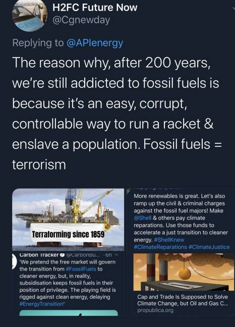
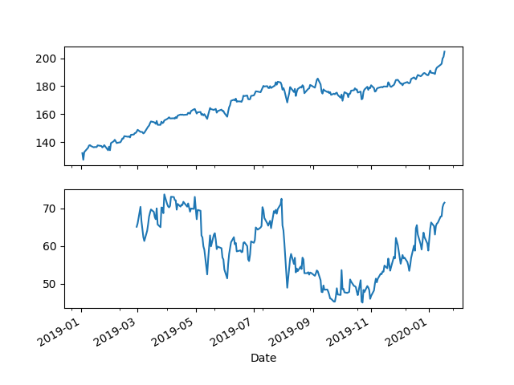

# Week 4

<blockquote class="twitter-tweet"><p lang="en" dir="ltr"><a href="https://twitter.com/hashtag/BMW?src=hash&amp;ref_src=twsrc%5Etfw">#BMW</a> has confirmed its plans to run a small fleet of <a href="https://twitter.com/hashtag/hydrogen?src=hash&amp;ref_src=twsrc%5Etfw">#hydrogen</a> fuel cell electric vehicles (FCEVs) based on the X5, by the end of 2022 👉🏻 by <a href="https://twitter.com/JesseCrosse?ref_src=twsrc%5Etfw">@JesseCrosse</a> <a href="https://t.co/dEEMRPYOVS">https://t.co/dEEMRPYOVS</a></p>&mdash; Dominique Lecocq 🌏 👀🧠👂 (@Lecocq_dom) <a href="https://twitter.com/Lecocq_dom/status/1221061330846744582?ref_src=twsrc%5Etfw">January 25, 2020</a></blockquote> <script async src="https://platform.twitter.com/widgets.js" charset="utf-8"></script>

---

Yes yes lots of spending... Isn't SF more worthwhile than invading
frickin Afganistan tho?

---

The new Space Force logo looks like Starfleet logo? That's kinda cool


---


---

The new Picard show was okay - watchable

---

"@washingtonpost

Breaking news: Chinese President Xi warns of 'accelerating spread' of
Wuhan coronavirus and 'grave' public health situation"

---

"@DrEricDing

HOLY MOTHER OF GOD - the new coronavirus is a 3.8!!! How bad is that
reproductive R0 value? It is thermonuclear pandemic level bad - never
seen an actual virality coefficient outside of Twitter in my entire
career. I’m not exaggerating... "

---

Inflation [increased](../../2021/01/stats.html) to 2.28%, non-farm
payroll decelerated to %1.40

Fourth quarter earnings are expected to [decrease](https://lipperalpha.refinitiv.com/2020/01/this-week-in-earnings-9/) 0.5% from 18Q4

Profits go to wages more and more (inflation), new hires decrease
(less profs), demand slows, biz debt repayment goes to red, then boom!

\#endCycle

---

<blockquote class="twitter-tweet"><p lang="en" dir="ltr">Hyzon Motors, using fuel cell powertrains from Horizon Fuel Cell, announces its official launch today based in USA with plans to introduce Vans, Buses and Trucks, from Class 3 to Class 8 using hydrogen fuel cells. <a href="https://t.co/TSiPhEYJ7Z">https://t.co/TSiPhEYJ7Z</a> <a href="https://t.co/Fcc3PylUBt">pic.twitter.com/Fcc3PylUBt</a></p>&mdash; Brad Bradshaw (@brad_bradshaw) <a href="https://twitter.com/brad_bradshaw/status/1220518799553761281?ref_src=twsrc%5Etfw">January 24, 2020</a></blockquote> <script async src="https://platform.twitter.com/widgets.js" charset="utf-8"></script>

---


---

"@ryangrim

Wow, South Carolina elected official Dahli Myers ditches Biden, flips
to Sanders, arguing Sanders is more likely to beat Trump and 'fights
for the least, the fallen, the left behind.'"

---

There are many companies that offer support for OSS - if one needs
that support line, someone on point to offer service / education. So
free, open source software underneath can be covered with a commercial
support contract on top. Best of both worlds.

---

😶 🤧 😷

"@JTSEO9

China blocking off roads to the affected areas"

---

"[Economists] measure productivity in terms of income. Then they find
(unsurprisingly) that productivity ‘explains’ income"

[Link](https://evonomics.com/no-productivity-does-not-explain-income/)

---


---

"Sanders Takes Double-Digit Lead in New Hampshire Poll After 14 Point
Jump Since December"

---

<blockquote class="twitter-tweet"><p lang="en" dir="ltr">US DoE announces $64m in funding to advance <a href="https://twitter.com/hashtag/hydrogen?src=hash&amp;ref_src=twsrc%5Etfw">#hydrogen</a> <a href="https://twitter.com/hashtag/solutions?src=hash&amp;ref_src=twsrc%5Etfw">#solutions</a><a href="https://twitter.com/hashtag/HydrogenNow?src=hash&amp;ref_src=twsrc%5Etfw">#HydrogenNow</a> <a href="https://twitter.com/hashtag/Hydrogen2020?src=hash&amp;ref_src=twsrc%5Etfw">#Hydrogen2020</a> <a href="https://t.co/wRxavXjoOr">https://t.co/wRxavXjoOr</a></p>&mdash; BayoTech On-Site Hydrogen Generation (@H2Bayo) <a href="https://twitter.com/H2Bayo/status/1220716126574911488?ref_src=twsrc%5Etfw">January 24, 2020</a></blockquote> <script async src="https://platform.twitter.com/widgets.js" charset="utf-8"></script>

---

"@FirstSquawk

CHINA ADDS NINTH CITY TO TRANSPORT BAN, 32 MILLION PEOPLE NOW AFFECTED"

---

Tibshirani seems to have the right focus. Boyd is wondering off on
topics; I need primal-dual interior methods BOOM! A nice segway into
subgradient methods BOOM! Tibs gots it.

I managed to scrounge some code off Boyd though, from HW solns (not
openly published). Freakin archeolog over here.

---

I trawl.. it's what I do. I trawl many places for pol analysis
ideas. The Bernie-Warr-Biden poll time series correlation idea partly
came from Dick Morris actually (he has a YT channel, now behind paywall
-bad for him-). He looked at the sum of Bernie-Biden poll counts, saw
the sum did not change much indicating shared votes base (one's loss
other's gain). Guy is a pro, thinking empirically - always looking for
that fulcrum point.

He doesn't know much stats obviously, the proper way to do what he did
is through correlation analysis. I do that, and voila, there is a
correlation btw Bernie/Warren, and Bernie/JB (yes bitch there is
partial overlap between Bernie/Warren, dipshit is still pouting and
saying 'not so' :( )

---

It does feel like yellow vest movement is not claimed by any
mainstream parties. Very strange. The article claims it is
due to the failure of the left in France.

Likely true - protests revolve around social state being rolled back -
well Macron used to be in the Socialist Party. Why did they take him
in the first place? Is the left too far gone to accept someone who
clearly was overtly pro-business ?

"2018 ...Macron made reforms to the national railway system .. [t]he
reforms ended railway workers’ entitlement to life employment and
special retirement benefits, leading the railway workers of the once
communist Confédération Générale du Travail to call a series of
rolling strikes spread out over three months. Macron refused to
surrender to the workers’ demands, and the strike was a total
failure. This defeat of a classic working-class tactic no doubt fed
the frustration that would produce the yellow vest movement...

The anger of those living in the French periphery is so deep, issues
from so many different layers of society... The left [has no answers]
for one of the workers and shopkeepers. A seething anger has finally
exploded, and the left is no longer its vehicle or interpreter. The
anger now floats freely, striking where and when it will"

[Link](https://www.foreignaffairs.com/articles/europe/bankruptcy-french-left)

---

<blockquote class="twitter-tweet"><p lang="en" dir="ltr">narrator: they were <a href="https://t.co/FC3fx8z5aY">https://t.co/FC3fx8z5aY</a></p>&mdash; Internet of Shit (@internetofshit) <a href="https://twitter.com/internetofshit/status/1220540542737637377?ref_src=twsrc%5Etfw">January 24, 2020</a></blockquote> <script async src="https://platform.twitter.com/widgets.js" charset="utf-8"></script>

---

"@BernieSanders

A growing number of doctors are sick and tired of the enormous waste
and bureaucracy in our cruel and dysfunctional health care system.

Medicare for All will give doctors the freedom to focus on making
their patients healthy, not making health insurance executives
wealthy"

---

👍 \#bernie \#rogan 

[Link](https://twitter.com/BernieSanders/status/1220445820505546755)

---

Do bug tracking in some f-ing tool I dont care, but if bitch UI
bookkeeping extends anywhere beyond that, it gets in the way.

---

Jira... 😨

"@arnvald

I've been using Jira for the last year and here it is added to my ranking of top project management tools:

1. Trello
2. Piece of paper
3. Word document shared via ftp
4. Shouting to each other over the table
5. Not tracking tasks at all
6. Jira"

---

Jim Lehrer RIP

So many famous ppl dying

---

"A video shared by a Wuhan resident shows empty shelves at
supermarkets as people stock up in the city of 11 million under
lockdown"

[Link](https://reut.rs/2tL3nnh)

---

Yo - looks like dude checked out?

[Link](https://twitter.com/QTRResearch/status/1220520065021435904)

---

"@matbesancon

It's January and the office is too hot because co-workers are running
several month-long computations on their workstations, I'm getting
stewed alive by a branch-and-bound"

---

<blockquote class="twitter-tweet"><p lang="en" dir="ltr">In the future <a href="https://twitter.com/hashtag/vegan?src=hash&amp;ref_src=twsrc%5Etfw">#vegan</a> and <a href="https://twitter.com/hashtag/vegetarian?src=hash&amp;ref_src=twsrc%5Etfw">#vegetarian</a> is practically the same thing if you do not need cow for the milk nor chicken for the egg. Both foods will be lab-grown through fermentation. Do you agree? <a href="https://twitter.com/hashtag/youandtheplanet?src=hash&amp;ref_src=twsrc%5Etfw">#youandtheplanet</a></p>&mdash; Pasi Vainikka (@VainikkaPMJ) <a href="https://twitter.com/VainikkaPMJ/status/1220439292142673920?ref_src=twsrc%5Etfw">January 23, 2020</a></blockquote> <script async src="https://platform.twitter.com/widgets.js" charset="utf-8"></script>

---

TR approach, similar. I talked abt nat narrative claiming ppl are from
Central Asia (!). That past was constructed - after "Otto" lost
Balkans, ME, you kinda need your past to come from "somewhere
else". Then, when the new state needs secularism (read: not-Islam),
all of a sudden these mythical ancestors are following some
shamaninism, praying to cat and dogs, porcupine, hyena... whatever's
walking around basically. This is utilitarian
history (re)construction.

---

Whole lota utilitarianism. The past changes according to what is
needed today. That's why ordinary Russkies know "[the real version vs
the state](../../2014/10/alex.html) version" on any topic.

"Putin has made a series of statements that Poland started World War
II, and that the Hitler-Stalin pact was forced on Russia by British
and French deals with Germany. The substance of the statements is not
worth debating; the Hitler-Stalin pact was no ordinary alliance, but a
treaty by which Germany and the Soviet Union would together invade and
divide Poland, which they proceeded to do. The claim that Poland
started the war mirrors Hitler’s claim that Poland was invaded to
protect Germans from Polish brutality...

In making this charge, Putin is trying to cleanse Russia of
responsibility for the war. By claiming that Poland, in some way,
forced the Russians and Germans to invade Poland, he portrays Russia
as an unqualified victim. In doing so, he reaches out to far-right
forces in Europe who have argued that Hitler was forced into war. This
is politically important. The European right has risen, and a segment
of it wants to rewrite history. The Russians have toyed with
supporting a rising right wing for years, and this places Russia in
that position. Putin is claiming that it was not the totalitarians but
the liberal democracies that started World War II, and that therefore
the liberal democracies’ claim to moral superiority is false" --
G. Friedman

[Link](https://geopoliticalfutures.com/russias-puzzling-moves)

---

I saw video titled "Ali vs Frazier 4?". Da fuq?

Turns out it was Ali's and Frazier's *daughters* fighting (Ali won.
Again). So funny.

---

"In the 21st century there are cameras everywhere except where our
food [..and] energy comes from, and where our waste goes" -- R. Brand
YT

[Link](https://www.youtube.com/watch?v=Cvr94hqG34c)

---

🤓🤓🤓👨‍💻👨‍💻👨‍💻👨‍💻👍

"@wobbrockjo

As a tech professor and research manager, I still love writing
code. With all of my academic duties, I rarely get time to hack
away. This year I'm on sabbatical and, contrary to popular perception,
sabbatical is not a break from work. It's a chance to do the work I
love: code!"

---

I just saw a research outfit won a grant by AUS government to develop
a tool that will predict dryness of green regions (providing fuel for
fires). So gov also thinks weather conditions contributed to the
blazes.

---

"@Snowden

Those who looked the other way because they personally disliked Julian
Assange when the DOJ indicted him under a legal theory that merely
publishing clear, public-interest journalism could constitute multiple
Espionage Act violations should reconsider where that road leads.

'@DavidUberti NYT says prosecutors allege Greenwald working sources to find
information and protect themselves went beyond normal reporting
techniques and is a crime. That's similar in some ways to the DOJ
indictment of Julian Assange'"

---

Terry Jones RIP

This [docu](../../2019/10/terry-jones-barbarians.html) was great 

---

Russkies have good rel with Israelis, both suffered from Nazis after
all. Egypt, UAE, SA too. Interesting.

---

Wuhan lockdown. A city with millions. How bad is this thing?

---

Prototech AS. A Norwegian company. First time I am hearing of these
guys. They will install an ammonia fuel-cell on the ship. Good to know
this tech is (or will be soon) available. Will it do H2 conversion first?

"A maritime innovation project looking to install the world’s first
ammonia-powered fuel cell on a vessel has been awarded €10m funding
from the European Union.

The ShipFC project is being run by a consortium of 14 European
companies and institutions, co-ordinated by the Norwegian cluster
organisation NCE Maritime CleanTech, and has been awarded backing from
the EU’s Research and Innovation programme Horizon 2020 under its Fuel
Cells and Hydrogen Joint Undertaking (FCH JU).

The project will see an offshore vessel, Viking Energy, which is owned
and operated by Eidesvik and on contract to energy major Equinor, have
a large 2MW ammonia fuel cell retrofitted, allowing it to sail solely
on the clean fuel for up to 3,000 hours annually. As such the project
will demonstrate that long-range zero-emission voyages with high power
on larger ships is possible.

The goal is also to ensure that a large fuel cell can deliver total
electric power to shipboards systems safely and effectively. This is
the first time an ammonia-powered fuel-cell will be installed on a
vessel.  A significant part of the project will be the scale up of a
100-kilowatt fuel cell to 2 megawatts. The fuel cell is tested on land
in a parallel project and development and construction will be
undertaken by Prototech"

[Link](https://www.logisticsmiddleeast.com/34956-major-project-to-convert-offshore-vessel-to-run-on-ammonia-powered-fuel-cell)

---

GREEN AMMONIA FOR SHIPPING 

---

<blockquote class="twitter-tweet"><p lang="en" dir="ltr">We are proud to present: The world’s first offshore vessel that will be able to sail with <a href="https://twitter.com/hashtag/zeroemissions?src=hash&amp;ref_src=twsrc%5Etfw">#zeroemissions</a>! Through the EU-project <a href="https://twitter.com/hashtag/ShipFC?src=hash&amp;ref_src=twsrc%5Etfw">#ShipFC</a> Viking Energy will be retrofitted with a 2MW fuel cell powered by green <a href="https://twitter.com/hashtag/ammonia?src=hash&amp;ref_src=twsrc%5Etfw">#ammonia</a>. <a href="https://twitter.com/Equinor?ref_src=twsrc%5Etfw">@Equinor</a> <a href="https://twitter.com/Eidesvik?ref_src=twsrc%5Etfw">@Eidesvik</a> <a href="https://twitter.com/wartsilacorp?ref_src=twsrc%5Etfw">@wartsilacorp</a> <a href="https://twitter.com/fch_ju?ref_src=twsrc%5Etfw">@fch_ju</a> <a href="https://t.co/W6jux0NwIC">pic.twitter.com/W6jux0NwIC</a></p>&mdash; Maritime CleanTech (@NCEMCT) <a href="https://twitter.com/NCEMCT/status/1220274113283006464?ref_src=twsrc%5Etfw">January 23, 2020</a></blockquote> <script async src="https://platform.twitter.com/widgets.js" charset="utf-8"></script>

---

<blockquote class="twitter-tweet"><p lang="en" dir="ltr">30th Jan GDP. This is the deep breathe moment. I think it&#39;s bad, real bad. Market will be ok of it&#39;s ok. Otherwise tense until then</p>&mdash; Mcfly (@azplaced) <a href="https://twitter.com/azplaced/status/1220306536842629120?ref_src=twsrc%5Etfw">January 23, 2020</a></blockquote> <script async src="https://platform.twitter.com/widgets.js" charset="utf-8"></script>

---

"@AWeigmannn

Two buses fueled by hydrogen cells designed for the Beijing 2022
Winter Olympics have passed test under extremely cold weather in
northern China.

The buses successfully started after being parked for 8 hours at the
temperature of minus 30 degrees Celsius"

---

Fornicate Under the Command of King!

---

"America's Radioactive Secret

Investigation shows oil-and-gas wells' toxic waste could be making
workers sick and contaminating communities across
America -- rollingstone.com"

[Link](https://www.rollingstone.com/politics/politics-features/oil-gas-fracking-radioactive-investigation-937389/)

---

"@ANativeAngeleno

'The technology group Bosch is expanding its stake in the British
company Ceres Power and wants to accelerate the development of
stationary fuel cell systems, for example for the operation of
electric charging parks'"

---

Greenwald is charged? GG did a lot for Snowden to get his message
out. Not good optics for Bolsonaro gov. If u did not tolerate
[Goebbels](https://boingboing.net/2020/01/18/wagner-the-dog.html) u
shouldnt tolerate this.

---

Bernie already has adv with the young, now hitting Baydın on the
senior vote. I like it.

"@BernieSanders

Let’s be honest, Joe. One of us fought for decades to cut Social
Security, and one of us didn’t. But don’t take it from me. Take it
from you"

[Link](https://twitter.com/BernieSanders/status/1219815261118902272)

---

<blockquote class="twitter-tweet"><p lang="en" dir="ltr">.<a href="https://twitter.com/MemphisMeats?ref_src=twsrc%5Etfw">@MemphisMeats</a> raises $161 million, doubling global investment in cultured meat: <a href="https://t.co/mXeIICAsKh">https://t.co/mXeIICAsKh</a><a href="https://twitter.com/hashtag/cellbasedmeat?src=hash&amp;ref_src=twsrc%5Etfw">#cellbasedmeat</a> <a href="https://twitter.com/hashtag/funding?src=hash&amp;ref_src=twsrc%5Etfw">#funding</a> <a href="https://twitter.com/hashtag/cellag?src=hash&amp;ref_src=twsrc%5Etfw">#cellag</a>@ <a href="https://t.co/K4H7oayicL">pic.twitter.com/K4H7oayicL</a></p>&mdash; The Spoon (@TheSpoonTech) <a href="https://twitter.com/TheSpoonTech/status/1220012293519331328?ref_src=twsrc%5Etfw">January 22, 2020</a></blockquote> <script async src="https://platform.twitter.com/widgets.js" charset="utf-8"></script>

---

Green Swan !

"@MichaelRoddan

The world’s most powerful central banks have issued a stark warning
that climate change could trigger the next financial crisis, as
'disruptive' shift in asset prices sparks an unpredictable “green
swan” event, potentially leaving some economies unviable"

---

<blockquote class="twitter-tweet"><p lang="en" dir="ltr">Hong Kong GDP run rate collapsing at an almost -12% real decline in the 3Q. Q4 won’t be much better. We are witnessing an epic collapse in the developed world’s most levered economy. Just wait until you see our next chart ...<a href="https://twitter.com/hashtag/HKBankingCrisisisComing?src=hash&amp;ref_src=twsrc%5Etfw">#HKBankingCrisisisComing</a> <a href="https://twitter.com/hashtag/HSBC?src=hash&amp;ref_src=twsrc%5Etfw">#HSBC</a> <a href="https://twitter.com/hashtag/STANchart?src=hash&amp;ref_src=twsrc%5Etfw">#STANchart</a> <a href="https://t.co/bN03Hu26CI">pic.twitter.com/bN03Hu26CI</a></p>&mdash; 😷Kyle Bass😷 (@Jkylebass) <a href="https://twitter.com/Jkylebass/status/1219862953635274753?ref_src=twsrc%5Etfw">January 22, 2020</a></blockquote> <script async src="https://platform.twitter.com/widgets.js" charset="utf-8"></script>

---

RAC- Hollywood (Feat. Penguin Prison) \#music

[Link](https://youtu.be/dw27mptBlyY)

---

Junior Senior - Itch U Can't Skratch \#music

[Link](https://youtu.be/r8sOwtvITfE)

---

Ditongo - Salt Lamp \#music

[Link](https://youtu.be/jd-A2_q_DeQ)

---

I am almost glad he talked about how tough it will be, none of that
dreamy stuff with gloss. There is hard work ahead. 

"Germany's transition to a fossil-fuel free energy mix will be like
undergoing 'open-heart surgery' as the car, steel and renewable
industries will need to work hard to stay competitive, its economy
minister said on Tuesday...

'We have to keep fighting for our competitiveness,' Altmaier told an
annual energy summit of government and industry leaders hosted by
newspaper Handelsblatt. Germany's efforts to wean itself off nuclear
energy and coal could be an export model going forward, he said...

The national hydrogen strategy will take shape shortly and may be
presented within seven to eight weeks, he said, adding that this was
especially important for steelmakers whose enormous CO2 emissions
needed to come down in a cost-efficient way"

---

EU GND has some teeth.

Europeans were working up to something big.. Like in Netherlands (see
the excerpt), their SC ordered the country’s government to reduce
greenhouse gas emissions, but then it expanded the state's
responsibility to emissions even beyond its borders:

"The limited partial responsibility of the Dutch State in relation to
the global climate problem does not relieve the State of the duty of
care it bears: The government had explicit duties to protect its
citizens’ human rights in the face of climate change".

What does that mean? That means any company even a few steps removed
from the their econ could be held liable for their emissions now, and
fall under reg scrutiny. EU GND follows the same spirit.

\#EUGreenDeal

[Link](https://twitter.com/AssaadRazzouk/status/1208643081056276480)

---

Funny story: Kurt Godel, the famous logician and Einstein's friend,
discovered a loophole in US Constitution that could allow tyranny to
be legal before his oath of citizenship. He wanted to confront the gov
official about the issue, but Einstein talked him out of it.

---

"Russian experts fear that the S-400 delivery to Turkey may cause
classified Russian military technologies to leak to the
West. Versia.ru emphasized that Russian manufacturers were trying to
safeguard the technologies by withholding documentation on production
data in the transfers to Turkey"

[Link](https://www.memri.org/reports/russian-media-outlet-versiaru-experts-fear-s-400-delivery-turkey-may-lead-secret)

---

"'[S400] technology transfer, even partial, [is] not envisaged by the
contract [btw RU and TR]"

[Link](https://tass.com/defense/1110983)

---

I like it how it says "public recharging and refuelling stations" -
policy supports both. In the long term H2 will win, just like the VHS
(vs Betamax).

(But it is okay to say that 'both is needed' it will lull bitch
batttery, bitch BEV lovers into complacency)

\#EUGreenDeal

---

Avoidance of carbon leakage through borders - hard core. 

\#EUGreenDeal

---

I hate to say it, the [European Green Deal](../../2020/01/european-green-deal.html)
looks better than the US GND.

\#EUGreenDeal

---

DM had some influence on Brexit - he helped UKIP for messaging.

---

There is usually a Chinese Wall btw media manipulators / others in
admins. Manipulators aren't good for much else. This is an emotionally
combustible job, if a candidate is elected, they wont be involved with
execution. G. Stephananaopopopoplous, Bannon couldn't do it, even
Carville. Hell he even lost his predictive mojo shortly after Clinton,
he kept banging on how Romney was a huge threat for Bam.

During Clint yrs he brought in Dick Morris, many in WH were revolted,
but he delivered. DM is all about the media play.

---

The war room concept in politics is related to culture code / media
manipulation.

Campaign managers nowadays are always chosen from among ppl who know
how things "play" in the media / voters' emotional brain - much stronger
than atomic issues.

---

The forager vs modern man / farmer analysis appears in a few sources,
but each enmeshed with other things, with some "unnecessary"
noise. Ian Morris buried the main message in a book abt the West and
the Rest, in an analysis on who is up who is down. Chris Ryan talks
about polygamy, monogamy at some length. Hariri gets into this
national narrative business which in terms of origin and priority is
essentially wrong.

So the British is obsessed about class, the American about sex, and
the Israeli about nationhood. Culture polluting analysis. When I
detect this, I remove that part of the message from the rest. It is
basically noise, culture talking, not the brain.

---

Why the MAX debacle? Here is what happened - Boeing was gettting its
ass kicked by Airbus. I was following this race on and off, few years
ago, they were at loggherheads, then I got the impression that somehow
Boeing pulled through. It turns out that "somehow" was the MAX. But
basically Boeing delivered that plane by cutting corners which that
later became the product's undoing.

---

<blockquote class="twitter-tweet"><p lang="en" dir="ltr">&quot;This country has socialism for the rich, rugged individualism for the poor.&quot; -Dr. Martin Luther King Jr. <a href="https://twitter.com/hashtag/MLKDay?src=hash&amp;ref_src=twsrc%5Etfw">#MLKDay</a> <a href="https://t.co/PXp1Q2ky9w">pic.twitter.com/PXp1Q2ky9w</a></p>&mdash; Bernie Sanders (@SenSanders) <a href="https://twitter.com/SenSanders/status/689243655635365889?ref_src=twsrc%5Etfw">January 19, 2016</a></blockquote> <script async src="https://platform.twitter.com/widgets.js" charset="utf-8"></script>

---

Jet engines aim to make our flying greener

[Link](https://www-bbc-com.cdn.ampproject.org/c/s/www.bbc.com/news/amp/business-50850242)

---

<blockquote class="twitter-tweet"><p lang="en" dir="ltr">London’s New Artificial Moss-Tower &quot;Trees&quot; Guzzle As Much Pollution As 275 Regular Trees <a href="https://t.co/JuR7wFQiWS">https://t.co/JuR7wFQiWS</a> <a href="https://twitter.com/hashtag/climatesolutions?src=hash&amp;ref_src=twsrc%5Etfw">#climatesolutions</a> <a href="https://twitter.com/hashtag/climate?src=hash&amp;ref_src=twsrc%5Etfw">#climate</a> <a href="https://twitter.com/hashtag/climatetwitter?src=hash&amp;ref_src=twsrc%5Etfw">#climatetwitter</a></p>&mdash; Tom Cheyney (@cheynman) <a href="https://twitter.com/cheynman/status/1216496563821760512?ref_src=twsrc%5Etfw">January 12, 2020</a></blockquote> <script async src="https://platform.twitter.com/widgets.js" charset="utf-8"></script>

---

<blockquote class="twitter-tweet"><p lang="en" dir="ltr">This company says it&#39;s making food from &quot;thin air&quot; ... plus a dash of water and clean energy <a href="https://t.co/flvVNhkR6e">https://t.co/flvVNhkR6e</a> <a href="https://twitter.com/hashtag/CallToEarth?src=hash&amp;ref_src=twsrc%5Etfw">#CallToEarth</a> <a href="https://t.co/XqpmFUGE4K">pic.twitter.com/XqpmFUGE4K</a></p>&mdash; CNN (@CNN) <a href="https://twitter.com/CNN/status/1219208471377252352?ref_src=twsrc%5Etfw">January 20, 2020</a></blockquote> <script async src="https://platform.twitter.com/widgets.js" charset="utf-8"></script>

---

How is a card game an example of flipped classroom? 

Flipped classroom should be about total absence of "teaching" unless
they are asked abt something - so in essence they would not be a
teacher, they would be some sort of guide. Curriculum makes lots of
material available, among which one package becomes official, cleared
by DoED. The guide is certified on that, can answer questions on
it. The "games" if there are any, can be described in the material but
not enforced.

"[Teacher] thought she had the day’s lesson clinched. Her general
chemistry class at Central New Mexico Community College was going to
play a card game as a way of illustrating reaction rate
principles. She’d taught this course many times before, using a
“flipped” classroom format, and this exercise was always well
received.

Except that day in fall 2014 it wasn’t. The students didn’t grasp the
rules; they didn’t understand how the card game was connected to
reaction rates; they weren’t in the mood to play games. Concentration
slipped. Several students left early. “I was like, ‘Wow, that worked
three times, but now it doesn’t work at all; how very interesting.’
Just because it works for one group doesn’t mean it’s going to work
for another,” [she] recalls.

For educators who teach using the flipped classroom model—in which
students watch lectures online before class and then engage in
practical activities during class time to help cement concepts- [her]
experience is familiar"

[Link](https://cen.acs.org/education/undergraduate-education/flip-side-flipped-classrooms/98/i3)

---

<blockquote class="twitter-tweet"><p lang="en" dir="ltr">Cancel it. Every penny. <a href="https://t.co/3IqFKPAR0z">https://t.co/3IqFKPAR0z</a></p>&mdash; Bernie Sanders (@SenSanders) <a href="https://twitter.com/SenSanders/status/1217829441281384451?ref_src=twsrc%5Etfw">January 16, 2020</a></blockquote> <script async src="https://platform.twitter.com/widgets.js" charset="utf-8"></script>

---

THE EUROPEAN GREEN DEAL:

HYDROGEN IS A PRIORITY AREA FOR A CLEAN AND CIRCULAR ECONOMY

[Link](https://www.fch.europa.eu/news/european-green-deal-hydrogen-priority-area-clean-and-circular-economy)

---

@TheresaMEP 

And we’ve done it! #EUGreenDeal voted through +482 -136. Phase out of fossil fuel subsidies & micro plastics, binding national targets for RED, EED & EEBD. Huge congratulations to  @Miriamdalli
 & all the team. One of our last & most important votes in @Europarl_EN as your @LabMEPs

[Link](https://mobile.twitter.com/TheresaMEP/status/1217432957268434944)

---




---

EU is looking into banning face recog outright? Did I hear that right?

---

<blockquote class="twitter-tweet"><p lang="en" dir="ltr">We need to get serious about regulation in tech NOW and start with this company, or we&#39;re going to live in a hellish nightmare before long <a href="https://t.co/PIRhBfPV2c">https://t.co/PIRhBfPV2c</a></p>&mdash; Internet of Shit (@internetofshit) <a href="https://twitter.com/internetofshit/status/1218984482931445761?ref_src=twsrc%5Etfw">January 19, 2020</a></blockquote> <script async src="https://platform.twitter.com/widgets.js" charset="utf-8"></script>

---

RSI is the Relative Strength Index - measures if an asset is
overbought or oversold. Index value greater than 70 is
overbought.

Calculated it on Visa, looks overbought.

```python
import pandas as pd
import pandas_datareader.data as web

def rsi(price, n=14):
    gain = (price-price.shift(1)).fillna(0)
    
    def rsiCalc(p):
        avgGain = p[p>0].sum()/n
        avgLoss = -p[p<0].sum()/n 
        rs = avgGain/avgLoss
        return 100 - 100/(1+rs)
    
    return gain.rolling(n).apply(rsiCalc,raw=True)


import pandas_datareader.data as web
import datetime
start_d=datetime.datetime(2019, 1, 1)
end_d=datetime.datetime(2020, 1, 20)
spy = web.DataReader("V", 'yahoo', start_d, end_d)['Adj Close']

fig, axs = plt.subplots(2,sharex=True)
spy.plot(ax=axs[0])
rsi( spy, 40 ).plot(ax=axs[1])
plt.savefig('visa.png')
```



---

Yeah thanks asshole

"Bloomberg massive political ad buys increases the price of ads"


---

Energy ISLANDS.

\#pipesNotWires

"Proposals for Europe’s offshore energy islands are gaining momentum,
with regulatory issues rather than technology now looking like the
largest barrier...

The group hopes to pair hydrogen production facilities with offshore
wind [replacing[ the need for transformer infrastructure, with the
energy transported to shore as hydrogen instead of electricity"

[Link](https://www.greentechmedia.com/amp/article/how-europes-energy-islands-could-internationalize-offshore-wind-planning)

---
 
"@APIenergy

Energy shouldn’t come from below. It comes from above [as light and wind]"

---

