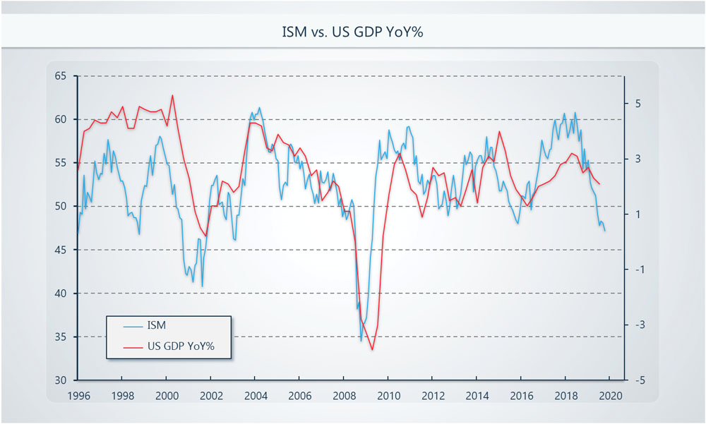
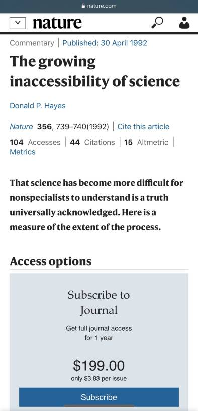
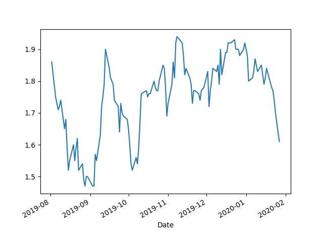
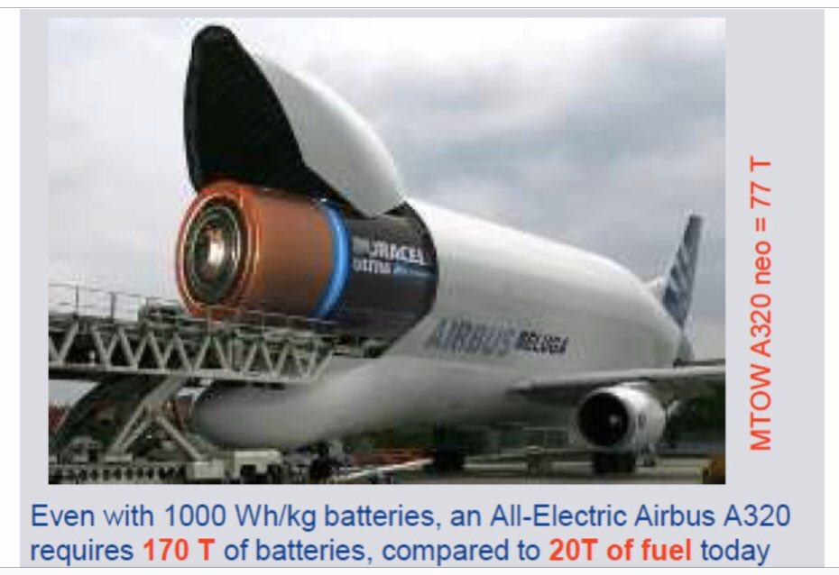

# Week 5

Excellent. More of this. Total job killer.

But, I have to make this clear, this is still an example of weak AI,
not a "thinking machine". The task sounds very focused where 1 can get
training data easily which suits Deep Shit approaches.

"But several months ago, a new worker joined the team. Stationed behind
protective glass, a robot using three suction cups at the end of its
long arm does the .. sifting through parts with surprising speed and
accuracy"

[Link](https://www.nytimes.com/2020/01/29/technology/warehouse-robot.html)

---

F-ing libertards. I dont trust these people with government. Why dont
u go back to your patch of land and pleasure yourself with your
goldbars asshole

"Rand Paul Used to Be a Whistleblower’s Hero. Now He Wants to Out
Them"

---

Theory is nCoV is a bioweapon which escaped lab - it doesnt look like
a coronavirus, looks more like HIV which suggests bioengineering.

"Uncanny similarity of unique inserts in the 2019-nCoV spike protein
to HIV-1 gp120 and Gag"

[Link](https://www.researchgate.net/publication/338957445_Uncanny_similarity_of_unique_inserts_in_the_2019-nCoV_spike_protein_to_HIV-1_gp120_and_Gag)

---

So much for the so-called outside-in approach of Kush

<blockquote class="twitter-tweet">
BREAKING: The Foreign Ministers of the Arab League unanimously adopt a resolution rejecting the Trump peace plan
&mdash; Barak Ravid (@BarakRavid) <a href="https://twitter.com/BarakRavid/status/1223611499362553857?ref_src=twsrc%5Etfw">February 1, 2020</a></blockquote> 

---

Congrats *The Guardian*

"@guardian

In the ground and off the page: why we’re banning ads from fossil
fuels extractors"

[Link](https://mobile.twitter.com/guardian/status/1223605142781599744)

---

Wut? Fighters in Idlib are digging in for a (last?) stand? U know
they'll bomb that place out of existence \#Syria

---

😆😆 Dr. Pedo CCP

(Hey it's only fair after he slandered the real hero of the Thai cave
[rescue](https://www.thesun.co.uk/news/6792661/who-vernon-unsworth-thai-cave-paedo-guy-elon-musk/)
with that exact same word, when he showed up with his bitch submarine
and expected media adulation, and not getting it)

<blockquote class="twitter-tweet" data-conversation="none">
Dr. Pedo of the CCP says not to worry over <a href="https://twitter.com/hashtag/WuhanVirus?src=hash&amp;ref_src=twsrc%5Etfw">#WuhanVirus</a> <a href="https://t.co/ej0pFGYSF1">pic.twitter.com/ej0pFGYSF1</a>
&mdash; EV Defender (@evdefender) <a href="https://twitter.com/evdefender/status/1223579202634514437?ref_src=twsrc%5Etfw">February 1, 2020</a></blockquote> 

---

2020.. sounds so scifi

---

😁 Good one

(There are discussions around fishing rights btw UK and EU)

"Fish are chips in post-Brexit trade bargaining"

---

Hazer Group Ltd is a BUY

---

"@AWeigmannn 

@PlugPowerInc has signed a contract to install 2,000 fuel cells that
will power forklifts at 12 U.S. distribution centers .. pushing PLUG
closer to its goal of reaching 1 billion dol in revenue by 2024"

---

There is no capitalism in Roddenberry Trek either my friend. HTF can
there be markets if there is no money, with prevalent 3D printing, and
abundant energy?

---

"@moetkacik

Boeing debt now 27.3 billion dol on 'increased commercial paper
borrowings' which is a great way to fund gratuitous dividends. Even
with maximum cash extraction policies in place debt was only 10.8 dol
billion pre-MAX. No wonder this company can't afford to develop a
decent plane"

---

Companies should produce locally to the extent possible within their
borders. That builds know-how locally a major factor of econ growth.

---

He is right. I dont like one country being "the factory of the
world". I care more abt know-how, dependencies than jobs but he is
essentially correct.

Commerce Sec. Ross: "I don't want to talk about a victory lap over a very
unfortunate, very malignant disease. The fact is, [nCoV] does give
business yet another thing to consider when they go through their
review of their supply chain"

---

Undercover Ren :) \#SNL

[Link](https://www.youtube.com/watch?v=FaOSCASqLsE)

---

<blockquote class="twitter-tweet">
When people said Rise or Skywalker feels like it was written by a 13-year-old, I thought that was hyperbole to get a point across. But holy fucking shit it was not.
&mdash; Steven Strom (@stevenstrom) <a href="https://twitter.com/stevenstrom/status/1223435220684300289?ref_src=twsrc%5Etfw">February 1, 2020</a></blockquote> 

---

It turns out manufacturing PMI (below) is a good indicator, so use
it. This is a fulcrum point. This ain't school where student is
expected to cover all bases going through some list defined by
others. This is a hunt where one tries to get an advantage. Science
too is very much conducted this way.

Be too cool for school.

"But how about service PMI?"

---

I had to [reproduce it](../../2021/01/stats.html#gdpism)

---

Looks like ISM is a good leading indicator

Which means growth will continue to slow 

@rhaoulgmi

---

<blockquote class="twitter-tweet">
First federal quarantine in 50 years  Buy stocks <a href="https://t.co/7cJbb1PRhz">https://t.co/7cJbb1PRhz</a>
&mdash; Quoth the Raven (@QTRResearch) <a href="https://twitter.com/QTRResearch/status/1223309831228088325?ref_src=twsrc%5Etfw">January 31, 2020</a></blockquote> 

---

"There are comments [abt] Idlib that Russian-backed Assad forces [aim for] the map below until May 2020. If this map is realized: 1. At least 1 million refugees will [come to TR] borders 2. At least 7 [TR] observation bases will be surrounded by the Assad-controlled area"

[Link](https://mobile.twitter.com/Metin4020/status/1222414569571848192)

---

"@jonathanmendez

After spending the past couple months helping an EU company navigate the GDPR within the ad tech space around data it just occurred to me...

Europe is now ahead of the U.S. in ad tech!"

---

Bernie is likable. Bernie is cool.. I just saw two ladies at Fox News
watching the "our opposition is nervous" speech - one of them said "I
like it when he gets hammy" 😆

---

"Sanders Surges to Lead in California"

---

"Sanders has pulled about even with Biden among voters of color"

---

<blockquote class="twitter-tweet">
Bernie: George Wallace reminds me of Hitler.  Media: Bernie praised George Wallace.
&mdash; Pat the Berner🌹 (@PatTheBerner) <a href="https://twitter.com/PatTheBerner/status/1223039309961297922?ref_src=twsrc%5Etfw">January 31, 2020</a></blockquote> 

---

Apparently they will be using bitch batteries..

January Fools!!

"New [Russian] Arctic Station Will Do Without Diesel Fuel"

[Link](https://fuelcellsworks.com/news/sun-wind-and-hydrogen-new-arctic-station-will-do-without-diesel-fuel/)

---

Punchline is at the bottom

---

"@peterdaou

DEAR NYT & PUNDITS: 

My wife @LeelaDaou and I wake up daily to smears like this.

Is it from angry Bernie supporters?

Nope.

It's from Clinton voters"

[Link](https://mobile.twitter.com/peterdaou/status/1222500629379211266)

---

<blockquote class="twitter-tweet">
In layman’s terms:  1. The US private sector did, in fact, grind to a halt in Q4;  2. Larry Kudlow found a way for the BEA to juice Q4 GDP just like they did in 4Q18 (before the sharp revision downward two quarters later); and  3. The bond market had it right all along.
&mdash; Darius Dale (@HedgeyeDDale) <a href="https://twitter.com/HedgeyeDDale/status/1222901870294945792?ref_src=twsrc%5Etfw">January 30, 2020</a></blockquote> 

---

Classixx - Supernature \#music

[Link](https://youtu.be/tstwg6-fRP8)

---

CH company Grove signed cooperation aggr with a Brazilian company back
in March 19, for HFCs.

---

Merkel FTW 🍺🍺🍺🍺🍺🍺🍺

---

Leaked strategy doc - in Kraut

[Link](https://app.handelsblatt.com/downloads/25491634/1/nationalewasserstoffstrategie.pdf?ticket=ST-479852-Yke6rfDpbc95FAycqR5R-ap2)

---

---

---

"Germany Taps Hydrogen Subsidies in Race to Replace Fossil
Fuel.. Germans are preparing to throw the weight of Europe’s biggest
economy behind a plan to replace fossil fuels with the universe’s
lightest element"

[Link](https://www.bloomberg.com/news/articles/2020-01-31/germany-taps-hydrogen-subsidies-in-race-to-replace-fossil-fuel)

---

"@IRENA

I can't decarbonise my whole supply-chain with \#renewableelectricity
and this is why we need other energy carriers to bring
\#renewableenergy into different places of the chain" -- @siemens_me VP

---

---

I have a solution - more cowbell

<blockquote class="twitter-tweet">
POWELL: ASSET VALUATIONS SOMEWHAT ELEVATED <a href="https://t.co/O3hVnFRDtI">pic.twitter.com/O3hVnFRDtI</a>
&mdash; Michael Lebowitz, CFA (@michaellebowitz) <a href="https://twitter.com/michaellebowitz/status/1222616397987139587?ref_src=twsrc%5Etfw">January 29, 2020</a></blockquote> 

---

@RebelNewsOnline

\#Wuhan virus: Toronto arrivals from China say there was no special
screening when they arrived at Pearson International Airport.

[Link](https://mobile.twitter.com/RebelNewsOnline/status/1222931581410652160)

---

GDP YoY is 2.3%, is it "juiced"? Treasuries, earnings are saying one
thing, GDP another. FED's nowcast was expecting near zero.

Did Kudlow snort some cocaine and went haywire on this thing?

If the number is real, it means growth slowing, not as bad as
previously thought (unless there is revision later).

---

\#tbtv \#bloomberg

[Link](https://youtu.be/PtPHpUkhJWY?t=484)

---

To all leaders who "ran against the establishment" and are in their
respective posts: none of you motherfuckers would be where you are
today if Snowden, Greenwald, Assange did not let out some of the
secrets of that establishment, and ppl like them, so albeit in a small
way you owe your post to them. Let's not be ungrateful.

---

Battery swapping instead of waiting for recharge (bcz bitch BEV
charging is incredibly slow) is an obscenely bad idea. Now instead of
N batteries, market needs N + N batteries, half of them unused at any
one time, placing extra strain on the environment (more lithium,
cobalt mining). Standardization wld be pain, Mercedes bats need to be
same as Toyota bats etc.

Clean chemical fuel is inherentely standardized - it is fuel, it is
simple, carrying lots of energy.

---

They can use that however they like it - smallest suspicion,
spur-of-the-moment decision can lead somewhere being bombed.

"The State of Israel will maintain the right to dismantle and destroy
any facility in the State of Palestine that is used for the production
of prohibited weapons or for other hostile purposes."

\#v4p

---

Right, contiguous except those 15 enclaves. Fine.

\#v4p

[Link](https://www.timesofisrael.com/borders-security-jerusalem-settlements-refugees-key-elements-of-trump-plan/)

---

The vision for peace is not my \#1 preference but at least the map
looks less patchy than some of the earlier plans.

But if Israel wants Jordan Valley to cut Pals off from possible
influence coming from Jordan, the optics of the proposed scheme is
bad. It looks like giving ppl a semblance of a state and kind of put
them in a desert island. Their only allies can be Egypt.

Isn't Jordan kind of an Israeli protectorate anyway? What kind of
threat could come from there?

By trying to prepare *every* kind of threat, Pal state is isolated
unnecessarily.

\#v4p

---

So the general will be like FDR vs Adolf Hitler again.

Kidding!

---

I once heard Peter Schiff say "the bottom is gonna fall out of the
dollar" in a Ned Flanders Am accent it was funny

---

Holy %#@ shit. -5.29% decrease on the 10yr. A sign of reduced inflation /
and growth expectation

---

😂😂😪😪

"A black Air Force veteran who tried to deposit settlement checks from a discrimination lawsuit was rejected by his suburban Detroit bank, which suspected fraud and called police"

---

<blockquote class="twitter-tweet">
but the &quot;consumer is in great shape&quot;... &gt; JPMorgan Chase to cut hundreds from its consumer unit in cost-cutting drive - Bloomberg
&mdash; Keith McCullough (@KeithMcCullough) <a href="https://twitter.com/KeithMcCullough/status/1222483478652112896?ref_src=twsrc%5Etfw">January 29, 2020</a></blockquote> 

---

"@tymoignee

No, monetary systems don't start from barter problems. Monetary
instruments are social relations not commodities"

---

"@crampell

But I was told tax cuts would pay for themselves

'U.S. deficit to eclipse 1 trillion dol in 2020, CBO says, as fiscal
imbalance continues to widen washingtonpost.com'"

---

Suspecting Chinese food is a bit too much IMO

[Link](https://youtu.be/A17KN54AU9Q?t=41)

---

"@AWeigmannn

Air Liquide Arabia on Tuesday began pumping hydrogen through its 400
dol million pipeline network in Saudi Arabia’s Red Sea city of Yanbu
and will supply a Saudi Aramco refinery as the kingdom seeks to shift
from oil towards cleaner fuel"

---

<blockquote class="twitter-tweet">
That time a Nebraskan farmer asked members of a pro-fracking oil and gas committee if they would drink water that was tainted by fracking wastewater <a href="https://t.co/h0bfRcYyh2">pic.twitter.com/h0bfRcYyh2</a>
&mdash; SᴡᴇᴇᴘTʜᴇLᴇɢ (@CobraKeiser) <a href="https://twitter.com/CobraKeiser/status/1221519572542640128?ref_src=twsrc%5Etfw">January 26, 2020</a></blockquote> 

---

Olmert showed him the map, but wouldn't give it to Abbas. Obviously
Abbas would leak it, and Olmert knew that, thats why he held back. On
the other hand, his refusal showed Olmert was just feelin around,
doing stuff on his own. When Abbas realized that, he musta thought
'this m..f-ka is flying solo', wouldnt then take him seriously.

\#v4p

---

Right.. bcz Palestenians never miss an opportunity to miss an
opportunity" 🙄

Abbas refused bcz he was not allowed to study the map.

"Olmert offered Abbas whole of West Bank and he refused"

\#v4p

---

"It's been a long, long time since there's been legitimate price
discovery in the markets. At the end of the day, when you look at even
equities, equities are ultimately the derivative of the credit
markets. They're just the thing at the bottom of the capital
stack. Over time, people compare dividend yield on stocks with yields
on debt.

That entire structure has been distorted by monetary authorities
effectively underpricing the front end of the term structure of risk
reward."

[Link](https://youtu.be/q-S6aOPR1xM?t=241)

---

<blockquote class="twitter-tweet">
I think metallic hydrogen will start to take off in the mid 2030’s
&mdash; Darkstar (@Darksta22213574) <a href="https://twitter.com/Darksta22213574/status/1222173898503933952?ref_src=twsrc%5Etfw">January 28, 2020</a></blockquote> 

---

"@mluebbecke

Could you *please* stop writing 'thinking' machines? People [might]
believe it ..."

---

Maximum flow LP definition... that's some diabolical shit right
there...

R-r-r-r-rrrrespect.

1 wld think soln could be combinatorial, but it isn't.

---

<blockquote class="twitter-tweet">
The biggest economic perversions of our time is the aim to sustain economic growth by any means necessary.  Business CYCLES have been with us for millenia. All phases, from a recovery to a recession, serve their purpose.  Trying to stop a <a href="https://twitter.com/hashtag/recession?src=hash&amp;ref_src=twsrc%5Etfw">#recession</a> by force yields nothing good.
&mdash; Tuomas Malinen (@mtmalinen) <a href="https://twitter.com/mtmalinen/status/1221672873431048192?ref_src=twsrc%5Etfw">January 27, 2020</a></blockquote> 

---

Slacktivists

---

Haha.. some in the US right who are cold to China were loving Johnson,
celebrating Brexit - how u feelin now?

"Boris Johnson controversially hints he’ll allow Huawei to build
Britain’s 5G network"

---

The great oygenation effect

[Link](https://youtu.be/W_GD34nNaco?t=303)

---

If by this time fossil is still widely used, targeted sabotage will
become legitimate. Extreme elements will take action. Let's fix this
thing before it gets there.

"A new report published by the Hydrogen Council predicts that the cost
of renewable hydrogen production could halve over the next ten years,
putting Australia is in prime position to become a leading global
supplier of a green fuel that will beat even “unabated” fossil fuels"

[Link](https://reneweconomy.com.au/renewable-hydrogen-costs-could-halve-by-2030-beating-unabated-fossil-fuels-67382/)

---

"LADWP says 100 caverns, each larger than New York’s Empire State
Building, could fit in the salt dome. Mitsubishi Hitachi Power Systems
has called this part of the plan for 'the world’s largest renewable
storage project.'"

[Link](https://pv-magazine-usa.com/2020/01/27/green-hydrogen-backed-by-us-solar-firms-8minute-and-intersect-power/)

---

"While the new UK government ran on a nativist platform of restricting
immigration, with the goal of keeping outsiders from taking bread out
of the mouths of UK citizens, this doesn’t apply to mathematicians:
all limits are off and we’re encouraged to flood the country. The law
will be changed on Friday, changes go into effect Feb. 20. This will
include an “accelerated path to settlement”, no need to even have a
job offer, and all your “dependents [will] have full access to the
labour market”, no problem with them and the taking the bread out of
the mouths of the locals thing"

[Link](https://www.math.columbia.edu/~woit/wordpress/?p=11581)

---

We need more technocrats. Speficially we need more left technocrats, like Bernie. 

---

<blockquote class="twitter-tweet">
In Vietnam, wind and solar met goal of providing 10% of power in 2030 10 YEARS AHEAD of schedule - and are rapidly eating into the 43% share allotted to coal  Why? Cheaper, cleaner, more popular and far quicker to build  Fossil fuels are so 20th century<a href="https://t.co/G2ZzedaKAu">https://t.co/G2ZzedaKAu</a>
&mdash; Assaad Razzouk (@AssaadRazzouk) <a href="https://twitter.com/AssaadRazzouk/status/1221779405225152513?ref_src=twsrc%5Etfw">January 27, 2020</a></blockquote> 

---

"@kenklippenstein

The Bernie Sanders campaign was the only one to respond to my request
for comment about Brazil's decision to prosecute Glenn Greenwald"

---

<blockquote class="twitter-tweet">
The free press is never more important than when it exposes wrongdoing by the powerful.   That is why President Bolsonaro is threatening Glenn Greenwald for the &quot;crime&quot; of doing journalism.   I call on Brazil to end its authoritarian attack on press freedom and the rule of law. <a href="https://t.co/NfcVnxT50F">https://t.co/NfcVnxT50F</a>
&mdash; Bernie Sanders (@SenSanders) <a href="https://twitter.com/SenSanders/status/1219952853646823424?ref_src=twsrc%5Etfw">January 22, 2020</a></blockquote> 

---

"Left-wing alliance sees off Salvini’s far-right in key Italian
regional election after turnout surge"

[Link](https://www.independent.co.uk/news/world/europe/italy-election-salvini-emilia-romagna-pd-far-right-umbria-calabria-bologna-a9304681.html)

---

Out of the three, GF might have had the better deal. Great career,
beat Frazier, lost to Ali, both decisively. On a talk show later on
with the other two, he was still in form, chipper, all marbles
there. Ali was __gone__. He could barely speak.

---

Ah - Ali was *Mellow Meadow*. Overdid the fighting. He could have said
"Fraz, u got beaten by the guy I beat, see ya". Leave it at 1-1 with a
tilt towards him.

---

It's true the 3rd Ali-Frazier fight took too much out of them ("we
went to Manilla as champs, came back as old men"). Some style pairings
are a natural tie. No need to push it. Foreman beats Frazier, Ali
beats Foreman, then Ali has trouble with Frazier. The calculus is out
of whack. Leave it at that. I bet Ali's Parkinsons had something to do
with that last fight

---

The map of nCov also reveals China's relationship with the world. US,
Canada, Thailand, Germany... No India relation. That makes sense.

---

Hitting Baydın on social security is a first layer, reptilian level
attack ([see](../../2014/06/the-culture-code.md)
Rapaille) Reptilian level is the fight-or-flight, survival level stuff
-- the strongest, stronger than culture even, and intellect
(policy). The attack says the money you now __have__ will be __taken__
by __that guy__, then you might __die__ bcz you will have __no
money__.

😨😨😨😨😨

It happens to be the truth of course. It makes sense to highlight it.

---

Study by CTE: The range of e-buses is reduced by up to 37.8% at 0 to
-5 ° C in winter.

[Link](https://fuelcellsworks.com/news/study-by-cte-cold-weather-effects-range-loss-in-winter-fuel-cell-beats-battery/)

---

"@People4Bernie

Our opposition is nervous.

They should be.

We are their worst nightmare"

[Link](https://twitter.com/People4Bernie/status/1221621076737679361)

---

AFC Energy is a BUY

"AFC will be granted exclusive rights in the UK, Europe and Australia
to use HiiROC’s technology, which extracts hydrogen from methane
without emitting CO2"

[Link](https://www.proactiveinvestors.co.uk/companies/news/911522/afc-energy-inks-deal-with-green-tech-firm-hiiroc-to-extract-hydrogen-from-natural-gas-911522.html)

---

😂😂😂😂 This thing is never going away

[Link](https://youtu.be/nimZgEJEMjk?t=1373)

---

Hot Chop - Ready for the Floor (Villains and LA Riots Remix) \#music

[Link](https://youtu.be/VRVsTQeOBGI)

---

---

Fin shows constantly talk about stocks bcz these are names that are
familiar to most people. SBUX, AMZN - "oh well, I just had coffee at
Starbucks and shopped from Amazon". But the futures market, the
curency market, the bond market are all much larger than the equities
market (stocks). Right off the bat we see fin shows are not there to
inform, but to entertain and to pander. If they talked about
Eurodollar futures, then u have to do a song and dance abt what that
is, blah blah.. then the viewer checked out dude! The ratings are
down. Bummer. Back to stocks.

---

"@IncomeDisparity

New nightmare scenario: Your on a 737 MAX with coronavirus infected
people, flying in Iranian airspace, long futures with no WiFi access"

---

Eurodollar buying means an expectation of a rate cut. And a rate cut
expectation means low earning, low growth expectation - as in, bad news.

Bad news means bad news (u have to add that these days)

<blockquote class="twitter-tweet">
I think the 99DEC2020 might come into play. If it does, that would an incredible <a href="https://twitter.com/realvision?ref_src=twsrc%5Etfw">@realvision</a> &quot;the one thing&quot; trade
&mdash; Mcfly (@azplaced) <a href="https://twitter.com/azplaced/status/1221575168188997632?ref_src=twsrc%5Etfw">January 26, 2020</a></blockquote> 

---

"@torp_ulrik

Waiting to fuel. Good thing it only takes 3 minutes. A Nexo also
showed up short after.

[Link](https://twitter.com/torp_ulrik/status/1221462052268650498)

---

"@Motorhead

Shanghai now at Level 1 emergency response, the highest
designation. Schools are shut; trains & subways stopped"

---

'Laying it too thick' - haha I like this term 

---

WTF? Kobe RIP

---

"@shayne_chester

Ian Plimer is also director of multiple mineral exploration and mining
companies. Plimer has said that volcanic eruptions release more carbon
dioxide (CO2) than human activity;

FACT CHECK: anthropogenic emissions of CO2 are 135 times larger than
those from all volcanoes on Earth"

---

Chomsky vs Buckley debate... Boy, did Chomsky moonwalk up and down that
ass... it was brutal. Buck is like Imma lay back, talk all posh and
win this thing over here.. Chomsky's like - bitchslap! Dude was
throughly confused.

---

<blockquote class="twitter-tweet">
Fuel cell powertrains &#39;could be as cheap as petrol in five years&#39;, says BMW&#39;s hydrogen VP <a href="https://t.co/31GS1AgIDt">https://t.co/31GS1AgIDt</a> via <a href="https://twitter.com/TeleCars?ref_src=twsrc%5Etfw">@TeleCars</a>
&mdash; 24hydrogen.com (@24hydrogen_com) <a href="https://twitter.com/24hydrogen_com/status/1221188763155619840?ref_src=twsrc%5Etfw">January 25, 2020</a></blockquote> 

---

"@karthikpuru91

If Bernie can make the case that Dem socialism is how small businesses
can best thrive - defeating an increasingly monopolistic / oligarchic
system - he'll win in a landslide"

---

"@ryangrim

NYT half endorsement of Klobuchar cut her support nearly in half"

---

TSP = Traveling Salesman Problem. A core problem in CS, Opt.

WaPo, Pop Mec effed up in its sci publication? Alert the presses!

But wait 🤔

---

Pop Mec FTW.. or, WTF

"@ryanjoneil

What bugs me in these TSP articles: They're not just a little bit
wrong. They're light years off from decades-old reality"

<blockquote class="twitter-tweet">
The <a href="https://twitter.com/washingtonpost?ref_src=twsrc%5Etfw">@washingtonpost</a> 1000-year estimate for a 22-city TSP is raised to 1200 years! Here is my 2018 reply <a href="https://t.co/qkuB2rtyNB">https://t.co/qkuB2rtyNB</a> or a bit more starting at 7:50 <a href="https://t.co/qCYdCSP0wJ">https://t.co/qCYdCSP0wJ</a> in a talk from EURO Dublin <a href="https://twitter.com/eurok2019?ref_src=twsrc%5Etfw">@eurok2019</a> <a href="https://twitter.com/IFORS_News?ref_src=twsrc%5Etfw">@IFORS_News</a> <a href="https://twitter.com/hashtag/orms?src=hash&amp;ref_src=twsrc%5Etfw">#orms</a> <a href="https://t.co/t6ePoi0Ra5">https://t.co/t6ePoi0Ra5</a>
&mdash; Bill Cook (@wjcook) <a href="https://twitter.com/wjcook/status/1221147324388466688?ref_src=twsrc%5Etfw">January 25, 2020</a></blockquote> 

---

---

