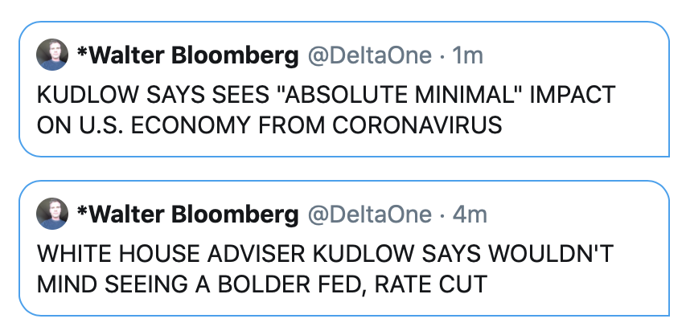
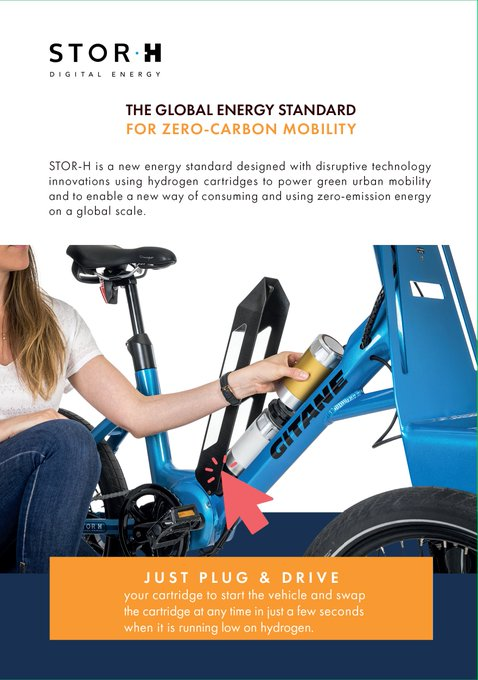
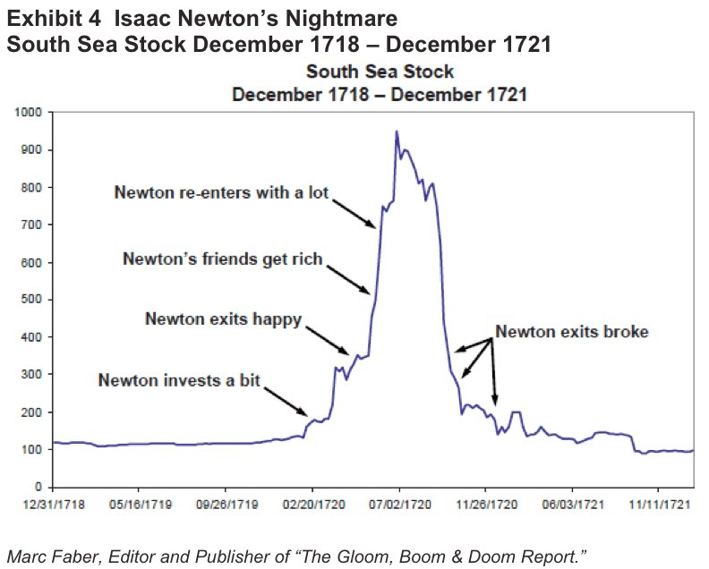

# Week 6

Apocalyptic movie script: airborne virus originating from China scares
off neighboring countries so they collectively nuke China. But the
virus keeps spreading, so everyone keeps nuking eachother. Cue in *Mad
Max*.

---

"The price-to-sales ratio (Price/Sales or P/S) is calculated by taking
a company's market capitalization (the number of outstanding shares
multiplied by the share price) and divide it by the company's total
sales or revenue over the past 12 months. The lower the P/S ratio, the
more attractive the investment."

---

Exercise while at home through games. Cool

[Link](https://mobile.twitter.com/Whatleydude/status/1226172790761574408)

---

<blockquote class="twitter-tweet"><p lang="en" dir="ltr">The Chinese Coronavirus has become a major existential crisis for secretary xi and his cadre of miscreants. The fact that they are censoring their own national anthem gives the free world particular insight into the madness at the top. They have lost it. <a href="https://twitter.com/AmbCuiTiankai?ref_src=twsrc%5Etfw">@AmbCuiTiankai</a> <a href="https://twitter.com/hashtag/WuFlu?src=hash&amp;ref_src=twsrc%5Etfw">#WuFlu</a> <a href="https://t.co/OvscTvZdvO">https://t.co/OvscTvZdvO</a></p>&mdash; 😷Kyle Bass😷 (@Jkylebass) <a href="https://twitter.com/Jkylebass/status/1226168173722046466?ref_src=twsrc%5Etfw">February 8, 2020</a></blockquote> <script async src="https://platform.twitter.com/widgets.js" charset="utf-8"></script>

---

"@ddayen

Cash bail is not gone in California yet, there's a private
equity-funded effort to repeal the bill, which is going to need a ton
of money to counteract, the kind of money Tom Steyer could give if he
wasn't pissing it away in presidential campaign TV ads"

---

<blockquote class="twitter-tweet"><p lang="en" dir="ltr">According to one of the world’s biggest developers of offshore wind farms, massive turbines could be key to the production of hydrogen in a greener way. Read the full article from <a href="https://twitter.com/climate?ref_src=twsrc%5Etfw">@climate</a> to learn more. <a href="https://twitter.com/hashtag/hydrogen?src=hash&amp;ref_src=twsrc%5Etfw">#hydrogen</a> <a href="https://twitter.com/hashtag/zeroemission?src=hash&amp;ref_src=twsrc%5Etfw">#zeroemission</a> <a href="https://twitter.com/hashtag/sustainbility?src=hash&amp;ref_src=twsrc%5Etfw">#sustainbility</a> <a href="https://t.co/QAav2Nbs5v">https://t.co/QAav2Nbs5v</a></p>&mdash; ZeroAvia (@ZeroAvia) <a href="https://twitter.com/ZeroAvia/status/1225855270993170432?ref_src=twsrc%5Etfw">February 7, 2020</a></blockquote> <script async src="https://platform.twitter.com/widgets.js" charset="utf-8"></script>

---

<blockquote class="twitter-tweet"><p lang="en" dir="ltr">It&#39;s the most incoherent West Wing fan fic gibberish I&#39;ve ever seen.</p>&mdash; Willrow Hood (@hood_willrow) <a href="https://twitter.com/hood_willrow/status/1225970883484934146?ref_src=twsrc%5Etfw">February 8, 2020</a></blockquote> <script async src="https://platform.twitter.com/widgets.js" charset="utf-8"></script>

\#demdebate

---

Fudgin Bootyfudge

"@ryangrim

So Buttigieg, confronted by the facts of what his administration did
on pot arrests, twice lied and denied it. Then pressed a third time he
admitted it was true, but claimed the pot arrests were linked to gangs
and murderers"

\#demdebate

---

Supporting Bernie this time around wasnt a big jump really.. This man
took nearly half the votes last time. We know he can do it.

And beating Trump? I am sorry to say but noone except Bernie has much
of a chance. It will be hard enough already wout a viable
candidate. With one, Dems might, just make it through.

\#demdebate

---

Bernie crushed it

\#demdebate

---

"End cash bail"

\#bernie \#demdebate

---

AAPI? Man these labels are proliferating..

\#demdebate

---

I am now pretty sure now 9/11 was the work of US "allies".

They did not want US leave ME. US was abt to do its pivot to Asia
then. Also Pentagon missing money issue became a thing, an audit was
coming, in fact this was the last thing Rummy said publicly before
9/11 (on 9/10, the day before).

If allies can trigger a whole new insurgency in the form ISIS, couldnt
they knock down a few buildings? Not necessarily the known leaders of
allies, but possibly a combo of their deep states.

---

🤦‍♂️🤦‍♂️🤦‍♂️

[Link](https://mobile.twitter.com/Theophite/status/1225583257242103808)

---

Democrats self-destructing my ass. Reps went through a much
"destructive" process, and they are still here.

I guess the expectation of Dems is to always be ultra-capitalist, and
to be centrist. They should not be "radical". Then, of course, they
should not have internal arguments, they should have similar looking
candidates. They need to remain the way they are, irrelevant, useless,
and inert.

---

The relationship between the diversity of products produced by a
country and its GDP is shown below (math and code). Hidalgo (a
statistical physicst) also theorized that product diversity is related
to the "know-how network" of that country, and such networks can only
form in close proximity. All of that contribute positively to
growth. 

[Link](../../en/2017/08/hidalgo.html)

---

<blockquote class="twitter-tweet" data-conversation="none"><p lang="en" dir="ltr">The 2% of US GDP they steal each and every year also has a future earnings potential. Decoupling from the criminal government of china will be NPV positive to the US after a short period of corrupted and greedy ‘economists’ tell everyone that’s its a terrible idea.</p>&mdash; 😷Kyle Bass😷 (@Jkylebass) <a href="https://twitter.com/Jkylebass/status/1225424802275524609?ref_src=twsrc%5Etfw">February 6, 2020</a></blockquote> <script async src="https://platform.twitter.com/widgets.js" charset="utf-8"></script>

---

[No more drugs for that man](https://youtu.be/3bdv8MjwzxA?t=33)



---

"Corona viruses can remain on surfaces for up to nine days at room
temperature and remain infectious. On average, they survive four to
five days, writes a research team from Greifswal"

[Link](https://m.tagesspiegel.de/wissen/deutsche-forscher-erklaeren-coronaviren-auf-oberflaechen-bis-zu-neun-tage-infektioes/25472332.html)

---

"@TuckerCarlson

We’re rooting for Glenn Greenwald"

[Link](https://twitter.com/TuckerCarlson/status/1220173312216698882")

---

During 2007/08 fin orgs were suspecting eachother in terms of
solvency. If that's not an issue and someone keeps pumpin in $, I
wonder how long ppl can keep buying "stawks".

---

"$AAPL is down $1 on the news the factory that produces almost all
their revenue is closed, this scam of a market is getting even more
laughable than it already was"

---

"@JTSEO9

Global governments desperately trying to keep the demand side
protected.  Production side is doing everything possible in hopes they
can be back online before inventories are depleted.  It's fascinating
to watch"

---

James Woods is back on Twitter (right after impeachment acquital,
concidence)?  Great. Guy is a pure, undiluted asshole, but even he
deserves right of speech.

---

<blockquote class="twitter-tweet"><p lang="en" dir="ltr">the second largest economy in the world at a virtual standstill will have minimal impact on everything else - according to sources</p>&mdash; StockCats (@StockCats) <a href="https://twitter.com/StockCats/status/1225799626026029058?ref_src=twsrc%5Etfw">February 7, 2020</a></blockquote> <script async src="https://platform.twitter.com/widgets.js" charset="utf-8"></script>

---

Bernie did great in Iowa. Onwards to New Hampshire! 

---

"@jenniferatntd

[How many deaths?] One leaked Chinese source says over 20 K, but got
deleted soon... No way to verify, as the \#CCP doesn't tell you the
truth. But definitely much, much more than the official number"

---

"@3D_orlando

If Shenzen goes on full lockdown...the ripple effect will be
substantial"

---

"Faurecia wins a major award for hydrogen storage systems for Hyundai
trucks.. [it is] the 9th largest international automotive parts
manufacturer in the world and \#1 for vehicle interiors and emission
control technology. One in three automobiles is equipped by Faurecia"

---

Trump net approval rose to -8%. It hasn't been at this level for a
very long time. Impeachment backfire?

---

<blockquote class="twitter-tweet"><p lang="en" dir="ltr">“Fail faster, succeed sooner.” - David Kelley<a href="https://t.co/3shFAaV0ZK">https://t.co/3shFAaV0ZK</a></p>&mdash; Chris C. Kemp (@Kemp) <a href="https://twitter.com/Kemp/status/1225507569222987776?ref_src=twsrc%5Etfw">February 6, 2020</a></blockquote> <script async src="https://platform.twitter.com/widgets.js" charset="utf-8"></script>

---

“Fascism should more appropriately be called Corporatism because it is a merger of state and corporate power” - Mussolini

---

"@GeoffreySupran
 
@Georgetown University to divest entire $1.7 billion endowment from
all fossil fuels, hours after @NYCMayor announces New York City to ban
all new fossil fuel infrastructure"

---

Cars serviced per station

```python
print ('fuel', np.round(227*1e6 / 170000.))
print ('fuel', 15*1e6 / 10000)
print ('bev ',np.round(570000 / 18000))
```

```text
fuel 1335.0
fuel 1500.0
bev  32.0
```

The ratio comparison is an eye-opener. Fuel based solutions are better
not just at a singular car basis, but also at an infrastructure level.

"@ggolden 

US has around 170,000 fueling stations for 272 MILLION vehicles.  Today California has 10,000 gas stations for 15 million cars. Cali has 570,000 EVs, 18,000 charging stations. Fueling stations scale.  H2 is stored energy"

---

That pop / econ analysis is deficient. Industrial tech allowed for
explosive popul growth. The causal effect points in the opposite
direction. And "2% more ppl getting 2% more haircuts" is not a
significant observation.

"@JTSEO9

When people believe population should act like a growth stock"

[Link](https://mobile.twitter.com/JTSEO9/status/1222188107057049601)

---

Maybe I should cut down on hitting Tories, they're doing some good
stuff on renewables 🤔

Hey man I am just another interested party, gimme little somethin'
somethin', I'll give u little somethin' somethin'.

Do you want to be in the circle of trust? 👌

"@DriveH2

With the UK's ban of diesel engines by 2035, \#Hydrogen is now
incorporated into their updated plan"

[Link](https://buff.ly/2RTCWoU)

---

I like it the article mentions two of three waves. While reading I was
thinking "but would these args apply to a diff wave" then I saw the
paragraph below.

Article says there is a confluence of tech and people, open to abuse,
exploitation in whichever direction the tech pulls. Possible.

BBC -- "Are the lessons of agrarian empires applicable to our
post-18th Century period of industrial capitalism? (Read about the
greatest long term threats facing humanity.)

I would argue that they are. Societies of the past and present are
just complex systems composed of people and technology. The theory of
“normal accidents” suggests that complex technological systems
regularly give way to failure. So collapse may be a normal phenomenon
for civilisations, regardless of their size and stage"

[Link](https://www.bbc.com/future/article/20190218-are-we-on-the-road-to-civilisation-collapse)

---

Stor-H? Nice.

An H2 capsule.



---

Yes Daimler as in Daimler-Benz. And Benz as in 

"When I pull out up front, you see the Benz on dubs ♪♬

When I roll twenty deep, it’s twenty knives in the club ♪♬

Rather buy a Benz, don't want no friends ♪♬

Glock inside my Benz, no such thing as friends ♪♬"

---

Fact 1: EU wants to be carbon neutral by 2050. Decided.

Fact 2: Companies are aligning themselves for that goal. Daimler, I
repeat DAIMLER announced last year they don't want to be selling ICE
vehicles anymore in 20 years. By then they will only be selling
vehicles running on "alternative means" of which H2 will be one.

[Link](https://youtu.be/x1sjyulWtiY?t=659)

---

<blockquote class="twitter-tweet"><p lang="en" dir="ltr">Kia hops onboatd the Fuel Cell wagon🍃💦⚡️🚗 <a href="https://t.co/1jGADZ5onV">https://t.co/1jGADZ5onV</a></p>&mdash; Espen Erichsen (@cheesespinner) <a href="https://twitter.com/cheesespinner/status/1225323733532934144?ref_src=twsrc%5Etfw">February 6, 2020</a></blockquote> <script async src="https://platform.twitter.com/widgets.js" charset="utf-8"></script>

---

Bootyfudge trying to stand out through age, saying "represents a wish
for change" for his generation. See poll,

"@EmersonPolling

NH Tracking Poll:

__Under 50__:

Sanders 43%

Buttigieg 15%

Warren 12%

Klobuchar 12%"

---

Bootyjudge is now Bootyfudge

---

<blockquote class="twitter-tweet"><p lang="en" dir="ltr">Yep, he’s a boomer doomer.</p>&mdash; Jim Smoot (@jim_smoot) <a href="https://twitter.com/jim_smoot/status/1224918325030862848?ref_src=twsrc%5Etfw">February 5, 2020</a></blockquote> <script async src="https://platform.twitter.com/widgets.js" charset="utf-8"></script>

---

Nope. Hillary was not "surprised" that she lost in 2016. She knew she
was in trouble as the end neared - pneumonia is a sign of desperation
That's another reason why I never believed this Russia bullshit
because I knew H herself believed her campaign was in trouble.

---

This guy is 10 hrs late to the party. 

"James Carville: Beating Trump Is The Only Thing That Matters In 2020"

---

Reuters: "84% of stocks owned by U.S. households are held by the
wealthiest 10% of Americans, according to an analysis of 2016 Federal
Reserve data by Edward Wolff, an economics professor at New York
University. So when the stock market has a blockbuster year - such as
the nearly 30% rise in the S&P 500 benchmark index in 2019 - the
payoff primarily goes to people who are already rich"

---

Ahh.. "AI", Deep Shit guy.. How did I miss you?

[unfollow]

---

They would lose their minds - and not in a good way.

"What would the founders think abt today's corporations?"

---

Une scène apocalyptique!!!

[Link](https://mobile.twitter.com/RestitutorOrien/status/1225059127833047040)

---

Howard Dean would still be undone today by "the scream". He wasn't
knocked down bcz he acted "inapropriately". He got knocked down bcz he
looked uncool. He was running as a tough guy but the scream was
bitchy.

Trump didn't change the rules of the game that much. He just found a
different way of charisma projection. 

---

From the show *Avenue 5*

"We're gonna run rings around Saturn"

"Set your phasers to fun"

---

Unemployment initial [claims](../../2021/01/stats.html#claims) -
sign of unemployment, a "report that measures the number of new jobless claims filed by individuals
seeking to receive unemployment [benefits]". 

The dangerous point is not when UIC is at a low level - it is when,
after a bottom, it starts going up __that's__ when the bomb goes off.

---

It's like in that *Seinfeld* episode *The Wizard*. Throughout the
whole episode Elaine thinks her new boyfriend is part black, it turns
out he is not. And the boyfriend was thinking she was Hispanic because
her last name is Benes, but she is not. They conclude "so we’re just a
couple of white people?", Elaine makes that face, both
disappointed. The part ends. That is these people's delusion in a
nutshell.

---

Bitch - I've seen more temper from a wigger in Walmart than your
confused, dumbass.

STFU

"I have such a Latin temper, I get mad like fast"

---

Faux subcultures help to "deal" with the outside world, which is
getting crazier by the day. They help to make the world
smaller. Through these categories, instead of being just another
American, person could become, say, "Irish" and others feel like they
know them. "So you get shit-faced and pass out on the door mat before
u even make it in your house right?!!  Right!!!!. Hahahahhaaha..! So
Irish"

This is f-ing non-sense. 

---

You know, that would be even funnier if you were Italian. But you are
not. If you really want to fall under a category, it can be 'a jock',
at best. This guy.. goes to a psychologist too? Do you.. do you..
tell her your problems? Do you cry like a little bitch? Booo hooo
hoooo boooo ... they call me Fredo .. booo hoo

"The word 'Fredo' is like the N-word for my people"

---

Dude - I want 10 seasons of this show. Can it be done?

[Link](https://youtu.be/whfMMfR4KKw?t=137)

---

"@valleyhack

For the past three years, I've been following a rocket
start up in secret. Today, we told a little of their story for the
first time. They been making this thing in freaking Alameda and no one
noticed."

[Link](https://twitter.com/valleyhack/status/1224352558824615936)

---

Oersted A/S is a BUY

---

Haha.. Nancy ripping up speech. Theather

\#sotu

---

Guaido invitation, nice touch. I hope Maduro, that illegitimate punk,
gets paralyzed and by mistake allows fair elections and his shit f-k
of a party falls.

\#sotu

---

Refusal of handshake? Well she went ahead with impeachment which says
"I do not recognize your Presidency". The optics are she doesnt
respect him in that post, why should he shake hands?

\#sotu

---

Financial Times: "Shares in some producers of hydrogen and
manufacturers of fuel cells have soared to their highest levels in a
decade, reflecting hopes that the colourless gas can replace fossil
fuels in everything from trucks to homes.

Shares in London-listed ITM Power, which makes electrolysers to
produce hydrogen, are up by more than 45 per cent this year to their
highest level since 2007. Meanwhile, shares in Sweden’s Powercell have
risen 28 per cent over the same period and 342 per cent over the past
12 months...

China has continued to subsidise hydrogen fuel cell technology while
cutting subsidies for lithium-ion batteries"

[Link](https://www.ft.com/content/5e837ff8-441b-11ea-a43a-c4b328d9061c)

---

There is probably more character development in that *Undercover Ren*
\#SNL skit than the entirety of the Disney Star Wars saga.

---

"@QTRResearch

How to invest 101

No volatility > go long > markets go to all time highs

Black swan event > central banks inject trillions into the market
while humanity is exterminated > go long > markets go to all time
highs"

---

"@BradMunchen

.. Vietnam just banned all flights from China, Hong Kong, & Macau
until May 1st"

---

It's hilarious though 1 of the founders of modern math, Isaac Freaking
Newton, was a trader once and lost money.

---

Yeah I dont think Newton used any math here.. he was gripped by FOMO



---

Brexit will never end....

---

<blockquote class="twitter-tweet"><p lang="en" dir="ltr">After years of obsession with the Russians, the Democrats somehow managed to hack their own election</p>&mdash; Rich Lowry (@RichLowry) <a href="https://twitter.com/RichLowry/status/1224557062551691269?ref_src=twsrc%5Etfw">February 4, 2020</a></blockquote> <script async src="https://platform.twitter.com/widgets.js" charset="utf-8"></script>

---

<blockquote class="twitter-tweet"><p lang="en" dir="ltr">U.S. Department of Energy and U.S. Army Issue Solicitation to Develop H2Rescue-Is a <a href="https://twitter.com/hashtag/fuelcell?src=hash&amp;ref_src=twsrc%5Etfw">#fuelcell</a>/battery truck that first responders &amp; military can drive to disaster sites. Provide <a href="https://twitter.com/hashtag/hydrogen?src=hash&amp;ref_src=twsrc%5Etfw">#hydrogen</a> to power, heat, &amp; potable water for 72 hrs-<a href="https://t.co/vKx9TrFlE4">https://t.co/vKx9TrFlE4</a> <a href="https://twitter.com/hashtag/hydrogennow?src=hash&amp;ref_src=twsrc%5Etfw">#hydrogennow</a> <a href="https://twitter.com/hashtag/decarbonise?src=hash&amp;ref_src=twsrc%5Etfw">#decarbonise</a> <a href="https://t.co/Rrz8oXpv13">pic.twitter.com/Rrz8oXpv13</a></p>&mdash; FuelCellsWorks (@fuelcellsworks) <a href="https://twitter.com/fuelcellsworks/status/1224675662914576385?ref_src=twsrc%5Etfw">February 4, 2020</a></blockquote> <script async src="https://platform.twitter.com/widgets.js" charset="utf-8"></script>

---

Yes there is such a thing as low-information voter. I have to add
though, almost __all__ voters are low-information voters. Econ
recently started talking abt a similar concept, i.e. individual actors
lacking information, so cannot make rational decisions, there are now
behavioural economists so forth. Austrians too have a few things to
say on this issue (so they have their moments when they are not busy
shoving a goldbar up their ass). People don't know shit so cannot act
rationally in econ. Why do some ppl assume otherwise in politics? It
is a single, simple decision is based on very rough perceptions, their
own pocketbook, few other traits, in the aggregate works better than
the alternatives. That's it.

---

Astra The Rocket Company 

More frequent launches, smaller rockets

[Link](https://vimeo.com/388954219)

---

Doesn't surprise me. Arthur C. Clarke thought about satellites before
their time. Jules Verne wrote abt hydrogen as fuel, others about moon
landing, etc.

<blockquote class="twitter-tweet"><p lang="en" dir="ltr">The three laws of robotics originated by Isaac Asimov, the Asimovian laws, are actually used by developers programming <a href="https://twitter.com/hashtag/AI?src=hash&amp;ref_src=twsrc%5Etfw">#AI</a> today <a href="https://twitter.com/hashtag/scifibooks?src=hash&amp;ref_src=twsrc%5Etfw">#scifibooks</a></p>&mdash; Sarah Austin (@sarahaustin) <a href="https://twitter.com/sarahaustin/status/760360579856936960?ref_src=twsrc%5Etfw">August 2, 2016</a></blockquote> <script async src="https://platform.twitter.com/widgets.js" charset="utf-8"></script>

---

We'll never solve climate change with bitch BEVs. The tech is
inferior, the wrong solution with no chance of scale and satisfying
customer demand.

"Rise of SUVs 'makes mockery' of electric car push. The 'immense' rise
in sales of high-emission sports utility vehicles means they now
outsell electric cars in the UK by 37 to one, research has found" -
BBC

[Link](https://www.bbc.com/news/business-50713616)

---

<blockquote class="twitter-tweet"><p lang="en" dir="ltr">Russia, if you&#39;re listening, please release the caucus results</p>&mdash; Michael Tracey (@mtracey) <a href="https://twitter.com/mtracey/status/1224543967167090690?ref_src=twsrc%5Etfw">February 4, 2020</a></blockquote> <script async src="https://platform.twitter.com/widgets.js" charset="utf-8"></script>

---

<blockquote class="twitter-tweet"><p lang="en" dir="ltr">Once you&#39;ve experienced the French healthcare system (as I did for 7 years) and are then forced back onto the predatory, Kafkaesque, almost mafia-esque US healthcare system the horribleness of this racket here in the states is so obvious. It&#39;s surreal that few see it. <a href="https://t.co/KvgVmlaCrm">https://t.co/KvgVmlaCrm</a></p>&mdash; Stacy Herbert (@stacyherbert) <a href="https://twitter.com/stacyherbert/status/1224416212106563591?ref_src=twsrc%5Etfw">February 3, 2020</a></blockquote> <script async src="https://platform.twitter.com/widgets.js" charset="utf-8"></script>

---

Bam Iowa couscous results were available the next day, 2007 Iowa
couscous was on Jan 3rd. See the date on the paper below.

[Link](twimg/EQG-BQNXsAAS54W.jpg)

---

There is something weird with this couscous..

---

Most features attributed to subcultures, say, in the positive, is
placebo. Keep saying "my people" are [certain way], u can start acting
that way, bcz u'd be pushing self as such. It has been proven in the
negative. When kids were reminded of their historically disadvantaged
minority status during tests their scores went down.

---

Ozdemir name sounds TR, and his family is from TR. But he is German -
in fact stressed this point in his bio. His book was one of the many
data points I used to reach the culture / identity conclusion - how
where u r born matters and how most US subcultures are artificial,
fake and completely false.

---

Germany has been on H2 biz for a while - all their parties like the
idea, especially the
Greens. [Here](https://twitter.com/cem_oezdemir/status/740964350719107072)
is Cem Ozdemir on Linde's H2 bike back in '16.

---

<blockquote class="twitter-tweet"><p lang="en" dir="ltr">Until the infection numbers plateau, until industry reopens, until the flights resume, etc. the damage is occurring daily. All of this occurring on an already fragile global economy. <a href="https://twitter.com/hashtag/BuyStonks?src=hash&amp;ref_src=twsrc%5Etfw">#BuyStonks</a> is not the move</p>&mdash; Jin SEO (@JTSEO9) <a href="https://twitter.com/JTSEO9/status/1224375166035206144?ref_src=twsrc%5Etfw">February 3, 2020</a></blockquote> <script async src="https://platform.twitter.com/widgets.js" charset="utf-8"></script>

---

<blockquote class="twitter-tweet"><p lang="en" dir="ltr">👏A new <a href="https://twitter.com/hashtag/FuelCell?src=hash&amp;ref_src=twsrc%5Etfw">#FuelCell</a> System on board Energy Observer! We have worked closely with <a href="https://twitter.com/hashtag/Toyota?src=hash&amp;ref_src=twsrc%5Etfw">#Toyota</a> to integrate this state-of-the-art Fuel Cell System, specially developed for our catamaran. <br>👉More information here <a href="https://t.co/bZXuSAhRa1">https://t.co/bZXuSAhRa1</a><a href="https://twitter.com/ToyotaMotorCorp?ref_src=twsrc%5Etfw">@ToyotaMotorCorp</a><a href="https://twitter.com/toyota_europe?ref_src=twsrc%5Etfw">@toyota_europe</a> <a href="https://twitter.com/hashtag/HydrogenNow?src=hash&amp;ref_src=twsrc%5Etfw">#HydrogenNow</a></p>&mdash; ENERGY OBSERVER (@energy_observer) <a href="https://twitter.com/energy_observer/status/1224366937842552832?ref_src=twsrc%5Etfw">February 3, 2020</a></blockquote> <script async src="https://platform.twitter.com/widgets.js" charset="utf-8"></script>

---

Ah - got the wrong Tibshirani. Father and son both statisticians!

I knew that name was familiar and Ryan looked too young. Turns out the
Tibs of the famous ESL book is the father. The opt lectures are by the
son. Quality lectures. 

---

<blockquote class="twitter-tweet"><p lang="en" dir="ltr">We must finally put an end to the disastrous, so-called &quot;War on Drugs.&quot;<br><br>This includes legalizing marijuana, releasing those imprisoned because of it, expunging their records, and investing in the communities devastated by this decades-long assault.</p>&mdash; Bernie Sanders (@SenSanders) <a href="https://twitter.com/SenSanders/status/1224095146754502657?ref_src=twsrc%5Etfw">February 2, 2020</a></blockquote> <script async src="https://platform.twitter.com/widgets.js" charset="utf-8"></script>

---

<blockquote class="twitter-tweet"><p lang="en" dir="ltr">World’s first liquid <a href="https://twitter.com/hashtag/hydrogen?src=hash&amp;ref_src=twsrc%5Etfw">#hydrogen</a> <a href="https://twitter.com/hashtag/fuelcell?src=hash&amp;ref_src=twsrc%5Etfw">#fuelcell</a> cruise ship planned for <a href="https://twitter.com/hashtag/Norway?src=hash&amp;ref_src=twsrc%5Etfw">#Norway</a>’s fjords. „The project team is also working with chemicals group Linde, and fuel cell supplier PowerCell to obtain an approval in principal for the hydrogen system.“ <a href="https://twitter.com/search?q=%24PCELL&amp;src=ctag&amp;ref_src=twsrc%5Etfw">$PCELL</a> <a href="https://twitter.com/hashtag/PowerCell?src=hash&amp;ref_src=twsrc%5Etfw">#PowerCell</a> <a href="https://t.co/nh6qkm3niJ">https://t.co/nh6qkm3niJ</a></p>&mdash; Michel Doepke (@MichelDoepke) <a href="https://twitter.com/MichelDoepke/status/1224317887248326656?ref_src=twsrc%5Etfw">February 3, 2020</a></blockquote> <script async src="https://platform.twitter.com/widgets.js" charset="utf-8"></script>

---

"@BaldingsWorld

Just talked to someone plugged in to various circles in China
coordinating a bunch of things here around coronavirus saying, April
is the earliest they expect things to return to normal"

That is not crazy

---

<blockquote class="twitter-tweet"><p lang="en" dir="ltr">The most common attacks on me and <a href="https://twitter.com/leeladaou?ref_src=twsrc%5Etfw">@leeladaou</a> for moving left:<br><br>&quot;You&#39;re helping Trump.&quot;<br><br>&quot;You betrayed Hillary.&quot;<br><br>&quot;You&#39;re paid to have an opinion.&quot;<br><br>&quot;You work for Putin.&quot;<br><br>&quot;You&#39;re dividing Dems.&quot;<br><br>&quot;You should be thanking Pelosi.&quot;<br><br>Bonus: &quot;Nobody cares what you have to say.&quot; <a href="https://t.co/CVhbqkJOHp">https://t.co/CVhbqkJOHp</a></p>&mdash; Peter Daou (@peterdaou) <a href="https://twitter.com/peterdaou/status/1224065471609286657?ref_src=twsrc%5Etfw">February 2, 2020</a></blockquote> <script async src="https://platform.twitter.com/widgets.js" charset="utf-8"></script>

---

__2 BILLION__

"@fuelcellsworks

Germany: Minister of Economic Affairs Peter Altmaier Wants to Fund
“Green” #Hydrogen with Additional 2 Billion Euros-21-page paper has
now been submitted to the departmental coordinating the National
Hydrogen Strategy"

[Link](http://bit.ly/2vzg0SZ )

---

India protests: any gov should have the right to choose who they allow
in their country. If they want less ppl of a certain religion that is
their right.

However nat party BJP's rhetoric has been so divisive against their
own *citizen* Muslims that this last law became the last drop in a
chain of slights, triggering protests. Now some citizens are thinking
"what if there is a citizenship test next that'll target me and kick
me out?". I can't say I blame them. 

---

Saw TR poster for Ed Snowden book translation. It's title was
translated to *System Error*, suggestively saying ES was the error? In
a patriarchal soc ES is made to look like the error? The title
*Permanent Record* has a different feel, on one hand suggesting ES
recorded all the doings of an evil machine, of course reading the book
u understand the title is about that machine keeping a record on us.

---

Ayelet Shaked. Bitch is hot. And evil.

How u doin' ツ

---

Israeli right is against a Pal state. Jordan Valley annex they are
fine with. Annex it all. If Israelis are afraid in combined popul due
to numbers the next Israeli PM could be named Habib, well then give
Gaza to Egypt so there'll be less of chance of Habib becoming PM

---

"@danilic

If the British didn't want people from all over the world in their
country they shouldn't have invaded the majority of it"

---

<blockquote class="twitter-tweet"><p lang="en" dir="ltr">Karma, H2 edition: natural gas pushed out coal, now renewable hydrogen pushes out gas<a href="https://twitter.com/hashtag/Hydrogen?src=hash&amp;ref_src=twsrc%5Etfw">#Hydrogen</a> <a href="https://twitter.com/hashtag/energy?src=hash&amp;ref_src=twsrc%5Etfw">#energy</a> <a href="https://twitter.com/hashtag/energystorage?src=hash&amp;ref_src=twsrc%5Etfw">#energystorage</a> <a href="https://twitter.com/hashtag/energytwitter?src=hash&amp;ref_src=twsrc%5Etfw">#energytwitter</a> <a href="https://twitter.com/hashtag/energytransition?src=hash&amp;ref_src=twsrc%5Etfw">#energytransition</a> <a href="https://twitter.com/hashtag/renewableenergy?src=hash&amp;ref_src=twsrc%5Etfw">#renewableenergy</a> <a href="https://twitter.com/hashtag/renewables?src=hash&amp;ref_src=twsrc%5Etfw">#renewables</a> <a href="https://twitter.com/hashtag/ClimateAction?src=hash&amp;ref_src=twsrc%5Etfw">#ClimateAction</a> <a href="https://twitter.com/hashtag/SDG7?src=hash&amp;ref_src=twsrc%5Etfw">#SDG7</a> <a href="https://twitter.com/hashtag/fuelcells?src=hash&amp;ref_src=twsrc%5Etfw">#fuelcells</a> <a href="https://twitter.com/hashtag/wind?src=hash&amp;ref_src=twsrc%5Etfw">#wind</a> <a href="https://twitter.com/hashtag/SOLAR?src=hash&amp;ref_src=twsrc%5Etfw">#SOLAR</a> <a href="https://t.co/HPfmo2ZDnm">https://t.co/HPfmo2ZDnm</a></p>&mdash; Tina Casey (@TinaMCasey) <a href="https://twitter.com/TinaMCasey/status/1223994845850734595?ref_src=twsrc%5Etfw">February 2, 2020</a></blockquote> <script async src="https://platform.twitter.com/widgets.js" charset="utf-8"></script>

---

@ProfSteveKeen

Happy Palindrome Day: 20200202.

---

What is this Iowa couscous I keep hearing about?

---

<blockquote class="twitter-tweet"><p lang="en" dir="ltr">WEALTH INEQUALITY: The richest 1% controls more wealth now than at any time in more than 50 years. But what does wealth inequality really look like?<a href="https://twitter.com/tonydokoupil?ref_src=twsrc%5Etfw">@TonyDokoupil</a> turned America’s economic pie into a real one and asked people a simple question: Who gets what? <a href="https://t.co/scGPKcHbie">pic.twitter.com/scGPKcHbie</a></p>&mdash; CBS This Morning (@CBSThisMorning) <a href="https://twitter.com/CBSThisMorning/status/1223224310413905921?ref_src=twsrc%5Etfw">January 31, 2020</a></blockquote> <script async src="https://platform.twitter.com/widgets.js" charset="utf-8"></script>

---

