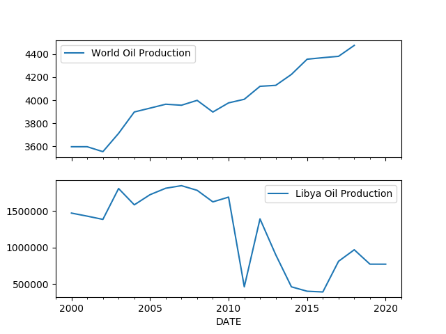
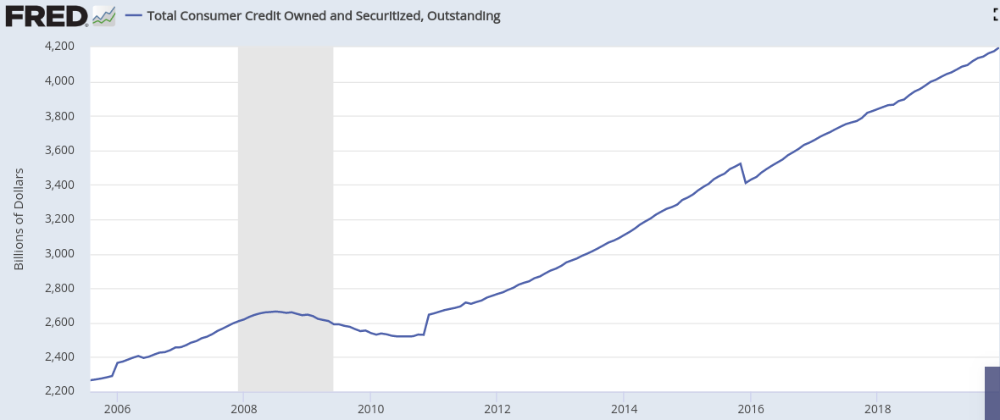

# Week 7

I feel sorry for serious people who come here having to read politics
next to a comment about an ass crack 🤷‍♂️

---

<blockquote class="twitter-tweet"><p lang="en" dir="ltr">Bernie lands coveted &quot;the former CEO of Goldman Sachs is nervous&quot; endorsement <a href="https://t.co/j81UibEdpe">https://t.co/j81UibEdpe</a></p>&mdash; JP (@jpbrammer) <a href="https://twitter.com/jpbrammer/status/1227457817201848320?ref_src=twsrc%5Etfw">February 12, 2020</a></blockquote> <script async src="https://platform.twitter.com/widgets.js" charset="utf-8"></script>

---


Bernie isnt a pacifist. BTW, neither was FDR. He fought the WW2 bitch!
He even let Pearl Harbor happen so US could get into the war!

---

"@Sulliedsubjects

When I was 16 I was running home after getting off the subway cause I
was late for curfew. A group of cops stopped me, threw me against the
wall so hard that it bruised my face. Made fun of me for being poor
when they saw my shitty wallet. Not first or last time \#MyBloombergStory"

---


<blockquote class="twitter-tweet"><p lang="en" dir="ltr">&quot;South Korea is building 3 hydrogen-powered cities for 2022&quot;<a href="https://twitter.com/hashtag/hydrogen?src=hash&amp;ref_src=twsrc%5Etfw">#hydrogen</a><a href="https://twitter.com/hashtag/cleanenergy?src=hash&amp;ref_src=twsrc%5Etfw">#cleanenergy</a><br> <a href="https://t.co/Bb7QocpMKd">https://t.co/Bb7QocpMKd</a></p>&mdash; Hydrogen Energy (@EnergyHy2) <a href="https://twitter.com/EnergyHy2/status/1228548113335451650?ref_src=twsrc%5Etfw">February 15, 2020</a></blockquote> <script async src="https://platform.twitter.com/widgets.js" charset="utf-8"></script>

---

I am tired of hearing abt mainland Chink

Decouple already

---

Meme means 'tits' in tigger

---

<blockquote class="twitter-tweet"><p lang="en" dir="ltr">So dirty Chinese money was laundered through one Ponzi into another. Got it. <a href="https://twitter.com/search?q=%24TSLAQ&amp;src=ctag&amp;ref_src=twsrc%5Etfw">$TSLAQ</a> <a href="https://t.co/Pupqo8xcDJ">pic.twitter.com/Pupqo8xcDJ</a></p>&mdash; TeslaCharts (@TESLAcharts) <a href="https://twitter.com/TESLAcharts/status/1228423418820911104?ref_src=twsrc%5Etfw">February 14, 2020</a></blockquote> <script async src="https://platform.twitter.com/widgets.js" charset="utf-8"></script>

---

<blockquote class="twitter-tweet"><p lang="en" dir="ltr">All of these headlines are going to make great flashback images when the miniseries is made. &quot;Hindsight 2020&quot;</p>&mdash; Jin SEO (@JTSEO9) <a href="https://twitter.com/JTSEO9/status/1228405116392345602?ref_src=twsrc%5Etfw">February 14, 2020</a></blockquote> <script async src="https://platform.twitter.com/widgets.js" charset="utf-8"></script>

---

"@CNBC

White House considering tax incentive for more Americans
to buy stocks, sources say"

---

"@mikarv

A surprisingly significant part of my job as an lecturer in a law
school is undoing the damage done by airheaded blockchain marketers &
shockingly naive practitioners/academics to law students.

Blockchain is not a useful general purpose technology"

---

"@CBSNews

A black man reported racial discrimination to his boss. Then his boss
asked the police to arrest him"

[Link](https://cbsn.ws/2SoiSLq)

---

<blockquote class="twitter-tweet"><p lang="en" dir="ltr">This race has come down to <a href="https://twitter.com/hashtag/Bernie?src=hash&amp;ref_src=twsrc%5Etfw">#Bernie</a> vs. the billionaires.<br><br>The people vs. the 1%. <a href="https://t.co/nLHA1FxEyQ">https://t.co/nLHA1FxEyQ</a></p>&mdash; Peter Daou (@peterdaou) <a href="https://twitter.com/peterdaou/status/1228112403528912897?ref_src=twsrc%5Etfw">February 14, 2020</a></blockquote> <script async src="https://platform.twitter.com/widgets.js" charset="utf-8"></script>

---

\#afganistan \#chrisRock

[Link](https://youtu.be/bST58qV_rlI?t=143)

---

<blockquote class="twitter-tweet"><p lang="en" dir="ltr">&quot;WHO Advisor Says Coronavirus May Infect Over 5 Billion People&quot; - market doesn&#39;t care<br><br>&quot;*FED CUTS SIZE OF O/N REPO OPS., PLANS SMALLER TERM OPS&quot; - SELLLLLLL</p>&mdash; StockCats (@StockCats) <a href="https://twitter.com/StockCats/status/1228047966759538688?ref_src=twsrc%5Etfw">February 13, 2020</a></blockquote> <script async src="https://platform.twitter.com/widgets.js" charset="utf-8"></script>

---

Some say "Boutee-Cheech"...? I am confused - howd u pronounce this
f-ing guy's name?

---

No. Rituals don't create culture. Culture has to do with codes,
embedded in emotional brain which are transmitted through osmosis, and
they effect *decisions*. Putting a funky hat on, playing with some
beads, mumbling some nonsense is not culture.

"Does religion matter for subcultures?

---

Exactly - where you are born matters. She is French. People who tell
her otherwise need to shut the fonk up, and she should remind them of
that.

Parents - stop telling children abt their "home country". They ain't
you, they'll never be you. You made that decision for them when you
moved your punk ass to where you are now from your (very likely)
shithole country. They won't belong to your original homeland just for
the virtue of being your children.

[Link](https://youtu.be/ttBWXH-ihL0)

---

<blockquote class="twitter-tweet"><p lang="en" dir="ltr">Green <a href="https://twitter.com/hashtag/hydrogen?src=hash&amp;ref_src=twsrc%5Etfw">#hydrogen</a> is gaining political &amp; business momentum, &amp; w/ lower costs will come the markets: vehicle fuel cells, conversion to powerfuels, utilising the spare capacity of renewables &amp; replacing gas. <a href="https://twitter.com/Energy_Post?ref_src=twsrc%5Etfw">@Energy_Post</a> explains <a href="https://t.co/lvcwhhXjXI">https://t.co/lvcwhhXjXI</a> <a href="https://twitter.com/hashtag/ItsPossible?src=hash&amp;ref_src=twsrc%5Etfw">#ItsPossible</a></p>&mdash; IRENA (@IRENA) <a href="https://twitter.com/IRENA/status/1228222341798416384?ref_src=twsrc%5Etfw">February 14, 2020</a></blockquote> <script async src="https://platform.twitter.com/widgets.js" charset="utf-8"></script>

---

No. Are u kidding me? You don't want these people running around
scared, half-cocked, doing more dumbass shite. I am more supportive of
the alliance than ever. 

"If US 'allies' did 9/11 should US end its alliance with them"

---

Geeky. I dig it. 🤓👨‍💻👨‍💻👍

<blockquote class="twitter-tweet"><p lang="en" dir="ltr">God gave us Earth and the exponential families and is now watching us destroy the planet by fitting VAEs</p>&mdash; Aaron Schein (@AaronSchein) <a href="https://twitter.com/AaronSchein/status/1228037668677849090?ref_src=twsrc%5Etfw">February 13, 2020</a></blockquote> <script async src="https://platform.twitter.com/widgets.js" charset="utf-8"></script>

---

When Libya production went down, who made up the shortfall? Who
benefited?  Corr analysis to the rescue. Oil production as time series
for multiple countries, get corr matrix (it gives corr of everything
against everything else, incredibly useful), find who has the highest
neg value against Libya.


```python
from pandas_datareader import data
import quandl, datetime
today = datetime.datetime.now()
start=datetime.datetime(1992, 1, 1)
end=datetime.datetime(today.year, today.month, today.day)
cols = ['IPG211111CS','ARENGDPMOMBD','SAUNGDPMOMBD','IRNNGDPMOMBD','QATNGDPMOMBD','KWTNGDPMOMBD','IRQNGDPMOMBD','LBYNGDPMOMBD']
df = data.DataReader(cols, 'fred', start, end)
df = df.dropna()
df.columns = ['us','uae','sa','iran','qatar','kuw','iraq','libya']

import pandas as pd
pd.set_option('display.max_columns', 10)
pd.set_option('precision', 2)
df.corr()
```

```text
Out[1]: 
         us   uae    sa  iran  qatar   kuw  iraq  libya
us     1.00  0.79  0.65 -0.60  -0.85  0.47  0.89  -0.73
uae    0.79  1.00  0.94 -0.41  -0.53  0.88  0.85  -0.66
sa     0.65  0.94  1.00 -0.28  -0.44  0.93  0.74  -0.62
iran  -0.60 -0.41 -0.28  1.00   0.50 -0.35 -0.45   0.57
qatar -0.85 -0.53 -0.44  0.50   1.00 -0.20 -0.75   0.71
kuw    0.47  0.88  0.93 -0.35  -0.20  1.00  0.60  -0.53
iraq   0.89  0.85  0.74 -0.45  -0.75  0.60  1.00  -0.77
libya -0.73 -0.66 -0.62  0.57   0.71 -0.53 -0.77   1.00
```

US and Iraq (now tied to US I guess) benefited. So wanna help Iraq,
wanna help yourself?  Knock out Libya, you sell more of your product.

---

Below is oil production data for the world and Libya. Since 2011
Libyan civil war their production was hammered, but world production
went upwards, unscatched. Clearly someone picked up the slack and that
someone benefited.

When it comes to oil chicanery, "taking the oil" may not be the only
game in town. "Denying the oil to someone else", "crippling oil
production somewhere so somewhere else can produce more" are probably
all in the playbook.


```python
from pandas_datareader import data
import quandl, datetime
today = datetime.datetime.now()
start=datetime.datetime(1992, 1, 1)
end=datetime.datetime(today.year, today.month, today.day)
df1 = quandl.get("BP/OIL_PROD_WRLD-Oil-Production-Total-World", 
                returns="pandas",authtoken=open(".quandl").read())
		
df1 = df1[df1.index > '2000-01-01']
df1.columns = ['World Oil Production']
df2 = data.DataReader(['LBYNGDPMOMBD'], 'fred', start, end)
df2.columns = ['Libya Oil Production']
fig, axs = plt.subplots(2,sharex=True)
df1.plot(ax=axs[0])
df2.plot(ax=axs[1])
plt.savefig('oil-world-libya.png')
```



---

I see.. good behind-the-scenes ppl shuffling skillz, knock out that
piece, freeze that guy, etc. Good capability on ad targeting, and of
course, unlimited war chest.

Still no guarantee though all that will work against Trump. DJT showed
an ability to bypass usual channels and reach people. The contrast
angle doesn't work either. Two uber-rich people, both from Manhattan. 

---

"@ryangrim

Earlier this year, Democrats lost a state House special election by 79
votes. The campaign was without a manager for the final 3 weeks.

Why? Bloomberg had hired him and sent him to Wisconsin. This is an
epidemic"

---

Yes, US was born between two waves.

"James Watt patented his steam engine on the eve of the American
Revolution, consummating a relationship between coal and the new
Promethean spirit of the age, and humanity made its first tentative
steps into an industrial way of life that would, over the next two
centuries, forever change the world"

\#rifkin \#h2book

---

Peak capitalism

<blockquote class="twitter-tweet"><p lang="en" dir="ltr">Democracy: When two billionaires mock each other as each seeks control of the most powerful government on earth. <a href="https://t.co/RMWUursbvS">https://t.co/RMWUursbvS</a></p>&mdash; Zach Carter (@zachdcarter) <a href="https://twitter.com/zachdcarter/status/1227957764388982785?ref_src=twsrc%5Etfw">February 13, 2020</a></blockquote> <script async src="https://platform.twitter.com/widgets.js" charset="utf-8"></script>


---

👍 👍 👍

"@ThierryLepercq_

Germany wants to import massive amounts of green hydrogen from Africa!"

---

Partially watched debate among 4 prospective Labour leaders three
ladies and a bloke. Bloke is an idiot, can't close. The *hausfrau*
wont do. The other lady has no presence, has that OMG face, like they
are discussing the most regular topic camera shows her face it says
OMG. OMG! 🙀 She has no chance in the general. So my pick: Rebecca
Long-Bailey.  She comes across more of a closer - talked about need of
of clear message, is already in Corb shadow cab?

---

"@MattBinder

Mike Bloomberg wanted to fingerprint more than 600,000 nyc public
housing residents to, according to him, prove they actually lived
there"

---

I think you ruined it on your own just fine last time, buster

"Lloyd Blankfein Says Bernie Sanders Would ‘Ruin Our Economy"

---

<blockquote class="twitter-tweet"><p lang="en" dir="ltr">So what will <a href="https://twitter.com/hashtag/Bernie?src=hash&amp;ref_src=twsrc%5Etfw">#Bernie</a> do after his massive defeat in the <a href="https://twitter.com/hashtag/NHprimary2020?src=hash&amp;ref_src=twsrc%5Etfw">#NHprimary2020</a>?<br><br>I mean, he lost by winning more votes than any other candidate.<br><br>And nobody likes him except the millions of people who support him.<br><br>And the BIG story is the 2nd and 3rd place &quot;winners.&quot;</p>&mdash; Peter Daou (@peterdaou) <a href="https://twitter.com/peterdaou/status/1227609452431511552?ref_src=twsrc%5Etfw">February 12, 2020</a></blockquote> <script async src="https://platform.twitter.com/widgets.js" charset="utf-8"></script>

---

<blockquote class="twitter-tweet"><p lang="en" dir="ltr">Energy Observer Next Destinations--In 2020, the first <a href="https://twitter.com/hashtag/hydrogen?src=hash&amp;ref_src=twsrc%5Etfw">#hydrogen</a> <a href="https://twitter.com/hashtag/fuelcell?src=hash&amp;ref_src=twsrc%5Etfw">#fuelcell</a>-powered vessel to be self-sufficient in energy is set to complete the longest offshore crossings in her history. Tokyo Olympic Games &amp; California--<a href="https://t.co/MAnMwCaK4X">https://t.co/MAnMwCaK4X</a> <a href="https://twitter.com/hashtag/hydrogennow?src=hash&amp;ref_src=twsrc%5Etfw">#hydrogennow</a> <a href="https://twitter.com/hashtag/zeroemissions?src=hash&amp;ref_src=twsrc%5Etfw">#zeroemissions</a> <a href="https://t.co/oERxCQvHZl">pic.twitter.com/oERxCQvHZl</a></p>&mdash; FuelCellsWorks (@fuelcellsworks) <a href="https://twitter.com/fuelcellsworks/status/1227630134171176961?ref_src=twsrc%5Etfw">February 12, 2020</a></blockquote> <script async src="https://platform.twitter.com/widgets.js" charset="utf-8"></script>

---

Taibbi: "For Sanders supporters, the calculation has always been
simpler. Are you bought off, or not? Just by keeping to the right side
of that one principle, Sanders will [.. fingers crosssed] keep
grinding toward victory"

[Link](https://www.rollingstone.com/politics/political-commentary/bernie-sanders-new-hampshire-2020-democratic-primary-2016-trump-951614)

---

This is the famous H2 boat. 

Fantastic 🏋️‍♀️⛹️‍♀️🏊‍♀️🏂🏇🤺

"@energy_observer

🙏We've been selected to carry the Olympic flame"

---

A side effect to the such is public sphere overcrowding with drama
queens. Lowest hanging fruit, one-step solutions are tried
already. The remaining ones are moronic and intractable, so it takes a
lot of energy and drama to mobilize towards them. Then there is drama
afterwards when things invariably fail because the direction was dumb
in the first place.

All that could be avoided with a little foresight. Not much, just a
little.

---

Most of the stuff I advocate is nothing special - but I try to take
two steps instead of one.

Taking one step from the established understanding of QM takes you to
all the chaos we see on TV, ppl running around confused, going back,
forward in time, space. If we take one step in Einstein's direction,
then take another towards QM as approximation, the rest makes more
sense.

Or popular view on energy says 'I have batteries on laptop duuude,
wanna put it in my car'. Better is generate clean fuel (step 1), then
next step put it in the car (step 2). Two very simple steps, that
require some upfront investment sure, but doable.

We are stuck, on a lot of fronts. I don't think a single one step, as
"courageous" it might seem, will provide any more Earth shattering
solutions. No more superhero-ish, cult leaders. Just boring, able
people trying to lay groundwork for two steps ahead.

---

"@lmogendragons

this has genuinely fucked me up i keep laughing"


---

Boy did subgradients, subdifferentials took over the field of
optimization. Last time I was studying opt there was no such thing

---

I am learning Bernie's accent now.

Cuafee

Novembah

[Link](https://youtu.be/waeXBCUkuL8?t=105)

---

I want one

"@jwz

Why a rotary cellphone? Because in a finicky, annoying, touchscreen
world of hyperconnected people using phones they have no control over
or understanding of, I wanted something that would be entirely mine,
personal, and absolutely tactile, while also giving me an excuse for
not texting"


---


---


---


---


---


---


---


BERNIE WINS NEW HAMPSHIRE


---

BEVs have a demand problem - and they'll always have a demand
problem. The tech is moronic.

---

From US Energy department [energy.gov](https://afdc.energy.gov/laws/350)

"A tax credit of up to $8,000 is available for the purchase of qualified light-duty fuel cell vehicles, depending on the vehicle's fuel economy"

There doesnt seem to be any limits on how many cars are supported.

The proposed
[bill](https://www.greencarcongress.com/2019/04/20190411-bill.html)
Drive America Forward act is looking to extend the HFC credit for
another 10 years. The BEV part is seperate..? 


---

<blockquote class="twitter-tweet"><p lang="en" dir="ltr">Trump&#39;s proposed budget completely repeals the $7500 EV tax credit. That&#39;s a &quot;negotiating stake in the ground&quot; that won&#39;t happen, but it GUARANTEES he won&#39;t approve the $7000 *extension* the Dems are trying to push through for <a href="https://twitter.com/search?q=%24TSLA&amp;src=ctag&amp;ref_src=twsrc%5Etfw">$TSLA</a> and <a href="https://twitter.com/search?q=%24GM&amp;src=ctag&amp;ref_src=twsrc%5Etfw">$GM</a>.<br><br>Worst of both worlds for Tesla.</p>&mdash; Mark B. Spiegel (@markbspiegel) <a href="https://twitter.com/markbspiegel/status/1227222604223827968?ref_src=twsrc%5Etfw">February 11, 2020</a></blockquote> <script async src="https://platform.twitter.com/widgets.js" charset="utf-8"></script>

---

"Throw'em up against the wall"

\#bloom 

[Link](https://youtu.be/1bbjB3jVGRU?t=2540)

---

It's true.. there's been immense productivity increases.. but most of
it went to Walmart, along with the spoils. Overconcentration screwed
people in more ways than one.

---

"@scientificecon

Keynes was right that the enormous wealth created by the productivity
improvements he correctly predicted would free people from work. He
just couldn't imagine how FEW people would be freed, while keeping the
99.9% under pressure to continue work - unnecessarily as his figs show"

---

Not a good idea to be a libertard goldcuck. They  will have a lot of deflation.

---

"@PekalaLaw

Hey, all you crazy conspiracy theorists who claimed Apple was slowing
down old phones...

Apple fined $27Million.

For slowing down old phones.

A whole $27Million.

Apple is worth 1.3 Trillion...

'Apple Fined €25 Million in France Over Slowed iPhones'"

---

Did not know LeBron could act. He was hilarious in fact. Haider did
good too, in *Trainwreck*.

---

This tech is moronic.. Straight up. Almost nothing else compares. Hula
Chair, Fake Ponytails, or Clippy may come close, but still not this
dumb.

<blockquote class="twitter-tweet"><p lang="en" dir="ltr">If you thought smoking at a gas pump was dangerous.... <a href="https://t.co/CyV5KVA7vt">pic.twitter.com/CyV5KVA7vt</a></p>&mdash; Point E. Elbo (@ElboNeverDies) <a href="https://twitter.com/ElboNeverDies/status/1226992821984546816?ref_src=twsrc%5Etfw">February 10, 2020</a></blockquote> <script async src="https://platform.twitter.com/widgets.js" charset="utf-8"></script>

---

<blockquote class="twitter-tweet" data-conversation="none"><p lang="und" dir="ltr"><a href="https://t.co/LvGuaXOYjm">https://t.co/LvGuaXOYjm</a></p>&mdash; A. Weigmann (@AWeigmannn) <a href="https://twitter.com/AWeigmannn/status/1227114847432855552?ref_src=twsrc%5Etfw">February 11, 2020</a></blockquote> <script async src="https://platform.twitter.com/widgets.js" charset="utf-8"></script>

---

Exactly.

\#israel \#palestine \#oneStateSolution

[Link](https://youtu.be/9gTJgfzhdZw?t=283)

---

Credit card debt nearly doubled since the 08 crisis. Now it is over 4
__trillion__. Did ppl's income double? No. 

That is 13K $ debt per person - man, woman, and child, where most ppl
cannot come up with $500 for an emergency. The interest rate on this
debt is not favorable - per @RaoulGMI. So it cannot be paid. Someone
will burn. In a post 08 world, I dont think it will be ordinary people
this time.



---

"Life is a tragedy for the poor and a comedy for the rich.” -- Aleichem

---

Some tough guy - [Link](https://on.wsj.com/37bVaq9)

---

"The budget Trump unveiled today proposed slashing Medicaid—health
coverage primarily for low-income and disabled Americans. [In a 2015
[tweet](https://www.prwatch.org/files/images/trump-no-cuts-ss-tweet-600px_0.jpg)] Trump pledges that there will be no cuts to Medicaid"

[Link](https://twitter.com/brianklaas/status/1226982822512074754)

---

<blockquote class="twitter-tweet"><p lang="en" dir="ltr">“I can’t wait to hear all your inspirational speeches about equality, and it’s great that the 3 hours you’re here tonight is the only time your badly paid migrant house staff will get some time off to sleep this week” <a href="https://t.co/fsFbdDkv6u">https://t.co/fsFbdDkv6u</a></p>&mdash; Ricky Gervais (@rickygervais) <a href="https://twitter.com/rickygervais/status/1226524684734410753?ref_src=twsrc%5Etfw">February 9, 2020</a></blockquote> <script async src="https://platform.twitter.com/widgets.js" charset="utf-8"></script>

---

Corporate comedians.

<blockquote class="twitter-tweet"><p lang="en" dir="ltr">A comedians job is to speak truth to the powerless. It is to look at the injustices in our society head on and ignore them It is asking someone with no insurance if they will vote blue no matter who. It is to defend the editor of Mother Jones at all costs. This is why we do this</p>&mdash; David Spector (@spectordeforce) <a href="https://twitter.com/spectordeforce/status/1226673603426516992?ref_src=twsrc%5Etfw">February 10, 2020</a></blockquote> <script async src="https://platform.twitter.com/widgets.js" charset="utf-8"></script>

---

Can someone put together an ad budget and push informative H2 ads to
all politicians in the world?

---

Bitcoin, waste of energy, too much computation

Deep Shit, too much computation

Post 1973 physics / QM, "shut up and compute" era - too much computation

Lack of theory, use of creative brain, slick modeling seems to be the
common theme here

<blockquote class="twitter-tweet"><p lang="en" dir="ltr">Always suspected deep learning had a big carbon footprint but WOW <a href="https://t.co/sSiNQT0kIb">https://t.co/sSiNQT0kIb</a></p>&mdash; David Watson (@ds_wats0n) <a href="https://twitter.com/ds_wats0n/status/1142168140547317761?ref_src=twsrc%5Etfw">June 21, 2019</a></blockquote> <script async src="https://platform.twitter.com/widgets.js" charset="utf-8"></script>

---

“We speak of machines that think, learn, and infer. The name of the
discipline itself—artificial intelligence—practically dares us to
compare our human modes of reasoning with the behavior of
algorithms. Such rhetoric is at best misleading and at worst downright
dangerous.”

[Link](https://link.springer.com/article/10.1007/s11023-019-09506-6)

---

"@SenSanders

I don't hear bankers complain about 'big government' when taxpayers
hand them a trillion-dollar bailout.

I don't see drug companies grumble when 'big government' gives them
patent monopolies to charge sky-high prices.

I don't know who's more corrupt: Wall Street or Big Pharma"

---

"@SenSanders

Corporations have dumped toxic 'forever chemicals' into our
environment. It's now in 43 cities' water supplies.

My bill forces these companies to pay for the cleanup.

Maybe I'm 'radical,' but I think the water in our taps must be free of
toxic chemicals"

---

Mmm good shit. It's basically bunch of pistacio, almonds and dried
fruits held together by honey and fat. Doesn't feel too processed. I
think I've found _da_ bar.

Honey is great - they say it has healing effects.


[Link](https://www.tadim.com/urun/karisik-kuruyemis-bar/317)

---

Sean Carroll.. what a jerkoff. This guy is everywhere trying to sell
his shit, I guess attempting to do through popular media what he can't
do in theoretical science. His particular slant is perfect for movies,
would come across pleasing to drugged-up guru seeking sponge brains.

---

Instead of looking for f-ing universes in multiples, wouldn't it be
better to build upon "space-as-an-illusion" idea - a route already
hinted at by Einstein who showed space-time can bend? Take the next
step, show space is not primary but emergent, and show QM falls out of
this as an approximation.

But no, let's make a struggling actor's job harder.. Now not only do
they have to play the hero, but also the evil twin, in the same
episode from a different universe. This is exploitation. They are now
working double time, the goatee itches, and there is always that
annoying draft up the crack of your ass thanks to the leather pant
with the butt cut-out; an indispensible part of the evil twin
visual.

---

Right - if space is emergent, an illusion, that solves nonlocality of
entanglement. There is no "spooky action at a distance" because there
is no distance.

Smolin: "If locality is not absolute, if it is the contingent result
of dynamics, it will have defects and exceptions. And indeed, this
appears to be the case: how else are we to understand quantum
nonlocality, particularly nonlocal entanglement? These, I would
hypothesize, are remnants of the spaceless relations inherent in the
primordial stage, before space emerges"

---

Smolin: "I drew a lesson from a survey of approaches to quantum
foundations, which is that space and time cannot both be
fundamental. Only one can be present at the deepest level of
understanding; the other must be emergent and contingent. This seems
ultimately to be forced on us by the nonlocality of entanglement,
which leads to a tension between realist approaches to quantum
mechanics and special relativity. The latter unifies space and time
into spacetime, which the experimental tests of Bell’s restriction
suggest is transcended in individual quantum processes. I would then
like to suggest that the tension is resolved by making one of the pair
space/time fundamental, while the other is an emergent and approximate
description, ultimately a kind of illusion. For many reasons, some
described here, some the subject of earlier books,1 I choose to focus
on the hypothesis that time is fundamental, while space is emergent."

---

<blockquote class="twitter-tweet"><p lang="en" dir="ltr">Sport of Kings. <a href="https://t.co/kvlQQg1s8k">pic.twitter.com/kvlQQg1s8k</a></p>&mdash; Count Binface (@CountBinface) <a href="https://twitter.com/CountBinface/status/1226797543033581580?ref_src=twsrc%5Etfw">February 10, 2020</a></blockquote> <script async src="https://platform.twitter.com/widgets.js" charset="utf-8"></script>

---

Interesting... I'd say let the fossil mofos live a little, but all
that flaring biz in Texas was truly infuriating. If methane leaks,
flaring, and other side effects can be regulated, then blue.

One good thing with blue would be enticing Russians to switch over to
it, but they also have sunlight don't they? And an obscene amount of
landmass.

If not, hammer time. Green Blitzkrieg.

"A split has emerged within the German cabinet as to whether its
forthcoming national hydrogen strategy should exclusively support
green hydrogen produced from renewable energy or include so-called
'blue hydrogen' produced from fossil fuels with the carbon captured
and stored."

[Link](https://rechargenews.com/transition/merkel-cabinet-split-on-green-vs-blue-hydrogen-dilemma/2-1-753114)

---

"@EverfuelEU

Everfuel joins forces with Toyota, Hyundai, @Statkraft and
@VatgasSverige in EU-supported initiative to explore #hydrogen road
transport in Sweden"

[Link](https://twitter.com/EverfuelEU/status/1226762066167566336)

---


"@AWeigmannn

@PowercellA  has delivered a MS-30 fuel cell system to the Italian ship building company Fincantieri. Fincantieri S.p.A is .. Europe’s largest and the world’s fourth largest ship builder"

---

I liked *Passangers* (there was another "outrage" around it, which I
ignored). JL was lovely, Pratt did great.

---

Great. Now let's add the automagic-money-creation-per-user,
digital-basic-income feature so money base expands, everyone has money
for basics, we can then have the digital currency of the future.

Nano on
[Wikipedia](https://en.wikipedia.org/wiki/Nano_\(cryptocurrency\)):
"Nano is a decentralized, open-source, peer-to-peer cryptocurrency
released under the FreeBSD License. It facilitates feeless and
fast-settling transactions without intermediaries by utilizing a
distributed ledger. Nano’s goal is to address the scalability
limitations of Bitcoin, which can result in restrictive fees and
increased transaction confirmation times when under load. Unlike other
cryptocurrencies, Nano does not rely on mining or transaction fees,
and transactions typically confirm in 0.25-10 seconds.

The Nano protocol functions by employing a block-lattice data
structure, a unique implementation of a Directed Acyclic Graph (DAG),
in addition to a voting-based consensus algorithm called Open
Representative Voting. Accounts on the Nano network each have their
own blockchain, which enables transactions to be quickly processed
asynchronously. The transactions are then voted on by user-selected
representative nodes before being immutably confirmed"

---


---

"China rejects Foxconn's request to resume production in key Shenzhen
plant"

---

Wikipedia's "Download as PDF" feature is awesome. Better than going
through browser's print as pdf option - internally WP aligns
everything, PDF looks better 👍🍺

---

\#ronnieChang

[Link](https://youtu.be/O_KpLrHCAx0)

---

Bloomberg will have trouble with the black vote

\#tbtv

[Link](https://youtu.be/dR506mz19q0?t=759)

---

"@infinergia

"\#FuelCell @BallardPwr aims 70-80% Price Drop as Production Volume
Scales. Automation & design optimisation as strategic leverage"

[Link](https://mobile.twitter.com/infinergia/status/1226581231707607045)

---

<blockquote class="twitter-tweet" data-conversation="none"><p lang="en" dir="ltr">No matter how Turkey chooses to use military force, it won’t end on favorable terms.</p>&mdash; Aaron Stein (@aaronstein1) <a href="https://twitter.com/aaronstein1/status/1226580510102769669?ref_src=twsrc%5Etfw">February 9, 2020</a></blockquote> <script async src="https://platform.twitter.com/widgets.js" charset="utf-8"></script>

---

Looking at just this poll, seems like there is overlap btw Booty and
Biden voters. Booty took a big bite out of that Biden cake. Now the JB
attack video makes sense. He lost voters to Mayo.

"@PpollingNumbers

\#NH YouGov/CBS Poll
(Change from Jan 3)

Sanders 29% (+2)

Buttigieg 25% (+12)

Warren 17% (-1)

Biden 12% (-13)"

---

CCP performs population control?

Scenario: China's place as the world's cheap labor is coming to an
end. How can CH feed >1 billion people with less to export? No food ->
revolt.

Solution: Less people less problems. Enter WuFlu.

---

Did NAFTA cause Mex immigration increase to US? Analysis below says
no. Looked at immig annual increase averages - before and after
NAFTA. I don't see an increase.

```python
import pandas as pd
df = pd.DataFrame(index=np.arange(1910,2010))
df['immig'] = pd.read_csv('mex.csv',index_col=0).immig
df = df.interpolate()
chg = df.pct_change()
print (np.round(np.float(chg[df.index <= 1993].mean()),2))
print (np.round(np.float(chg[df.index >  1993].mean()),2))
```

```text
0.04
0.03
```

[Link](https://www.migrationpolicy.org/programs/data-hub/charts/mexican-born-population-over-time?width=900&height=850&iframe=true)

---

The late leftist Congressman Patman on corrupt financiers: “They only
believe in law and order if they write the law and give the order”

---

<iframe width="281" height="158" src="https://www.youtube.com/embed/tih4Qd38Y98" frameborder="0" allow="accelerometer; autoplay; encrypted-media; gyroscope; picture-in-picture" allowfullscreen></iframe>

---

Effective ad. 

[Link](https://mobile.twitter.com/JoeBiden/status/1226189752598171648)

---

"Wall Street Pete". Ouch

<blockquote class="twitter-tweet"><p lang="en" dir="ltr">Chants of <a href="https://twitter.com/hashtag/WallStreetPete?src=hash&amp;ref_src=twsrc%5Etfw">#WallStreetPete</a> drown out <a href="https://twitter.com/hashtag/Buttigieg?src=hash&amp;ref_src=twsrc%5Etfw">#Buttigieg</a> when he takes a shot at <a href="https://twitter.com/hashtag/Bernie?src=hash&amp;ref_src=twsrc%5Etfw">#Bernie</a>&#39;s grassroots movement.<a href="https://t.co/UJ2gCcEnys">pic.twitter.com/UJ2gCcEnys</a></p>&mdash; Peter Daou (@peterdaou) <a href="https://twitter.com/peterdaou/status/1226494859474808833?ref_src=twsrc%5Etfw">February 9, 2020</a></blockquote> <script async src="https://platform.twitter.com/widgets.js" charset="utf-8"></script>

---

Hey this is very good. An Iranian uni was part of it too. Ditch that
f-ing oil, scale and switch to this thing.

"The potential of the algae-bacteria combination has been proven and
opens the doors to its being used in industry since the sugar added
for bacteria fermentation in the lab can be transferred to waste in
the real world. In other words, the relationship between algae and
bacteria could use industrial waste and dirty water to produce
hydrogen"

[Link](https://twitter.com/EnergyHy2/status/1226410464046977024)

---

