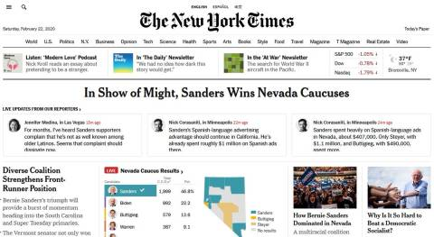
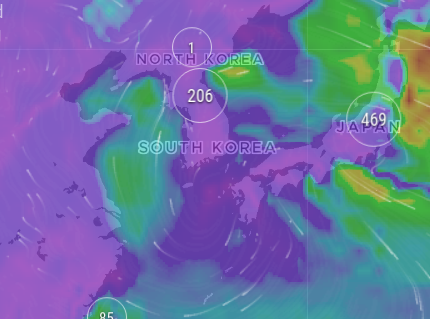

# Week 8

BERNIE WINS NEVADA


---



---

"Biden revived his campaign"? He did terrible. Took only half the
votes as Bernie.

---

.. most of which are useless industrial institutions anyway. Maybe
this is how second wave ends - death-by-flu.

"@Trumpery45

The new flu has an affinity for institutions. Prisons, hospitals, army
groups, churches .."

---

Mmm why r u giving Reps something to talk abt during the general?
Undercutting the Bern?

"@WaysMeansCmte

The Ways and Means Committee passed bipartisan legislation to protect
patients, improve transparency, and end surprise medical billing"

---

"@BNODesk

Dr. Brett Sutton, chief health officer in Australia's Victoria: 'It's
clear that with local transmission in several countries that a
pandemic is very likely, if not inevitable'"

---

Not bad either..


[Link](https://www.veganbakkal.com.tr/product/ketogenic-low-sugar-kuru-yemis-bari-40g-rawmygod/)

---

First CH corona numbers were fake

[Link](https://youtu.be/3kz54wBKi2c)

---

😆😆😆 4-D tavla 

(tavla = backgammon)

<blockquote class="twitter-tweet"><p lang="et" dir="ltr">Playing 4-D tavla</p>&mdash; Loukas Christodoulou (@Loukas_RS) <a href="https://twitter.com/Loukas_RS/status/1230509825651617793?ref_src=twsrc%5Etfw">February 20, 2020</a></blockquote> <script async src="https://platform.twitter.com/widgets.js" charset="utf-8"></script>


---

I am feelin good abt it

"@PpollingNumbers

\#NevadaCaucus Statewide Delegates (2.3% In):

Sanders 347  (54.96%)

Biden 129 (20.98%)
  
Warren 48 (7.80%)
   
Steyer 60 (9.76%)

Buttigieg 32 (5.13%)  
 
Klobuchar 8  (1.28%)"

---

NEVADA.

Who will eat it?


---

Plotting the corona virus map based on latest data

[Link](https://muratk3n.github.io/thirdwave/en/2020/02/corona.html)

---

The Eurodollar contract points to low rate expectation as far as the
eye can see (100-[value below] = rate).

```
MAR 2020 98.3575
APR 2020 98.41
MAY 2020 98.475
JUN 2020 98.53
JUL 2020 98.565
```

[Link](https://www.cmegroup.com/trading/interest-rates/stir/eurodollar.html)

---

"@Jkylebass

A Chinese soccer team from Shanghai traveled to Tokyo and then to Los
Angeles THIS PAST MONDAY. They weren’t quarantined or tested for the
Wuhan coronavirus. They walked the airport for hours before they left
for Brazil. How did this happen?! AA flt staff very upset"

---

"@peterdaou

EVERY anti-Bernie argument

I made it times ten.

EVERY feeling of defiance toward his online defenders

I felt it times ten.

EVERY bit of #Bernie vetting

I did it times ten.

EVERY reason to criticize him

I found times ten

.......

AND THEN I CHANGED MY MIND.

You can too"

---

"@aaronstein1

[US] should not be cheerleading a potential [RU-TR] clash in Idlib"

---

"@aaronstein1

Russia is using just enough attributional ambiguity to allow for
Ankara to keep pretending it was the SyAF that killed the TSK
yesterday, and not the RuAF"

---

"@JTSEO9

Campaigns and the media are making the same mistake they made with
Trump.  During 2016 we had to hear 'ceiling of support' 'core base of
deplorables', etc.  It's a mistake to assume Democrat voters would
shift to Bloomberg/Buttplug with less candidates"

---

If I use the word so-called before quoted text am I negating the
effect of the quotation marks? Like - 'so-called "potato"'. Now did I
remove the sarcasm and just say potato?

I am having deep thoughts on the issue.. 

🤨🤔🤔

---

<blockquote class="twitter-tweet"><p lang="en" dir="ltr">I welcome the hatred of the crooks who destroyed our economy. <a href="https://t.co/aZcdCFpeqt">https://t.co/aZcdCFpeqt</a></p>&mdash; Bernie Sanders (@BernieSanders) <a href="https://twitter.com/BernieSanders/status/1230922583580823552?ref_src=twsrc%5Etfw">February 21, 2020</a></blockquote> <script async src="https://platform.twitter.com/widgets.js" charset="utf-8"></script>

---

The replies are awesome too 👇

<blockquote class="twitter-tweet"><p lang="en" dir="ltr">The freewheeling SotA-or-bust move-fast-and-break-things culture worked well for creating and commercializing classifiers to distinguish cats from dogs. But when it&#39;s used to build tools that make consequential decisions about people… it does not compute.</p>&mdash; Arvind Narayanan (@random_walker) <a href="https://twitter.com/random_walker/status/1230145520875843584?ref_src=twsrc%5Etfw">February 19, 2020</a></blockquote> <script async src="https://platform.twitter.com/widgets.js" charset="utf-8"></script>

---

You dont want to be pinned down by that shit. Say whatever I dont
care. As long as he gets the nomination and the Presidency he could
talk about Cat in a Hat, the cookie monster, I dont give a f!$k

"Why does Bernie play along with all that Russia stuff" 

---

"@EFF

Every other country is moving ahead of the United States on lower
prices, gigabit speeds, universality, and fiber infrastructure, and
it's doing so because an expert regulator promoted competition and
access, and prevented monopolization"

[Link](https://twitter.com/EFF/status/1230975991922614273)

---

Political Islam usually degrades into caliphatism as in Ottomuffs,
similar to the centralized, managed Christianity (Catholicism) of Rome
an outgrowth of widespread peasantry and its parasitic mafia - sorry,
empire. The left aspect of religion is quashed. So it makes sense to
keep organized religion at bay, away from state functions.

---

"Keeping track of freight on thousands of railcars along thousands of
miles of track, maintaining rail beds, keeping engines and cars
repaired, overseeing thousands of employees, and ensuring safe passage
required a new kind of organizational model. Economic historian Alfred
Chandler points out that railroads were the first modern business
enterprise to separate ownership from management. No single family
could underwrite the huge capital costs of building a railroad. So, in
the 1850s, European investment houses began financing
U.S. railroads.60 The operation of the railroads was put under the
stewardship of a new class of professional managers. They created the
precursor of the modern corporation, a centralized, hierarchical
command-and-control mechanism made up of critical decision makers at
the top of the pyramid and middle managers at various rungs who were
responsible for specific day-to-day functions of the organization and
accountable to higher-ups for overall guidance"

\#rifkin \#h2book

---

Strength becoming weakness

\#el-arian

[Link](https://youtu.be/849Nrkto-Ak?t=172)

---

"Access to oil became even more important during World War II. Indeed,
the entire strategy of the war revolved around controlling vital oil
supplies...

[Hitler] set [his] sights on a two-pronged approach to securing oil:
first, developing a synthetic-fuel industry at home; and second,
pushing into a war with Russia to secure access to the rich oil fields
at Baku in central Asia"

\#rifkin \#h2book

---

<blockquote class="twitter-tweet"><p lang="en" dir="ltr">Avions Mauboussin Designs a New Hydrogen Propulsion System for Aircraft--The aircraft was designed for the Alérion M1h &amp; the choice of <a href="https://twitter.com/hashtag/hydrogen?src=hash&amp;ref_src=twsrc%5Etfw">#hydrogen</a> will completely eliminate polluting emissions and the use of fossil fuels--<a href="https://t.co/u3AfLxETW8">https://t.co/u3AfLxETW8</a> <a href="https://twitter.com/hashtag/fuelcell?src=hash&amp;ref_src=twsrc%5Etfw">#fuelcell</a> <a href="https://twitter.com/hashtag/hydrogennow?src=hash&amp;ref_src=twsrc%5Etfw">#hydrogennow</a> <a href="https://twitter.com/hashtag/decarbonise?src=hash&amp;ref_src=twsrc%5Etfw">#decarbonise</a> <a href="https://t.co/JIikEZY7sp">pic.twitter.com/JIikEZY7sp</a></p>&mdash; FuelCellsWorks (@fuelcellsworks) <a href="https://twitter.com/fuelcellsworks/status/1230874768896909312?ref_src=twsrc%5Etfw">February 21, 2020</a></blockquote> <script async src="https://platform.twitter.com/widgets.js" charset="utf-8"></script>

---

<blockquote class="twitter-tweet"><p lang="en" dir="ltr">Not surprised at all. “Dark Energy” has always been nonsense. <a href="https://t.co/eFvTEVT8UC">https://t.co/eFvTEVT8UC</a></p>&mdash; Chris Adami (@ChristophAdami) <a href="https://twitter.com/ChristophAdami/status/1214562952474267649?ref_src=twsrc%5Etfw">January 7, 2020</a></blockquote> <script async src="https://platform.twitter.com/widgets.js" charset="utf-8"></script>

---

<blockquote class="twitter-tweet"><p lang="en" dir="ltr">Analysis: A single-payer health care system would save more than 68,000 lives and $450 billion a year, new research shows <a href="https://t.co/AGHlS54sIX">https://t.co/AGHlS54sIX</a></p>&mdash; The Washington Post (@washingtonpost) <a href="https://twitter.com/washingtonpost/status/1230509258044821504?ref_src=twsrc%5Etfw">February 20, 2020</a></blockquote> <script async src="https://platform.twitter.com/widgets.js" charset="utf-8"></script>

---

"@tsuyomiyakawa

My editorial paper entitled, 'No raw data, no science: another
possible source of the reproducibility crisis'. When I feel the
results are too beautiful, I requested raw data before sending it out
for review. 40 out of 41 did not send me the right data...

21 of them were just withdrawn without providing raw data. 19 of them
were rejected due to insufficient raw data ...

I cannot help suspecting that some (or many) of them, from the
beginning, did not have the right raw data that match the results
shown"

[Link](https://mobile.twitter.com/tsuyomiyakawa/status/1230672758163402752)

---

"@Newsweek

Recovered coronavirus patients who have traces of COVID-19 in their
bodies could infect others, doctor warns"

---

Hanauer: "Contrary to the trickle-down narrative, as many as 44
percent of adult homeless people are employed in full- or part-time
work. But even steady work is no longer enough to stay securely
housed"

[Link](https://www.thenation.com/article/society/homelessness-crisis-trickle-down-economics/)

---

"@JChengWSJ

Businesses crushed by the coronavirus won't get much help from
insurers, who across the board exclude epidemics in standard
business-interruption policies—a post-SARS legacy. 'Insurers are in
the business of covering risks they can understand.'"

---

"@aaronstein1

Ankara is operating under a de-facto Russian enforced NFZ. Whether the Su-24 was Russian or Syrian doesn't actually matter. The issue is that Russian actions enable to bombing of TSK in Idlib, either directly or through the protection of the regime"

---

<blockquote class="twitter-tweet"><p lang="en" dir="ltr">I didn’t dare say this aloud before - but other experts now say the <a href="https://twitter.com/hashtag/COVID19?src=hash&amp;ref_src=twsrc%5Etfw">#COVID19</a> “epidemic could spread to about two-thirds of the world’s population if it cannot be controlled, according to HK’s leading public health epidemiologist”. Is that kinda pandemic? 😨<a href="https://t.co/Ime2x4YAVc">https://t.co/Ime2x4YAVc</a></p>&mdash; Eric Feigl-Ding (@DrEricDing) <a href="https://twitter.com/DrEricDing/status/1227465400000090113?ref_src=twsrc%5Etfw">February 12, 2020</a></blockquote> <script async src="https://platform.twitter.com/widgets.js" charset="utf-8"></script>

---

"In order to (inconsistently) enforce this labyrinth of red tape,
Bloomberg effectively turned the police into a task force on petty
vice, sending them to write up people for harmless offenses (a move
their union loudly protested). In a 2004 piece for Vanity Fair,
Christopher Hitchens set out on a crime spree across New York where he
tried to break as many of these enforced regulations as possible. This
meant not just lighting up in a bar, but sitting on a milk crate ($105
fine for a Bronx man), feeding pigeons (summons for an 86-year-old),
and riding a bike without both feet on the pedals. Strangely, though
considered crimes against humanity in Bloombergistan, these particular
infractions had nothing to do with public health. What they did have
to do with was fines, which were then used to fill city coffers,
authoritarianism in the service of deficit cutting. This enabled
Bloomberg to boast about his fiscal responsibility even as he presided
over a hefty expansion of the city’s budget"

[Link](https://www.theamericanconservative.com/articles/michael-bloomberg-smirking-id-of-americas-elites/)

---

<blockquote class="twitter-tweet"><p lang="de" dir="ltr">Hydrogen Trains on Heidekrautbahn Expected to Start in Late 2024-<a href="https://twitter.com/hashtag/Hydrogen?src=hash&amp;ref_src=twsrc%5Etfw">#Hydrogen</a> trains to be used between Berlin-Karow-Basdorf-Groß Schönebeck / Schmachtenhagen &amp; on mainline reactivated between Berlin-Wilhelmsruh &amp; Basdorf-<a href="https://t.co/T86Fw72XhB">https://t.co/T86Fw72XhB</a> <a href="https://twitter.com/hashtag/hydrogennow?src=hash&amp;ref_src=twsrc%5Etfw">#hydrogennow</a> <a href="https://twitter.com/hashtag/decarbonise?src=hash&amp;ref_src=twsrc%5Etfw">#decarbonise</a> <a href="https://twitter.com/hashtag/fuelcell?src=hash&amp;ref_src=twsrc%5Etfw">#fuelcell</a> <a href="https://t.co/zhVfozOLTN">pic.twitter.com/zhVfozOLTN</a></p>&mdash; FuelCellsWorks (@fuelcellsworks) <a href="https://twitter.com/fuelcellsworks/status/1223978267042091015?ref_src=twsrc%5Etfw">February 2, 2020</a></blockquote> <script async src="https://platform.twitter.com/widgets.js" charset="utf-8"></script>

---

Woha. All carbon stays underground? Ingenious if it works as advertised.

<blockquote class="twitter-tweet"><p lang="en" dir="ltr">.<a href="https://twitter.com/Proton_Canada?ref_src=twsrc%5Etfw">@Proton_Canada</a> launches idea to produce <a href="https://twitter.com/hashtag/greenhydrogen?src=hash&amp;ref_src=twsrc%5Etfw">#greenhydrogen</a> from petroleum resources—while keeping the <a href="https://twitter.com/hashtag/CO2?src=hash&amp;ref_src=twsrc%5Etfw">#CO2</a> in the ground: <a href="https://t.co/d31LLBH4rI">https://t.co/d31LLBH4rI</a></p>&mdash; Ballard Power (@BallardPwr) <a href="https://twitter.com/BallardPwr/status/1230314372792291328?ref_src=twsrc%5Etfw">February 20, 2020</a></blockquote> <script async src="https://platform.twitter.com/widgets.js" charset="utf-8"></script>

---

"@StephanParlow

The recyclability of Ballard fuel cells is really impressive. This
should be shown to the next Tesla fanboy who starts with 'but the
efficiency!'. Fuel cells as a component of a renewable energy system
are unbeatable in terms of sustainability"

---

<blockquote class="twitter-tweet"><p lang="en" dir="ltr">Renewable hydrogen scaling up faster than some anticipated <a href="https://twitter.com/hashtag/hydrogen?src=hash&amp;ref_src=twsrc%5Etfw">#hydrogen</a> <a href="https://twitter.com/hashtag/H2?src=hash&amp;ref_src=twsrc%5Etfw">#H2</a> <a href="https://twitter.com/hashtag/windpower?src=hash&amp;ref_src=twsrc%5Etfw">#windpower</a> <a href="https://twitter.com/hashtag/windenergy?src=hash&amp;ref_src=twsrc%5Etfw">#windenergy</a> <a href="https://twitter.com/hashtag/offshorewind?src=hash&amp;ref_src=twsrc%5Etfw">#offshorewind</a> <a href="https://twitter.com/hashtag/energy?src=hash&amp;ref_src=twsrc%5Etfw">#energy</a> <a href="https://twitter.com/hashtag/energytwitter?src=hash&amp;ref_src=twsrc%5Etfw">#energytwitter</a> <a href="https://twitter.com/hashtag/energytransition?src=hash&amp;ref_src=twsrc%5Etfw">#energytransition</a> <a href="https://twitter.com/hashtag/renewables?src=hash&amp;ref_src=twsrc%5Etfw">#renewables</a> <a href="https://twitter.com/hashtag/renewableenergy?src=hash&amp;ref_src=twsrc%5Etfw">#renewableenergy</a> <a href="https://twitter.com/hashtag/ClimateAction?src=hash&amp;ref_src=twsrc%5Etfw">#ClimateAction</a> <a href="https://twitter.com/hashtag/ClimateChange?src=hash&amp;ref_src=twsrc%5Etfw">#ClimateChange</a> <a href="https://twitter.com/hashtag/SDG7?src=hash&amp;ref_src=twsrc%5Etfw">#SDG7</a> <a href="https://twitter.com/hashtag/sustainable?src=hash&amp;ref_src=twsrc%5Etfw">#sustainable</a> <a href="https://twitter.com/hashtag/sustainability?src=hash&amp;ref_src=twsrc%5Etfw">#sustainability</a> <a href="https://twitter.com/hashtag/climate?src=hash&amp;ref_src=twsrc%5Etfw">#climate</a><a href="https://t.co/HECusZf6xm">https://t.co/HECusZf6xm</a></p>&mdash; Tina Casey (@TinaMCasey) <a href="https://twitter.com/TinaMCasey/status/1230482028203782144?ref_src=twsrc%5Etfw">February 20, 2020</a></blockquote> <script async src="https://platform.twitter.com/widgets.js" charset="utf-8"></script>

---

<blockquote class="twitter-tweet"><p lang="en" dir="ltr">A political leader must first lead, and in leading, gain the authority to make policy. A leader who wants to make policy and is indifferent to the task of leadership will fail. Policy is easy; leadership is hard. - GF</p>&mdash; George Friedman (@George_Friedman) <a href="https://twitter.com/George_Friedman/status/1230516228940320768?ref_src=twsrc%5Etfw">February 20, 2020</a></blockquote> <script async src="https://platform.twitter.com/widgets.js" charset="utf-8"></script>

---

I know Thatcher is now seen as the wicked witch, but she was a trained
scientist (researcher in chemistry) and she warned about climate
change way before it was fashionable.

---

<blockquote class="twitter-tweet"><p lang="en" dir="ltr">ERM Gets Go-Ahead to Develop Green <a href="https://twitter.com/hashtag/Hydrogen?src=hash&amp;ref_src=twsrc%5Etfw">#Hydrogen</a> at Scale from Offshore Wind--ERM awarded £3.12m from the UK Government to further develop Dolphyn project ‘green’ hydrogen at scale from floating, offshore wind turbines-<a href="https://t.co/V3kpism9Ie">https://t.co/V3kpism9Ie</a> <a href="https://twitter.com/hashtag/hydrogennow?src=hash&amp;ref_src=twsrc%5Etfw">#hydrogennow</a> <a href="https://twitter.com/hashtag/decarbonise?src=hash&amp;ref_src=twsrc%5Etfw">#decarbonise</a> <a href="https://twitter.com/hashtag/zeroemissions?src=hash&amp;ref_src=twsrc%5Etfw">#zeroemissions</a> <a href="https://t.co/v7XSfYb3ck">pic.twitter.com/v7XSfYb3ck</a></p>&mdash; FuelCellsWorks (@fuelcellsworks) <a href="https://twitter.com/fuelcellsworks/status/1230497491637952513?ref_src=twsrc%5Etfw">February 20, 2020</a></blockquote> <script async src="https://platform.twitter.com/widgets.js" charset="utf-8"></script>

---

Last [paper](https://arxiv.org/abs/1009.2404) I saw on this said
conciousness is not required for the so-called collapse of the wave
function.

Corallary: if this thing "collapses" even for inanimate objects, that
would increase the likelihood of what we see being one version of the
world. Even if you believe collapse is happening, it is happening all
the time, so there aint much motherf--ing wave left to have your
motherf-ing multiverses in.

Reality can still be warped of course, generated from some data
structure, graph, tensor, etc but still, real. As in, not subjective.

---

Conciousness and quantum wave function collapse

[PBS](https://youtu.be/CT7SiRiqK-Q?t=497)

---

"@russian_market

China is shutting down internet in Wuhan"

---

"@matthewstoller

FDR banned billionaires [..] Lippmann on John D. Rockefeller in 1937,
'Before he started his enterprises, it was not possible to make so
much money; before he died, it had become the settled policy of this
country that no man be permitted to make so much money.'"

---

I'd love to see them try and watch hoardes of voters leave the "Democratic" party

<blockquote class="twitter-tweet"><p lang="en" dir="ltr">Wait did all but one of the presidential candidates just say they don&#39;t think the person with the most delegates should necessarily be the nominee</p>&mdash; Jeffrey S. Stein (@JStein_WaPo) <a href="https://twitter.com/JStein_WaPo/status/1230338509254250497?ref_src=twsrc%5Etfw">February 20, 2020</a></blockquote> <script async src="https://platform.twitter.com/widgets.js" charset="utf-8"></script>

---

It's not just about the methane Bloomy.. they use potable water for
the fracking process which is wasted, and more, what comes out is
toxic. If this toxic water seeps into ground it will poison its nearby
area for decades.

---

"@ryangrim

Bloomberg saying he opposed Obamacare because it didn't go far enough
is an utterly hilarious lie"

---

🤣🤣🤣🤣🤣🤣

<blockquote class="twitter-tweet"><p lang="en" dir="ltr">what the hell is happening? Where are the sellers??</p>&mdash; Jim Cramer (@jimcramer) <a href="https://twitter.com/jimcramer/status/1230141218979504130?ref_src=twsrc%5Etfw">February 19, 2020</a></blockquote> <script async src="https://platform.twitter.com/widgets.js" charset="utf-8"></script>

---

"Ocean-going ships could be powered by ammonia within the decade as the
shipping industry takes action to curb carbon emissions.

The chemical - the key ingredient of fertilisers - can be burned in
ships’ engines in place of polluting diesel.

The industry hopes ammonia will help it tackle climate change, because
it burns without CO2 emissions...

But it notes that the near ubiquitous use of ammonia for agriculture
has conveniently generated a global network of ports where the
chemical is traded or stored.

That means the infrastructure for storing chilled ammonia as a
shipping fuel already exists. In the USA, for instance, one existing
ammonia pipeline runs for 2,000 miles...

The engine designer Man Energy Solutions is making a two-stroke
ammonia-powered engine it hopes will be ready by 2024.

The firm’s spokesman, Peter Kirkeby, told the BBC: “We see a very big
interest from the market in ammonia as a fuel – even though there are
challenges.

'We expect the first ships fuelled with ammonia will be existing
tankers that are already transporting ammonia for fertiliser. They
know how to handle it.'"

[Link](https://www.bbc.com/news/amp/business-51548361)

---

Reminds me an old Onion post

[Link](https://www.theonion.com/new-starbucks-opens-in-rest-room-of-existing-starbucks-1819564800)

---

"@JAdomian

🤑 MICHAEL BLOOMBERG BUYS ADS INSIDE HIS OWN ADS 🤑"

[Link](https://mobile.twitter.com/JAdomian/status/1229548056477081601)

---

Liquidity driven rally

[Link](https://youtu.be/b3rXpMYp4rE)

---

<blockquote class="twitter-tweet"><p lang="en" dir="ltr">&quot;UK government announces millions in funding for ‘low carbon’ <a href="https://twitter.com/hashtag/hydrogen?src=hash&amp;ref_src=twsrc%5Etfw">#hydrogen</a> production.&quot; 🚙🚙🚙 Read more: <a href="https://t.co/OeA5ktrGQc">https://t.co/OeA5ktrGQc</a></p>&mdash; Energy Independence Now (@DriveH2) <a href="https://twitter.com/DriveH2/status/1229877250125893632?ref_src=twsrc%5Etfw">February 18, 2020</a></blockquote> <script async src="https://platform.twitter.com/widgets.js" charset="utf-8"></script>

---

Great. F the teachers (except the ones on video)

Also all online source material should be downloadable, so we also
need offline for that online. I guess in short digital learning.

"@wolfejosh

CRAZY. 

Never would have guessed that demand for online learning would be
driven by a virus.

200 million kids are back in school—but only ONLINE"

[Link](https://mobile.twitter.com/wolfejosh/status/1229896777433833478)

---

To get better idea on mortality rate of nCOV, I'd watch democracies
near China who also reported cases on it, like South Korea.

[Link](https://www.statista.com/statistics/1095848/south-korea-confirmed-and-suspected-coronavirus-cases/)

---

Was it the wind? (Easier for South Korea, than Japan but hey)

This thing can survive up to 9 days on surfaces. Why not?



[Link](windfinder.com)

---

Wut

"None of Japan's new coronavirus patients had direct China links"

[Link](https://asia.nikkei.com/Spotlight/Coronavirus/None-of-Japan-s-new-coronavirus-patients-had-direct-China-links)

---

AAPL is moving to Taiwan? Makes sense. Foxconn would gladly move to
keep AAPL as customer of course. Are their workers as cheap?

Better (for US) would be move to US (and automate as much as possible).

---

Slam...

"Judging by media coverage and the comments of party luminaries, you
might think Democrats are bitterly polarized over Bernie Sanders’s
presidential bid... Since the beginning of the year, news organization
after news organization has speculated that Sanders’s success may set
off a Democratic 'civil war.'

But polls of Democratic voters show nothing of the sort. Among
ordinary Democrats, Sanders is strikingly popular, even with voters
who favor his rivals. He sparks less opposition—in some cases far
less—than his major competitors. On paper, he appears well positioned
to unify the party should he win its presidential nomination.So why
all the talk of civil war? Because Sanders is far more divisive among
Democratic elites—who prize institutional loyalty and ideological
moderation"

[The Atlantic](https://www.theatlantic.com/ideas/archive/2020/02/regular-democrats-arent-least-bit-worried-about-bernie/606688/)

---

Buybacks, recession

[Link](https://youtu.be/MM1IbJk06go)

---

Last time when voters were satisfied with the "direction of the country"
was right after 9/11, stayed like that for months. Voters don't know
much.

"Voters are so-so, lukewarm abt the direction of the country according to polls"

---

This current world is probably a version of be-all end-all dream for
boomers. Products in markets, bunch of roads, cars, etc, especially in
2nd, 3rd world - they didn't have any of these things in such
abundance when they were young. Boy did they get what they
(uncarefully) wished for...

They are about abundance of shit.. not quality. U'd think by now would
all students would be bombarded with such great teaching material
through official channels that they'd only be limited with what they
could absorb. Didn't happen. Quite the opposite, I see majority
struggling to find content, accessing quality teaching. There is huge
indust production, still poverty. Throw away forks and knives, garbage
patch in the Pacific Ocean.

---

Twistor theory does not incorporate most of GR. No hope there. Penrose
is great but that direction seems dead.

---


Industrial scale renewable hydrogen project advances to next phase

GBP 7.5 million funding secured for phase two of Gigastack

Project consortium includes ITM Power, Ørsted, Phillips 66 Limited and
Element Energy

Phase two to demonstrate low-cost, zero-carbon hydrogen in the UK to
industrial scale

[Link](https://www.itm-power.com/news/industrial-scale-renewable-hydrogen-project-advances-to-next-phase)

---

Having video resources is beyond awesome. Two lecturers explaining
same topic in two different videos (from different year, semesters)!
One doesn't work try the other! Using the same slides!

---

Elections are not about policy accuracy, they are about grand
messages. They are about __selling__, especially for the challenger
(not having a previous term to be judged on).

I am glad Bernie is using a label that specifically ends with the word
socialism, so the emphasis is squarely on that term. This is the best
way to draw a contrast between himself and the establishment whose
meager middle-ground centrism drove Dems to the ground. 

"Why does Bernie call himself democratic socialist when he is actually
a social democrat if we go by policies"

---

Buy bonds (for good yield) price goes up, yields go down. Low yields
on B-grade bonds means there is a lot of demand for that debt. B-grade
is risky, ppl are hungry.

Bubble in low grade too? 🤔

---

B-grade junk bond yields are way down, like __way__
[down](../../2021/01/stats.html#junkbond).
Peeps are hungry for yield and flooding this area too of course.

But..if we go by this graph's relation to recessions, next one does
not seem imminent.

---

\#Nevada

@DataProgress Poll:

Sanders 35%

Warren 16%

Buttigieg 15%

Biden 14%

Steyer 10%

Klobuchar 9%

Gabbard 2%

---

Who puts ice in beer? Weirdo

\#bloomberg

---

"@dexterbeagle3

John Oliver endorses Medicare for All; calls Pete’s 'Medicare for All
Who Want It' a 'shit sandwich with a side of Guacamole'"


---

"@MattBinder

mike bloomberg on fox news in 2011: 'i'm a friend of donald
trump. he's a new york icon.'"

[Link](https://mobile.twitter.com/MattBinder/status/1228380714669871109)

---

<blockquote class="twitter-tweet"><p lang="en" dir="ltr">Lightning engulfs a volcanic eruption in Chile <a href="https://t.co/LZitUS201h">pic.twitter.com/LZitUS201h</a></p>&mdash; Nature is Scary (@NatureisScary) <a href="https://twitter.com/NatureisScary/status/1229603194260598784?ref_src=twsrc%5Etfw">February 18, 2020</a></blockquote> <script async src="https://platform.twitter.com/widgets.js" charset="utf-8"></script>

---


<blockquote class="twitter-tweet"><p lang="en" dir="ltr">This is the richest country on Earth.<br><br>Our people should not have to beg for money on GoFundMe to pay for cancer treatment or insulin.<br><br>Health care should be a right to all our people, not a way for a handful of rich executives to make a profit.</p>&mdash; Bernie Sanders (@BernieSanders) <a href="https://twitter.com/BernieSanders/status/1229435750590095365?ref_src=twsrc%5Etfw">February 17, 2020</a></blockquote> <script async src="https://platform.twitter.com/widgets.js" charset="utf-8"></script>

---

Because they are rich, dofous. US system is great if you have
money. If not, you go to Canada not to die from diabetes.

"If US health system suck so bad why do so many foreign / local rich
ppl go to US hospitals?"

---

One good news!

<blockquote class="twitter-tweet"><p lang="en" dir="ltr">There are plenty of things in life to worry about. You can cross “open WiFi” off your list. <a href="https://t.co/54EaCvF7DQ">https://t.co/54EaCvF7DQ</a></p>&mdash; EFF (@EFF) <a href="https://twitter.com/EFF/status/1229473838515179520?ref_src=twsrc%5Etfw">February 17, 2020</a></blockquote> <script async src="https://platform.twitter.com/widgets.js" charset="utf-8"></script>

---

I've had a lot of exercise on this area. Tigger nats, among their
other moronic proclaimations, also keep harping abt a "pure tigger"
whose head must be *brachycephalic* in shape (basically a round head,
like Putin's) a feature apparently of "Central Asian origin". A lot
serious people believe this shit, so ~10 yrs ago during my TR blogging
when some high ranking military types mumbled the usual nat stories, I
would just get a photo of them, [measure their
head](https://muratk3n.github.io/thirdwave/tr/2008/08/brekisefal-degil_31.html),
and look at the ratio (of height to width). It is always less than
0.85, *not brachycephalic*, then I'd say "well you do not belong to
the Turk race".  Nats start jumping up and down.. These ppl are deeply
delusional. Which describes nationalism well actually - a shared delusion.

---

But then how would some people manage to come across so "outside of
mainstream", as "bucking etc". You are taking away their toy man...

"@davecurtis314

TLDR: .. [M]odern genetic research shows that eugenics would not work"

[Link](https://mobile.twitter.com/davecurtis314/status/1229701171721445376)

---


---

Aaah Dawkins and his eugenics...

---

We laugh but it's true

[Link](twimg/EQXQyjFXsAA2wnI.jpg)

---

<blockquote class="twitter-tweet"><p lang="en" dir="ltr">So the customers know they&#39;re safe to eat? <a href="https://t.co/Nm2q44YAS4">https://t.co/Nm2q44YAS4</a></p>&mdash; Mark B. Spiegel (@markbspiegel) <a href="https://twitter.com/markbspiegel/status/1229448052089507842?ref_src=twsrc%5Etfw">February 17, 2020</a></blockquote> <script async src="https://platform.twitter.com/widgets.js" charset="utf-8"></script>

---

"@esaagar

The press is more upset with @TomCottonAR for floating a completely
plausible theory about Coronavirus origins than they are the CCPs
consistent lies and obfuscations that put literally hundreds of
millions at risk"

---

\#trevorNoah \#stopAndFrisk

[Link](https://twitter.com/TheDailyShow/status/1228363195326386176)

---

Isn't Deutsche Bank basically bankrupt?

---

Increasing "spending" will only help zombies to stay afloat. Help the
people, let the rest die. Increase rates to 4% so they die faster.

"@Schuldensuehner

In a historic shift, economically conservative Deutsche Bundesbank
calls on govt to loosen purse strings in order to support econ growth"

---

In many ways Warren's strategy, path to nom was the hardest.. Her plan
hinged on taking progressives from Bernie (they shared a base) which
she succeeded for a while, use that momentum to gobble up centrists,
reach the goal. It all depended on Bernie not showing up, but when he
did, it was game over. Not to nag, she obviously has prog creds. But
Bernie is more of a known quantity having ran against Hillary 2016.

---

Van Raamsdonk on multiverse theory: 👎. MV takes QM as granted, it goes
"all in" on the Schrodinger Eq.

[Link](https://youtu.be/BFrBr8oUVXU?t=2424)

---

"@StephanParlow

German Federal Minister for the Environment @SvenjaSchulze68 proposes
to put the production of 5000 or more tons of green #hydrogen out to
tender annually. 'Whoever produces the hydrogen at the lowest cost
will get the contract'"

[Link](https://twitter.com/StephanParlow/status/1229416875374841856)

---

<blockquote class="twitter-tweet"><p lang="en" dir="ltr">Tough admission for <a href="https://twitter.com/TheEconomist?ref_src=twsrc%5Etfw">@TheEconomist</a> to make (even for the &quot;short term&quot;) <a href="https://t.co/bhJH5XQUux">https://t.co/bhJH5XQUux</a></p>&mdash; Mickey Kaus (@kausmickey) <a href="https://twitter.com/kausmickey/status/1229348058732756993?ref_src=twsrc%5Etfw">February 17, 2020</a></blockquote> <script async src="https://platform.twitter.com/widgets.js" charset="utf-8"></script>

---

<blockquote class="twitter-tweet"><p lang="en" dir="ltr">Fraunhofer IWU is Developing New Fuel Cells--Researchers are initially focusing directly on the heart of these engines and are working on ways to manufacture bipolar plates from thin metal foils--<a href="https://t.co/SHSGAJoewG">https://t.co/SHSGAJoewG</a> <a href="https://twitter.com/hashtag/fuelcell?src=hash&amp;ref_src=twsrc%5Etfw">#fuelcell</a> <a href="https://twitter.com/hashtag/hydrogennow?src=hash&amp;ref_src=twsrc%5Etfw">#hydrogennow</a> <a href="https://twitter.com/hashtag/hydrogen?src=hash&amp;ref_src=twsrc%5Etfw">#hydrogen</a> <a href="https://twitter.com/hashtag/decarbonise?src=hash&amp;ref_src=twsrc%5Etfw">#decarbonise</a> <a href="https://twitter.com/hashtag/zeroemissions?src=hash&amp;ref_src=twsrc%5Etfw">#zeroemissions</a> <a href="https://t.co/itDN74VhzQ">pic.twitter.com/itDN74VhzQ</a></p>&mdash; FuelCellsWorks (@fuelcellsworks) <a href="https://twitter.com/fuelcellsworks/status/1229414620034666503?ref_src=twsrc%5Etfw">February 17, 2020</a></blockquote> <script async src="https://platform.twitter.com/widgets.js" charset="utf-8"></script>

---

Love for Cuba is a political minefield. Bam went to Havana for a
little tango and look what happened to Dems in Florida 2016. Cuban
dissident money built Florida's Miami, a quick reminder. There are
saner Latin Am countries to like.

---

Haha.. the primary is getting colorful. 

---

Now the time to sit back, relax and watch the show. 

---

Kloh-botcha... U botched that one up

"@peterdaou

'In the most recent congressional session, #Klobuchar voted to confirm
nearly two-thirds of President Trump’s judicial nominees'"

[Link](https://mobile.twitter.com/peterdaou/status/1229171040498147329)

---

Once saw a Rage Against the Machine cover band at Berlin's Kilkenny
bar. For the song *Wake Up* ppl were screaming mo...f.kaaaaa!!  so
hard they probably heard us from Alexandarplatz.

---

<blockquote class="twitter-tweet"><p lang="en" dir="ltr">I wish <a href="https://twitter.com/Apple?ref_src=twsrc%5Etfw">@Apple</a> charged for <a href="https://twitter.com/hashtag/siri?src=hash&amp;ref_src=twsrc%5Etfw">#siri</a>, so I could ask for my money back.</p>&mdash; Jonathan Nessler (@jtnessler) <a href="https://twitter.com/jtnessler/status/1224076790924238849?ref_src=twsrc%5Etfw">February 2, 2020</a></blockquote> <script async src="https://platform.twitter.com/widgets.js" charset="utf-8"></script>

---

<blockquote class="twitter-tweet"><p lang="en" dir="ltr">It’s a distinct possibility that the rapid spread of home sourdough baking plus the desire to share it on social platforms is an elaborate and successful evolutionary strategy for sourdough yeast.</p>&mdash; Sean J. Taylor (@seanjtaylor) <a href="https://twitter.com/seanjtaylor/status/1229160540296990720?ref_src=twsrc%5Etfw">February 16, 2020</a></blockquote> <script async src="https://platform.twitter.com/widgets.js" charset="utf-8"></script>

---

<blockquote class="twitter-tweet"><p lang="en" dir="ltr">A single-payer, universal health care system in the U.S. would save &gt;68,000 lives and more than $450 billion annually, writes YSPH Prof. Alison Galvani and colleagues in the current issue of The Lancet. <a href="https://t.co/Ktww0RVcJa">https://t.co/Ktww0RVcJa</a> <a href="https://twitter.com/YaleEMD?ref_src=twsrc%5Etfw">@YaleEMD</a></p>&mdash; YaleSPH (@YaleSPH) <a href="https://twitter.com/YaleSPH/status/1228295385359278080?ref_src=twsrc%5Etfw">February 14, 2020</a></blockquote> <script async src="https://platform.twitter.com/widgets.js" charset="utf-8"></script>

---


---

If there is an armed struggle I am getting the two ammo belts, have it
crossed on chest like Pancho Villa.

---

Haha that's the Zapatista flag BTW. A leftist armed group in Mexico. 

✊

<blockquote class="twitter-tweet"><p lang="en" dir="ltr">So <a href="https://twitter.com/1059thex?ref_src=twsrc%5Etfw">@1059thex</a> and a few DJs are teasing everyone with the red Rage Against The Machine. Could they possibly be coming to Pittsburgh? I had tickets to the Ratm/Beastie Boys back in the day. If this is true that&#39;s pretty cool. <a href="https://t.co/spDiWrYda5">pic.twitter.com/spDiWrYda5</a></p>&mdash; Free Candy (@FreeCandy4_4) <a href="https://twitter.com/FreeCandy4_4/status/1226289284266778624?ref_src=twsrc%5Etfw">February 8, 2020</a></blockquote> <script async src="https://platform.twitter.com/widgets.js" charset="utf-8"></script>

---

Douhat: "But Democrats considering this sales pitch should be very
clear on what a Bloomberg presidency would mean. Bloomberg does not
have Trump’s flagrant vices (though some of his alleged behavior with
women is pretty bad) or his bald disdain for norms and rules and legal
niceties, and so a Bloomberg presidency will feel less institutionally
threatening, less constitutionally perilous, than the ongoing wildness
of the Trump era — in addition to delivering at least some of the
policy changes that liberals and Democrats desire.

However, feelings can be deceiving. Trump’s authoritarian tendencies
are naked on his Twitter feed, but Bloomberg’s imperial instincts, his
indifference to limits on his power, are a conspicuous feature of his
career. Trump jokes about running for a third term; Bloomberg actually
managed it, bulldozing through the necessary legal changes. Trump
tries to bully the F.B.I. and undermine civil liberties; Bloomberg ran
New York as a miniature surveillance state. Trump has cowed the
Republican Party with celebrity and bombast; Bloomberg has spent his
political career buying organizations and politicians that might
otherwise impede him. Trump blusters and bullies the press; Bloomberg
literally owns a major media organization. Trump has Putin envy;
Bloomberg hearts Xi Jinping"

[Link](https://www.nytimes.com/2020/02/15/opinion/bloomberg-trump-2020.html)

---

Cli-fi. Solarpunk. Today is the day for new words.

---

"[On economists’ obsession with their models] it’s an assumption that
individuals in a market economy are so all-knowing that, in effect,
they don’t need markets at all: they can just work it all out in their
heads"

[Link](https://evonomics.com/economists-prove-that-capitalism-are-unecessary)

---

Duchess of Douche

---

Dont look to capitalists for the two-step solutions. They can only do
their thing in their little sandboxes where resources, talent, inno
are prepared for them. Bezos let that slip recently while talking abt
his space plans, that Amazon was built on an existing infrastructure
of Internet, delivery, products. His point was abt having to build
same type of infra for space so companies can innovate, but we see the
logic here...

Jobs was the same way. He would expand great effort in finding the
right component companies, for the iPhone, iPod, notebooks but that
doesn't change the fact is nearly all significant tech in today's
smartphones is tied to gov research.

---

<blockquote class="twitter-tweet"><p lang="en" dir="ltr">For <a href="https://twitter.com/hashtag/Africa?src=hash&amp;ref_src=twsrc%5Etfw">#Africa</a> &amp; <a href="https://twitter.com/hashtag/Europe?src=hash&amp;ref_src=twsrc%5Etfw">#Europe</a>, it would be very interesting to unlock the <a href="https://twitter.com/hashtag/renewable?src=hash&amp;ref_src=twsrc%5Etfw">#renewable</a> energy export potential in North Africa if the countries of the Maghreb convert this electricity into <a href="https://twitter.com/hashtag/hydrogen?src=hash&amp;ref_src=twsrc%5Etfw">#hydrogen</a> and transport the energy via pipelines to Europe. <a href="https://t.co/4wMfnHGuv5">https://t.co/4wMfnHGuv5</a></p>&mdash; Hydrogen Europe (@H2Europe) <a href="https://twitter.com/H2Europe/status/1228624532400939010?ref_src=twsrc%5Etfw">February 15, 2020</a></blockquote> <script async src="https://platform.twitter.com/widgets.js" charset="utf-8"></script>

---

The butler did it. Why the butler? He knows the lay of the land, the
house, the owner, all inhabitants.. He could do the crime if he wanted
to, has opportunity, and knowledge.

---

W "spreading democracy" message was a slap-on-the face for the allies,
since they were the furthest thing from a democracy. But then
Afganistan is invaded, was US encircling Iran, invasion next? The Axis
of Evil speech said as much? But then Iraq went downhill, next admin's
nuke deal quashed hopes. Enter ISIS.

---

Maybe Dubya did Iraq bcz he knew the allies f-d him. He was punishing
them. Why Iraq? "Doing" Iraq can only have one outcome, majority
Shites of Iraq gain power after minority leader Saddam is gone, and
neighbor (Shite) Iran's influence will increase. The mortal enemy of
the allies gets stronger.

Who protested most abt the Iraq War? SA, UAE, EG, Israel...

Who protested most abt Iran Nuke deal? Same.

Rightfully so from their POV BTW

---

"Ohio State University Researchers Find Way to Use Entire Spectrum of
Sunlight to Transform Solar Energy into \#Hydrogen-New molecule can
harness 50% more solar energy than current solar cells"

[Link](http://bit.ly/2HntUul)

---

RU and EU alliance wld benefit both. 

That's why the Americans will do everything they can to stop it. 😑

"@mephenke

Macron at \#MSC2020: Russia cannot maintain the same level of military
investment in the future. It cannot afford it. Russia-China is not a
credible future. Russia will never agree to Chinese hegemony. European
cooperation is the only option"

---

Haha.. Olmert saz "Netanyahu's English is better than his
Hebrew". Boom. That's the former PM talking abt the sitting PM.. You
need to assimilate into your own country bitch! 

---

@ABC

Last month named the hottest January in 141 years of recorded climate
history, NOAA says.

---
