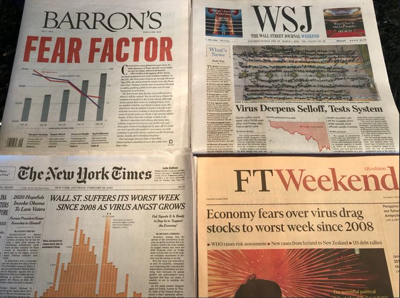
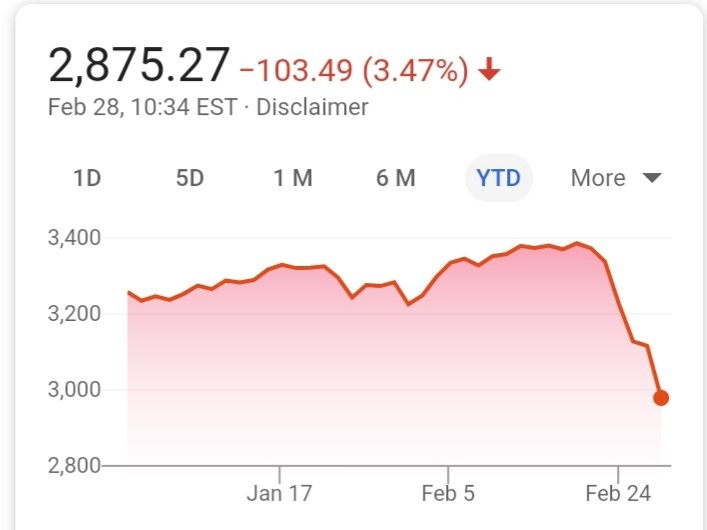

# Week 9

@lil_morgy

i saw the best minds of my generation destroyed by pretending to be passionate about web development as a means to secure healthcare

---



---

<blockquote class="twitter-tweet"><p lang="en" dir="ltr">Coronavirus: the trigger for the paradigm shift that convinces companies remote and distributed work is incredibly effective and makes sense, even at scale?</p>&mdash; Ben Hamner (@benhamner) <a href="https://twitter.com/benhamner/status/1233533685816864773?ref_src=twsrc%5Etfw">February 28, 2020</a></blockquote> <script async src="https://platform.twitter.com/widgets.js" charset="utf-8"></script>

---

Maga Lago

---

@Steinernomics

Things Coronavirus has the potential to break:

1. MAGA

2. Libertarianism

3. Resistance to Medicare for All and paid sick leave

4. Private sector pharmaceutical patent monopolies

---

"@Laurie_Garrett

NYC @NYCMayor DeBlasio has repeatedly requested permission from
federal authorities to conduct all #COVID19 #SARnCoV2019 tests in
NYCDOH labs, using kits locally developed. He claims nobody in federal
govt has responded to >3 weeks of requests"

---

<blockquote class="twitter-tweet"><p lang="en" dir="ltr">Coronavirus epidemy in Iran has past the crisis level. The country is imploding - law and order to disappear in the next days. A number of officials already died and mass infection among hospital staff and police forces reported.</p>&mdash; Ali (@aliostad) <a href="https://twitter.com/aliostad/status/1233668766124400640?ref_src=twsrc%5Etfw">February 29, 2020</a></blockquote> <script async src="https://platform.twitter.com/widgets.js" charset="utf-8"></script>

---

When shit is overvalued something always "happens".

"Aw but if [wuflu, trade war, politics, insert your excuse] did not
happen, markets would have been fine"

---

Indicators are divided on recession. Delinq rate, NFP says soon, but
initial claims, junk bonds say not imminent.

---

Another Py package for company financial data, `yahoofinancials`

```python
from yahoofinancials import YahooFinancials
ticker = 'AAPL'
yahoo_financials = YahooFinancials(ticker)
all_statement_data_qt =  yahoo_financials.get_financial_stmts('quarterly', ['income', 'cash', 'balance'])
rev = all_statement_data_qt['incomeStatementHistoryQuarterly']['AAPL'][0]['2019-12-28']['totalRevenue']
rev / 1e9
```

```text
91.819
```

---

"@cheynman

Green is the new black: #Shell Exploring World’s Largest
\#GreenHydrogen Project"

[Link](https://www.greentechmedia.com/amp/article/shell-exploring-worlds-largest-green-hydrogen-project)

---

"@Jkylebass

China Southern Airliner from Guangdong (hotbed with 2nd most
infections in China) landing in Kenya today. CCP has control of Kenyan
govt...reckless behavior from the Chinese Communists. Africa can’t
protect itself from this kind of virus"

---

<blockquote class="twitter-tweet"><p lang="en" dir="ltr">Powered by hydrogen, Hyundai&#39;s trucks aim to conquer the Swiss Alps <a href="https://t.co/Y1uj3u6ues">https://t.co/Y1uj3u6ues</a> <a href="https://t.co/oZ5RVpCYyF">pic.twitter.com/oZ5RVpCYyF</a></p>&mdash; Reuters UK (@ReutersUK) <a href="https://twitter.com/ReutersUK/status/1233370117054095360?ref_src=twsrc%5Etfw">February 28, 2020</a></blockquote> <script async src="https://platform.twitter.com/widgets.js" charset="utf-8"></script>

---

Go Pope. I like this guinea (he is a Jesuit, they are fine, J are a
Renaissance institution).

"@fuelcellsworks

Purdue Professor Meets Pope and Discusses \#Hydrogen

[Link](https://twitter.com/fuelcellsworks/status/1233781422210605056)

---

Smart man.. keep it open.. killing off mullah followers?

"Hassan Rouhani told a cabinet meeting that health authorities would
continue to "only quarantine individuals"..  Teams are disinfecting
public spaces in Qom, including [a] shrine ..  Its custodian has
insisted it should be kept open as a 'house for cure'"

[Link](https://www.bbc.com/news/world-middle-east-51651454)

---

<iframe width="340"  src="https://www.youtube.com/embed/1Ne5Y1dzJWk" frameborder="0" allow="accelerometer; autoplay; encrypted-media; gyroscope; picture-in-picture" allowfullscreen></iframe>

---

<blockquote class="twitter-tweet"><p lang="und" dir="ltr">🤣 <a href="https://t.co/Tap8o3TpP8">https://t.co/Tap8o3TpP8</a></p>&mdash; TeslaCharts (@TESLAcharts) <a href="https://twitter.com/TESLAcharts/status/1233349662976991232?ref_src=twsrc%5Etfw">February 28, 2020</a></blockquote> <script async src="https://platform.twitter.com/widgets.js" charset="utf-8"></script>

---

Waa waaa waaaa waaaaaaa



---

"@KingPickleRick1

SHOUT OUT TO MY MUFUCKIN SHORT BOIZ WE FUCCIN EATIN TODAY GENTS. STAY FUDDING"

---

"@ElonRico

Due to the Corona virus, I am personally going into lockdown.  Not
gonna leave the house.  Unless of course the FED cuts rates 1/4 point,
then I will travel the world"

---

"@NorthManTrader

The Fed, with it liquidity operations masked all the underlying issues
in the markets over the past year. We had no earnings growth in 2019,
we had multiple expansion. The bond market never confirmed the
reflation trade"

---

SP still overvalued. Needs to go down to 2000.

---

"@MrsC_Assange

This is not justice! 

My sons hands are tied behind his back..

He deserves a fair hearing!

Please watch, retweet, share widely.  Help get the truth out.."

[Link](https://twitter.com/MrsC_Assange/status/1233150531058589696)

---

<blockquote class="twitter-tweet"><p lang="en" dir="ltr">1. A plurality of Dems support <a href="https://twitter.com/hashtag/Bernie?src=hash&amp;ref_src=twsrc%5Etfw">#Bernie</a>.<br><br>2. He is in the lead for second choice.<br><br>3. He consistently beats Trump in polls.<br><br>4. He now leads among voters of color.<br><br>5. He has received more votes in all 3 contests so far.<br><br>Conclusion: Trying to take him down isn&#39;t helpful. <a href="https://t.co/x2UqfzSowm">https://t.co/x2UqfzSowm</a></p>&mdash; Peter Daou (@peterdaou) <a href="https://twitter.com/peterdaou/status/1233368110578663425?ref_src=twsrc%5Etfw">February 28, 2020</a></blockquote> <script async src="https://platform.twitter.com/widgets.js" charset="utf-8"></script>

---

<blockquote class="twitter-tweet"><p lang="en" dir="ltr"><a href="https://twitter.com/hashtag/EV?src=hash&amp;ref_src=twsrc%5Etfw">#EV</a> performance can drop by 50% in cold weather. Learn more: <a href="https://t.co/Whye0RkM1P">https://t.co/Whye0RkM1P</a> <a href="https://twitter.com/hashtag/electricvehicles?src=hash&amp;ref_src=twsrc%5Etfw">#electricvehicles</a> <a href="https://t.co/58a5bO5qt8">pic.twitter.com/58a5bO5qt8</a></p>&mdash; Ballard Power (@BallardPwr) <a href="https://twitter.com/BallardPwr/status/1231913165144940545?ref_src=twsrc%5Etfw">February 24, 2020</a></blockquote> <script async src="https://platform.twitter.com/widgets.js" charset="utf-8"></script>

---

"@GuillaumeBerre

William Grove invented the fuel cells in Cardiff in 1838. He was
reincarnated today and tested the Pragma Hydrogen bike during the
opening ceremony of the Welsh Hydrogen &Fuel Cell Association"

---


<blockquote class="twitter-tweet"><p lang="en" dir="ltr">We need affordable housing for all instead of more gentrifying luxury developments for the few. I stand with the longtime residents of East Boston fighting displacement from the communities they have spent generations building. <a href="https://t.co/OGpZAD755O">https://t.co/OGpZAD755O</a></p>&mdash; Bernie Sanders (@BernieSanders) <a href="https://twitter.com/BernieSanders/status/1233166800801738753?ref_src=twsrc%5Etfw">February 27, 2020</a></blockquote> <script async src="https://platform.twitter.com/widgets.js" charset="utf-8"></script>

---

I am pretty sure I can do some damage around optimization for
catalysts, molecular chem at some pt 🤔

---

One more piece of crucial code de-Matlabified and Pythonized. 

---

<blockquote class="twitter-tweet"><p lang="en" dir="ltr">The cost to get tested for <a href="https://twitter.com/hashtag/Coronavirus?src=hash&amp;ref_src=twsrc%5Etfw">#Coronavirus</a> with no insurance being $3,270 is the most USA thing that could ever USA.</p>&mdash; Luke Barnett (@LukeBarnett) <a href="https://twitter.com/LukeBarnett/status/1232787814707687426?ref_src=twsrc%5Etfw">February 26, 2020</a></blockquote> <script async src="https://platform.twitter.com/widgets.js" charset="utf-8"></script>

---

Finally some f-ing sanity. S&P down 10% in a week.

---

Now have 1 month's worth of food. 🍫🍫🍫

---

"@DCKennard

91-year-old Noam Chomsky being called as a witness by the defence as
the US tries to jail Julian Assange for revealing American war
crimes... will be a moment for the ages"

---

"@divitiaenow

Helicopter Money begins. Another interesting chapter in evolution of
monetary policy

'Hong Kong to give cash gift of $1,200 to residents'"

[Link](https://twitter.com/divitiaenow/status/1233006317113049091)

---

"@wa7iut

[Production leaving US was e]xactly what I had a ring side seat to
observe at Hewlett Packard (worked there from 1979 to 2003). When I
started there we would take a block of aluminum and create a printer
from it, including many of the chips.  By the time I left, we only did
the marketing"

---

<blockquote class="twitter-tweet"><p lang="en" dir="ltr">🇪🇺 &quot;The idea of using <a href="https://twitter.com/hashtag/hydrogen?src=hash&amp;ref_src=twsrc%5Etfw">#hydrogen</a> for long-term, affordable storage has become mainstream in Europe. Very few still doubt H2&#39;s role in the <a href="https://twitter.com/hashtag/energytransition?src=hash&amp;ref_src=twsrc%5Etfw">#energytransition</a>.&quot; <br><br>🔊 Captivating interview of <a href="https://twitter.com/Chatzimarkakis?ref_src=twsrc%5Etfw">@Chatzimarkakis</a>, <a href="https://twitter.com/H2Europe?ref_src=twsrc%5Etfw">@H2Europe</a> Secretary General, fiercely committed to deploy the H2 solution.</p>&mdash; cH2ange (@cH2ange) <a href="https://twitter.com/cH2ange/status/1233062988258504704?ref_src=twsrc%5Etfw">February 27, 2020</a></blockquote> <script async src="https://platform.twitter.com/widgets.js" charset="utf-8"></script>

---

California's CalPERS Public Employee Pension Fund - you are doing some
very stupid moves. You will get destroyed.

---

I see some Baydın presence in Missiouri, Florida but they are not
Super Tuesdee. California is, and also Texas. Bernie looks strong in
former and competitive in the latter (ahead even in some polls). If
good in other ST states as well Bernie can catapult his way towards
the big prize. California would be a big push.

---

"@fuelcellsworks

NSG to Test the World’s First Use of Hydrogen Fuel for
Glass-Making--Will test the use of #hydrogen as an alternative fuel
for the float furnace to manufacture glass at its Greengate Works in
St. Helens, U.K."

[Link](http://bit.ly/2TkpjOZ )

---

Sweet. But there is a method that uses simple cross product

"@FreyaHolmer

My favorite way to see if a point is inside or outside a path

[Link](https://twitter.com/FreyaHolmer/status/1232826293902888960)

---

<blockquote class="twitter-tweet"><p lang="en" dir="ltr">Australia: Renewable Hydrogen Bonanza for Gladstone-$4.2 million gas injection facility will be built in Gladstone to deliver renewable <a href="https://twitter.com/hashtag/hydrogen?src=hash&amp;ref_src=twsrc%5Etfw">#hydrogen</a> into the city’s gas network-<a href="https://t.co/AyhhhoH6f2">https://t.co/AyhhhoH6f2</a> <a href="https://twitter.com/hashtag/decarbonise?src=hash&amp;ref_src=twsrc%5Etfw">#decarbonise</a> <a href="https://twitter.com/hashtag/zeroemissions?src=hash&amp;ref_src=twsrc%5Etfw">#zeroemissions</a> <a href="https://twitter.com/hashtag/h2?src=hash&amp;ref_src=twsrc%5Etfw">#h2</a> <a href="https://twitter.com/hashtag/hydrogennow?src=hash&amp;ref_src=twsrc%5Etfw">#hydrogennow</a> <a href="https://twitter.com/hashtag/gladstone?src=hash&amp;ref_src=twsrc%5Etfw">#gladstone</a> <a href="https://twitter.com/hashtag/australia?src=hash&amp;ref_src=twsrc%5Etfw">#australia</a> <a href="https://twitter.com/fuelcellsworks?ref_src=twsrc%5Etfw">@fuelcellsworks</a> <a href="https://t.co/iNWZ2MlXpA">pic.twitter.com/iNWZ2MlXpA</a></p>&mdash; FuelCellsWorks (@fuelcellsworks) <a href="https://twitter.com/fuelcellsworks/status/1233020393306365952?ref_src=twsrc%5Etfw">February 27, 2020</a></blockquote> <script async src="https://platform.twitter.com/widgets.js" charset="utf-8"></script>

---

Cuck Todd

---

What's ahead (from [link](https://www.270towin.com/2020-election-calendar/))

The third of Novambah - a day of celebration, hopefully

<table style='font-size:60%'>
    <tr>
      <td>Date</td>
      <td>State</td>
      <td>Democratic</td>
      <td>Republican</td>
    </tr>
  <tr >
    <td rowspan="2">
      February 3
    </td>
  </tr>

  <tr >
    <td>Iowa</td>

    <td>Caucus</td>
  </tr>
  <tr >
    <td rowspan="2">
      February 11
    </td>
  </tr>

  <tr >
    <td>New Hampshire</td>
    <td>Primary</td><td>Primary</td>
  </tr>
  <tr >
    <td rowspan="2">
      February 22
    </td>
  </tr>

  <tr >
    <td>Nevada</td>
    <td>Caucus</td><td ></td>
  </tr>
  <tr >
    <td rowspan="2">
      February 29
    </td>
  </tr>

  <tr >
    <td>South Carolina</td>

    <td>Primary</td><td ></td>
  </tr>
  <tr >
    <td rowspan="17">
      March 3
    </td>
  </tr>

  <tr >
    <td>Alabama</td>

    <td>Primary</td><td >Primary</td>
  </tr>
  <tr >
    <td>American Samoa</td>

    <td>Caucus</td><td ></td>
  </tr>
  <tr >
    <td>Arkansas</td>

    <td>Primary</td><td >Primary</td>
  </tr>
  <tr >
    <td>California</td>

    <td>Primary</td><td >Primary</td>
  </tr>
  <tr >
    <td>Colorado</td>

    <td>Primary</td><td >Primary</td>
  </tr>
  <tr >
    <td>Democrats Abroad</td>

    <td>Primary</td><td ></td>
  </tr>
  <tr >
    <td>Maine</td>

    <td>Primary</td><td >Primary</td>
  </tr>
  <tr >
    <td>Massachusetts</td>

    <td>Primary</td><td >Primary</td>
  </tr>
  <tr >
    <td>Minnesota</td>

    <td>Primary</td><td >Primary</td>
  </tr>
  <tr >
    <td>North Carolina</td>

    <td>Primary</td><td >Primary</td>
  </tr>
  <tr >
    <td>Oklahoma</td>

    <td>Primary</td><td >Primary</td>
  </tr>
  <tr >
    <td>Tennessee</td>

    <td>Primary</td><td >Primary</td>
  </tr>
  <tr >
    <td>Texas</td>

    <td>Primary</td><td >Primary</td>
  </tr>
  <tr >
    <td>Utah</td>

    <td>Primary</td><td >Primary</td>
  </tr>
  <tr >
    <td>Vermont</td>

    <td>Primary</td><td >Primary</td>
  </tr>
  <tr >
    <td>Virginia</td>

    <td>Primary</td><td ></td>
  </tr>
  <tr >
    <td rowspan="7">
      March 10
    </td>
  </tr>

  <tr >
    <td>Idaho</td>

    <td>Primary</td><td >Primary</td>
  </tr>
  <tr >
    <td>Michigan</td>

    <td>Primary</td><td >Primary</td>
  </tr>
  <tr >
    <td>Mississippi</td>

    <td>Primary</td><td >Primary</td>
  </tr>
  <tr >
    <td>Missouri</td>

    <td>Primary</td><td >Primary</td>
  </tr>
  <tr >
    <td>North Dakota</td>

    <td>Primary</td><td ></td>
  </tr>
  <tr >
    <td>Washington</td>

    <td>Primary</td><td >Primary</td>
  </tr>
  <tr >
    <td rowspan="2">
      March 12
    </td>
  </tr>

  <tr >
    <td>Virgin Islands</td>

    <td></td><td >Caucus</td>
  </tr>
  <tr >
    <td rowspan="4">
      March 14
    </td>
  </tr>

  <tr >
    <td>Guam</td>

    <td></td><td >Caucus</td>
  </tr>
  <tr >
    <td>Northern Mariana</td>

    <td>Caucus</td><td ></td>
  </tr>
  <tr >
    <td>Wyoming</td>

    <td></td><td >Convention</td>
  </tr>
  <tr >
    <td rowspan="6">
      March 17
    </td>
  </tr>

  <tr >
    <td>Arizona</td>

    <td>Primary</td><td ></td>
  </tr>
  <tr >
    <td>Florida</td>

    <td>Primary</td><td >Primary</td>
  </tr>
  <tr >
    <td>Illinois</td>

    <td>Primary</td><td >Primary</td>
  </tr>
  <tr >
    <td>Northern Mariana</td>

    <td></td><td >Caucus</td>
  </tr>
  <tr >
    <td>Ohio</td>

    <td>Primary</td><td >Primary</td>
  </tr>
  <tr >
    <td rowspan="3">
      March 24
    </td>
  </tr>

  <tr >
    <td>American Samoa</td>

    <td></td><td >Caucus</td>
  </tr>
  <tr >
    <td>Georgia</td>

    <td>Primary</td><td >Primary</td>
  </tr>
  <tr >
    <td rowspan="2">
      March 27
    </td>
  </tr>

  <tr >
    <td>North Dakota</td>

    <td></td><td >Convention</td>
  </tr>
  <tr >
    <td rowspan="2">
      March 29
    </td>
  </tr>

  <tr >
    <td>Puerto Rico</td>

    <td>Primary</td><td ></td>
  </tr>
  <tr >
    <td rowspan="5">
      April 4
    </td>
  </tr>

  <tr >
    <td>Alaska</td>

    <td>Primary</td><td ></td>
  </tr>
  <tr >
    <td>Hawaii</td>

    <td>Primary</td><td ></td>
  </tr>
  <tr >
    <td>Louisiana</td>

    <td>Primary</td><td >Primary</td>
  </tr>
  <tr >
    <td>Wyoming</td>

    <td>Caucus</td><td ></td>
  </tr>
  <tr >
    <td rowspan="2">
      April 7
    </td>
  </tr>

  <tr >
    <td>Wisconsin</td>

    <td>Primary</td><td >Primary</td>
  </tr>
  <tr >
    <td rowspan="7">
      April 28
    </td>
  </tr>

  <tr >
    <td>Connecticut</td>

    <td>Primary</td><td >Primary</td>
  </tr>
  <tr >
    <td>Delaware</td>

    <td>Primary</td><td >Primary</td>
  </tr>
  <tr >
    <td>Maryland</td>

    <td>Primary</td><td >Primary</td>
  </tr>
  <tr >
    <td>New York</td>

    <td>Primary</td><td >Primary</td>
  </tr>
  <tr >
    <td>Pennsylvania</td>

    <td>Primary</td><td >Primary</td>
  </tr>
  <tr >
    <td>Rhode Island</td>

    <td>Primary</td><td >Primary</td>
  </tr>
  <tr >
    <td rowspan="3">
      May 2
    </td>
  </tr>

  <tr >
    <td>Guam</td>

    <td>Caucus</td><td ></td>
  </tr>
  <tr >
    <td>Kansas</td>

    <td>Primary</td><td ></td>
  </tr>
  <tr >
    <td rowspan="2">
      May 5
    </td>
  </tr>

  <tr >
    <td>Indiana</td>

    <td>Primary</td><td >Primary</td>
  </tr>
  <tr >
    <td rowspan="3">
      May 12
    </td>
  </tr>

  <tr >
    <td>Nebraska</td>

    <td>Primary</td><td >Primary</td>
  </tr>
  <tr >
    <td>West Virginia</td>

    <td>Primary</td><td >Primary</td>
  </tr>
  <tr >
    <td rowspan="3">
      May 19
    </td>
  </tr>

  <tr >
    <td>Kentucky</td>

    <td>Primary</td><td >Primary</td>
  </tr>
  <tr >
    <td>Oregon</td>

    <td>Primary</td><td >Primary</td>
  </tr>
  <tr >
    <td rowspan="6">
      June 2
    </td>
  </tr>

  <tr >
    <td>District of Columbia</td>

    <td>Primary</td><td >Primary</td>
  </tr>
  <tr >
    <td>Montana</td>

    <td>Primary</td><td >Primary</td>
  </tr>
  <tr >
    <td>New Jersey</td>

    <td>Primary</td><td >Primary</td>
  </tr>
  <tr >
    <td>New Mexico</td>

    <td>Primary</td><td >Primary</td>
  </tr>
  <tr >
    <td>South Dakota</td>

    <td>Primary</td><td >Primary</td>
  </tr>
  <tr >
    <td rowspan="2">
      June 6
    </td>
  </tr>

  <tr>
    <td>Virgin Islands</td>

    <td>Caucus</td><td ></td>
  </tr>
  <tr >
    <td rowspan="2">
      June 7
    </td>
  </tr>

  <tr >
    <td>Puerto Rico</td>

    <td></td><td>Primary</td>
  </tr>
  <tr>
    <td valign='top'>July 13 - 16</td><td valign='top'
    colspan='3'>Democratic Convention (Milwaukee, WI)</td>
  </tr>
  <tr ><td valign='top'>August 24 - 27</td><td valign='top'
  colspan='3'>Republican Convention (Charlotte, NC)</td></tr>
  <tr ><td valign='top'>September 29</td><td valign='top'
  colspan='3'>First Presidential Debate (South Bend, IN)</td></tr>
  <tr><td valign='top'>October 7</td><td valign='top' colspan='3'>Vice
  Presidential Debate (Salt Lake City, UT)</td></tr>
  <tr ><td valign='top'>October 15</td><td valign='top'
  colspan='3'>Second Presidential Debate (Ann Arbor, MI)</td></tr>
  <tr><td valign='top'>October 22</td><td valign='top'
  colspan='3'>Third Presidential Debate (Nashville, TN)</td></tr>
  <tr>
    <td valign='top'>November 3</td><td valign='top'  colspan='3'>2020 Presidential Election
  </td>
  </tr>
  
</table>


---

<blockquote class="twitter-tweet"><p lang="en" dir="ltr">.<a href="https://twitter.com/PlugPowerInc?ref_src=twsrc%5Etfw">@PlugPowerInc</a> has launched its heavy-duty 125 kW ProGen zero emission <a href="https://twitter.com/hashtag/HydrogenNow?src=hash&amp;ref_src=twsrc%5Etfw">#HydrogenNow</a> fuel-cell system. ProGen fuel cell systems include the fuel-cell stack and all required subsystems for humidification, air delivery, fuel regulation and cooling <a href="https://t.co/azNU6GKbfb">https://t.co/azNU6GKbfb</a>.</p>&mdash; IEA Hydrogen (@IEA_Hydrogen) <a href="https://twitter.com/IEA_Hydrogen/status/1232730824723828747?ref_src=twsrc%5Etfw">February 26, 2020</a></blockquote> <script async src="https://platform.twitter.com/widgets.js" charset="utf-8"></script>

---

"@RebeccaforWA

A HOME IS FOR LIVING IN.

Not flipping.

Not speculating.

Not gentrifying.

FOR LIVING IN.

\#HomesGuarantee"

---

"@FaizaPatelBCJ

Yes, it's great that NSA finally acknowledges the Section 215 call
records program was a massive waste of time & money.  But, there would
be no pressure on them to fix it if not for @Snowden. And the
pointless invasions of American's privacy is staggering"

---

Credit Card Delinquency Rates - Small Banks

I believe this is % of ppl missing payment for 30 days or more. If
increases, means citizens are overlevered.

```python
import pandas as pd, datetime
from pandas_datareader import data

today = datetime.datetime.now()
start=datetime.datetime(1980, 1, 1)
end=datetime.datetime(today.year, today.month, today.day)
cols = ['DRCCLOBS']
df = data.DataReader(cols, 'fred', start, end)
df.plot()
plt.axvspan('01-09-1990', '01-07-1991', color='y', alpha=0.5, lw=0)
plt.axvspan('01-03-2001', '27-10-2001', color='y', alpha=0.5, lw=0)
plt.axvspan('22-12-2007', '09-05-2009', color='y', alpha=0.5, lw=0)
plt.savefig('delin.png')
```


---

<blockquote class="twitter-tweet"><p lang="en" dir="ltr">Are you a local or regional authority working on alternative fuel infrastructure🔌⚡️? Then the <a href="https://twitter.com/hashtag/EU?src=hash&amp;ref_src=twsrc%5Etfw">#EU</a> wants to hear 🗣️ from you! Fill out a survey evaluating the Alternative Fuels Infrastructure Directive &amp; contribute to policy development in the area! Info: <a href="https://t.co/dekvhV2ykC">https://t.co/dekvhV2ykC</a> <a href="https://t.co/NyP9hI7b9t">pic.twitter.com/NyP9hI7b9t</a></p>&mdash; CIVITAS Initiative (@CIVITAS_EU) <a href="https://twitter.com/CIVITAS_EU/status/1232361489605902337?ref_src=twsrc%5Etfw">February 25, 2020</a></blockquote> <script async src="https://platform.twitter.com/widgets.js" charset="utf-8"></script>

---

"@springwise

World's first hydrogen-powered aircraft powertrain has been developed
by California-based company, @ZeroAvia"

---

Pop quiz - what is Roubini culturally? His parents are from Iran, they
were Jewish, he was born in Istanbul, he grew up in Italy, he spent
long time in US.

Because he was born in TR, I could try to claim him as one of my own,
my tigga, a homeboy.. But that would be a mistake, he didn't spend
much time there. He a Jew? Where was he at when he grew up?  In Italy,
hence the accent. That's the answer: he's a guinea. Real guinea, not
like ones in US who are Americans but try to cling to a faux identity
because of their moronic parents so they wildly gesticulate trying to
look a certain way but fail. No, this guy is a legit guinea. Problem
solved.

---

Hmm supply shock is inflationary, but growth slowing expectation is
deflationary. I wonder which one would win, and if the former, would
that cause treasury yields to go up? 🤔

---

"@Nate_Cohn

Can we just pause to note that somehow Bloomberg managed to be on the
'Politburo not so bad' side of a debate with Bernie Sanders"

---

They are all trying to close - I respect that. Feeling the \#Bern.

\#demdebate

---

Bootee-Cheech came across little more desparate this time.

\#demdebate

---

Great, give Bernie more M4A questions. He just kills it and works in
his favor.

\#demdebate

---

That was good back and forth between Biden and Steyer. We learned some
things, and Steyer came across okay.

\#demdebate

---

It wasn't such a bad debate. 

---

If peeps think the angle on guns will work on Sandahs you are sorely
mistaken. He did just fine with that 'mom-and-pop gunstores' line in
2016; it was a line that would work nationally (taking away a bullshit
hot-button issue from Reps) and therefore, would increase his
electability, hence chances during the primary.

\#demdebate

---

Wars have gotten weirder and weirder.. Almost none is being fought for
the reasons claimed.

---

<blockquote class="twitter-tweet"><p lang="en" dir="ltr">In an Australian-first, a solar to hydrogen-based microgrid for the World Heritage Protected Daintree Rainforest, is yet another step closer to reality. <br>Read more here: <a href="https://t.co/envZ6KvHo9">https://t.co/envZ6KvHo9</a><a href="https://twitter.com/hashtag/hazergroupltd?src=hash&amp;ref_src=twsrc%5Etfw">#hazergroupltd</a> <a href="https://twitter.com/hashtag/hydrogen?src=hash&amp;ref_src=twsrc%5Etfw">#hydrogen</a> <a href="https://twitter.com/hashtag/cleantech?src=hash&amp;ref_src=twsrc%5Etfw">#cleantech</a> <a href="https://twitter.com/hashtag/greenenergy?src=hash&amp;ref_src=twsrc%5Etfw">#greenenergy</a> <a href="https://twitter.com/hashtag/daintreeforest?src=hash&amp;ref_src=twsrc%5Etfw">#daintreeforest</a> <a href="https://twitter.com/hashtag/biogas?src=hash&amp;ref_src=twsrc%5Etfw">#biogas</a> <a href="https://twitter.com/hashtag/carbonfree?src=hash&amp;ref_src=twsrc%5Etfw">#carbonfree</a> <a href="https://t.co/nSethVDgkU">pic.twitter.com/nSethVDgkU</a></p>&mdash; Hazer Group Ltd (@hazergroupltd) <a href="https://twitter.com/hazergroupltd/status/1232425265361489920?ref_src=twsrc%5Etfw">February 25, 2020</a></blockquote> <script async src="https://platform.twitter.com/widgets.js" charset="utf-8"></script>

---

Oh but we could not switch to renewables bcz of -blah-. Bunch of
crock. Entrenched interest are behind it all.

"Puerto Rico Officials Undermine Rooftop Solar Movement in Favor of
Natural Gas" -- theintercept.com

---

Ideally I'd support all kinds of shit. But Israel made TSS all but
impossible by turning the West Bank into swiss cheese by allowing
settlers. They won the war took that land fine. But then they were
indecisive abt what to do with it, Israeli citizens started slowly to
settle there, drip drip drip and we are here. Does this indecisiveness
have something to do with Israelis psychologically seeing self
(incorrectly) not being ready for governing others? Jews lived under
majorities for a long time in other geographies right? Maybe that
feeling of outsiderness plays a role. Have to let that all go son. U
win it, u own it.

"But you said nations are defined culturally, if a culture is
different enough it should be its own country. Why not support
two-state solution in Palestine then?"

---

I'll drink to that

[Link](twimg/ERohFWAXYAE32ui.jpg)

---

<blockquote class="twitter-tweet"><p lang="en" dir="ltr">Impossible or I&#39;m possible? - The EU ShipFC initiative has launched the pilot project where Viking Energy will become the world&#39;s first zero emission supply vessel. <a href="https://t.co/PFZstzkCdU">https://t.co/PFZstzkCdU</a> <a href="https://twitter.com/hashtag/FutureFuels?src=hash&amp;ref_src=twsrc%5Etfw">#FutureFuels</a> <a href="https://twitter.com/hashtag/TogetherIsBetter?src=hash&amp;ref_src=twsrc%5Etfw">#TogetherIsBetter</a> <a href="https://twitter.com/hashtag/SmartMarine?src=hash&amp;ref_src=twsrc%5Etfw">#SmartMarine</a> <a href="https://t.co/anWQ8omsKk">pic.twitter.com/anWQ8omsKk</a></p>&mdash; Wärtsilä Corporation (@wartsilacorp) <a href="https://twitter.com/wartsilacorp/status/1232334561058660352?ref_src=twsrc%5Etfw">February 25, 2020</a></blockquote> <script async src="https://platform.twitter.com/widgets.js" charset="utf-8"></script>

---

Elected a real-estate developer as President, Americans stil can't get
enough housing.

Burn 🔥

---


Corporatocracy 👊

---

Got lota camping food I could go for weeks wout grocs. Have a fine
knife and other good stuff... Hell I have portable solar panels. If
elec shuts off can at least charge a phone.

---

Screenplay: the entire Earth population dies from virus, only ones
left are in ISS. Movie is about them trying to land on their own then
exploring Earth, starting new life. Maybe a few zombies too.

---

"As Idlib collapses, the best path forward also seems the most
unlikely: Washington should pressure Turkey to negotiate the
opposition’s surrender, rather than backing Ankara’s decision to give
open-ended but inadequate support to these armed groups"

[Link](https://warontherocks.com/2020/02/cleaning-up-turkeys-mess-in-idlib-and-ending-the-war/)

---

<blockquote class="twitter-tweet"><p lang="en" dir="ltr">For the first time in human history, the concentration of carbon dioxide in the Earth&#39;s air reached 400 parts per million.<br><br>The last time the planet experienced such high levels was more than 3,000,000 years ago. <a href="https://t.co/98b7IjeTjZ">https://t.co/98b7IjeTjZ</a></p>&mdash; NBC News (@NBCNews) <a href="https://twitter.com/NBCNews/status/1232314331993444352?ref_src=twsrc%5Etfw">February 25, 2020</a></blockquote> <script async src="https://platform.twitter.com/widgets.js" charset="utf-8"></script>

---

<blockquote class="twitter-tweet"><p lang="en" dir="ltr">Well, <a href="https://twitter.com/hashtag/EatTheRich?src=hash&amp;ref_src=twsrc%5Etfw">#EatTheRich</a> is trending.</p>&mdash; Peter Daou (@peterdaou) <a href="https://twitter.com/peterdaou/status/1232110812946477056?ref_src=twsrc%5Etfw">February 25, 2020</a></blockquote> <script async src="https://platform.twitter.com/widgets.js" charset="utf-8"></script>

---

Galloway: The DNC material was leaked to Wikileaks from inside DNC not
hacked [says knows this from solid source but cannot disclose]

---

Speedometer - Same Old Thing \#music

[Link](https://youtu.be/zrg3hkMae28)

---

Great Kobe story

[Link](https://mobile.twitter.com/SInow/status/1232038290154565633)

---

I love being goaded through a material by a great
lecturer. Tibshirani, 5 stars.  Whose got two thumbs and following
good material? This guy!! 👍 😊 👍

---

Hierarchy of needs? Here is a good one

[Link](twimg/ERms3mSWAAAB832.png)

---

The Egg - Catch \#music

[Link](https://youtu.be/syOmZns5kmM)

---

Open borders my ass. We need even less travel than we have today. 

---

Some weird shit

😶😶😶

"You've probably heard about the sudden outbreak of the virus in South
Korea. Well, did you also know that this is, in large part, to thank
to an actual death cult? It's called \#Shincheonji" 

[Link](https://twitter.com/Spainkiller/status/1231869865205620742)

---

Maybe better wording is "right after a delay" and "more right on some
instruments than others". But at any given time sure, it may not be.

<blockquote class="twitter-tweet"><p lang="en" dir="ltr">&quot;The biggest public fallacy is that the market is always right. The market is nearly always wrong. I can assure you of that.&quot;</p>&mdash; Jim Rogers (@JimRogerBlogs) <a href="https://twitter.com/JimRogerBlogs/status/1222564697733382145?ref_src=twsrc%5Etfw">January 29, 2020</a></blockquote> <script async src="https://platform.twitter.com/widgets.js" charset="utf-8"></script>

---

<blockquote class="twitter-tweet"><p lang="en" dir="ltr">Zero emission, zero noise, what&#39;s not to like? <a href="https://t.co/G1ncIy16Xh">pic.twitter.com/G1ncIy16Xh</a></p>&mdash; The Sun (@TheSun) <a href="https://twitter.com/TheSun/status/1232057613543780353?ref_src=twsrc%5Etfw">February 24, 2020</a></blockquote> <script async src="https://platform.twitter.com/widgets.js" charset="utf-8"></script>

---

No thanks

[Ad](twimg/ERljZwoXkAEwI3R.jpg)

---

It is better described as [grandparent envy](https://twitter.com/RealTimers/status/1228726161842167808) actually

"Bernie Sanders' politics sounds like rich envy"

---

"@JohnArnoldFndtn

In another blow to US energy producers, natural gas has become a waste
product in West Texas. There have been brief periods of negative
prices before but now forward prices for the whole summer are -5¢"

---

<blockquote class="twitter-tweet"><p lang="en" dir="ltr">Man behind counter at sandwich shop: &quot;Where are you from?&quot; <br>Me: &quot;Michigan.&quot; <br>Him: &quot;No I mean ethnically.&quot; <br>Me: &quot;I know what you meant.&quot; 😐<br><br>Still felt awkward enough to answer the question, but proud that I&#39;ve finally reached at least that level of sass to this constant question.</p>&mdash; Mona El-Hout (@maelhout) <a href="https://twitter.com/maelhout/status/1231708804443713538?ref_src=twsrc%5Etfw">February 23, 2020</a></blockquote> <script async src="https://platform.twitter.com/widgets.js" charset="utf-8"></script>

[Image](michsass.jpg)

---

"@NorthmanTrader

We have a 3rd down day in a row and:

'Rate Cuts Now'"

---

<blockquote class="twitter-tweet" data-conversation="none"><p lang="en" dir="ltr">“By their own words, [China&#39;s leaders] have positioned themselves as the sworn enemy of Western democracy. So for Western industrial democracies to make themselves dependent on a country like that is absolute foolishness,” says Curtis Ellis.<br> <br>ATL🇺🇸Watch: <a href="https://t.co/IYsNxXPzKL">https://t.co/IYsNxXPzKL</a> <a href="https://t.co/t7opJpaw05">pic.twitter.com/t7opJpaw05</a></p>&mdash; Jan Jekielek (@JanJekielek) <a href="https://twitter.com/JanJekielek/status/1231771609771499521?ref_src=twsrc%5Etfw">February 24, 2020</a></blockquote> <script async src="https://platform.twitter.com/widgets.js" charset="utf-8"></script>

---

For coronav stats I dont look at deceased / confirmed, I look at
deceased / deceased + recovered ratio - that's your death rate. I've
seen ratios btw 10% and 20% using this mthd.

---

Fin types are melting down with the spending pledges I'm loving it

---

Nnnnn-ooooooo-oooooooo!!!

---

Pic had Bern with a black family.

They gonna take my money and give it to black people !!! 😱😱😱😱😱😱😱

---

"@BernieSanders

Caring for children in America is so outrageously expensive that
having children is a leading cause of poverty in the United States.

That ends when we are in the White House"

[Link](https://twitter.com/BernieSanders/status/1231958085205450752)

---

<blockquote class="twitter-tweet"><p lang="en" dir="ltr">Mnuchin pictured with an early experimental Coronavirus vaccine <a href="https://t.co/ixrbJA4wAe">pic.twitter.com/ixrbJA4wAe</a></p>&mdash; Kenneth Dredd (@KennethDredd) <a href="https://twitter.com/KennethDredd/status/1231793843776843776?ref_src=twsrc%5Etfw">February 24, 2020</a></blockquote> <script async src="https://platform.twitter.com/widgets.js" charset="utf-8"></script>

---

"@mtracey

Electability update

Mike Bloomberg: Many smiling photos with Harvey Weinstein, Ghislaine
Maxwell, Henry Kissinger, Jared Kushner, and Donald Trump

Bernie Sanders: No known photos with any of the above individuals"

---

"@mtracey

Mark Levin, Charlie Kirk, and the rest of the Low IQ mainstream GOP
infotainment apparatus have no idea how to run against Bernie. They
knew how to run against Hillary and would've done reasonably well
against Biden. Follow the same script against Bernie and you will lose"

---

Current grid cannot carry the load required for widespread EV
charging. Some say "let's upgrade the grid". Why? So shoddy EV tech
can work average-reliably, only half the time compared to ICE? Does
any of this make sense?

---

"@EFF

More than $200 million is frozen in the California broadband fund
because amendments pushed by incumbent ISPs prevent it from being
spent on fiber"

---

Unbelievable.

\#M4A \#ASAP

[Link](https://mobile.twitter.com/RebeccaforWA/status/1231845001547509761)

---

<blockquote class="twitter-tweet"><p lang="en" dir="ltr">Green Hydrogen: H2 V Energies Takes Another Step Forward and Announces the Opening of its Order Book-The plant will convert waste wood, bark, and paper into syngas and then turn it into green <a href="https://twitter.com/hashtag/hydrogen?src=hash&amp;ref_src=twsrc%5Etfw">#hydrogen</a>-<a href="https://t.co/ZzHiHSru3E">https://t.co/ZzHiHSru3E</a> <a href="https://twitter.com/hashtag/hydrogennow?src=hash&amp;ref_src=twsrc%5Etfw">#hydrogennow</a> <a href="https://twitter.com/Decarbonise?ref_src=twsrc%5Etfw">@decarbonise</a> <a href="https://twitter.com/hashtag/zeroemissions?src=hash&amp;ref_src=twsrc%5Etfw">#zeroemissions</a> <a href="https://twitter.com/hashtag/h2?src=hash&amp;ref_src=twsrc%5Etfw">#h2</a> <a href="https://twitter.com/hashtag/fuelcell?src=hash&amp;ref_src=twsrc%5Etfw">#fuelcell</a> <a href="https://t.co/dqU9ymOkJ0">pic.twitter.com/dqU9ymOkJ0</a></p>&mdash; FuelCellsWorks (@fuelcellsworks) <a href="https://twitter.com/fuelcellsworks/status/1231942151782707201?ref_src=twsrc%5Etfw">February 24, 2020</a></blockquote> <script async src="https://platform.twitter.com/widgets.js" charset="utf-8"></script>

---

Money was printed for non-productive purposes, all that money, mostly
held by the rich, is slushing in the system. What to do about it? A
stock market crash fixes it actually. Excess money buys stock, stock
costs 100, after crash it is 10, never reaches 100 again. That money
is gone, woosh. Problem solved.

---

@BallardPwr

\#EV performance can drop by 50% in cold weather.

[Link](http://bit.ly/2SIm9V1)

---

Countries ranked according to H2 use

[Link](https://sponsored.bloomberg.com/news/sponsors/features/hyundai/h2-economy-today/?adv=16713&prx_t=aXwFAX-0-AXSkPA)

---

<blockquote class="twitter-tweet"><p lang="en" dir="ltr">The hydrogen energy economy comes to suburban New York City.</p>&mdash; Bloomberg (@business) <a href="https://twitter.com/business/status/1230266880314748928?ref_src=twsrc%5Etfw">February 19, 2020</a></blockquote> <script async src="https://platform.twitter.com/widgets.js" charset="utf-8"></script>

---

The FED wanted to party with zombies, the punch was never taken away,
end result is a bubble everywhere and yield nowhere -> underfunded
pensions.

---

"[Parap] There is funding shortfall in pension plans. They projected
for 6-7% returns, bond yields are at <3% [hell even junk bonds are
around 5%]" \#raoulgmi

[Link](https://youtu.be/pkB5ugK0YDY?t=1377)

---

"[Parap] AAPL, MSFT, AMZN, GOOG combined are worth more than the German stock
market" \#raoulgmi

[Link](https://youtu.be/pkB5ugK0YDY?t=981)

---

"@ChuckRocha

Now we can tell you that @BernieSanders campaign talked to Latino
culinary union voters at least 22 times before caucus day, Starting 6
months ago! We organized, listened and invested and it paid off!"

---

I've become an avid collector of macro indicators. Whenever I see a
new one Im like ooooOOOoo - how do I get that one ..? 😍😍

---

When the frickin PLAGUE starts it's time to take the hint. Do not do
whatever it is making hard to do.

---

The kerkuffle with Scott Ritter was gold. 

[Link](https://mobile.twitter.com/jaketapper/status/1231592039009132546)

---

None of that would be necessary if the press didnt try so hard to play
'gotcha'. But then again, they do that, bcz it worked on people in the
past (their viewers)... Sad.

---

Another aspect of Bernie's use of the word socialism is to front-run
its "slur" status. Thanks to the lovely centrists people the pol
sphere shifted so far right that even a person with European leftist
views would invariably be called a socialist, of the extreme kind; so
by owning up to the word beforehand u aim to neutralize its
effect. Solid move in polemic; someone calls you a name, u either deny
the name, or do the unexpected, own up to it.

So first, socialism creates a contrast, second neutralizes a
"slur". If pressed on specifics, 'aw but it's socialism for this and
that', u give the run-around, 'certain services are already
socialized', how it is democratic socialism not that crazy kind, etc
Bernie had the MLK quote in one debate which was great.

The bonus is they keep fighting you, the attention is always on the
"socialist", being attacked, now the peeps thinking "maybe there's
something to this guy". They can't win.

---

<blockquote class="twitter-tweet"><p lang="en" dir="ltr">It&#39;s not just bros: ⁦<a href="https://twitter.com/BernieSanders?ref_src=twsrc%5Etfw">@BernieSanders</a>⁩ wins with a diverse coalition, by ⁦<a href="https://twitter.com/jonallendc?ref_src=twsrc%5Etfw">@jonallendc</a>⁩ <a href="https://t.co/5g3yLXTKZH">https://t.co/5g3yLXTKZH</a></p>&mdash; Ali Velshi (@AliVelshi) <a href="https://twitter.com/AliVelshi/status/1231411003033706496?ref_src=twsrc%5Etfw">February 23, 2020</a></blockquote> <script async src="https://platform.twitter.com/widgets.js" charset="utf-8"></script>

---

"It seems that the markets have understood. From the beginning of this
year the shares of companies in hydrogen technologies – especially
electrolysers and fuel cells – have gone up dramatically. This is a
good sign but definitely not enough. The price cuts of this disruptive
technology will follow only if we embark on a joint acceleration of an
industrial manufacturing. Here we need policy makers to pave the way
with a clear commitment that the right legal framework will be set
up. Still the use of electricity for the production of hydrogen is
burdened by policy driven factors.

To be honest, the recent recast of the 'Renewable Energy Directive' is
not helping the case as it is built on the logic of an 'all-electric
scenario' which would delay the decarbonization"

[Link](https://www.neweurope.eu/article/europe-needs-a-clean-hydrogen-coalition/)

---

"@GrahamCooley4

'Norwegian Oil and Energy Minister Tina Bru says that ammonia will be
set on equal footing as an energy source in the country's new strategy
to develop #hydrogen. This could be interesting to shipping, which is
looking for new energy types.'"

[Link](https://mobile.twitter.com/GrahamCooley4/status/1231341034820558848)

---

<blockquote class="twitter-tweet"><p lang="en" dir="ltr">Joy speaks for who exactly? I&#39;m a Gen X&#39;er. Half of the men I grew up with are dead, went into the Army or caught charges during the Crack Era. Unlike <a href="https://twitter.com/JoyAnnReid?ref_src=twsrc%5Etfw">@JoyAnnReid</a> my parents weren&#39;t doctors. We were working-class. We got fucked over by neoliberals. We&#39;re not angry. We&#39;re focused <a href="https://t.co/qxYbskUEZk">https://t.co/qxYbskUEZk</a></p>&mdash; Tim Black ™ (@RealTimBlack) <a href="https://twitter.com/RealTimBlack/status/1231522991470784512?ref_src=twsrc%5Etfw">February 23, 2020</a></blockquote> <script async src="https://platform.twitter.com/widgets.js" charset="utf-8"></script>

---


People don't seem to appreciate what modernity does to its
citizens. You get thrown around, from one concentrated institution to
another, in a constant game of musical chairs. You are constantly
interacting, moving, and need to adapt to the common language to
survive. From [Gellner](../../2013/03/nations-and-nationalism-gellner.html),

>Men located within [modernity] cannot generally rest in the same
>niches all their lives; and they can only seldom rest in them, so to
>speak, over generations [..] ... [Modern society ..] has to be mobile
>whether it wishes to be so or not [.. Also] a society which is
>destined to a permanent game of musical chairs cannot erect deep
>barriers of rank, of caste or estate, between the various sets of
>chairs which it possesses. That would hamper the mobility

Most still see majority - minority relations in terms of agrarian
empires who would let religious, ethnic groups in their ghettos,
with different dress.. 

All that is gone. Modernity is a freight train. We are all on it.

---

The trick Jewish people did best was, like the French lady's [example](https://youtu.be/ttBWXH-ihL0)
shared previously, the parents, and parent's parents managed to keep
the "homeland" idea alive. Then, sold on this idea, some went "back"
when time was appropriate. But, in a way, they were fooled.

Now together in the new country, as any group can reach some kind of
merger, the new arrivals are creating a new culture (people born into
it would become automatically part of that culture). Not necessarily
ancient Jewish per se, but a combo of all nationalities who arrived
there, Russians, Polaks, Germans, etc. enmeshed with the realities of
the region. In a way they are much like United States. No wonder
Israelis like US so much.

---

You were, actually. With the exception of maybe those Hassidic guys,
or ones who truly isolated themselves, the rest were assimilated.. So
what "came back" to the "homeland" were not Jews but Germans,
Americans, etc. How the f--k would u beat Arabs otherwise? German,
European know-how, organization ability, culture beat them, not your
funky hats. And now there are Jews from Moscow, St. Petersburg and
guess what? They are Russians.

"Netanyahu: [Parap] Jews came back to their homeland and we are proud
to maintain our culture. We were never assimilated"

---
