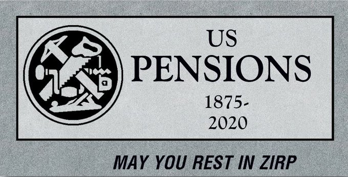

# Week 10

Schumah threatening con judges on abortion? He is like "we can't lose
our faux issue! That issue is the only reason we are here! That's how
we eat! It needs to stay in its current form forever! We need this
shit!  Do you know what you are dealing with!"

It's so sad. A politician being reduced to this. Inept Dem centrism
lead all here, both sides needing a dividing issue so bad, they
created this mess, and now they are shocked it can actually take a
life of its own. Same with guns.

---

Heard on France 24 Eng: "Private companies will charge an arm and a
leg for those [covid] tests, who will pay for them".

"Mexico will pay for them". 😂😂😂😂

Europeans having a gas at your expense US pols..


---

The problem with gov deficit spending (towards businesses) isnt bcz of
the deficit itself. It is that it replaces people demand with gov
demand. Such demand will create inefficiencies in the market if such
good is marketable.

I am not talking abt social services, but stuff that is already part
of the market econ. Take a toilet seat maker. There is crisis, gov
steps in starts buying toilet seats... But it can pay $10,000 for
f-ing toilet seat! It happened at the Pentagon before!

---

"A draft interim report from Ethiopian crash investigators
... concludes the March 2019 crash of a Boeing Co 737 MAX was caused
by the plane's design"

---

<blockquote class="twitter-tweet" data-conversation="none"><p lang="en" dir="ltr">We’re looking at about 1M US cases by the end of April, 2M by ~May 5, 4M by ~May 11, and so on. Exponentials are hard to grasp, but this is how they go. 4/n</p>&mdash; Liz Specht (@LizSpecht) <a href="https://twitter.com/LizSpecht/status/1236095183332114432?ref_src=twsrc%5Etfw">March 7, 2020</a></blockquote> <script async src="https://platform.twitter.com/widgets.js" charset="utf-8"></script>

---


<blockquote class="twitter-tweet"><p lang="en" dir="ltr">It would make the private insurance companies very, very angry if you retweeted this. <a href="https://t.co/uftgBvu4yn">https://t.co/uftgBvu4yn</a></p>&mdash; Bernie Sanders (@BernieSanders) <a href="https://twitter.com/BernieSanders/status/1235966985776873473?ref_src=twsrc%5Etfw">March 6, 2020</a></blockquote> <script async src="https://platform.twitter.com/widgets.js" charset="utf-8"></script>

---

"@scientificecon

2014: 120 Dutch co-operative banks forcibly merged into 1 by the regulators.

Same in South Tyrol, where the big bank-owned Banca d'Italia forcibly
merged 50 co-operative banks into 1

Since the ECB started, 60% of the formerly thousands of German
community banks have disappeared"

---

Taibbi: "Some part of Sanders seems to hold out hope that something is
left over in the DNA of the Democratic Party from those F.D.R. days,
something that can be saved and restored. He seems to have a nostalgic
fondness for it, as he seems to for Biden himself.

But this version of the Democratic Party that now has Biden as its
face wants to bury him. They’ve smeared him as a racist, sexist dupe
for Putin, an amateur and back-bencher who doesn’t understand power
and can’t “get things done.”

By getting as far as he has, and raising as much money as he has,
Sanders has already demolished half of that argument. To finish the
job, he has to show he understands the difference between doing well
and winning"

[Link](https://www.rollingstone.com/politics/politics-features/bernie-sanders-attack-joe-biden-democratic-primary-963934)

---

Kudlow: Buy the dip... Spoken like a true drug addict. Markets
addicted to FED laughing gas, former cokehead can recognize that...

And burned by Rudd, former AUS PM.

[Link](https://youtu.be/R-W48EfivYc?t=253)

---

Cruise ships - ugh. Cheap adventurism. 

---

<blockquote class="twitter-tweet"><p lang="en" dir="ltr">Iceland has now declared a state of emergency after the Covid-19 outbreak on the Island, 43 people are now infected - BBC</p>&mdash; FXHedge (@Fxhedgers) <a href="https://twitter.com/Fxhedgers/status/1236082934362157056?ref_src=twsrc%5Etfw">March 7, 2020</a></blockquote> <script async src="https://platform.twitter.com/widgets.js" charset="utf-8"></script>

---

"I’m an expat in Seoul living amid the coronavirus outbreak. I feel
like I’m living in the end times... Restaurants began posting signs
that read 'no Chinese.'... Seoul looks like a ghost town"

[Link](https://www.dallasnews.com/news/public-health/2020/03/06/im-an-expat-in-seoul-living-amid-the-coronavirus-outbreak-i-feel-like-im-living-in-the-end-times/)

---

<blockquote class="twitter-tweet"><p lang="en" dir="ltr">We&#39;re getting pretty late Soviet here with the lies no one even believes are believed <a href="https://t.co/Z9o2xhapMJ">pic.twitter.com/Z9o2xhapMJ</a></p>&mdash; Hank Oslo (@xctlot) <a href="https://twitter.com/xctlot/status/1236021887764959234?ref_src=twsrc%5Etfw">March 6, 2020</a></blockquote> <script async src="https://platform.twitter.com/widgets.js" charset="utf-8"></script>

---

"@scientificecon

Bitcoin:

Mythical alleged creator: Satoshi Nakamoto...

Step 1: put this Japanese name in the Japanese order of names:
Nakamoto Satoshi 中本智

Step 2: Translate into English: 'Central Intelligence'"

---

Bernie campaign motto should have been \#HimNotUS. I know such words
are anathema to the left, even in its authoritarian
[forms](https://youtu.be/KqZmXf3MfKQ), but have to do what campaigns
require..

---

It's freaky.. the Dem primary fell to 2nd or 3rd in importance in the
my news feed. The fin meltdown, coronav is overtaking all else

---

This reminds me a story from 2016.

"Japanese Seeking a Place to Stash Cash Start Snapping Up Safes"


"Negative interest rates spur sales of safes—a place where the
interest rate on cash is always zero"

[Link](https://www.wsj.com/amp/articles/japanese-seeking-a-place-to-stash-cash-start-snapping-up-safes-1456136223)

---

<blockquote class="twitter-tweet"><p lang="en" dir="ltr">Negative interest rates for the U.S.?<br><br>If the rectangle on the 10-Yr T-Note chart is to be trusted, the target on the <a href="https://twitter.com/hashtag/US10Y?src=hash&amp;ref_src=twsrc%5Etfw">#US10Y</a> <a href="https://twitter.com/search?q=%24ZN_F&amp;src=ctag&amp;ref_src=twsrc%5Etfw">$ZN_F</a> is -17 basis points.<br><br>What say you, <a href="https://twitter.com/RaoulGMI?ref_src=twsrc%5Etfw">@RaoulGMI</a> <a href="https://twitter.com/realvision?ref_src=twsrc%5Etfw">@realvision</a> ? <a href="https://t.co/kznUtKHZhQ">pic.twitter.com/kznUtKHZhQ</a></p>&mdash; Peter Brandt (@PeterLBrandt) <a href="https://twitter.com/PeterLBrandt/status/1235997393050406913?ref_src=twsrc%5Etfw">March 6, 2020</a></blockquote> <script async src="https://platform.twitter.com/widgets.js" charset="utf-8"></script>

---

"@KeithMcCullough

Isn't it amazing that the Fed is going to cut by 100bps in 16
days. We've trained a generation of free market capitalists to be
beggars. Investors are begging on their bloody knees for the Fed to
bail them out of their bad processes and bad decisions"

---

So it is green H2 then. Cool

<blockquote class="twitter-tweet"><p lang="en" dir="ltr">Germany sees no role for natural gas in draft plan for hydrogen <a href="https://t.co/0fJ3ezf2q6">https://t.co/0fJ3ezf2q6</a></p>&mdash; Bloomberg Energy (@BloombergNRG) <a href="https://twitter.com/BloombergNRG/status/1235814907196493824?ref_src=twsrc%5Etfw">March 6, 2020</a></blockquote> <script async src="https://platform.twitter.com/widgets.js" charset="utf-8"></script>

---

<blockquote class="twitter-tweet"><p lang="en" dir="ltr">Too bad Theranos got shut down just before they could have faked millions of coronavirus tests</p>&mdash; Ryan Grim (@ryangrim) <a href="https://twitter.com/ryangrim/status/1235907980857663496?ref_src=twsrc%5Etfw">March 6, 2020</a></blockquote> <script async src="https://platform.twitter.com/widgets.js" charset="utf-8"></script>

---

"Our healthcare system is a giant price-fixing scheme" -- Hanauer

---

<blockquote class="twitter-tweet"><p lang="en" dir="ltr">This week: UK Coalition seeks $1B for Hydrogen <a href="https://t.co/xTeB5AB7RA">https://t.co/xTeB5AB7RA</a> Germany draft plan for &#39;green&#39; hydrogen from renewables, nothing for natgas. Could target 15GW of electrolysis by 2030<a href="https://t.co/jM4lLuJaE1">https://t.co/jM4lLuJaE1</a> Meanwhile <a href="https://twitter.com/hashtag/energytwitter?src=hash&amp;ref_src=twsrc%5Etfw">#energytwitter</a> still in &#39;let&#39;s wait and see&#39; mode on H2</p>&mdash; Garry Golden (@garrygolden) <a href="https://twitter.com/garrygolden/status/1235686124518912000?ref_src=twsrc%5Etfw">March 5, 2020</a></blockquote> <script async src="https://platform.twitter.com/widgets.js" charset="utf-8"></script>

---

<blockquote class="twitter-tweet"><p lang="en" dir="ltr">France and UK are saying prepare for an inevitable epidemic, <br><br>we are saying this... <a href="https://t.co/2k10UN2ADm">https://t.co/2k10UN2ADm</a></p>&mdash; Zr1Trader (@ZR1Trader) <a href="https://twitter.com/ZR1Trader/status/1235939907069259777?ref_src=twsrc%5Etfw">March 6, 2020</a></blockquote> <script async src="https://platform.twitter.com/widgets.js" charset="utf-8"></script>

---

Sleep Walker - Eclipse \#music

[Link](https://youtu.be/W5bugcZKyvA?t=21)

---

A generation of Dems was carpet bombed by the Third Way (not Wave)
centrists. But now suave, hipster, white-collar, Obama / Clinton
Holywood types seem to be out, even if "the base" might have warm
feelings towards their era. The remaining characters are all gruff,
working-class. The next nominee will have to build an entire new gen
to hand the baton to.

---

sa

---

<blockquote class="twitter-tweet"><p lang="en" dir="ltr">10YR YIELD 0.83% bonds going crazy</p>&mdash; FXHedge (@Fxhedgers) <a href="https://twitter.com/Fxhedgers/status/1235747952469012480?ref_src=twsrc%5Etfw">March 6, 2020</a></blockquote> <script async src="https://platform.twitter.com/widgets.js" charset="utf-8"></script>

---



---

"@semper_vincit

In 3 hours of tête-à-tête with Putin, Erdogan understood one thing:
Russia's first salvo of stand-off weapons would 'switch off' the
Command and Control structure of Turkish forces involved and Erdogan
will look like a headless Turkish chicken running"

---

Funny..

"@JohnCleese

I'm in Los Angeles and I asked where I could find the nearest bookshop

'San Francisco'"

---

"@davidmarchorn

The 10 year is making the 'something broke" formation'"

---

Markovitz received NP for doing essentially undergrad level statistics
and some optimization. Are u kidding me?!! Physicists do that much
math during their sleep!

---

I hear relatives of A. Nobel want to cancel it BTW. Swedish CB sneaked
it through backdoor, but it sullies the whole Prize. A f-ing
abomination...

---

Haha.. bcz current prize is not from Nobel himself, it's a faux
prize. Funny

"@scientificecon

Good thing there is no Nobel Prize in economics, it would become highly politicised. Wise Alfred Nobel..."

---

<blockquote class="twitter-tweet"><p lang="en" dir="ltr">Buy stonks</p>&mdash; Tas (@azeritis) <a href="https://twitter.com/azeritis/status/1235608810280099840?ref_src=twsrc%5Etfw">March 5, 2020</a></blockquote> <script async src="https://platform.twitter.com/widgets.js" charset="utf-8"></script>

---

<blockquote class="twitter-tweet"><p lang="en" dir="ltr">Ankara was at the point where it had to escalate, again. Instead, it has agreed to a freeze and joint patrols with a nebulous buffer zone along the highways</p>&mdash; Aaron Stein (@aaronstein1) <a href="https://twitter.com/aaronstein1/status/1235619087096655874?ref_src=twsrc%5Etfw">March 5, 2020</a></blockquote> <script async src="https://platform.twitter.com/widgets.js" charset="utf-8"></script>

---

"@fch_ju

Today \#Europe is one of the global leaders on \#hydrogen stations and
\#fuelcell buses thanks to our Public Private Partnership on hydrogen
says @vonderleyen at the \#BusinessEuropeDay 2020 \#EuropeanGreenDeal"

---

"@mgalati13

Another positive (besides mortgage rates) of the coronavirus is that
companies will start to realize how much more efficient employees are
working from home; and how much money is wasted on unnecessary travel
for work that can easily be done remotely"

---

"Scientists Found a Caterpillar That Eats Plastic.

Could It Help Solve our Plastic Crisis?"

[Link](https://www.discovermagazine.com/environment/scientists-found-a-caterpillar-that-eats-plastic-could-it-help-solve-our)

---

What’s the biggest lie you’ve ever been told about capitalism?:
Translation: "That you only have to work hard to be successful"

<blockquote class="twitter-tweet"><p lang="de" dir="ltr">Dass man nur hart arbeiten muss, um erfolgreich zu sein. <a href="https://t.co/yqW3H4C76G">https://t.co/yqW3H4C76G</a></p>&mdash; Natascha Strobl (@Natascha_Strobl) <a href="https://twitter.com/Natascha_Strobl/status/1235447919773446144?ref_src=twsrc%5Etfw">March 5, 2020</a></blockquote> <script async src="https://platform.twitter.com/widgets.js" charset="utf-8"></script>

---

<iframe width="340" src="https://www.youtube.com/embed/vSdukWa71sQ" frameborder="0" allow="accelerometer; autoplay; encrypted-media; gyroscope; picture-in-picture" allowfullscreen></iframe>

---

The Steepening After the Flattening

Could be a movie title..? "First there was flatness.. then
steepness....But one man.. Stood all alone.. [movie guy voice]"

<blockquote class="twitter-tweet"><p lang="en" dir="ltr">I wanted to point this out months ago, but it&#39;s not the yield curve flattening that is a problem, it&#39;s the steepening that comes after the flattening.</p>&mdash; Jared Dillian (@dailydirtnap) <a href="https://twitter.com/dailydirtnap/status/1235366236978114561?ref_src=twsrc%5Etfw">March 5, 2020</a></blockquote> <script async src="https://platform.twitter.com/widgets.js" charset="utf-8"></script>

---

"@TaviCosta

Friendly reminder. 

These are the last times the Fed & the BoC cut rates by at least 50bps
in the same month:

3/2001

9/2001

10/2001

11/2001

03/2008

10/2008

12/2008"

---

<blockquote class="twitter-tweet"><p lang="en" dir="ltr">Our solar system is full of ocean worlds like Saturn&#39;s moon Enceladus. Join us for a live discussion with <a href="https://twitter.com/NASA?ref_src=twsrc%5Etfw">@NASA</a> astrobiologist Morgan Cable about ocean worlds and the search for life.<br> <br>📆 Thursday, March 5<br>⏰ 7pm PT (10 pm ET, 0300 UTC)<br>📺 <a href="https://t.co/1KaWIPvvmw">https://t.co/1KaWIPvvmw</a> <a href="https://t.co/Kh6iCyVV3J">pic.twitter.com/Kh6iCyVV3J</a></p>&mdash; NASA Solar System (@NASASolarSystem) <a href="https://twitter.com/NASASolarSystem/status/1235297909157048320?ref_src=twsrc%5Etfw">March 4, 2020</a></blockquote> <script async src="https://platform.twitter.com/widgets.js" charset="utf-8"></script>

---

After 9/11 immigration was ripe to be a polarizing issue. But pointing
out economic effects, policy, etc would not be enough. Only after
"rapists" comment the issue took off. Trump communicated culturally.

---

Why? Was testing equip manufacturing shipped to China too?

"@nytimes

Breaking News: The CDC has broadened the guidelines for coronavirus
testing: Anyone with symptoms and a doctor's approval can get one. But
there may not be enough kits yet"

---

"@brianweeden

The only reason a rich, advanced democracy would make its citizens
spend 7 hours of a work day to vote is if they didn't really want them
to vote"

---

Bernie is Mellow Meadow.

Yes just like Baydın

---

"@LizAnnSonders

Given power of corporate stock buybacks in powering the 11-year bull
market, it’s worth considering the risk if corporations decide to
preserve cash and lessen their focus on buybacks"

---

The real Fredo

<blockquote class="twitter-tweet"><p lang="en" dir="ltr">A stunning new report revealed $50 MILLION in equipment <a href="https://twitter.com/andrewcuomo?ref_src=twsrc%5Etfw">@AndrewCuomo</a> bought using taxpayer funds for <a href="https://twitter.com/elonmusk?ref_src=twsrc%5Etfw">@ElonMusk</a>’s Tesla factory is now sitting unused in an empty warehouse. <br><br>This is an unconscionable abuse of taxpayer’s money.<a href="https://t.co/sYIvy10nOr">https://t.co/sYIvy10nOr</a></p>&mdash; New York GOP (@NewYorkGOP) <a href="https://twitter.com/NewYorkGOP/status/1235255486716481538?ref_src=twsrc%5Etfw">March 4, 2020</a></blockquote> <script async src="https://platform.twitter.com/widgets.js" charset="utf-8"></script>

---

<blockquote class="twitter-tweet"><p lang="en" dir="ltr"><a href="https://twitter.com/hashtag/Russia?src=hash&amp;ref_src=twsrc%5Etfw">#Russia</a> may accept a ceasefire with a guarantee M4 will be open IMMEDIATELY. Otherwise, it will be opened by fire, with a guarantee from <a href="https://twitter.com/hashtag/Turkey?src=hash&amp;ref_src=twsrc%5Etfw">#Turkey</a> &amp; deadline/schedule that all jihadists will be relocated from <a href="https://twitter.com/hashtag/Idlib?src=hash&amp;ref_src=twsrc%5Etfw">#Idlib</a>. <a href="https://twitter.com/hashtag/Syria?src=hash&amp;ref_src=twsrc%5Etfw">#Syria</a> has the upper hand and doesn&#39;t need to give concessions.</p>&mdash; Elijah J. Magnier (@ejmalrai) <a href="https://twitter.com/ejmalrai/status/1235236894155386881?ref_src=twsrc%5Etfw">March 4, 2020</a></blockquote> <script async src="https://platform.twitter.com/widgets.js" charset="utf-8"></script>

---

Now have 2 month's worth of food. 🍫🍫🍫🍫🍫🍫

---

It's fine. Capture carbon at the source, as long as H2 is the
intermediary (which strengthens its status as the ultimate fuel) I am
fine with it.

"Energy policy shake-up [in Australia] flagged as Government looks to
dump solar, wind investment.

Research programs into wind and solar could be dumped by the Federal
Government in favour of emerging technologies in hydrogen, lithium and
reducing or storing greenhouse emissions from major industries, the
Energy Minister says"

[Link](https://www.abc.net.au/news/rural/2020-02-28/shake-up-of-energy-policy-flagged-dumping-solar-wind-investment/12009938)

---

CSIRO FTW

Scientists: the more u sit on ur ass with your Standard Model
status-quo the more this shit will fester

"@MichaelM_ACT

Feeling dumber for watching this.

LNP senator Gerard Rennick argues Heisenberg's Uncertainty Principle
(which describes quantum scale effects), means we can't accurately
model the climate (somewhat larger than quantum scale)"

---

Nice. Cutting into Baydin's strengths. I like it.

If Bama is the selling angle u do the Bam.

"@ShaneGoldmacher

Folks, this Bernie Sanders campaign ad with Barack Obama ad is gonna be a talker

Airing in FLORIDA now"

[Link](https://mobile.twitter.com/ShaneGoldmacher/status/1235202301658386433)

---

No East Coast, no West Coast - it's Middle East Coast hip-hop baby


---

😶 LP based method solution similar to shortest-path prob in CS? 🤙

🤓🤓🤓🤓🤓

"We will now see that the Primal-dual algorithm is, essentially, a
disguised version of Dijkstra's shortest path algorithm"

[PDF](http://home.cse.ust.hk/~golin/COMP572/Notes/Primal_Dual_Examples.pdf)

---

I didn't have immigrant parents, but now many immig families and I've
been an expat, a foreigner for long periods of time in foreign lands,
though under very favorable conditions, I can see the life is not for
the faint of heart.

---

Because they are scared..? They could be lonely, strangers in a
strange place, what do you do about that? Meet ppl who are like you,
or you make people like you (children). It wont work
necessarily.. Kids can feel that and want to help their folks, act a
certain way but they will always be different, local. If that sits
badly parents shouldn't have left their shithole country.

"Why would immigrant parents expect their kids act like them even tho
the kids are now local to their country?"

---

The range of bitch BEV at that temparature would be peanuts. It's not
even a apples vs. oranges comparison at this point, it is apples
vs... nothing. Empty air.

<blockquote class="twitter-tweet"><p lang="en" dir="ltr">.<a href="https://twitter.com/BRP_Rotax?ref_src=twsrc%5Etfw">@BRP_Rotax</a> has revealed its <a href="https://twitter.com/hashtag/zeroemission?src=hash&amp;ref_src=twsrc%5Etfw">#zeroemission</a> <a href="https://twitter.com/hashtag/hydrogen?src=hash&amp;ref_src=twsrc%5Etfw">#hydrogen</a> snow-mobile. The vehicle runs almost silently, regardless of temperature fluctuations, and is able to operate over a greater range and achieve faster acceleration than conventional electric drives.<a href="https://t.co/ygYe0DTvu6">https://t.co/ygYe0DTvu6</a></p>&mdash; Hydrogen Europe (@H2Europe) <a href="https://twitter.com/H2Europe/status/1235139838443212802?ref_src=twsrc%5Etfw">March 4, 2020</a></blockquote> <script async src="https://platform.twitter.com/widgets.js" charset="utf-8"></script>

---

Americans might too far gone to push for that next-gen tech due to the
neutering of their government and pervasive private concentration in
all things, especially tech. Europeans, part of democratic Asia is our
last best hope.

---

♪♬ You a Snitch Tigga, when you rat on yo friends 

♪♬ Bitch Tigga, when you steal an' sass 

♪♬ You a Snitch Tigga, specializin' at bumpin' ya gums 

♪♬ You a Trick Tigga, countin' all your bricks but all I see is crumbs 

♪♬ Bitch Tigga, ain't you tired of running your mouth 

♪♬ Can't even go home, cause a jacker might run in your house ♪♬

---

Elections are about candidates. Get elected somehow, and enact
policies (which people don't know shit about) and get judged by a
rough, overall success of them.

(Surely u want to get elected while u promise the said policies so u
can declare u have a 'mandate' if elected, but that's the secondary
game. The primary game is getting your ass into that frickin post).

"@AndrewFeldman

IMPORTANT \#SuperTuesday takeaway that is flying under the radar —
every state with exit poll results shows majority support for
replacing private insurance, it’s winning by huge margins in a few —
is it time to ask ourselves if \#Medicare4All is actually a winning
position?"

---

🤣🤣😞😞

"@DrEricDing

Ironic: Italian \#COVID19 epidemic is now so deep and widespread that
today China reported 7 new infection cases \*imported from Italy\* "

---

Go higher.

Was that f-ing gov Cuomo saying it is abt 1%? How'd you calculate that
genius?

Arent you tired yet getting conned by Mux?

Maybe he is the real Fredo.

"@DrEricDing

The new 3.4% mortality announced by @WHO is too damn high"

---

Iranians apparently do provide a lot of manpower to the fight in NW
Syria, numbering in tens of thousands. Even with the flu they could
muster to send more. RU has everything else. Tigger econ is not in
good shape. 

---

"@elerianm

Just happened! The yield on the 10-year US government \#bonds just
traded at 0.9999%. More to follow"

---

The market right after the FED cut


---

Coronav testing experience shared below - not good

[Link](https://mobile.twitter.com/into_the_brush/status/1234685467682979840)

---

Primal-dual IP, show your secreets to meeeeeeee

---

A renewable fuel based economy is issue \#1 for me. Everything else is
a distant second at this point.

---

Lining up supply, trying to distribute risk among many countries,
etc. This is getting serious.

It. Is. Happennnnniiiiing.

"Germany Moves Into Hydrogen With Lessons From OPEC and Russia..

Ministers are cutting deals in Europe and Africa to ensure supply of
the fuel from many sources...

Four separate ministries in Berlin have been working on a blueprint to
substitute the lightest element for oil, natural gas and coal. The
program is due to be announced later this month by Economy Minister
Peter Altmaier"

[Link](https://www.bloomberg.com/news/articles/2020-03-03/germany-moves-into-hydrogen-with-lessons-from-opec-and-russia)

---

The current "system" is nowhere near at its optimal given its
technological base. 3W progress is patchy. For large-scale systems you
design for connectivity loss, problems, shutdowns from ground-up. We
need to be ready for intermittency, not constant connectiviy.

"Constant connectivity defines 21st-century life, and the
infrastructure undergirding it all is both digital (the internet and
our social media platforms) and physical (the gig economy, e-commerce,
global workplaces). Despite a tumultuous first two decades of the
century, much of our connected way of life has evaded the stress of a
singular global event. The possibility of a global pandemic currently
posed by the new coronavirus threatens to change that altogether"

[NYT](https://www.nytimes.com/2020/03/02/opinion/coronavirus-economy-amazon-uber.html)

---

CNN has 2 mins of Sanders rally 10 mins of Biden rally says a
viewer. MSM sold his soul like it always does. Fairness? What's that?

Great job.

[slow, sarcastic clap]

---

🤣🤣🤣🤣🤣🤣🤣🤣

```python
print (np.round(roic('TSLA'),2))
```

```text
0.03
```

---

"@FenceTesla

And here I thought there was infinite demand for EVs?"

'@cate_long

Tianqi Lithium, responsible for +46% of global Li production, reported
loss of ¥2.82 billion ($403 million) in 2019, down 228% y/y. Cited
slumping product sales triggered by rollback of govt subsidies for EV
cars'"

---

"@joshua_landis

'... Turkey is on the brink of disaster in Syria' - by Simon Tisdall"

[Link](https://mobile.twitter.com/joshua_landis/status/1234608216463507457)

---

Right on canceling (due to range they say) but it is possible to get
range from renewables.

"IndyGo is canceling an electric bus order and buying diesels. The
IndyGo board approved on Thursday the order of new diesel buses to run
on Route 39, the future Purple Line, and canceled an electric bus
order"

[Link](https://www.indystar.com/story/news/local/transportation/2020/02/28/indygo-agency-order-diesel-buses-cancels-electric-bus-order/4903343002/)

---

Like I said death rate is closer to 10% than 1%. The way to calculate it is
death / death + recovered. From the latest China numbers,

```
Confirmed  Deaths	Recoveries
79,251	   2,835	39,246
```

```python
2835 / (39246.0+2835) * 100.0
```

```text
Out[1]: 6.73700720039923
```

Death rate is nearly 7%. This is huge. It can kill half a billion people!

---

<blockquote class="twitter-tweet"><p lang="en" dir="ltr">Baxi Calls on Government to Mandate Hydrogen-Ready Boilers by 2025--Company is also calling for £1bn of investment to prepare the UK for <a href="https://twitter.com/hashtag/hydrogen?src=hash&amp;ref_src=twsrc%5Etfw">#hydrogen</a> production, distribution, and storage at scale--<a href="https://t.co/jd80JdBY3h">https://t.co/jd80JdBY3h</a> <a href="https://twitter.com/hashtag/hydrogennow?src=hash&amp;ref_src=twsrc%5Etfw">#hydrogennow</a> <a href="https://twitter.com/hashtag/zeroemissions?src=hash&amp;ref_src=twsrc%5Etfw">#zeroemissions</a> <a href="https://twitter.com/hashtag/decarbonise?src=hash&amp;ref_src=twsrc%5Etfw">#decarbonise</a> <a href="https://twitter.com/hashtag/h2?src=hash&amp;ref_src=twsrc%5Etfw">#h2</a> <a href="https://twitter.com/baxiboilers?ref_src=twsrc%5Etfw">@baxiboilers</a> <a href="https://t.co/J0wrqVt2qH">pic.twitter.com/J0wrqVt2qH</a></p>&mdash; FuelCellsWorks (@fuelcellsworks) <a href="https://twitter.com/fuelcellsworks/status/1234538873889460225?ref_src=twsrc%5Etfw">March 2, 2020</a></blockquote> <script async src="https://platform.twitter.com/widgets.js" charset="utf-8"></script>

---

"@NuveraH2

California Senator announces a new bill to encourage the use of
\#greenhydrogen to help California meet its carbon-neutral and climate
protection goals"

---

<blockquote class="twitter-tweet"><p lang="en" dir="ltr">Univ. of Aberdeen Researchers Discover New Family of Chemical Compounds that could Revolutionise <a href="https://twitter.com/hashtag/FuelCell?src=hash&amp;ref_src=twsrc%5Etfw">#FuelCell</a> technology--Needle in a Haystack” Discovery in quest to unlock clean energy technology-<a href="https://t.co/kkfXwLeBRj">https://t.co/kkfXwLeBRj</a> <a href="https://twitter.com/hashtag/hydrogennow?src=hash&amp;ref_src=twsrc%5Etfw">#hydrogennow</a> <a href="https://twitter.com/hashtag/fuelcells?src=hash&amp;ref_src=twsrc%5Etfw">#fuelcells</a> <a href="https://twitter.com/hashtag/decarbonise?src=hash&amp;ref_src=twsrc%5Etfw">#decarbonise</a> <a href="https://twitter.com/hashtag/zeroemissions?src=hash&amp;ref_src=twsrc%5Etfw">#zeroemissions</a> <a href="https://twitter.com/hashtag/hydrogen?src=hash&amp;ref_src=twsrc%5Etfw">#hydrogen</a> <a href="https://t.co/IQhwscJFqT">pic.twitter.com/IQhwscJFqT</a></p>&mdash; FuelCellsWorks (@fuelcellsworks) <a href="https://twitter.com/fuelcellsworks/status/1234531670344306691?ref_src=twsrc%5Etfw">March 2, 2020</a></blockquote> <script async src="https://platform.twitter.com/widgets.js" charset="utf-8"></script>

---

"@deanbutt1

Markets are always in turmoil on cnbc unless they’re at record highs"

---

<blockquote class="twitter-tweet"><p lang="en" dir="ltr">Debuting at the <a href="https://twitter.com/salonautoqc?ref_src=twsrc%5Etfw">@salonautoqc</a>, the all-new 2021 Mirai runs on hydrogen and only emits water. With its captivating exterior and eco-conscious technology – the future is here! ⚡ <a href="https://twitter.com/hashtag/SIAQ2020?src=hash&amp;ref_src=twsrc%5Etfw">#SIAQ2020</a> <a href="https://t.co/vAqRn8phhm">pic.twitter.com/vAqRn8phhm</a></p>&mdash; Toyota Canada (@ToyotaCanada) <a href="https://twitter.com/ToyotaCanada/status/1234500034978308103?ref_src=twsrc%5Etfw">March 2, 2020</a></blockquote> <script async src="https://platform.twitter.com/widgets.js" charset="utf-8"></script>

---

<blockquote class="twitter-tweet"><p lang="en" dir="ltr">UK <a href="https://twitter.com/hashtag/Hydrogen?src=hash&amp;ref_src=twsrc%5Etfw">#Hydrogen</a> Taskforce Launched in Parliament Today-- Coalition wants to establish 100 hydrogen stations by 2025 &amp; wants UK Government to commit £1bn towards trials in storing, distributing &amp; making hydrogen--<a href="https://t.co/fhBe8nXgbA">https://t.co/fhBe8nXgbA</a> <a href="https://twitter.com/hashtag/hydrogennow?src=hash&amp;ref_src=twsrc%5Etfw">#hydrogennow</a> <a href="https://twitter.com/hashtag/decarbonise?src=hash&amp;ref_src=twsrc%5Etfw">#decarbonise</a> <a href="https://twitter.com/hashtag/zeroemissions?src=hash&amp;ref_src=twsrc%5Etfw">#zeroemissions</a> <a href="https://twitter.com/hashtag/h2?src=hash&amp;ref_src=twsrc%5Etfw">#h2</a> <a href="https://t.co/vUdsNohdRa">pic.twitter.com/vUdsNohdRa</a></p>&mdash; FuelCellsWorks (@fuelcellsworks) <a href="https://twitter.com/fuelcellsworks/status/1234522843251122177?ref_src=twsrc%5Etfw">March 2, 2020</a></blockquote> <script async src="https://platform.twitter.com/widgets.js" charset="utf-8"></script>

---

Kills people leaves buildings intact. Trump probably thought word
meant the guy "was the bomb", "an energetic, lively person".

"A neutron bomb .. is a low yield thermonuclear weapon designed to
maximize lethal neutron radiation in the immediate vicinity of the
blast while minimizing the physical power of the blast itself"

---

"@matthewstoller

Neutron Jack meant he left the buildings in tact and fired all the
workers. It was supposed to be an insult!"

---

"@stacyherbert

'Corporate efficiency' is Boomer speak for 'deindustrialization,' in
case any Millennials or Z were wondering why they have only gig
economy jobs waiting for them after racking up $100,000 in worthless
college debt.

>Bloomberg
>
>Jack Welch, a champion of corporate efficiency who reshaped GE and
>influenced generations of business leaders, has died"

---

<blockquote class="twitter-tweet"><p lang="en" dir="ltr">Welch was a fraud too, the only way he made GE&#39;s earnings Target run was by using GE Capital to cook the books legally. When that liquidity disappeared in 2008, GE was exposed the poorly run company it was<a href="https://t.co/rCF9RGFG4d">https://t.co/rCF9RGFG4d</a> <a href="https://t.co/d9YLFAJXHQ">pic.twitter.com/d9YLFAJXHQ</a></p>&mdash; Zach Kindt (@zkindt) <a href="https://twitter.com/zkindt/status/1234477892312141826?ref_src=twsrc%5Etfw">March 2, 2020</a></blockquote> <script async src="https://platform.twitter.com/widgets.js" charset="utf-8"></script>

---

ROIC = Return on Invested Capital. Seems like a good metric to judge
company by. From [link](https://finance.yahoo.com/news/key-metrics-return-equity-return-220854430.html),

"ROIC measures the return that an investment generates for those who
have provided capital and how well a company generates cash flow
relative to the capital it has invested in its business."

Formula

NOPAT / Average Invested Capital

NOPAT = Operating Income * (1 - Tax Rate))

Average Invested Capital = (Total Shareholder's Equity + Debt - Cash)

Tax Rate = 25.75%

They do the AIC as average btw to quarters. I just took Q4. Operating
income is a sum of last 4 quarters, the rest again Q4.

```python
from yahoofinancials import YahooFinancials
import pandas as pd

def roic(ticker):
    yahoo_financials = YahooFinancials(ticker)
    all_statement_data_qt =  yahoo_financials.get_financial_stmts('quarterly', ['income', 'balance'])
    i = all_statement_data_qt['incomeStatementHistoryQuarterly']
    b = all_statement_data_qt['balanceSheetHistoryQuarterly']

    operatingIncome = 0
    for j in range(4):
    	q = i[ticker][j]
    	dfi = pd.DataFrame(q)
    	operatingIncome += np.float(dfi.ix['operatingIncome'])

    q4b = b[ticker][0]
    df4b = pd.DataFrame(q4b)
    totalStockholderEquity = float(df4b.ix['totalStockholderEquity'])
    debt = float(df4b.ix['shortLongTermDebt'])
    cash = float(df4b.ix['cash'])
    nopat = operatingIncome * (1.0-0.2575)
    return (nopat / (totalStockholderEquity + debt - cash))
```

For Apple,

```python
print (roic('AAPL'))
```

```text
0.8188617381301679
```

81% looks pretty good.

Amazon

```python
print (roic('AMZN'))
```

```text
0.39208900091659027
```

---

DA BEAST from the MIDDLE EAST!! 

---

I once read somewhere he called himself "Middle Eastern" (bcz he was a
Jew?) 🙄🙄🙄 C'mon guy. This is getting ridiculous.

---

Culturally speaking though, he was German.

---

Hah

"In a humorous aside Einstein once remarked that 'if relativity is
proved right the Germans will call me a German, the Swiss call me a
Swiss citizen, and the French will call me a great scientist. If
relativity is proved wrong the French will call me a Swiss, the Swiss
will call me a German, and the Germans will call me a Jew.'"

---

U definitely dont want to be around for that shit...

<blockquote class="twitter-tweet"><p lang="en" dir="ltr">4 billion years from now, our galaxy, the Milky Way, will collide with our large spiraled neighbour Andromeda. Here&#39;s an animation of what it&#39;ll look like <a href="https://t.co/HxFkTQFFFR">pic.twitter.com/HxFkTQFFFR</a></p>&mdash; Evan Kirstel (@evankirstel) <a href="https://twitter.com/evankirstel/status/1234256722761572352?ref_src=twsrc%5Etfw">March 1, 2020</a></blockquote> <script async src="https://platform.twitter.com/widgets.js" charset="utf-8"></script>

---

<blockquote class="twitter-tweet"><p lang="en" dir="ltr">Missed this article? This week Nippon Sheet Glass (NSG) announced it will test the use of <a href="https://twitter.com/hashtag/hydrogen?src=hash&amp;ref_src=twsrc%5Etfw">#hydrogen</a> as an alternative fuel for glass production at its Greengate Works facility in St. Helens, UK.<a href="https://twitter.com/hashtag/H2View?src=hash&amp;ref_src=twsrc%5Etfw">#H2View</a> <a href="https://twitter.com/hashtag/fuelcells?src=hash&amp;ref_src=twsrc%5Etfw">#fuelcells</a> <a href="https://twitter.com/hashtag/decarbonise?src=hash&amp;ref_src=twsrc%5Etfw">#decarbonise</a><a href="https://t.co/PM9glw12ro">https://t.co/PM9glw12ro</a></p>&mdash; H2 View (@h2_view) <a href="https://twitter.com/h2_view/status/1234154430435557379?ref_src=twsrc%5Etfw">March 1, 2020</a></blockquote> <script async src="https://platform.twitter.com/widgets.js" charset="utf-8"></script>

---

"@Nouriel

From the point of view of other animal species humans are the worst
virus on the planet as our anthropogenic degradation of the
environment has already caused disappearance of 60% of all animal
species with the rest at extinction risk too in next century"

---

"@SheepleAnalytic

So, we need to prepare for the worst, a pandemic, by not irrationally
selling our debt-ridden stocks that are trading at > 50x forward
earnings at the height of a historic bull market

Possibly the dumbest thing I've ever read.

>WHO chief on coronavirus: Global markets should calm down and try to
>see the reality"

---

That's the death-cult I shared info on. Good for SK they got the
mofos.

"@Secret_Beijing

Update: The government of \#Seoul has charged Lee Man-hee, the founder
of Shincheonji Church, with manslaughter"

---

<blockquote class="twitter-tweet"><p lang="en" dir="ltr">It&#39;s not panic buying if perfectly sensible professors of virus-stuffology told you to do it. Yours sincerely, Richard.<br><br>PS: I am now owner of three super large tins of baked beans. I may not die from the thing, but I&#39;ll certainly die from the farting.</p>&mdash; richard glover (@rgloveroz) <a href="https://twitter.com/rgloveroz/status/1234011670256553985?ref_src=twsrc%5Etfw">March 1, 2020</a></blockquote> <script async src="https://platform.twitter.com/widgets.js" charset="utf-8"></script>

---

What was that saying? FB is for the people you used to know, TWTR is
ppl you would like to know? Hence better convo on TWTR...

"@RaoulGMI

Scrolls through Twitter. COVID, COVID, COVID. Facebook for first time
in a week - cats, kids and ski trips. Someone is very, very wrong. I
wouldn't bet against the hive mind of twitter.... the public narrative
is far behind the Fintwit narrative"

---

Virus might hurt voter turnout, in future primaries, elections. Not
good.

---

<blockquote class="twitter-tweet"><p lang="en" dir="ltr">BREAKING:<br>American Airlines flight AA198 scheduled at 6.05 PM from Jfk to Milano Malpensa has ben cancelled because crew members refused to get on board (coronavirus threat)</p>&mdash; Roberto Mulazzi (@robertomulazzi) <a href="https://twitter.com/robertomulazzi/status/1233931304363671552?ref_src=twsrc%5Etfw">March 1, 2020</a></blockquote> <script async src="https://platform.twitter.com/widgets.js" charset="utf-8"></script>

---
