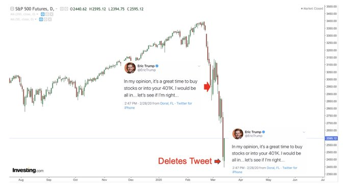
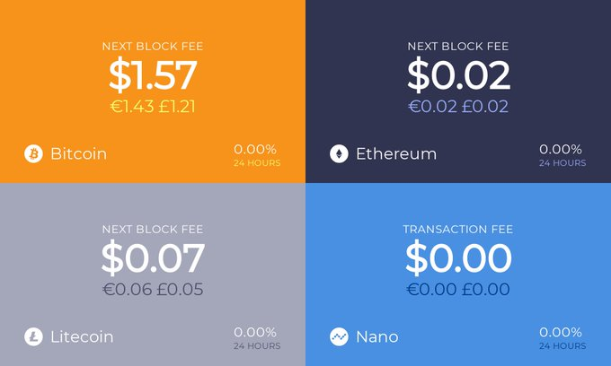
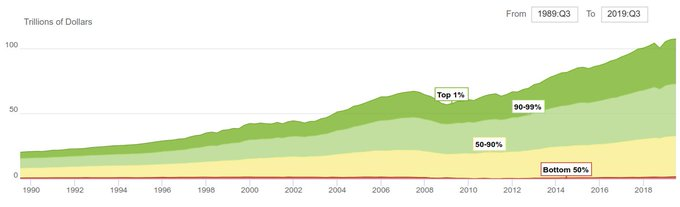
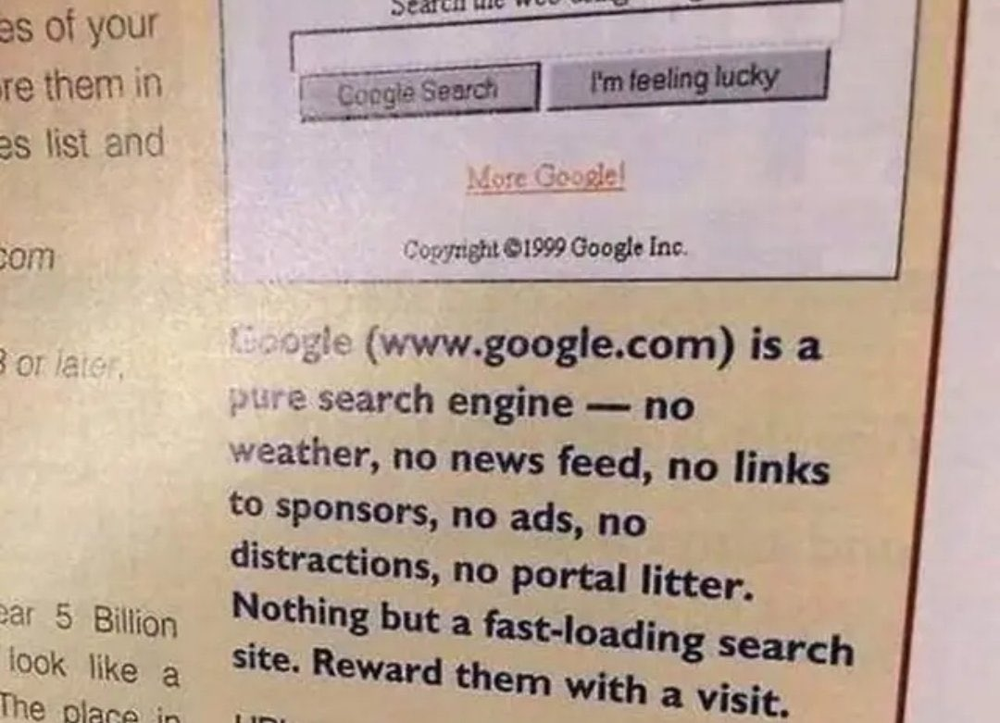

# Week 11


The new Picard show: I like how Picard was dismissive of the pyramids
labeling them as "vanity projects".

The tone is against AI Doomsday, fine. 

But they cld go easier on the Mary Sue. 

---

EDX - Daybreak \#music

[Link](https://youtu.be/Ax0wibf4_PA)

---

<blockquote class="twitter-tweet"><p lang="en" dir="ltr">Germany: Federal Government Wants to Make Hydrogen Cheaper--&quot;check whether electricity used for the production of green <a href="https://twitter.com/hashtag/hydrogen?src=hash&amp;ref_src=twsrc%5Etfw">#hydrogen</a> can largely be exempt from taxes, duties, and levies”--<a href="https://t.co/BoUB1eYNmH">https://t.co/BoUB1eYNmH</a> <a href="https://twitter.com/hashtag/hydrogennow?src=hash&amp;ref_src=twsrc%5Etfw">#hydrogennow</a> <a href="https://twitter.com/hashtag/decarbonise?src=hash&amp;ref_src=twsrc%5Etfw">#decarbonise</a> <a href="https://twitter.com/hashtag/h2?src=hash&amp;ref_src=twsrc%5Etfw">#h2</a> <a href="https://twitter.com/hashtag/fuelcell?src=hash&amp;ref_src=twsrc%5Etfw">#fuelcell</a> <a href="https://twitter.com/hashtag/zeroemissions?src=hash&amp;ref_src=twsrc%5Etfw">#zeroemissions</a> <a href="https://twitter.com/hashtag/hydrogeneconomy?src=hash&amp;ref_src=twsrc%5Etfw">#hydrogeneconomy</a> <a href="https://t.co/RGxgmWoCry">pic.twitter.com/RGxgmWoCry</a></p>&mdash; FuelCellsWorks (@fuelcellsworks) <a href="https://twitter.com/fuelcellsworks/status/1239191981395529732?ref_src=twsrc%5Etfw">March 15, 2020</a></blockquote> <script async src="https://platform.twitter.com/widgets.js" charset="utf-8"></script>

---

"Study Links Nike, Adidas And Apple To Forced Uighur Labor" -- forbes.com

---

Hey this fukker was Clintonite, centrist extraordinaire. I'd listen to
him.

"Top banker and Clinton Treasury Secretary Robert Rubin said on Monday
that centrist Democrats must accept the increasing popularity of the
redistributive economic policies favored by Bernie Sanders and
Elizabeth Warren"

[Link](https://www.nytimes.com/2020/03/02/opinion/rubin-economy-democrats.html)

---

"@LAPDHQ

.. Here are the facts:

-There is no food shortage & stores will restock, so please don’t
 hoard.

-The water supply is clean & safe to drink, so there’s no need to buy
 water in bulk"

---

So Dark Matter is gone. Dark Energy was the result of an error in
measurement. Lota dark fail here.

"Astronomers simulated the formation of galaxies without including
dark matter, in what some see as a win for a controversial model of
the universe called Modified Newtonian Dynamics"

[Link](https://www.discovermagazine.com/the-sciences/does-the-universe-need-dark-matter-to-form-galaxies-a-controversial-model)

---

S. Miller Band *Serenade* sounds Led Zeppelin-ish.

---

"@ZeroHedgeRobot

Attention NHTSA: Second Tesla In A Week Has Plowed Through Storefront
In Coachella Valley"

---

"@jonst0kes

[On UK plan] I don’t say this lightly: if they deliberately let this
burn through the younger population in the name of keeping the economy
going, & it kills a bunch of ppl & then doesn’t work, it will go down
in history as the capitalist version of the Great Leap Forward"

[Link](https://mobile.twitter.com/jonst0kes/status/1238948389569560582)

---

Newton part 2? 

[Link](https://mobile.twitter.com/ChristophAdami/status/1239024035763236864)

---

Policy changes in reaction to the coronavirus reveal how absurd so
many of our rules are to begin with.

[Link](https://slate.com/news-and-politics/2020/03/coronavirus-tsa-liquid-purell-paid-leave-rules.amp)

---

"@FirstSquawk

NORWAY TO CLOSE ALL AIRPORTS AND SEAPORTS FROM MONDAY TO HALT SPREAD
OF CORONAVIRUS, PRIME MINISTER ANNOUNCES"

---

<blockquote class="twitter-tweet"><p lang="en" dir="ltr">This could be us but you think Bernie Sanders is &quot;too loud&quot; 🙄🙄🙄 <a href="https://t.co/YqRumFN48F">https://t.co/YqRumFN48F</a></p>&mdash; Jack Califano (@jackcalifano) <a href="https://twitter.com/jackcalifano/status/1238872868806688769?ref_src=twsrc%5Etfw">March 14, 2020</a></blockquote> <script async src="https://platform.twitter.com/widgets.js" charset="utf-8"></script>

---

That was fast

"@Breaking911

United Kingdom and Ireland added to Coronavirus travel ban - VP Pence"

---

Yeah [VIX](../../2021/01/stats.html#vix) has seen 75, and is generally above 50. Thanks but no thanks.

Junk bond rate on 03-12, 8.81%, it was 6.10% a week ago.

---

"@JTSEO9

Tough love for the EU+UK.  The EU needs to stop all flights
themselves.  I am sure the public is already doing that, but they just
need to shut down and focus.  Allowing Super Spreaders to run rampant
is not cool.  I would be trapped, but I am cool with that"

---

"@elerianm

For those of us who have seen this dynamic play out elsewhere, it's
clear that cascading economic stops are reaching CRITICAL MASS.
Neither our #economy nor social norms and practices are wired for such
a shock Economic disruptions will be more widespread"

---

Wut 😶

"@iandonald_psych

The Italian model the aims to stop infection. The UKs wants infection BUT of particular categories of people. The aim of the UK is to have as many lower risk people infected as possible. Immune people cannot infect others; the more there are the lower the risk of infection"

[Link](https://mobile.twitter.com/iandonald_psych/status/1238518371651649538)

---

<blockquote class="twitter-tweet"><p lang="en" dir="ltr">The Mexicans may indeed end up paying for the wall! <a href="https://t.co/CYMHDJfggN">https://t.co/CYMHDJfggN</a></p>&mdash; Polemic Paine (@PolemicTMM) <a href="https://twitter.com/PolemicTMM/status/1238576659864924160?ref_src=twsrc%5Etfw">March 13, 2020</a></blockquote> <script async src="https://platform.twitter.com/widgets.js" charset="utf-8"></script>

---

"@MarkYusko

Public Service Announcement 

Everyone does realize what happened yesterday when \#Fed committed to
spend $1.5 TRILLION they don’t have, right?

They bailed out Citadel & Millennium"

---

Of course he had an "anti-poverty"
[message](https://www.nytimes.com/2008/01/30/us/politics/30cnd-edwards.html)
and was labeled a "populist".

---

Remember John Edwards.? A hand brushed him aside at the right moment
so swiftly I couldnt help but be amazed. They cleared the path for
brother Bam.

---

The Gillum thing could be about the establishment "voting" for who
they do not want as Biden's VP pick

---

"Nation's Nerds Wake Up In Utopia Where Everyone Stays Inside, Sports
Are Canceled, Social Interaction Forbidden"  -- babylonbee.com

---

<blockquote class="twitter-tweet"><p lang="en" dir="ltr">When the <a href="https://twitter.com/hashtag/COVID%E3%83%BC19?src=hash&amp;ref_src=twsrc%5Etfw">#COVIDー19</a> crisis is over, we need to reassess our traditional support for unfettered globalization/free trade &amp; instead pursue policies that make America INDEPENDENT on energy, medicines, technology, etc. We must stop our reliance on countries that want to harm us. <a href="https://t.co/aoH3JvF0dy">https://t.co/aoH3JvF0dy</a></p>&mdash; CesarConda (@CesarConda) <a href="https://twitter.com/CesarConda/status/1238812674575732737?ref_src=twsrc%5Etfw">March 14, 2020</a></blockquote> <script async src="https://platform.twitter.com/widgets.js" charset="utf-8"></script>

---

Populism

[Link](https://www.theatlantic.com/international/archive/2020/03/what-is-populism/607600/?utm_source=feed)

---

"More cases are now reported every day in Europe than in China at its
peak, the WHO says"

---

"@NPR

At drive-through COVID-19 testing centers in South Korea, the test
takes 10 minutes at most.

Results are texted to you, usually the next day. And it's free — paid
for by the government"

---

"@ekathimerini

Greece Health Ministry rep Tsiodras announces new measures to curb
spread of coronavirus: Malls, cafes, bars, food outlets to close
(excepting home deliveries). Supermarkets to stay open"

---

Development is heavily reliant on the diversity of products each
country produces _locally_. Which means local know-how, technology.

"@scientificecon

No country has ever successfully developed based on free market
policies. The reason why most developing countries remain undeveloped
after 70 years of alleged development policies is the forced regime of
'free trade'"

---

'@GTCost

The speed w which companies that borrowed truck loads of cash to buy
back their shares over the last decade are now 'protecting their fin
health' by putting staff on unpaid leave fills me w wonder at how
efficient our markets really are in fu&king the 99.9% to protect the
0.1%"

---

<blockquote class="twitter-tweet"><p lang="en" dir="ltr">Denmark will temporarily close its borders to non-citizens in a move to curb the spread of coronavirus, the prime minister says <a href="https://t.co/iHWLPjXzqR">https://t.co/iHWLPjXzqR</a> <a href="https://t.co/oe9oIgGRKG">pic.twitter.com/oe9oIgGRKG</a></p>&mdash; CNN Breaking News (@cnnbrk) <a href="https://twitter.com/cnnbrk/status/1238547528527773699?ref_src=twsrc%5Etfw">March 13, 2020</a></blockquote> <script async src="https://platform.twitter.com/widgets.js" charset="utf-8"></script>

---

Econ grinding to halt, potential war, disease.. Some Clancy level shit.

---

"@DeItaOne

RENAULT'S TWO SPANISH PLANTS TO STOP OUTPUT ON MONDAY AND TUESDAY DUE
TO LACK OF PARTS - SPOKESMAN"

---



---

"@evebitdap

FIAT WORKERS AT PLANT NEAR DETROIT REFUSE WORK ON VIRUS CONCERN"

---

<blockquote class="twitter-tweet"><p lang="en" dir="ltr">it might be time to retire my pinned tweet. <a href="https://t.co/t1aOKV74LJ">https://t.co/t1aOKV74LJ</a></p>&mdash; Mike Brown (@plutokiller) <a href="https://twitter.com/plutokiller/status/1238525218940805120?ref_src=twsrc%5Etfw">March 13, 2020</a></blockquote> <script async src="https://platform.twitter.com/widgets.js" charset="utf-8"></script>

---

Shoulda stayed away from that Castro bullshit. Told ya

"@PpollingNumbers

\#New @GravisMarketing Polls

\#Florida:

Biden 66% (+41)

Sanders 25%"

---

Goog Translation: "[French] municipalities and inter-municipal
authorities are becoming aware of the interest of hydrogen in
responding to the problems of their territories: decarbonization of
transport, air quality, energy transition, economic development or
industrial conversion. With the support of the Regions, now all
committed with dedicated roadmaps, they are joining forces with
manufacturers to deploy projects within structuring
ecosystems. Following the National Hydrogen Plan, the State is
preparing to retain hydrogen among the industrial priorities of its
2025 Productive Pact"

<blockquote class="twitter-tweet"><p lang="fr" dir="ltr"><a href="https://twitter.com/hashtag/HydrogenNow?src=hash&amp;ref_src=twsrc%5Etfw">#HydrogenNow</a> Philippe Boucly, Président de l&#39;<a href="https://twitter.com/afhypac?ref_src=twsrc%5Etfw">@afhypac</a> dans <a href="https://twitter.com/LaTribune?ref_src=twsrc%5Etfw">@LaTribune</a> <a href="https://t.co/FM8WflNBdB">https://t.co/FM8WflNBdB</a></p>&mdash; Symbio (@SymbioFCell) <a href="https://twitter.com/SymbioFCell/status/1238487559359082497?ref_src=twsrc%5Etfw">March 13, 2020</a></blockquote> <script async src="https://platform.twitter.com/widgets.js" charset="utf-8"></script>

---

The doctor guy from *Lost* could've been major action star he messed
it up. I saw him in some weirdo mindbucking scifish flick then
nothing. He needed his *Die Hard*.

---

Doing well in California is becoming a reverse-signal of sorts for a
candidate now.. Do well there it's a sign that something is wrong. Too
many uppity white-collar folk, more Latinos than blacks, .. Do well
there it says you will not do well in areas with blacks and working
class whites.  Maybe NYC is like that too. I like de Blasio, and I
dont believe he was fully committed for the Prez campaign, but the
other two NYC mayors who went all in, did terrible
nationally. Gulliani was a major flop. We all saw Bloomberg.

---

<blockquote class="twitter-tweet"><p lang="en" dir="ltr">Proton Motor Power Wins EUR 110,000 <a href="https://twitter.com/hashtag/FuelCell?src=hash&amp;ref_src=twsrc%5Etfw">#FuelCell</a> Order From Vonovia--<a href="https://twitter.com/ProtonMotor?ref_src=twsrc%5Etfw">@ProtonMotor</a> Power Systems will provide a 36 kW fuel cell system with a direct 400 VAC grid connection for a housing project in Bochum, Germany-<a href="https://t.co/KK0JeSFcEh">https://t.co/KK0JeSFcEh</a> <a href="https://twitter.com/hashtag/fuelcells?src=hash&amp;ref_src=twsrc%5Etfw">#fuelcells</a> <a href="https://twitter.com/hashtag/hydrogen?src=hash&amp;ref_src=twsrc%5Etfw">#hydrogen</a> <a href="https://twitter.com/hashtag/hydrogennow?src=hash&amp;ref_src=twsrc%5Etfw">#hydrogennow</a> <a href="https://twitter.com/hashtag/decarbonise?src=hash&amp;ref_src=twsrc%5Etfw">#decarbonise</a> <a href="https://t.co/1JCCpZoBqh">pic.twitter.com/1JCCpZoBqh</a></p>&mdash; FuelCellsWorks (@fuelcellsworks) <a href="https://twitter.com/fuelcellsworks/status/1238462675178393600?ref_src=twsrc%5Etfw">March 13, 2020</a></blockquote> <script async src="https://platform.twitter.com/widgets.js" charset="utf-8"></script>

---

Damn

Pic has him shaking hands with DJT

"@businessinsider

Brazilian President Jair Bolsonaro tests positive for coronavirus"

[Link](https://image.cnbcfm.com/api/v1/image/106441784-15841049150872020-03-12t190431z_2058224813_rc2jif9j6448_rtrmadp_3_usa-trump.jpg?v=1584105008&w=630&h=354)

---

\#nano

"@ColinLeMahieu

Widening the pipes > paying rent-seeking miners for priority on slow networks"

---

<blockquote class="twitter-tweet"><p lang="en" dir="ltr">The turning point of history has arrived <a href="https://t.co/lrZ5vepP8U">pic.twitter.com/lrZ5vepP8U</a></p>&mdash; Karl Sharro (@KarlreMarks) <a href="https://twitter.com/KarlreMarks/status/1238437072593137664?ref_src=twsrc%5Etfw">March 13, 2020</a></blockquote> <script async src="https://platform.twitter.com/widgets.js" charset="utf-8"></script>

---

More COVID19 Python code, data - how to get time series data, some
plotting etc.

[Link](https://github.com/twiecki/covid19/blob/master/covid19_growth.ipynb)

---

Trippy dude

How would Beavis and Butthead watch this video?

Break stuff! Break stuff! Yeah! Yeah!

---

Phantogram - You Don’t Get Me High Anymore \#music

[Link](https://youtu.be/jryzEU7WAlg)

---

'@tweetstar10

it's not the bottom until Warren Buffet wrangles a big bank into a shit OTC deal"

---

<blockquote class="twitter-tweet"><p lang="en" dir="ltr">&quot;Hydrogen &#39;can power virtually all container ships crossing the Pacific&#39; <br>Study shows that 99% of the vessels that traversed the ocean in 2015 could have been powered by clean H2, proving that the highly polluting sector can be decarbonised.&quot;<a href="https://twitter.com/hashtag/hydrogenNow?src=hash&amp;ref_src=twsrc%5Etfw">#hydrogenNow</a><br> <a href="https://t.co/cJ4o7TKWtc">https://t.co/cJ4o7TKWtc</a></p>&mdash; Hydrogen Energy (@EnergyHy2) <a href="https://twitter.com/EnergyHy2/status/1238371504775213056?ref_src=twsrc%5Etfw">March 13, 2020</a></blockquote> <script async src="https://platform.twitter.com/widgets.js" charset="utf-8"></script>

---

<blockquote class="twitter-tweet"><p lang="en" dir="ltr">Hundreds of hungry monkeys swarm across Thai street as &#39;rival gangs&#39; fight over food after tourists who normally feed them stay away because of coronavirus <a href="https://t.co/lQZ0sOzwDF">https://t.co/lQZ0sOzwDF</a> <a href="https://t.co/8TgrCTBrQ8">pic.twitter.com/8TgrCTBrQ8</a></p>&mdash; Daily Mail Online (@MailOnline) <a href="https://twitter.com/MailOnline/status/1238012197537755136?ref_src=twsrc%5Etfw">March 12, 2020</a></blockquote> <script async src="https://platform.twitter.com/widgets.js" charset="utf-8"></script>

---

"@JZieger

My wife has had a fever, dry cough, other flu symptoms, teaches in a
cooperative school that had a family member diagnosed w/
Covid-19. Still cannot get tested in WA state. Told to go to ER if
symptoms get bad enough. That's it"

---

"@sedespres

Note to congress: my kid has symptoms but can’t be tested because no
one in our community 'has tested positive yet'.

How will anyone test positive if they won’t be tested until someone
tests positive?"

---

"L.A. Aims to be First to Power U.S. City With Renewable Hydrogen"

[Link](https://www.bloomberg.com/amp/news/articles/2020-03-10/l-a-aims-to-be-first-to-power-u-s-city-with-renewable-hydrogen)

---

"@AmandaAskell

I panic bought boxes of tea before realizing that no one else in the
US gives a crap about having enough tea"

---

"@STOPFLEXIN

My manager went on a 8 week sabbatical on Jan 25th and him and his
wife rented a cabin in the North Carolina woods and didn’t bring no
type of technology with them so they could enjoy each other
company. Nigga finna come back to pure hell. He don’t even know Kobe
gone"

---

Reminder: none of BD control is done through Deep Shit, sorry Deep
Learning, "neural" archs which ppl assume are synonymous with "AI"
these days.

---

<blockquote class="twitter-tweet"><p lang="und" dir="ltr">2039 <a href="https://t.co/5gZsRikUe2">pic.twitter.com/5gZsRikUe2</a></p>&mdash; Wesbilen Music (@WesbilenMusic) <a href="https://twitter.com/WesbilenMusic/status/1238067445727932417?ref_src=twsrc%5Etfw">March 12, 2020</a></blockquote> <script async src="https://platform.twitter.com/widgets.js" charset="utf-8"></script>

---

<blockquote class="twitter-tweet"><p lang="en" dir="ltr">Los Angeles Moves To Power First U.S. City With Hydrogen --Los Angeles wants to become the first city in the nation to use renewable <a href="https://twitter.com/hashtag/hydrogen?src=hash&amp;ref_src=twsrc%5Etfw">#hydrogen</a> to generate electricity without using carbon-based natural gas--<a href="https://t.co/uVo7tGx8rZ">https://t.co/uVo7tGx8rZ</a> <a href="https://twitter.com/hashtag/hydrogennow?src=hash&amp;ref_src=twsrc%5Etfw">#hydrogennow</a> <a href="https://twitter.com/hashtag/decarbonise?src=hash&amp;ref_src=twsrc%5Etfw">#decarbonise</a> <a href="https://twitter.com/hashtag/zeroemissions?src=hash&amp;ref_src=twsrc%5Etfw">#zeroemissions</a> <a href="https://twitter.com/hashtag/h2?src=hash&amp;ref_src=twsrc%5Etfw">#h2</a> <a href="https://t.co/t3ficbsc4s">pic.twitter.com/t3ficbsc4s</a></p>&mdash; FuelCellsWorks (@fuelcellsworks) <a href="https://twitter.com/fuelcellsworks/status/1238133840729825281?ref_src=twsrc%5Etfw">March 12, 2020</a></blockquote> <script async src="https://platform.twitter.com/widgets.js" charset="utf-8"></script>

---


---

There Is No Buyer

What happens to corporate debt? 

\#RaoulPal

[Link](https://youtu.be/LGR8VmW6p8c?t=1942)

---

They'll be all trippin like the Japanese when Godzilla comes they
scream "gaicka, gaicka"!

---

Tigger gon lose his shit wit this corona. These mofokas are jumpy
little bitches. Soon they be screamin runnin around begging for
kool-aid magic kebab.

---

<blockquote class="twitter-tweet"><p lang="en" dir="ltr">MethFuel – Subproject “Flexible PEM Electrolysis” Awarded “Gigawatt Winner” at Energy Storage Europe 2020--1 MW PEM electrolysis operable up to 200 percent of nominal capacity--<a href="https://t.co/WuJkSAYeoD">https://t.co/WuJkSAYeoD</a> <a href="https://twitter.com/hashtag/fuelcell?src=hash&amp;ref_src=twsrc%5Etfw">#fuelcell</a> <a href="https://twitter.com/hashtag/fuelcells?src=hash&amp;ref_src=twsrc%5Etfw">#fuelcells</a> <a href="https://twitter.com/hashtag/hydrogen?src=hash&amp;ref_src=twsrc%5Etfw">#hydrogen</a> <a href="https://twitter.com/hashtag/hydrogennow?src=hash&amp;ref_src=twsrc%5Etfw">#hydrogennow</a> <a href="https://twitter.com/hashtag/decarbonise?src=hash&amp;ref_src=twsrc%5Etfw">#decarbonise</a> <a href="https://twitter.com/hashtag/h2?src=hash&amp;ref_src=twsrc%5Etfw">#h2</a> <a href="https://twitter.com/hashtag/zeroemissions?src=hash&amp;ref_src=twsrc%5Etfw">#zeroemissions</a> <a href="https://t.co/df16FylyHd">pic.twitter.com/df16FylyHd</a></p>&mdash; FuelCellsWorks (@fuelcellsworks) <a href="https://twitter.com/fuelcellsworks/status/1238069995478933505?ref_src=twsrc%5Etfw">March 12, 2020</a></blockquote> <script async src="https://platform.twitter.com/widgets.js" charset="utf-8"></script>

---

<blockquote class="twitter-tweet"><p lang="en" dir="ltr">Friendly reminder <a href="https://twitter.com/search?q=%24TSLA&amp;src=ctag&amp;ref_src=twsrc%5Etfw">$TSLA</a> (even with the 5-handle pre-mkt) is still a $110B market cap company that is net debt and, IMO, is about to start doing what it does best: incinerating cash. Let’s see how it does w/ negative YoY growth and a bottom line train wreck.</p>&mdash; Keubiko (@Keubiko) <a href="https://twitter.com/Keubiko/status/1238050822468091904?ref_src=twsrc%5Etfw">March 12, 2020</a></blockquote> <script async src="https://platform.twitter.com/widgets.js" charset="utf-8"></script>

---

<blockquote class="twitter-tweet"><p lang="en" dir="ltr">Iran asks the IMF for a loan for the first time since 1962, in an attempt to fight coronavirus, via <a href="https://twitter.com/AFP?ref_src=twsrc%5Etfw">@AFP</a></p>&mdash; Sarah Dadouch | سارة دعدوش (@SarahDadouch) <a href="https://twitter.com/SarahDadouch/status/1238050077412917251?ref_src=twsrc%5Etfw">March 12, 2020</a></blockquote> <script async src="https://platform.twitter.com/widgets.js" charset="utf-8"></script>

---

"@JacobCanfield

I lost everything in 2008

I am prepared this time

- Living well below my means.
- Massive cash position
- Zero debt
- Much more advanced knowledge of the markets this time around
- Hedged portfolio

12 years have passed, but the moment has haunted me since

Let’s fucking go"

---

Woha. Proximal w backtrackig


---

😂😂😂😂😂

Right.

Record. Curate. Keep it __Async__. Deliver.

"@ProfRavioli

A tip for professors who may be moving to online classes: 

Feature your pets & kids prominently esp. if they are doing dumb
things. Don’t stop the lecture when your husband yells MOTHAFUCKA in
the background cuz he dropped his drink"

[Link](https://twitter.com/ProfRavioli/status/1237678444072361984)

---

Education should be built, from ground-up for async, disconnected,
offline model. Then, that material is supplied "online" sure, but it
could as well be delivered through a USB stick.

---

"Offline online" approach is best. Class material becomes like a book,
visited, revisited as necessary but recorded once (and maintained as
necessary). Material should include code as well. See
[Prof](https://twitter.com/mluebbecke/status/1237752496023646210).

"Options for giving math talks and lectures online As part of social
distancing efforts to slow down the spread of the novel coronavirus,
several universities have now transitioned, or begun transitioning, to
online teaching models" -- terrytao.wordpress.com

---

<blockquote class="twitter-tweet"><p lang="en" dir="ltr">In case you were waiting: WHO declared PANDEMIC!!</p>&mdash; Yaneer Bar-Yam (@yaneerbaryam) <a href="https://twitter.com/yaneerbaryam/status/1237783451899756545?ref_src=twsrc%5Etfw">March 11, 2020</a></blockquote> <script async src="https://platform.twitter.com/widgets.js" charset="utf-8"></script>

---

Finally, da Proximal Grad Descent..

---


---

Boy did I blow through that Matlab / Python code conversion. I am
getting a T-shirt / motto it will say:

FUCKING MATLAB

---

15 days is not a big deal, if it means it will flatten that curve. 

"@MFischetti

\#COVID2019 Italy closed for 15 days"

---

<blockquote class="twitter-tweet"><p lang="en" dir="ltr">Work by colleagues at <a href="https://twitter.com/IDMOD_ORG?ref_src=twsrc%5Etfw">@IDMOD_ORG</a> that takes current best estimate for number of active <a href="https://twitter.com/hashtag/COVID19?src=hash&amp;ref_src=twsrc%5Etfw">#COVID19</a> infections and simulates forward under different degrees of social distancing. A 25% reduction in mixing results in more than a 50% drop in cases after 1 month relative to baseline. <a href="https://t.co/rE7wFsTklv">https://t.co/rE7wFsTklv</a></p>&mdash; Trevor Bedford (@trvrb) <a href="https://twitter.com/trvrb/status/1237934525281259521?ref_src=twsrc%5Etfw">March 12, 2020</a></blockquote> <script async src="https://platform.twitter.com/widgets.js" charset="utf-8"></script>

---

Surely gov off'ls can be unreliable, morons too, but ppl *expect*
them to be reliable, above a certain baseline. That's why they are
imbued with all this emergency capab, tax dollars, etc.

---

One might think "but wouldnt info spread, like peer-to-peer dude, and
everyone would know and act?". Nope. Expertise, gov matters. A
Whatsapp group, the random tuber jumping up and down has a voice, but
is it a reliable voice?

---

People are so locally minded (and that's fine). There has been
constant intnl news abt cov19, there were cases all around Tiggerland
but nothing in Tiggerland. Clearly the inbred officials were hiding
it. No peep from people tho.. It wasnt until gov announced the 1st
case, then tigger started talking about it, see ppl at the markets
etc. It's important to realize this - people __rely__ on governance,
nationally. Especially at times of despair.

---

<blockquote class="twitter-tweet"><p lang="en" dir="ltr">Why the fuck are we talking about bailing out companies that have been recklessly buying back stock the last 10 years?</p>&mdash; Stalingrad &amp; Poorski (@Stalingrad_Poor) <a href="https://twitter.com/Stalingrad_Poor/status/1237753350487040001?ref_src=twsrc%5Etfw">March 11, 2020</a></blockquote> <script async src="https://platform.twitter.com/widgets.js" charset="utf-8"></script>

---

"Live long enough, you'll see some crazy shit. Guaranteed" --  Anonymous

---

The non-nano-tech Iron Man suits were better.

---

<blockquote class="twitter-tweet"><p lang="en" dir="ltr">Starting later today, GitHub is donating up to 60,000 core-hours per day of idle GitHub Actions compute capacity to Folding@Home&#39;s efforts to find drug treatments for 2019-nCOV. <a href="https://t.co/G5QIlFc8zz">https://t.co/G5QIlFc8zz</a></p>&mdash; Nat Friedman (@natfriedman) <a href="https://twitter.com/natfriedman/status/1237466267998543872?ref_src=twsrc%5Etfw">March 10, 2020</a></blockquote> <script async src="https://platform.twitter.com/widgets.js" charset="utf-8"></script>

---

FOLDING@HOME

Donate computing power to the COVID19 analysis effort

[Link](https://foldingathome.org/2020/02/27/foldinghome-takes-up-the-fight-against-covid-19-2019-ncov/)

---

"@jonst0kes

We just published a framework that we've been using internally to
think about different \#covid19 pandemic scenarios, and game out
what's next"

[Link](https://twitter.com/jonst0kes/status/1237884955507789824)

---

@StevePtweets

At the risk of contradicting a narrative that has taken hold, exit polls show that turnout of younger voters actually DID increase in key states, but older voter increase was even greater, reducing the youth vote *share* of electorate

---

"Harvard Epidemiologist Marc Lipsitch: .. if you have a reproductive
number of an infectious disease of around two, which seems to be the
estimates that we're getting right now..., then at a minimum, half the
adult population needs to become infected before the spread can stop
permanently. This is not an ungrounded estimation, but simply the
basic math of epidemics"

[Link](https://www.spiegel.de/international/world/i-don-t-think-the-virus-can-be-stopped-anymore-a-03d404e6-762b-42fb-ac48-e4a8f03a2f2b-amp)

---

"Coronavirus: Up to 70% of Germany could become infected - Merkel"

---

"@carlquintanilla

Stock market that feared Bernie Sanders' socialist agenda now hinges
on hopes for corporate rescue packages"

---

Let's make it permanent. Less interaction.

"@DhruvKhullar

Is there any reason to go back to shaking hands even after \#COVID19?"

---

Is the oil move a plot by RU and SA both to destroy US shale?
Fine. Destroy the motherfuckers.

---

<blockquote class="twitter-tweet"><p lang="en" dir="ltr">The government is attempting to exploit anger at tech companies to pass a law that intentionally undermines digital security (<a href="https://t.co/up4cseuDD1">https://t.co/up4cseuDD1</a>), and censors speech. That such a law is even being considered by Congress is a national disgrace.</p>&mdash; Edward Snowden (@Snowden) <a href="https://twitter.com/Snowden/status/1237707215903096834?ref_src=twsrc%5Etfw">March 11, 2020</a></blockquote> <script async src="https://platform.twitter.com/widgets.js" charset="utf-8"></script>

---

"@Snowden

Remember, the EARN IT act is only the latest attack in the
government's very long war on encryption. Switzerland's most sensitive
communications-security company was secretly run by the CIA. There is
nothing these people won't do to stamp out the idea of a private
conversation"

---

"@tyillc

Note the role of Taiwan's Medicare for All in preventing a pandemic.
Wonder how many analysts factor in the cost of a pandemic when saying
US cannot afford Medicare for All"

[Link](https://mobile.twitter.com/tyillc/status/1237508801860743168)

---

"@intellenergy

Great to see that The European Commission has announced the Clean Hydrogen Alliance"

[Link](http://ow.ly/v3sp50yIyTc)

---

She could also be angling for a Biden cab position. Why not? It's
perfectly fine thing to do. Wouldn't we want a prog in such a cab? I
dont think her endorsement would change anything on the ground
anyway. Portion of her prog base had left for Bern already (one of the
reasons why she could not gain momentum).

"Why didn't Warren endorse Bernie when she could?"

---

Economics aside govs would be scared of ppl rioting. Helicopter $
is then bribe. Hey, lota politics is built on interest-group bribe. 

---

"@AlexSaundersAU

BREAKING NEWS: The Australian government have just announced
helicopter money live on Sky News. Pensioners, New Start & Small
Businesses to receive $500 hand outs. More details to come..."

---

Junk bond rates are in the upswing, yield at 7.69% from 6.10% on Mar 5.

[Link](../../2021/01/stats.html#junkbond)

---

"@vol_christopher

... The credit markets are going to tell you much more in the next few
weeks as to the long term likelihood of continued equity volatility"

---

The "store front" of the prog left became "too diverse", too
non-American in terms of others' perception. There are some fine
people there, no doubt, most are culturally American, but the message
should not be "multi-racial" which communicates "diversity for the f-k
of it", it is "we don't give an eff what your ethnicity is". Have to
strike a balance. Too multi-racial can put off whites, too Latin might
put off blacks.

---

The left needs to drop its need for orgasm from people agreeing with
them (also the turn-off they get from disagreement). "Agreement" on
issues might not equate to electoral success. Watch hot button issues,
even create them, get elected. Then implement issues and be judged on
the success of them.

I do understand the urgency around this though since so much got
diluted over the years due to errant, rabid centrism.

---

Plus voter mobilization is key part of the process, as in energizing
them to go to the voting booth. Issue based atomic polls might not
capture this dynamic. 

---

This was the Dem primary after all. If such ordering of priorities do
not sit well with some progs, maybe they should start their own party.

---

Atomic issues did not matter much, M4A, soc security, previous
mistakes on war and piece.. What mattered was the one hot button grand
issue, personality, and previous experience. Trump beat Hillary,
indirectly Obama, trampled on everything Dems hold dear including
sensibilities on race, now they want revenge -> Obama's VP. Biden
positioned himself for that and is winning.

---

"@Hoarse_Grant

Bernie's problem so far is that the youth vote is up, but the boomers
are voting at insane rates.. basically, all boomers do now is watch
MSNBC, they've been waiting for this for 4 years.. all the boomers
have been brainwashed into the thinking the world is falling apart,
but once trump gets out things will be ok again. 4 years of histrionic
coverage around trump has mobilized them, but to no greater purpose
than voting trump out"

---

A gentle reminder to ppl who are getting smacked even on their way out



---

"@jgrovum

Coronavirus Conference Canceled Because of Coronavirus"

---

"@ClayJaytonSEC

$RCL bought back $900 million worth of stock and paid out $1.8 billion
in dividends since 2017.

Now they want a government bailout"

---

"@FirstSquawk

UP TO 64,000 PEOPLE COULD BE INFECTED WITH CORONAVIRUS IN WASHINGTON
STATE WITHIN A FEW WEEKS IF ACTIONS AREN'T TAKEN NOW TO STOP ITS
SPREAD, GOV. INSLEE SAYS"

---

"@Peter_Atwater

Based on my twitter feed it would appear that bull markets are
evidence-driven while sell-offs are all about psychology"

---

<blockquote class="twitter-tweet"><p lang="en" dir="ltr">WOW! POWERED BY HYDROGEN! Its only emission is water. Look at this....maybe there’s hope yet!! <a href="https://t.co/jcrVZrQRQ1">https://t.co/jcrVZrQRQ1</a></p>&mdash; Bette Midler (@BetteMidler) <a href="https://twitter.com/BetteMidler/status/1236723666227998721?ref_src=twsrc%5Etfw">March 8, 2020</a></blockquote> <script async src="https://platform.twitter.com/widgets.js" charset="utf-8"></script>

---

<blockquote class="twitter-tweet"><p lang="en" dir="ltr">New battery chemistry.</p>&mdash; Benedict Evans (@benedictevans) <a href="https://twitter.com/benedictevans/status/1168279470156865536?ref_src=twsrc%5Etfw">September 1, 2019</a></blockquote> <script async src="https://platform.twitter.com/widgets.js" charset="utf-8"></script>

---

F..ing Guinea. They f...ed it up for everyone again. The Roman Empire
wasn't bad enough? Here have some corona.

---

"@JasmineLBrown

The Atlantic: "Coronavirus: The Case for Canceling Everything. Social
distancing is the only way to stop the coronavirus. We must start
immediately"

[Link](https://www.theatlantic.com/ideas/archive/2020/03/coronavirus-cancel-everything/607675/)

---

Greco bro.. Ela re malaka

Guy is strong supporter of H2, v good.

BTW when interviewer asked "is H2 a replacement for solar and wind
energy" he shoulda said it is not a replacement, it is a storage
method for intermittend wind and solar energy.

"@H2Europe

This morning, during @euronews’s \#GoodMorningEurope, our SecGen
@Chatzimarkakis commented the \#industrialstrategy of Commissioner
@ThierryBreton and explained why the \#energytransition needs
\#hydrogen to have more \#renewables"

[Link](https://twitter.com/H2Europe/status/1237313983826272256)

---

Another point here is IN came to the possession of bunch of paper to
write on. IMO this was key - in computer science the only difference
between two computing machines, finite-state automata, and the Turing
machine is an (infinite) tape. The latter is the basis of all
computing, more powerful, because it can write and
__remember__. Essentially modern computing, and perhaps human adv
thinking, is largely based on writing, we can achieve by [a
lot](https://www.cs.cmu.edu/~mblum/research/pdf/grad.html) by writing,
going back to it, revising, extending.

---

So the plague at the time helped Newton become what he is. Plague was
raging outside he was studying. If this WuFlu gets worse maybe we'll
get some good scientists out of it?

Gleick, *Isaac Newton*: "[Then] came the epidemic.  Three men in
London succumbed in a single house; by January the plague, this
disease of population density, was spreading from parish to parish,
hundreds dying each week, then thousands. Before the outbreak ran its
course, in little more than a year, it killed one of every six
Londoners...

The colleges of Cambridge began shutting down.  Fellows and students
dispersed into the countryside.  Newton returned home. He built
bookshelves and made a small study for himself. He opened the nearly
blank thousand-page commonplace book [empty notebook] he had inherited
from his stepfather and named it his Waste Book. He began filling it
with reading notes. These mutated seamlessly into original research.
He set himself problems; considered them obsessively; calculated
answers, and asked new questions. He pushed past the frontier of
knowledge (though he did not know this). The plague year was his
transfiguration. Solitary and almost incommunicado, he became the
world’s paramount mathematician"

---

Great name - Sunfire

---


---

<blockquote class="twitter-tweet"><p lang="en" dir="ltr">Congratulations Sunfire!<a href="https://t.co/LWZMczXGj7">https://t.co/LWZMczXGj7</a></p>&mdash; f-cell (@fcell_Germany) <a href="https://twitter.com/fcell_Germany/status/1237278921126797312?ref_src=twsrc%5Etfw">March 10, 2020</a></blockquote> <script async src="https://platform.twitter.com/widgets.js" charset="utf-8"></script>

---

Meltdown


---

"@GTCost

[T]raditional fiscal stimulus won’t work by itself, as it didn’t work
in Japan. It is too selective & relies on ‘trickle down or up’
fallacy. Need debt write downs, direct stimulus to households"

---

<blockquote class="twitter-tweet"><p lang="en" dir="ltr">I think we&#39;re going to find out that what people really want isn&#39;t gold, or bitcoins or even toilet rolls -- it&#39;s dollars.</p>&mdash; Jo Michell (@JoMicheII) <a href="https://twitter.com/JoMicheII/status/1237061375014449160?ref_src=twsrc%5Etfw">March 9, 2020</a></blockquote> <script async src="https://platform.twitter.com/widgets.js" charset="utf-8"></script>

---

There is a thing called Lipschitz continuity in Analysis. My mind
keeps autocompleting "dipshit" instead of Lipschitz 🙄

---

<blockquote class="twitter-tweet"><p lang="en" dir="ltr">It wasn&#39;t a bull &quot;&quot;market&quot;&quot;. It was a despicable decade long central bank policy to save criminal bankers, based on delusional and unabated credit/money creation, leading to the largest misallocation of capital in history. <a href="https://t.co/UQCWR7qTx6">https://t.co/UQCWR7qTx6</a></p>&mdash; Limerick King (@TheLimerickKing) <a href="https://twitter.com/TheLimerickKing/status/1237022754718789632?ref_src=twsrc%5Etfw">March 9, 2020</a></blockquote> <script async src="https://platform.twitter.com/widgets.js" charset="utf-8"></script>

---

"@FinancialTimes

The EU will unveil plans for a ‘clean hydrogen’ alliance this week to
accelerate Brussels’ push towards carbon neutrality and set out a more
assertive industrial approach to competition from China and elsewhere"

---

<blockquote class="twitter-tweet"><p lang="en" dir="ltr">“What oil means today as an energy source will be hydrogen in the future,” parliamentary state secretary. With <a href="https://twitter.com/bparkx?ref_src=twsrc%5Etfw">@bparkx</a> <a href="https://twitter.com/hashtag/ClimateChange?src=hash&amp;ref_src=twsrc%5Etfw">#ClimateChange</a> <a href="https://twitter.com/hashtag/hydrogen?src=hash&amp;ref_src=twsrc%5Etfw">#hydrogen</a> <a href="https://twitter.com/hashtag/Energiewende?src=hash&amp;ref_src=twsrc%5Etfw">#Energiewende</a> <a href="https://twitter.com/hashtag/cleanenergy?src=hash&amp;ref_src=twsrc%5Etfw">#cleanenergy</a> <a href="https://t.co/UMfVr12vo4">https://t.co/UMfVr12vo4</a></p>&mdash; Vanessa Dezem (@vanessadezem) <a href="https://twitter.com/vanessadezem/status/1223204203012726784?ref_src=twsrc%5Etfw">January 31, 2020</a></blockquote> <script async src="https://platform.twitter.com/widgets.js" charset="utf-8"></script>

---

What a waste

"A natural gas power plant can't always send excess energy into the
grid, frequently leading to waste as the gas is flared or vented
away. However, a plant in Dresden, New York thinks it has a solution:
use that surplus to generate some digital cash"

[Link](https://www.engadget.com/amp/2020/03/08/new-york-power-plant-mines-bitcoin)

---

"@Stalingrad_Poor

Love people calling these moves we are seeing right now 'crazy'. This
is not crazy. What was crazy was the reckless monetary policies of
central banks that led to this"

---

"@SperanzaGrazia

I live in Bergamo and work in Brescia, that is in Lombardia, the
Italian area most affected by the coronavirus. I can confirm the
situation is extremely serious. Everyone should apply all possible
precautions to avoid contact with others"

---

Back that azz up


---

"@carlquintanilla

Circuit-breakers today:

* If the S&P 500 declines 7%, (208 points), trading will pause for 15 min
 
* If declines 13%, (386 pts) trading will again pause for 15 mins
 
* If falls 20%, (594 pts) the markets would close for the day"


---

Mongo Santamaria - Que Maravilloso \#music

[Link](https://youtu.be/-m_skKUoGSU)

---

No kidding

"@GreekFire23

Saudi’s picked a hell of a time to launch a price war"

---

Wasnt JL a wife beater? 

---

Woha. "Woman is the N.. of the World"? By John Lennon. First time I
heard this song.

[Link](https://youtu.be/VS78MX8Zmdk?t=43)

---

👍

Centrally managed clock - Second Wave.

<blockquote class="twitter-tweet"><p lang="en" dir="ltr">Stop the insanity. Never change the time again. Leave it here forever.</p>&mdash; Clay Travis (@ClayTravis) <a href="https://twitter.com/ClayTravis/status/1236657031550992387?ref_src=twsrc%5Etfw">March 8, 2020</a></blockquote> <script async src="https://platform.twitter.com/widgets.js" charset="utf-8"></script>

---

<blockquote class="twitter-tweet"><p lang="en" dir="ltr">New York: Brookhaven Industrial Development Agency to Approves $32.7million Fuel Cell Installation--The project will create a 6-megawatt <a href="https://twitter.com/hashtag/fuelcell?src=hash&amp;ref_src=twsrc%5Etfw">#fuelcell</a> plant, providing enough energy to power some 600 homes.--bit.ly/2VQZpFu <a href="https://twitter.com/hashtag/fuelcells?src=hash&amp;ref_src=twsrc%5Etfw">#fuelcells</a> <a href="https://twitter.com/hashtag/hydrogennow?src=hash&amp;ref_src=twsrc%5Etfw">#hydrogennow</a> <a href="https://twitter.com/hashtag/decarbonise?src=hash&amp;ref_src=twsrc%5Etfw">#decarbonise</a> <a href="https://twitter.com/zeroemissions?ref_src=twsrc%5Etfw">@zeroemissions</a> <a href="https://t.co/ei9GViUgBl">pic.twitter.com/ei9GViUgBl</a></p>&mdash; FuelCellsWorks (@fuelcellsworks) <a href="https://twitter.com/fuelcellsworks/status/1236921160522027008?ref_src=twsrc%5Etfw">March 9, 2020</a></blockquote> <script async src="https://platform.twitter.com/widgets.js" charset="utf-8"></script>

---

"@BNONews

BREAKING: Britain's FTSE 100 index plummets nearly 9% in early trading"

---

Voters cant create  policy. Customers can't invent products. What else is new?

"Students don't know what's best for their own learning"

[Link](https://mobile.twitter.com/e_d_andersen/status/1236926495261589504)

---

Gold will never form the basis of another world currency, neither will
Bitcoin.

---

Aw gov spends too much, will collapse the dollar, yields will rise, we
will go back to the gold standard, yadi yadi yada...He's been waiting
for that shit forever.

<blockquote class="twitter-tweet"><p lang="en" dir="ltr">I repeat this every year hoping to dispel the myth of gold/miners in an economic collapse. I&#39;m currently listening to Schiff on QTR podcast. It&#39;s like this guy has never bothered to look at a chart or he is trying to pull in more suckers. <a href="https://t.co/xlb0pqpHpb">pic.twitter.com/xlb0pqpHpb</a></p>&mdash; Jin SEO (@JTSEO9) <a href="https://twitter.com/JTSEO9/status/1236753694630313989?ref_src=twsrc%5Etfw">March 8, 2020</a></blockquote> <script async src="https://platform.twitter.com/widgets.js" charset="utf-8"></script>

---

Here is the idea of interaction for most. Bunch of people standing
around, they come together, and everyone turns to the person to their
right, puts a finger up the ass. Everyone else does the same. Now you
formed a circle, and the circle is __connected__. Then they turn this
circle and start singing Kumbaya... This is the ideal for most people.

---

Deaths due to war, disease etc are directly proportional to the
density of a population. I wrote about it on 2011,
[here](../../2011/11/logistic-equation.html) and [here](../../2011/12/more-on-logistic-equation.html).

Logistic equation, the best predictor of population growth, works well
because it includes a death rate inversely proportional to the density
of a population. Density means more butting heads on resources, more
physical interaction that create conditions ripe for war and
disease.

Decrease interaction. The ideal soc for most is still dumb villagers
in their dumb villages worhipping to bones and stray cats, dogs, with
weirdo rituals. We need to get out, sparsely populate the Earth, even
the areas over and under the sea.

---

```python
w =  [1.0, 1.0, 1.0, 1.0]
print ('perfect equality', gini(p,w))
```

```text
perfect equality 0.0
```

---

How did inequality change in US over the years? I used "wealth by
wealth percentile group" [chart](https://www.federalreserve.gov/releases/z1/dataviz/dfa/distribute/chart/#range:1989.3,2019.3)
from the FED and calculated the Gini coefficient at various times. Code based on [script](https://github.com/ICEACE/MATLAB/blob/master/gini.m).



Output (the lower the better) says inequality became worse under
Clinton, W (worst) and Obama. It improved under Trump 😶.

That's effin centrism for you, the same old same old, no improvements,
just a *little* worse then Reps (major selling point), and even once
in a while getting smacked around on their own backyard by an outlier
Rep.


```python
def gini(pop,val):
    pop = list(pop); pop.insert(0,0.0)
    val = list(val); val.insert(0,0.0)        
    poparg = np.array(pop)
    valarg = np.array(val)
    z = valarg * poparg;
    ord = np.argsort(val)
    poparg    = poparg[ord]
    z = z[ord]
    poparg    = np.cumsum(poparg)
    z    = np.cumsum(z)
    relpop = poparg/poparg[-1]
    relz = z/z[-1]    
    g = 1 - np.sum((relz[0:-1]+relz[1:]) * np.diff(relpop))
    return np.round(g,3)

p = [0.01, 0.09, 0.40, 0.50]

print ('1992', gini(p,[5.69, 8.16, 8.32, 0.95]))

print ('2000', gini(p,[12.59, 14.56, 13.86, 1.45] ))

print ('2008', gini(p,[18.99, 24.60, 19.73, 1.17] ))

print ('2016',gini(p,[27.27, 33.29, 25.43, 1.00] ))

print ('2019',gini(p,[34.54, 40.12, 30.90, 1.67] ))
```

```text
1992 0.401
2000 0.41
2008 0.463
2016 0.485
2019 0.472
```

---


---

"@DavidBeckworth

Time to say your final goodbyes to the positive treasury yield world. It was a valiant fight, treasury securities. You held out much longer than JGBs and BUNDS, but eventually you succumbed too"

---

<blockquote class="twitter-tweet"><p lang="en" dir="ltr">ENTIRE US TREASURY CURVE BELOW 1% FOR THE FIRST TIME IN HISTORY</p>&mdash; I N T Σ L W Λ V Σ 🦠 (@inteldotwav) <a href="https://twitter.com/inteldotwav/status/1236844195958214657?ref_src=twsrc%5Etfw">March 9, 2020</a></blockquote> <script async src="https://platform.twitter.com/widgets.js" charset="utf-8"></script>

---

@FirstSquawk

CORONAVIRUS UPDATE: ITALY HAS NOW PUT 16M PEOPLE ON LOCK DOWN ||
POLICE ARE PULLING WEAPONS ON PEOPLE IF THEY TRY TO LEAVE || HOSPITALS
ARE AT BREAKING POINT || DOCTORS HAVE NOW WARNED THAT THEY MIGHT HAVE
TO CHOOSE WHO GETS INTENSIVE CARE - TOS EDITOR

---

Content creators know that I'm a free rider, will  not pay for ur shit. Go behind a paywall, ur content is dead to me.

---

HFC tractor from Netherlands

[Link](https://mobile.twitter.com/Carlholthausen/status/1236204628737429504)

---

"Chuck Norris will never have an heart attack. His heart isn't nearly foolish enough to attack him"

---


Volatity Index 

[Link](../../2021/01/stats.html#vix)

---

Selling... spinning what you dont have as 'feature', not a bug.




---

Dude. MOAB totally did not work. What is this thing made of?

The outside of the dome where MOAB hit got trashed. Realistic. I dig it.

\#dome

---

Watching *Under the Dome*. They're abt to drop a MOAB on the dome.

\#dome

---

"World's Largest Hydrogen Plant Opens in 
Fukushima"

[Link](https://fuelcellsworks.com/news/worlds-largest-hydrogen-plant-in-fukushima-opens/)

---

MIT: "Decarbonization of the electric grid is also a major motivator
to use hydrogen for large-scale energy storage, with potential
benefits for transportation and other segments of the economy"

[Link](https://mobile.twitter.com/MarLohMuc/status/1218805935805730817)

---

New PM in Malaysia replacing Mahathir. I like Mahathir (came back
again in his 90s) but if he is getting old, I understand... Also tired
of hearing abt his protege / nemesis Anwar, guy's name is constantly
floated but never makes it to PM. Less of that the better. This new
guy I'd never heard of. Good.

---

Climate skepticism is not a "conservative" position. Being a con has
nothing to do with views on climate. UK cons are pro-climate (we can
thank Thatcher for that). Climate, a secondary issue in terms of
potential agreement, was turned into a primary one to hide the fact
that US became a one-party state. Abortion, guns serve the same
purpose.

UK suffered from one-party-ism too, thanks to "Third Way Blair", but
their cons went berserk in different ways. Anyway, not going into that
anymore, as promised 😉

---

"@TimOBrien

Trump said he didn’t know that people could die from the flu. 

His grandfather died from the flu"

---

<blockquote class="twitter-tweet"><p lang="en" dir="ltr">This guy lives off an Heirress fortune. <a href="https://t.co/gXy23ekagj">https://t.co/gXy23ekagj</a></p>&mdash; Nomiki Konst (@NomikiKonst) <a href="https://twitter.com/NomikiKonst/status/1236405514923360257?ref_src=twsrc%5Etfw">March 7, 2020</a></blockquote> <script async src="https://platform.twitter.com/widgets.js" charset="utf-8"></script>

---

Orwell at your Doorbell :)

<blockquote class="twitter-tweet"><p lang="en" dir="ltr">“Ring as a company may be responsive to its customers,&quot; says EFF staff attorney <a href="https://twitter.com/sairahussain87?ref_src=twsrc%5Etfw">@sairahussain87</a>, &quot;but it’s ignoring the larger issue of profiling within neighborhoods...who are being captured on camera for no reason.” <a href="https://t.co/i9PtypRmg3">https://t.co/i9PtypRmg3</a></p>&mdash; EFF (@EFF) <a href="https://twitter.com/EFF/status/1236383618525614080?ref_src=twsrc%5Etfw">March 7, 2020</a></blockquote> <script async src="https://platform.twitter.com/widgets.js" charset="utf-8"></script>

---

<blockquote class="twitter-tweet" data-conversation="none"><p lang="en" dir="ltr">Being short <a href="https://twitter.com/search?q=%24TSLA&amp;src=ctag&amp;ref_src=twsrc%5Etfw">$TSLA</a> is like living in a neighborhood where everyone thinks piles of dog shit are worth hundreds of dollars each, I keep saying that dog shit is worth zero, and all my neighbors keep saying the dog is a shitting genius and dog shit price bro. 💩</p>&mdash; B Graham Disciple (@bgrahamdisciple) <a href="https://twitter.com/bgrahamdisciple/status/1126094721561108486?ref_src=twsrc%5Etfw">May 8, 2019</a></blockquote> <script async src="https://platform.twitter.com/widgets.js" charset="utf-8"></script>

---

What they really should have done is banning stock buybacks, but
hey.. 

"@AlderLaneeggs

The Short Sale Ban is coming on financial stocks and
transportation/travel companies...I smell this a mile away and feel it
in my bones.. "

---

Yees bitch, fuel-cells are space tech

"Before moon landing NASA tested out a lot of tech un seperate Gemini
missions.

Gemini 3 (Gemini’s first manned mission) was the first time a space
capsule changed its orbit mid-flight. Gemini 4 featured the first
space-walk. Gemini 5, the first use of oxygen-hydrogen fuel cells,
etc"

---

<blockquote class="twitter-tweet"><p lang="en" dir="ltr">I already preferred to avoid other people before it was cool.</p>&mdash; Mason Porter (@masonporter) <a href="https://twitter.com/masonporter/status/1236477046252920832?ref_src=twsrc%5Etfw">March 8, 2020</a></blockquote> <script async src="https://platform.twitter.com/widgets.js" charset="utf-8"></script>

---

U-oh. DJT net approv is going back to its usual low: around -10%
accord to 538 combined results.

---

Maybe the Chink did all this just to kill Trump from a distance.

---

"@Jkylebass

Wuhan \#Coronavirus : ‘recovered’ patient dies as China continues
coverup... China wouldn’t let CDC scientists in because they would
have found the truth of origin...

First, CCP infects the world with the potentially lab-developed Wuhan
Coronavirus,and now they seek to profit from selling the world masks
to help avoid the bio disaster. This is capitalism with Chinese
characteristics"

---

"As one panelist, Mahmoud Hanafy, Senior Vice President at Siemens,
put it, “The Middle East is a blessed region for energy.”

All seemed to agree, and they weren’t thinking about oil and gas.

That the energy transition is good news for the Middle East and North
Africa (MENA), that renewables could become a new source of export
income, growing even as income from hydrocarbons declines, was an
important insight that emerged.

Indeed, pilot projects now being launched thousands of miles away in
the Pacific, and planning in Europe, could hold great significance for
MENA. They concern the so-called ‘green hydrogen’ produced from
renewable energy"

[Link](https://oilprice.com/Energy/Energy-General/The-Hydrogen-Hype-Hits-The-Middle-East.amp.html)

---

Long-distance shipping of hydrogen will not require wildly new,
untested tech. We already ship liquified natural gas (LNG) at minus
160 Celcius. Go down 90 more that gets you H2 storage.

Then of course there is ammonia, storage at room temparature converted
easily into H2.

---

<blockquote class="twitter-tweet"><p lang="en" dir="ltr">World’s Largest Hydrogen Plant Opens in Fukushima--<a href="https://twitter.com/hashtag/Solar?src=hash&amp;ref_src=twsrc%5Etfw">#Solar</a>-powered <a href="https://twitter.com/hashtag/hydrogen?src=hash&amp;ref_src=twsrc%5Etfw">#hydrogen</a> station can produce enough gas to fill 560 <a href="https://twitter.com/hashtag/fuelcell?src=hash&amp;ref_src=twsrc%5Etfw">#fuelcell</a> vehicles a day. Olympic torch relay will burn fuel made at the solar-powered facility-<a href="https://t.co/ARIILTn2xJ">https://t.co/ARIILTn2xJ</a> <a href="https://twitter.com/hashtag/hydrogennow?src=hash&amp;ref_src=twsrc%5Etfw">#hydrogennow</a> <a href="https://twitter.com/hashtag/decarbonise?src=hash&amp;ref_src=twsrc%5Etfw">#decarbonise</a> <a href="https://twitter.com/fuelcellsworks?ref_src=twsrc%5Etfw">@fuelcellsworks</a> <a href="https://t.co/ZL0wAW6G57">pic.twitter.com/ZL0wAW6G57</a></p>&mdash; FuelCellsWorks (@fuelcellsworks) <a href="https://twitter.com/fuelcellsworks/status/1236354672170078213?ref_src=twsrc%5Etfw">March 7, 2020</a></blockquote> <script async src="https://platform.twitter.com/widgets.js" charset="utf-8"></script>

---

It's crazy we can deduce something, anything about such giant
constructions.. Very cool.

---


If there are infinitely many stars, why isn't our night sky infinitely
bright? Longer form below:

Webb, *Where is Everybody*: "Suppose the stars are uniformly
distributed throughout space. A star’s brightness decreases as the
square of its distance from an observer, but the number of stars
increases as the square of the distance from the observer. These two
effects cancel, and each grid shown above contributes the same amount
of brightness. Since there is an infinite number of these grids, the
night sky should be infinitely bright. Even allowing for nearby stars
blocking the light from distant stars, the night sky should be
blindingly bright. Why not?"

Answer: "It turns out that the paradox is explained by one of the most
dramatic discoveries ever made by astronomers: the universe has a
finite age. Since the universe is only about 13.8 billion years old,
the part we can see is finite in size. For the night sky to be as
bright as the surface of the Sun, the observable universe would have
to be almost 1 million times bigger than it is"

---

<blockquote class="twitter-tweet"><p lang="en" dir="ltr">I identify as a child less than 2 years old. I demand a child seat and free travel everywhere. <a href="https://t.co/kcDNR4viKg">https://t.co/kcDNR4viKg</a></p>&mdash; Miss Jo (@therealmissjo) <a href="https://twitter.com/therealmissjo/status/1236279221921746944?ref_src=twsrc%5Etfw">March 7, 2020</a></blockquote> <script async src="https://platform.twitter.com/widgets.js" charset="utf-8"></script>

---
