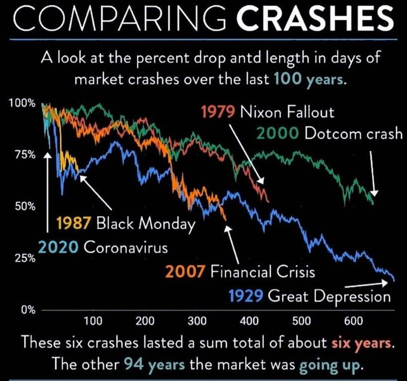
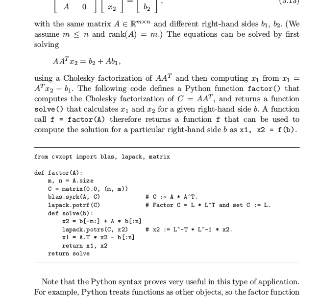
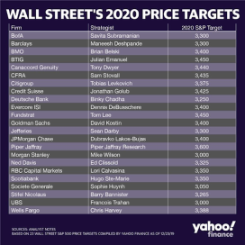
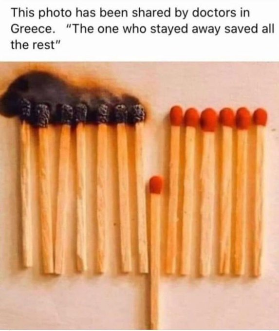
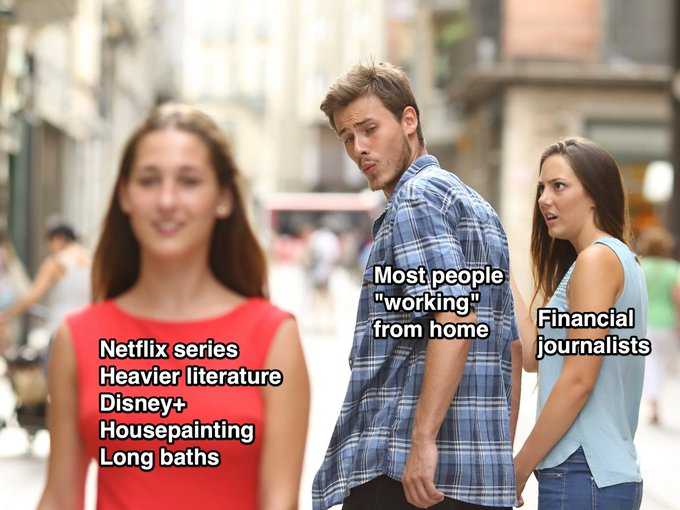
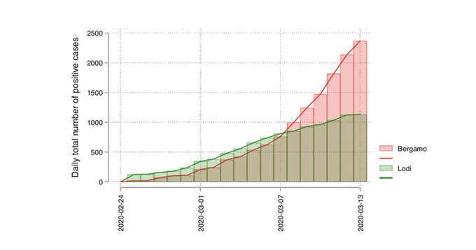

# Week 12

"@timmaughan

wow sprint tv ad 'you can’t leave the house so you need a new cellphone'"

---

God must be Bernie-or-bust voter

---

"@MacBrandt

Remember two weeks ago? Neither do I"

---

"@MarkYusko

Stunning to me how deeply ingrained \#BTFD mentality is...

Vast majority of people on @twitter, on TV, in broad media desperately
analyzing every tiny uptick in market to claim now is time to buy...

Will be a \#GenerationalBuyingOpportunity, but at MUCH lower levels

Still \#STFR"

---

Junk Bonds

```2020-03-19          11.51%``` 👀 👀 👀

---

Wer ist dein Vater

---

Whops - fall again

---

@Street_Insider

Trump said he will "demand" no stock buybacks for companies receiving aid $SPY

---

Corona: 39K more cases in one day, death rate 10.5 %.

I added a time series section (at the bottom), with an aggregate
plot. The raw data has more detailed, country level confirmed numbers
tho.

[Link](https://muratk3n.github.io/thirdwave/en/2020/02/corona.html)

---

"At present, it is tempting to estimate the case fatality rate by
dividing the number of known deaths by the number of confirmed
cases. The resulting number, however, does not represent the true case
fatality rate"

[Link](https://www.worldometers.info/coronavirus/coronavirus-death-rate/)

---

Dude. Trump is now on EVERYDAY. For cor briefing. Some serious shit.

---

"@Richard_Florida

This is exactly right.

Phase 1: Social/ Physical Distancing for 4-8 weeks to flatten the curve 

Phase 2: A New Normal Returns in Summer

Phase 3: Massive/ Universal Testing & Isolation of those with the virus combined with better 
therapies

Phase 4: Vaccine"

[Link](https://mobile.twitter.com/Richard_Florida/status/1240763115760951297)

---

"@investingidiocy

All the people who mocked me when I built a home office in the garden
last summer... enjoy trying to work next week with your kids fighting
over your desk / kitchen table"

---

Vappiano, ka-boom.

---

<blockquote class="twitter-tweet"><p lang="en" dir="ltr">They hounded Aaron Swartz literally to death for doing this. <a href="https://t.co/5rq0idpWj6">https://t.co/5rq0idpWj6</a></p>&mdash; Laurie Voss (@seldo) <a href="https://twitter.com/seldo/status/1240648567426965504?ref_src=twsrc%5Etfw">March 19, 2020</a></blockquote> <script async src="https://platform.twitter.com/widgets.js" charset="utf-8"></script>

---

"@papicek

An uninsured COVID-19 patient just got her medical bill: $34,927.43"

[Link](https://time.com/5806312/coronavirus-treatment-cost/)

---

Couchin

---

<blockquote class="twitter-tweet"><p lang="en" dir="ltr">Olympic Flame for Tokyo 2020 Games to be Lit by Hydrogen Touches Down in Japan-Flame will be lit in Japan by <a href="https://twitter.com/hashtag/hydrogen?src=hash&amp;ref_src=twsrc%5Etfw">#hydrogen</a>-produced <a href="https://twitter.com/hashtag/solar?src=hash&amp;ref_src=twsrc%5Etfw">#solar</a> energy from Fukushima Prefecture. Hydrogen used to power the Games’ cauldron in Tokyo-<a href="https://t.co/K6mYV9foTg">https://t.co/K6mYV9foTg</a> <a href="https://twitter.com/hashtag/hydrogennow?src=hash&amp;ref_src=twsrc%5Etfw">#hydrogennow</a> <a href="https://twitter.com/hashtag/fuelcell?src=hash&amp;ref_src=twsrc%5Etfw">#fuelcell</a> <a href="https://twitter.com/hashtag/decarbonise?src=hash&amp;ref_src=twsrc%5Etfw">#decarbonise</a> <a href="https://t.co/lJXb0p8vDR">pic.twitter.com/lJXb0p8vDR</a></p>&mdash; FuelCellsWorks (@fuelcellsworks) <a href="https://twitter.com/fuelcellsworks/status/1241018400564031488?ref_src=twsrc%5Etfw">March 20, 2020</a></blockquote> <script async src="https://platform.twitter.com/widgets.js" charset="utf-8"></script>

---

<blockquote class="twitter-tweet"><p lang="en" dir="ltr">South Korea: 20MW <a href="https://twitter.com/hashtag/Hydrogen?src=hash&amp;ref_src=twsrc%5Etfw">#Hydrogen</a> <a href="https://twitter.com/hashtag/FuelCell?src=hash&amp;ref_src=twsrc%5Etfw">#FuelCell</a> Power Plant to be Built at Innovative Industrial Complex--Total amount of investment is 10 billion won, and construction is planned to start in August 2020 &amp; be completed by February 2022--<a href="https://t.co/3aHp12HKPz">https://t.co/3aHp12HKPz</a> <a href="https://twitter.com/hashtag/hydrogennow?src=hash&amp;ref_src=twsrc%5Etfw">#hydrogennow</a> <a href="https://twitter.com/hashtag/decarbonise?src=hash&amp;ref_src=twsrc%5Etfw">#decarbonise</a> <a href="https://twitter.com/hashtag/h2?src=hash&amp;ref_src=twsrc%5Etfw">#h2</a> <a href="https://t.co/XBv9qo0lHL">pic.twitter.com/XBv9qo0lHL</a></p>&mdash; FuelCellsWorks (@fuelcellsworks) <a href="https://twitter.com/fuelcellsworks/status/1240989712078307328?ref_src=twsrc%5Etfw">March 20, 2020</a></blockquote> <script async src="https://platform.twitter.com/widgets.js" charset="utf-8"></script>

---

Brian Greene is also a stringer..  Moderate some effin panel, talk up
science fine, but another failure... No cigar.

---

Right. Verlinde's model has no free parameters. A good thing. \#physics

---

\#voit \#physics "It seems to be very hard to get some people to
understand that the number of 'tests of string theory' is not 'very
few' but zero, for the simple reason that there are no predictions of
string theory, generic or otherwise"

[Link](https://www.math.columbia.edu/~woit/wordpress/?p=11675)

---

<iframe width="320" height="180" src="https://www.youtube.com/embed/0miaOAfrS5Y" frameborder="0" allow="accelerometer; autoplay; encrypted-media; gyroscope; picture-in-picture" allowfullscreen></iframe>

---

"@EamonJavers

I just got off the phone with former Bush NEC Director Larry
Lindsey. He says everyone is missing the “big bazooka” in the Senate
bill- massive payroll relief for small businesses in section 1105. He
says it could impact up to 80 MILLION American jobs.

Lawrence Lindsey says the section provides loans to small businesses
to cover payroll, and hugely incentivizes them not to lay anyone
off. The measure:

- covers employees making up to $100,000 per year

- loans forgiven ENTIRELY after 4 months if companies don’t lay anyone off"

---

Nice vid

"@_DaniBeck

Tired: 

Attending Zoom meetings.

Wired: 

Make the virtual background a video of you listening"

[Link](https://mobile.twitter.com/_DaniBeck/status/1240667484237201413)

---

<blockquote class="twitter-tweet"><p lang="en" dir="ltr">ZEG Power Raises NOK 130m to Deploy its Zero-Emission Hydrogen Production Technology--ZEG Power’s groundbreaking technology for clean <a href="https://twitter.com/hashtag/hydrogen?src=hash&amp;ref_src=twsrc%5Etfw">#hydrogen</a> production is attracting significant attention-<a href="https://t.co/S9AEnX56J5">https://t.co/S9AEnX56J5</a> <a href="https://twitter.com/hashtag/hydrogennow?src=hash&amp;ref_src=twsrc%5Etfw">#hydrogennow</a> <a href="https://twitter.com/hashtag/zeroemissions?src=hash&amp;ref_src=twsrc%5Etfw">#zeroemissions</a> <a href="https://twitter.com/hashtag/decarbonise?src=hash&amp;ref_src=twsrc%5Etfw">#decarbonise</a> <a href="https://twitter.com/hashtag/h2?src=hash&amp;ref_src=twsrc%5Etfw">#h2</a> <a href="https://twitter.com/hashtag/hydrogeneconomy?src=hash&amp;ref_src=twsrc%5Etfw">#hydrogeneconomy</a> <a href="https://t.co/xJG9IER8Qh">pic.twitter.com/xJG9IER8Qh</a></p>&mdash; FuelCellsWorks (@fuelcellsworks) <a href="https://twitter.com/fuelcellsworks/status/1240975846204203012?ref_src=twsrc%5Etfw">March 20, 2020</a></blockquote> <script async src="https://platform.twitter.com/widgets.js" charset="utf-8"></script>

---

Togetherness.. What does that even mean?

---

"@FirstSquawk

FRANCE INFECTIOUS DISEASE BOARD SAYS COMBINATION OF HYDROXYCHLOROQUINE
AND AZITHROMICIN WORKING VERY WELL"

---

"@NorthmanTrader

Corporate America:

2009-2019: Cheapest money cycle in history

2017: Biggest corporate tax cut in history

2018: Record corporate profits 

2019: Flat earnings growth

March 2020: Government bailouts please"

---


<blockquote class="twitter-tweet"><p lang="en" dir="ltr">Lmao. Epitome of fat marker linearity. Can’t believe we’re doing this. <a href="https://t.co/WBYTS4KLn3">https://t.co/WBYTS4KLn3</a></p>&mdash; Padraig Lysandrou (@lysandrou_) <a href="https://twitter.com/lysandrou_/status/1240726052772560896?ref_src=twsrc%5Etfw">March 19, 2020</a></blockquote> <script async src="https://platform.twitter.com/widgets.js" charset="utf-8"></script>

---

"@allisonpearson

My 24-yr-old has been paying National Insurance for two years. After
losing job due to corona, inquired about Jobseekers’ Allowance. But
can’t claim because needs to have been paying NI longer.

What happens to kids without homes & supportive parents?"

---

"@hkumed

'This is the worst time to relax because we’re at the highest risk
since this began,' said Prof @gmleunghku, Dean of @hkumed. \#COVID19
\#Hongkong"

[Link](https://mobile.twitter.com/hkumed/status/1240927210929664000)

---

Aw but we cant give handouts to everyone..

And AGAIN we are talking about corporate handouts.

"@DanielDenvir

Remember how the media treated the debate over Medicare for All and
other basic social democratic protections like they were some petty
fucking "ideological" game rather than a matter of life and death?"

---

Daaaaam

"@Breaking911

URGENT: Los Angeles Mayor says he will ‘deputize’ city officials to
‘drive around’ & enforce the “stay at home” order, implying there will
be arrests if citizens don’t comply

'People are getting guns. They’re going crazy...'

'We’ll pay ‘em a visit...'"

---

<blockquote class="twitter-tweet"><p lang="en" dir="ltr">*TRUMP SUPPORTS U.S. TAKING EQUITY STAKES IN COMPANIES IT AIDS</p>&mdash; lemasabachthani (@lemasabachthani) <a href="https://twitter.com/lemasabachthani/status/1240681224122834951?ref_src=twsrc%5Etfw">March 19, 2020</a></blockquote> <script async src="https://platform.twitter.com/widgets.js" charset="utf-8"></script>

---

@EFF 

Ring: Doorbells that surveil your community reduce crime!

Statistics: Not really.

[Link](https://www.cnet.com/features/rings-work-with-police-lacks-solid-evidence-of-reducing-crime/)

---

Yes I saw quite a few coronav survival stories, but most say they get
their ass kicked something fierce, were badly shaken. So 1 out of 10
losing that fight is not crazy. 

---

Free-market Reps never liked this shit anyway, it distorts
prices.. Prog left didn't like it bcz it enriched CEOs, the top 1%.
SB canceling could also deny a line of attack on DJT during the
general. Good politics.

---

👍👊 Very awesome

"@morningmoneyben

Trump says he is OK with bans on stock buy backs for companies that
get Federal support"

---

<blockquote class="twitter-tweet"><p lang="en" dir="ltr">“We have contained this. I won’t say it&#39;s airtight, but it’s pretty close to airtight” - Larry Kudlow Feb 25 <a href="https://t.co/56YuqhK0HC">https://t.co/56YuqhK0HC</a></p>&mdash; Sven Henrich (@NorthmanTrader) <a href="https://twitter.com/NorthmanTrader/status/1240656545190498304?ref_src=twsrc%5Etfw">March 19, 2020</a></blockquote> <script async src="https://platform.twitter.com/widgets.js" charset="utf-8"></script>

---


"@ScottMinerd

The US Govt is able to sustain this \#economy using extreme measures,
but it has to come to the table like a distressed investor. Demand
good collateral and warrants for the upside once this crisis passes"

---

<blockquote class="twitter-tweet"><p lang="en" dir="ltr">Czech City of Usit-nad Laben to Build its First Hydrogen Station--The construction begins in 2021 and will have CZK 31 million in funding. The completion of the station is expected by the end of 2021--<a href="https://t.co/Z3JDUxM6ht">https://t.co/Z3JDUxM6ht</a> <a href="https://twitter.com/hashtag/hydrogennow?src=hash&amp;ref_src=twsrc%5Etfw">#hydrogennow</a> <a href="https://twitter.com/hashtag/decarbonise?src=hash&amp;ref_src=twsrc%5Etfw">#decarbonise</a> <a href="https://twitter.com/hashtag/fuelcell?src=hash&amp;ref_src=twsrc%5Etfw">#fuelcell</a> <a href="https://twitter.com/hashtag/zeroemissions?src=hash&amp;ref_src=twsrc%5Etfw">#zeroemissions</a> <a href="https://twitter.com/hashtag/h2?src=hash&amp;ref_src=twsrc%5Etfw">#h2</a> <a href="https://t.co/4nYJ5PuFBd">pic.twitter.com/4nYJ5PuFBd</a></p>&mdash; FuelCellsWorks (@fuelcellsworks) <a href="https://twitter.com/fuelcellsworks/status/1240619429823680513?ref_src=twsrc%5Etfw">March 19, 2020</a></blockquote> <script async src="https://platform.twitter.com/widgets.js" charset="utf-8"></script>

---

"Axios has compiled a timeline of the earliest weeks of the
coronavirus outbreak in China, highlighting when the cover-up started
and ended — and showing how, during that time, the virus already
started spreading around the world, including to the United States"

[Link](https://www.axios.com/timeline-the-early-days-of-chinas-coronavirus-outbreak-and-cover-up-ee65211a-afb6-4641-97b8-353718a5faab.html)

---


<blockquote class="twitter-tweet"><p lang="en" dir="ltr">I am reliving all my mass bio attack simulations at <a href="https://twitter.com/MIIS?ref_src=twsrc%5Etfw">@MIIS</a> circa 2009. We know. <a href="https://t.co/fx55yW7unx">https://t.co/fx55yW7unx</a></p>&mdash; Aaron Stein (@aaronstein1) <a href="https://twitter.com/aaronstein1/status/1240660597236170754?ref_src=twsrc%5Etfw">March 19, 2020</a></blockquote> <script async src="https://platform.twitter.com/widgets.js" charset="utf-8"></script>

---

More math muthafakka!

<blockquote class="twitter-tweet"><p lang="en" dir="ltr">Most notably the view that supervised ML is more like an S-curve than a Moore&#39;s Law curve. As you get further and further into edge cases, it becomes harder and harder to find data to solve them. <a href="https://t.co/vhmc3EVo4b">pic.twitter.com/vhmc3EVo4b</a></p>&mdash; Shayle Kann (@shaylekann) <a href="https://twitter.com/shaylekann/status/1240683661965414400?ref_src=twsrc%5Etfw">March 19, 2020</a></blockquote> <script async src="https://platform.twitter.com/widgets.js" charset="utf-8"></script>

---

<blockquote class="twitter-tweet"><p lang="en" dir="ltr">Better than bankruptcy. It&#39;s good to see CEOs acting like businessmen than Stock Buyback specialists. <a href="https://t.co/6aUVdRh2Az">https://t.co/6aUVdRh2Az</a></p>&mdash; Jin SEO (@JTSEO9) <a href="https://twitter.com/JTSEO9/status/1240684439023296512?ref_src=twsrc%5Etfw">March 19, 2020</a></blockquote> <script async src="https://platform.twitter.com/widgets.js" charset="utf-8"></script>

---

"@howardfineman

Some good news on the virus treatment front: a combo of drugs
concocted in France that had a six-day, 100 percent cure rate in tight
new test"

---

The spin changes hourly depending on the con

"@davidmarchorn

Why all this hubbub about the $TSLA factory? I thought it was a
software company. Just program from home"


---

Aw but the bottom is gonna fall out of the dollar... 🤪🤪🤪🤪🤪

"@JTSEO9

King Dollar coming up on 2016 highs @PeterSchiff"

---

Education will fix all your problems.

---

<blockquote class="twitter-tweet"><p lang="en" dir="ltr">&quot;Area man, who stated cash was trash before the crash, who then lost a fortune, and then shorted Europe at a major support level, flaps shit on CNBC&quot; <a href="https://t.co/qRNi08lm2j">https://t.co/qRNi08lm2j</a></p>&mdash; Jin SEO (@JTSEO9) <a href="https://twitter.com/JTSEO9/status/1240612583310348288?ref_src=twsrc%5Etfw">March 19, 2020</a></blockquote> <script async src="https://platform.twitter.com/widgets.js" charset="utf-8"></script>

---

"A Spanish biological researcher: You give the footballer one million
euros a month a biological researcher 1,800 Euros. You are looking for
a treatment now. Go to Cristiano Ronaldo or Messi and they will find
you a cure"

[Link](https://mobile.twitter.com/AdrianSaville/status/1239885797085634560/photo/1)

---

<blockquote class="twitter-tweet"><p lang="en" dir="ltr">I told you so!</p>&mdash; Ernest Chan (@chanep) <a href="https://twitter.com/chanep/status/1240600479266201600?ref_src=twsrc%5Etfw">March 19, 2020</a></blockquote> <script async src="https://platform.twitter.com/widgets.js" charset="utf-8"></script>

---

<blockquote class="twitter-tweet"><p lang="en" dir="ltr">Public Service Announcement:<br><br>April Fool&#39;s Day has been canceled this year as no made up prank could possibly match the unbelievable shit show going on in the world right now.</p>&mdash; Sven Henrich (@NorthmanTrader) <a href="https://twitter.com/NorthmanTrader/status/1240565715347935232?ref_src=twsrc%5Etfw">March 19, 2020</a></blockquote> <script async src="https://platform.twitter.com/widgets.js" charset="utf-8"></script>

---

Work arrangements have gotten too complex, that's why direct payment
to ppl makes a lot of sense. And for Reps who have a natural aversion
to increased government, direct payments become a slam dunk.

---

"@sigfpe

I've watched a lot of apocalyptic and post-apocalyptic movies and TV
shows but I don't remember one where there was a lockdown but you
could nip out to Trader Joe's to replenish your store of Sauvignon
Blanc and chocolate truffles"

---

Journalistic coding might be different than regular coding. If I was
coding regularly I'd have corona map color specs in the `util.py`. But
I want ppl see the bucket sizes and colors on the main page, so they
are passed to the function from outside.

---

Epic

[Link](../../2021/01/stats.html#claims)

---

Oh no



---

The new initial claims number will be epic.

---

"@nicepantsdude

This makes me realize that if america was attacked by aliens, our
first response would be to lower interest rates"

---

"@orthereaboot

$tsla is still up ~35% from when they reported abysmal Q3 earnings
masked in accounting chicanery & fraud"

---

I guess Reps bought some time with it..

<blockquote class="twitter-tweet"><p lang="en" dir="ltr">All the corporate tax cut dollars what went into buybacks went up in smoke.</p>&mdash; Sven Henrich (@NorthmanTrader) <a href="https://twitter.com/NorthmanTrader/status/1240400689848815618?ref_src=twsrc%5Etfw">March 18, 2020</a></blockquote> <script async src="https://platform.twitter.com/widgets.js" charset="utf-8"></script>

---

<blockquote class="twitter-tweet"><p lang="en" dir="ltr">Here is the crazy part of this sell-off, stocks still aren&#39;t cheap to historical valuations. 1823 is fair value <a href="https://t.co/CDNJtnXQ46">pic.twitter.com/CDNJtnXQ46</a></p>&mdash; Michael Lebowitz, CFA (@michaellebowitz) <a href="https://twitter.com/michaellebowitz/status/1240313604630609922?ref_src=twsrc%5Etfw">March 18, 2020</a></blockquote> <script async src="https://platform.twitter.com/widgets.js" charset="utf-8"></script>

---

"@ZeroHedgeRobot

After Blowing $4.5 Trillion On Buybacks, US Execs Demand
Taxpayer-Funded Bailouts Of Shareholders"

---

♪♬ You're a heartbreaker ♪♬

♪♬ Dream maker, curcuit braker.. ♪♬

♪♬ Don't you mess around with me ♪♬

---

*Legged Robots That Balance* by Marc Raibert. A book on Control
 Theory. This guy is the President of Boston Dynamics.

---

"@reNEWS_

A group of companies that include BP have signed a letter of intent to
develop a 100MW electrolyser for the industrial-scale production of
green hydrogen"

[Link](http://renews.biz/59177/)

---

Third Wave


---

<blockquote class="twitter-tweet"><p lang="en" dir="ltr">Australia&#39;s Chief Scientist Acknowledges Carbon Capture &amp; Storage is Absolutely Critical-Producing clean <a href="https://twitter.com/hashtag/hydrogen?src=hash&amp;ref_src=twsrc%5Etfw">#hydrogen</a> from fossil fuels paired with CCS offers the most cost-effective, reliable &amp; flexible pathway to large-scale hydrogen production-<a href="https://t.co/0zjqu7dv2F">https://t.co/0zjqu7dv2F</a> <a href="https://twitter.com/hashtag/hydrogennow?src=hash&amp;ref_src=twsrc%5Etfw">#hydrogennow</a> <a href="https://t.co/TLyUGofh5X">pic.twitter.com/TLyUGofh5X</a></p>&mdash; FuelCellsWorks (@fuelcellsworks) <a href="https://twitter.com/fuelcellsworks/status/1240260583188041728?ref_src=twsrc%5Etfw">March 18, 2020</a></blockquote> <script async src="https://platform.twitter.com/widgets.js" charset="utf-8"></script>

---

<blockquote class="twitter-tweet"><p lang="en" dir="ltr">Scottish Water has developed a new method to produce <a href="https://twitter.com/hashtag/hydrogen?src=hash&amp;ref_src=twsrc%5Etfw">#hydrogen</a> and <a href="https://twitter.com/hashtag/oxygen?src=hash&amp;ref_src=twsrc%5Etfw">#oxygen</a> from its wastewater.<a href="https://t.co/VZvgU9Adxt">https://t.co/VZvgU9Adxt</a></p>&mdash; Molly Burgess (@molly_burgess97) <a href="https://twitter.com/molly_burgess97/status/1240228379032420353?ref_src=twsrc%5Etfw">March 18, 2020</a></blockquote> <script async src="https://platform.twitter.com/widgets.js" charset="utf-8"></script>

---

Optimization for ML - great book. Do not care much about the ML label,
they are doing opt for stats basically, the opt legend Wright is an
author - good stuff.

---

Python code in scientific paper! 👍👍👍



---

<blockquote class="twitter-tweet"><p lang="en" dir="ltr">German ride-sharing service <a href="https://twitter.com/CleverShuttle?ref_src=twsrc%5Etfw">@CleverShuttle</a> has covered more than five million kilometres with its <a href="https://twitter.com/hashtag/hydrogen?src=hash&amp;ref_src=twsrc%5Etfw">#hydrogen</a>-powered, zero emission Toyota Mirai fleet. <a href="https://t.co/oDdGNFesNV">https://t.co/oDdGNFesNV</a></p>&mdash; Joanna Sampson (@JoSamps92) <a href="https://twitter.com/JoSamps92/status/1239943573363187719?ref_src=twsrc%5Etfw">March 17, 2020</a></blockquote> <script async src="https://platform.twitter.com/widgets.js" charset="utf-8"></script>

---

Seeing more teachers putting up online lectures is great. This needs
to be the norm from now on, but content is worked on offline,
beforehand, and always available. No more wait for a content release.
Every last vestige of synchronization should be removed from the
system. No need for "immediate connection" with students, they wait
for nothing, teachers don't rush, 'the lecture' is always on.

Some teachers might have an issue with that especially if they have a
personality defect whereby through "standing up and delivering" in
front of others they get their identity confirmed. We shouldnt create
a whole bloody system around such deficiencies. A "consultant" for
questions here and there is very different from creator / performer /
grader of all things.

---

<blockquote class="twitter-tweet"><p lang="en" dir="ltr">ReWired <a href="https://twitter.com/hashtag/Podcast?src=hash&amp;ref_src=twsrc%5Etfw">#Podcast</a> Episode 3: Could hydrogen - the most common element in the universe - be the key to a future powered by renewables? Listen Now - <a href="https://t.co/QCQSsmPKVQ">https://t.co/QCQSsmPKVQ</a> <a href="https://t.co/ayzdo2R2u3">pic.twitter.com/ayzdo2R2u3</a></p>&mdash; Australian Renewable Energy Agency (@ARENA_aus) <a href="https://twitter.com/ARENA_aus/status/1240143579013668867?ref_src=twsrc%5Etfw">March 18, 2020</a></blockquote> <script async src="https://platform.twitter.com/widgets.js" charset="utf-8"></script>

---

Junk Bond yields at 9.76% Daaaaaaaam!

[Link](../../2021/01/stats.html#junkbond)

---

*Why We Can't Afford the Rich* by A. Sayer. ROFL. Great book title. 

---

We might realize soon modern life that was kind of artificial and
fake. Get up every day go to the same distant place to get
paycheck.. It's weird. 

---

I am loading up on Nano

---

I might hunt for working spots outside cafes which are closed but
still, or parks, away from third parties of course. Have light camping
equip, food already. Added coffe supply today and we r ready to knock
out some content.

---

Feels like a timeout. 

---

Que Cosa - Borrachacha \#music

[Link](https://youtu.be/hQgWuqZDK_A)

---

"@mioana

Now for some hope: chloroquine, a first treatment for \#coronavirus
\#covid19 shows promise in speeding up recovery and reducing
contagion. It’s a widely available drug"

---

"@AlgoSniffer

After today, the fastest and largest drop from peak, ever, in the
U.S. markets… History made: fastest 20% decline from peak ever for the
S&P500"

---

🔥🔥🔥🔥

<blockquote class="twitter-tweet"><p lang="en" dir="ltr">Well this one assuredly does. <a href="https://t.co/rr08AWrsBZ">https://t.co/rr08AWrsBZ</a></p>&mdash; Matthew Tyrmand (@MatthewTyrmand) <a href="https://twitter.com/MatthewTyrmand/status/1239965154017546240?ref_src=twsrc%5Etfw">March 17, 2020</a></blockquote> <script async src="https://platform.twitter.com/widgets.js" charset="utf-8"></script>

---

"A normal or up-sloped yield curve indicates yields on longer-term
bonds may continue to rise, responding to periods of economic
expansion. When investors expect longer-maturity bond yields to become
even higher in the future, many would temporarily park their funds in
shorter-term securities [buying them decreasing yield] in hopes of
purchasing longer-term bonds later [selling them increasing yield,
difference, the curve goes higher] for higher yields...  In a rising
interest rate environment, it is risky to have investments tied up in
longer-term bonds".

Rising IR environment is obviously the result of growth, so "the
curve" represents investors' overall view on growth and recession.

[Link](https://www.investopedia.com/terms/y/yieldcurve.asp)

---

It's true. [Recreated](../../2021/01/stats.html#curve).

"@carlquintanilla

MORGAN STANLEY: 'The yield curve’s track record remains perfect. It
was never _different this time_'"

[Link](https://mobile.twitter.com/carlquintanilla/status/1239720900905312256)

---

<blockquote class="twitter-tweet"><p lang="en" dir="ltr">Then why bother collecting taxes in the first place? <a href="https://t.co/VhIb9ieJP7">https://t.co/VhIb9ieJP7</a></p>&mdash; Sven Henrich (@NorthmanTrader) <a href="https://twitter.com/NorthmanTrader/status/1239969799490289666?ref_src=twsrc%5Etfw">March 17, 2020</a></blockquote> <script async src="https://platform.twitter.com/widgets.js" charset="utf-8"></script>

---


---

Daaaaaamm

"@melissakchan

China appears to be kicking out ALL American reporters for NYTimes,
Wall Street Journal, Washington Post. Including those in Hong Kong (no
longer two systems eh?)"

---

Nice

"Treasury Secretary Steve Mnuchin: 'We are looking at sending checks
to Americans immediately'"

[Link](https://mobile.twitter.com/QuickTake/status/1239946507081703427)

---

<blockquote class="twitter-tweet"><p lang="en" dir="ltr">So now taxpayers will have to bail out companies that loaded themselves up with debt.<br><br>You want capitalism? Then no bailouts for companies that spent a single dime on buybacks.</p>&mdash; Sven Henrich (@NorthmanTrader) <a href="https://twitter.com/NorthmanTrader/status/1239961536669474816?ref_src=twsrc%5Etfw">March 17, 2020</a></blockquote> <script async src="https://platform.twitter.com/widgets.js" charset="utf-8"></script>

---

No problem for me I've gone DIY buzz cut.

---

<blockquote class="twitter-tweet"><p lang="en" dir="ltr">Look on the bright side. In about 3 weeks, we will know everyone’s real hair colour.</p>&mdash; Jeremy Clarkson (@JeremyClarkson) <a href="https://twitter.com/JeremyClarkson/status/1239932405873549316?ref_src=twsrc%5Etfw">March 17, 2020</a></blockquote> <script async src="https://platform.twitter.com/widgets.js" charset="utf-8"></script>

---

"@carlquintanilla

MCCONNELL SAYS SENATE WILL NOT ADJOURN UNTIL IT PASSES BOLD MEASURES
THAT GO BEYOND HOUSE ECONOMIC RELIEF BILL"

---

Hah. Building factories, trying to to look "so eager to work (risking
disease to build u see, knowing full well it'd create drama)", is for
the image "trying to meet demand bro". A media tactic, attempting to
create an illusion of demand.

There is no demand. Another con by Mux.

Batteries are an inferior technology.

This is the completely wrong direction to take for our global goal to
replace fossil fuels.

Worth of TSLA, the company is exactly zero.

The Chinese love him because guy is cancer. A bad effect on the
Western world. Wouldn't you want your enemy to have cancer?

"Tesla told to shut down Fremont factory operations to help fight the
pandemic"

---

Door Gunner. That has to be the ultimate position in the
military. Like on a choppa in Vietnam...?

---

"@RaoulGMI

The really, really big problems in all of this are:

The Pension Crisis

The Doom Loop in credit markets

The structural strong Dollar Global Wrecking Ball

Everything else is just kindling, and this can not be solved easily,
if at all with current system"

---



---

Another good metric - total market cap to GDP (idea from
[here](https://twitter.com/NorthmanTrader/status/1239871604190064643))

Basically your stock market cannot be worth more than the economic
value you are creating (GDP) - so anything above 100% for this metric
is a bubble. 

[Investopedia](https://www.investopedia.com/terms/m/marketcapgdp.asp):
"To calculate the total value of all publicly traded stocks in the
U.S., most analysts use The Wilshire 5000 Total Market Index, which is
an index that represents the value of all stocks in the
U.S. markets. The quarterly GDP is used as the denominator in the
ratio calculation".

I belive this is also called the Buffett Indicator. Wilshire Index
from [FRED](../../2021/01/stats.html#wilshire) seems to capture it. 

I don't know about anyone else, but post 2016 looks like a freaky bubble. 

---

<blockquote class="twitter-tweet"><p lang="en" dir="ltr">If energy is in a crunch, miners are going to meet the headsman’s axe first. We need digital money that’s fast, decentralized, and green. Bitcoin isn’t enough.</p>&mdash; Colin LeMahieu (@ColinLeMahieu) <a href="https://twitter.com/ColinLeMahieu/status/1239634859301224449?ref_src=twsrc%5Etfw">March 16, 2020</a></blockquote> <script async src="https://platform.twitter.com/widgets.js" charset="utf-8"></script>

---

Daaaaaam! [VIX saw](../../2021/01/stats.html#vix) 82 yesterday! 

Was this the highest volatility ever?

```python
import pandas_datareader.data as web
start=datetime.datetime(1920, 1, 1)
end=datetime.datetime(today.year, today.month, today.day)
df = web.DataReader("^GSPC", 'yahoo', start, end)['Adj Close']
vix = (df.pct_change()*100.0).rolling(20).std()*np.sqrt(252)
print (vix.argmax())
```

```text
1929-11-20 00:00:00
```

OK.. 1929 was a little higher. As in the Great Crash 1929!


---

Rent is key. Restaurant, shop loses customers, can fire staff to fit to reduced demand but still has to pay the same amount of rent.

---

"@indiqicom

... I'd suggest a freeze on rents and mortgages to 1/3 of the UBI
payment, no compound interest or penalties. People could keep paying
down principal if they wanted. Getting money returns on money is
pretty much the definition of 'non-essential services'"

---

"@percent48

[UK] I sit here close to tears. I spent 20 years building a business from scratch. We were a huge success. A week ago every customer closed or stop ordering. Today because no govt measures like France etc. We need to shed 60 staff. Maybe another 30 later. We might not make it"

[Link](https://twitter.com/percent48/status/1239811354694909952)

---

Some Nano crypto information - for wallet I use Atomic Wallet.

Anyone can get some initial N$ by going to a site, clicking on some
captcha, sometimes not even that,

[https://nano-faucet.org](https://nano-faucet.org)

[https://www.freenanofaucet.com](https://www.freenanofaucet.com)

enter ur receiving address and voila! Sites limit usage per address
per day to prevent abuse, but this is a simple, efficient way to
distribute some coin...

Atomic Wallet allows purchase of Nano (or any other coin) through a
credit card from inside the app.

Nano requires no mining (a stupid idea anyway).

My only criticism of non-expanding monetary base notwithstanding (also
true for all other coins), N$ looks very much like a third generation
coin, much better than "Satoshi" Hal Finney's Bitcoin.

---


"@NoahShachtman

Imagine if Bloomberg had spent that $500 million on ventilators"

---

Right on

"@bcmerchant

Taking my mind off of the news by watching *Good As It Gets*, a movie
about lives that are shattered by a cruel and inadequate healthcare
system and that are then placed at the whims of a rich, narcissistic
old racist"

---

[Corporate Profits vs SP500](../../2021/01/stats.html#sp500prof) -
we can see how they diverged from eachother big
time since 2016. I didnt have to adjust scale on either metric bcz S&P
index is calculated based on market cap anyway, which is intrinsically
connected to a dollar value. The idea for the graph came from
[here](https://www.zerohedge.com/markets/profits-earnings-suggest-bear-market-far-over).

---

"@NorbertElekes

France's president suspends payment of taxes, rent, water,
gas, and electricity bills for companies during coronavirus outbreak"

---

The project described below is __huge__. California will store H2 "in
vast underground caverns the size of the Empire State Building". It is
known that salt caverns can store H2 for long periods of time. Cal
will get renewable electricity from Utah, and other places through a
few high-voltage lines, it will use them to generate H2. Why do that?
Because renewable source can be intermittent (hence the need for
storage).

How to go from H2 back to electricity again in order to distribute it
within the state? Here LADWP will use gas turbines that take H2 as
fuel, and generate electricity. Turbines will be built by Mitsubishi.

Article says "each salt cavern will hold 5,500 tonnes of H2, enough to
fill up a million fuel cell vehicles, representing storage 84 times
greater than a 1.2GWh battery, according to LADWP"

There is no way to reach this scale, in any shape or form, other than
through renewable fuels.

---

<blockquote class="twitter-tweet"><p lang="en" dir="ltr">World-first green <a href="https://twitter.com/hashtag/hydrogen?src=hash&amp;ref_src=twsrc%5Etfw">#hydrogen</a> storage plan to help <a href="https://twitter.com/hashtag/LA?src=hash&amp;ref_src=twsrc%5Etfw">#LA</a> be 100% <a href="https://twitter.com/hashtag/renewable?src=hash&amp;ref_src=twsrc%5Etfw">#renewable</a>. Gas turbines to transition to run on renewable-produced hydrogen stored in underground caverns the size of the Empire State Building.<br>Read more here: <a href="https://t.co/JJwjHR32o6">https://t.co/JJwjHR32o6</a><a href="https://twitter.com/hashtag/hazergroupltd?src=hash&amp;ref_src=twsrc%5Etfw">#hazergroupltd</a> <a href="https://twitter.com/hashtag/cleantech?src=hash&amp;ref_src=twsrc%5Etfw">#cleantech</a> <a href="https://twitter.com/hashtag/biogas?src=hash&amp;ref_src=twsrc%5Etfw">#biogas</a> <a href="https://t.co/SdgVLWaNWG">pic.twitter.com/SdgVLWaNWG</a></p>&mdash; Hazer Group Ltd (@hazergroupltd) <a href="https://twitter.com/hazergroupltd/status/1239763417608663040?ref_src=twsrc%5Etfw">March 17, 2020</a></blockquote> <script async src="https://platform.twitter.com/widgets.js" charset="utf-8"></script>

---

"@maxbergmann

What. This cannot be. A ventilator maker could increase production by
500% but the USG hasn’t put in an order. No order, no ramp up of
production. OMG"

---

No liquidity? After billions provided for repo?

[Link](https://twitter.com/realvision/status/1239672968244006914)

---

"@chrislhayes

From an ER doc in New York City on shift today:

'Today. Is. F’ing. Nuts. It kinda blew up here. And sending home lots
of people undoubtedly positive because we don’t test on discharged
patients. This has been spreading a long time.'"

---

"@RBReich

Big Pharma got language in the coronavirus bill preventing government
from limiting their profits on any future vaccines, even though many
of the same drug companies are receiving funding from the government
to combat the pandemic

Even in a national emergency, Big Pharma wins"

---

😆😆😆😆 Get it? It's only Monday! 😆😆😆

<blockquote class="twitter-tweet"><p lang="en" dir="ltr">Thank God it’s Friday.</p>&mdash; Sven Henrich (@NorthmanTrader) <a href="https://twitter.com/NorthmanTrader/status/1239665776849825801?ref_src=twsrc%5Etfw">March 16, 2020</a></blockquote> <script async src="https://platform.twitter.com/widgets.js" charset="utf-8"></script>

---

The Fall


---

Go Mitt

"@nypost

Mitt Romney wants to give every American adult $1,000 over coronavirus"

[Link](https://trib.al/wuWKt3E)

---

SP needs to go down to at least to 2000 for some fucking sanity to return. 

---

"@SenTomCotton

I’m working on legislation to get cash stipends to affected workers
and their families so they can buy food and pay the bills during this
crisis, plus help to small and mid-sized businesses weather the
storm"

---

@NorthmanTrader

How fragile must our financial system be that it requires zero rates, $700B in QE, $500B in repos not even 4 weeks from all time highs and still it is not enough?

---


---

"U.S. Airlines Spent 96% of Free Cash Flow on Buybacks" -- bloomberg.com

---

The system is melting down and the true outsider to it all won't get his chance to right some shit. Sad.

---

I got some Nano biiaaatch! 0.000917 to be exact. Feelin rich! 

It was Lighting. Fucking. Fast. 👍👍🍺🍺

This is how you get adaptors. Install wallet, get some effin $$ right
away.

---

"@ClementYChow

[From a covid19 patient] Basically had a low grade fever for a few
days then a bad cough, that turned into respiratory failure. I came in
and they had to put me on high flow oxygen (3 times normal)...hence
ICU...

Important point: we really don’t know much about his virus. I’m young
and not high risk, yet I am in [the] ICU with a very severe case"

---

"@ColinLeMahieu

A stagnant market of [BTC] holders speculating on the arrival of more
holders won’t give it long term value"

---

Wow. Disdain. I can feel it from a distance

"Post-debate comment from Biden senior adviser Anita Dunn: 'It’s safe to say Vice President Biden showed up to a debate tonight and for two hours graciously [dealt] with a kind of protester who often shows up at campaign events, on live television.'”

---

Too much money printed (through credit for useless shit) can also
cause yields to go to zero. This is bunch of f-ing money, where will
it go? Some went to bonds of course (price up yields down).

---

<blockquote class="twitter-tweet"><p lang="en" dir="ltr">Hyzon Motors Inc is Officially Launched with a <a href="https://twitter.com/hashtag/Hydrogen?src=hash&amp;ref_src=twsrc%5Etfw">#Hydrogen</a> Fuel Cell Heavy Vehicle Integration Facility in NY State, USA-1st US-based Manufacturer of High Power PEM <a href="https://twitter.com/hashtag/FuelCell?src=hash&amp;ref_src=twsrc%5Etfw">#FuelCell</a> Modules for Commercial Vehicles in production in 2020-<a href="https://t.co/9Z3A4OKQeB">https://t.co/9Z3A4OKQeB</a> <a href="https://twitter.com/hashtag/hydrogennow?src=hash&amp;ref_src=twsrc%5Etfw">#hydrogennow</a> <a href="https://twitter.com/hashtag/decarbonise?src=hash&amp;ref_src=twsrc%5Etfw">#decarbonise</a> <a href="https://twitter.com/hashtag/h2?src=hash&amp;ref_src=twsrc%5Etfw">#h2</a> <a href="https://t.co/guVDf2WD5w">pic.twitter.com/guVDf2WD5w</a></p>&mdash; FuelCellsWorks (@fuelcellsworks) <a href="https://twitter.com/fuelcellsworks/status/1239567856574107651?ref_src=twsrc%5Etfw">March 16, 2020</a></blockquote> <script async src="https://platform.twitter.com/widgets.js" charset="utf-8"></script>

---

<blockquote class="twitter-tweet"><p lang="en" dir="ltr">Lol, &quot;events&quot; as in &quot;lower prices.&quot;</p>&mdash; Mark B. Spiegel (@markbspiegel) <a href="https://twitter.com/markbspiegel/status/1239384640001105920?ref_src=twsrc%5Etfw">March 16, 2020</a></blockquote> <script async src="https://platform.twitter.com/widgets.js" charset="utf-8"></script>

---

"@JacksonStewal

Please don't listen to the people who didn't see any of this coming to
understand where we are going. I assure you it's far more complicated
than the virus"

---

<blockquote class="twitter-tweet"><p lang="en" dir="ltr">Facts. Short sellers aren&#39;t the problem. Droolers driving prices up for years are the problem. <a href="https://t.co/rPz4kwhX2O">https://t.co/rPz4kwhX2O</a></p>&mdash; Jin SEO (@JTSEO9) <a href="https://twitter.com/JTSEO9/status/1239560320668053504?ref_src=twsrc%5Etfw">March 16, 2020</a></blockquote> <script async src="https://platform.twitter.com/widgets.js" charset="utf-8"></script>

---

<blockquote class="twitter-tweet"><p lang="en" dir="ltr">On the bright side: <br>The wealth gap has vastly improved over the past 3 weeks.</p>&mdash; Sven Henrich (@NorthmanTrader) <a href="https://twitter.com/NorthmanTrader/status/1239523425695207425?ref_src=twsrc%5Etfw">March 16, 2020</a></blockquote> <script async src="https://platform.twitter.com/widgets.js" charset="utf-8"></script>

---

<blockquote class="twitter-tweet"><p lang="en" dir="ltr">This is a fucking nightmare.</p>&mdash; Dr. Ian Malcolm (@DrIanMalcolmPhD) <a href="https://twitter.com/DrIanMalcolmPhD/status/1239547814390235139?ref_src=twsrc%5Etfw">March 16, 2020</a></blockquote> <script async src="https://platform.twitter.com/widgets.js" charset="utf-8"></script>

---


Congrats. This is a good thing to do and good publicity. Wanna get
attention? Punch the giant on the nose.

---

"Brave [creators of a private Web browser] has filed a formal GDPR
complaint against Google for infringing the GDPR “purpose limitation”
principle. Enforcement would be tantamount to a functional separation
of Google’s business...

The GDPR purpose limitation principle requires that organizations
internally ring-fence personal data and use it only for the narrow
purpose it was collected for. Brave’s evidence shows that Google’s
internal data free-for-all is unlawful"

[Link](https://brave.com/google-internal-data-free-for-all/)

---

Why does L1-norm work so much better in so many problems than L2? \#geek

---

Dude enough with these interventions. Maybe they made sense with a
slower news cycle. The micro monkeying around has reached preposterous
levels.

<blockquote class="twitter-tweet"><p lang="en" dir="ltr">Fed isn&#39;t the only one &quot;pushing on a string&quot;. Check out how the markets responded to the BoJ, RBNZ and the BoK. Not pretty. The Nikkei slid 2.5% even with the BoJ doubling its ETF buying program!</p>&mdash; David Rosenberg (@EconguyRosie) <a href="https://twitter.com/EconguyRosie/status/1239519865121189890?ref_src=twsrc%5Etfw">March 16, 2020</a></blockquote> <script async src="https://platform.twitter.com/widgets.js" charset="utf-8"></script>

---



---

This is incorrect. The latest death rate 7.3% is much larger than 1
divided by 700,000 (chances of getting hit by lightning)

"It is more likely to get hit by lightning than dying of coronavirus"

---

This whole virus thing worked out for France gov it would put a stop
to yellow vests for a while

---



---

Nothing in North Korea? Patients get shot before they are confirmed? !!

---

No covid19 in Madagascar? Really?

Papua New Guinea: on my map PNG island had no corona on the east
(divided by straight line). The west had some color - so apparently
the Western part is Indonesia, the eastern part is PNG, the country.

---

<iframe width="340" height="360" src="https://www.youtube.com/embed/p63NEdTbaCM" frameborder="0" allow="accelerometer; autoplay; encrypted-media; gyroscope; picture-in-picture" allowfullscreen></iframe>

---

Even the econ morons finally figured this out, in their
"field".. There is no rational, "economic man", the so-called *Homo
Economicus*, at least not to the extent their broken models require.

---

Why do earlier primaries effect later primaries? Why did Clyburn's
endorsement matter so much? Dont people intelligently judge policies,
on their own, and decide?

No. People don't know __shit__. They are effected by others, especially
leaders. Rightfully so too. Do I know about dentristy? Bee-keeping? No.

---

<blockquote class="twitter-tweet"><p lang="en" dir="ltr">Second Hydrogen Station to be Built in Quebec --Quebec is continuing its <a href="https://twitter.com/hashtag/hydrogen?src=hash&amp;ref_src=twsrc%5Etfw">#hydrogen</a> program by investing in the construction of a second hydrogen refueling station in the Montreal-Quebec city <a href="https://t.co/2q6ujvnPN5">https://t.co/2q6ujvnPN5</a> <a href="https://twitter.com/hashtag/hydrogennow?src=hash&amp;ref_src=twsrc%5Etfw">#hydrogennow</a> <a href="https://twitter.com/hashtag/fuelcell?src=hash&amp;ref_src=twsrc%5Etfw">#fuelcell</a> #h2#decarbonise <a href="https://twitter.com/hashtag/zeroemissions?src=hash&amp;ref_src=twsrc%5Etfw">#zeroemissions</a> <a href="https://t.co/zRKsiefofS">pic.twitter.com/zRKsiefofS</a></p>&mdash; FuelCellsWorks (@fuelcellsworks) <a href="https://twitter.com/fuelcellsworks/status/1239455107319824384?ref_src=twsrc%5Etfw">March 16, 2020</a></blockquote> <script async src="https://platform.twitter.com/widgets.js" charset="utf-8"></script>

---

I'd like to go back to my weekly Tweet log releases. Stuff is
happening way too fast.

---

Google is working a triage tool? So their algo will decide who lives and who dies?

---

Borders coming down in EU.. Good (EU can still survive this)

---

France 24 Eng is nice.. It's not hacky like a lot of US channels, less
bombast.

---

This might be odd but 1st time Im seeing this

<iframe width="340" src="https://www.youtube.com/embed/J---aiyznGQ" frameborder="0" allow="accelerometer; autoplay; encrypted-media; gyroscope; picture-in-picture" allowfullscreen></iframe>

---

"YouTube's copyright filter takes down a video which is explaining copyright law"

[Link](https://twitter.com/EFF/status/1239235661787521026)

---

"@donmoyn
 
Lodi had the first Covid-19 case in Italy, and implemented a shutdown
on Feb 23. Bergamo waited until March 8.  Look at the difference"



---

"[C]an we talk about how UTTERLY AND COMPLETELY OBSCENE it is that the
governments have to BEG journal publishers for access to research on
\#covid19 - the vast majority of which was funded by the public in the
first place"

[Link](https://twitter.com/mbeisen/status/1239262024300814336)

---

<blockquote class="twitter-tweet"><p lang="en" dir="ltr">ISIS advises terrorists to avoid Europe for jihad due to coronavirus</p>&mdash; Breaking911 (@Breaking911) <a href="https://twitter.com/Breaking911/status/1239244746897457152?ref_src=twsrc%5Etfw">March 15, 2020</a></blockquote> <script async src="https://platform.twitter.com/widgets.js" charset="utf-8"></script>

---


