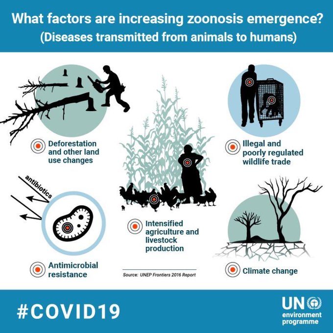
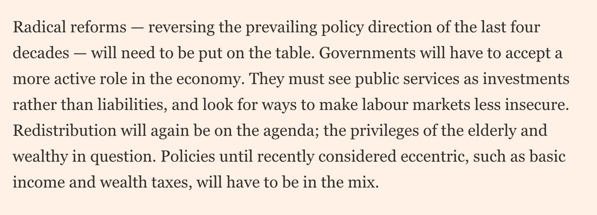
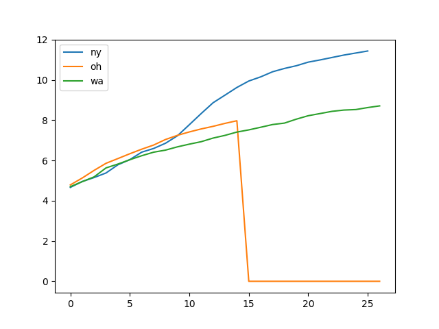

# Week 15

Inequality - Gini plot update, utilizing more granular data from Fred
per wealth percentile blocks.

[Link](../../2021/01/stats.html#gini)

---

"Leak Reveals Jihadists’ Weakening Grip in Syria’s Idlib"

[Link](https://warontherocks.com/2020/04/leak-reveals-jihadists-weakening-grip-in-syrias-idlib/)

---

"Griffith Researchers a Step Closer to Eco-Friendly Hydrogen Fuel
Production-Work brings Australian capability to meet the challenge of
eco-friendly & efficient #hydrogen production a step closer to
reality"

[Link](https://bit.ly/2Rueg5A)

---


---

Yeah - thanks for the obvious, guy

Con: "It might have been better to go into this crisis with universal
health coverage"

---

"Veterinary scientist hailed for Faroe Islands’ lack of Covid-19
deaths ...The success of the Faroese approach is said by local
politicians to be largely a result of the foresight of the veterinary
scientist Debes Christiansen ...

His laboratory, which was primarily geared to test salmon for viral
infection, was adapted and he purchased the extra ingredients required
to test humans ...

Christiansen told the Guardian that the switch to human testing had
not involved “too much hocus pocus” and that his veterinarian
laboratory had been able to source materials required for the tests
from a wider range of suppliers than hospitals ...

Tracking and tracing has been a very important part. It has been
possible to trace all the people who have been tested positive and who
they have been with. And they have been put in quarantine for two
weeks'"

[Link](https://www.theguardian.com/world/2020/apr/08/vetinary-scientist-hailed-faroe-islands-lack-covid-19-deaths)

---

U-oh... Total market cap / GDP was just coming down to sanity u just
made it go back up bro...

```
2020-04-03       116.53
2020-04-06       124.83
2020-04-07       124.75
2020-04-08       129.19
```

[Link](../../2021/01/stats.html#wilshire)

---

"@JennyBryan

British Columbia is the Seattle/WA of Canada, coronavirus-wise. Lots
of cases early, brought under control.

Our family’s personal experience was VERY diligent contact tracing +
strict isolation"

---

"@nfergus

Questions for Xi Jinping ....  After it became clear that there was a
full-blown epidemic spreading from Wuhan to the rest of Hubei
province, why did you cut off travel from Hubei to the rest of China —
on Jan. 23 — but not from Hubei to the rest of the world?"

---

<blockquote class="twitter-tweet"><p lang="en" dir="ltr">There’s a cruel irony in the timing of this ⁦<a href="https://twitter.com/nytimes?ref_src=twsrc%5Etfw">@nytimes</a>⁩ editorial that reads like a ⁦<a href="https://twitter.com/BernieSanders?ref_src=twsrc%5Etfw">@BernieSanders</a>⁩ stump speech, with mentions of billionaires and the 1%, references to housing and health care guarantees, and allusions to FDR. <a href="https://t.co/0xwRABpKWF">https://t.co/0xwRABpKWF</a></p>&mdash; Adam Kelsey (@adamkelsey) <a href="https://twitter.com/adamkelsey/status/1248232428860321802?ref_src=twsrc%5Etfw">April 9, 2020</a></blockquote> <script async src="https://platform.twitter.com/widgets.js" charset="utf-8"></script>

---

Doctor Who Tennant era was great. My fav companion Billie Piper. 

---

"Raworth’s 2017 bestselling book, *Doughnut Economics* .. has graced
the bedside table of people ranging from the former Brexit secretary
David Davis to the Guardian columnist George Monbiot, who described it
as a “breakthrough alternative to growth economics”.

The inner ring of her donut sets out the minimum we need to lead a
good life, derived from the UN’s sustainable development goals and
agreed by world leaders of every political stripe. It ranges from food
and clean water to a certain level of housing, sanitation, energy,
education, healthcare, gender equality, income and political
voice. Anyone not attaining such minimum standards is living in the
doughnut’s hole.

The outer ring of the doughnut, where the sprinkles go, represents the
ecological ceiling drawn up by earth-system scientists. It highlights
the boundaries across which human kind should not go to avoid damaging
the climate, soils, oceans, the ozone layer, freshwater and abundant
biodiversity.

Between the two rings is the good stuff: the dough, where everyone’s
needs and that of the planet are being met"

[Link](https://www.theguardian.com/world/2020/apr/08/amsterdam-doughnut-model-mend-post-coronavirus-economy)

---

"@CarbonBrief

NEW - Analysis: Coronavirus set to cause largest ever annual fall in
CO2 emissions"

[Link](https://mobile.twitter.com/CarbonBrief/status/1248255885899640838)

---

"There is an ocean

hidden beneath the icy surface

of a moon of Jupiter.

Come explore that world with us"

[Link](http://europa.nasa.gov/)

---

<blockquote class="twitter-tweet" data-conversation="none"><p lang="en" dir="ltr">Sure, we’re biased, but Europa is number one, all the way. Here’s why: <a href="https://t.co/rORF6MYHjc">https://t.co/rORF6MYHjc</a> <a href="https://t.co/q0CiUb8v8B">pic.twitter.com/q0CiUb8v8B</a></p>&mdash; NASA Europa Clipper (@EuropaClipper) <a href="https://twitter.com/EuropaClipper/status/1248281869327597568?ref_src=twsrc%5Etfw">April 9, 2020</a></blockquote> <script async src="https://platform.twitter.com/widgets.js" charset="utf-8"></script>

---

The ideal President would make Michael Hudson the Treasury Secretary
and FED chief at the same time.

---

New Generation of Fuel Cell micro-Cogeneration Units on the Market
with Higher Performance for Greater Customer Benefit

[Link](http://www.pace-energy.eu/new-generation-of-fuel-cell-micro-cogeneration-units-on-the-market-with-higher-performance-for-greater-customer-benefit/)

---

<blockquote class="twitter-tweet"><p lang="en" dir="ltr">My goodness, it looks like I’m giving *five* separate video lectures about climate change solutions and <a href="https://twitter.com/ProjectDrawdown?ref_src=twsrc%5Etfw">@ProjectDrawdown</a> tomorrow, to people all over the world.<br><br>And not one flight was needed.<br><br>After Covid-19, we’re all going to be a lot better at video presentations!</p>&mdash; Dr. Jonathan Foley (@GlobalEcoGuy) <a href="https://twitter.com/GlobalEcoGuy/status/1247676557247668224?ref_src=twsrc%5Etfw">April 8, 2020</a></blockquote> <script async src="https://platform.twitter.com/widgets.js" charset="utf-8"></script>

---

"@kayewhitehead

My dads friend died 2.5 weeks ago. I begged him not to go to the funeral. (underlining conditions). I even told my mom to hide his keys. I was so frantic about it that he didn’t go

-50 people attended 

-27 have tested COVID positive 

-6 are in the hospital

-4 have died

I. Cannot"

---

<blockquote class="twitter-tweet"><p lang="en" dir="ltr">If Green Hydrogen Can Fuel Los Angeles, It Will Really Be The City Of Dreams--Green <a href="https://twitter.com/hashtag/Hydrogen?src=hash&amp;ref_src=twsrc%5Etfw">#Hydrogen</a> is coming. All the pieces are lining up--<a href="https://t.co/aNRmBm5ZMw">https://t.co/aNRmBm5ZMw</a> <a href="https://twitter.com/hashtag/hydrogennow?src=hash&amp;ref_src=twsrc%5Etfw">#hydrogennow</a> <a href="https://twitter.com/hashtag/decarbonise?src=hash&amp;ref_src=twsrc%5Etfw">#decarbonise</a> <a href="https://twitter.com/hashtag/zeroemissions?src=hash&amp;ref_src=twsrc%5Etfw">#zeroemissions</a> <a href="https://twitter.com/hashtag/hydrogeneconomy?src=hash&amp;ref_src=twsrc%5Etfw">#hydrogeneconomy</a> <a href="https://twitter.com/hashtag/fuelcells?src=hash&amp;ref_src=twsrc%5Etfw">#fuelcells</a> <a href="https://twitter.com/hashtag/fuelcell?src=hash&amp;ref_src=twsrc%5Etfw">#fuelcell</a> <a href="https://twitter.com/hashtag/h2?src=hash&amp;ref_src=twsrc%5Etfw">#h2</a> <a href="https://t.co/ABNf9s0Bjz">pic.twitter.com/ABNf9s0Bjz</a></p>&mdash; FuelCellsWorks (@fuelcellsworks) <a href="https://twitter.com/fuelcellsworks/status/1248219165200125952?ref_src=twsrc%5Etfw">April 9, 2020</a></blockquote> <script async src="https://platform.twitter.com/widgets.js" charset="utf-8"></script>

---

Tomorrow is Good \#H2

[Link](https://innovationorigins.com/tomorrow-is-good-hydrogen-as-a-remedy-for-international-conflicts/)

---

"@BallardPwr

Global \#fuelcell vehicle shipments grew by over 40% in 2019"

---

Direct cash payments would work - and that's the problem, it would
work too well. Dems cannot help Reps in an election season.

Politics is deadly, as deadly as war, if not more.

"The fact that Pelosi had the chance to lead this charge a week ago
and demurred, insisting on means testing as a condition, is blinkered
and insane, on both the politics and the policy merits. The downside
of means testing is that the "testing" part takes time and
bureaucracy"

[Link](https://theweek.com/articles/903154/democrats-destructive-obsession-means-testing)

---

"@NYTScience

'People were just oblivious,' says a geneticist who is tracing coronavirus's arrival in the New York area. Most New York Coronavirus Cases Came From Europe, Genomes Show"

[Link](https://www.nytimes.com/2020/04/08/science/new-york-coronavirus-cases-europe-genomes.html)


---

<blockquote class="twitter-tweet"><p lang="en" dir="ltr">We are delighted to announce that <a href="https://twitter.com/breytnerzero?ref_src=twsrc%5Etfw">@breytnerzero</a> has started the demonstration of <a href="https://twitter.com/hashtag/H2Share?src=hash&amp;ref_src=twsrc%5Etfw">#H2Share</a>’s first <a href="https://twitter.com/hashtag/hydrogen?src=hash&amp;ref_src=twsrc%5Etfw">#hydrogen</a> <a href="https://twitter.com/hashtag/fuelcell?src=hash&amp;ref_src=twsrc%5Etfw">#fuelcell</a> rigid truck! A mobile refuelling station will also accompany the 27-tonne <a href="https://twitter.com/hashtag/truck?src=hash&amp;ref_src=twsrc%5Etfw">#truck</a>. 🚛🤩<br><br>More info 👉 <a href="https://t.co/fHrmz14JMo">https://t.co/fHrmz14JMo</a><a href="https://twitter.com/hashtag/zeroemissions?src=hash&amp;ref_src=twsrc%5Etfw">#zeroemissions</a> <a href="https://twitter.com/hashtag/cleanenergy?src=hash&amp;ref_src=twsrc%5Etfw">#cleanenergy</a> <a href="https://t.co/gb7IiDujmF">pic.twitter.com/gb7IiDujmF</a></p>&mdash; H2Haul (@H2Haul) <a href="https://twitter.com/H2Haul/status/1248183763793858561?ref_src=twsrc%5Etfw">April 9, 2020</a></blockquote> <script async src="https://platform.twitter.com/widgets.js" charset="utf-8"></script>

---

Scientists create mutant enzyme that recycles plastic bottles in hours

[Link](https://www.theguardian.com/environment/2020/apr/08/scientists-create-mutant-enzyme-that-recycles-plastic-bottles-in-hours)

---

New plot, Total Consumer Credit Outstanding as % of GDP. 

Let's see if that graph shoot up after crisis

[Link](../../2021/01/stats.html#debt)

---

H2 activity per country (Forbes)


[Link](https://www.forbes.com/sites/mitsubishiheavyindustries/2020/03/11/where-in-the-world-are-the-hydrogen-trailblazers-infographic/amp/?__twitter_impression=true)

---

"@normonics

Will the 'economy pause is more deadly' bros please tell me how many
so far have been lost to the economy pause?"

---

"@plutokiller

Zoomed with my brother in Washington State yesterday afternoon and he
was outside on his front porch in the sunshine while it was pouring
rain here in LA and I DON'T EVEN UNDERSTAND THE WORLD ANYMORE"

---

(Lessons from Italy, HBR article): "Recognize your cognitive
biases. In its early stages, the Covid-19 crisis in Italy looked
nothing like a crisis. The initial state-of-emergency declarations
were met by skepticism by both the public and many in policy circles —
even though several scientists had been warning of the potential for a
catastrophe for weeks. Indeed, in late February some notable Italian
politicians engaged in public handshaking in Milan to make the point
that the economy should not panic and stop because of the virus. (A
week later, one of these politicians was diagnosed with Covid-19.)"

[Link](https://hbr.org/2020/03/lessons-from-italys-response-to-coronavirus)

---

Yees I fit an ODE numerical calculation. Why not? ODE "integrations"
are like any other numerical calculation, they have certain
parameters, they are completely deterministic, so a fitting procedure
can work with that.

---

I fit the differential eqn for the SIR model, if we use Italy numbers,
a rough estimate gives a 5.5. Different countries give different
results however. I get an 8 from China, if we believe their numbers.

[Link](https://muratk3n.github.io/thirdwave/en/2020/02/corona_math.html)

---

"@DrEricDing

New higher R0 from CDC reanalysis... it’s a 5.7!"

[Link](https://mobile.twitter.com/DrEricDing/status/1247872359312351232)

---

Politically astute ad and timing. 

[Link](https://twitter.com/postXamerica/status/1245867699063803904)

---

<blockquote class="twitter-tweet"><p lang="en" dir="ltr">📢 Breaking news ❗️ We are joining forces w/ <a href="https://twitter.com/uniper_energy?ref_src=twsrc%5Etfw">@uniper_energy</a> to decarbonize <a href="https://twitter.com/hashtag/power?src=hash&amp;ref_src=twsrc%5Etfw">#power</a> generation! Focus areas: <br>1⃣ Production &amp; use of <a href="https://twitter.com/hashtag/GreenHydrogen?src=hash&amp;ref_src=twsrc%5Etfw">#GreenHydrogen</a> <br>2⃣ Promote sector coupling<br>Read the full press release ▶️ <a href="https://t.co/kRcUEbjsf6">https://t.co/kRcUEbjsf6</a> <a href="https://twitter.com/hashtag/hydrogen?src=hash&amp;ref_src=twsrc%5Etfw">#hydrogen</a> <a href="https://t.co/J1vP1B02IP">pic.twitter.com/J1vP1B02IP</a></p>&mdash; Siemens Energy (@Siemens_Energy) <a href="https://twitter.com/Siemens_Energy/status/1247803595346432004?ref_src=twsrc%5Etfw">April 8, 2020</a></blockquote> <script async src="https://platform.twitter.com/widgets.js" charset="utf-8"></script>

---

"@davidsarac

From the existential threat perspective, separation of corporation and
state will prove to be orders of magnitude more important than
separation of church and state"

---

U could do minwage 3.6 dollar/hour instead of 7.25 of today. That's
the reduction u'd get if everyone is given 1000 dollars a month tax
exempt cash. I believe companies would be more willing to hire workers
if they have to pay less.

Also, if M4A takes the burden of this insurance fuckery off their
backs, they'd be even happier. All this stuff is GOOD FOR BUSINESS.

---

"@moorehn

'Data from China, Italy and the U.S. suggest that about half of those
with covid-19 who receive ventilator support will die.'"

---

<blockquote class="twitter-tweet"><p lang="en" dir="ltr">My backup plan is to fully embrace the French accent and open a crepe restaurant in an anglo country.</p>&mdash; Lou (@lougrims) <a href="https://twitter.com/lougrims/status/1247785638922817539?ref_src=twsrc%5Etfw">April 8, 2020</a></blockquote> <script async src="https://platform.twitter.com/widgets.js" charset="utf-8"></script>

---

We used hi-tech all wrong. We used it to extend the "village"; we need
seek brand new structures that are only possible with tech.

"@Schuldensuehner

\#Airbnb paying more than 10% interest on 1bn dollar financing
announced Mon. The sharing economy company is a big loser of the
consequences of corona pandemic like WeWork. Social distancing could
have a lasting impact on the business models of the sharing econ"

---

How about like ∿ then like -. Flatline! So ∿∿∿---------. Beeeeeeep. Dead.

---

That's a new one... Check-mark shape.

There is L, U, V, I, W, -, and now ✅.

"JPM's Michele Sees a Check-Mark Shaped Recovery"

---

Interesting word: flibbertigibbet. 

---

"@Reductress

'It's Sort of Like Being in Prison,' Says Woman Eating Yogurt in Bed
Who Also Has Voting Rights"

[Link](http://ow.ly/d3wi50z2wXN)

---

It's crazy - voters' needs are intensely immediate... In the Prez
election [prediction](../../2021/01/stats.html#prez)
if I use GDP YoY growth (Q2 of election yr compared to Q2 of last
year) I lose an entire 5% in $R^2$, that is, a worse model. If I use
annualized growth, that is Q2 GDP compared to *previous* quarter,
annualized, then the model gets better. Q2 is of course the last
freaking quarter right before the "endgame" of the election itself.

Voters are like "what have u done for me __ta-day__ biiaatch!" Muuney,
now! Last year, seasonal, f--ing cyclic, roundabout, some other
bullshit - they dont care. Bring the goods, pronto.

---

<blockquote class="twitter-tweet"><p lang="en" dir="ltr">Loop Energy Receives <a href="https://twitter.com/hashtag/FuelCell?src=hash&amp;ref_src=twsrc%5Etfw">#FuelCell</a> Range Extender Order for Transit Buses in Nanjing China-<a href="https://twitter.com/LoopEnergyInc?ref_src=twsrc%5Etfw">@LoopEnergyInc</a> Order represents start of long-term agreement &amp; has total value of ~US$15 million over a 3-year period-<a href="https://t.co/iDni25ineI">https://t.co/iDni25ineI</a> <a href="https://twitter.com/hashtag/hydrogen?src=hash&amp;ref_src=twsrc%5Etfw">#hydrogen</a> <a href="https://twitter.com/hashtag/hydrogennow?src=hash&amp;ref_src=twsrc%5Etfw">#hydrogennow</a> <a href="https://twitter.com/hashtag/decarbonise?src=hash&amp;ref_src=twsrc%5Etfw">#decarbonise</a> <a href="https://twitter.com/hashtag/zeroemissions?src=hash&amp;ref_src=twsrc%5Etfw">#zeroemissions</a> <a href="https://t.co/diAYnd55qj">pic.twitter.com/diAYnd55qj</a></p>&mdash; FuelCellsWorks (@fuelcellsworks) <a href="https://twitter.com/fuelcellsworks/status/1247552221971169280?ref_src=twsrc%5Etfw">April 7, 2020</a></blockquote> <script async src="https://platform.twitter.com/widgets.js" charset="utf-8"></script>

---

<blockquote class="twitter-tweet"><p lang="en" dir="ltr">When you poke the bitcoin nest you get a flood of people explaining distributed ledger like it&#39;s 2011</p>&mdash; Joe Norman (@normonics) <a href="https://twitter.com/normonics/status/1247520401321680904?ref_src=twsrc%5Etfw">April 7, 2020</a></blockquote> <script async src="https://platform.twitter.com/widgets.js" charset="utf-8"></script>

---

Still see some being adamantly against red meat. Yeah go ahead, do
that. I'll eat mine than I'll kick your ass. I'll kick your ass and
take your wife. I'll rename your children, Eenie, Meenie, Mo. Or A, B,
C.. however I like it.. Then you'll understand you made big
mistake. But by then it will be too late. You already had your ass
kicked. I got the ho, I got the food.

"Eat Less Red Meat, Scientists Said. Now Some Believe That Was Bad Advice"

[Link](https://www.nytimes.com/2019/09/30/health/red-meat-heart-cancer.html)

---

<blockquote class="twitter-tweet"><p lang="en" dir="ltr">Hyzon Motors Announces Order for 1,000 for <a href="https://twitter.com/hashtag/Hydrogen?src=hash&amp;ref_src=twsrc%5Etfw">#Hydrogen</a> <a href="https://twitter.com/hashtag/FuelCell?src=hash&amp;ref_src=twsrc%5Etfw">#FuelCell</a> Buses--<a href="https://twitter.com/hyzonmotors?ref_src=twsrc%5Etfw">@hyzonmotors</a> 1,000 units 40FT/12M fuel cell bus MOU signed with a client under confidentiality. First 50 units ~12 months after formal contract-<a href="https://t.co/Du0jZ7d5tD">https://t.co/Du0jZ7d5tD</a> <a href="https://twitter.com/hashtag/hydrogennow?src=hash&amp;ref_src=twsrc%5Etfw">#hydrogennow</a> <a href="https://twitter.com/hashtag/decarbonise?src=hash&amp;ref_src=twsrc%5Etfw">#decarbonise</a> <a href="https://twitter.com/hashtag/zereoemissions?src=hash&amp;ref_src=twsrc%5Etfw">#zereoemissions</a> <a href="https://t.co/FLc1zq8cLS">pic.twitter.com/FLc1zq8cLS</a></p>&mdash; FuelCellsWorks (@fuelcellsworks) <a href="https://twitter.com/fuelcellsworks/status/1247521838831259658?ref_src=twsrc%5Etfw">April 7, 2020</a></blockquote> <script async src="https://platform.twitter.com/widgets.js" charset="utf-8"></script>

---

🤨🤨🤨

"Mathematical optimization is a powerful AI technology"

---

<blockquote class="twitter-tweet"><p lang="en" dir="ltr">Nobody on the road<br>Nobody on the beach<br>I feel it in the air<br>The summer&#39;s out of reach<br>Empty lake, empty streets<br>The sun goes down alone</p>&mdash; Jeremy Clarkson (@JeremyClarkson) <a href="https://twitter.com/JeremyClarkson/status/1247513183499235328?ref_src=twsrc%5Etfw">April 7, 2020</a></blockquote> <script async src="https://platform.twitter.com/widgets.js" charset="utf-8"></script>

---

"@intellenergy

Norwegian firm raises USD 1m for green hydrogen in UNESCO area"

[Link](http://ow.ly/IsVH50z7vq0)

---

<blockquote class="twitter-tweet" data-conversation="none"><p lang="en" dir="ltr">Some governments have all along relied on their own wisdom rather than the WHO&#39;s advice when it came to masks, such as Japan <a href="https://t.co/qu2SGLeBgR">pic.twitter.com/qu2SGLeBgR</a></p>&mdash; Stuart Lau (@stuartlauscmp) <a href="https://twitter.com/stuartlauscmp/status/1247474216733155328?ref_src=twsrc%5Etfw">April 7, 2020</a></blockquote> <script async src="https://platform.twitter.com/widgets.js" charset="utf-8"></script>

---

[A poultry producer company] Lynca’s first focus was to install an
efficient and flexible refrigeration system that could handle its
primary duties (chilling and freezing of meat) reliably and
efficiently. To that end, EP designed an ammonia system with a
capacity of 792kW (225.2TR) capacity that allowed Lynca to almost
double its production within the limitations of its electrical
supply. With this system, it managed to replace some of the simplex
units; the rest were later replaced with an HFC multiplex system on a
cooling-as-a-service (CaaS) model.

[Link](http://ammonia21.com/articles/9464/south_african_lynca_meats_upgrades_to_cost_saving_ammonia)

---

@fuelcellsworks

German Ministry of Transport Releases Millions in Funding for Purchase
of \#Hydrogen \#fuelcell Buses-WSW mobil GmbH receives 2.3 million euros
for purchase of 10 buses. OVAG receives 1.23 million euros

[Link](https://bit.ly/2XkX3zl)

---

<blockquote class="twitter-tweet"><p lang="en" dir="ltr">Helbio Delivers the 5 kW CHP System to Notes in Japan-<a href="https://twitter.com/Metaconab?ref_src=twsrc%5Etfw">@Metaconab</a> subsidiary Helbio has manufactured a shipped a 5kW CHP (H2PS-5) system running on LPG to Notes Co., Ltd. in Nagano--<a href="https://t.co/FMlXvQe4hS">https://t.co/FMlXvQe4hS</a> <a href="https://twitter.com/hashtag/hydrogen?src=hash&amp;ref_src=twsrc%5Etfw">#hydrogen</a> <a href="https://twitter.com/hashtag/hydrogennow?src=hash&amp;ref_src=twsrc%5Etfw">#hydrogennow</a> <a href="https://twitter.com/hashtag/decarbonise?src=hash&amp;ref_src=twsrc%5Etfw">#decarbonise</a> <a href="https://twitter.com/hashtag/fuelcells?src=hash&amp;ref_src=twsrc%5Etfw">#fuelcells</a> <a href="https://twitter.com/hashtag/fuelcell?src=hash&amp;ref_src=twsrc%5Etfw">#fuelcell</a> <a href="https://t.co/MPzm4N8Nry">pic.twitter.com/MPzm4N8Nry</a></p>&mdash; FuelCellsWorks (@fuelcellsworks) <a href="https://twitter.com/fuelcellsworks/status/1247494311538823170?ref_src=twsrc%5Etfw">April 7, 2020</a></blockquote> <script async src="https://platform.twitter.com/widgets.js" charset="utf-8"></script>

---

White Noise Pro by Amicoolsoft. Good app.

---

There were legit reports on some success; he got wind of it,
shared. Then the press naturally jumped on him bcz "nah, this clown
couldn't have picked something remotely working!". Maybe that's
exactly why Trump partly shared it, to create bunch of kerkuffle but
now the drug became part of the food fight. This stuff shouldn't be
discussed in this manner.. If it is cleared by top dogs in science,
use it.

"@MiaFarrow

There are over 300 different drug  trials in progress for covid-19. Why is Donald Trump pushing this one drug hydroxychloroquine"

---

<blockquote class="twitter-tweet"><p lang="en" dir="ltr">Solving your first linear program in Python <a href="https://t.co/3N9C72VxN6">https://t.co/3N9C72VxN6</a></p>&mdash; Towards Data Science (@TDataScience) <a href="https://twitter.com/TDataScience/status/1247223806051201033?ref_src=twsrc%5Etfw">April 6, 2020</a></blockquote> <script async src="https://platform.twitter.com/widgets.js" charset="utf-8"></script>

---

CV sci papers from AU

[Link](https://www.doherty.edu.au/news-events/news/covid-19-modelling-papers)

---

Did not age well

"@CNN (Feb 1)

There's a virus that has infected 15 million Americans across the
country and killed more than 8,200 people this season alone. It's not
a new pandemic -- it's influenza"

---


---

"@InternetHippo

Just got back from the centrist rally. Amazing turnout. Thousands of people holding hands and chanting 'Better things aren’t possible'"

---

<blockquote class="twitter-tweet"><p lang="en" dir="ltr">HYZON to deliver 15 to 40 t FC trucks with 100-200 kW power by NOV2020 and 370 kW 140-t road-trains by 2021. Operating range are expected at 500 km with 48 kg of H2 and up to 2,000 km with 192 kilograms:<a href="https://t.co/yH9EZJuzH4">https://t.co/yH9EZJuzH4</a><br>+ MoU for 1,000 12m buses:<a href="https://t.co/NpmRjLBTBW">https://t.co/NpmRjLBTBW</a></p>&mdash; Reiner (@H2FCEV) <a href="https://twitter.com/H2FCEV/status/1247241010696146950?ref_src=twsrc%5Etfw">April 6, 2020</a></blockquote> <script async src="https://platform.twitter.com/widgets.js" charset="utf-8"></script>

---

Huh. I have a natural aversion to things shared by too many ppl anyway
so I ignored it. Along with that animation of jobless claims.

"@JordanSchachtel

So it turns out [the cyring nurse] video is entirely fraudulent"

[Link](https://twitter.com/JordanSchachtel/status/1247163898584760320)

---

<blockquote class="twitter-tweet"><p lang="en" dir="ltr">Keep calm and stay healthy! With <a href="https://twitter.com/hashtag/zeroemissions?src=hash&amp;ref_src=twsrc%5Etfw">#zeroemissions</a> <a href="https://twitter.com/hashtag/Toyota?src=hash&amp;ref_src=twsrc%5Etfw">#Toyota</a> <a href="https://twitter.com/hashtag/Mirai?src=hash&amp;ref_src=twsrc%5Etfw">#Mirai</a>. <a href="https://twitter.com/hashtag/FCEV?src=hash&amp;ref_src=twsrc%5Etfw">#FCEV</a> <a href="https://twitter.com/hashtag/MotivationalMonday?src=hash&amp;ref_src=twsrc%5Etfw">#MotivationalMonday</a> <a href="https://t.co/et6vmV5Lyt">pic.twitter.com/et6vmV5Lyt</a></p>&mdash; Toyota Motor Corp. (@ToyotaMotorCorp) <a href="https://twitter.com/ToyotaMotorCorp/status/1247116901756665856?ref_src=twsrc%5Etfw">April 6, 2020</a></blockquote> <script async src="https://platform.twitter.com/widgets.js" charset="utf-8"></script>

---

"@EFF

California: Sen. Lena Gonzalez's SB 1130, would fund the construction
of fiber networks to ensure all Californians have access to high-speed
Internet"

[Link](https://twitter.com/EFF/status/1247206432778280960)

---

"Give me your tired, your poor, your huddled masses" can cut both
ways. Tired, poor masses might not make too many demands of their new
state, so they can be taken for granted and are left to their own
devices at the first sign of trouble. 

---

M. Hudson reporting from NY. No masks, long lines in front of nearby
hospital to get tested, where dead bodies are being carted out daily.

---

"Renewable Hydrogen 'Gigastack' Monster Rises From UK Seas"

[Link](https://cleantechnica.com/2020/02/19/renewable-hydrogen-gigastack-monster-rises-from-uk-seas)

---

👍👍👍

<blockquote class="twitter-tweet"><p lang="en" dir="ltr"><a href="https://twitter.com/CDCgov?ref_src=twsrc%5Etfw">@CDCgov</a> is recruiting for its first Chief Data Officer. This is an incredible opportunity for someone to help shape how data is collected, analyzed, integrated and shared across public health. Deeply meaningful work with an incredible team. <a href="https://twitter.com/hashtag/DataScience?src=hash&amp;ref_src=twsrc%5Etfw">#DataScience</a> <a href="https://t.co/FonkhzNFkc">https://t.co/FonkhzNFkc</a></p>&mdash; Duncan MacCannell (@dmaccannell) <a href="https://twitter.com/dmaccannell/status/1247038863060529152?ref_src=twsrc%5Etfw">April 6, 2020</a></blockquote> <script async src="https://platform.twitter.com/widgets.js" charset="utf-8"></script>

---

"@TheMendozaWoman

Massive news from Spain. 

Universal Basic Income is happening, and more importantly, the
government’s broader ambition is that basic income becomes an
instrument “that stays forever, that becomes a structural instrument,
a permanent instrument,”

HUGE"

---



---

@TuurDemeester

I prefer to compare Covid-19 with the Spanish flu because societal
threat level seems similar.

R0 

- Covid-19: 2.2
- Spanish flu: 2
- 1957 flu: 1.6

Case Fatality Rate

- Covid-19: 1-3%
- Spanish flu: 2.5%
- 1957 flu: 0.5%

US deaths

- Covid-19: 9k (in month 1)
- Spanish flu: 675k
- 1957 flu: 70k

---


---

Since I am keeping work schedule I am having a "case of mondays".

---

Sweden.. you have a retarded central bank but I was thinking peeps
were fine. Is there fail at gov level too..?

<blockquote class="twitter-tweet"><p lang="en" dir="ltr">Remembering that time last week when some people were saying we should follow Sweden instead of continuing with what we and a bunch of other similar countries were doing. This is how that&#39;s going. They&#39;ve also had three times as many deaths as those five countries combined. <a href="https://t.co/wLDI09fgnT">pic.twitter.com/wLDI09fgnT</a></p>&mdash; Charlie Mitchell (@comingupcharlie) <a href="https://twitter.com/comingupcharlie/status/1247060980334395393?ref_src=twsrc%5Etfw">April 6, 2020</a></blockquote> <script async src="https://platform.twitter.com/widgets.js" charset="utf-8"></script>

---

"@sid8998

Disinfectant concentrations and contact times proven to reduce
\#coronaviruses by 99.99%. Studies on various coronaviruses including
one @hkumed on \#SARSCoV2.  Summary: alcohol-based disinfectants good
for skin. Chloroxylenol or diluted bleach good for surfaces"

---

Now that the dollar sign is reserved for math symbols I need to watch
for the use of dollar sign, otherwise the rest is interpreted as math,
effs up all the content.

---

So some cons have a higher God after all - the market.

---

What kind of economy gets ruined with some months of lowered activity? This thing is designed badly. Even the stupidest techy would not design a system with so much dependence.

---


"@e_d_andersen

I remember reading a story in NYT while living in the US that someone shot a Halloween kid coming to his door because he was scared. So insane.  

There is zero point in convincing Europeans guns are good because we realize they would only make things worse"

---

Wow. Did not know Kiefer was practically left royalty!

Military-media complex must have enjoyed having Tommy Douglas'
grandson running around with a gun and do fascistic shit in *24*.

"Actress-activist Shirley Douglas, daughter of medicare's Tommy
Douglas, mother of actor Kiefer Sutherland, dead at 86"

[Link](https://mobile.twitter.com/docdanielle/status/1246979132266815493)

---

"@ianbremmer

You don’t need an authoritarian state to fight coronavirus
effectively.

Germany, Singapore, South Korea and Taiwan are doing very well.

You need a government that prioritizes science and expertise. And a
population that considers their authority legitimate"

---

Bad times, and as if on cue, weather is also bad.. Or were we changing
the weather even daily with our activity? 

---

Trump is selling that hydroxychloroquine so hard now I lose my shit
whenever I hear it.

---

Nice. He has a big list of them in that tweet as cheatsheet.

"@edwardhkennedy

'Behind every great theorem lies a great inequality'"

[Link](https://mobile.twitter.com/edwardhkennedy/status/1246491299097858049)

---


---

<blockquote class="twitter-tweet"><p lang="en" dir="ltr">I was in the “it’s just a bad flu” camp. <br><br>Then it hit my hospital. <br><br>I have NEVER seen chest X-rays/CT scans like I’m seeing now. <br><br>I’ve never seen a Flu+ patient with imaging studies like this. <br><br>I’m seeing them DAILY.</p>&mdash; Primal Medicine (@MedicinePrimal) <a href="https://twitter.com/MedicinePrimal/status/1246420458460844033?ref_src=twsrc%5Etfw">April 4, 2020</a></blockquote> <script async src="https://platform.twitter.com/widgets.js" charset="utf-8"></script>

---

<blockquote class="twitter-tweet"><p lang="en" dir="ltr">Singapore/Japan consortium to evaluate delivering carbon-free energy to Singapore with liquid organic hydrogen carriers. This consortium has the signs of a successful renewable energy import scheme. | Read <a href="https://twitter.com/TheEnergyNerd?ref_src=twsrc%5Etfw">@TheEnergyNerd</a>&#39;s <a href="https://twitter.com/hashtag/LuxTake?src=hash&amp;ref_src=twsrc%5Etfw">#LuxTake</a>: <a href="https://t.co/jAJtS0Bw1r">https://t.co/jAJtS0Bw1r</a> <a href="https://twitter.com/hashtag/energytwitter?src=hash&amp;ref_src=twsrc%5Etfw">#energytwitter</a> <a href="https://t.co/mZCBMGdNm7">pic.twitter.com/mZCBMGdNm7</a></p>&mdash; Lux Research Inc. (@LuxResearch) <a href="https://twitter.com/LuxResearch/status/1246539562475827207?ref_src=twsrc%5Etfw">April 4, 2020</a></blockquote> <script async src="https://platform.twitter.com/widgets.js" charset="utf-8"></script>

---

FT Editorial 😶



---

"@villi

This clown is the king of bad takes! Winner!

'@AriFleischer

When this is over, we need to realize how clunky and obsolete many
bureaucracies are. The FDA is too slow, even in good times. The state
unemployment offices are antiquated. Too many don't even have good
info on who is unemployed and how much money they used to make'"

---

It is 1918 and 1929 all at once. Let's hope it's also not 1939.

---

<blockquote class="twitter-tweet"><p lang="en" dir="ltr">I&#39;m taking advantage of isolation by learning some new cuisines from around the world. Tonight, I cooked my favourite American dish <a href="https://t.co/zX9wy1Zeox">pic.twitter.com/zX9wy1Zeox</a></p>&mdash; Cromerty York - Voiceover &amp; Voice Actor🎙️ (@Cromerty) <a href="https://twitter.com/Cromerty/status/1245830584150024193?ref_src=twsrc%5Etfw">April 2, 2020</a></blockquote> <script async src="https://platform.twitter.com/widgets.js" charset="utf-8"></script>

---

"@adamjohnsonNYC

Breaking up the banks wont stop racism, single payer healthcare isnt
the cure for a deadly supervirus, free college may help 5 billionaire
kids—these are all super good faith arguments & not transparently
cynical bullshit vomited out of corporate-funded DC white boarding
sessions"

---

"The World’s 1st Hydrogen Scooter Comes From Arnhem"

[Link](https://fuelcellsworks.com/news/the-worlds-1st-hydrogen-scooter-comes-from-arnhem/)

---

Keen: "[T]he danger that Garrett anticipated a quarter of a century
ago has come to pass. Had we designed our health and production
systems to cope with the inevitable event, we would have:

- Increased the capacity of our health systems, and trained doctors
  and nurses in excess of underlying demand;

- Produced stocks of standard emergency equipment like masks and
  ventilators (Garrett anticipated, correctly, that The Coming Plague
  would be a respiratory illness); Made our economies as robust as
  possible to a health crisis, with short supply chains, and an
  emphasis upon local rather than globalized production;

- Established free—indeed, be-paid-to-be-tested—health monitoring
  systems, to ensure that we can easily identify disease carriers
  during a pandemic; and

- Extended our monetary systems to finance normal expenditure by the
  bulk of the population in the event of a pandemic.

Of course, we have done the exact opposite. We have instead:

- Reduced the capacity of our health systems to cope with even
  standard episodic health issues, in the belief that not spending on
  social infrastructure was "saving for a rainy day";

- Designed an economic system in which production is focused in
  low-wage countries and exported to the rest of the world, via
  lengthy supply chains that involve as many as, for example, 43
  countries in producing an iPhone; and

- Allowed the private sector to run up the highest level of corporate
  and household debt in history, which has made the financial sector
  both incredibly powerful and incredibly fragile at the same time"

[Link](https://www.patreon.com/posts/coronavirus-and-35634400)

---

"@QasimRashid

Citizens who lost health coverage in past 2 weeks due to economic
collapse:

USA 3,500,000

Australia 0

Belgium 0

Canada 0

Chile 0

Denmark 0

... [snip, it goes on forever]

"

---

Yes NY data is not exactly straight line after "taking log". I could
explore "super-exponential" fit, as in $ e^{x^2}$ (holy shit!), but
for now, am looking at the data with two seperate exp regions. 

---

Analyzing data as exponential fit.. The formulas below are why we
"take the log" of the $y$ values,

$$
y = a e ^{b x}
$$

$$
\log(y) = \log(a eb x) 
$$

$$
= \log(a) + \log(eb x) = \log(a) + b x
$$

Now the slope of the curve is $b$, the param that defines a particular
exp growth.

Let's analyze some state data. How did NY do? Let's compare NY,
Washingon, and Ohio.


```python
import pandas as pd, os
import zipfile
with zipfile.ZipFile(os.environ['HOME'] + '/Downloads/corona-county.zip', 'r') as z:
    df =  pd.read_csv(z.open('us-counties.csv'))
nycases = df[df['state'] == 'New York'].groupby('date')['cases'].sum()
ohcases = df[df['state'] == 'Ohio'].groupby('date')['cases'].sum()
wacases = df[df['state'] == 'Washington'].groupby('date')['cases'].sum()
nycases = nycases[nycases > 100].reset_index()
ohcases = ohcases[ohcases > 100].reset_index()
wacases = wacases[wacases > 100].reset_index()
df = pd.concat([nycases, ohcases, wacases],axis=1)
df = df.drop(['date'],axis=1)
df.columns = ['ny','oh','wa']
df = np.log(df)
df['oh'] = df.oh.fillna(0)
airny = 2.3 + 15.0 + 30.5; airoh = 4.0 + 4.2 + 4.8; airwa = 24.8
df.plot()
plt.savefig('states.png')
```



X-axis is number of days after 100th case, so all three states start
from equal footing. The second week, things went sideways for Governor
Fredo, growth took off. Ohio did well. Now NY is doing as good as WA
(same slope). NY fail was bcz of its significantly more [air travel](https://en.wikipedia.org/wiki/List_of_the_busiest_airports_in_the_United_States#Busiest_US_airports_by_total_passenger_boardings)
which was not stopped early? Or Fredo effed up himself?

---

Keir Starmer the new Labour leader? I hope he does well.. he didnt
come across too leadership-y to me in one debate I saw him in, I hope
I am wrong.

---

How will the rich make it to their bunkers otherwise? Have you no
mercy, man ?! 

"@adereth

Did you know that the stimulus plan eliminated the 7.5% Aviation Tax
for private jets? Of course it did"

---

[Hidalgo](../../2017/08/hidalgo.html)

[Sornette](../../2017/03/bubble_nb.html)

---

Just redid Keen's [math](../../2018/02/keen_math.html)

---


Added math symbol rendering support to my markdown pages. For Github
Pages users, changes r explained [here](https://github.com/cjerdonek/gh-pages-theme-slate).
Add a`/_layouts/default.html` in root dir, copy contents of
[this](https://github.com/pages-themes/slate/blob/master/_layouts/default.html),
for MathJax add

```
<script type="text/x-mathjax-config">
  MathJax.Hub.Config({
    tex2jax: {inlineMath: [["$","$"],["\\(","\\)"]]}
  });
</script>
<script type="text/javascript"
   src="https://cdnjs.cloudflare.com/ajax/libs/mathjax/2.7.5/MathJax.js?config=TeX-AMS_HTML-full">
</script>
```

in the meta. Now between `$$` or inline `$`  you can use math.

As easy as $\pi$.

---

"The greatest scientific legacy that Albert Einstein left us is this:
that the speed of light, and the laws of physics, appear to be the
same for all observers in the Universe. Regardless of where you're
located, how fast or in which direction you're moving, or when you're
performing your measurements, everyone experiences the same
fundamental rules of nature. The symmetry that underlies this, Lorentz
invariance, is the one symmetry that must never be violated.

However, many ideas that go beyond the Standard Model and General
Relativity — such as string theory or most manifestations of quantum
gravity — could break this symmetry, with consequences for what we'd
observe about the Universe. A new study by the HAWC collaboration,
just published on March 30, 2020, just placed the tightest constraints
on Lorentz invariance violation ever ..

The Standard Model is exactly Lorentz invariant. General Relativity is
exactly Lorentz invariant. But many incarnations of quantum gravity
are only approximately Lorentz invariant. Either the symmetry that
mandates it is broken, or there's new physics that only appears at
high-energy scales that breaks it. ...

One particularly good test that we can perform is to look at photons —
quanta of light — as they travel throughout the Universe. If Lorentz
invariance is a perfect, exact symmetry, then all photons of all
energies should propagate through the Universe ... If Lorentz
invariance holds, there should be a continuous spectrum of these
photons coming from these pulsars, without a hard cutoff ...

But what HAWC saw, to a precision that's almost 100 times better than
any previous measurement, indicates no violation at all...

[T]hese photon-based constraints teach us that if a quantum gravity
candidate such as string theory introduces a type of Lorentz
invariance violation that predicts an astrophysical signature of
photon decay, as many do, they are now constrained or even ruled out
by this new set of observations. The laws of physics really are the
same everywhere and at all times, and any extension to the Standard
Model and General Relativity must reckon with these new, robust
restrictions"

[Link](https://www.forbes.com/sites/startswithabang/2020/04/03/astrophysics-signal-does-what-the-lhc-cannot-constrain-quantum-gravity-and-string-theory/)

---

"@thedailytexan

Out of 211 students who traveled to Cabo for spring break, 49 students
have tested positive for #COVID19, according to a @UTAustin press
release"

---

<blockquote class="twitter-tweet"><p lang="en" dir="ltr">Buy the recession - Sell the depression™</p>&mdash; StockCats (@StockCats) <a href="https://twitter.com/StockCats/status/1246072495427518464?ref_src=twsrc%5Etfw">April 3, 2020</a></blockquote> <script async src="https://platform.twitter.com/widgets.js" charset="utf-8"></script>

---

