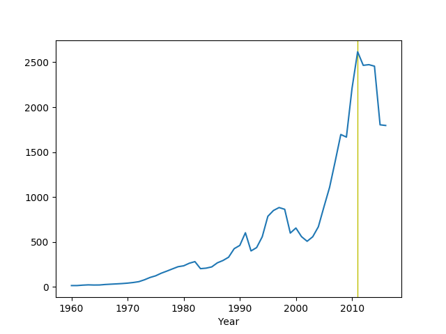

# Week 16

(Q's human girlfriend): It's over Q, you are arrogant, overbearing and
you think you know everything"

Q: But .. I do know everything"

\#trek \#ds9

---

"@doctorow

Cheers was a holodeck program"


---

<blockquote class="twitter-tweet"><p lang="en" dir="ltr">Gas Storage Method Could Help Next-Generation Clean Energy Vehicles-Tremendous amounts of <a href="https://twitter.com/hashtag/hydrogen?src=hash&amp;ref_src=twsrc%5Etfw">#hydrogen</a> can be stored in nanoscopic pores. 1-gram of <br>material (with a v.olume of six M&amp;Ms) has surface area to cover 1.3 football fields-<a href="https://t.co/K5ru9tP3Dc">https://t.co/K5ru9tP3Dc</a> <a href="https://twitter.com/hashtag/hydrogennow?src=hash&amp;ref_src=twsrc%5Etfw">#hydrogennow</a> <a href="https://twitter.com/hashtag/decarbonise?src=hash&amp;ref_src=twsrc%5Etfw">#decarbonise</a> <a href="https://t.co/MRG3mIHHt7">pic.twitter.com/MRG3mIHHt7</a></p>&mdash; FuelCellsWorks (@fuelcellsworks) <a href="https://twitter.com/fuelcellsworks/status/1251502595006480390?ref_src=twsrc%5Etfw">April 18, 2020</a></blockquote> <script async src="https://platform.twitter.com/widgets.js" charset="utf-8"></script>

---

"Elon Musk’s Billionaire Brother Told His Workers They Were
Family. Until COVID-19 Hit."

[Link](https://www.huffpost.com/entry/kimbal-musk-next-door-restaurants-coronavirus_n_5e8ccb32c5b62459a9302dbb)

---

Let's look at Brasil

```python
import pandas as pd, zipfile

with zipfile.ZipFile('/tmp/datapackage_zip.zip', 'r') as z:
    df =  pd.read_csv(z.open('data/gdp.csv'))
df = df[df['Country Code']=='BRA']
df = df.set_index('Year')
gdp = np.round(df.Value / 1e9,2)
gdp.plot()
plt.axvspan(2011,2011,color='y')
plt.savefig('bra.png')
```



What happened in 2011?

[searching..] Dilma becomes Prez. Ah. Well.. it looks like a huge peak
in GDP before that, coupled with commodity troubles, due to cycle
ending, things can go sideways easily, which happened for her. Dilma
was Lula's hand-picked successor obviously.

And, I have to add what followed as part of that "Car Wash" thing was
truly disgusting.

---

Nice here is GDP data too,

https://datahub.io/anuveyatsu/gdp#data

---

Let's try it out

```python
import pandas as pd, zipfile

with zipfile.ZipFile('/tmp/population.zip', 'r') as z:
    df =  pd.read_csv(z.open('archive/population.csv'))
print (df.columns)
pop_per_year = df.groupby('Year').sum()
print (pop_per_year.tail(3))
```

```text
Index(['Country Name', 'Country Code', 'Year', 'Value'], dtype='object')
            Value
Year             
2016  78729110445
2017  79699850185
2018  80655240865
```

---

All analysis, $R_t$, econ stats etc. can be targeted, 4 any state,
country. Per request and Benjamins.

---

Found country level population data

https://datahub.io/core/population

It can come in handy for country level calculations, GDP per capita,
or weighing for a score etc.

---

"@thehill

California governor says ventilators promised by Elon Musk never made
it to hospitals"

[Link](https://twitter.com/thehill/status/1251098839529992192)

---

Her last name 'lustig' means 'funny' in Kraut. 

---

"@noralustig

Again, I say: Three clear messages emerge from the pandemic:
authoritarian leaders in one country, are a danger to humanity as a
whole; science-denying leaders in one country, are a danger to
humanity as a whole; neoliberal health systems, are a danger to
humanity as a whole"

---

This sounds like a very big deal.

Northwestern University in the US, eh? Good job.

<blockquote class="twitter-tweet"><p lang="en" dir="ltr">Breakthrough &#39;metal organic framework&#39; system – likened to a bath sponge – could store more hydrogen, more cost-effectively than current systems, say Northwestern University 💧 <a href="https://t.co/JpfTM6Tcrr">https://t.co/JpfTM6Tcrr</a></p>&mdash; @riversimple (@riversimple) <a href="https://twitter.com/riversimple/status/1251472599915409411?ref_src=twsrc%5Etfw">April 18, 2020</a></blockquote> <script async src="https://platform.twitter.com/widgets.js" charset="utf-8"></script>

---

\o/ 

BBC: "A new material developed [works l]ike a bath sponge, the product
is able to hold and release large quantities of the [H2] gas at lower
pressure and cost.

Made up of billions of tiny pores, a single gram of the new
aluminium-based material has a surface area the size of a football
pitch"

[Link](https://www.bbc.co.uk/news/science-environment-52328786)

---

Aah I played in Batman

---

Kal-ee-fornia...

---

FREEEDOOOOOM!

---

"Washington, Oregon and California announce Western States Pact"

[Link](https://www.governor.wa.gov/news-media/washington-oregon-and-california-announce-western-states-pact)

---

Im just playin man..

---

FREEEDOOOOOM!

---

Daam. That celeb day was a big deal in RU, no? 

"Putin Cancels Victory Day Parade as Coronavirus Crisis Worsens in Russia ..."

---


"@jasonhickel

This is remarkable: 170 Dutch academics put together a 5-point
manifesto for economic change after the C19 crisis, building on
\#degrowth principles. It has gone viral in Dutch media"

[Link](https://mobile.twitter.com/jasonhickel/status/1251146508709195780)

---

It's All About the Benjamins \#music

[Link](https://youtu.be/tdIKQ_sttCg)

---

RP is a UK based charity BTW. This is an excellent product.

<blockquote class="twitter-tweet"><p lang="en" dir="ltr">Sales of Raspberry Pi&#39;s single-board computers hit 640K in March, its second biggest month ever, as Pi evolves from hobbyist toy to general purpose computer (<a href="https://twitter.com/OwenRDHughes?ref_src=twsrc%5Etfw">@owenrdhughes</a> / TechRepublic)<a href="https://t.co/vHXge8eWJQ">https://t.co/vHXge8eWJQ</a><a href="https://t.co/h6PcEJl89w">https://t.co/h6PcEJl89w</a></p>&mdash; Techmeme (@Techmeme) <a href="https://twitter.com/Techmeme/status/1251346314266370049?ref_src=twsrc%5Etfw">April 18, 2020</a></blockquote> <script async src="https://platform.twitter.com/widgets.js" charset="utf-8"></script>

---

"@investingidiocy

Celebrities and war veterans: Stop giving money to the NHS! That's the
governments job. Instead there are hundreds of charities supporting
people affected by the current economic crisis that are badly short of
funding"

---

<blockquote class="twitter-tweet"><p lang="en" dir="ltr">I&#39;ve always loved the <a href="https://twitter.com/WSJ?ref_src=twsrc%5Etfw">@WSJ</a>&#39;s &quot;Problems You Wish You Had&quot; section <a href="https://t.co/bVX9aDFApN">pic.twitter.com/bVX9aDFApN</a></p>&mdash; Amy Chozick (@amychozick) <a href="https://twitter.com/amychozick/status/1251141740637097984?ref_src=twsrc%5Etfw">April 17, 2020</a></blockquote> <script async src="https://platform.twitter.com/widgets.js" charset="utf-8"></script>

---

"UAE boosts Assad as part of anti-Turkey strategy"

[Link](https://t.co/Cn4YjeXGUc)

---

"Gilead data suggests coronavirus patients are responding to treatment"

---

"Some U.S. life insurers are deciding not to gamble on older Americans
during the coronavirus crisis by temporarily suspending applications
from certain age groups or imposing tougher requirements"

[Link](https://mobile.reuters.com/article/idUSL2N2C32UD)

---

Learning a lot abt drug business here... Watch out for snitch, dont
meet too many new ppl bcz they can snitch on you. U can also snitch on
the snitch.

"♪♬ So he move to a rural area to keep cool

♪♬ He snitchin on a snitch now, there's nothin to tell

♪♬ Nowadays, your circles should be small as hell

♪♬ Ain't tryin to meet new faces, this don't interest me

♪♬ Even if we bubble slow, we'll get it eventually"

---

Obie Trice - Snitch \#music

[Link](https://youtu.be/isaXqowHZuU)

---

The dance radio station Im listening to is now advising listeners to,
u guessed it, to dance to get over any bad feelings that might come
from COV.

---

"@Jkylebass

China denies coverup as it simultaneously ups the death count in Wuhan by 50%! "

---

Please make this man the President again. You know he'd win at the
first election.

"Lula: Bolsonaro leading Brazil ‘to slaughterhouse’ over Covid-19"

---

Dude that totally sounded like Michael Jackson

---

Armand Van Helden - Give Me Your Loving Ft. Lorne \#music

[Link](https://youtu.be/lKjQwLx9on0)

---

"@YorukIsik

Kommersant: .. there are reports that Russia is recruiting Syrian
militants and relocating them to Libya to reinforce the positions of
the Libyan National Army"

---

Attempted at an $R_0$, or up-to-date $R_t$ estimate, if we [go
by](https://www.ncbi.nlm.nih.gov/pmc/articles/PMC6002118/) "[t]he
epidemiological definition of $R_t$ is the average number of secondary
cases produced by one infected individual introduced into a population
of susceptible individuals", then, say, it takes N days for the
symptoms to occur after infection, then average of last N days would
effect the average of next N days, new cases then divided by the past
average can give an R estimate. The estimate shows the world has now R
< 1. US is not out of the woods (R around 1.2 but decreasing trend).

[Link](../../2020/02/corona_math.html#r0est)

---
 
1st batch of green plums of the year.

🍏🍏🍏🍏

---

"Air travel is bad for the environment – but shipping is not that great
either. James McKenzie wonders how best to decarbonize sea travel"

[Link](https://physicsworld.com/a/could-ammonia-be-the-secret-to-shipping-carbon-free/)

---

"@MerrynSW

\#debtjubilee 'Matt Hancock faces calls to cancel student debt for
nurses tackling coronavirus' - Mirror Online"

---

Haha

"Researchers Delay Coronavirus Vaccine Until They Figure Out How To
Make It Cause Autism"

[Link](https://mobile.twitter.com/CioEnd/status/1249395663613411328)

---

I just saw this on the Polity data page; gov cut their funding? AFAIK
this data set is well-known in academia, and useful for many researchers.

"NOTICE

For the past twenty-five years, CSP/INSCR data resources, such as
Polity, have been generously supported with funding from the US
Government (through association with the Political Instability Task
Force); that financial support was terminated on 29 February 2020"

[Link](http://www.systemicpeace.org)

---

1973 was the lowest point for democracy for the *entire* 20th
century. It holds the record. A crazy year. A lot of things ended,
collapsed, etc.

---

<blockquote class="twitter-tweet"><p lang="en" dir="ltr">At this pace Wall Street will make new record highs once everybody is unemployed. <a href="https://t.co/dWMoOCaQ9m">pic.twitter.com/dWMoOCaQ9m</a></p>&mdash; Sven Henrich (@NorthmanTrader) <a href="https://twitter.com/NorthmanTrader/status/1250764674762768389?ref_src=twsrc%5Etfw">April 16, 2020</a></blockquote> <script async src="https://platform.twitter.com/widgets.js" charset="utf-8"></script>

---

Haha there is a famous archeolog called Michael Shanks the same name
of an actor who played an archeologist on *Stargate*, the TV show.

---

The [answer](https://coincentral.com/wp-content/uploads/2017/12/nano-2-874x437.png)

"@BCAppelbaum

Almost everything about the process of sending stimulus checks to
American families is slower than it needs to be.

Why? Because Congress and the Federal Reserve have failed to modernize
the payments system"

---

<blockquote class="twitter-tweet"><p lang="en" dir="ltr">Electricity use in the U.S. is way, way down because of <a href="https://twitter.com/hashtag/COVID19?src=hash&amp;ref_src=twsrc%5Etfw">#COVID19</a> 😦 <a href="https://t.co/TWM0pcSJP7">https://t.co/TWM0pcSJP7</a> <a href="https://twitter.com/hashtag/energyTwitter?src=hash&amp;ref_src=twsrc%5Etfw">#energyTwitter</a></p>&mdash; Choose Energy (@ChooseEnergy) <a href="https://twitter.com/ChooseEnergy/status/1250801552538963968?ref_src=twsrc%5Etfw">April 16, 2020</a></blockquote> <script async src="https://platform.twitter.com/widgets.js" charset="utf-8"></script>

---

5.2 Mil more in initial claims. Wow.

---

If there are systems in place to handle new cases, fine, but.. are they
in place?

"@KelseyTuoc

It's weird that "I'm personally willing to accept a 1-2% risk of death
to reopen the country" is such a common talking point. If somehow the
only cost of reopening the country were a 1-2% risk of me personally
dying, I'd be in favor of it too, obviously.

I am personally unwilling to accept a million people dying to reopen
the country. The thing that happens if we go back to uncontrolled
exponential spread is a 1-2% chance of you dying (depending on
demographics) AND a guarantee of ~ a million people dying"

---

Miyagi - Fear of Missing Out \#music

[Link](https://www.youtube.com/watch?v=YpPOXfM45b0)

---

"@BCAppelbaum

We're now at Great Depression levels of unemployment. We've never
experienced anything like this in the modern era.

25 percent of workers in Michigan are unemployed"

---

"@fuelcellsworks

MHPS J-Series Gas Turbine Fleet Achieves One Million Commercial
Operating Hours--Achieves World Record Reliability of 99.5%"

---

<blockquote class="twitter-tweet"><p lang="en" dir="ltr">How much would it cost us to run our company each year if we used: <a href="https://twitter.com/hashtag/Fiat?src=hash&amp;ref_src=twsrc%5Etfw">#Fiat</a>? $566,445. <a href="https://twitter.com/hashtag/BTC?src=hash&amp;ref_src=twsrc%5Etfw">#BTC</a>? $9,443.28. <a href="https://twitter.com/hashtag/ETH?src=hash&amp;ref_src=twsrc%5Etfw">#ETH</a>? 2,481.27. <a href="https://twitter.com/hashtag/BCH?src=hash&amp;ref_src=twsrc%5Etfw">#BCH</a>? 48.18. We use <a href="https://twitter.com/hashtag/NANO?src=hash&amp;ref_src=twsrc%5Etfw">#NANO</a> and it costs us $0.00</p>&mdash; DropShip IO (@dropship_i) <a href="https://twitter.com/dropship_i/status/1250141541210845184?ref_src=twsrc%5Etfw">April 14, 2020</a></blockquote> <script async src="https://platform.twitter.com/widgets.js" charset="utf-8"></script>

---

"[A] reader from Down Under pointed me to recent research by
Australia's Commonwealth Scientific and Industrial Research
Organisation (CSIRO) that promises to address many of my concerns
regarding hydrogen distribution by making hydrogen from ammonia at the
pump.

These days hydrogen is typically shipped in ready-to-use liquid or gas
form, but the liquifying process consumes 30 percent of its eventual
energy content, and further losses occur from inevitable boil-off in
transit. What the Aussies are proposing is to transport it as liquid
ammonia and then convert it to hydrogen at the point of sale. Fun
fact: The density of hydrogen in liquid ammonia is about 45 percent
greater than in pure liquid hydrogen(!).

Oz has access to far more renewable energy than it knows what to do
with. It's the globe's most solar-energy-rich country, receiving
between 7-8 kW-hr/square meter of solar irradiation per day across the
entire continent; there's also abundant ocean tide energy and plenty
of wind, as well. So the government is keen to export that green
energy, and easily transportable liquid ammonia produced without
generating any CO2 looks like a great way to do so.

Most ammonia produced today involves hydrocarbon feedstocks and hence
produces CO2. CSIRO proposes producing hydrogen by electrolyzing water
and combining it with nitrogen separated from air. These gases are
then compressed and fed into the same Haber-Bosch synthesis reactor
used for hydrocarbon-based ammonia production (which involves
iron-based catalysts, temperatures of 750-930 degrees, and pressures
of 2,200-3,600 psi). Total energy input is roughly 10-12
kW-hr/kilogram of ammonia—all of it clean.

There are no ocean-going hydrogen tanker ships, but ammonia is
routinely shipped by sea. Now CSIRO, in conjunction with Fortescue
Metals Group, has developed a novel two-step process to convert
ammonia into pure hydrogen gas"

[Link](https://www.motortrend.com/news/fuel-cell-fix-making-hydrogen-from-ammonia-at-the-pump-technologue)

---

Moon is pro for my favorite first element in the periodic table 👍 Glad
he won.

"South Korea's coronavirus battle propels Moon's party to election win"

---

<blockquote class="twitter-tweet"><p lang="en" dir="ltr">AVL and Key Project Partners Develop Highly Efficient and Inexpensive Hydrogen Fuel Cell Drive System-Developed a highly efficient and inexpensive <a href="https://twitter.com/hashtag/hydrogen?src=hash&amp;ref_src=twsrc%5Etfw">#hydrogen</a> <a href="https://twitter.com/hashtag/fuelcell?src=hash&amp;ref_src=twsrc%5Etfw">#fuelcell</a> drive system &amp; integrated it into a demo vehicle-<a href="https://t.co/ac0dszhx1H">https://t.co/ac0dszhx1H</a> <a href="https://twitter.com/hashtag/hydrogennow?src=hash&amp;ref_src=twsrc%5Etfw">#hydrogennow</a> <a href="https://twitter.com/hashtag/decarbonise?src=hash&amp;ref_src=twsrc%5Etfw">#decarbonise</a> <a href="https://twitter.com/hashtag/zeroemissions?src=hash&amp;ref_src=twsrc%5Etfw">#zeroemissions</a> <a href="https://t.co/S3XJDozrhN">pic.twitter.com/S3XJDozrhN</a></p>&mdash; FuelCellsWorks (@fuelcellsworks) <a href="https://twitter.com/fuelcellsworks/status/1250398835085623296?ref_src=twsrc%5Etfw">April 15, 2020</a></blockquote> <script async src="https://platform.twitter.com/widgets.js" charset="utf-8"></script>

---

"@INVESTMENTSHULK

IF GLOBAL SUPPLY CHAINS CAN’T HANDLE MANUFACTURING A FEW SIMPLE N95
MASKS IN A JUNIOR VARSITY EMERGENCY, HOW DO YOU THINK HUMANITY WILL DO
IDENTIFYING AN INCOMING WORLDKILLER ASTEROID AND NUKING IT TO SHREDS?"

---

<blockquote class="twitter-tweet"><p lang="en" dir="ltr">Czechia has 5 days in a row R &lt; 1. Yesterday 5867 new tests and just 82 new cases of covid-19. Overall, 166 deaths. It means 16 deaths per 1M pop. (5x less than in the US, 7x less than Sweden or 24x less than Belgium). Mandatary masks from March 18th. <a href="https://twitter.com/hashtag/Masks4All?src=hash&amp;ref_src=twsrc%5Etfw">#Masks4All</a><a href="https://twitter.com/jeremyphoward?ref_src=twsrc%5Etfw">@jeremyphoward</a> <a href="https://t.co/f8wnlo3iEj">pic.twitter.com/f8wnlo3iEj</a></p>&mdash; Petr Ludwig #Masks4All (@PetrLudwig) <a href="https://twitter.com/PetrLudwig/status/1250459196681678848?ref_src=twsrc%5Etfw">April 15, 2020</a></blockquote> <script async src="https://platform.twitter.com/widgets.js" charset="utf-8"></script>

---

"Output cuts won't offset market rout": IEA

---

<blockquote class="twitter-tweet"><p lang="en" dir="ltr">ARENA&#39;s $70 million funding round aims to drive down the cost of producing renewable hydrogen through commercial scale electrolyser projects. <a href="https://t.co/8ocKdTz1uD">https://t.co/8ocKdTz1uD</a> <a href="https://t.co/cNqD29tas7">pic.twitter.com/cNqD29tas7</a></p>&mdash; Australian Renewable Energy Agency (@ARENA_aus) <a href="https://twitter.com/ARENA_aus/status/1250333485652271104?ref_src=twsrc%5Etfw">April 15, 2020</a></blockquote> <script async src="https://platform.twitter.com/widgets.js" charset="utf-8"></script>

---

Hey.. if A.C. is on this thing, watch out

"One of the most attractive features of hydrogen technology as an energy carrier is its adaptability and versatility. Furthermore, existing infrastructure can produce, store, and transport energy in multiple ways, and hydrogen can be extracted from renewable and non-renewable resources. Hydrogen can also be converted to methane and electricity to power homes, or transformed into fuel for mobility. Hydrogen is one of the preferred options for storing excess energy produced from renewables—using water electrolysis technology, excess renewable electricity is used to split water into oxygen and hydrogen, which can then be stored in tanks. Hydrogen gas has the highest energy content of any fuel, as it has the capability to store substantial amounts of energy in a small amount of hydrogen. As a result, the technology is projected to be a low-cost option for energy storage over extended periods of time, making renewables a more attractive energy source for widespread adoption"

[Link](https://atlanticcouncil.org/blogs/energysource/can-hydrogen-reconcile-energy-demand-with-climate-concerns/)

---

"The state [of NY] has now had more diagnosed cases of the virus than
any single country"

[Link](https://www.bbc.co.uk/news/amp/world-us-canada-52196815)

---

Rice milk - awesome

---

"@RyseHydrogen

Covid teaches the importance of self-reliance as a nation. Blindly
investing in battery-powered vehicles only benefits China who dominate
the battery industry"

[Link](https://mobile.twitter.com/RyseHydrogen/status/1249994749542641664)

---

"@SilvermanJacob

I was fired from my job today. No reason except 'covid.' No
severance. Guess I'll get back to freelance journalism again, so if
anyone has work for me, please let me know"

---

<blockquote class="twitter-tweet"><p lang="en" dir="ltr">So here&#39;s my scoop: banks have been given the green light by regulators to take the $1,200 CARES Act payments and use them to offset an individual&#39;s existing debts. <a href="https://t.co/by1oQ1uoJl">https://t.co/by1oQ1uoJl</a></p>&mdash; David Dayen (@ddayen) <a href="https://twitter.com/ddayen/status/1250075965348347906?ref_src=twsrc%5Etfw">April 14, 2020</a></blockquote> <script async src="https://platform.twitter.com/widgets.js" charset="utf-8"></script>

---

<blockquote class="twitter-tweet"><p lang="en" dir="ltr">Hatch Supports Air Liquide in Development of First-of-a-Kind Green <a href="https://twitter.com/hashtag/Hydrogen?src=hash&amp;ref_src=twsrc%5Etfw">#Hydrogen</a> Project-<a href="https://twitter.com/AirLiquideCAN?ref_src=twsrc%5Etfw">@AirLiquideCAN</a> work begun on 20-megawatt proton exchange membrane (PEM) hydrogen system at Bécancour plant located in Québec, Canada-<a href="https://t.co/rZL59wJqR9">https://t.co/rZL59wJqR9</a> <a href="https://twitter.com/hashtag/hydrogennow?src=hash&amp;ref_src=twsrc%5Etfw">#hydrogennow</a> <a href="https://twitter.com/hashtag/decarbonise?src=hash&amp;ref_src=twsrc%5Etfw">#decarbonise</a> <a href="https://twitter.com/hashtag/fuelcell?src=hash&amp;ref_src=twsrc%5Etfw">#fuelcell</a> <a href="https://t.co/bJlTwQENur">pic.twitter.com/bJlTwQENur</a></p>&mdash; FuelCellsWorks (@fuelcellsworks) <a href="https://twitter.com/fuelcellsworks/status/1250089197714767873?ref_src=twsrc%5Etfw">April 14, 2020</a></blockquote> <script async src="https://platform.twitter.com/widgets.js" charset="utf-8"></script>

---

Ian Morris: "Biologist-turned-historian Peter Turchin has pointed out: 'a
discipline usually matures only after it has developed mathematical
theory.'

---

Look at us! We are small after we lost all our shit!! We are dying heree!!

"Hedge Fund Managers Are Claiming Bailouts as Small Businesses"

[Link](https://www.bloomberg.com/news/articles/2020-04-14/hedge-fund-managers-are-claiming-bailouts-as-small-businesses)

---

<blockquote class="twitter-tweet"><p lang="en" dir="ltr">UIC Chemical Engineers Get ‘Muddy’ to Develop Renewable Fuel Cell--University of Illinois at Chicago Researcher Vikas Berry and his colleagues built a <a href="https://twitter.com/hashtag/fuelcell?src=hash&amp;ref_src=twsrc%5Etfw">#fuelcell</a> from electrogenic microbes covered in extremely thin graphene sheets-<a href="https://t.co/FpjA7iSnDE">https://t.co/FpjA7iSnDE</a> <a href="https://twitter.com/hashtag/fuelcells?src=hash&amp;ref_src=twsrc%5Etfw">#fuelcells</a> <a href="https://twitter.com/fuelcellsworks?ref_src=twsrc%5Etfw">@fuelcellsworks</a> <a href="https://t.co/bT2lnxMdV5">pic.twitter.com/bT2lnxMdV5</a></p>&mdash; FuelCellsWorks (@fuelcellsworks) <a href="https://twitter.com/fuelcellsworks/status/1250066689196199940?ref_src=twsrc%5Etfw">April 14, 2020</a></blockquote> <script async src="https://platform.twitter.com/widgets.js" charset="utf-8"></script>

---

"Redox-Flow Cell Stores Renewable Energy as Hydrogen

A redox-flow battery, in essence a reversible fuel cell, is typically
made up of a positive and negative electrolyte stored in two separate
tanks. When the liquids are pumped into the battery cell stack
situated between the tanks, a redox reaction occurs, and generates
electricity at the battery’s electrodes...

The new redox-flow cell performed well in lab tests, exhibiting a
charge capacity of up to one ampere per square centimeter, a ten-fold
increase over normal flow batteries. It was also able to withstand
“several hundred cycles” of charging, which has never been
demonstrated before in hydrogen ion flow batteries"

[Link](https://spectrum.ieee.org/energywise/energy/renewables/storing-renewable-energy-hydrogen-redoxflow-cell?fbclid=IwAR0RLl1zPDkb8xOQTvPvFpQQKPr5CnZ2qATObdMYlUCdYKnlidwzQBeJmDA)

---

Woa... shortest path problems are indeed solveable as LPs - just
solved one. And LP's internally use continuous methods, as in interior
point styles..barrier, do Newton.. So a discrete prob solvable in
continuous realm. No need for discreteness, loops, stacks and queues
and shit.. Very awesome 🖖.

---

Too bad.. power bars have short exp date.. New approach using base
ingredients..  Dried apricot, chestnut, almonds, dried berry, puffed
rice for volume.

---

<blockquote class="twitter-tweet"><p lang="en" dir="ltr">Seven months ago Wood Mackenzie counted 3.2 GW of planned Green Hydrogen electrolyzer capacity. By March 2020, it increased to 8.2 GW (31 times installed capacity). <a href="https://t.co/eJX1oFlfBN">https://t.co/eJX1oFlfBN</a> &#39;By 2027, avg size of electrolyzer systems will exceed 600 megawatts.&#39; <a href="https://twitter.com/hashtag/energytwitter?src=hash&amp;ref_src=twsrc%5Etfw">#energytwitter</a></p>&mdash; Garry Golden (@garrygolden) <a href="https://twitter.com/garrygolden/status/1249774266700255232?ref_src=twsrc%5Etfw">April 13, 2020</a></blockquote> <script async src="https://platform.twitter.com/widgets.js" charset="utf-8"></script>

---

<blockquote class="twitter-tweet"><p lang="en" dir="ltr">Imagine explaining stock buybacks to aliens lmao</p>&mdash; Edward Ongweso Jr (@bigblackjacobin) <a href="https://twitter.com/bigblackjacobin/status/1249931258647494657?ref_src=twsrc%5Etfw">April 14, 2020</a></blockquote> <script async src="https://platform.twitter.com/widgets.js" charset="utf-8"></script>

---

DJT net popul down to -7%, from -4%.

---

<blockquote class="twitter-tweet"><p lang="en" dir="ltr">If oil goes any lower, Exxon Mobil might have to layoff some members of Congress.</p>&mdash; Joseph Fahmy (@jfahmy) <a href="https://twitter.com/jfahmy/status/1249673448680554499?ref_src=twsrc%5Etfw">April 13, 2020</a></blockquote> <script async src="https://platform.twitter.com/widgets.js" charset="utf-8"></script>

---

Rodrik: "COVID-19 may well not alter – much less reverse – tendencies
evident before the crisis. Neoliberalism will continue its slow
death. Populist autocrats will become even more
authoritarian. Hyper-globalization will remain on the defensive as
nation-states reclaim policy space. China and the US will continue on
their collision course. And the battle within nation-states among
oligarchs, authoritarian populists, and liberal internationalists will
intensify"

[Link](https://www.project-syndicate.org/commentary/will-covid19-remake-the-world-by-dani-rodrik-2020-04)

---

"@HelenHet20

The Eurozone is trapped because Italy can’t be a member without shared
debt, there won’t be shared debt with Italy inside the Eurozone, and
the Eurozone was designed to function without shared debt because
Italy wasn’t suppose to be in the Eurozone"

---

Yep. And if that bending over backwards does not sit well w progs they
can start a new party

"@LemieuxLGM

This analysis by @DavidOAtkins is very good. The failure of Bernie to
win doesn't show that a progressive candidate/agenda can't win, it
shows that you can't win a Democratic primary by running against the
party"

---

"Get Ready For 1.5¢ Renewable Electricity, Steven Chu Says"

[Link](https://www.forbes.com/sites/jeffmcmahon/2019/04/02/get-ready-for-1-5%C2%A2-renewable-electricity-steven-chu-says-which-could-unleash-hydrogen-economy)

---

Basis $r^3$? Same deal. 

---

Yeah... $e^{-r}$ is convex but $e^{-r^2}$ is not.. Sorry no cigar. So
sums of these, as in RBFS, would not guarantee global convergence. No
luck my tegro.

---

<blockquote class="twitter-tweet"><p lang="en" dir="ltr">HAPPY 80TH BIRTHDAY TO HERBIE HANCOCK.<a href="https://t.co/AGXm2duutB">pic.twitter.com/AGXm2duutB</a></p>&mdash; INVESTMENT HULK (@INVESTMENTSHULK) <a href="https://twitter.com/INVESTMENTSHULK/status/1249408981803597824?ref_src=twsrc%5Etfw">April 12, 2020</a></blockquote> <script async src="https://platform.twitter.com/widgets.js" charset="utf-8"></script>

---

"@d_magpie

Give a man a fish, and you feed him for a day;   

Teach him how to fish, and you lose a customer.

But give him a loan to buy a boat and net to fish, and he will end up
paying you all the fishes he catches.  You have a debt servant"

---

Tom Noble - Dancing Hard \#music

[Link](https://www.youtube.com/watch?v=P8f3EGYmOWY)

---

"@IcarusGlider

Funny how folks observe the thing Jesus didnt say to observe, and
ignore what he did say to observe"

---

😆😆😆😆 That was so funny man I lost my shit on that one

---

Tired: Wired

Wired: Not Wired

---

<blockquote class="twitter-tweet"><p lang="en" dir="ltr">“Software update failed.” This is my dishwasher. <a href="https://t.co/U70xHyvwi4">pic.twitter.com/U70xHyvwi4</a></p>&mdash; Nathan Hammond (@nathanhammond) <a href="https://twitter.com/nathanhammond/status/1247789702171615233?ref_src=twsrc%5Etfw">April 8, 2020</a></blockquote> <script async src="https://platform.twitter.com/widgets.js" charset="utf-8"></script>

---

"@chadloder

Coronavirus has revealed that 40% of us can work from home without the
world falling apart, and the other 60% should honestly be getting paid
a lot more"

---

Very cool, `statsmodels` library has a hazard regression module. 👍

---

For work I study stuff. For rest I study different stuff.

---

If this shit is sooo intrinsicly valueable why did UK, the inventor of
modern finance, decided to sell their gold? Maybe goldcuck fucknuts
are barking up the wrong tree - this thing is just another commodity
(perhaps even worse than some other commodities), you buy it when the
price seems favorable, and sell if there are enough morons willing to
pay. But there is no value in it, if enough ppl favored sock puppets,
sock puppets could be a 'store of value'.

"Gordon Brown [.. 1999-2002] UK Chancellor of the Exchequer (who later
became Prime Minister) ...  decided to sell approximately half of the
UK's gold reserves in a series of auctions"

[Link](https://en.wikipedia.org/wiki/Sale_of_UK_gold_reserves,_1999%E2%80%932002)

---

<blockquote class="twitter-tweet"><p lang="en" dir="ltr">We could go beyond a world with no oil. We could have a world without programmed obsolescence as well. This is the best way to get there I have seen so far.<a href="https://t.co/m7x4VxQtUP">https://t.co/m7x4VxQtUP</a> via <a href="https://twitter.com/InsideEVs?ref_src=twsrc%5Etfw">@insideevs</a>.com</p>&mdash; Gustavo H. Ruffo (@ghruffo) <a href="https://twitter.com/ghruffo/status/1248858471988187136?ref_src=twsrc%5Etfw">April 11, 2020</a></blockquote> <script async src="https://platform.twitter.com/widgets.js" charset="utf-8"></script>

---

<blockquote class="twitter-tweet"><p lang="en" dir="ltr">Too good. <a href="https://t.co/17PBczw3Ct">pic.twitter.com/17PBczw3Ct</a></p>&mdash; ɪᴀɴ ᴍ ᴍᴀᴄᴋᴀʏ, ᴘʜᴅ 🦠🤧🧬🥼🦟🧻 (@MackayIM) <a href="https://twitter.com/MackayIM/status/1248446672092286977?ref_src=twsrc%5Etfw">April 10, 2020</a></blockquote> <script async src="https://platform.twitter.com/widgets.js" charset="utf-8"></script>

---

<blockquote class="twitter-tweet"><p lang="en" dir="ltr">Last night, <a href="https://twitter.com/hashtag/Krakatoa?src=hash&amp;ref_src=twsrc%5Etfw">#Krakatoa</a> (Anak Krakatau) erupted spewing ash 15km into the air.<br><br>There were no injuries or tsunami but the eruption could be heard 150km away in Jakarta.<br><br>Anak Krakatau is the ‘Child of Kratakau’, whose eruption in 1883 killed 36,000 people. <a href="https://t.co/gXYJhoYiGR">pic.twitter.com/gXYJhoYiGR</a></p>&mdash; Stefan Simanowitz (@StefSimanowitz) <a href="https://twitter.com/StefSimanowitz/status/1248852057660035072?ref_src=twsrc%5Etfw">April 11, 2020</a></blockquote> <script async src="https://platform.twitter.com/widgets.js" charset="utf-8"></script>

---

"Lengthening Patent Terms by 10 Years is Exactly the Wrong Response to
COVID-19

Governments around the world are taking steps to make sure that
private corporations don’t use the coronavirus pandemic as an excuse
to make unjustified monopoly profits. They’re doing that by ensuring
that governments can override patents and issue compulsory licenses
for COVID-19 related treatments, vaccines, and tools. Canada’s recent
COVID-19 bill authorizes the government to make and use patented
inventions as needed in fighting the pandemic. Governments in Chile,
Ecuador, Germany, and Israel have taken similar steps.

But in the U.S., lobbyists and lawyers for patent owners are pushing
our government to move in the exact opposite direction"

[Link](https://www.eff.org/deeplinks/2020/04/lengthening-patent-terms-10-years-exactly-wrong-response-covid-19)

---

Tying shit to established shit - should be the motto. That's the best
knowledge management mechanism, it optimal, and somehow connected to
the "truth" of things.. LP is da shit. Show how it is solved, then you
tie other shit to da shit.

---

You are not a bad teacher Lassard. But u messed up getting into that
freak language and using it in a freak way, now the student could've
seen how easy the transportation problem can be solved as an LP
instead what they'll remember is that freak code. All u had to do was
pass that incidence matrix to `linprog` and you'd be done and the
student would go aha! But no, we had to get our freak on, now they are
lost and confused.

---

<blockquote class="twitter-tweet"><p lang="en" dir="ltr">Maybe having private equity vultures staff almost all of our emergency rooms in America was a bad idea? <a href="https://t.co/1eEw1N9dkb">https://t.co/1eEw1N9dkb</a></p>&mdash; David Dayen (@ddayen) <a href="https://twitter.com/ddayen/status/1249007997931507712?ref_src=twsrc%5Etfw">April 11, 2020</a></blockquote> <script async src="https://platform.twitter.com/widgets.js" charset="utf-8"></script>

---

"But Jesus was not killed by the emperor himself..!".  Sure, but
Pontius Pilate, his governor ordered his execution - so the system
killed him.

---

This confirms my thesis that Jesus, Moses were political leaders, and
speficially left politicians of their day. The billionaires, the ppl
in power at the time were the pharoah, the ceasar, Ottocroc sultan -
i.e. ancient mafia.  Jesus, Moses butted heads with this system, and
were promptly persecuted. An unfair system can only be possible with
large landowners present BTW, a direct extension of an agrarian
structures - a 16K year old construction at max.

These left leaders spoke of economic matters, but later their message
was coopted by "elders", morphing the message into moralistic issues,
perfectly in line with pre-Jesus, Moses paganist rituals when the
majority worshipped ancestor bones due to inheritance worries, again,
farm related and sacrificed young children. 

---

"'The Christianity we know today is not the Christianity of Jesus,'
says Professor Hudson.  Indeed the Judaism that we know today is not
the Judaism of Jesus either. The economist told Renegade Inc the
Lord’s Prayer, ‘forgive us our sins even as we forgive all who are
indebted to us’, refers specifically to debt.

'Most religious leaders say that Christianity is all about sin, not
debt,' he says. 'But actually, the word for sin and debt is the same
in almost every language.'

'Schuld', in German, means ‘debt’ as well as 'offense' or, 'sin'. It’s
'devoir' in French. It had the same duality in meaning in the
Babylonian language of Akkadian.”

The idea harks back to the concept of ‘wergeld’, which existed in
parts of Europe and Babylonia, and set the value of a human life based
on their rank, paid as compensation to the family of someone who has
been injured or killed.

'The payment – the Schuld or obligation – expiates you of the injury
caused by the offense,' Dr Hudson said.

The Ten Commandments were about debt.

People tend to think of the Commandment ‘do not covet your neighbour’s
wife’ in purely sexual terms but actually, the economist says it
refers specifically to creditors who would force the wives and
daughters of debtors into sex slavery as collateral for unpaid debt"

[Link](http://michael-hudson.com/2017/12/he-died-for-our-debt-not-our-sins/)

---

`IDENTIFICATION DIVISION`.. ?? Seriously.

---

The language sucked so bad. For the smallest thing you have to write
so much. Here is how long Hello World is in Python

```python
print ('Hello World!')
```

```text
Hello World!
```

---

Here is some Cobol bitch

```python
code = """
IDENTIFICATION DIVISION.
PROGRAM-ID. HELLO-WORLD.
PROCEDURE DIVISION.
    DISPLAY 'Hello world!'.
    STOP RUN.
"""
```

Lemme run this, compile and run

```python
fout = open("/tmp/tst.cbl","w"); fout.write(code); fout.close()
! cobc -free -x -o /tmp/tst /tmp/tst.cbl
! /tmp/tst
```

```text
Hello world!
```

😆😆😆😆😆 that was a gas man..  

---

Yeah I did little Cobol. Freaky language. And very old.

Unemployment claims are processed with this thing? Unbelievable.

---

Wut? Cobol?

[Link](https://edition.cnn.com/2020/04/08/business/coronavirus-cobol-programmers-new-jersey-trnd/index.html)

---

"@realSarahPolley

1/ This is the worst movie I have ever seen.

2/ Unsurprising that this movie doesn’t work – the screenplay was a
dog’s breakfast.

3/So much heavy handed foreshadowing. The apocalyptic footage from
Wuhan, the super villain American president, the whistleblower dying,
the Russia/China border closed while people still claimed it was just
a flu, the warnings unheeded. Insulting to the audience's intelligence

4/And then – that most annoying of horror/disaster movie tropes – the
hapless idiots walking into disaster after disaster, all of which the
audience can see coming from a mile away.

5/The over the top details of world leaders and their wives falling
ill, the far fetched idea that industrialized countries wouldn’t have
proper protective gear for front line workers and
ventilators. Pleeeeaaase. This movie needed a script doctor.

6/ This movie even tries to cram in a political agenda – an
on-the-nose critique of what capitalism looks like at its
worst. States competing for ventilators, the rich sheltering in lovely
places while the poor are trapped or still at work in unsafe
environments.

7/And the dystopian angle of this movie? The elderly have become so
disposable that young people still get together and party? No matter
how bad the world is, no one could believe we could ever get to that
point.

8/I don’t know who approved this script. I don’t know who thought it
was in shape to be released. People are just desperate for content I
guess"

---

"Sarah Gilbert, professor of vaccinology at Oxford University, told The
Times she was '80 per cent confident' that the vaccine being developed
by her team would work, with human trials due to begin in the next
fortnight.

The government signalled that it would be willing to fund the
manufacture of millions of doses in advance if results looked
promising. This would allow it to be available immediately to the
public if it were proven to work"

[Link](https://www.thetimes.co.uk/article/coronavirus-vaccine-could-be-ready-by-september-flmwl257x)

---

<blockquote class="twitter-tweet"><p lang="en" dir="ltr">University of Southampton Use Photocatalytic Optical Fibres to Make Hydrogen-Researchers have transformed optical fibres into photocatalytic microreactors that convert water into <a href="https://twitter.com/hashtag/hydrogen?src=hash&amp;ref_src=twsrc%5Etfw">#hydrogen</a> fuel using <a href="https://twitter.com/hashtag/SOLAR?src=hash&amp;ref_src=twsrc%5Etfw">#SOLAR</a> solar <a href="https://twitter.com/hashtag/energy?src=hash&amp;ref_src=twsrc%5Etfw">#energy</a>-<a href="https://t.co/WKpGGylyIv">https://t.co/WKpGGylyIv</a> <a href="https://twitter.com/hashtag/hydrogennow?src=hash&amp;ref_src=twsrc%5Etfw">#hydrogennow</a> <a href="https://twitter.com/hashtag/decarbonise?src=hash&amp;ref_src=twsrc%5Etfw">#decarbonise</a> <a href="https://twitter.com/hashtag/fuelcell?src=hash&amp;ref_src=twsrc%5Etfw">#fuelcell</a> <a href="https://t.co/3jgrxYZHPg">pic.twitter.com/3jgrxYZHPg</a></p>&mdash; FuelCellsWorks (@fuelcellsworks) <a href="https://twitter.com/fuelcellsworks/status/1248949719625326594?ref_src=twsrc%5Etfw">April 11, 2020</a></blockquote> <script async src="https://platform.twitter.com/widgets.js" charset="utf-8"></script>

---

"@RyseHydrogen

China announce replacement of a fleet of 7000 battery-powered buses
with Hydrogen-powered buses"

[Link](https://mobile.twitter.com/RyseHydrogen/status/1248500918938562563)

---

More on Honda's tech

[Link](https://global.honda/innovation/FuelCell/PowerExporter9000-picturebook.html)

---

<blockquote class="twitter-tweet"><p lang="en" dir="ltr">Wow! Power Exporter 9000 device, using the <a href="https://twitter.com/Honda?ref_src=twsrc%5Etfw">@Honda</a> Clarity🚗 Fuel Cell, can produce enough electricity⚡ to power an average American household🏠 for about 7 days — perfect during a natural disaster🌪 or power outage. <br>Photo credit: Honda©️ <a href="https://t.co/N2kBf2X1pc">pic.twitter.com/N2kBf2X1pc</a></p>&mdash; H2 Economy (@EconomyH2) <a href="https://twitter.com/EconomyH2/status/1248330807028129798?ref_src=twsrc%5Etfw">April 9, 2020</a></blockquote> <script async src="https://platform.twitter.com/widgets.js" charset="utf-8"></script>

---

"Tunisia begins manufacturing hydroxychloroquine"

[Link](https://www.youtube.com/watch?v=VnLkpVGzyLI)

---

Damian Lazarus & The Ancient Moons - Fly Away \#music

[Link](https://youtu.be/YQEEj3V2QOY)

---

Pep & Rash and Polina - Echo \#music

[Link](https://www.youtube.com/watch?v=j1DBHdxP16k) 

---

Industrialized meat is fine; efficient, clean if inspected
properly. Stay away from freaky wild animals.

We also increasingly subtitute knowledge in place of hard materials
during Third Wave - plastics, for instance, are a complete
fabrication, a material that does not exist in nature. Constructing
meat from its base essentials, without animals, will be IMO the new
way we increasingly eat meat.

"The Case Against Wet Markets.. Live wildlife, however, is too risky
to remain at wet markets. “The lowest-hanging fruit to lessen the
likelihood of future pandemics is to close those markets where we have
large congregations of wild species for commercial purposes,” Steven
Osofsky, a professor of wildlife health"

[Link](https://www.theatlantic.com/culture/archive/2020/04/ban-wet-markets/609781/)

---

Not cool. This guy is American, by citizenship and by culture. 

"The Trump campaign probably never expected to feature [Gary Locke]
either. But there he is, in a brief clip included in a montage of the
former vice president meeting with various Chinese officials. Locke is
standing between two Chinese flags (and next to an American
one). Biden is walking toward him, with his head bowed in a way that
makes him look deferential.It’s a standard theatrical move that Biden
often does when he sees old political allies. And Locke is an old
Biden ally.

But he isn’t Chinese. He’s Chinese American. And though the photo was
taken at an event in Beijing, it was taken while Locke was serving in
the same administration as Biden—as the American ambassador to
China. Before that, he was the first Asian American governor of a
state not called Hawaii. A section of the Wing Luke Museum of the
Asian Pacific American Experience in Seattle is devoted to him.[Read:
Meet Gary Locke, America’s new ambassador to China]In other words:
Locke is not a Chinese official, as the Trump campaign made him out to
be, apparently because of the way he looks and because he was standing
next to a Chinese flag.'It is racial stereotyping at its worst. Asian
Americans—whether you’re second-, third-, or fourth-generation, will
always be viewed as foreigners,' Locke told me today. 'We don’t say
that about second- or third-generation Irish Americans or Polish
Americans. No one would even think to include them in a picture when
you’re talking about foreign government officials.'

Locke is justifiably bewildered by being thrown into the middle of the
campaign. “For a lot of Asian Americans, it’s not surprising, but it
is disheartening,” he said.[Read: The other problematic
outbreak]Locke’s father was part of the Normandy invasion, then was
ordered along with the rest of the Fifth Armored Division to the
Battle of the Bulge"

[Link](https://www.theatlantic.com/politics/archive/2020/04/trumps-attacks-gary-locke/609844/)

---

<blockquote class="twitter-tweet"><p lang="en" dir="ltr">Turkey announces a weekend curfew with little notice, prompting a flood of shoppers at bakeries and stores <a href="https://t.co/uXqJVg21Od">https://t.co/uXqJVg21Od</a></p>&mdash; The Washington Post (@washingtonpost) <a href="https://twitter.com/washingtonpost/status/1248725819490435072?ref_src=twsrc%5Etfw">April 10, 2020</a></blockquote> <script async src="https://platform.twitter.com/widgets.js" charset="utf-8"></script>

---

If fin institutions were exposed to market forces, dollar would
probably go down.

---

Labeled administrations on the [Gini
plot](../../2021/01/stats.html#gini). Ineq rose under W, net gain
only under HW and DJT (so far). Granted Obama admin began during GFC
aftermath, things improved later starting '12, but looking at the net
he finished in the red. Same for Clinton.

---

<blockquote class="twitter-tweet"><p lang="en" dir="ltr">I’m sure it was just coincidence but wow timing <a href="https://t.co/ExPx9Chset">https://t.co/ExPx9Chset</a> <a href="https://t.co/CJxwpChQh6">https://t.co/CJxwpChQh6</a></p>&mdash; Tim Maughan (@timmaughan) <a href="https://twitter.com/timmaughan/status/1248785509507387393?ref_src=twsrc%5Etfw">April 11, 2020</a></blockquote> <script async src="https://platform.twitter.com/widgets.js" charset="utf-8"></script>

---

"@shadihamid

We're [US] not the only ones with a self-conception of
"exceptionalism" (our exceptionalism isn't exceptional)"

---

<blockquote class="twitter-tweet"><p lang="en" dir="ltr">TU Dresden Chemists Develop Noble Metal Aerogels for Electrochemical Hydrogen Production--Findings largely span the application territory of NMAs for <a href="https://twitter.com/hashtag/fuelcells?src=hash&amp;ref_src=twsrc%5Etfw">#fuelcells</a>, green <a href="https://twitter.com/hashtag/hydrogen?src=hash&amp;ref_src=twsrc%5Etfw">#hydrogen</a> production-<a href="https://t.co/gYhZkbt1xj">https://t.co/gYhZkbt1xj</a> <a href="https://twitter.com/hashtag/hydrogennow?src=hash&amp;ref_src=twsrc%5Etfw">#hydrogennow</a> <a href="https://twitter.com/hashtag/hydrogeneconomy?src=hash&amp;ref_src=twsrc%5Etfw">#hydrogeneconomy</a> <a href="https://twitter.com/hashtag/decarbonise?src=hash&amp;ref_src=twsrc%5Etfw">#decarbonise</a> <a href="https://twitter.com/hashtag/fuelcell?src=hash&amp;ref_src=twsrc%5Etfw">#fuelcell</a> <a href="https://twitter.com/hashtag/zeroemissions?src=hash&amp;ref_src=twsrc%5Etfw">#zeroemissions</a> <a href="https://t.co/dN5eQ3Wljs">pic.twitter.com/dN5eQ3Wljs</a></p>&mdash; FuelCellsWorks (@fuelcellsworks) <a href="https://twitter.com/fuelcellsworks/status/1248604586891530240?ref_src=twsrc%5Etfw">April 10, 2020</a></blockquote> <script async src="https://platform.twitter.com/widgets.js" charset="utf-8"></script>

---

"Washington, Oregon show promising coronavirus trends"

[Link](https://thehill.com/homenews/state-watch/491898-washington-oregon-show-promising-coronavirus-trends)

---

<blockquote class="twitter-tweet"><p lang="en" dir="ltr">Yes we&#39;ve studied it closely. Not sure how it pushes back against anything.</p>&mdash; Jeremy #Masks4All Howard (@jeremyphoward) <a href="https://twitter.com/jeremyphoward/status/1248622197024780292?ref_src=twsrc%5Etfw">April 10, 2020</a></blockquote> <script async src="https://platform.twitter.com/widgets.js" charset="utf-8"></script>

---

<blockquote class="twitter-tweet"><p lang="en" dir="ltr">I&#39;d like to commission this as a baroque painting. <a href="https://t.co/GyAoWaT0Bb">pic.twitter.com/GyAoWaT0Bb</a></p>&mdash; Rachel Dzanashvili (@rachel_dz) <a href="https://twitter.com/rachel_dz/status/1248308398002749440?ref_src=twsrc%5Etfw">April 9, 2020</a></blockquote> <script async src="https://platform.twitter.com/widgets.js" charset="utf-8"></script>

---

