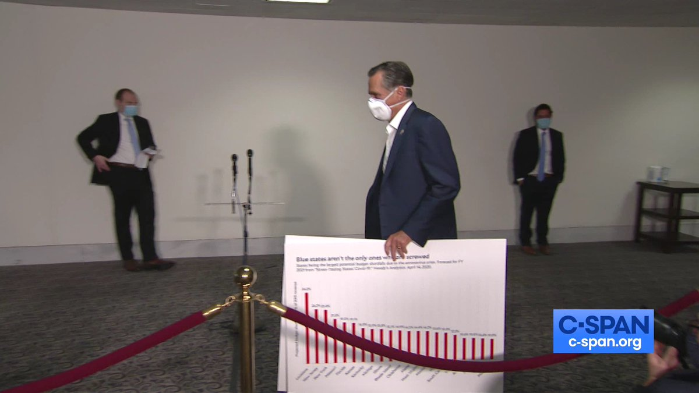
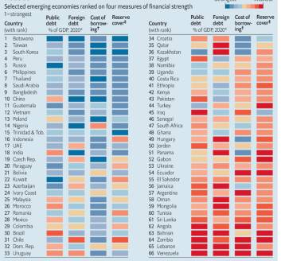
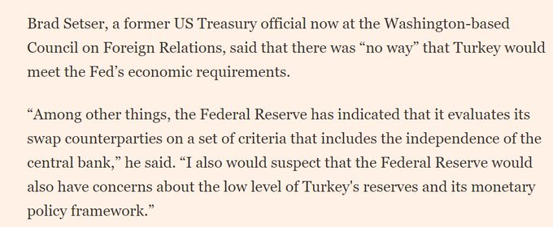

# Week 19a


"@MaartenvSmeden

Depressing to read so many COVID-19 prediction modeling studies done
extremely poor. To lift my mood I’ll start singing about it! My new
band is called Rage Against the Machine Learning"

---

<blockquote class="twitter-tweet"><p lang="en" dir="ltr">Many animals have &#39;integrated gyroscopes&#39; that allow them to keep their heads fixed on a spot despite body motions <a href="https://t.co/3dDswIyDwN">https://t.co/3dDswIyDwN</a> <a href="https://t.co/J3QBtL1rzi">pic.twitter.com/J3QBtL1rzi</a></p>&mdash; Massimo (@Rainmaker1973) <a href="https://twitter.com/Rainmaker1973/status/1258765698547023875?ref_src=twsrc%5Etfw">May 8, 2020</a></blockquote> <script async src="https://platform.twitter.com/widgets.js" charset="utf-8"></script>

---

<blockquote class="twitter-tweet"><p lang="en" dir="ltr">FuelCell Energy Platforms reach a monumental milestone in the production of 10 Million Megawatt-Hours of <a href="https://twitter.com/hashtag/cleanenergy?src=hash&amp;ref_src=twsrc%5Etfw">#cleanenergy</a> from its innovative SureSource installations across 3 continents.Our <a href="https://twitter.com/hashtag/fuelcells?src=hash&amp;ref_src=twsrc%5Etfw">#fuelcells</a> enable the world to live a life empowered by <a href="https://twitter.com/hashtag/cleanenergy?src=hash&amp;ref_src=twsrc%5Etfw">#cleanenergy</a>! <a href="https://t.co/e2qFFZzkdQ">https://t.co/e2qFFZzkdQ</a> <a href="https://t.co/lksaWKf5dk">pic.twitter.com/lksaWKf5dk</a></p>&mdash; FuelCell Energy (@FuelCell_Energy) <a href="https://twitter.com/FuelCell_Energy/status/1258767679890038784?ref_src=twsrc%5Etfw">May 8, 2020</a></blockquote> <script async src="https://platform.twitter.com/widgets.js" charset="utf-8"></script>

---

NYT same article

[Link](https://www.nytimes.com/reuters/2020/05/08/business/08reuters-health-coronarivus-hydrogen-analysis.html)

---

Reuters: "Hydrogen has long been touted as a clean alternative to
fossil fuels. Now, as major economies prepare green investments to
kickstart growth, advocates spy a golden chance to drag the niche
energy into the mainstream of a post-pandemic world.

Green hydrogen was pushed to the fore last week when Fatih Birol, head
of the International Energy Agency, said the technology was "ready for
the big time" and urged governments to channel investments into the
fuel"

[Link](https://www.yahoo.com/news/green-hydrogens-time-come-advocates-060450891.html)

---

Marcus: "BEV people lie when they say 'infrastructure for EVs' already
exists. It doesn't. The grid is not cheap to extend + or balance. BEV
folks ignore system level costs. Hydrogen EV refueling model is
cheaper"

---

"@physorg_com

Surfaces that grip like gecko feet could be easily mass-produced"

---

EU’s Energy Cief Simson: "Central to energy system integration is the
deployment of new fuel sources... This has the potential to be a game
changer,” Simson said. “It could act as an enabler, especially for the
hard-to-decarbonise sectors like heavy industry and transport”.

Molecular energy carriers – or gases – are easier to use in sectors
like heavy-duty transport where the weight of batteries makes
electrification inconvenient. Molecules are also used as a feedstock
for industries like steel-making or fertiliser production"

[Link](https://www.euractiv.com/section/energy-environment/news/hydrogen-will-be-central-to-energy-system-integration-eu-says/)

---

He did well in PMQ as well. Looking more like a closer every day.

"@George_Osborne

The Labour Leader writing in the Daily Telegraph on VE Day tells you
one thing - this guy is going to do everything he can to win"

---

Finkel: "I want my phone to take my complex questions, interpret them
locally without ever seeking advice from a cloud-based server, and
then anonymously reach out to the cloud to get the answers to what I
need.

AI on my device, not in the cloud...

In fact, I know we have the capacity to ‘make it so’.

Last year, I attended a government summit called Techtonic hosted by
Minister Karen Andrews.

It was there I first learned about Home Guardian, an Australian
company with a very simple system that has the potential to
revolutionise the aged care, disability and hospital sectors.

Using a world-first artificial intelligence device, Home Guardian uses
sensors to monitor movement. It alerts carers or family members, via
text message, if an unexplained fall occurs – all without being
connected to the internet, without consulting an external server,
without compromising privacy.

AI on my device, not in the cloud"

[Link](https://www.theaustralian.com.au/business/technology/ai-on-my-device-not-in-the-cloud/news-story/e233fc805051346cd828c0794b0b7a6a)

---

AU Chief Scientist Finkel: "When I use my iPhone, I say 'Siri, call my
wife, Elizabeth Finkel'. And Siri very happily replies 'calling
Elizabeth Finkel'.

And it works really well, unless of course I am in an underground car
park. In that case, Siri goes silent before sheepishly saying “Uh oh,
I’m having trouble connecting”.

What this tells me is that the speech processing is not being
performed on my iPhone.

Instead, my instruction goes to a server – a gigantic computer in the
United States – that processes my words and sends them back to my
iPhone as digital instructions rather than the original audio.

Nearly everything you do on your smartphone is stored, deconstructed
and analysed by servers devoid of any morals"

[Link](https://www.theaustralian.com.au/business/technology/ai-on-my-device-not-in-the-cloud/news-story/e233fc805051346cd828c0794b0b7a6a)

---

"Germany’s 83rd hydrogen station opens..  H2 Mobility, along with its
partners Shell and Air Liquide, has opened Germany’s 83rd hydrogen
refuelling station in Dortmund in the North Rhine-Westphalia region"

---

"@fuelcellsworks

APA Group Receives 2 Million dollar Funding for Renewable \#Hydrogen
Energy Trial in Queensland--1.1 dollar million in funding from the
Australian Renewable Energy Agency (ARENA)"

---

<blockquote class="twitter-tweet"><p lang="en" dir="ltr">Energy Observer’s First Transatlantic Passage a Complete Success-Thanks to the optimised synergy of her new <a href="https://twitter.com/hashtag/fuelcell?src=hash&amp;ref_src=twsrc%5Etfw">#fuelcell</a> system developed with Toyota achieved unprecedented level of performance-<a href="https://t.co/f4vTc1nIPH">https://t.co/f4vTc1nIPH</a> <a href="https://twitter.com/energy_observer?ref_src=twsrc%5Etfw">@energy_observer</a> <a href="https://twitter.com/hashtag/hydrogennow?src=hash&amp;ref_src=twsrc%5Etfw">#hydrogennow</a> <a href="https://twitter.com/hashtag/fuelcell?src=hash&amp;ref_src=twsrc%5Etfw">#fuelcell</a> <a href="https://twitter.com/hashtag/fuelcells?src=hash&amp;ref_src=twsrc%5Etfw">#fuelcells</a> <a href="https://twitter.com/hashtag/zeroemissions?src=hash&amp;ref_src=twsrc%5Etfw">#zeroemissions</a> <a href="https://t.co/2a8hcmmmqU">pic.twitter.com/2a8hcmmmqU</a></p>&mdash; FuelCellsWorks (@fuelcellsworks) <a href="https://twitter.com/fuelcellsworks/status/1258647822913556481?ref_src=twsrc%5Etfw">May 8, 2020</a></blockquote> <script async src="https://platform.twitter.com/widgets.js" charset="utf-8"></script>

---

"@Airbus

In April 2020 we logged 9 net orders - taking our total net orders for
2020 to 299 aircraft so far. Last month also marked the delivery of 14
jets"

---

Wow. Some Indian students stuck in UK with no money no food?

[Link](https://youtu.be/UAdpK-Sigiw)

---

Roubini: "Market expectations of a quick recovery are "far-fetched"

[Link](https://mobile.twitter.com/BloombergTV/status/1258413393662431234)

---

Nel reiterates positive long-term outlook in Q1 2020 results

[Link](https://www.h2-view.com/story/nel-reiterates-positive-long-term-outlook-in-q1-2020-results/)

---

<blockquote class="twitter-tweet"><p lang="en" dir="ltr">Shell Nederland &amp; ENCO Working Together to Create Green Hydrogen Hub in the Port of Rotterdam--<a href="https://twitter.com/hashtag/Wind?src=hash&amp;ref_src=twsrc%5Etfw">#Wind</a> energy to power Rotterdam green <a href="https://twitter.com/hashtag/hydrogen?src=hash&amp;ref_src=twsrc%5Etfw">#hydrogen</a> plant up by 2023 with a capacity of 759 MW enough to power +1 million Dutch homes-<a href="https://t.co/EoVXSC7B6S">https://t.co/EoVXSC7B6S</a> <a href="https://twitter.com/hashtag/hydrogennow?src=hash&amp;ref_src=twsrc%5Etfw">#hydrogennow</a> <a href="https://twitter.com/hashtag/decarbonise?src=hash&amp;ref_src=twsrc%5Etfw">#decarbonise</a> <a href="https://twitter.com/hashtag/H2?src=hash&amp;ref_src=twsrc%5Etfw">#H2</a> <a href="https://t.co/Win02KaISi">pic.twitter.com/Win02KaISi</a></p>&mdash; FuelCellsWorks (@fuelcellsworks) <a href="https://twitter.com/fuelcellsworks/status/1258396274740596741?ref_src=twsrc%5Etfw">May 7, 2020</a></blockquote> <script async src="https://platform.twitter.com/widgets.js" charset="utf-8"></script>

---


<blockquote class="twitter-tweet"><p lang="en" dir="ltr">AGT Technologies: Alternative Production of HYDROGEN--The extraction of H2 as motor fuel from renewable raw materials using the AGT technologies (developed by AGT &amp; University of St. Andrews, Scotland)--<a href="https://t.co/BwxJnX6Sfj">https://t.co/BwxJnX6Sfj</a> <a href="https://twitter.com/hashtag/hydrogennow?src=hash&amp;ref_src=twsrc%5Etfw">#hydrogennow</a> <a href="https://twitter.com/hashtag/zeroemissions?src=hash&amp;ref_src=twsrc%5Etfw">#zeroemissions</a> <a href="https://twitter.com/hashtag/decarbonise?src=hash&amp;ref_src=twsrc%5Etfw">#decarbonise</a> <a href="https://twitter.com/hashtag/hydrogen?src=hash&amp;ref_src=twsrc%5Etfw">#hydrogen</a> <a href="https://t.co/W1HLo7qV6f">pic.twitter.com/W1HLo7qV6f</a></p>&mdash; FuelCellsWorks (@fuelcellsworks) <a href="https://twitter.com/fuelcellsworks/status/1258379634779000839?ref_src=twsrc%5Etfw">May 7, 2020</a></blockquote> <script async src="https://platform.twitter.com/widgets.js" charset="utf-8"></script>

---

<blockquote class="twitter-tweet"><p lang="en" dir="ltr">&quot;If you buy 100€ of oil for your car... 90€ [is] import[ed], and it&#39;s showing your energy dependence. If tomorrow you buy 100€ of <a href="https://twitter.com/hashtag/hydrogen?src=hash&amp;ref_src=twsrc%5Etfw">#hydrogen</a> for your car, 90€ will be locally created value. Just for the production, distribution, the conditioning of it.&quot; - Pierre-Étienne Franc</p>&mdash; At War With The Dinosaurs (@WarWithTheDinos) <a href="https://twitter.com/WarWithTheDinos/status/1258369520999313415?ref_src=twsrc%5Etfw">May 7, 2020</a></blockquote> <script async src="https://platform.twitter.com/widgets.js" charset="utf-8"></script>

---

<blockquote class="twitter-tweet"><p lang="en" dir="ltr">How the fuck is “Peggy” short for “Margaret”</p>&mdash; jewish fuckery, B.A.🎓 (@coffeespoonie) <a href="https://twitter.com/coffeespoonie/status/1258071118629519365?ref_src=twsrc%5Etfw">May 6, 2020</a></blockquote> <script async src="https://platform.twitter.com/widgets.js" charset="utf-8"></script>

---

Muller-Plantenberg thesis: "However, studying the episode in a bit
more detail, two kind of doubts emerge. The first one has to do with
the way the exchange rate is determined in the Mundell-Fleming
framework. The real exchange rate enters the model only in [some]
equation .. as a determinant of the current account. However, how the
exchange rate is itself set is not modelled explicitly. Essentially,
what the model is telling us is that the exchange rate has to adjust
itself at all times to obtain macroeconomic equilibrium and to ensure
that the current account reaches a level compatible with that
equilibrium.

The logic goes backward, not forward—similar to the argument one
sometimes hears: 'We have a current account deficit. A deficit cannot
go on forever but must revert to balance (or to some long-run
equilibrium) one day. Therefore, the exchange rate needs to
depreciate.' Most economics students find it hard to under­stand why
speculators in the foreign exchange market should at all be bothered
to please macroeconomists and to restore macroeconomic equilibrium in
this fashion.  And they are probably not alone."

---

Econ is a different beast of course. They are fukked at every level.

---

At high echelons of science if you have something good you will get
your audience. If you didnt, there is something wrong with your
theory, or something wrong with you. Don't try to appeal "to the
public", "build a movement" who wont understand a f-ing word of your
jargon anyway. Like this Sean Carroll guy and his theory... How will
speaking abt it on a podcast help you with that, except
self-aggrandizement, and/or more movie screenplay deals?

---

Good point. 

"@skdh

If you want 'respect' from physicists, you have to live up to their
quality standards. This means in particular showing that you either
reproduce the successes of existing theories with fewer assumptions or
that you can explain more data

'Physicists Criticize Stephen Wolfram’s ‘Theory of Everything’ - scientificamerican.com'"

---

Latest COV - increase at 2.53%. Russia looks bad. 

[Link](https://muratk3n.github.io/thirdwave/en/2020/02/corona.html)

---

"China suspected of bio-espionage in 'heart of EU'" -- euobserver.com

---

"@anildash

For non-coders, a little explanation of why mobile apps from Google,
Spotify, Apple, NYT, Venmo, Walmart and many others all broke for a
little while this afternoon. (Short version: they all use code from
Facebook, so when that broke, they all started crashing.)"

---

<blockquote class="twitter-tweet"><p lang="en" dir="ltr">“Today’s <a href="https://twitter.com/hashtag/hydrogen?src=hash&amp;ref_src=twsrc%5Etfw">#hydrogen</a> applications need to make it out of field testing and into the real economy .... this is the only way Europe can become climate-neutral by 2050&quot; <a href="https://t.co/CZSqXD2fiB">https://t.co/CZSqXD2fiB</a></p>&mdash; Graham Cooley (@GrahamCooley4) <a href="https://twitter.com/GrahamCooley4/status/1256590822641991681?ref_src=twsrc%5Etfw">May 2, 2020</a></blockquote> <script async src="https://platform.twitter.com/widgets.js" charset="utf-8"></script>

---

"@octonion

I fit a cubic model to my bicycling progression and I'll be biking
4000 miles/day by May 15"

---

<blockquote class="twitter-tweet"><p lang="en" dir="ltr">The Australian Government is backing the country to become a world leader in <a href="https://twitter.com/hashtag/hydrogen?src=hash&amp;ref_src=twsrc%5Etfw">#hydrogen</a> production and exports by establishing a $300m fund dedicated to hydrogen projects – a first for the government. <a href="https://t.co/NcrelFl6Uw">https://t.co/NcrelFl6Uw</a></p>&mdash; Joanna Sampson (@JoSamps92) <a href="https://twitter.com/JoSamps92/status/1257322987021189120?ref_src=twsrc%5Etfw">May 4, 2020</a></blockquote> <script async src="https://platform.twitter.com/widgets.js" charset="utf-8"></script>

---

"Internal Chinese report warns Beijing faces Tiananmen-like global
backlash over virus"

[Link](https://defconwarningsystem.com/2020/05/06/internal-chinese-report-warns-beijing-faces-tiananmen-like-global-backlash-over-virus/)

---

Tutorializing everything while learning helps. Then, for a new topic,
check the existing tutorials support the new concept. If not there,
major existing content reorientation, until it is.

---

Haha.. same page talks abt a documentary called "Meat the Future".

---

"Conventional [meat prod] methods rely on the intensive confinement
[of animals] in unsanitary and inhumane facilities. These unnatural
conditions require extensive use of antibiotics to address diseases
that proliferate among the crowded, stressed animals, contributing to
the spread of drug-resistant superbugs.

Since cultured meat is grown in a sterile environment, there is less
chance for pathogens to sneak in. This decreases the need for
antibiotics, as well as the risk of products containing
illness-causing bacteria such as salmonella and listeria"

[Link](https://www.cbc.ca/documentarychannel/m/features/documentary-meat-the-future-shows-us-the-possible-future-of-meat)

---

"@maxsparber

Obi Wan: Your father was burned so badly that all his limbs just sort
of fell off but we have such advanced technology like clones and
robotics and such that we saved him.

Luke: What about my mother?

Obi Wan: Died in childbirth, literally nothing could be done"

---

I never took 911 too seriously. A few thousand dead? Sad but no WW
level. Turned out it was an inside job anyway. Inside, as in "ally"
(and some US deepsters). This thing much more deadly and serious.

---

<blockquote class="twitter-tweet"><p lang="en" dir="ltr"><a href="https://twitter.com/hashtag/Zeroemissions?src=hash&amp;ref_src=twsrc%5Etfw">#Zeroemissions</a> is not enough; technology used must also be sustainable. Manufacturing of the <a href="https://twitter.com/hashtag/fuelcell?src=hash&amp;ref_src=twsrc%5Etfw">#fuelcell</a> power train has a lower environmental impact compared to battery. Here&#39;s a Lifecycle Assessment for our 85kW FCveloCity®-HD module for FCEBs <a href="https://t.co/5nwVdEaMAO">https://t.co/5nwVdEaMAO</a> <a href="https://twitter.com/hashtag/hydrogen?src=hash&amp;ref_src=twsrc%5Etfw">#hydrogen</a> <a href="https://t.co/CW6HBgMvwr">pic.twitter.com/CW6HBgMvwr</a></p>&mdash; Ballard Power (@BallardPwr) <a href="https://twitter.com/BallardPwr/status/1257395824021118976?ref_src=twsrc%5Etfw">May 4, 2020</a></blockquote> <script async src="https://platform.twitter.com/widgets.js" charset="utf-8"></script>

---

\#Scotland is uniquely placed to produce \#hydrogen at a scale much
cheaper and efficiently than most other countries”

[Link](https://bit.ly/3b4vD3T)

---

<blockquote class="twitter-tweet"><p lang="en" dir="ltr">Toyota Australia Welcomes $300 Million Commitment by the Clean Energy Finance Corporation to Invest in <a href="https://twitter.com/hashtag/Hydrogen?src=hash&amp;ref_src=twsrc%5Etfw">#Hydrogen</a> Energy Project--<a href="https://t.co/f0sYzNBRT1">https://t.co/f0sYzNBRT1</a> <a href="https://twitter.com/ToyotaMotorCorp?ref_src=twsrc%5Etfw">@ToyotaMotorCorp</a> <a href="https://twitter.com/hashtag/hydrogennow?src=hash&amp;ref_src=twsrc%5Etfw">#hydrogennow</a> <a href="https://twitter.com/hashtag/fuelcell?src=hash&amp;ref_src=twsrc%5Etfw">#fuelcell</a> <a href="https://twitter.com/hashtag/fuelcells?src=hash&amp;ref_src=twsrc%5Etfw">#fuelcells</a> <a href="https://twitter.com/hashtag/decarbonise?src=hash&amp;ref_src=twsrc%5Etfw">#decarbonise</a> <a href="https://twitter.com/hashtag/zeroemissions?src=hash&amp;ref_src=twsrc%5Etfw">#zeroemissions</a> <a href="https://twitter.com/hashtag/hydrogeneconomy?src=hash&amp;ref_src=twsrc%5Etfw">#hydrogeneconomy</a> <a href="https://twitter.com/hashtag/h2?src=hash&amp;ref_src=twsrc%5Etfw">#h2</a> <a href="https://twitter.com/fuelcellsworks?ref_src=twsrc%5Etfw">@fuelcellsworks</a> <a href="https://t.co/VKxtwGZMta">pic.twitter.com/VKxtwGZMta</a></p>&mdash; FuelCellsWorks (@fuelcellsworks) <a href="https://twitter.com/fuelcellsworks/status/1258043593417162759?ref_src=twsrc%5Etfw">May 6, 2020</a></blockquote> <script async src="https://platform.twitter.com/widgets.js" charset="utf-8"></script>

---

<blockquote class="twitter-tweet"><p lang="en" dir="ltr">EWB-USA today announced the seven winners of its Chill Challenge, which seeks to develop affordable off-grid refrigeration for the developing world, and three projects use natural refrigerant-based vapour compression systems. <a href="https://twitter.com/hashtag/GoNatRefs?src=hash&amp;ref_src=twsrc%5Etfw">#GoNatRefs</a> <a href="https://t.co/BZSGHgLCqn">https://t.co/BZSGHgLCqn</a></p>&mdash; ammonia21.com (@ammonia21) <a href="https://twitter.com/ammonia21/status/1258037563673247746?ref_src=twsrc%5Etfw">May 6, 2020</a></blockquote> <script async src="https://platform.twitter.com/widgets.js" charset="utf-8"></script>

---

"@Jkylebass

The Ukrainian 'junk carrier' the CCP bought through a front company is
now conducting 'operations' in the SCS. The junk carrier can only
launch 8 planes before the first plane has to land again!  It’s quite
a circus stunt..not a real fighting vessel"

---

<blockquote class="twitter-tweet"><p lang="en" dir="ltr">Wow this is wild - Yelp is replacing restaurant phone numbers with Grubhub-routed numbers that go to the restaurant, but charge the restaurants a fee for “marketing” for each order made. <a href="https://t.co/YFr4FFkPzU">https://t.co/YFr4FFkPzU</a></p>&mdash; Caitlin Lowell (@caitlin0lowell) <a href="https://twitter.com/caitlin0lowell/status/1257898044063977473?ref_src=twsrc%5Etfw">May 6, 2020</a></blockquote> <script async src="https://platform.twitter.com/widgets.js" charset="utf-8"></script>

---

<blockquote class="twitter-tweet"><p lang="en" dir="ltr">it has come to this <a href="https://t.co/ioZyp1XGwr">pic.twitter.com/ioZyp1XGwr</a></p>&mdash; Felix Salmon (@felixsalmon) <a href="https://twitter.com/felixsalmon/status/1257706835764826113?ref_src=twsrc%5Etfw">May 5, 2020</a></blockquote> <script async src="https://platform.twitter.com/widgets.js" charset="utf-8"></script>

---

Booeeiinnnggggggggg

"Government scientist Neil Ferguson resigns after breaking lockdown
rules to meet his married lover"


---

"@NuveraH2

The plunge in demand for fossil fuels is unprecedented. Renewables, by
contrast, are holding up well. According to @IEA, \#hydrogen stands
out as one of the top technologies for economic rebound and future
decarbonization"

---

<blockquote class="twitter-tweet"><p lang="en" dir="ltr">Ballard Reports Q1 2020 Results--$24.0M record first quarter revenue, up 50% year-over-year--<a href="https://t.co/42WbRaPDAf">https://t.co/42WbRaPDAf</a> <a href="https://twitter.com/BallardPwr?ref_src=twsrc%5Etfw">@BallardPwr</a> <a href="https://twitter.com/hashtag/hydrogen?src=hash&amp;ref_src=twsrc%5Etfw">#hydrogen</a> <a href="https://twitter.com/hashtag/hydrogennow?src=hash&amp;ref_src=twsrc%5Etfw">#hydrogennow</a> <a href="https://twitter.com/hashtag/decarbonise?src=hash&amp;ref_src=twsrc%5Etfw">#decarbonise</a> <a href="https://twitter.com/hashtag/zeroemissions?src=hash&amp;ref_src=twsrc%5Etfw">#zeroemissions</a> <a href="https://twitter.com/hashtag/fuelcells?src=hash&amp;ref_src=twsrc%5Etfw">#fuelcells</a> <a href="https://twitter.com/hashtag/fuelcell?src=hash&amp;ref_src=twsrc%5Etfw">#fuelcell</a> <a href="https://twitter.com/fuelcellsworks?ref_src=twsrc%5Etfw">@fuelcellsworks</a> <a href="https://t.co/rzXa7eF3x5">pic.twitter.com/rzXa7eF3x5</a></p>&mdash; FuelCellsWorks (@fuelcellsworks) <a href="https://twitter.com/fuelcellsworks/status/1258021194084868096?ref_src=twsrc%5Etfw">May 6, 2020</a></blockquote> <script async src="https://platform.twitter.com/widgets.js" charset="utf-8"></script>

---

Quick markdown based local rendering; I gen HTML with package
`markdown` then trigger browser refresh on the local file with

`xvkbd -window Firefox -text "\Cr"`

---

Pierini: "[O]ne can’t ignore economic fundamentals. Turkey is a deficit country and relies heavily on the West, primarily Europe, for its export of manufactured goods, its import of technology, and its financial needs, both in terms of short-term and direct investment. China, Russia, and the Gulf countries are not alternatives to Turkey’s European anchor. Even when Qatar or China is willing to help Turkey economically, this is not commensurate with the country’s current financial gap. Besides, beyond hopes, a functioning European economic anchor requires two features that Ankara cannot currently provide—the rule of law as well as respect and dialogue"

[Link](https://carnegie-mec.org/diwan/81717)

---


---

<blockquote class="twitter-tweet"><p lang="en" dir="ltr">I will let out a bit of a secret.<br><br>I have been running a full IBM System/370 Mainframe on a $5 Raspberry Pi Zero for ~5 years.<br><br>About 7 times faster System/370.<br><br>Millions of lines of COBOL JCLs running flawless on a battery.<br><br>Tested an entire bank’s mainframe COBOL on it. <a href="https://t.co/xFArHx31VF">pic.twitter.com/xFArHx31VF</a></p>&mdash; Brian Roemmele (@BrianRoemmele) <a href="https://twitter.com/BrianRoemmele/status/1257832168455208963?ref_src=twsrc%5Etfw">May 6, 2020</a></blockquote> <script async src="https://platform.twitter.com/widgets.js" charset="utf-8"></script>

---

Mitt be diggin that grave, he is waitin, biding his time.. He wants to
be there when it ends. He'll be there, he'll be like 'you were all up
in my grill, Imma be up in your grill'. 

When they axe 'what say you Mitt' he wants to go like 👎. Dead! 'Yeah
Imma moonwalk up and down your ass mofoka. U dont know who you messed
with...'

"@lindsaywise

Mitt Romney just came out of the GOP lunch carrying a poster board
with a bar graf on it and the title: 'Blue states aren’t the only ones
getting screwed'"



---

<blockquote class="twitter-tweet"><p lang="en" dir="ltr">The new technology has been installed into the “world’s largest” plant of its sort in the Japanese prefecture.<a href="https://twitter.com/hashtag/AsahiKasei?src=hash&amp;ref_src=twsrc%5Etfw">#AsahiKasei</a> <a href="https://twitter.com/hashtag/AsahiKaseiEngineering?src=hash&amp;ref_src=twsrc%5Etfw">#AsahiKaseiEngineering</a> <a href="https://twitter.com/hashtag/AsahiKaseitechnology?src=hash&amp;ref_src=twsrc%5Etfw">#AsahiKaseitechnology</a> <a href="https://twitter.com/hashtag/Fukushimahydrogen?src=hash&amp;ref_src=twsrc%5Etfw">#Fukushimahydrogen</a> <a href="https://twitter.com/hashtag/FukushimaHydrogenEnergyResearchField?src=hash&amp;ref_src=twsrc%5Etfw">#FukushimaHydrogenEnergyResearchField</a> <a href="https://twitter.com/hashtag/H2Energy?src=hash&amp;ref_src=twsrc%5Etfw">#H2Energy</a> <a href="https://twitter.com/hashtag/hydrogenenergy?src=hash&amp;ref_src=twsrc%5Etfw">#hydrogenenergy</a> <a href="https://twitter.com/hashtag/Japan?src=hash&amp;ref_src=twsrc%5Etfw">#Japan</a> <a href="https://t.co/xCLJVEj10W">https://t.co/xCLJVEj10W</a></p>&mdash; Hydrogen Fuel News (@hydrogenfuelnew) <a href="https://twitter.com/hydrogenfuelnew/status/1257774310023987201?ref_src=twsrc%5Etfw">May 5, 2020</a></blockquote> <script async src="https://platform.twitter.com/widgets.js" charset="utf-8"></script>


---

7 of 9 was on *Picard*. Or 2 of 2 nam sayin?

Boiinnnggggggggg.

They made her a lizzziiie, but little side comment she was straight on
*Voyager* she got it on with the first ethnic US Indian. Now you made
it to be like she was so turned off the bro she turned lesbo.

See you try too hard on Woke you go broke.

---


---

I think I am turning into a collector of good scifi, pre 2016 - it
will be like an archeological dig after a while cuz a lot of stuff is
turning into shit.

---

<blockquote class="twitter-tweet"><p lang="en" dir="ltr">Selling my house and living in a van down by the river would also allow me to pay the bills next month. <br>So would a tiny tax on unjustly and unimaginably large fortunes that would not affect the standard of living of the people who hoard those fortunes. <a href="https://t.co/byZQc6mm3A">https://t.co/byZQc6mm3A</a></p>&mdash; Every Billionaire Is A Policy Failure (@DanRiffle) <a href="https://twitter.com/DanRiffle/status/1257713525272784898?ref_src=twsrc%5Etfw">May 5, 2020</a></blockquote> <script async src="https://platform.twitter.com/widgets.js" charset="utf-8"></script>

---

Oh yeah the Mambo


---

Trek Insurrection filmed partly around Lake Sabrina in the Sierra
Nevada? Nice scenary.

---

<blockquote class="twitter-tweet"><p lang="en" dir="ltr">Indeed. Plus a 9th order polynomial fits the data so much better!</p>&mdash; Jeff Linderoth (@JeffLinderoth) <a href="https://twitter.com/JeffLinderoth/status/1257643865940594688?ref_src=twsrc%5Etfw">May 5, 2020</a></blockquote> <script async src="https://platform.twitter.com/widgets.js" charset="utf-8"></script>

---

<blockquote class="twitter-tweet" data-conversation="none"><p lang="en" dir="ltr">Petnet could *barely* keep its feeder&#39;s backend running before COVID19 but now it&#39;s trying to use it as an excuse to charge a monthly fee? holy hell <a href="https://t.co/jUEoJCQrJ3">pic.twitter.com/jUEoJCQrJ3</a></p>&mdash; Internet of Stay Home (@internetofshit) <a href="https://twitter.com/internetofshit/status/1253820310975102976?ref_src=twsrc%5Etfw">April 24, 2020</a></blockquote> <script async src="https://platform.twitter.com/widgets.js" charset="utf-8"></script>

---

"@BCAppelbaum

When the Reagan administration decided to stop enforcing the nation's
antitrust laws, it started by allowing the consolidation of the
meatpacking industry.

Seems as good a place as any to resume the enforcement of the nation's
antitrust laws..."

---

<blockquote class="twitter-tweet"><p lang="en" dir="ltr">The state of journalism captured in one tweet <a href="https://t.co/Q85jWRlhrC">https://t.co/Q85jWRlhrC</a></p>&mdash; Alex Kantrowitz (@Kantrowitz) <a href="https://twitter.com/Kantrowitz/status/1257492509430693889?ref_src=twsrc%5Etfw">May 5, 2020</a></blockquote> <script async src="https://platform.twitter.com/widgets.js" charset="utf-8"></script>

---

<blockquote class="twitter-tweet"><p lang="en" dir="ltr">Rice University researchers have created an efficient, low-cost device that splits water to produce hydrogen fuel. The platform integrates catalytic electrodes and perovskite solar cells that, when triggered by sunlight, produce electricity <a href="https://t.co/ZxrTayqeve">https://t.co/ZxrTayqeve</a> <a href="https://t.co/Dk2EztS8iG">pic.twitter.com/Dk2EztS8iG</a></p>&mdash; Massimo (@Rainmaker1973) <a href="https://twitter.com/Rainmaker1973/status/1257553081912393729?ref_src=twsrc%5Etfw">May 5, 2020</a></blockquote> <script async src="https://platform.twitter.com/widgets.js" charset="utf-8"></script>

---

"[Bancor's] Clearing Union would grant credit in the form of overdraft
facilities. In other terms, each member would have the possibility of
financing a trade deficit simply by entering a negative balance on its
account. Symmetrically, a country with a trade surplus would have a
positive balance credited to its account. Hence, for example, an
export from country A to country B financed by the Clearing Union
would give rise to the simultaneous registration of two entries of
equal amount: a credit to the account of A and a debit to the account
of B. Thanks to the centralization of all accounts at the Clearing
Union, however, the credit and debit would not be bilateral, but
multilateral positions, of each country vis‐à‐vis all the other
members as a whole. In other terms, the surplus country A could spend
its credit in bancor not only with B, but with any other member
country; and B could reduce its debit by exporting towards any other
country. In this way, the Clearing Union would be able, in principle,
to finance international trade and its expansion, without the need of
any given amount of money.

Bancor is not a fiat money. To be sure, it is created ex nihilo. And
yet its creation does not depend on the decision of a central
authority"


[Link](../../2019/06/bancor.md)

---

"As if"

"@RickDeVos

It’s almost as if an entire system of perception & governance built to
systematically bury ideas of limitations, trade-offs and imperfect
arrangements under an avalanche of emotional rhetoric, fantasies, and
engineered narratives would be ripe for slow motion, cascading
failure"

---

"@maxberger

Nancy Pelosi has $46 million in real estate property she can fall back
on during hard times.

The most generous read of her tepid response to the crisis is that
she's out of touch with working people. The least generous read is
that her interests are at odds with ours"

---

Education? All u need is a tablet with teaching material on it. Video
lectures, ebooks, problems with solutions.

There can be a "school" but in a postmodern reincarnation it would
mostly be a loungy area, a cross between a Starbucks and a mall. There
can be play areas, study areas where some professional grown-ups can
donate time as "groundkeepers" making sure kids are silent. They can
be certified on the e-material as well, by the DOeD, so they can
answer questions. But they should not teach. Feynman should teach your
children not some random average jerkoff.

More [here](../../2018/09/public-education.md)

---

"@stevenacook

Enlisting Turkey to counter or fight Iran is a fantasy"

[Link](https://warontherocks.com/2020/05/strategic-fail-partnering-with-turkey-to-counter-iran-would-misread-the-region/)

---

Seems like a usable camping light - The Fenix CL20R. Have been looking
for something light, rechargable, and durable 4 some time... Went
through many, one hi-tech prod sold as "chargable by sunlight" was
totally not (inno funded by the Clinton Foundation, it figures), and
two more weirdo gismos later, this looks good.


<blockquote class="twitter-tweet"><p lang="en" dir="ltr">As the cost of making <a href="https://twitter.com/hashtag/hydrogen?src=hash&amp;ref_src=twsrc%5Etfw">#hydrogen</a> becomes cheaper, the hydrogen economy looks more and more like the path to <a href="https://twitter.com/hashtag/decarbonization?src=hash&amp;ref_src=twsrc%5Etfw">#decarbonization</a>. <a href="https://t.co/3hszedzNaO">https://t.co/3hszedzNaO</a> <a href="https://twitter.com/hashtag/energytransition?src=hash&amp;ref_src=twsrc%5Etfw">#energytransition</a></p>&mdash; Ballard Power (@BallardPwr) <a href="https://twitter.com/BallardPwr/status/1257278822535356417?ref_src=twsrc%5Etfw">May 4, 2020</a></blockquote> <script async src="https://platform.twitter.com/widgets.js" charset="utf-8"></script>

---

"@Joanna_Y_Lee

Took our time to get it right, but our COVID19 antibody test is
finally out! Shows >99.8% specificity and 100% sensitivity"

---

"Amazon VP Resigns, Calls Company ‘Chickenshit’ for Firing Protesting
Workers" - vice.com

---

"Green light for hydrogen-powered homes in Scotland h2-view.com"

[Link](https://www.h2-view.com/story/green-light-for-hydrogen-powered-homes-in-scotland/)

---

"@fuelcellsworks

World’s First International Transport of Hydrogen from Brunei to
Japan-Foreign-produced #hydrogen has arrived in Japan for 1st time
from Brunei"

---

<blockquote class="twitter-tweet"><p lang="en" dir="ltr">300 Million (<a href="https://twitter.com/hashtag/Australia?src=hash&amp;ref_src=twsrc%5Etfw">#Australia</a> dollar) <a href="https://twitter.com/hashtag/Morrison?src=hash&amp;ref_src=twsrc%5Etfw">#Morrison</a> government commitment to gray/blue and <a href="https://twitter.com/hashtag/green?src=hash&amp;ref_src=twsrc%5Etfw">#green</a> <a href="https://twitter.com/hashtag/hydrogen?src=hash&amp;ref_src=twsrc%5Etfw">#hydrogen</a>.<a href="https://t.co/FE9ZYOUifh">https://t.co/FE9ZYOUifh</a></p>&mdash; Hydrogen is the battery (@BatteryH2) <a href="https://twitter.com/BatteryH2/status/1257334958072397825?ref_src=twsrc%5Etfw">May 4, 2020</a></blockquote> <script async src="https://platform.twitter.com/widgets.js" charset="utf-8"></script>

---

<blockquote class="twitter-tweet"><p lang="en" dir="ltr">Hysolar Unveils its Green Hydrogen Station Design-<a href="https://twitter.com/Hysolar_NL?ref_src=twsrc%5Etfw">@Hysolar_NL</a> aims to deliver green <a href="https://twitter.com/hashtag/hydrogen?src=hash&amp;ref_src=twsrc%5Etfw">#hydrogen</a> for sustainable transport at the end of 2020. The company recently unveiled its designs for its locally produced green hydrogen station-<a href="https://t.co/MAclv0H905">https://t.co/MAclv0H905</a> <a href="https://twitter.com/hashtag/hydrogennow?src=hash&amp;ref_src=twsrc%5Etfw">#hydrogennow</a> <a href="https://twitter.com/hashtag/decarbonise?src=hash&amp;ref_src=twsrc%5Etfw">#decarbonise</a> <a href="https://t.co/kUT2bghbIk">pic.twitter.com/kUT2bghbIk</a></p>&mdash; FuelCellsWorks (@fuelcellsworks) <a href="https://twitter.com/fuelcellsworks/status/1257316257528836098?ref_src=twsrc%5Etfw">May 4, 2020</a></blockquote> <script async src="https://platform.twitter.com/widgets.js" charset="utf-8"></script>

---

EGG DOG!

<blockquote class="twitter-tweet"><p lang="en" dir="ltr">It&#39;s Monday. Here&#39;s an egg dog. Wait for the smile. 😊 <a href="https://t.co/2CPjN118xh">pic.twitter.com/2CPjN118xh</a></p>&mdash; Mara Averick (@dataandme) <a href="https://twitter.com/dataandme/status/1257258239886057473?ref_src=twsrc%5Etfw">May 4, 2020</a></blockquote> <script async src="https://platform.twitter.com/widgets.js" charset="utf-8"></script>

---

Brrr you know like [brrrrr](https://thumbs.gfycat.com/RigidNaturalDogwoodtwigborer-max-1mb.gif)

---

The Y-scale is all wrong. They cooked this one up. Deutsche Bank, WTF?

I checked this rel, The 1929 rel broke, with the FED going brrrrrrrr

<blockquote class="twitter-tweet"><p lang="en" dir="ltr">If you ever feel like you aren’t good enough, just remember that one of the most well-known banks in the world calls this chart “research”: <a href="https://t.co/1bDe3N5ReM">pic.twitter.com/1bDe3N5ReM</a></p>&mdash; Nick Maggiulli (@dollarsanddata) <a href="https://twitter.com/dollarsanddata/status/1256938136480907266?ref_src=twsrc%5Etfw">May 3, 2020</a></blockquote> <script async src="https://platform.twitter.com/widgets.js" charset="utf-8"></script>

---

There. Paper saz minimum cost net flow is $O(m^{3/2})$ where m is
number of edges. When sparse that'll beat Djiks.

---

Hmm. I bet shortest path prob as a minimum cost network flow, which in
the backend solved as LP, implemented through log-barrier and solved
in continuous realm with Newton steps etc works faster.

LPs are convex, solved problem.

Incidence matrix for SP is sparse. I've never seen such optimization
probs taking more than 15 steps, so O(1). Sparse matrix inversion,
banded, structured is O(n) (needed for Newton steps). So I bet that
V^2 is beatable.

"@NetworkFact

Dijkstra's algorithm finds the shortest paths from a node s to all
other nodes in a graph with non-negative edge weights. Run time
O(V^2)"

---

<blockquote class="twitter-tweet"><p lang="en" dir="ltr">the replication crisis in psychology didn’t actually happen, the underlying reality just changed. this process is accelerating and will come for your favorite field too</p>&mdash; bowser 🦾 (@browserdotsys) <a href="https://twitter.com/browserdotsys/status/1256623532043317248?ref_src=twsrc%5Etfw">May 2, 2020</a></blockquote> <script async src="https://platform.twitter.com/widgets.js" charset="utf-8"></script>

---

We need [bancor](../../2019/06/bancor.md)

---


---

"A University of Central Florida researcher and his team have developed
an advanced new rocket-propulsion system once thought to be
impossible.

The system, known as a rotating detonation rocket engine, will allow
upper stage rockets for space missions to become lighter, travel
farther, and burn more cleanly"

[Link](https://techxplore.com/news/2020-04-groundbreaking-rocket-propulsion.amp)

---

"@JulieMac08

We just received amazing news about our friend ..  receiving plasma
from a donor with covid-19 antibodies & is responding well! He is not
out of the woods yet, definitely has a long way to go but this therapy
is showing promise!!!"

---

NYT: "The problem, Garrett added, is bigger than Trump and older than
his presidency. America has never been sufficiently invested in public
health. The riches and renown go mostly to physicians who find new and
better ways to treat heart disease, cancer and the like. The big
political conversation is about individuals’ access to health care.

But what about the work to keep our air and water safe for everyone,
to design policies and systems for quickly detecting outbreaks,
containing them and protecting entire populations? Where are the
rewards for the architects of that?

Garrett recounted her time at Harvard. 'The medical school is all
marble, with these grand columns,” she said. “The school of public
health is this funky building, the ugliest possible architecture, with
the ceilings falling in.'"

'That’s America?' I asked.

'That’s America,' she said.

[Link](https://www.nytimes.com/2020/05/02/opinion/sunday/coronavirus-prediction-laurie-garrett.html?smid=tw-share)

---

"@gregeganSF

So, a billionaire bought a disused underground nuclear missile silo
and turned it into an inverted skyscraper/self-contained bunker full
of luxury accommodation and video screen windows and now he and 57
other people have gone inside and shut the doors"

[Link](https://twitter.com/gregeganSF/status/1256394922812297218)

---

Arschbombe

<blockquote class="twitter-tweet"><p lang="de" dir="ltr"><a href="https://twitter.com/hashtag/Laschet?src=hash&amp;ref_src=twsrc%5Etfw">#Laschet</a> will den “schwedischen Weg”. Schweden hat zur Zeit über 10mal mehr Tote zu beklagen als die direkten Nachbarn, die den “deutschen Weg” gehen. Tedenz steigend!<br>Und das im bevölkerungsreichsten und -dichtesten Bundesland ... 😱😱🤦‍♂️ <a href="https://t.co/iLOUsmeFVF">pic.twitter.com/iLOUsmeFVF</a></p>&mdash; Nicolaus Kopernikus (@CheckYourInfo) <a href="https://twitter.com/CheckYourInfo/status/1256486754888056835?ref_src=twsrc%5Etfw">May 2, 2020</a></blockquote> <script async src="https://platform.twitter.com/widgets.js" charset="utf-8"></script>

---

At 25:30 some globalist shit being peddled right there..  "globalism
is here to stay". Really? Keyes had some good ideas , but Bam is the
better closer.

Around 35:00 it gets f-ing nuts. 

"Debate for US Senator from Illinois (Obama, Keyes)"

[Link](https://www.youtube.com/watch?v=tQG5hIPJK0g)

---

CNN: "China can shut off the Philippines' power grid at any time,
leaked report warns"

---

"@marcelsalathe

Today I learned that pure water freezes at -48C, not at 0C. 

Not sure when I last posted something not COVID-related, but this
seems sufficiently mind blowing, at least to me"

---

<blockquote class="twitter-tweet"><p lang="en" dir="ltr">This pandemic killed my grandfather but yes, I am sorry you have not been able to get your haircut. <a href="https://t.co/pYPQhSi78x">https://t.co/pYPQhSi78x</a></p>&mdash; b-boy bouiebaisse (@jbouie) <a href="https://twitter.com/jbouie/status/1256743817224392706?ref_src=twsrc%5Etfw">May 3, 2020</a></blockquote> <script async src="https://platform.twitter.com/widgets.js" charset="utf-8"></script>

---

"@KarlreMarks

The best moment when people visit Lebanon with me is when they ask me
what the traditional drink is and I explain that it's Pepsi"

---

"It is a well-kept secret, but we know the answer to life, the universe
and everything. It’s not 42 – it’s 1/137.

This immutable number determines how stars burn, how chemistry happens
and even whether atoms exist at all. Physicist Richard Feynman, who
knew a thing or two about it, called it 'one of the greatest damn
mysteries of physics: a magic number that comes to us with no
understanding'"

[Link](https://www.newscientist.com/article/mg24031982-200-theres-a-glitch-at-the-edge-of-the-universe-that-could-remake-physics/)

---

<blockquote class="twitter-tweet"><p lang="en" dir="ltr">This sheep escaped a farm and spent 6 years in the mountains, during which time he grew 60 pounds of wool. Wolves tried to eat him, but their teeth could not penetrate the floof. You don&#39;t have to turn hard to survive the wolves, just be really, really soft and fluffy. <a href="https://t.co/VYdxujSU8l">pic.twitter.com/VYdxujSU8l</a></p>&mdash; Sami Abdul Aziz (@ChaplainAziz) <a href="https://twitter.com/ChaplainAziz/status/1256585867654828032?ref_src=twsrc%5Etfw">May 2, 2020</a></blockquote> <script async src="https://platform.twitter.com/widgets.js" charset="utf-8"></script>

---

"@biotequity

CCP19: Want to know the truth?  DEMAND THE LAB NOTEBOOKS FROM WUHAN -
all of them: cant be faked. And are page/date certain.  ALL THE
ANSWERS ARE THERE"

---

"@nntaleb

QUESTION

Given that 1) people stopped going to restaurants, 2) they kept
eating, & 3) farmers are dumping produce, dairy, meat owing to a
surplus nobody wants, could it be that restaurants, (because of their
need to maintain variety & excess quantities) waste a looot of food?"

---

"@russian_market

North Korea and South Korea exchange fire"

---

"@raoulGMI

We’re about to have deflation and the market hasn’t figured it out yet"
 
[Link](https://mobile.twitter.com/RealVision/status/1256342758178119689)

---

It's true. That's why I changed my publishing system, all content you
now see are the product of text files, typed in a very simple markdown
format, that I "check in" to my own local code repository. I sync that
repo with a remote one, to publish, which has an added web page
generation ability from that remote repo from markdown, but that func
can be replicated elsewhere. The point is I own all the base
content. It's all based on simple files.

Reading Snowden's book made me remember the good old times of the Net,
I am also very much a product of that era as he is.

Snowden, *Permanent Record* - "Now, it was the creative Web that
collapsed [after 90s], as countless beautiful, difficult,
individualistic websites were shuttered. The promise of convenience
led people to exchange their personal sites—which demanded constant
and laborious upkeep—for a Facebook page and a Gmail account. The
appearance of ownership was easy to mistake for the reality of it. Few
of us understood it at the time, but none of the things that we’d go
on to share would belong to us anymore."

---


"@ZaneGTCooper Replying to  @timmaughan

I’m like 80% positive the pitch meeting was just Greg Daniels thinking
of ways to generate revenue through native advertising and he
eventually blurted our 'The Good Place, but computers.'"

---

<blockquote class="twitter-tweet"><p lang="en" dir="ltr">oh no it’s worse than that it’s the fucking good place again</p>&mdash; Tim Maughan (@timmaughan) <a href="https://twitter.com/timmaughan/status/1256783936124080128?ref_src=twsrc%5Etfw">May 3, 2020</a></blockquote> <script async src="https://platform.twitter.com/widgets.js" charset="utf-8"></script>

---

<blockquote class="twitter-tweet"><p lang="en" dir="ltr">We would like to share an extended SEIR model and easy to use python package for studying population structure, social distancing, testing, tracing, and quarantining—including stochastic implementations of these models on dynamic networks. (thread) <a href="https://t.co/pdx8TqdVrx">pic.twitter.com/pdx8TqdVrx</a></p>&mdash; Ryan Seamus McGee (@RS_McGee) <a href="https://twitter.com/RS_McGee/status/1242949797247508480?ref_src=twsrc%5Etfw">March 25, 2020</a></blockquote> <script async src="https://platform.twitter.com/widgets.js" charset="utf-8"></script>

---

"@NewYorker

'I have 773 dollars in my bank account. My rent is 958.65. I paid in
April, but now I can’t,' a domestic worker said at the end of last
month. Now, she is holding rent-strike meetings for nearly 200 renters"

---

Sadly my niggers are on the right-hand side of this picture.

"@Brad_Setser

One thing that I liked about @TheEconomist vulnerability index is that
the countries at the top of the list map well to the set of countries
with what I have called "fortress" balance sheets (more fx reserves
than fx denominated external debt)"



---


"@joshua_landis

Nearly 2,000 Syrian Mercenaries Sent to Libya by Turkey Have Fled to
Europe"

---

<blockquote class="twitter-tweet"><p lang="en" dir="ltr">A local movie theatre (seats 350) is doing private family screenings, including amazing popcorn that will block your arteries in real time. We booked immediately, of course!<br><br>What movie is worthy of this surreal big screen experience? 📽🍿</p>&mdash; Jenny Bryan (@JennyBryan) <a href="https://twitter.com/JennyBryan/status/1256814870453841920?ref_src=twsrc%5Etfw">May 3, 2020</a></blockquote> <script async src="https://platform.twitter.com/widgets.js" charset="utf-8"></script>

---

<blockquote class="twitter-tweet"><p lang="und" dir="ltr"><a href="https://t.co/hxtLE1xUGX">pic.twitter.com/hxtLE1xUGX</a></p>&mdash; Aaron Huertas (@aaronhuertas) <a href="https://twitter.com/aaronhuertas/status/1256771788387819520?ref_src=twsrc%5Etfw">May 3, 2020</a></blockquote> <script async src="https://platform.twitter.com/widgets.js" charset="utf-8"></script>

---

Billionaires of NY could be taxed more but centrist Dems are loath to
do anything against their class interest.

---

<blockquote class="twitter-tweet"><p lang="en" dir="ltr">BREAKING: <a href="https://twitter.com/GovJVentura?ref_src=twsrc%5Etfw">@GovJVentura</a> becomes a member of <a href="https://twitter.com/GreenPartyMN?ref_src=twsrc%5Etfw">@GreenPartyMN</a> as co-chair <a href="https://twitter.com/TrahernCrews?ref_src=twsrc%5Etfw">@TrahernCrews</a> looks on. It&#39;s coming!! <a href="https://twitter.com/hashtag/Ventura2020?src=hash&amp;ref_src=twsrc%5Etfw">#Ventura2020</a> <a href="https://twitter.com/hashtag/VforVentura?src=hash&amp;ref_src=twsrc%5Etfw">#VforVentura</a> <a href="https://t.co/xVLlxPmmIr">pic.twitter.com/xVLlxPmmIr</a></p>&mdash; Neil Jones (@dneiljones813) <a href="https://twitter.com/dneiljones813/status/1256630393509462018?ref_src=twsrc%5Etfw">May 2, 2020</a></blockquote> <script async src="https://platform.twitter.com/widgets.js" charset="utf-8"></script>

---


---

🤦‍♂️🤦‍♂️🤦‍♂️🤦‍♂️

Gelman: "Still no data and no code"

---

Gelman: "Overall, the new [Updated Santa Clara coronavirus report] is
stronger than the old, because it includes more data summaries and
more evidence regarding the all-important specificity number."

[Link](https://statmodeling.stat.columbia.edu/2020/04/30/updated-santa-clara-study-of-coronavirus-infection/)

---

The math looks tight -
[PDF](https://isiarticles.com/bundles/Article/pre/pdf/79576.pdf). I
would forgo the analytic solutions just solve everything
numerically. Data ref would be nice.

Muller-Plantenberg: "[Researchers found that ] a small set of
variables–including the current account as a percentage of GDP, export
growth, international reserves and short-term foreign debt relative to
reserves–do a very good job in predicting the EMS crisis in 1992–1993,
the Mexican crisis in 1994–1995 as well as the Asian crisis in 1997"

---

"Portugal plans new hydrogen plant in post-coronavirus 'green' future"

---

Wut - black ppl are dying at higher rates?

[Link](https://www.youtube.com/watch?v=8L7s7Z6nECQ)

---

<blockquote class="twitter-tweet"><p lang="en" dir="ltr"><a href="https://twitter.com/search?q=%24NANO&amp;src=ctag&amp;ref_src=twsrc%5Etfw">$NANO</a> is in the peculiar situation where it doesn&#39;t allure investors with node staking gains, mining, lucrative ROI or extensive marketing.<br><br>It doesn&#39;t capture fees or burn tokens to gain value.<br><br>It simply does one thing extremely well:<br>Be digital cash.<br>Better than <a href="https://twitter.com/hashtag/Bitcoin?src=hash&amp;ref_src=twsrc%5Etfw">#Bitcoin</a> <a href="https://t.co/Ywrew9qJbh">pic.twitter.com/Ywrew9qJbh</a></p>&mdash; AkuRypto (@AkuRypto) <a href="https://twitter.com/AkuRypto/status/1256365409185521664?ref_src=twsrc%5Etfw">May 1, 2020</a></blockquote> <script async src="https://platform.twitter.com/widgets.js" charset="utf-8"></script>

---

<blockquote class="twitter-tweet"><p lang="en" dir="ltr">mechanical keyboard reviews never fail to disappoint. The struggle is real. <a href="https://t.co/GmOBgtC8d2">pic.twitter.com/GmOBgtC8d2</a></p>&mdash; JD Long (@CMastication) <a href="https://twitter.com/CMastication/status/1256236920558030854?ref_src=twsrc%5Etfw">May 1, 2020</a></blockquote> <script async src="https://platform.twitter.com/widgets.js" charset="utf-8"></script>

---

Effin Russkies. We all know it, there is this sheer mental rawpower
coming out of these muthafukkas, it is a joke almost in science
circles. Boyd from Stanford was talking about a new area, says 'one
day someone will find a result for it..' then says 'and I bet that
person will be a Russian' half-jokingly and laughs. It's true. Is it
the extreme cold..? Nothing else to do, either drink vodka or study.

---

"St Petersburg University students develop a hydrogen fuel cell ..

‘The most important thing for a catalyst is that it should not be very
expensive and should have a high power output per square
centimetre. You can increase this useful surface through porosity,’
explains Stepan Danilov. ‘Knowing this, we used nanostructured
nickel. It resembles Raney nickel, but we managed to make the material
even more porous. In order to further increase the activity of the
catalyst, we introduced platinum nano points into it - they are so
small that they have little or no effect on the cost of the fuel
cell. This allows our project to compete with lithium-ion batteries in
terms of price and performance.

The hydrogen fuel cell prototypes for quadrotors last two to three
times longer due to their higher capacity. While the operating
temperature of lithium-ion batteries ranges from minus 20 °C to plus
60 °C, the hydrogen fuel cells developed by the Hydrogen Express team
have a much larger operating temperature range – from minus 60 °C to
plus 80 °C.

According to the team members, modern hydrogen fuel cells are quite
comparable in terms of safety with internal combustion engines, but
unlike them and lithium-ion batteries, hydrogen fuel cells do not harm
the environment"

[Link](https://english.spbu.ru/news/3621-st-petersburg-university-students-develop-a-hydrogen-fuel-cell-to-replace-lithium-ion-batteries)

---

New PMI is [out](../../2021/01/stats.html#pmi), major fall,

```
2020-03-01    49.1
2020-04-01    41.5
```

Anything below 50 is bad. 

Since Manuf PMI is a [leading indicator](../../2021/01/stats.html#gdpism)
of GDP, expect that to fall further as well. So, that red line will
follow that blue line. Then we get ka-booom.

---

<blockquote class="twitter-tweet"><p lang="en" dir="ltr">That is literally a Nazi slogan. <a href="https://t.co/QuZtY0TOqw">https://t.co/QuZtY0TOqw</a></p>&mdash; Binyamin Appelbaum (@BCAppelbaum) <a href="https://twitter.com/BCAppelbaum/status/1256414868204331008?ref_src=twsrc%5Etfw">May 2, 2020</a></blockquote> <script async src="https://platform.twitter.com/widgets.js" charset="utf-8"></script>

---

<blockquote class="twitter-tweet"><p lang="en" dir="ltr">starting to think this whole field may just be an attempt to transmute analytical concerns into economic concerns and hyperparameters</p>&mdash; sigfig (@sigfig) <a href="https://twitter.com/sigfig/status/1256319993106423808?ref_src=twsrc%5Etfw">May 1, 2020</a></blockquote> <script async src="https://platform.twitter.com/widgets.js" charset="utf-8"></script>

---

<blockquote class="twitter-tweet"><p lang="en" dir="ltr">Anyone else tired of multi-millionaires and billionaires who inherited their fortunes telling the rest of us we need to get back to work?</p>&mdash; Public Citizen (@Public_Citizen) <a href="https://twitter.com/Public_Citizen/status/1256335593681776642?ref_src=twsrc%5Etfw">May 1, 2020</a></blockquote> <script async src="https://platform.twitter.com/widgets.js" charset="utf-8"></script>

---

When econ types go all hi-tech "solutionist" things get ridiculous
fast. "People out of job - well I have a solution: asteroid mining" 🤪
A real quote from a serious author on a fin magazine.

---



---

"@Jkylebass

This is happening all over the globe. China threatened to withhold
medicine to the US for the Wuhan Virus naming convention. They
threatened Europe with the same for demanding an investigation into
origins and actions of the virus.  Now, they threaten on changing
office name ?

'China threatens to halt medical supplies after Netherlands changes
Taiwan rep office name'"

[Link](https://mobile.twitter.com/Jkylebass/status/1256176924939993089)

---
