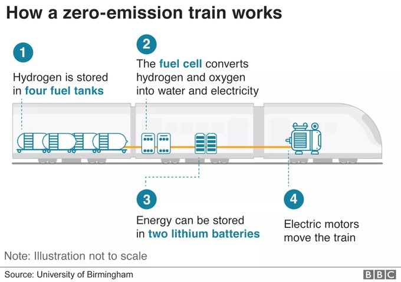

# Week 20

Carbon Shift (Reuters)

[Link](https://uk.mobile.reuters.com/video/watch/carbon-shift-green-hydrogens-time-has-co-idRCV0087QK)

---

<blockquote class="twitter-tweet"><p lang="en" dir="ltr">Bosch calls on <a href="https://twitter.com/hashtag/EU?src=hash&amp;ref_src=twsrc%5Etfw">#EU</a> to embrace <a href="https://twitter.com/hashtag/fuelcell?src=hash&amp;ref_src=twsrc%5Etfw">#fuelcell</a> vehicles: &quot;It is obviously not possible to electrify every mode of transport. We also need carbon liquid fuels,&quot; Bosch-CEO Denner said. &quot;This means boldly embracing the <a href="https://twitter.com/hashtag/hydrogen?src=hash&amp;ref_src=twsrc%5Etfw">#hydrogen</a> economy, &amp; doing it now.&quot; <a href="https://twitter.com/christiaanhtznr?ref_src=twsrc%5Etfw">@christiaanhtznr</a> by <a href="https://twitter.com/AutoNewsEurope?ref_src=twsrc%5Etfw">@AutoNewsEurope</a></p>&mdash; BoschPress📰 (@BoschPress) <a href="https://twitter.com/BoschPress/status/1261202365903970306?ref_src=twsrc%5Etfw">May 15, 2020</a></blockquote> <script async src="https://platform.twitter.com/widgets.js" charset="utf-8"></script>

---

<blockquote class="twitter-tweet"><p lang="en" dir="ltr">email: feeless<br>world wide web: feeless<br>internet money: $4 each txn<br><br>In order to truly disrupt the way we live, disruptive systems need to be feeless to use. <a href="https://twitter.com/hashtag/crypto?src=hash&amp;ref_src=twsrc%5Etfw">#crypto</a> <a href="https://twitter.com/hashtag/cryptocurrency?src=hash&amp;ref_src=twsrc%5Etfw">#cryptocurrency</a> <a href="https://twitter.com/search?q=%24NANO&amp;src=ctag&amp;ref_src=twsrc%5Etfw">$NANO</a></p>&mdash; TheNanoCenter (@TheNanoCenter) <a href="https://twitter.com/TheNanoCenter/status/1261302848199024640?ref_src=twsrc%5Etfw">May 15, 2020</a></blockquote> <script async src="https://platform.twitter.com/widgets.js" charset="utf-8"></script>

---

"Calls for UK to create first all-hydrogen bus town"

[Link](https://www.h2-view.com/story/calls-for-uk-to-create-first-all-hydrogen-bus-town/)

---

"The world already safeguards 15% of its land and 7% of the ocean. But,
for the sake of our health and prosperity, we must do more. Indeed,
there is increasing agreement among countries that we need to return
half the planet to nature and use the other half responsibly, and that
we should start by protecting at least 30% of it by 2030"

[Link](https://www.project-syndicate.org/commentary/seychelles-covid19-nature-is-best-antiviral-by-enric-sala-2020-05)

---

Lots of problems are caused by civilization [itself](../../2019/12/civilized-to-death.html#teeth)

"@ProSyn

Our relationship with nature is broken, says @Enric_Sala of
@NG_PristineSeas. And that has brought us into closer and more
frequent contact with viruses that can spread from animals to people"

---

"@KarlreMarks

She lived through the Spanish Flu and Covid 19 with everything in
between. What a story.

BBC: 'Oldest woman in Spain' beats coronavirus at 113"

---

"@KenzoShibata

Thinking about people who think Nader gave us Bush and have never
forgiven Nader, but have forgiven Bush"

---

"@businessinsider

Facebook's head of AI says Elon Musk 'has no idea what he is talking about'"

---

<blockquote class="twitter-tweet"><p lang="en" dir="ltr">The S&amp;P is more concentrated in the five largest stocks than at any time in history, including the dotcom bubble. <a href="https://t.co/y4Go22Hj4t">pic.twitter.com/y4Go22Hj4t</a></p>&mdash; Taylor Pearson (@TaylorPearsonMe) <a href="https://twitter.com/TaylorPearsonMe/status/1260963420221865985?ref_src=twsrc%5Etfw">May 14, 2020</a></blockquote> <script async src="https://platform.twitter.com/widgets.js" charset="utf-8"></script>

---

A-A! Let's not get mad. I know [Italian karate](https://youtu.be/n-ENUWAxzc0). Watch out

---

Oh yeah? You Italian?

Do you like gabagol?

No? What kind of Italian are you, if you don't like gabagol? You must
be confused.

---

Someone circulated the "R was now above 1 in DE" news few weeks ago. I
checked for that week, untrue.

---

Yes, but your tone is in arrears, jerkoff. This talk needs to come
from a place of caution, not "they said don't dance, but I want to
dance!" ala Kevin Bacon in *Footloose*.

"But many others say, we need to return to normal, reopen"

---

<blockquote class="twitter-tweet"><p lang="en" dir="ltr">To buy a $3 coffee with <a href="https://twitter.com/hashtag/Bitcoin?src=hash&amp;ref_src=twsrc%5Etfw">#Bitcoin</a> right now, it would cost you minimum $3.49 in fees for the privilege of waiting at least 10 minutes for your transaction to confirm!<br><br>Bitcoin is not a viable digital currency for any sort of actual usage. <a href="https://twitter.com/search?q=%24Nano&amp;src=ctag&amp;ref_src=twsrc%5Etfw">$Nano</a> meanwhile is instant with no fees.. <a href="https://t.co/9oR6fAUQDX">https://t.co/9oR6fAUQDX</a></p>&mdash; Nano For Good (@nanillionaire) <a href="https://twitter.com/nanillionaire/status/1261077260259471360?ref_src=twsrc%5Etfw">May 14, 2020</a></blockquote> <script async src="https://platform.twitter.com/widgets.js" charset="utf-8"></script>

---

"@skdh

For the past days I have seen a lot of stories saying Covid cases have
dramatically increased in Germany after easing lockdown
restrictions. I don't know where that myth comes from. Look at the
data. Nothing like that has happened (yet)"

---

"@DougSaunders

In France, it’s currently possible for a woman simultaneously to be
fined €165 for being in public with a face covering and €135 for being
in public without a face covering"

---

<blockquote class="twitter-tweet"><p lang="en" dir="ltr"><a href="https://twitter.com/AmbCuiTiankai?ref_src=twsrc%5Etfw">@AmbCuiTiankai</a> <a href="https://twitter.com/robert_spalding?ref_src=twsrc%5Etfw">@robert_spalding</a> <a href="https://twitter.com/SecPompeo?ref_src=twsrc%5Etfw">@SecPompeo</a> The belligerent chinese tabloids are spinning out of control. The blood (USD) to the tumor (CCP) is being titrated and the result is a chinese panic. In the end, China is only as strong as the West is willing to allow it to be.</p>&mdash; 🇹🇼Kyle Bass🇹🇼 (@Jkylebass) <a href="https://twitter.com/Jkylebass/status/1260876114454622213?ref_src=twsrc%5Etfw">May 14, 2020</a></blockquote> <script async src="https://platform.twitter.com/widgets.js" charset="utf-8"></script>

---

That's not why. If you are really looking for something, you need to
look for an inherent trait that goes way back. What is a major diff
between man and woman historically?  Having to carry and care for a
child. That would be it; caring for offspring would drastically
reorient risk/reward calculus, safety of the child would be
paramount. If there is anything inherently better with women around
COVID crisis fighting, it has to be this.

If you are *really* looking for a reason to qualify this (true) leadership success. 

"@ProSyn

Why Women Make Better Crisis Leaders: By the time a woman reaches the
heights of corporate or political power, she is likely to have
overcome massive hurdles... "

---

I work through directories. Any new concept, small project becomes a
directory, all work is there. Every supporting material also goes into
dir. Once done, a tutorial is created out of the subject, PDF books
get archived or `pdftk`'d into PDF booklets also get archived. Then
the directory is deleted.

There is only one dir active at one time, and maybe one future project
dir. That's it.

---

"@alexandrapullin

I wonder whether a side effect of lockdown will be a general exodus of
families from London to leafier surrounds. More working from home
means the commuting isn't such an factor, bigger gardens, more house
for your money, etc"

---

Cool pic (from [here](https://theconversation.com/science-fiction-builds-mental-resiliency-in-young-readers-135513)).
A scifi stock photo apparently, not a movie, or a book.


---

<blockquote class="twitter-tweet"><p lang="en" dir="ltr">Lunar Delivery: Europe’s Large Logistics Lander<a href="https://t.co/WsktENCTC5">https://t.co/WsktENCTC5</a> <a href="https://t.co/jzEgkmdphU">pic.twitter.com/jzEgkmdphU</a></p>&mdash; marsboy (@marsboy) <a href="https://twitter.com/marsboy/status/1260696836811231232?ref_src=twsrc%5Etfw">May 13, 2020</a></blockquote> <script async src="https://platform.twitter.com/widgets.js" charset="utf-8"></script>

---

Noise cancelling; take the sound wave, invert it and play on top of
existing sound. Is it that simple? 

---

Emperor penguins in Antarctica took an unintentional selfie

[Link](https://twitter.com/Rainmaker1973/status/1260571364601233415)

---

The market will regulate itself bro.. Consumer will benefit.. like a
win-win yo. 

"Frontier's own chart, below, shows the company's estimate of the
profitability of its current fiber assets. Note that the company
itself estimates that by 2031 the revenues from fiber would exceed
costs and thus deliver increases in profit. Note also that for the
first five years, the company would lose money on fiber. Fiber has
high upfront costs (like a house), but it pays off handsomely over
time. The inability to capitalize on superior investment opportunities
because they take too long to mature is the very definition of
dysfunctional short-termism. ...

The revelations from Frontier's bankruptcy filings don't end
there. Equally important is how Frontier cultivated, maintained, and
abused its monopolies. ISPs like Frontier know exactly where they have
monopolies, and therefore know exactly who has no choice and therefore
is not worth spending money on.

Frontier's documents reveal that the company treats its status as the
monopoly provider of high-speed Internet access for 1.6 million
households as a uniquely identifiable asset. Frontier wants investors
to know that it can precisely demarcate its monopoly territories
because it wants to show investors where it can get money (to repay
its debt and get out of bankruptcy) by charging a captive audience
more and delivering less.

The fact that Frontier—and its competitors—treat monopolies as a
bankable asset would seem a sign that there should be some oversight"

[Link](https://www.eff.org/deeplinks/2020/04/frontiers-bankruptcy-reveals-cynical-choice-deny-profitable-fiber-millions)

---

"@kaitlancollins

Federal Reserve Chairman Jerome Powell said this morning that almost
40 percent of households earning less than $40,000/year (as of
February) lost their jobs in March"

---

"[FCs] are scalable so you can have them small enough for a cellphone
tower or large enough for a building. In the U.S., fuel-cell forklifts
have already become a commercial product and are replacing
battery-electric forklifts in warehouses across the country. They’re
really attractive in warehouses operating 24 hours a day because they
can refill in a matter of minutes"

[Link](https://www.thedetroitbureau.com/2020/05/qa-toyotas-hydrogen-chief-jackie-birdsall/)

---

Commercial Steel Production for the First Time w H2


[Link](https://www.popularmechanics.com/science/amp32460567/hydrogen-powers-steel-production/)

---

Dude talent sources in econ must be bone dry. This is the second time
I asked a simple ques to a prof and dude's like wanna do research wit on
any future topic? 

---

That could be the best veal steak fillet I've ever made

👌

---

"@CaFCP

There’s an ongoing joke in the California Fuel Cell Partnership
(CaFCP) office that whatever situation Keith Malone walks into, he’ll
eventually find a connection with somebody.

'Three degrees of Keith they call me,' Malone says as he chuckles down
the phone. And they’re not wrong. Malone is well known in the fuel
cell and hydrogen space for his work with the CaFCP – an
industry/government collaboration aimed at expanding the market for
fuel cell electric vehicles (FCEVs) to help create a cleaner, more
energy-diverse future with zero emission vehicles.

'It started on my first day on the job with the partnership’s
communications team,' Malone tells H2 View as he continues his story.

'I went to a conference with my colleagues and I dropped by the booth
of one of our members and there was a friend of mine from high
school. We were surprised to see each other and what was more
surprising was the fact that this friend worked closely with the
CaFCP.'

'From then began this series of coincidences where I was seeing people
that I knew or had a fairly strong connection to. It kind of blew
people away, and the joke ‘three degrees of Keith’ was born.'

[Link](https://www.h2-view.com/story/cafcps-keith-malone-on-hydrogen-fcevs-and-how-coronavirus-is-affecting-the-market/)

---

That drummer is lovin that jam

<blockquote class="twitter-tweet"><p lang="en" dir="ltr">Happy birthday to Stevie Wonder, born on this day in 1950 in Saginaw, Michigan. Here he is performing “Superstition” in 1973. <a href="https://t.co/p2800RYUgL">pic.twitter.com/p2800RYUgL</a></p>&mdash; Dust-to-Digital (@dusttodigital) <a href="https://twitter.com/dusttodigital/status/1260569546580205569?ref_src=twsrc%5Etfw">May 13, 2020</a></blockquote> <script async src="https://platform.twitter.com/widgets.js" charset="utf-8"></script>

---

It's like someone says DON'T DANCE! Then it's like


---

Saw on Fox News, fem anchor says "they say dont touch your face", and
she goes ahead touches her face -- SUCH CUTE defiance. ARE YOU A CHILD???

Dana Perino is it?? And I thought she was one of the smart ones.

This is what codes do to people. You start acting stupid. Get off code.

---


---

Found code for ODE, it's in buttf-ed Maple, commercial shit pkg, keeps
code in binary shit format. Trial software is bodondadonk huge, no
thanks. There is a "player" version, that only views shit, I
install. Wont recog files I have, mws extension. I change extension,
it thinks it is a corrupted version, recovers them, now I have
somewhat legible "worksheet".

😤😤😤😡😡😡😠😠👺👺👺

---

That is f--ing crazy

"@Rainmaker1973

The story of Joan Murray, who survived a 4,500 meter fall when her
main parachute failed while skydiving. She landed in a fire ant mound
where numerous venomous stings caused an adrenaline rush to keep her
heart beating long enough for doctors to assist"

---

Nope. It's not Adam Back. 

It sure as shit not that mo...ka Craig Wright.

Keep lookin 🤙🤙🤙

\#satoshi

---

"@h2_view

Despite the \#coronavirus pandemic, \#hydrogen \#fuelcell manufacturer
@ProtonMotor has reported a successful start to the year with a record
quarter"

---

<blockquote class="twitter-tweet"><p lang="en" dir="ltr">I was really disappointed by the <a href="https://twitter.com/hashtag/LightningNetwork?src=hash&amp;ref_src=twsrc%5Etfw">#LightningNetwork</a> and Liquid with failing routes and high fees. <a href="https://twitter.com/hashtag/Bitcoin?src=hash&amp;ref_src=twsrc%5Etfw">#Bitcoin</a> maxis, feel free to convince me otherwise or block me, whatever. But please, don&#39;t stop calling <a href="https://twitter.com/search?q=%24Nano&amp;src=ctag&amp;ref_src=twsrc%5Etfw">$Nano</a> a shitcoin.</p>&mdash; DⓋrrrrrrrrian (@DorianTudorache) <a href="https://twitter.com/DorianTudorache/status/1260247342357319680?ref_src=twsrc%5Etfw">May 12, 2020</a></blockquote> <script async src="https://platform.twitter.com/widgets.js" charset="utf-8"></script>

---

<blockquote class="twitter-tweet"><p lang="en" dir="ltr">7 USC §1011(f) &amp; 36 CFR §261.7(c) make it a federal crime to open a gate in a national forest without closing the gate that you just opened.</p>&mdash; A Crime a Day (@CrimeADay) <a href="https://twitter.com/CrimeADay/status/875535307684425730?ref_src=twsrc%5Etfw">June 16, 2017</a></blockquote> <script async src="https://platform.twitter.com/widgets.js" charset="utf-8"></script>

---

```python
print ('Death rate', np.round((2 / 61.0)*100.0),'%')
```

```text
Death rate 3.0 %
```

<blockquote class="twitter-tweet"><p lang="en" dir="ltr">A new study assessed that after choir practice with one symptomatic person, 53 of 61 (87%) members developed COVID-19 (33 confirmed, 20 probable, 2 deaths) <a href="https://t.co/pvnHfByHbl">https://t.co/pvnHfByHbl</a> <a href="https://t.co/1BXa2KsV94">pic.twitter.com/1BXa2KsV94</a></p>&mdash; Massimo (@Rainmaker1973) <a href="https://twitter.com/Rainmaker1973/status/1260464389934788610?ref_src=twsrc%5Etfw">May 13, 2020</a></blockquote> <script async src="https://platform.twitter.com/widgets.js" charset="utf-8"></script>

---


---


---

Wut? Supermoon?

---

Polo & Pan - Bakara \#music

[Link](https://youtu.be/HRhSIfH-Xhs?t=86)

---

<blockquote class="twitter-tweet"><p lang="da" dir="ltr">Elysium <a href="https://t.co/W8XOewuHNe">https://t.co/W8XOewuHNe</a></p>&mdash; Tim Maughan (@timmaughan) <a href="https://twitter.com/timmaughan/status/1260314584155656198?ref_src=twsrc%5Etfw">May 12, 2020</a></blockquote> <script async src="https://platform.twitter.com/widgets.js" charset="utf-8"></script>

---

Be cerebral, act girly.. or don't. Or don't be cerebral.. who cares?
It's ok either way.

---

😊😊😊

<blockquote class="twitter-tweet"><p lang="en" dir="ltr">three years ago today!! Defended my PhD in a Quinceañera dress :D <a href="https://twitter.com/hashtag/PhD%C3%B1era?src=hash&amp;ref_src=twsrc%5Etfw">#PhDñera</a> <a href="https://twitter.com/hashtag/phdlife?src=hash&amp;ref_src=twsrc%5Etfw">#phdlife</a> <a href="https://twitter.com/hashtag/PhD?src=hash&amp;ref_src=twsrc%5Etfw">#PhD</a> <a href="https://twitter.com/hashtag/AcademicTwitter?src=hash&amp;ref_src=twsrc%5Etfw">#AcademicTwitter</a> <a href="https://t.co/0sOVhwnYcJ">pic.twitter.com/0sOVhwnYcJ</a></p>&mdash; Olga Botvinnik (@olgabot) <a href="https://twitter.com/olgabot/status/1260259829576118272?ref_src=twsrc%5Etfw">May 12, 2020</a></blockquote> <script async src="https://platform.twitter.com/widgets.js" charset="utf-8"></script>

---

"@esa

New evidence has been found of watery plumes on \#Jupiter’s moon
\#Europa in a recent study investigating 20-year-old data from NASA's
Galileo mission. This is very exciting for our \#Juice mission, being
prepared for launch in 2022"

---

<blockquote class="twitter-tweet"><p lang="en" dir="ltr">Fuel Cell Stacks: Together Towards Series Production-Project ‘Autostack Industrie’, five OEMs and various suppliers are working together in order to bring the key technologies in the manufacture of <a href="https://twitter.com/hashtag/fuelcell?src=hash&amp;ref_src=twsrc%5Etfw">#fuelcell</a> stacks--<a href="https://t.co/X6v5sSTM9B">https://t.co/X6v5sSTM9B</a> <a href="https://twitter.com/hashtag/fuelcells?src=hash&amp;ref_src=twsrc%5Etfw">#fuelcells</a> <a href="https://twitter.com/hashtag/hydrogen?src=hash&amp;ref_src=twsrc%5Etfw">#hydrogen</a> <a href="https://twitter.com/hashtag/hydrogennow?src=hash&amp;ref_src=twsrc%5Etfw">#hydrogennow</a> <a href="https://t.co/ljjrJ7HmsX">pic.twitter.com/ljjrJ7HmsX</a></p>&mdash; FuelCellsWorks (@fuelcellsworks) <a href="https://twitter.com/fuelcellsworks/status/1260250730625142784?ref_src=twsrc%5Etfw">May 12, 2020</a></blockquote> <script async src="https://platform.twitter.com/widgets.js" charset="utf-8"></script>

---

"Unix and Adversarial Interoperability: The ‘One Weird Antitrust Trick’
That Defined Computing"

[Link](https://www.eff.org/deeplinks/2020/05/unix-and-adversarial-interoperability-one-weird-antitrust-trick-defined-computing)


---

Interesting.

US always has to insert that commerc shit in there somewhere.

[Link](https://youtu.be/HaraFkhonFo?t=248)

---

Goldcucks think with their precious gold, there is no centralized
printing. Wrong. The reason gold came into being as money was
precisely because it could be printed!  By the king! Gold became what
it is because it could be dug (printed) only someone with lots of
resources who could employ people at mines, to unearth this rare
looking metal that was hard to fake that made it a perfect currency --
for a while.

There is always printing. With no printing, there is deflation. But
now that we figured out printing other currencies and back it with
governments and/or trust networks, gold and similar items today become
side-shows, commodities but can never form the basis of a currency,
let alone a world currency.

---

I maintain that any digital currency continually needs to expand its
monetary base, ideally print the money into everyone's account, weekly
or monthly, as a form of digital basic income. It will generate little
inflation, reduce the incentive to store / stash etc. and devalue curr
shifting some wealth from rich to poor. The excess doesn't even need
to be inflationary, new, inventive ways of lending can be formed, the
excess can flow to businesses as credit, creates growth, more goods
chasing more money = little inflation.

---

<blockquote class="twitter-tweet"><p lang="en" dir="ltr">The Near-Real Time Level 1B and Level 2B <a href="https://twitter.com/hashtag/Aeolus?src=hash&amp;ref_src=twsrc%5Etfw">#Aeolus</a> wind data is now available to the public! 🎉🌬️🛰️🎉 Read more about the journey that brought us here and the organisations and individuals who worked behind the scenes to make today&#39;s release possible👉 <a href="https://t.co/kYfaEtAyvf">https://t.co/kYfaEtAyvf</a> <a href="https://t.co/94pUKDGIgi">pic.twitter.com/94pUKDGIgi</a></p>&mdash; esa_aeolus (@esa_aeolus) <a href="https://twitter.com/esa_aeolus/status/1260142912161165312?ref_src=twsrc%5Etfw">May 12, 2020</a></blockquote> <script async src="https://platform.twitter.com/widgets.js" charset="utf-8"></script>

---

Interesting times.

Bloomberg: "Fed Says It Will Begin Buying Corporate-Debt ETFs"

---

"@Rainmaker1973

A dive in the Pacific Ocean of plastic: how diver Rich Horner filmed
himself swimming through a sea of plastic waste in 2018, at one of
Bali’s iconic dive sites, Manta Point"

<iframe width="340" src="https://www.youtube.com/embed/AWgfOND2y68" frameborder="0" allow="accelerometer; autoplay; encrypted-media; gyroscope; picture-in-picture" allowfullscreen></iframe>

---

Bernie Sanders, WaPo

\#tbtv

[Link](https://youtu.be/ye-NM3fymvk)

---

Haha. Found a doc "Development of Virtual Blade Model for Modelling
Helicopter Rotor in OpenFOAM", it says "Unclassified" at the top.

Well thx ppl at Oz gov. The info can be helpful.

---

OpenFOAM - I hear good things abt it, for aerodynamics simulation, CFD. 

[Link](https://youtu.be/NlTsN4cAGaQ)

---

<blockquote class="twitter-tweet"><p lang="es" dir="ltr">No traditional fuel, no problem. <a href="https://t.co/ButmM0nZvS">https://t.co/ButmM0nZvS</a></p>&mdash; RobbReport (@RobbReport) <a href="https://twitter.com/RobbReport/status/1259876684041420802?ref_src=twsrc%5Etfw">May 11, 2020</a></blockquote> <script async src="https://platform.twitter.com/widgets.js" charset="utf-8"></script>

---

"Gen 3 [ammonia generation] technology is based on the electroreduction
of N2 to ammonia by direct or mediated means. The H-B process is no
longer required; instead, the reaction is driven by electrochemical
reduction and the H source is water.

There are several modes of this process being actively researched:

eNRR in which an electrocatalyst enables direct electron and proton
addition to the N2 molecule; and indirect or mediated mechanisms in
which a redox mediator such as Li+ is first reduced and then, via a
series of reactions, ammonia is produced and the mediator is
regenerated"

[Link](https://www.greencarcongress.com/2020/05/20200511-monash.html)

---

<blockquote class="twitter-tweet"><p lang="en" dir="ltr">👉<a href="https://t.co/gPyC7BVJF0">https://t.co/gPyC7BVJF0</a> aims at developing <a href="https://twitter.com/hashtag/hydrogen?src=hash&amp;ref_src=twsrc%5Etfw">#hydrogen</a> storage tank with use of solid-state H2 carrier in large scale. It is based on an <a href="https://twitter.com/hashtag/innovative?src=hash&amp;ref_src=twsrc%5Etfw">#innovative</a> concept 💡 Coupling H2 and <a href="https://twitter.com/hashtag/heatstorage?src=hash&amp;ref_src=twsrc%5Etfw">#heatstorage</a> for stationary <a href="https://twitter.com/hashtag/storage?src=hash&amp;ref_src=twsrc%5Etfw">#storage</a> of <a href="https://twitter.com/hashtag/renewableenergy?src=hash&amp;ref_src=twsrc%5Etfw">#renewableenergy</a>. <a href="https://twitter.com/hashtag/RSCPoster?src=hash&amp;ref_src=twsrc%5Etfw">#RSCPoster</a> <a href="https://twitter.com/hashtag/RSCEnergy?src=hash&amp;ref_src=twsrc%5Etfw">#RSCEnergy</a> <a href="https://twitter.com/hashtag/RSCEnv?src=hash&amp;ref_src=twsrc%5Etfw">#RSCEnv</a> <a href="https://twitter.com/hashtag/RSCMat?src=hash&amp;ref_src=twsrc%5Etfw">#RSCMat</a> <a href="https://twitter.com/hashtag/RSCEng?src=hash&amp;ref_src=twsrc%5Etfw">#RSCEng</a> <a href="https://t.co/09aj5StSlm">pic.twitter.com/09aj5StSlm</a></p>&mdash; HyCARE Project (@HycareP) <a href="https://twitter.com/HycareP/status/1234821682310844418?ref_src=twsrc%5Etfw">March 3, 2020</a></blockquote> <script async src="https://platform.twitter.com/widgets.js" charset="utf-8"></script>

---

"@GavinNewsom

NEW: Without federal support, states will be forced to make impossible
decisions.

Today—CA, OR, WA, NV, CO, and our legislative leaders have joined
together to ask the federal government for $1 trillion to protect our
schools, public health, and public safety services"

---

<blockquote class="twitter-tweet" data-conversation="none"><p lang="en" dir="ltr">WATCH: Protesters calling for gyms to reopen in Florida are doing squats and push-ups outside the Clearwater courthouse <a href="https://t.co/3BVzxHQPEJ">https://t.co/3BVzxHQPEJ</a> <a href="https://twitter.com/hashtag/Florida?src=hash&amp;ref_src=twsrc%5Etfw">#Florida</a> <a href="https://twitter.com/hashtag/COVID19?src=hash&amp;ref_src=twsrc%5Etfw">#COVID19</a> <a href="https://t.co/3cjgQ6kaM8">pic.twitter.com/3cjgQ6kaM8</a></p>&mdash; WFLA NEWS (@WFLA) <a href="https://twitter.com/WFLA/status/1259867354206535681?ref_src=twsrc%5Etfw">May 11, 2020</a></blockquote> <script async src="https://platform.twitter.com/widgets.js" charset="utf-8"></script>

---

"Instead of forwarding the wind power to Bavaria, farmers in North
Friesland prefer to convert it to hydrogen in the wind farm and use it
as fuel for their cars and buses"

[Link](https://edison.media/gruene-strom-farmer-fahren-auf-wasserstoff-ab/25205367/)

---

Great idea

<blockquote class="twitter-tweet"><p lang="en" dir="ltr">Dumb or brilliant idea (can’t decide): an ETF that tracks the holdings by members of Congress (who are required to report their transactions—this is public data)</p>&mdash; Erik Bernhardsson (@fulhack) <a href="https://twitter.com/fulhack/status/1259892982695813123?ref_src=twsrc%5Etfw">May 11, 2020</a></blockquote> <script async src="https://platform.twitter.com/widgets.js" charset="utf-8"></script>

---

Haaretz: "U.S. pulling Patriot missile batteries out of Saudi Arabia
amid oil dispute"

---

The equiv hardware with bitch batteries weigh at least 3 times as
much, and I see warnings like "can only be charged 3000 times"
etc. This tech is obscenely inferior.

[Video](https://youtu.be/KERlriXscN4?t=245)

---

This bad boy right here. 1600 Watts for 8 hrs on 1.1 gallon fuel,
weighs 20 kg. Until there is a renewable fuel equivalent for good
price, for any heavy duty work, I'd deploy this.


---

<blockquote class="twitter-tweet"><p lang="en" dir="ltr">Green <a href="https://twitter.com/hashtag/hydrogen?src=hash&amp;ref_src=twsrc%5Etfw">#hydrogen</a> holds the most potential in the <a href="https://twitter.com/hashtag/cleanenergy?src=hash&amp;ref_src=twsrc%5Etfw">#cleanenergy</a> transition and is ideal for an array of use cases – like heavy trucking – where traditional renewables are unsuitable: <a href="https://t.co/vcONalAEGQ">https://t.co/vcONalAEGQ</a></p>&mdash; Nuvera Fuel Cells (@NuveraH2) <a href="https://twitter.com/NuveraH2/status/1259888626751680514?ref_src=twsrc%5Etfw">May 11, 2020</a></blockquote> <script async src="https://platform.twitter.com/widgets.js" charset="utf-8"></script>

---

<blockquote class="twitter-tweet"><p lang="en" dir="ltr">No sense in whining about deficits if you think your guy could win. But the higher the odds of a Biden presidency, the more about deficits we&#39;re going to be hearing from the GOP.</p>&mdash; Binyamin Appelbaum (@BCAppelbaum) <a href="https://twitter.com/BCAppelbaum/status/1259905606191890434?ref_src=twsrc%5Etfw">May 11, 2020</a></blockquote> <script async src="https://platform.twitter.com/widgets.js" charset="utf-8"></script>

---

<iframe width="340" src="https://www.youtube.com/embed/L27dkYyg04g" frameborder="0" allow="accelerometer; autoplay; encrypted-media; gyroscope; picture-in-picture" allowfullscreen></iframe>

---

Reuters: "Hong Kong police arrest more than 200 as pro-democracy protests return"

---

"@fuelcellsworks

Leipzig Will Soon be Able to Heat with #Hydrogen Thanks to Siemens
Award-Winning Turbines for their planned thermal power station in
Lößnig"

---

"@tixhonjm

Rotterdam Boosts Hydrogen Economy with New Infrastructure"

---

So true. Hal Finney, "Satoshi" wasn't all that great... Make way for
the new generation \#NANO

---

<blockquote class="twitter-tweet" data-conversation="none"><p lang="en" dir="ltr">BTC costs too much to use, plain and simple. The only reason the revolution of decentralized money has stalled is because we get stuck on old tech.</p>&mdash; Colin LeMahieu (@ColinLeMahieu) <a href="https://twitter.com/ColinLeMahieu/status/1258871359616114688?ref_src=twsrc%5Etfw">May 8, 2020</a></blockquote> <script async src="https://platform.twitter.com/widgets.js" charset="utf-8"></script>

---

"@fuelcellsworks

Arup Explores Future Potential of Hydrogen with Scottish
Government--@ArupGroup & project partner E4tech, will carry out
assessment of Scotland’s strengths, assets & factors that will shape
\#hydrogen development across the country"

[Link](https://bit.ly/2yPgbvo)

---

"@iLikeBeerOk

I have to say that I wanted to take some money off a well known crypto
wallet and the BTC fee was £3.50 so I converted it to NANO and sent it
for free. And it was instant. So impressed with @nano"

---

"@ProtonMotor

With the help of our Proton Motor fuelcells, the largest hydrogen
power plant in Germany is being built in Mecklenburg-Vorpommern'

---



---

<blockquote class="twitter-tweet"><p lang="en" dir="ltr">PowerCell Sweden will be at <a href="https://twitter.com/hashtag/fcell?src=hash&amp;ref_src=twsrc%5Etfw">#fcell</a> on the trade fair floor.<br><br>&quot;What’s the winning formula for making <a href="https://twitter.com/hashtag/fuelcell?src=hash&amp;ref_src=twsrc%5Etfw">#fuelcell</a> stacks? <a href="https://twitter.com/hashtag/Bosch?src=hash&amp;ref_src=twsrc%5Etfw">#Bosch</a> has joined forces with the startup <a href="https://twitter.com/PowercellA?ref_src=twsrc%5Etfw">@PowercellA</a> to put this technology into mass production — and usher in its breakthrough.&quot;<a href="https://t.co/g7ayVs8pOj">https://t.co/g7ayVs8pOj</a></p>&mdash; f-cell (@fcell_Germany) <a href="https://twitter.com/fcell_Germany/status/1259776610414342144?ref_src=twsrc%5Etfw">May 11, 2020</a></blockquote> <script async src="https://platform.twitter.com/widgets.js" charset="utf-8"></script>

---

😆😆 Sounds pretty bad when u say it like that, but I wonder if it's
that scary. Liberal scaremongering?

"The New Trump App Is a Death Star of Fake News—and It Reaches More
People Than Daytime Cable News.

President Trump’s campaign manager has called what he’s built a
'juggernaut' and is likening his digital infrastructure to a Death
Star. In reality, what he's built is a trap.

And users are encouraged by a points system to share all of this
content with their networks for real-world benefits such as discounts
on store merchandise or a picture with the president. The Trump App is
providing news, entertainment, and the dopamine rush of earning points
and acknowledgement. It’s Candy Crush, but for politics"
 
[Link](https://www.thedailybeast.com/the-new-trump-app-is-a-death-star-of-fake-news-and-it-reaches-more-people-than-daytime-cable-news)

---

Little psyop on twitter trends? Something fishy going on here...

---

<blockquote class="twitter-tweet"><p lang="en" dir="ltr">2134 nautical miles covered between Cape Verde and Martinique in total <a href="https://twitter.com/hashtag/autonomy?src=hash&amp;ref_src=twsrc%5Etfw">#autonomy</a> thanks to a mix of <a href="https://twitter.com/hashtag/renewableenergies?src=hash&amp;ref_src=twsrc%5Etfw">#renewableenergies</a> and <a href="https://twitter.com/hashtag/hydrogen?src=hash&amp;ref_src=twsrc%5Etfw">#hydrogen</a>. Discover the Energy Observer&#39;s energy balance <a href="https://t.co/LmrQpCQMYw">pic.twitter.com/LmrQpCQMYw</a></p>&mdash; ENERGY OBSERVER (@energy_observer) <a href="https://twitter.com/energy_observer/status/1258396897749995520?ref_src=twsrc%5Etfw">May 7, 2020</a></blockquote> <script async src="https://platform.twitter.com/widgets.js" charset="utf-8"></script>

---

"@Rainmaker1973

Researchers have built an artificial version of a chloroplast, the
photosynthetic structures inside plant cells. It uses sunlight and a
laboratory-designed chemical pathway to turn CO₂ into sugar"

[Link](https://buff.ly/2Abl6av)

---

Most of what is pure info based can be commodatized. Forget this wanky
stuff. Do more basic science, math, and build stuff.

---

NYT: "The Results Are In for the Sharing Economy. They Are Ugly."

[Link](https://www.nytimes.com/2020/05/07/technology/the-results-are-in-for-the-sharing-economy-they-are-ugly.html#click=https://t.co/NlWmLYkJLy)

---

<blockquote class="twitter-tweet"><p lang="en" dir="ltr">My new bill would provide $2,000 every single month for the duration of the pandemic, plus 3 months afterward. We need to confront the reality that a one-time payment just isn’t enough to keep people fed. Congress must pass my bill.</p>&mdash; Kamala Harris (@SenKamalaHarris) <a href="https://twitter.com/SenKamalaHarris/status/1259598065830449153?ref_src=twsrc%5Etfw">May 10, 2020</a></blockquote> <script async src="https://platform.twitter.com/widgets.js" charset="utf-8"></script>

---

"Zoologists Discover First-Known Animal That Doesn’t Breathe Oxygen"

[Link](https://www.studyfinds.org/zoologists-discover-first-known-animal-that-doesnt-breathe-oxygen/)

---

<blockquote class="twitter-tweet"><p lang="en" dir="ltr">The Australian Government recently announced its commitment of A$300m to the Clean Energy Finance Corporation and instructed it to invest in new hydrogen energy projects. Read the Sydney Morning Herald article here:<a href="https://t.co/PYTGLOSSRN">https://t.co/PYTGLOSSRN</a><a href="https://twitter.com/hashtag/hazergroupltd?src=hash&amp;ref_src=twsrc%5Etfw">#hazergroupltd</a> <a href="https://twitter.com/hashtag/hydrogen?src=hash&amp;ref_src=twsrc%5Etfw">#hydrogen</a> <a href="https://twitter.com/hashtag/government?src=hash&amp;ref_src=twsrc%5Etfw">#government</a> <a href="https://t.co/wnYsbV4PuT">pic.twitter.com/wnYsbV4PuT</a></p>&mdash; Hazer Group Ltd (@hazergroupltd) <a href="https://twitter.com/hazergroupltd/status/1259619330439995392?ref_src=twsrc%5Etfw">May 10, 2020</a></blockquote> <script async src="https://platform.twitter.com/widgets.js" charset="utf-8"></script>

---

<blockquote class="twitter-tweet"><p lang="en" dir="ltr">The only thing more Silicon Valley was buying it <a href="https://t.co/4SOrhnmugs">https://t.co/4SOrhnmugs</a></p>&mdash; Internet of Stay Home (@internetofshit) <a href="https://twitter.com/internetofshit/status/1259663336444174338?ref_src=twsrc%5Etfw">May 11, 2020</a></blockquote> <script async src="https://platform.twitter.com/widgets.js" charset="utf-8"></script>

---

"@LegionHoops

SHAQ on the NBA season: 'I think we should scrap the season. Everybody
go home, get healthy, come back next year... any team that wins this
year, there's an asterisk.'"

---

"@Noahpinion

The U.S. has 4.2% of the world's population, but 28.5% of the world's
confirmed coronavirus deaths"

---

Ninja eel 

---

Da fuq?

<blockquote class="twitter-tweet"><p lang="en" dir="ltr">OMG! What is this?🐳🐬 <a href="https://t.co/X9SOeBrut2">pic.twitter.com/X9SOeBrut2</a></p>&mdash; Ocean diversity (@Oceandiversity2) <a href="https://twitter.com/Oceandiversity2/status/1259458756141879297?ref_src=twsrc%5Etfw">May 10, 2020</a></blockquote> <script async src="https://platform.twitter.com/widgets.js" charset="utf-8"></script>

---

They even had a guy in jail while some were in the bunker... Perfect
modern setup. Like Toffler [says](../../2011/03/fundamentals-of-industrial-ideologies_concentration.html)

>Nor was it only energy and work that were concentrated. Writing in the
>British social science journal New Society, Stan Cohen has pointed out
>that, with minor exceptions, prior to industrialism "the poor were
>kept at home or with relatives; criminals were fined, whipped or
>banished from one settlement to another; the insane were kept in their
>families, or supported by the community, if they were poor." All these
>groups were, in short, dispersed throughout the community.
>
>Industrialism revolutionized the situation. The early nineteenth
>century, in fact, has been called the time of the Great
>Incarcerations—when criminals were rounded up and concentrated in
>prisons, the mentally ill rounded up and concentrated in "lunatic
>asylums," and children rounded up and concentrated in schools, exactly
>as workers were concentrated in factories.

---

The show *Lost* was abt hunter-gatherer life, the island is our "early
ideal", and when the main characters left the island to go back to
their previous lives, outside, temporarily, later in the series they
were miserable.

But modernity was imposed on them once before in the island, when they
discovered that bunker. They obtained some creature comforts there,
could shover, shave and have readily available food, but they had to
press the stupid button. What is that like? Work!! Modernity!!
Bullshit job!


---


dumbass 

"@Gizmodo

After screaming about discrimination, ex-Google engineer James Damore
silently asks court to dismiss lawsuit"

---

Portable panels charged portable camp light in 3 hours.

---

So if we could cut CO2 emissions in half we'd fix the problem (granted
we fix methane, and that freaky [SF6](../../2019/09/sf6.html)
thing).

Demirel, *Green Energy and Technology*: "The burning of fossil fuels
produces around 21.3 Gigatons of carbon dioxide per year, and natural
processes can only absorb about half of that amount, so there is a net
increase of 10.65 billion tons of atmospheric carbon dioxide per year"

---

"@nicholaspaul26

I spent a rusted decade in American industry. The culture at most of
those firms is completely out of phase with the values common to sharp
young people (and proud of it). Best thing I ever did was hit the
eject button. Firms disintegrate when generations can't integrate"

---

<blockquote class="twitter-tweet" data-conversation="none"><p lang="en" dir="ltr">I’m one of the few product engineers left in the states. I know of no toolmakers younger than me (60) and no one is learning.<br>I’ve spent a lot of time in China training their engineers.<br>I’d love to work with younger Americans again.<br>The ideas are here.<br>Who is stepping up?</p>&mdash; Daniel Reyes (@sharezone_io) <a href="https://twitter.com/sharezone_io/status/1258832856177971200?ref_src=twsrc%5Etfw">May 8, 2020</a></blockquote> <script async src="https://platform.twitter.com/widgets.js" charset="utf-8"></script>

---

<blockquote class="twitter-tweet"><p lang="en" dir="ltr">A simple Schlieren imaging technique is applied to visualize the air flow caused by a person breathing and coughing. Using a face mask the exhaled air flow is blocked reducing effectively the risk of infection <a href="https://t.co/o1V5uYupph">https://t.co/o1V5uYupph</a> <a href="https://t.co/bGTXqe0kUQ">pic.twitter.com/bGTXqe0kUQ</a></p>&mdash; Massimo (@Rainmaker1973) <a href="https://twitter.com/Rainmaker1973/status/1246700699498487808?ref_src=twsrc%5Etfw">April 5, 2020</a></blockquote> <script async src="https://platform.twitter.com/widgets.js" charset="utf-8"></script>

---

<blockquote class="twitter-tweet"><p lang="en" dir="ltr">also this is without the insurance of any kind and applies to anyone residing in Korea. Interestingly, if the person hospitalized is fully employed they also get an additional $800 as a cost of living allowance, so they could walk with about $765 extra</p>&mdash; Anton Petrov (@WhatDaMath) <a href="https://twitter.com/WhatDaMath/status/1249246297514586112?ref_src=twsrc%5Etfw">April 12, 2020</a></blockquote> <script async src="https://platform.twitter.com/widgets.js" charset="utf-8"></script>

---

"@otherchrislee

I was talking to one of the top software sales recruiting firms in
\#sanfrancisco and they said 60% of the roles they were hiring for in
SF are on freeze or canceled and they’ve had to lay off 30% of their
recruiters. I.e it’s now hitting white collar, college educated jobs"

---

"@allsmallbiznews

The big white collar layoffs will come in October.  Discreetly after
the time requirements for PPP loans expire"

---

<blockquote class="twitter-tweet"><p lang="en" dir="ltr">Everybody and I mean everybody in the social media streams right now is basically this guy...<br>I think I&#39;m going to social media distance myself for a few weeks to keep sane:D<a href="https://twitter.com/hashtag/socialmediadistancing?src=hash&amp;ref_src=twsrc%5Etfw">#socialmediadistancing</a> <a href="https://t.co/lS2NF388hf">pic.twitter.com/lS2NF388hf</a></p>&mdash; Anton Petrov (@WhatDaMath) <a href="https://twitter.com/WhatDaMath/status/1247828061573148674?ref_src=twsrc%5Etfw">April 8, 2020</a></blockquote> <script async src="https://platform.twitter.com/widgets.js" charset="utf-8"></script>

---

Thought leaders should not think at cultural level of course. Cultural
thinking is for morons (and regular ppl who are morons on much of
politics which is a craft, a trade).

---

Politicians play this game a lot (part of what I call 'closing'). Do
not lose hope on democracy however; ppl vote on very general things,
and their well-being is one of them, if econ goes bad, they die, that
is reptilian. Fight or flight trumps culture.

---

Maybe Reps decided the outcome of COVID can be politically
damaging, so it was time to press some buttons to create cultural
divisions, to change the focus, shift blame. What better way to do
that then to rekindle some culture codes? If there is cultural
tug-of-war between prohibition and "freedom", you just reframe the
COVID situation around staying-at-home, working-not-working around
prohibition-freedom axis, and you got yourself a nice little bruhaha.

In terms of effectiveness the hierarchy in the brain goes 1) reptilian
brain 2) culture codes 3) intellect. You press a button at the second
level, intellect will be overtaken.

Rapaille, *The Culture Code*: "Life is tension.  Everything we
experience in life lies somewhere on an axis between two extremes.
One cannot truly know pleasure without knowing pain.  One cannot
legitimately feel joy without having felt sorrow.  The degree to which
we feel an experience depends on where that experience lies on the
axis (a little painful, overwhelmingly joyful, and so on)...

Similar tensions define cultures. Every culture is composed of an
endless number of archetypes and of the tensions between each
archetype and an opposing one.  For example, one of the primary
tensions in the American culture is the one between freedom and
prohibition. We consider freedom an inalienable right. We have fought
numerous wars to protect it, and our citizens are willing to die to
maintain it. At the same time, however, our culture is very strongly
inclined toward prohibition. We believe we shouldn’t drink too much,
play too much, or exhibit too much wealth.  While the axis itself
never changes, where a culture stands on a particular axis varies from
era to era.  At various times in our history, for example, our culture
has found itself in different places on the freedom–prohibition axis
(leaning heavily toward prohibition in the 1920s and far in the
opposite direction during the late 1960s and early 1970s), but the
opposing force was always evident (bootleggers in the 1920s, the
Silent Majority in the latter period). This tension is a constant in
our culture and it helps make our culture what it is"

---

Due to prohibition-freedom culture tug-of-war probably.

"Why did staying inside, masks become such a hot topic of debate in US?"

---

That trip is 4200 km long. It used 9160.8kWh, a Nexo tank being 210
kWh, that's like 43 tanks.

"[Solar / H2 boat Energy Observer] made a trip from St. Petersburg in
Russia to Spitsbergen in Norway on August 10th. During the 24-day
jaunt, the boat produced 9,160.8kWh of energy, 52 percent of which
came from the sun... Of the total power, 59 percent propelled the
boat, with the remaining 41 percent going to life support"
[Link](https://www.engadget.com/2019-10-08-energy-observer-solar-hydrogen-power-boat.html),
[Link](https://www.yachtcruisecompany.com/wp-content/uploads/2019/09/Northern-Europe-Hidden-Baltic-Scandinavia.jpg)

---

"@LaurentLessard

'The cubic model' for forecasting COVID-19 deaths has been in the
news lately.

Cubics (and polynomials in general) are a very bad choice of model for
this situation. Let's talk about why. 1/n

Cubics are functions that look like: f(x) = a + b x + c x² + d x³
'Fitting a cubic model' means choosing (a,b,c,d) so that f(x) is
approximately equal to the deaths on day x for the data you've
got. The hope is that this f could then be used to predict future
deaths.

A key property of cubics (and polynomials in general) is that they
grow really fast when x is large. Depending on whether d>0 or d<0 in
the expression for f(x), you will get f(x) going to plus or minus
infinity, respectively, as x gets larger.

This feature makes cubics an inappropriate model, because we expect
the number of deaths to eventually settle down to zero. Cubics can
NEVER do this. So no matter what cubic we use, its future predictions
will eventually be nonsensical. It's just a matter of when'"

---

Power, Watts, mAh, etc

[Link](../../2020/06/power.html)

---

It is well-known now he is one of the founders of rock'n roll and
Elvis was copying him.

---

Little Richard RIP.

"@jmnippy

That’s why he had let the whole industry know that one time"

[Link](https://twitter.com/jmnippy/status/1259128321247502336)

---

<blockquote class="twitter-tweet"><p lang="en" dir="ltr">Ladies and gentlemen the Democratic Party, summed up in a single tweet. <a href="https://t.co/kp7Z408LFQ">https://t.co/kp7Z408LFQ</a></p>&mdash; Secular Talk (@KyleKulinski) <a href="https://twitter.com/KyleKulinski/status/1259179616100646913?ref_src=twsrc%5Etfw">May 9, 2020</a></blockquote> <script async src="https://platform.twitter.com/widgets.js" charset="utf-8"></script>

---


Eeeww but priv sector is the only source of innovation bro...

"Frontier’s Bankruptcy Reveals Why Big ISPs Choose to Deny Fiber to So
Much of America"

[Link](https://www.eff.org/deeplinks/2020/04/frontiers-bankruptcy-reveals-cynical-choice-deny-profitable-fiber-millions)

---

Thank you planktons

"But did you know that most of the oxygen you breathe comes from
organisms in the ocean?

That’s right—more than half of the oxygen you breathe comes from
marine photosynthesizers, like phytoplankton and seaweed. Both use
carbon dioxide, water and energy from the sun to make food for
themselves, releasing oxygen in the process"

[Link](https://ocean.si.edu/ocean-life/plankton/every-breath-you-take-thank-ocean)

---


Way to go GW! Medical knowledge helped the founding of US. How'bout that?

"George Washington's military genius is undisputed. Yet American
independence must be partially attributed to a strategy for which
history has given the infamous general little credit: his
controversial medical actions. Traditionally, the Battle of Saratoga
is credited with tipping the revolutionary scales. Yet the health of
the Continental regulars involved in battle was a product of the
ambitious initiative Washington began earlier that year ... On the 6th
of January 1777, George Washington wrote to Dr. William Shippen Jr.,
ordering him to inoculate all of the forces that came through
Philadelphia"

[Link](https://www.loc.gov/rr/scitech/GW&smallpoxinoculation.html)

---

<blockquote class="twitter-tweet"><p lang="en" dir="ltr">Who would have thought the Achilles heel of the so-called strong American bootstrappy white man would be a squirt of hand sanitizer and directional shopping aisles. What grit!</p>&mdash; CampConfinement (@CampONeill) <a href="https://twitter.com/CampONeill/status/1258894591710728192?ref_src=twsrc%5Etfw">May 8, 2020</a></blockquote> <script async src="https://platform.twitter.com/widgets.js" charset="utf-8"></script>

---

Now whenever I see the letters VW I think of that stupid Ryan
Reynolds movie [Van Wilders](twimg/EXumlWcXsAIQNdx.jpg)

---

K.. VW isnt completely gone.

"[T]ruck manufacturer Scania, owned by Volkswagen, has developed a
fuel cell garbage truck with funding help from the EU’s Fuel Cells and
Hydrogen Joint Undertaking, and has recently delivered a fuel cell
truck in Norway for a grocery chain operations"

[Link](https://www.forbes.com/sites/davidblekhman/2020/05/08/volvos-fuel-cell-truck-alliance-with-daimler-is-a-return-to-the-hydrogen-bandwagon/)

---

Unemployment, as the reverse of [employment-population
ratio](https://www.investopedia.com/terms/e/employment_to_population_ratio.asp).
Calculated as the civilian labor force currently employed against the
total working-age population. Jumped to 23.8%.

```
2020-03-01    20.745325
2020-04-01    23.874394
```

[Link](../../2021/01/stats.html#unempl)

---

The Guardian: "Planet of the Humans, whose executive producer and
chief promoter is Michael Moore, now has more than 6 million views on
YouTube. The film does not deny climate science. But it promotes the
discredited myths that deniers have used for years to justify their
position"

[Link](https://www.theguardian.com/commentisfree/2020/may/07/michael-moore-far-right-climate-crisis-deniers-film-environment-falsehoods?CMP=share_btn_tw)

---

"Stocks hit weekly highs as markets shrug off dismal U.S. jobs data"

---

😆😆😆 Kung-fu virus. I like this one. I think I am going to use it.

"Resolution being voted on by San Antonio City Council this morning
labels terms 'Chinese Virus' and 'Kung Fu Virus' as hate speech"

---

Open sourcing the trace app; good idea.

"Trace Together is an app by the Singapore government that has already
been installed by 620,000 people. This contact tracing app can
identify people who have come within 2 metres of COVID-19 positive
patient for at least half an hour using wireless Bluetooth technology.

In a bid to fight the global coronavirus pandemic, the Singapore
government is now making the code for this app open-source"

---

The pic is hysterical 

[Link](../../2021/01/stats.html#wagepayroll)

---

Non-farm payrolls YoY

```
2020-03-01  151572   0.858386
2020-04-01  131072 -12.904340
```

[Link](../../2021/01/stats.html#nfp)

---

<blockquote class="twitter-tweet"><p lang="en" dir="ltr">In 1736, Leonhard Euler was trying to find a way to cross every single one of the seven bridges of Königsberg exactly once. He realized that this was, in fact, impossible and based on that, he created a new area of mathematics called Graph Theory <a href="https://t.co/gSI1EWUgwk">https://t.co/gSI1EWUgwk</a> <a href="https://t.co/XmgRby9smY">pic.twitter.com/XmgRby9smY</a></p>&mdash; Massimo (@Rainmaker1973) <a href="https://twitter.com/Rainmaker1973/status/1258788998878822401?ref_src=twsrc%5Etfw">May 8, 2020</a></blockquote> <script async src="https://platform.twitter.com/widgets.js" charset="utf-8"></script>


---

Defected Radio Show - Monki \#music

[Link](https://www.youtube.com/watch?v=Zpf8qlQ_dis)

---

