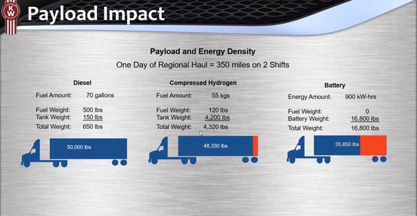

# Week 22

If you think u can parachute in on the Dem nomination, u are even
dumber than your father Fredo... And that guy was dumb.. He was mostly
known for his "oratory skills". He gave an ok speech at the 92 Dem
convention, so he might have helped elect Bill F-ing Clinton with his
"oratory".

---

<iframe width="267" height="150" src="https://www.youtube.com/embed/uH7vOm_qA-A" frameborder="0" allow="accelerometer; autoplay; encrypted-media; gyroscope; picture-in-picture" allowfullscreen></iframe>

---

"‘How can I get funding for my fuelcell bus project?’ Everything you
need to know about financing and planning an FCB project is now at
your fingertips!"

[Link](https://www.fuelcellbuses.eu/category/financing-and-planning)

---

Trump net approval -11%

\#538

---

<blockquote class="twitter-tweet">
The man asked for it <a href="https://t.co/Ay9pcrcqwO">pic.twitter.com/Ay9pcrcqwO</a>
&mdash; 亚历山大🕊🇮🇷 (@MrAlAnderson) <a href="https://twitter.com/MrAlAnderson/status/1266222639170883584?ref_src=twsrc%5Etfw">May 29, 2020</a></blockquote> 

---

<blockquote class="twitter-tweet">
When civility leads to death, revolting is the only logical reaction.   The cries for peace will rain down, and when they do, they will land on deaf ears, because your violence has brought this resistance.  We have the right to fight back!   Rest in Power George Floyd
&mdash; Colin Kaepernick (@Kaepernick7) <a href="https://twitter.com/Kaepernick7/status/1266046129906552832?ref_src=twsrc%5Etfw">May 28, 2020</a></blockquote> 

---

"@n_srnck

Alphabet, Amazon, Apple, Facebook and Microsoft have announced 19
deals this year, according to Refinitiv data from May 26, representing
the fastest pace of acquisitions to this date since 2015."

---

<blockquote class="twitter-tweet">
We found them. <a href="https://t.co/C8zhhvzbyD">https://t.co/C8zhhvzbyD</a> <a href="https://t.co/DrbY2pUols">pic.twitter.com/DrbY2pUols</a>
&mdash; Kaniela Ing (@KanielaIng) <a href="https://twitter.com/KanielaIng/status/1264303214385434624?ref_src=twsrc%5Etfw">May 23, 2020</a></blockquote> 

---

"Green hydrogen developer plans California startup of world's largest
facility ... Plant to produce 40,000 tons/yr, operational by 2023"

---

That thing has Wifi, Bluetooth can run a display, a full-blown computer.
Added bonus, small, with pinned outputs it can control embedded electronics.

<blockquote class="twitter-tweet">
🚨 New Raspberry Pi alert 🚨 The long-rumoured 8GB Raspberry Pi 4 is now available, priced at just $75. Find out more: <a href="https://t.co/TVsJ8yFYkY">https://t.co/TVsJ8yFYkY</a> <a href="https://t.co/kUSiMhsNwn">pic.twitter.com/kUSiMhsNwn</a>
&mdash; Raspberry Pi (@Raspberry_Pi) <a href="https://twitter.com/Raspberry_Pi/status/1265901364225458179?ref_src=twsrc%5Etfw">May 28, 2020</a></blockquote> 

---

"@HelenHet20

Hong Kong was how Communist-party-ruled China and the capital side of
the world economy co-existed. The end of Hong Kong's autonomy
necessarily means there is no way back to the old accommodation"

---

<blockquote class="twitter-tweet">
BREAKING GOOD NEWS ALERT:  New Zealand has announced it no longer has any patients in hospital being treated for coronavirus.  It comes on the fifth straight day where no new cases have been reported.  This is what winning looks like.  🇳🇿 <a href="https://t.co/joWuN5nETt">pic.twitter.com/joWuN5nETt</a>
&mdash; Goodable (@Goodable) <a href="https://twitter.com/Goodable/status/1265463153627889671?ref_src=twsrc%5Etfw">May 27, 2020</a></blockquote> 

---

Ah of course, we are supposed to clap more when shit is
privatized. Gov does lota handholding, spoon-feeds, lets them have
glory, the same ol' work as before, but things are now
private.. Yeeeyyy... clap clap..

---

Launching astronauts to ISS from US soil is a big deal now? 

---

CNN you are a pest whereever you are, whichever country u r in

TR: ".. a franchise of CNN, the US broadcasting giant owned by Warner
Media — has been plunged into the spotlight in the media freedom
controversy"

[Link](https://www.al-monitor.com/pulse/originals/2020/02/turkey-opposition-chp-boycotts-cnnturk-unprecedented-protest.html)

---

It's that parallel universe story.. The moment I saw it I knew it was
a crock. Then I waited to see who'd come down on it. Peter Woit didn't
disappoint.

"I never thought I would see this happen: a university PR department
correcting media hype about its research. You might have noticed this
comment here a week ago, about a flurry of media hype about neutrinos
and parallel universes. ..  The main offender was New Scientist, "

[Link](https://www.math.columbia.edu/~woit/wordpress/?p=11767)

---

<blockquote class="twitter-tweet">
Boy I tell ya. The country re-opened and racism went and clocked in overtime hours.
&mdash; A.T. The Ambassador 🇳🇬🏁 (@OhThatsAT) <a href="https://twitter.com/OhThatsAT/status/1265425694844170241?ref_src=twsrc%5Etfw">May 26, 2020</a></blockquote> 

---

Sweet

"The National Science Foundation (NSF) would get a sweeping
remake—including a new name, a huge infusion of cash, and
responsibility for maintaining U.S. global leadership in
innovation—under bipartisan bills that have just been introduced in
both houses of Congress.

Many scientific leaders are thrilled that the bills call for giving
NSF an additional $100 billion over 5 years to carry out its new
duties. But some worry the legislation, if enacted, could compromise
NSF’s historical mission to explore the frontiers of knowledge without
regard to possible commercial applications"

[Link](https://www.sciencemag.org/news/2020/05/us-lawmakers-unveil-bold-100-billion-plan-remake-nsf)

---

<blockquote class="twitter-tweet">
Hydrogen Primed For Key Role in World’s Greenest Stimulus Plan <a href="https://twitter.com/hashtag/greenrecovery?src=hash&amp;ref_src=twsrc%5Etfw">#greenrecovery</a> <a href="https://twitter.com/hashtag/hydrogen?src=hash&amp;ref_src=twsrc%5Etfw">#hydrogen</a> <a href="https://twitter.com/hashtag/wecantwait?src=hash&amp;ref_src=twsrc%5Etfw">#wecantwait</a> <a href="https://t.co/RqNU8ETLLq">https://t.co/RqNU8ETLLq</a> via <a href="https://twitter.com/YahooFinance?ref_src=twsrc%5Etfw">@YahooFinance</a>
&mdash; RyseHydrogen #wecantwait (@RyseHydrogen) <a href="https://twitter.com/RyseHydrogen/status/1265629233336012801?ref_src=twsrc%5Etfw">May 27, 2020</a></blockquote> 

---

Interesting. A helicopter is more stable than a quadcopter. More
control work needs to be done (constant adjustment) on a quad than on
heli. 

---

<blockquote class="twitter-tweet">
Rolls-Royce and Daimler Trucks have announced plans to jointly develop stationary fuel cell generators as carbon-neutral emergency power generators for safety-critical facilities. <a href="https://twitter.com/hashtag/hydrogen?src=hash&amp;ref_src=twsrc%5Etfw">#hydrogen</a> <a href="https://t.co/LLvnUfkM7F">https://t.co/LLvnUfkM7F</a>
&mdash; Joanna Sampson (@JoSamps92) <a href="https://twitter.com/JoSamps92/status/1265535908566175745?ref_src=twsrc%5Etfw">May 27, 2020</a></blockquote> 

---

<blockquote class="twitter-tweet">
Booooom! <a href="https://twitter.com/hashtag/Hydrogen?src=hash&amp;ref_src=twsrc%5Etfw">#Hydrogen</a> index hits record high. Impressive performance so far. <a href="https://twitter.com/search?q=%24BLDP&amp;src=ctag&amp;ref_src=twsrc%5Etfw">$BLDP</a> <a href="https://twitter.com/search?q=%24PLUG&amp;src=ctag&amp;ref_src=twsrc%5Etfw">$PLUG</a> <a href="https://twitter.com/search?q=%24HEX&amp;src=ctag&amp;ref_src=twsrc%5Etfw">$HEX</a> <a href="https://twitter.com/search?q=%24NEL&amp;src=ctag&amp;ref_src=twsrc%5Etfw">$NEL</a> <a href="https://twitter.com/search?q=%24PCELL&amp;src=ctag&amp;ref_src=twsrc%5Etfw">$PCELL</a> <a href="https://twitter.com/hashtag/ITMPower?src=hash&amp;ref_src=twsrc%5Etfw">#ITMPower</a> <a href="https://twitter.com/hashtag/SFCEnergy?src=hash&amp;ref_src=twsrc%5Etfw">#SFCEnergy</a> <a href="https://twitter.com/hashtag/Linde?src=hash&amp;ref_src=twsrc%5Etfw">#Linde</a> <a href="https://twitter.com/hashtag/AirLiquide?src=hash&amp;ref_src=twsrc%5Etfw">#AirLiquide</a> <a href="https://twitter.com/hashtag/Wasserstoff?src=hash&amp;ref_src=twsrc%5Etfw">#Wasserstoff</a> <a href="https://twitter.com/hashtag/V%C3%A4tgas?src=hash&amp;ref_src=twsrc%5Etfw">#Vätgas</a> <a href="https://t.co/Q4rEDOXl0k">https://t.co/Q4rEDOXl0k</a> <a href="https://t.co/0i7lUkeA5w">pic.twitter.com/0i7lUkeA5w</a>
&mdash; Michel Doepke (@MichelDoepke) <a href="https://twitter.com/MichelDoepke/status/1265319152685912064?ref_src=twsrc%5Etfw">May 26, 2020</a></blockquote> 

---

:):) That F4 was the really bad one wasn't it? 

"@DanStapleton

That makes at least two of us.

@IGN Fantastic Four director Josh Trank has no interest in Fox/Disney
releasing a 'Trank Cut'"

[Link](https://bit.ly/2M16Tj5)

---

A certain focus on essentials, deriving from base theories; this I
usually get from Europeans. For a derivation I was looking for, I
found it on a book written by a Dane based on lecs in Denmark. 

---

Yes, flip it. Do it... Do it now.

<blockquote class="twitter-tweet">
Namaste. Can you flip it? They watch recorded video lectures during their &quot;homework time&quot;. Then you all work on problems together the vast majority of the online time?
&mdash; Edward Patrick Vogel (@MathArt4All) <a href="https://twitter.com/MathArt4All/status/1265104543152517122?ref_src=twsrc%5Etfw">May 26, 2020</a></blockquote> 

---

<blockquote class="twitter-tweet">
6 of DK&#39;s biggest companies <a href="https://twitter.com/Maersk?ref_src=twsrc%5Etfw">@Maersk</a> <a href="https://twitter.com/SAS?ref_src=twsrc%5Etfw">@SAS</a> <a href="https://twitter.com/DSV_AS?ref_src=twsrc%5Etfw">@DSV_AS</a> <a href="https://twitter.com/dfds_uk?ref_src=twsrc%5Etfw">@dfds_uk</a>, <a href="https://twitter.com/CPHairport?ref_src=twsrc%5Etfw">@CPHairport</a> &amp; <a href="https://twitter.com/Orsted?ref_src=twsrc%5Etfw">@Orsted</a> are teaming up to launch a 1,200 kms <a href="https://twitter.com/hashtag/HydrogenNow?src=hash&amp;ref_src=twsrc%5Etfw">#HydrogenNow</a> grid by 2030 would mostly be based on converted former natural gas pipelines<a href="https://t.co/ILjC8UiSMA">https://t.co/ILjC8UiSMA</a>.
&mdash; IEA Hydrogen (@IEA_Hydrogen) <a href="https://twitter.com/IEA_Hydrogen/status/1265391019912298496?ref_src=twsrc%5Etfw">May 26, 2020</a></blockquote> 

---

U know he was personally running that shit.

“A few months ago I told the American people I did not trade arms for hostages. My heart and my best intentions tell me that's true, but the facts and evidence tell me it is not.”

---

Haha.. I like it how he compared current healthcare system to slavery. 

"@RevDrBarber

Somebody said the other day, 'You don't have to change the whole
healthcare system in the middle of a pandemic!' But we changed slavery
in the midst of slavery"

---

<blockquote class="twitter-tweet">
The European Union plans for a green pandemic recovery, with a 10 billion fund targeting <a href="https://twitter.com/hashtag/hydrogen?src=hash&amp;ref_src=twsrc%5Etfw">#hydrogen</a> technology: <a href="https://t.co/H8movA42Nx">https://t.co/H8movA42Nx</a>
&mdash; Nuvera Fuel Cells (@NuveraH2) <a href="https://twitter.com/NuveraH2/status/1265313800963620866?ref_src=twsrc%5Etfw">May 26, 2020</a></blockquote> 

---

Those commitees...

[The House Rules Commitee](https://www.rollingstone.com/politics/politics-news/inside-the-horror-show-that-is-congress-177955/)

[Reform](https://www.politico.com/agenda/story/2018/09/19/house-rules-committee-congress-000699/)

---

"Congressman Richard Neal, who represents the state’s 1st district, has
time and time again blocked popular progressive priorities as the
Chair of the House Ways and Means Committee. ...

This year, he finally faces a real primary challenge from a dynamic
progressive  ...

'Even in the middle of this pandemic here in Holyoke, in this
district, when you look at outcomes, you would never know we have one
of the most powerful members of Congress representing us,' [challenger
Alex Morse] says. 'In the middle of this pandemic, our community
hospital here in Holyoke isn't qualifying for substantial benefit or
aid from the CARES Act'"

[Link](https://m.dailykos.com/stories/2020/5/25/1947592/-This-race-represents-a-rare-golden-opportunity-to-make-Congress-way-more-progressive-with-one-win)

---

This couldn't not happen... Some of the smartest people are in
physics, they had to notice they were stuck in the mud and going
nowhere with string theory. I dont care how many 'eminent' types they
pulled over their side, how much of a religion it became, eventually
reality had to set in.

---

That's good.. so things are improving...

<blockquote class="twitter-tweet">
this is a joke, only a *lot* of people told me it was a bad idea, not all of them
&mdash; Bob (probably) (@knighton_bob) <a href="https://twitter.com/knighton_bob/status/1264979995069419522?ref_src=twsrc%5Etfw">May 25, 2020</a></blockquote> 

---

"@octonion

Pat Tillman was a victim"

---

"@octonion

Like clockwork, Pat Tillman gets rolled out on Memorial Day despite
the wishes of his family, completely ignoring that he was killed by
American troops and all of the other horrifying contexts"

---

"@octonion

You can wear, simultaneously: 

Smart watch 

Smart watch strap (Sony Wena) 

Smart ring (Oura, Echo Loop) 

Smart glasses 

Am I missing anything? I want to be super smart"

---

And.. "human capital stock". Are you buying potatoes from the market asshole?

"@octonion

Is this the same guy with the cubic model? 

'White House adviser Kevin Hassett: 'Our human capital stock is ready
to go back to work.''"

---

Waaaaa waaa waaaa waaa

---

"Work to construct seven wind turbines and a hydrogen plant in Germany
is progressing well.  Comprising the Windpark Salzgitter, three
turbines will be erected on the site of the integrated steelworks
operated by Salzgitter Flachstahl, with four more on the surrounding
group premises"

[Link](https://www.h2-view.com/story/windpark-salzgitter-construction-progressing-well/)

---

<blockquote class="twitter-tweet">
This graph is amazing. It shows that measuring <a href="https://twitter.com/hashtag/SARSCoV2?src=hash&amp;ref_src=twsrc%5Etfw">#SARSCoV2</a> levels in municipal sewage almost perfectly predicts forthcoming <a href="https://twitter.com/hashtag/COVID19?src=hash&amp;ref_src=twsrc%5Etfw">#COVID19</a> cases with a full week&#39;s notice (R=0.994). It&#39;s one of several discoveries in this new study from <a href="https://twitter.com/Yale?ref_src=twsrc%5Etfw">@Yale</a>: <a href="https://t.co/hZVdXebx2D">https://t.co/hZVdXebx2D</a>. C-19 is <a href="https://twitter.com/hashtag/InThePoop?src=hash&amp;ref_src=twsrc%5Etfw">#InThePoop</a> <a href="https://t.co/shNzTKYoYP">pic.twitter.com/shNzTKYoYP</a>
&mdash; Brennan Spiegel, MD, MSHS (@BrennanSpiegel) <a href="https://twitter.com/BrennanSpiegel/status/1265119535901732865?ref_src=twsrc%5Etfw">May 26, 2020</a></blockquote> 

---

Not to let Bam off the hook; whatever improved in 2nd term, it still
wasn't enough. 

---

Now that I think abt it, the Libyan mess is also Obama's 1st term.

---

Likely pattern in the GINI (inequality) plot..? Starting from the
beginning of second Clinton term, until the end of 1st Bam term GINI
becomes worse. It's almost a straight line from Clinton to Obama.
What went wrong in that 2nd Clinton term? W was a mess sure, but
degredation continued throghout Bama's 1st term.

What were the changes for his 2nd term?  I know a lot of Clinton types
were gone by then, including "the Clinton" herself, Summers, f-ing
Rahm 🤔. Is there causality here, or just "W tax cuts expiring" as some
comments suggest.

---

The skinny on Lebanon among IR types is this; every religious, ethnic
group is represented there. So whenever there is conflict between
those groups on the outside, there is conflict among the same groups
on the inside. IOW the situtation in Lebanon is fragile, the setup is
ready to blow, bcz of those groups. Who, which, when; that's like
trying to guess which water molecule will crystallize first in water
when temparature is lowered. Some see that event as a surprise,
"tipping point", an unexpected event; the truth of the matter is temp
is low, and at some point, no matter which part of the water
crystallizes first, the whole thing will turn to ice.

"Noone could have predicted the Lebanon Civil War"

---

<blockquote class="twitter-tweet">
Report forecasts renewables to provide more than three quarters of the UK&#39;s power needs by mid-century, touting the critical role wind energy expansion and green hydrogen development will play in the country&#39;s net zero transition. <a href="https://twitter.com/hashtag/hydrogen?src=hash&amp;ref_src=twsrc%5Etfw">#hydrogen</a> <a href="https://twitter.com/hashtag/wecantwait?src=hash&amp;ref_src=twsrc%5Etfw">#wecantwait</a> <a href="https://t.co/0xbbWwbAps">https://t.co/0xbbWwbAps</a>
&mdash; RyseHydrogen #wecantwait (@RyseHydrogen) <a href="https://twitter.com/RyseHydrogen/status/1265183760238206977?ref_src=twsrc%5Etfw">May 26, 2020</a></blockquote> 

---

1 Million TON

---

"@RyseHydrogen

A leaked EU document, shows a planned “1 Million ton of clean hydrogen
commitment” ranging between EUR 5 billion and EUR 30 billion to be
covered, including funding support for hydrogen and zero-emission
transport"

[Link](https://lnkd.in/dKg8ttw)

---

<blockquote class="twitter-tweet">
6 of DK&#39;s biggest companies <a href="https://twitter.com/Maersk?ref_src=twsrc%5Etfw">@Maersk</a>, <a href="https://twitter.com/SAS?ref_src=twsrc%5Etfw">@SAS</a>, <a href="https://twitter.com/DSV_AS?ref_src=twsrc%5Etfw">@DSV_AS</a>, DFDS, <a href="https://twitter.com/CPHAirports?ref_src=twsrc%5Etfw">@CPHAirports</a> &amp; <a href="https://twitter.com/Orsted?ref_src=twsrc%5Etfw">@Orsted</a> are teaming up to launch one of the world’s largest <a href="https://twitter.com/hashtag/greenhydrogen?src=hash&amp;ref_src=twsrc%5Etfw">#greenhydrogen</a> projects as they look to create <a href="https://twitter.com/hashtag/emissionfree?src=hash&amp;ref_src=twsrc%5Etfw">#emissionfree</a> fuels suitable for ships, trucks, aircraft &amp; heavy industry.<a href="https://t.co/JVslKEMA5n">https://t.co/JVslKEMA5n</a>
&mdash; Hydrogen Europe (@H2Europe) <a href="https://twitter.com/H2Europe/status/1265185453210247170?ref_src=twsrc%5Etfw">May 26, 2020</a></blockquote> 

---

Like I was saying..

"In the mid to late nineteenth century the Ottoman intellectual and
political elite adopted romantic nationalist ideas that equated
Ottomanism with Turkishness. This trend contributed to the alienation
of the non-Turkish subjects of Istanbul, most of them Arabs, from the
Ottoman Empire"

\#10myths

---

"@MaxCRoser

I always found it wrong that - despite huge demand for it - the
world’s best universities did pretty much nothing to increase the
reach of their teaching. Perhaps some universities take the pandemic
as a chance to change their business model and start reaching
millions"

---

"CH troops challenge India at multiple locations in eastern Ladakh,
standoff continues.. troops crossed 3 km into what India perceives to
be its territory South East of the Galwan Valley in eastern Ladakh"

[Link](https://theprint.in/defence/chinese-troops-challenge-india-at-multiple-locations-in-eastern-ladakh-standoff-continues/428304/)

---

Leaders, experts are small in numbers in any field

"@emollick

Internet communities depend on just a few people because of the 90-9-1
rule: 90% of people lurk, 9% contribute a little, 1% do a lot. It is
true on Reddit, where 25% of the most popular subreddits are
administered by 4 people; on Wikipedia (77% is written by 1% of
users!) & more"

---

<blockquote class="twitter-tweet">
Portuguese Government Approves <a href="https://twitter.com/hashtag/Hydrogen?src=hash&amp;ref_src=twsrc%5Etfw">#Hydrogen</a> Strategy, €7B Investments--Portugal’s government recently approved the national strategy for#hydrogen, which foresees investments of 7 billion euros “by 2030--<a href="https://t.co/XZR1yQn5Cu">https://t.co/XZR1yQn5Cu</a> <a href="https://twitter.com/hashtag/hydrogennow?src=hash&amp;ref_src=twsrc%5Etfw">#hydrogennow</a> <a href="https://twitter.com/hashtag/decarbonise?src=hash&amp;ref_src=twsrc%5Etfw">#decarbonise</a> <a href="https://twitter.com/hashtag/fuelcell?src=hash&amp;ref_src=twsrc%5Etfw">#fuelcell</a> <a href="https://twitter.com/hashtag/zeroemissions?src=hash&amp;ref_src=twsrc%5Etfw">#zeroemissions</a> <a href="https://twitter.com/hashtag/h2?src=hash&amp;ref_src=twsrc%5Etfw">#h2</a> <a href="https://t.co/IsQLC57c7f">pic.twitter.com/IsQLC57c7f</a>
&mdash; FuelCellsWorks (@fuelcellsworks) <a href="https://twitter.com/fuelcellsworks/status/1264755938885591047?ref_src=twsrc%5Etfw">May 25, 2020</a></blockquote> 

---

<blockquote class="twitter-tweet">
Pat Tillman called the Iraq War &quot;fucking illegal&quot; and got shot to death by his own men. <a href="https://t.co/gZUkxVFEMR">https://t.co/gZUkxVFEMR</a>
&mdash; Gravel Institute (@GravelInstitute) <a href="https://twitter.com/GravelInstitute/status/1265015401731284992?ref_src=twsrc%5Etfw">May 25, 2020</a></blockquote> 

---

🙄 Tired of this subject. It should never have been made the
centerpiece of political food fight.

"Doubts about that article claiming that hydroxychloroquine /
chloroquine is killing people"

[Link](https://statmodeling.stat.columbia.edu/2020/05/24/doubts-about-that-article-claiming-that-hydroxychloroquine-chloroquine-is-killing-people/)

---

"@jaltucher

We're living in the 'upside down'. Kids can't go to school but I just
saw a job opening for 15 yr olds at the grocery store. Let's put them
at risk of getting a deadly virus delivering canned tuna to rich
people who clap for 2 mins at 7PM but make sure they can't get
educated"

---

CH skeptic Gen Spalding is on TRT World (TR Eng news channel).

---

IMO this quantum stuff is a waste of time for Google. This is the sort
of work gov funds. It is very possible the whole thing is a crock,
and might not bring any benefit to any company in near future.

"In this paper I want to present to you my theory explaining why
computationally superior quantum computing is not possible, discuss
the laws of nature that may support this theory, and describe some
potential connections and applications. .. [T]ghe assertion of a paper
published in *Nature* in October 2019, declaring that 'quantum
computational supremacy' was achieved by a team from Google on a
53-qubit computer, seems to refute my argument. We will describe and
give a preliminary evaluation of Google’s claims. ...

My argument against quantum supremacy and quantum error-correction
Here, in brief, is my argument against quantum computers. ...

(A) From the perspective of computational complexity theory, noisy
intermediate scale quantum (NISQ) circuits are low-level classical
computational devices.

(B) Therefore, by naturalness, NISQ systems do not support quantum
supremacy. In other words, the rate of noise cannot be reduced to the
level allowing quantum supremacy.

(C) Achieving good-quality quantum error-correction requires an even lower noise rate
than the one required for achieving quantum supremacy.

(D) Therefore, NISQ systems do not support quantum error-correction.

(E) Hence, large-scale quantum computing based on quantum
error-correction is beyond reach"

[Link](https://gilkalai.files.wordpress.com/2020/04/laws-blog.pdf)

---

---

<blockquote class="twitter-tweet">
We could hardly believe it when we got a message from Jos Baart telling us that Europe&#39;s biggest owl, the Eurasian eagle-owl, had made a nest in a planter in front of his window. Not only that, she had also hatched three giant chicks!<a href="https://twitter.com/hashtag/vroegevogels?src=hash&amp;ref_src=twsrc%5Etfw">#vroegevogels</a> <a href="https://twitter.com/hashtag/springwatch?src=hash&amp;ref_src=twsrc%5Etfw">#springwatch</a> <a href="https://twitter.com/hashtag/owl?src=hash&amp;ref_src=twsrc%5Etfw">#owl</a> <a href="https://t.co/gz1odkFLYC">pic.twitter.com/gz1odkFLYC</a>
&mdash; Vroege Vogels (@VroegeVogels) <a href="https://twitter.com/VroegeVogels/status/1262331156818771973?ref_src=twsrc%5Etfw">May 18, 2020</a></blockquote> 

---

"Scientists at the US Department of Energy's (DOE) Argonne National
Laboratory have developed platinum-free fuel cell catalysts that can
be used for cheaper hydrogen fuel cell production"

[Link](https://www.h2-view.com/story/platinum-free-catalysts-could-make-cheaper-hydrogen-fuel-cells/)

---

Listening to a debate between a BJP rep (nationalist party in India),
and a lady from oppo. At some pt she angrily says, referring to the
Moslem minority, "I will not let you turn them into a bogey" :) She
probably meant 'boogeyman', came out that way, but with the accent it
was funny. Good-funny.

---

Reducing econ follows

---

:) "Dream on, Klingon" 

---

CleanTechnica: "BP Smacks Exxon Upside Head With New Green Hydrogen
Scheme.. Why, it seems like only yesterday that ExxonMobil was
forecasting a rosy scenario for fossil gas in the sparkling green
economy of the future. Now along comes rival BP with a deep dive into
green hydrogen. Renewable energy is already threatening gas in the
power generation market, and if all goes according to plan renewable
H2 will push gas out of the coveted industrial energy marketplace,
too"

[Link](https://cleantechnica.com/2020/05/18/bp-smacks-exxon-upside-head-with-new-green-hydrogen-scheme)

---

"@bigblackjacobin

Arbitrator that decided in Uber’s favor on the price-fixing lawsuit
said on the record: 'I must say I act out of fear. My fear is if I
ruled Uber illegal, I would need security. I wouldn't be able to walk
the streets at night. People would be after me.'"

---

Retracing Newton's steps.. awesome

[Link](https://youtu.be/M6g-sR-lRCU?t=175)

---

KR was a great show. When I rewatched one ep many yrs later I realized
it was also a serious detective show.

---

Nice. 

"@samaracello

Knight Rider - had quite a few requests for this one and no wonder
because it's a total banger"

[Link](https://twitter.com/samaracello/status/1264211335425990657)

---

Trump net approv -10%

\#538

---

Zombie Apocalypse prep; Cars are useful (they'd be lying around) but
3D travel.. much better.  Both to avoid zombies and get to any elev
easily. Fuel wld be in abandoned gas stations, so everywhere. No need
to worry abt GHG, world wld be empty.

---

Some r still being confused by Trump claims.. [checks non-existing
watch], May 2020.. okay.

"Trump medical claims causing confusion"

---

"Well the Euro sucks, what else is there?". Regulation. Trade
policy. They negotiate as a block; you don't negotiate with a single
country, you negotiate with the entire block. That's a lot of
leverage.

---

I noticed some recurring themes in some journalistic circles related
to EU -- they revolve around "will they unite more?' and 'is this the
end of EU?'  Any new event can trigger this..  Border closures bcz of
COVID..?  IS THIS THE END OF EU?

Mate, the union (and it is a *very* light union) is there bcz it is
beneficial to all parties involved. It will end the moment it stops
being beneficial to those parties. To pinpoint that time, 1 needs to
analyze what made them to come together to begin with..

---

Haha..

Europe unification or not is an ongoing joke 

28:40 "Are we seeing a Federal Europe", answer "that's too far, the
F-word is not being used".

[Link](https://www.youtube.com/watch?v=vghm8fT9qXU)

---

"@crhanep

.. I concur from personal experience, that socializing with colleagues
outside of work does not improve relationships nor
productivity. Working with my remote team over last 9 years has been
A+"

---

Like [this one](../../2020/03/monolith.html), it was bang on. 

---

My automated news collector has *The Atlantic* in the RSS list and I
keep getting good stuff from them. Dont know abt the rest.

---

Full fledged computer with Linux is sold <50 dollars next door
(raspberry pi). 10 yo me wld be very jealous of current me... And 10
yo me wld kill me if I didnt do anything w this tech.

---

"@lougrims

I was today years old when I realized that firmware is called FIRMware
because it's halfway between HARDware and SOFTware..."

---

<blockquote class="twitter-tweet">
A comprehensive $50 million package of support measures has been established to help activate renewable hydrogen industry development in Tasmania.  Project EOI proposal (stage 1) and feasibility study proposal stage is open from now until 18 August 2020.
&mdash; Hydrogen Australia (@HydrogenAus) <a href="https://twitter.com/HydrogenAus/status/1263613596015095809?ref_src=twsrc%5Etfw">May 21, 2020</a></blockquote> 

---

"@internetofshit

in 2050 we'll get a federal holiday just for updating our smart crap

'@mims

just got new headphones and the first thing they asked me to do was
update their firmware

I realize everything is a computer now but c'mon'"

---

<blockquote class="twitter-tweet">
Scientists at the <a href="https://twitter.com/ENERGY?ref_src=twsrc%5Etfw">@ENERGY</a> Argonne National Laboratory have developed platinum-free fuel cell catalysts that can be used for cheaper <a href="https://twitter.com/hashtag/hydrogen?src=hash&amp;ref_src=twsrc%5Etfw">#hydrogen</a> fuel cell production. <a href="https://t.co/acHHx93NX8">https://t.co/acHHx93NX8</a>
&mdash; Joanna Sampson (@JoSamps92) <a href="https://twitter.com/JoSamps92/status/1263404508945747971?ref_src=twsrc%5Etfw">May 21, 2020</a></blockquote> 

---

There is a point when I start the new thing I realize more what looks
more unfinished in the old thing, so in the beginning of the new
thing a lot of old stuff gets done. 🤷‍♂️

---

"@AdamDRains

Guess today is a 'dimensional analysis on the back of a literal
envelope' kind of day"

---

"@msquinn

Took me a month but finally realized that 98% of VC tweets are really
meant for other VCs. (Leaders at high growth cos have no time.)"

---

Richard Hatch (of BSG fame, Apollo) died 2017? Late RIP.

---

