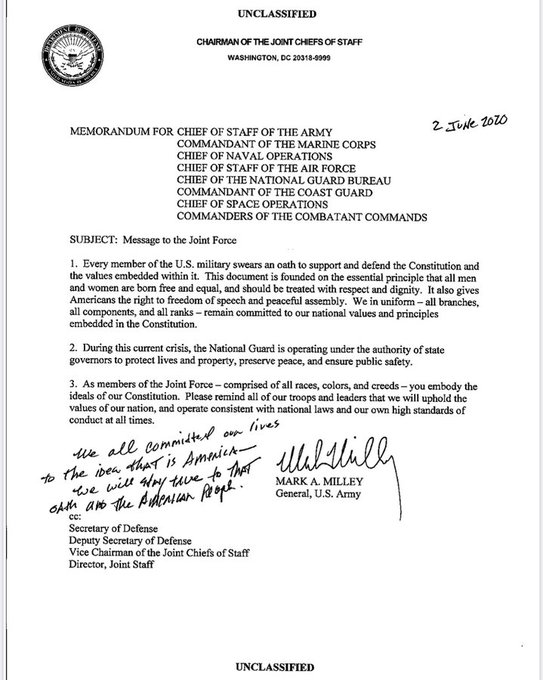

# Week 23

Elvis impersonator singing a Nirvana song. WTF dude

The King - Come as you are \#music

[Link](https://youtu.be/qkbd8mMIXKI)

---

<blockquote class="twitter-tweet"><p lang="en" dir="ltr">A state of emergency has been declared after some 20 000 tonnes of diesel oil leaked into a river within the <a href="https://twitter.com/hashtag/ArcticCircle?src=hash&amp;ref_src=twsrc%5Etfw">#ArcticCircle</a>. The <a href="https://twitter.com/CopernicusEU?ref_src=twsrc%5Etfw">@CopernicusEU</a> <a href="https://twitter.com/hashtag/Sentinel2?src=hash&amp;ref_src=twsrc%5Etfw">#Sentinel2</a> mission shows the extent of the spill, reported to have leaked to 12 km from the accident site. <a href="https://t.co/uUOsYPiVfr">https://t.co/uUOsYPiVfr</a> <a href="https://t.co/BqWiSQwcRN">pic.twitter.com/BqWiSQwcRN</a></p>&mdash; ESA EarthObservation (@ESA_EO) <a href="https://twitter.com/ESA_EO/status/1268805251634774016?ref_src=twsrc%5Etfw">June 5, 2020</a></blockquote> <script async src="https://platform.twitter.com/widgets.js" charset="utf-8"></script>

---

<blockquote class="twitter-tweet"><p lang="en" dir="ltr">More than $3 billion of renewable hydrogen projects are vying for funding from ARENA to build the first commercial scale hydrogen projects in the country. <a href="https://t.co/N8JyTgykBN">https://t.co/N8JyTgykBN</a></p>&mdash; Australian Renewable Energy Agency (@ARENA_aus) <a href="https://twitter.com/ARENA_aus/status/1268742788545314816?ref_src=twsrc%5Etfw">June 5, 2020</a></blockquote> <script async src="https://platform.twitter.com/widgets.js" charset="utf-8"></script>

---

🤣🤣🤣🤣🤣🤣

"Susan Rice Blames ‘Foreign Actors’ for Stirring George Floyd Protests:
‘Right Out of the Russian Playbook’"

---

It's unbelievable how much crit Black Lives Matter slogan gets. It's
clear what it is trying to say. I see variations with "All Lives",
"White Lives", "Buildings". I guess it's a sign of the slogan's
success. But I have to say I do think less of people who play games
with this thing.

---

Who says this was a "working class revolt"? Who gives a shit if it is
or isn't. Does it make the response less or more valid? Con is up in
arms but clearly something needs to change. So pretty please, with
hammer/sickle, macpro, sugar on top... Clean your fucking backyard.

---

At its height even with the threat of a nuke war Soviets came across,
and were, rational. That probably helped avert nuke war more than
anything.. If one side does not think the enem is rational, a jackass,
they cld take diff steps to prevent something.

---

No it's not a generational thing... Half-brained dit "narrativizing"
where there isn't one. "Imma write this deep thing now, bcz, like,
that's how I saw smart people do it".

---

There's a fine line with these provoc articles. That John Bolton
article "To Stop Iranian Bomb, Bomb Iran" might have been
palatable-ish bcz the urgency was not as high and everyone knew
Mustache was a warmonger. Cotton thing in the middle of this mayhem is
a wrong choice, in terms of timing which naturally caused reader
backlash. NYT miscalculated. Obviously free to publish whatever eff
they want. Cotton is wrong IMO, another matter.

---

Sounds like a win for protesters

<blockquote class="twitter-tweet"><p lang="en" dir="ltr">Yes. We are going to dismantle the Minneapolis Police Department and replace it with a transformative new model of public safety. <a href="https://t.co/FCfjoPy64k">https://t.co/FCfjoPy64k</a></p>&mdash; Lisa Bender (@lisabendermpls) <a href="https://twitter.com/lisabendermpls/status/1268644819628224513?ref_src=twsrc%5Etfw">June 4, 2020</a></blockquote> <script async src="https://platform.twitter.com/widgets.js" charset="utf-8"></script>

---

Phones, surveillance, dirtboxes,

[Link](https://mobile.twitter.com/cooperq/status/1267980107781558277)

---

"@kareem_carr

I went on a work outing to the movies once. All my white coworkers
wanted to sneak food in. I told them we'd get searched. Searched? They
had no idea what I was talking about. Halfway through the
conversation, we silently realized the issue. They were white and I
was black"

---

[7-11%](../../2020/04/turks-culture-national-narrative.html#gene).
That makes sense.

---

"@ProudSocialist

Store owners are speaking out and saying they will no longer call the
police because they don’t trust the police to show up without
murdering unarmed black people. If that doesn’t wake you up to how
racist and broken policing in America is then nothing will"

---

<blockquote class="twitter-tweet"><p lang="en" dir="ltr">The numbers are shocking and unprecedented. In a week of protests, the <a href="https://twitter.com/uspresstracker?ref_src=twsrc%5Etfw">@uspresstracker</a> has recorded nearly 250 violations of press freedom rights — and that count keeps climbing. <a href="https://t.co/SeyHMju7mu">https://t.co/SeyHMju7mu</a></p>&mdash; Freedom of the Press (@FreedomofPress) <a href="https://twitter.com/FreedomofPress/status/1268283456179654657?ref_src=twsrc%5Etfw">June 3, 2020</a></blockquote> <script async src="https://platform.twitter.com/widgets.js" charset="utf-8"></script>

---

"@motherboard

The vast majority of the journalists of color on staff at
@PhillyInquirer called out sick on Thursday in protest of leadership's
decision to run an op-ed earlier this week with the headline
'Buildings Matter, Too.'"

---

<blockquote class="twitter-tweet"><p lang="en" dir="ltr">Different angle on 1️⃣1️⃣1️⃣ out of Indianapolis <br><br>From this view you can see the cop grope the woman he&#39;s restraining, that&#39;s why she breaks away<br><br>Then of course a half dozen cops beat her for not wanting to be groped<br><br>Lawlessness <a href="https://t.co/6XXU7qiULj">pic.twitter.com/6XXU7qiULj</a></p>&mdash; T. Greg Doucette (@greg_doucette) <a href="https://twitter.com/greg_doucette/status/1268391718086422528?ref_src=twsrc%5Etfw">June 4, 2020</a></blockquote> <script async src="https://platform.twitter.com/widgets.js" charset="utf-8"></script>

---

"Japan, Germany and France will this fiscal year begin jointly
developing a reusable rocket that can return to Earth after launch.

Reusable rockets are expected to reduce the cost of missions and
provide a welcome boost to the space industry. The project also aims
to utilize a Japan-Europe framework to reduce the gap between the
United States, which is ahead in the practical application of such
technology"

---

"@Greene_DM

We tried the body cameras. We tried the implicit bias training. We
tried hiring different officers. We tried police yoga. These things do
not stop the killing because they do not change the balance of power"

---

"@carterforva

Police in California killed an unarmed, kneeling man by shooting him 5
times. At a protest against police brutality.

'SF resident was kneeling when fatally shot by Vallejo police during
civil unrest sfchronicle.com'"

---

Yeah. Someone up the chain dropped the ball here so we still study all
of that up in this mot..f..ka.

(2nd US Prez) John Adams: "I must study politics and war that my sons
may have liberty to study mathematics and philosophy. My sons ought to
study mathematics and philosophy, geography, natural history, naval
architecture, navigation, commerce, and agriculture in order to give
201their children a right to study paintings, poetry, music,
architecture, statuary, tapestry, and porcelain"

---



---


"@sarahcpr

It is so exhausting being everybody’s one black friend right now"

---

Wasnt sure guy was playing but rest of the thread suggests he might be serious

<blockquote class="twitter-tweet"><p lang="en" dir="ltr">Cops clubbed me and took my bike what the he’ll do I do</p>&mdash; Armin Rosen (@ArminRosen) <a href="https://twitter.com/ArminRosen/status/1268350880115458051?ref_src=twsrc%5Etfw">June 4, 2020</a></blockquote> <script async src="https://platform.twitter.com/widgets.js" charset="utf-8"></script>

---

"@kevinbaker

I don't think you can count on mayors and city councils to do the
right thing, so the trick is going to be making them more afraid of
protests than they are of cops and cop unions. There's evidence that
this is already starting to happen in some cities"

---

<blockquote class="twitter-tweet"><p lang="en" dir="ltr">Maybe these dudes can get a jump in on the way home to justify the absurd expense of this BS stunt <a href="https://t.co/BxTtwzG8Fg">https://t.co/BxTtwzG8Fg</a></p>&mdash; Aaron Stein (@aaronstein1) <a href="https://twitter.com/aaronstein1/status/1268248237141561344?ref_src=twsrc%5Etfw">June 3, 2020</a></blockquote> <script async5 src="https://platform.twitter.com/widgets.js" charset="utf-8"></script>

---

"Russia’s Vladimir Putin endorses policy allowing nuclear retaliation
against conventional attack"

---

<blockquote class="twitter-tweet"><p lang="en" dir="ltr">Women families and children were fired upon with no outlet by PPB. We were all flanked befween Salmon and Taylor off of 4th <a href="https://t.co/eo1J99wHJM">pic.twitter.com/eo1J99wHJM</a></p>&mdash; CAIR-Oregon (@CAIROregon) <a href="https://twitter.com/CAIROregon/status/1268039476938305536?ref_src=twsrc%5Etfw">June 3, 2020</a></blockquote> <script async src="https://platform.twitter.com/widgets.js" charset="utf-8"></script>

---

<blockquote class="twitter-tweet"><p lang="en" dir="ltr">Let me put this out there. This was over the NYPD scanner. HOLD THEM ACCOUNTABLE! <a href="https://t.co/pBu6CnZDtT">pic.twitter.com/pBu6CnZDtT</a></p>&mdash; #BlackLivesMatter (@candidethan) <a href="https://twitter.com/candidethan/status/1267928051557388288?ref_src=twsrc%5Etfw">June 2, 2020</a></blockquote> <script async src="https://platform.twitter.com/widgets.js" charset="utf-8"></script>

---

"@MplsWard3

Politicians who cross the MPD find slowdowns in their wards. After the
first time I cut money from the proposed police budget, I had an
uptick in calls taking forever to get a response, and MPD officers
telling business owners to call their councilman about why it took so
long"

---

"@claytoncubitt

The government can suddenly turn off CitiBikes in NYC, in case you
were wondering why it's still useful to own your own things which
aren't connected to an app or the internet"

---

<blockquote class="twitter-tweet"><p lang="en" dir="ltr">los angeles JUST approved the budget where 54% goes to the LAPD, while this stream has been live. guess we know what moore&#39;s been looking at on his phone. <a href="https://t.co/CV3XeiZXQX">https://t.co/CV3XeiZXQX</a> <a href="https://t.co/gwBa26tsUu">https://t.co/gwBa26tsUu</a> <a href="https://t.co/ql0R9CRmT3">pic.twitter.com/ql0R9CRmT3</a></p>&mdash; no more mr. nut boy (@lilyloo) <a href="https://twitter.com/lilyloo/status/1267954402062565376?ref_src=twsrc%5Etfw">June 2, 2020</a></blockquote> <script async src="https://platform.twitter.com/widgets.js" charset="utf-8"></script>

---

<blockquote class="twitter-tweet"><p lang="en" dir="ltr"><a href="https://twitter.com/hashtag/Brussels?src=hash&amp;ref_src=twsrc%5Etfw">#Brussels</a> hitches industrial hopes to hydrogen: The <a href="https://twitter.com/EU_Commission?ref_src=twsrc%5Etfw">@EU_Commission</a> wants to fund a world-dominating <a href="https://twitter.com/hashtag/hydrogen?src=hash&amp;ref_src=twsrc%5Etfw">#hydrogen</a> market. <a href="https://twitter.com/hashtag/HydrogenNow?src=hash&amp;ref_src=twsrc%5Etfw">#HydrogenNow</a> <a href="https://twitter.com/hashtag/GreenRecovery?src=hash&amp;ref_src=twsrc%5Etfw">#GreenRecovery</a> <a href="https://twitter.com/hashtag/CleanHydrogenAlliance?src=hash&amp;ref_src=twsrc%5Etfw">#CleanHydrogenAlliance</a><br> <a href="https://t.co/SwSIzMNXAZ">https://t.co/SwSIzMNXAZ</a></p>&mdash; Hydrogen Europe (@H2Europe) <a href="https://twitter.com/H2Europe/status/1268208431548284930?ref_src=twsrc%5Etfw">June 3, 2020</a></blockquote> <script async src="https://platform.twitter.com/widgets.js" charset="utf-8"></script>

---

I've taken to saying made-up bad guy lines from Bond movies with that
generic accent... My latest: "Your intransigence is perplexing
Mr. Bond".

That could be a good line.. 

---

FED is doing your job Congress

"@Greene_DM

The Fed will buy Illinois state debt. Good news. Others should follow"

---

<blockquote class="twitter-tweet"><p lang="en" dir="ltr">Włocławek, Poland will soon be the home of a new <a href="https://twitter.com/hashtag/hydrogen?src=hash&amp;ref_src=twsrc%5Etfw">#hydrogen</a> hub that will produce up to 600kg of purified hydrogen per hour. <a href="https://t.co/ARdJw09VXL">https://t.co/ARdJw09VXL</a></p>&mdash; Joanna Sampson (@JoSamps92) <a href="https://twitter.com/JoSamps92/status/1268128228629250048?ref_src=twsrc%5Etfw">June 3, 2020</a></blockquote> <script async src="https://platform.twitter.com/widgets.js" charset="utf-8"></script>

---

CPI YoY % change (inflation). Low.

```
2020-04-01  0.329097
```

[Link](../../2021/01/stats.html)

---

So true... Same goes for internal problems 

Friedman: "In geopolitics there is a key measure known as the 'margin
of error.'  It predicts how much room a country has for making
mistakes.  The margin of error consists of two parts: the types of
danger faced by a nation and the amount of power it possesses. Some
countries have very small margins of error. They tend to obsess over
the smallest detail of foreign policy, aware that the slightest
misstep can be catastrophic.  Israel and Palestine do not have massive
margins of error, because of their small size and their
location. Iceland, on the other hand, has a lot of room for
mistakes. It is small but lives in a roomy neighborhood.  The United
States has a huge margin of error.  It is safe in North America and
has tremendous power. The United States therefore tends to be careless
in how it exercises its power globally.  It's not stupid.  It simply
doesn't need to be more careful—in fact, being more careful could
often reduce its efficiency.  Like a banker prepared to make bad loans
in the expectation that he will do well in the long run, the United
States has a policy of making moves that other countries see as
reckless.  The results would be painful or even devastating for other
countries.  The United States moves on and flourishes"

---

Mountains are natural borders. Why do Indians and the Chinese look so
different even tho they are neighbors? I believe these peoples were
isolated from one another for a long time. It's tough to have
interactions, or war over those mountains. CH seems to be trying very
hard at that Pangong lake in Ladakh tho.

"The Himalaya mountain range separates China from India. This range
spans 1,500 miles throughout five countries"

---

Lemont Hill's a good guy. That was a great defense Palestine some time
ago. I won't forget it ✊

---

“Fuel cells are the only viable solution for commercial UAV operators
who need significant flight time and we will now work closely with our
partners who are based in the US, Korea and Japan.

A retrospectively fitted 2.4kW mounted onto a DJI M600PRO frame with a
9L 300Bar hydrogen cylinder, could achieve a flight time of over 80
minutes compared to just 20 minutes with its battery power pack.”

---

<blockquote class="twitter-tweet"><p lang="en" dir="ltr">UK-based <a href="https://twitter.com/hashtag/fuelcell?src=hash&amp;ref_src=twsrc%5Etfw">#fuelcell</a> engineering company <a href="https://twitter.com/intellenergy?ref_src=twsrc%5Etfw">@intellenergy</a> has established a formal distribution agreement with Korean-based <a href="https://twitter.com/hashtag/UAV?src=hash&amp;ref_src=twsrc%5Etfw">#UAV</a> solutions company <a href="https://twitter.com/hashtag/HogreenAir?src=hash&amp;ref_src=twsrc%5Etfw">#HogreenAir</a>.<a href="https://twitter.com/hashtag/H2View?src=hash&amp;ref_src=twsrc%5Etfw">#H2View</a> <a href="https://twitter.com/hashtag/hydrogen?src=hash&amp;ref_src=twsrc%5Etfw">#hydrogen</a><a href="https://t.co/WRI29dn0ha">https://t.co/WRI29dn0ha</a></p>&mdash; H2 View (@h2_view) <a href="https://twitter.com/h2_view/status/1267839008140386304?ref_src=twsrc%5Etfw">June 2, 2020</a></blockquote> <script async src="https://platform.twitter.com/widgets.js" charset="utf-8"></script>

---

"Sanders unveils proposal for massive overhaul of criminal justice system"

[Link](https://www.politico.com/story/2019/08/18/bernie-sanders-criminal-justice-overhaul-proposal-1466995)

---

"Biden's Proposals for Police Reform Include Banning Chokeholds and 'Weapons of War' for Cops"

[Link](https://www.newsweek.com/bidens-proposals-police-reform-include-banning-chokeholds-weapons-war-cops-1508158)

---

"Colorado AG Weiser: I’ll Sue If President Trump Sends In The Military"

---

This is mental. Good stuff 

Dirty Loops - Work Shit Out \#music

[Link](https://youtu.be/r_GTgpdoCh0?t=49)

---

Cornell West: "I recall my own experience of protesting in
Charlottesville, Virginia, against hundreds of masked, armed Nazis
with live ammunition in which the police stepped back and remained
still and silent as we were mercilessly attacked. Without the
intervention and protection of antifa, some of us would have
died. Sister Heather Heyer did die. I believe the attack on any
innocent person is wrong, but the focus on the protesters’ assaults on
persons or property takes our attention away from the police killing
of hundreds of black, poor and working-class people"

[Link](https://www.theguardian.com/commentisfree/2020/jun/01/george-floyd-protests-cornel-west-american-democracy)

---

<blockquote class="twitter-tweet"><p lang="en" dir="ltr">TURN THE VOLUME UP: This footage is unbelievable!<br><br>This happened today: Philadelphia Police Officers were firing tear gas on peaceful protesters who were TRAPPED on a fenced off hill on the side of a highway!<br><br>THIS IS SAVAGE BRUTALITY!<a href="https://t.co/r5UgBAfAcd">pic.twitter.com/r5UgBAfAcd</a></p>&mdash; Trisha (@Trisha_Tahmasbi) <a href="https://twitter.com/Trisha_Tahmasbi/status/1267658671900762113?ref_src=twsrc%5Etfw">June 2, 2020</a></blockquote> <script async src="https://platform.twitter.com/widgets.js" charset="utf-8"></script>

---

<blockquote class="twitter-tweet"><p lang="en" dir="ltr">a decade&#39;s worth of public/private partnerships have given cops unfettered access to *every piece* of our digital lives. <br><br>here&#39;s how they do it, how tech companies *blatantly lie* to our faces about it, and how we can finally call them out:<a href="https://t.co/4BPi5QF7Xw">https://t.co/4BPi5QF7Xw</a></p>&mdash; shoshana wodinsky (@swodinsky) <a href="https://twitter.com/swodinsky/status/1267870074259542017?ref_src=twsrc%5Etfw">June 2, 2020</a></blockquote> <script async src="https://platform.twitter.com/widgets.js" charset="utf-8"></script>

---

This is the shit.. Mix of red pepper, aubergine.. Bosnian style


---

Yes do it. F#%k history. 

"Adolf Hitler house to be 'neutralised', Austria says.  The government
unveils plans to turn Adolf Hitler's birthplace into a police station"

---

All this mayhem and Trump fail but I am still ignoring centrist dits

---

BWP is prob here to stay. Go drastic reformist on top \#embed

---

YEs.. Minority Report cld be an allagory to Broken Window policing

---

[https://prhyde.eu/](https://prhyde.eu/)

---

"@BCAppelbaum

So far as I can tell, our political leaders are divided between those
who say they support the protesters but have no plans to change
anything, and those who aren’t bothering to pretend"

---

"@JoSamps92

Infinite Blue Energy (IBE) wants to enable a sustainable green
\#hydrogen future from water, solar and wind energy, with no carbon
debt.

@h2_view talked exclusively with its founder and Managing Director
Stephen Gauld"

[Link](https://mobile.twitter.com/JoSamps92/status/1267752529871470592)

---

"The In-Kraut". :):)

Dieter Zimmermann - Whole Lotta Love \#music

[Link](https://youtu.be/r4B_y8E48CQ)

---

i am on some kind of cover station on net radio

---

Much better than the original

Sugarcoma - Crazy \#music

[Link](https://www.youtube.com/watch?v=z3lHMsmKe4E)

---

Rodrigo Y Gabriela - Stairway To Heaven \#music

[Link](https://youtu.be/RjwtbWjNSes?t=172)

---

Cafe is nearly empty. I'd pay effin extra for every place to have this
level of sparseness all the time.

---

Pohlice looks like acting completely outside its element, thoroughly
confused themselves.

<blockquote class="twitter-tweet"><p lang="en" dir="ltr">What the hell? <a href="https://t.co/zbAuvkjJJV">pic.twitter.com/zbAuvkjJJV</a></p>&mdash; Las Vegas Locally 🌴 (@LasVegasLocally) <a href="https://twitter.com/LasVegasLocally/status/1267210841595604992?ref_src=twsrc%5Etfw">May 31, 2020</a></blockquote> <script async src="https://platform.twitter.com/widgets.js" charset="utf-8"></script>

---

I wonder if gov can "embed" social workers in every pol patrol. These
workers wld have completely diff training, wout guns, be there in
every situation. I'd give them some serious pull like a few demerits
from them sends u straight to IA. I'd setup a complete seperate
hierarchy for them, seperate from Mayor.

If police is acting too dug in as we keep seeing, w bunker mentality,
can't reform, u need to crack open that wall let fresh eyes inside.

Two seperate hierarchies are actually used in some gov / militaries to
prevent junta formations.

---

Taibbi: "The early American police forces evolved out of slave
patrols in the South, and “progressed” to enforce the Black Codes from
the Civil War period and beyond, on to Jim Crow through the late
sixties if not longer. ...

Because they’re constantly throwing those people against walls, ..
modern cops correctly perceive that they’re hated. As a result, many
embrace a “warrior” ethos that teaches them to view themselves as
under constant threat.    This is why you see so many knees on heads
and necks, guns drawn on unarmed motorists, chokeholds by the
thousand, and patterns of massive overkill everywhere ...

Police are trained to behave like occupiers, which is why they
increasingly dress like they’ve been sent to clear houses in Mosul"

[Link](https://taibbi.substack.com/p/where-did-policing-go-wrong)

---

<blockquote class="twitter-tweet"><p lang="en" dir="ltr">&quot;No Quarter&quot; was the rallying cry of Confederate soldiers when they met black Union soldiers on the field of battle. It portended mass executions. <a href="https://t.co/wfNbSwBqdQ">https://t.co/wfNbSwBqdQ</a></p>&mdash; Kevin M. Levin (@KevinLevin) <a href="https://twitter.com/KevinLevin/status/1267487405545795584?ref_src=twsrc%5Etfw">June 1, 2020</a></blockquote> <script async src="https://platform.twitter.com/widgets.js" charset="utf-8"></script>

---

*For All Mankind*... it's slow. Shantel VSanten is the bomb

---

What was that UK pol axiom? "Chaos benefits conservatives"? We'll see
how it turns out for US.

---

Frickin military language everywhere.. During 2008 even f'nut econs
were using words like 'shock and awe'

"@missy_ryan

Defense Sec Mark Esper during WH call w governors re civil unrest: "We
need to dominate the battlespace.'"

---

<blockquote class="twitter-tweet"><p lang="en" dir="ltr">We live in farce <a href="https://t.co/7JtuYSZk6Y">https://t.co/7JtuYSZk6Y</a></p>&mdash; Aaron Stein (@aaronstein1) <a href="https://twitter.com/aaronstein1/status/1267522218902335489?ref_src=twsrc%5Etfw">June 1, 2020</a></blockquote> <script async src="https://platform.twitter.com/widgets.js" charset="utf-8"></script>

---

"@NickHanauer

The pitchforks are coming. And when they are here, there will not be a
hole you can dig deep enough to hide from them. Gonna make paying
people enough to live in dignity seem really really cheap"

---

Unresolved Shit Piling Up. That is the headline that describes the world right now.

---

😂😂😂

"Brexit deadline approaches with no deal in sight"

---

<blockquote class="twitter-tweet"><p lang="en" dir="ltr">A no quarter order is a war crime, prohibited even in actual insurrection since Abraham Lincoln&#39;s signed the Lieber Code in 1863. Such an order is banned by international law and would, if carried out, be murder under American law. <a href="https://t.co/YbSw1sM9KW">https://t.co/YbSw1sM9KW</a> <a href="https://t.co/OiNsRT7PPy">https://t.co/OiNsRT7PPy</a></p>&mdash; David French (@DavidAFrench) <a href="https://twitter.com/DavidAFrench/status/1267481733190037505?ref_src=twsrc%5Etfw">June 1, 2020</a></blockquote> <script async src="https://platform.twitter.com/widgets.js" charset="utf-8"></script>

---

<blockquote class="twitter-tweet"><p lang="en" dir="ltr">If actual bad apples killed dozens of people, there would be a national recall of ALL apples.</p>&mdash; Eliza Skinner (@elizaskinner) <a href="https://twitter.com/elizaskinner/status/1267495391064285186?ref_src=twsrc%5Etfw">June 1, 2020</a></blockquote> <script async src="https://platform.twitter.com/widgets.js" charset="utf-8"></script>

---

I dont give much shit abt jobs but the tech is surely ready

<blockquote class="twitter-tweet"><p lang="en" dir="ltr">📽️ Interview of <a href="https://twitter.com/bartbiebuyck?ref_src=twsrc%5Etfw">@bartbiebuyck</a>, <a href="https://twitter.com/fch_ju?ref_src=twsrc%5Etfw">@fch_ju</a><br><br>👔 &quot;We could create 5.4 millions jobs in the <a href="https://twitter.com/hashtag/hydrogen?src=hash&amp;ref_src=twsrc%5Etfw">#hydrogen</a> &amp; <a href="https://twitter.com/hashtag/fuelcell?src=hash&amp;ref_src=twsrc%5Etfw">#fuelcell</a> sector,<br>💶 generate €820Bn of revenues annually - only for this sector!<br>🌍 and we contribute to the environment by reducing CO2 emissions by 560M tonnes every single year!&quot;</p>&mdash; cH2ange (@cH2ange) <a href="https://twitter.com/cH2ange/status/1267474736281518086?ref_src=twsrc%5Etfw">June 1, 2020</a></blockquote> <script async src="https://platform.twitter.com/widgets.js" charset="utf-8"></script>

---

Read my mind

"@samstein

What would really calm down these protestors now is a capital gains
tax suspension on assets bought between now and the end of the year"

---

Hey US would it be possible we do not push already retarded countries
into proxy wars so their democracies do not degrade? Asking for a
friend.

"@joshua_landis

Turkey and Russia are preparing for a large-scale war in Syria claims"

---

Fuckin duplicates.. `sort file | uniq -cd | sort -nr` is your friend.

---

"@noloveformylove

IF YOU TAKE PICTURES AT A PROTEST: DO NOT FORGET TO SCREENSHOT THE
PICTURE AND POST THE SCREENSHOT INSTEAD. IT WIPES THE METADATA SO THEY
CANT LOOK BACK AT THE PICTURES YOU POSTED AND ARREST YOU FOR BEING
THERE. BY WIPING THE METADATA YOU ESSENTIALLY ERASE TIES TO YOUR
CAMERA+"

---

<blockquote class="twitter-tweet"><p lang="en" dir="ltr">“I’m going to crush Chuck Rhoades like that character in the movie crushed that other character in the same movie, or perhaps like a 90s dad rock band’s second album” <a href="https://twitter.com/hashtag/Billions?src=hash&amp;ref_src=twsrc%5Etfw">#Billions</a></p>&mdash; Tim Maughan (@timmaughan) <a href="https://twitter.com/timmaughan/status/1267287129035608065?ref_src=twsrc%5Etfw">June 1, 2020</a></blockquote> <script async src="https://platform.twitter.com/widgets.js" charset="utf-8"></script>

---

<blockquote class="twitter-tweet"><p lang="en" dir="ltr">The US Department of <a href="https://twitter.com/ENERGY?ref_src=twsrc%5Etfw">@Energy</a>’s (DOE’s) <a href="https://twitter.com/fossilenergygov?ref_src=twsrc%5Etfw">@fossilenergygov</a> has announced up to $30 in federal funding for cost-shared research and development projects for small-scale solid oxide <a href="https://twitter.com/hashtag/fuelcell?src=hash&amp;ref_src=twsrc%5Etfw">#fuelcell</a> systems and <a href="https://twitter.com/hashtag/hybrid?src=hash&amp;ref_src=twsrc%5Etfw">#hybrid</a> energy systems.<a href="https://twitter.com/hashtag/H2View?src=hash&amp;ref_src=twsrc%5Etfw">#H2View</a> <a href="https://twitter.com/hashtag/hydrogen?src=hash&amp;ref_src=twsrc%5Etfw">#hydrogen</a><a href="https://t.co/5JQYrtozTH">https://t.co/5JQYrtozTH</a></p>&mdash; H2 View (@h2_view) <a href="https://twitter.com/h2_view/status/1267399396385271808?ref_src=twsrc%5Etfw">June 1, 2020</a></blockquote> <script async src="https://platform.twitter.com/widgets.js" charset="utf-8"></script>

---

<blockquote class="twitter-tweet"><p lang="en" dir="ltr">Do you need accurate rainfall data?<br>Here (<a href="https://t.co/NxYw7zoPOS">https://t.co/NxYw7zoPOS</a>) our free global dataset GPM+<a href="https://twitter.com/hashtag/SM2RAIN?src=hash&amp;ref_src=twsrc%5Etfw">#SM2RAIN</a> 2007-2018<br>👇Map shows regions 🔵 where we expect to be better than ERA5: Africa, Brazil+Argentina, East US, India, N.Australia<br>🙏<a href="https://twitter.com/ESA_EO?ref_src=twsrc%5Etfw">@ESA_EO</a> SMOS+Rainfall<br>🔗<a href="https://t.co/H7AF7MuLS2">https://t.co/H7AF7MuLS2</a> <a href="https://t.co/TSXQuEeWsY">pic.twitter.com/TSXQuEeWsY</a></p>&mdash; Hydrology IRPI-CNR (@Hydrology_IRPI) <a href="https://twitter.com/Hydrology_IRPI/status/1267376128668446722?ref_src=twsrc%5Etfw">June 1, 2020</a></blockquote> <script async src="https://platform.twitter.com/widgets.js" charset="utf-8"></script>

---

I have two other methods to run that difference, significance check,
and could probably dig up a third. Interested parties need to learn
this shit before talking shop on cause and effect.

---

Of course statistical significance is one thing, practical
significance is another. That's another level of critical judgement
that needs to applied to the result. As the Gelman / Hill book says

>Statistical significance does not equal practical significance. For
>example, if the estimated predictive effect of height on earnings were
>10 dollar per inch with a standard error of 2 dollar, this would be
>statistically but not practically significant. Conversely, an estimate
>of 10,000 dollar per inch with a standard error of 10,000 dollar would
>not be statistically significant, but it has the possibility of being
>practically significant (and also the possibility of being zero; that
>is what “not statistically significant” means)."

---

Impeachement was on 2019-12-18? We look at approval data before and
after, 6 months before, 2 months after,

[Data](https://projects.fivethirtyeight.com/trump-approval-data/approval_topline.csv)

```python
import pandas as pd
df = pd.read_csv('/tmp/approval_topline.csv',parse_dates=True,index_col='modeldate')
df = df[['approve_estimate','disapprove_estimate']]
df = df.sort_index(by='modeldate')

df['net'] = df.approve_estimate - df.disapprove_estimate
event = '2019-12-18'; d1 = '2019-06-01'; d2 = '2020-03-01'
df1 = df[(df.index > d1) & (df.index < event)]
df2 = df[(df.index > event) & (df.index < d2)]
print (df1['net'].mean())
print (df2['net'].mean())
```

```text
-11.725994522613066
-9.786354182648402
```

Net approval was lower before impeachement than after.

Is this significant? Let's compare means of both samples, using Welch
two sample t-test,

```python
from statsmodels.stats.weightstats import ttest_ind
print ( ttest_ind(df1['net'], df2['net']) )
```

```text
(-14.416007336365869, 3.970177267005474e-42, 814.0)
```

The hypothesis that they are the same is rejected. Statistically these
numbers are different. So impeachement helped Trump by 2% points.

---

One needs to look at the data and run statistical tests to answer that
question. See above.

"Impeachement hurt Trump"

---

"@uncrushedvelvet

a government that can’t mobilize to house and feed us during a
pandemic but can mobilize to beat us whenever we rise up tells you
exactly where their priorities are"

---

"@tobaccodad

There's a neo Nazi serving life plus 400 years for doing exactly what
I've seen multiple videos of cops doing in different cities right now"

---

"@justinamash

'No justice, no peace.' Is this a threat? A call to violence? No. It
is an acknowledgment that without justice, peace is illusory. There is
no state of peace in a society that condones injustice. The victims of
such injustice, though they may remain silent, do not live in peace"

---

[Revelation 17](https://www.biblegateway.com/passage/?search=Revelation+17&version=NIV)

>The seven heads are seven hills on which the woman sits. They are
>also seven kings. Five have fallen, one is, the other has not yet
>come; but when he does come, he must remain for only a little
>while.  The beast who once was, and now is not, is an eighth king

Daaaaam. Like I said religion is politics, and is against Roman
politics. Guy is talking about Rome in disguise, straight up.

---

"@HelenGymPHL

It's time. Almost three years after Charlottesville, the Rizzo statue
will come down - and the fight for greater justice must continue"

---

"@ThisGuyGetsLit

Hey guys. President and CEO of Antifa here. I tried to change our name
to avoid the presidents classification as a terrorist group, but the
name I chose was al-Nusra Front and then the CIA immediately gave us
500 BGM-TOW antitank missiles and 2 Bearcats. I regret the error"

---

"@H2Bjorn

Fatih Birol said, '...We are not talking about the clean electricity
transitions, we are talking about the clean energy transitions. Hence,
investment in hydrogen, carbon capture, and storage will be critically
important'"

[Link](https://energy.economictimes.indiatimes.com/amp/news/renewable/wont-take-long-for-clean-energy-investments-to-rebound-fatih-birol-iea/76072687)

---

"@brianschatz

I will be introducing an amendment to the National Defense
Authorization Act to discontinue the program that transfers military
weaponry to local police departments"

---

"@samswey

For those who are interested in research-based solutions to stop
police violence, here’s what you need to know - based on the facts and
data. A thread"

[Link](https://twitter.com/samswey/status/1180655701271732224)

---

That song was one old-skool rap... Good rhymes, but boring notes. I
almost prefer mumble rap. Foh dat biih..

---

"@ZakkFlash

Somebody stole an encrypted Chicago police radio and is disrupting
their communications by blasting 'Fuck the Police' by the legendary
NWA"

---


"Rumsfeld: Looting is transition to freedom"

[Link](https://www.upi.com/Defense-News/2003/04/11/Rumsfeld-Looting-is-transition-to-freedom/63821050097983/)

---

Bloody hell.. Looks bad

"@KevinRKrause

She says she was walking home with her groceries when police fired
some sort of pellet in her face. Says she’s not a
protester. \#DallasProtests"

[Link](https://mobile.twitter.com/KevinRKrause/status/1266898396339675137)

---

<blockquote class="twitter-tweet"><p lang="en" dir="ltr">Salt Lake City cops shove down an elderly man with a cane for the crime of standing along the street: <a href="https://t.co/PCLkHqQtJg">pic.twitter.com/PCLkHqQtJg</a></p>&mdash; Timothy Burke (@bubbaprog) <a href="https://twitter.com/bubbaprog/status/1266908354821206016?ref_src=twsrc%5Etfw">May 31, 2020</a></blockquote> <script async src="https://platform.twitter.com/widgets.js" charset="utf-8"></script>

---

Man I feel for Americans.. Getting hit from all directions these
days.

---

I bet [you can't](../../2020/04/asia-minor-population.html)

"Tigger: But I bet I can find our nat roots in the population data"

---

<blockquote class="twitter-tweet"><p lang="en" dir="ltr">So was George Floyd <a href="https://t.co/VpsyY06YY9">https://t.co/VpsyY06YY9</a></p>&mdash; Niggly Wiggly (@TideorDieChick) <a href="https://twitter.com/TideorDieChick/status/1266714132302176256?ref_src=twsrc%5Etfw">May 30, 2020</a></blockquote> <script async src="https://platform.twitter.com/widgets.js" charset="utf-8"></script>

---

"@iamKITTENS

UNDERCOVER COPS AT LA PROTESTS GOT AN ORANGE BAND ON THEIR ARM TO
IDENTIFY EACH OTHER. STAY SAFE AND AWARE OF YOUR SURROUNDINGS"

---

<blockquote class="twitter-tweet"><p lang="en" dir="ltr">this. THIS, is how the Atlanta protest was before the cops turned it into a riot. it was peaceful. they were fighting for justice, this is what the media leaves out <a href="https://t.co/I5jDHERIRz">pic.twitter.com/I5jDHERIRz</a></p>&mdash; zei ll BLM (@harryscnynmoon) <a href="https://twitter.com/harryscnynmoon/status/1266892070775656449?ref_src=twsrc%5Etfw">May 31, 2020</a></blockquote> <script async src="https://platform.twitter.com/widgets.js" charset="utf-8"></script>

---

"@sassysamosa

thinking about the allocation of money being given to cops to dress
like iron man while our doctors are wearing garbage bags to protect
themselves"

---

Not all of it bad..


<blockquote class="twitter-tweet"><p lang="en" dir="ltr">Demonstrators &amp; Police Chiefs from Miami Dade County kneel and say a prayer following the death of <a href="https://twitter.com/hashtag/GeorgeFloyd?src=hash&amp;ref_src=twsrc%5Etfw">#GeorgeFloyd</a> <a href="https://twitter.com/wsvn?ref_src=twsrc%5Etfw">@wsvn</a> <a href="https://twitter.com/hashtag/MiamiDade?src=hash&amp;ref_src=twsrc%5Etfw">#MiamiDade</a> <a href="https://twitter.com/hashtag/7News?src=hash&amp;ref_src=twsrc%5Etfw">#7News</a> <a href="https://twitter.com/hashtag/wsvn?src=hash&amp;ref_src=twsrc%5Etfw">#wsvn</a> <a href="https://twitter.com/OfficialJoelF?ref_src=twsrc%5Etfw">@OfficialJoelF</a> <a href="https://t.co/TurQB2C36y">pic.twitter.com/TurQB2C36y</a></p>&mdash; Franklin White (@FranklinWSVN) <a href="https://twitter.com/FranklinWSVN/status/1266863303978074112?ref_src=twsrc%5Etfw">May 30, 2020</a></blockquote> <script async src="https://platform.twitter.com/widgets.js" charset="utf-8"></script>

---

<blockquote class="twitter-tweet"><p lang="en" dir="ltr">I’m not an expert in police tactics, but I can say that I would not have allowed my soldiers to behave like this in Iraq <a href="https://t.co/2XAlrqC2dC">https://t.co/2XAlrqC2dC</a></p>&mdash; Jim Golby (@jimgolby) <a href="https://twitter.com/jimgolby/status/1267063427291324422?ref_src=twsrc%5Etfw">May 31, 2020</a></blockquote> <script async src="https://platform.twitter.com/widgets.js" charset="utf-8"></script>

---

<blockquote class="twitter-tweet"><p lang="en" dir="ltr">Thanks <a href="https://twitter.com/h2_view?ref_src=twsrc%5Etfw">@h2_view</a> for sharing the story of H2OzBus bringing 100 <a href="https://twitter.com/hashtag/FuelCell?src=hash&amp;ref_src=twsrc%5Etfw">#FuelCell</a> buses to Australia to enable emission-free public transit! <a href="https://twitter.com/gencell?ref_src=twsrc%5Etfw">@gencell</a> seeks to enhance this use case &amp; reduce its costs with <a href="https://twitter.com/hashtag/ammonia?src=hash&amp;ref_src=twsrc%5Etfw">#ammonia</a>. Read more:<a href="https://t.co/s2ydRdYXfs">https://t.co/s2ydRdYXfs</a><a href="https://twitter.com/hashtag/FuelCells?src=hash&amp;ref_src=twsrc%5Etfw">#FuelCells</a> <a href="https://twitter.com/hashtag/CleanFueling?src=hash&amp;ref_src=twsrc%5Etfw">#CleanFueling</a> <a href="https://twitter.com/hashtag/SayNoToDiesel?src=hash&amp;ref_src=twsrc%5Etfw">#SayNoToDiesel</a></p>&mdash; GenCell Energy (@gencellenergy) <a href="https://twitter.com/gencellenergy/status/1267109856462454785?ref_src=twsrc%5Etfw">May 31, 2020</a></blockquote> <script async src="https://platform.twitter.com/widgets.js" charset="utf-8"></script>

---

"@lizzieohreally

I feel the soundtrack of last few months for New Yorkers has been
constant sirens, just different reasons"

---

<blockquote class="twitter-tweet"><p lang="en" dir="ltr">The military is monitoring protests in *six states* plus Minnesota, per Pentagon docs leaked to me.<br><br>“We’re a combat unit not trained for riot control or safely handling civilians in this context,” National Guard member deployed to Minnesota told me:<a href="https://t.co/Ee9jNcJih1">https://t.co/Ee9jNcJih1</a> <a href="https://t.co/I0uZXXWv38">pic.twitter.com/I0uZXXWv38</a></p>&mdash; Ken Klippenstein (@kenklippenstein) <a href="https://twitter.com/kenklippenstein/status/1266895430643826689?ref_src=twsrc%5Etfw">May 31, 2020</a></blockquote> <script async src="https://platform.twitter.com/widgets.js" charset="utf-8"></script>

---

"@StevieOakley

I bet Canada feels like they live in the Apartment above a Meth Lab
right about now.."

---

"@BCAppelbaum

Americans have the right to gather and protest. The police are paid
and empowered to protect our ability to exercise our rights. Instead,
night after night, many police departments are treating protesters as
enemies"

---

Sleeping Satellite - Tasmin Archer \#music

[Link](https://youtu.be/MqRoSjzzATE)

---

The race problems due to pol brutality and ppl wondering how to fix it
always reminds me that joke with patient going to doctor saying 'Doc
it hurts when I move my arm this way'. What does the doctor say?  Tho
flippant that's the answer.

---

<blockquote class="twitter-tweet"><p lang="en" dir="ltr">Protests started in Erie.. a girl here was peacefully protesting, after 15 minutes she was maced and kicked.. <a href="https://twitter.com/hashtag/PoliceBrutality?src=hash&amp;ref_src=twsrc%5Etfw">#PoliceBrutality</a> <a href="https://t.co/nC6HhXMpCe">pic.twitter.com/nC6HhXMpCe</a></p>&mdash; Nick / nak5132 🍐 (@the7goonies) <a href="https://twitter.com/the7goonies/status/1266989439160590336?ref_src=twsrc%5Etfw">May 31, 2020</a></blockquote> <script async src="https://platform.twitter.com/widgets.js" charset="utf-8"></script>

---

<blockquote class="twitter-tweet"><p lang="en" dir="ltr">It turns out <a href="https://twitter.com/amyklobuchar?ref_src=twsrc%5Etfw">@amyklobuchar</a> could’ve saved George Floyd’s life if she’d only done her job as Hennepin County Attorney and prosecuted Ex-Cop Derek Chauvin instead of tossing poor blacks in jail in order to win Republican votes and saunter into the Senate. <a href="https://twitter.com/hashtag/JusticeForGeorgeFloyd?src=hash&amp;ref_src=twsrc%5Etfw">#JusticeForGeorgeFloyd</a></p>&mdash; RealTimBlack (@RealTimBlack) <a href="https://twitter.com/RealTimBlack/status/1266170494950178818?ref_src=twsrc%5Etfw">May 29, 2020</a></blockquote> <script async src="https://platform.twitter.com/widgets.js" charset="utf-8"></script>

---

If u paid attn to the man instead of shouting him down u'd be in much
pos today wouldnt you? \#cap

---

<blockquote class="twitter-tweet"><p lang="en" dir="ltr">See what I mean? <a href="https://t.co/PJ3yKdAcUY">https://t.co/PJ3yKdAcUY</a></p>&mdash; Vincent Goodwill (@VinceGoodwill) <a href="https://twitter.com/VinceGoodwill/status/1266566281345540096?ref_src=twsrc%5Etfw">May 30, 2020</a></blockquote> <script async src="https://platform.twitter.com/widgets.js" charset="utf-8"></script>

---

<blockquote class="twitter-tweet"><p lang="en" dir="ltr">I’m from the future, make sure you add dawn of the dead</p>&mdash; Marcus (@STOPFLEXIN) <a href="https://twitter.com/STOPFLEXIN/status/1266982896767766528?ref_src=twsrc%5Etfw">May 31, 2020</a></blockquote> <script async src="https://platform.twitter.com/widgets.js" charset="utf-8"></script>

---

<blockquote class="twitter-tweet"><p lang="en" dir="ltr">Tonight summed up in a single picture <a href="https://t.co/0xHVFJtzz9">pic.twitter.com/0xHVFJtzz9</a></p>&mdash; RIOTWAVE (@inteldotwav) <a href="https://twitter.com/inteldotwav/status/1266966138539442177?ref_src=twsrc%5Etfw">May 31, 2020</a></blockquote> <script async src="https://platform.twitter.com/widgets.js" charset="utf-8"></script>

---

<blockquote class="twitter-tweet"><p lang="en" dir="ltr">Don’t think that’s legal <a href="https://t.co/R8Q65fPVX2">https://t.co/R8Q65fPVX2</a></p>&mdash; Ryan Grim (@ryangrim) <a href="https://twitter.com/ryangrim/status/1266853926831300608?ref_src=twsrc%5Etfw">May 30, 2020</a></blockquote> <script async src="https://platform.twitter.com/widgets.js" charset="utf-8"></script>

---

<blockquote class="twitter-tweet"><p lang="en" dir="ltr">it’s called the market house because that’s where people were sold. imagine how haunted a place like that is. how much sorrow lives in the soil. inhumanity is built into its very bedrock. burn it to the ground. <a href="https://t.co/EneRAXqJsD">https://t.co/EneRAXqJsD</a></p>&mdash; the room? read it! (@zootytang) <a href="https://twitter.com/zootytang/status/1266883446158360583?ref_src=twsrc%5Etfw">May 31, 2020</a></blockquote> <script async src="https://platform.twitter.com/widgets.js" charset="utf-8"></script>

---

"@justinamash

Violence will not bring justice, and silence will not bring
peace. Speak out. Take action. The callous murder of George Floyd
symbolizes the cold indifference of too many legislators, police and
prosecutors, judges and juries. We have denied justice. We have
prevented peace"

---

<blockquote class="twitter-tweet"><p lang="en" dir="ltr">people (Dems!) that were telling me it was unrealistic to get universal healthcare in 4 years are talking about a moonbase by 2025 lol</p>&mdash; Tim Maughan (@timmaughan) <a href="https://twitter.com/timmaughan/status/1266923141105844224?ref_src=twsrc%5Etfw">May 31, 2020</a></blockquote> <script async src="https://platform.twitter.com/widgets.js" charset="utf-8"></script>

---

😆😆😆 Guy has a f-ing guillotine at home

<blockquote class="twitter-tweet"><p lang="en" dir="ltr">My friend brought out his guillotine tonight. <a href="https://t.co/gZ6PtVY80S">pic.twitter.com/gZ6PtVY80S</a></p>&mdash; Search4Swag (@search4swag) <a href="https://twitter.com/search4swag/status/1266913484740182016?ref_src=twsrc%5Etfw">May 31, 2020</a></blockquote> <script async src="https://platform.twitter.com/widgets.js" charset="utf-8"></script>

---

<blockquote class="twitter-tweet"><p lang="en" dir="ltr">Just one quick example of the many ways peaceful protest was met with police violence tonight for absolutely no reason at the Denver <a href="https://twitter.com/hashtag/GeorgeFloydprotest?src=hash&amp;ref_src=twsrc%5Etfw">#GeorgeFloydprotest</a> <a href="https://t.co/hZkwVyB6Dj">pic.twitter.com/hZkwVyB6Dj</a></p>&mdash; Jeremiah Red🌹 (@_Floodlight) <a href="https://twitter.com/_Floodlight/status/1266953965423300608?ref_src=twsrc%5Etfw">May 31, 2020</a></blockquote> <script async src="https://platform.twitter.com/widgets.js" charset="utf-8"></script>

---

<blockquote class="twitter-tweet"><p lang="en" dir="ltr">For many on the right, there’s simply no respectable way for black people to protest when cops harass, beat, and kill them. But if, say, you’re asked to stay at home to prevent old and vulnerable people from dying, then by all means, march on the state capital with your AR. <a href="https://t.co/RMCXQEQLKS">https://t.co/RMCXQEQLKS</a></p>&mdash; Radley Balko (@radleybalko) <a href="https://twitter.com/radleybalko/status/1266955318120103939?ref_src=twsrc%5Etfw">May 31, 2020</a></blockquote> <script async src="https://platform.twitter.com/widgets.js" charset="utf-8"></script>

---

@gravity_levity

I think I was well past a PhD in physics before I realized that a rocket never actually has to achieve "escape velocity" in order to escape earth's orbit. It can be lifted arbitrarily slowly, so long as the thrust always exceeds the local gravitational force.

---

@drewmckevitt

There's actually a great deal of evidence that police violence is so much more pervasive and deadly in the United States precisely because there are so many guns here. Police tactics have evolved to assume everyone is potentially an armed enemy prepared to kill them

---

You don't know what ur [talking about](../../2020/07/kurds-anatolia.html#opressword)...

"You say TR identity is used in an opressive way. It can't be that bad.."

---	    

"@bartbiebuyck

Seven European countries ministers are expressing their joint support
for a H2 ambition"

[PDF](https://benelux.int/files/1615/9077/7640/jointpoliticaldeclaration.pdf)

---

<blockquote class="twitter-tweet"><p lang="en" dir="ltr">Netherlands, Germany want to scale up breakthrough technology <a href="https://t.co/LefT2uOmAY">https://t.co/LefT2uOmAY</a></p>&mdash; Bloomberg Green (@climate) <a href="https://twitter.com/climate/status/1266328008496988160?ref_src=twsrc%5Etfw">May 29, 2020</a></blockquote> <script async src="https://platform.twitter.com/widgets.js" charset="utf-8"></script>

---

<blockquote class="twitter-tweet"><p lang="en" dir="ltr"><a href="https://twitter.com/hashtag/HydrogenNow?src=hash&amp;ref_src=twsrc%5Etfw">#HydrogenNow</a> Kick-starting a clean <a href="https://twitter.com/hashtag/hydrogen?src=hash&amp;ref_src=twsrc%5Etfw">#hydrogen</a> economy in Europe is a key pillar of the €750bn recovery plan unveiled this week by the European Union. <a href="https://t.co/1tZLADIIyi">https://t.co/1tZLADIIyi</a></p>&mdash; Symbio (@SymbioFCell) <a href="https://twitter.com/SymbioFCell/status/1266613196732981248?ref_src=twsrc%5Etfw">May 30, 2020</a></blockquote> <script async src="https://platform.twitter.com/widgets.js" charset="utf-8"></script>

---

<blockquote class="twitter-tweet"><p lang="en" dir="ltr">“A riot is the language of the unheard, and what is it that America has failed to hear?”<br><br>-Martin Luther King, Jr.<a href="https://twitter.com/hashtag/GeorgeFloyd?src=hash&amp;ref_src=twsrc%5Etfw">#GeorgeFloyd</a> <a href="https://twitter.com/hashtag/BlackLivesMatter?src=hash&amp;ref_src=twsrc%5Etfw">#BlackLivesMatter</a> <a href="https://twitter.com/hashtag/PoliceBrutality?src=hash&amp;ref_src=twsrc%5Etfw">#PoliceBrutality</a> <a href="https://twitter.com/hashtag/America?src=hash&amp;ref_src=twsrc%5Etfw">#America</a> <a href="https://t.co/WFmThT3UZD">pic.twitter.com/WFmThT3UZD</a></p>&mdash; ISIAH JAMES🌹 (@isiah4congress) <a href="https://twitter.com/isiah4congress/status/1266470941879676928?ref_src=twsrc%5Etfw">May 29, 2020</a></blockquote> <script async src="https://platform.twitter.com/widgets.js" charset="utf-8"></script>

---

[](http://www.youtube.com/watch?v=zlj7hMkEYvA)

---

<blockquote class="twitter-tweet"><p lang="en" dir="ltr">The way that certain tech plutocrats have latched onto philosophical terms and used them to make themselves sound smarter or more educated is really something</p>&mdash; Susan Fowler (@susanthesquark) <a href="https://twitter.com/susanthesquark/status/1266396594947022848?ref_src=twsrc%5Etfw">May 29, 2020</a></blockquote> <script async src="https://platform.twitter.com/widgets.js" charset="utf-8"></script>

---

"@IEA_Hydrogen

Hydrogen-based fuel takes the spotlight for India’s renewable energy
future. State-run @IndianOilcl is building a long-term renewable
energy transition strategy that is turning its attention to toward
\#HydrogenNow based fuel"

---

<blockquote class="twitter-tweet"><p lang="en" dir="ltr">“Beijing wants to keep the benefits it reaps from Hong Kong’s status as a free and independent place while taking away those very freedoms. This is our opportunity to make China understand it can’t do both.” <a href="https://twitter.com/hashtag/MakeChinaPay?src=hash&amp;ref_src=twsrc%5Etfw">#MakeChinaPay</a> <a href="https://twitter.com/hashtag/StandwithHK?src=hash&amp;ref_src=twsrc%5Etfw">#StandwithHK</a> <a href="https://twitter.com/hashtag/HKexit?src=hash&amp;ref_src=twsrc%5Etfw">#HKexit</a> <a href="https://twitter.com/hashtag/china?src=hash&amp;ref_src=twsrc%5Etfw">#china</a> <a href="https://t.co/dcoB5iRCEA">https://t.co/dcoB5iRCEA</a></p>&mdash; 🇺🇸Kyle Bass🇺🇸 (@Jkylebass) <a href="https://twitter.com/Jkylebass/status/1266116389334646785?ref_src=twsrc%5Etfw">May 28, 2020</a></blockquote> <script async src="https://platform.twitter.com/widgets.js" charset="utf-8"></script>

---

<blockquote class="twitter-tweet"><p lang="en" dir="ltr">People who forget relational databases are condemned to reinvent them <a href="https://t.co/pUwVQkogoQ">https://t.co/pUwVQkogoQ</a></p>&mdash; Saurabh Bhatnagar (@analyticsaurabh) <a href="https://twitter.com/analyticsaurabh/status/998758626528518145?ref_src=twsrc%5Etfw">May 22, 2018</a></blockquote> <script async src="https://platform.twitter.com/widgets.js" charset="utf-8"></script>

---

<blockquote class="twitter-tweet"><p lang="en" dir="ltr">Clean hydrogen is one of the top priorities in our energy transition. Europe is, and can remain, a world leader if we get our investments right. <a href="https://twitter.com/hashtag/GreenRecovery?src=hash&amp;ref_src=twsrc%5Etfw">#GreenRecovery</a> <a href="https://twitter.com/hashtag/EUGreenDeal?src=hash&amp;ref_src=twsrc%5Etfw">#EUGreenDeal</a> <a href="https://t.co/rsryiQGChP">pic.twitter.com/rsryiQGChP</a></p>&mdash; Frans Timmermans (@TimmermansEU) <a href="https://twitter.com/TimmermansEU/status/1265944672519798784?ref_src=twsrc%5Etfw">May 28, 2020</a></blockquote> <script async src="https://platform.twitter.com/widgets.js" charset="utf-8"></script>

---

Of course he did. There was the right focus on science, all the
reforms that were talked about in the past 100+ yrs were
enacted. Changing the alphabet, women's rights, etc. The problem is
with the national narrative, which bordered on the fantastical. But
what makes it worse is how Kemal enmeshed his persona in those fairy
tales so now seperating the two is impossible. But it needs to be
done. A new Republic possibly. The French do that, no? They number
them too, like 1st, 2nd..?

"But didn't Kemal of TR do some good stuff?"

---

